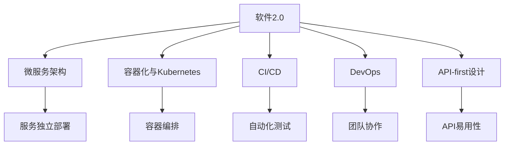
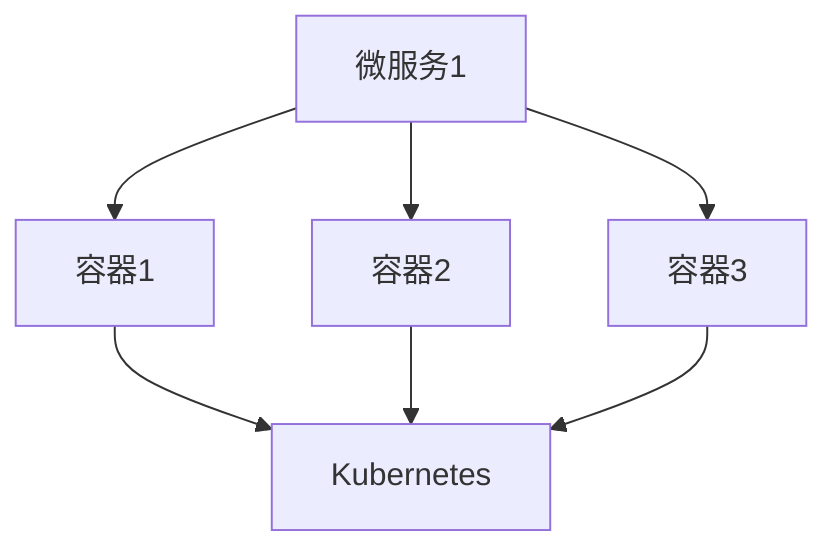

                 

# 软件2.0的优势：为何要将复杂程序移植其中

在过去数十年的软件开发中，程序员们一直遵循着软件1.0的范式，即从底层的机器指令开始编码，通过一层层抽象实现应用逻辑。然而，随着技术的进步和市场的变化，这种范式逐渐显现出其局限性，亟需新的发展方向。软件2.0的提出，正是解决这一问题的重要尝试。

## 1. 背景介绍

### 1.1 问题由来

随着人工智能、大数据、云计算等技术的飞速发展，软件行业的生态和应用场景也发生了巨大的变化。传统的软件1.0范式在许多新场景下显得力不从心，无法快速响应市场需求，也无法有效利用新兴技术。

在AI领域，需要处理的数据量呈指数级增长，数据特征复杂多样，传统的编程方式难以适应。在云计算领域，复杂的分布式系统设计、多租户资源管理等也超出了传统软件开发的能力范围。在移动应用领域，对用户体验的极致追求和快速迭代的需求，也对软件的开发速度和灵活性提出了更高要求。

为了应对这些挑战，软件2.0应运而生，它强调软件的可组合性、复用性和自动化，能够快速构建和部署复杂的应用系统，以满足不断变化的市场需求。

### 1.2 问题核心关键点

软件2.0的核心思想是通过模块化、组件化的方式，构建可复用、可组合的软件模块和组件，并利用自动化工具和开发平台，快速构建和部署复杂的应用系统。这种范式能够显著提升软件开发效率，缩短开发周期，降低开发成本。

其关键点包括：

- **模块化与组件化**：将软件分解为可复用的模块和组件，通过接口进行调用和组合。
- **自动化与工具链**：使用自动化工具和开发平台，提高开发效率，降低开发门槛。
- **微服务架构**：将复杂的系统拆分为多个小型、自治的服务，实现服务的独立部署和扩展。
- **云计算支持**：利用云平台提供的资源和服务，实现分布式应用的快速部署和扩展。

这些关键点共同构成了软件2.0的技术体系，使得软件开发更加灵活、高效、可扩展。

## 2. 核心概念与联系

### 2.1 核心概念概述

为更好地理解软件2.0的优势及其关键技术，本节将介绍几个核心概念：

- **软件2.0**：一种全新的软件开发范式，通过模块化、组件化和自动化，提升软件开发的效率和灵活性。
- **微服务架构**：将大型系统拆分为多个小型、自治的服务，每个服务独立部署，便于维护和扩展。
- **容器化与Kubernetes**：使用容器技术封装应用，通过Kubernetes进行容器编排和管理，实现应用的快速部署和弹性扩展。
- **CI/CD**：持续集成和持续部署流程，利用自动化工具和平台，实现代码的快速构建、测试和发布。
- **DevOps**：软件开发和运维团队紧密合作，通过自动化工具和流程，提升软件的发布速度和质量。
- **API-first设计**：在软件设计和开发中，以API为中心，优先考虑API的可用性和易用性，促进组件的复用和组合。

这些概念之间的逻辑关系可以通过以下Mermaid流程图来展示：



这个流程图展示了大语言模型的核心概念及其之间的关系：

1. 软件2.0通过模块化和组件化提升系统的灵活性。
2. 微服务架构将系统拆分为独立服务，便于管理和扩展。
3. 容器化和Kubernetes技术，使得服务部署和管理更加灵活和高效。
4. CI/CD流程，提高了代码构建和发布的效率和质量。
5. DevOps文化，加强了开发和运维团队之间的协作。
6. API-first设计，促进组件的复用和组合。

这些概念共同构成了软件2.0的技术框架，使其能够适应快速变化的市场需求和新兴技术的发展。

## 3. 核心算法原理 & 具体操作步骤
### 3.1 算法原理概述

软件2.0的核心算法原理主要包括以下几个方面：

- **模块化和组件化**：通过将软件分解为可复用的模块和组件，提升软件的可维护性和复用性。
- **微服务架构**：将大型系统拆分为多个小型、自治的服务，每个服务独立部署，便于维护和扩展。
- **容器化与Kubernetes**：使用容器技术封装应用，通过Kubernetes进行容器编排和管理，实现应用的快速部署和弹性扩展。
- **CI/CD流程**：利用自动化工具和平台，实现代码的快速构建、测试和发布。
- **DevOps文化**：通过自动化工具和流程，提升软件的发布速度和质量，加强开发和运维团队的协作。
- **API-first设计**：在软件设计和开发中，以API为中心，优先考虑API的可用性和易用性，促进组件的复用和组合。

这些原理共同构成了软件2.0的技术基础，使得软件开发更加高效、灵活和可扩展。

### 3.2 算法步骤详解

软件2.0的实施步骤通常包括以下几个关键环节：

**Step 1: 需求分析和系统设计**
- 确定系统需求和目标，进行系统架构设计，选择适合的微服务架构模式。
- 设计系统组件和模块，确定各个组件的功能和接口。

**Step 2: 组件开发和集成**
- 根据设计方案，开发各个组件和服务，确保组件的独立性和可复用性。
- 使用容器技术对组件进行封装，确保组件的快速部署和扩展。

**Step 3: 自动化流程构建**
- 构建持续集成和持续部署(CI/CD)流程，实现代码的自动化构建、测试和发布。
- 利用自动化工具和平台，提升开发和发布效率，降低出错概率。

**Step 4: DevOps实践和团队协作**
- 推行DevOps文化，加强开发和运维团队的协作，提升软件发布速度和质量。
- 通过监控和反馈机制，及时发现和解决问题，保障软件系统的稳定运行。

**Step 5: API-first设计和文档编写**
- 以API为中心进行设计和开发，优先考虑API的可用性和易用性。
- 编写详细的API文档，促进组件的复用和组合，提升系统的灵活性和扩展性。

通过以上步骤，可以实现软件2.0的全面部署和应用，构建高效、灵活、可扩展的软件系统。

### 3.3 算法优缺点

软件2.0相对于软件1.0，具有以下优点：

1. **高效开发**：通过模块化和组件化，提升软件的开发效率和复用性。
2. **灵活扩展**：微服务架构和容器化技术，使得系统的扩展和维护更加灵活。
3. **自动化提升**：CI/CD流程和DevOps文化，提高代码构建和发布的效率和质量。
4. **协作增强**：DevOps文化，加强开发和运维团队的协作，提升软件的整体质量。

然而，软件2.0也存在一些缺点：

1. **学习曲线陡峭**：新概念和新工具的应用，增加了学习和上手的难度。
2. **成本较高**：初期投资较大，需要购买和配置相关工具和平台。
3. **管理复杂**：多个组件和服务的协同管理，增加了运维的复杂性。

尽管如此，软件2.0的优点和潜力仍然使其成为软件开发的重要方向。

### 3.4 算法应用领域

软件2.0的应用领域非常广泛，涵盖了软件开发、运维管理、云计算等多个方面：

- **软件开发**：用于构建复杂的软件应用系统，提升开发效率和系统灵活性。
- **运维管理**：通过自动化工具和流程，提升系统运维效率和质量。
- **云计算**：利用云平台提供的资源和服务，实现应用的快速部署和扩展。
- **企业应用**：构建高效的企业级应用系统，提升企业的市场竞争力。
- **互联网应用**：用于构建大规模的互联网应用，提升用户体验和服务质量。
- **金融应用**：构建安全的金融系统和交易平台，保障数据安全和交易稳定。

## 4. 数学模型和公式 & 详细讲解 & 举例说明

### 4.1 数学模型构建

软件2.0的数学模型构建主要包括以下几个方面：

- **模块化和组件化**：将系统分解为多个模块和组件，每个组件具有独立的功能和接口。
- **微服务架构**：将系统拆分为多个小型、自治的服务，每个服务独立部署和扩展。
- **容器化与Kubernetes**：使用容器技术封装应用，通过Kubernetes进行容器编排和管理。
- **CI/CD流程**：利用自动化工具和平台，实现代码的快速构建、测试和发布。
- **DevOps文化**：通过自动化工具和流程，提升软件的发布速度和质量，加强开发和运维团队的协作。
- **API-first设计**：在软件设计和开发中，以API为中心，优先考虑API的可用性和易用性。

### 4.2 公式推导过程

以下我们以微服务架构的数学模型为例，推导其基本原理和公式。

假设系统由 $N$ 个微服务组成，每个微服务独立部署，运行在容器 $C_i$ 中，其中 $i=1,2,\cdots,N$。容器化后的微服务，可以通过Kubernetes进行编排和管理，其基本架构如下图所示：



微服务架构的关键在于，通过容器化和Kubernetes，实现服务的快速部署和扩展。假设系统负载为 $L$，每个微服务的处理能力为 $S_i$，则系统的总处理能力为：

$$
C_{\text{total}} = \sum_{i=1}^N S_i
$$

在微服务架构中，可以通过动态扩展容器数量，来调整系统的总处理能力，适应不同的负载需求。假设当前系统负载为 $L_0$，每个容器的最大处理能力为 $S_{\text{max}}$，则需要部署的容器数量为 $N_0$，满足：

$$
L_0 = N_0 \times S_{\text{max}}
$$

当系统负载增加到 $L_1$ 时，可以部署新的容器 $C_{N_0+1}$，增加系统的总处理能力，满足：

$$
L_1 = (N_0 + 1) \times S_{\text{max}}
$$

通过这种方式，微服务架构可以实现系统的快速扩展和弹性管理。

### 4.3 案例分析与讲解

以下以一个实际案例，展示如何使用软件2.0构建一个高效的电商平台：

**需求**：构建一个支持用户注册、登录、商品搜索、购物车、订单管理等功能的电商平台。

**系统设计**：将系统分解为以下模块和组件：

- 用户模块：处理用户注册、登录、用户信息管理等功能。
- 商品模块：处理商品信息管理、搜索、分类等功能。
- 购物车模块：处理购物车添加、删除、计算等功能。
- 订单模块：处理订单生成、支付、物流跟踪等功能。
- 支付模块：处理支付接口和支付结果的展示。

**组件开发和集成**：开发各个模块和组件，使用容器技术进行封装，确保组件的独立性和可复用性。例如，使用Docker容器封装用户模块，在Kubernetes中进行部署和管理。

**自动化流程构建**：构建持续集成和持续部署(CI/CD)流程，实现代码的快速构建、测试和发布。例如，使用Jenkins实现自动化构建和测试，使用Docker Compose进行本地开发和测试，使用Kubernetes进行生产环境的部署和扩展。

**DevOps实践和团队协作**：推行DevOps文化，加强开发和运维团队的协作，提升软件发布速度和质量。例如，使用Prometheus进行系统监控，使用Slack进行实时告警和问题反馈。

**API-first设计和文档编写**：以API为中心进行设计和开发，优先考虑API的可用性和易用性。例如，定义RESTful API接口，提供详细的API文档和使用示例。

通过以上步骤，可以快速构建一个高效、灵活、可扩展的电商平台，满足市场的需求。

## 5. 项目实践：代码实例和详细解释说明
### 5.1 开发环境搭建

在进行软件2.0实践前，我们需要准备好开发环境。以下是使用Python进行Docker和Kubernetes开发的流程：

1. 安装Docker：从官网下载并安装Docker，配置Docker守护进程。
2. 安装Kubernetes：从官网下载并安装Kubernetes，配置kubectl命令行工具。
3. 安装Jenkins：从官网下载并安装Jenkins，配置Jenkins环境和CI/CD流程。
4. 配置Nginx Ingress：部署Nginx Ingress控制器，实现Kubernetes服务的负载均衡和外部访问。
5. 配置Prometheus和Grafana：部署Prometheus和Grafana，实现系统监控和可视化。
6. 配置Slack：集成Slack，实现实时告警和问题反馈。

完成上述步骤后，即可在Kubernetes平台上进行Docker容器化应用开发。

### 5.2 源代码详细实现

下面我们以一个实际案例，展示如何使用软件2.0构建一个高效的电商平台。

**代码结构**：
```python
user_module/
    dockerfile
    Dockerfile
    app.py
    requirements.txt
    ...
    api/
        user.py
        user.py
    ...
    ...
```

**Dockerfile**：
```dockerfile
FROM python:3.8
COPY requirements.txt requirements.txt
RUN pip install -r requirements.txt
WORKDIR /app
COPY . .
CMD ["python", "app.py"]
```

**api/user.py**：
```python
from flask import Flask, jsonify

app = Flask(__name__)

@app.route('/user', methods=['POST'])
def user_create():
    # 解析请求体，获取用户信息
    user_data = request.get_json()
    # 创建用户
    user = create_user(user_data)
    # 返回用户信息
    return jsonify({'user': user.to_dict()}), 201

@app.route('/user/<int:user_id>', methods=['GET'])
def user_get(user_id):
    # 获取用户信息
    user = get_user(user_id)
    # 返回用户信息
    return jsonify({'user': user.to_dict()}), 200

@app.route('/user', methods=['DELETE'])
def user_delete():
    # 删除用户
    delete_user(request.json['user_id'])
    return jsonify({'message': 'User deleted successfully'}), 200

...
```

**app.py**：
```python
from user import User

# 初始化应用
app = Flask(__name__)
app.config['SQLALCHEMY_DATABASE_URI'] = 'sqlite:///user.db'

# 创建用户数据模型
db = SQLAlchemy(app)
db.create_all()

# 注册路由
app.register_blueprint(user_blueprint)

# 运行应用
if __name__ == '__main__':
    app.run(debug=True)
```

**requirements.txt**：
```
flask
flask_sqlalchemy
flask_restful
```

通过以上代码，我们实现了电商平台的用户模块功能。

**运行和部署**：

1. 构建Docker镜像：
```bash
docker build -t user_module .
```

2. 启动Docker容器：
```bash
docker run -p 80:80 -d user_module
```

3. 部署到Kubernetes：
```bash
kubectl apply -f user_module_deployment.yaml
kubectl apply -f user_module_service.yaml
```

**用户模块部署**：
```yaml
apiVersion: apps/v1
kind: Deployment
metadata:
  name: user-module-deployment
spec:
  replicas: 3
  selector:
    matchLabels:
      app: user-module
  template:
    metadata:
      labels:
        app: user-module
    spec:
      containers:
      - name: user-module
        image: user_module:latest
        ports:
        - containerPort: 80
```

**用户模块服务**：
```yaml
apiVersion: v1
kind: Service
metadata:
  name: user-module-service
spec:
  selector:
    app: user-module
  ports:
  - protocol: TCP
    port: 80
    targetPort: 80
```

**Jenkins配置**：

1. 安装Jenkins：
```bash
sudo apt-get update
sudo apt-get install jenkins
```

2. 启动Jenkins：
```bash
sudo systemctl start jenkins
```

3. 配置Jenkins：
- 创建新用户并设置权限
- 安装Git插件和Docker插件
- 配置Docker镜像仓库

通过以上步骤，我们可以在Jenkins上实现代码的持续集成和持续部署。

## 6. 实际应用场景
### 6.1 智能客服系统

基于软件2.0的微服务架构，可以构建智能客服系统。传统的客服系统往往需要配备大量人力，高峰期响应缓慢，且一致性和专业性难以保证。而使用微服务架构的智能客服系统，可以7x24小时不间断服务，快速响应客户咨询，用自然流畅的语言解答各类常见问题。

在技术实现上，可以收集企业内部的历史客服对话记录，将问题和最佳答复构建成监督数据，在此基础上对微服务架构的系统进行微调。微调后的系统能够自动理解用户意图，匹配最合适的答复模板进行回复。对于客户提出的新问题，还可以接入检索系统实时搜索相关内容，动态组织生成回答。如此构建的智能客服系统，能大幅提升客户咨询体验和问题解决效率。

### 6.2 金融舆情监测

金融机构需要实时监测市场舆论动向，以便及时应对负面信息传播，规避金融风险。传统的人工监测方式成本高、效率低，难以应对网络时代海量信息爆发的挑战。基于软件2.0的微服务架构的舆情监测系统，可以快速构建和部署，实现实时抓取和分析网络文本数据，自动监测不同主题下的情感变化趋势，一旦发现负面信息激增等异常情况，系统便会自动预警，帮助金融机构快速应对潜在风险。

### 6.3 个性化推荐系统

当前的推荐系统往往只依赖用户的历史行为数据进行物品推荐，无法深入理解用户的真实兴趣偏好。基于软件2.0的微服务架构的推荐系统，可以更好地挖掘用户行为背后的语义信息，从而提供更精准、多样的推荐内容。

在实践中，可以收集用户浏览、点击、评论、分享等行为数据，提取和用户交互的物品标题、描述、标签等文本内容。将文本内容作为模型输入，用户的后续行为（如是否点击、购买等）作为监督信号，在此基础上对微服务架构的系统进行微调。微调后的系统能够从文本内容中准确把握用户的兴趣点。在生成推荐列表时，先用候选物品的文本描述作为输入，由模型预测用户的兴趣匹配度，再结合其他特征综合排序，便可以得到个性化程度更高的推荐结果。

## 7. 工具和资源推荐
### 7.1 学习资源推荐

为了帮助开发者系统掌握软件2.0的理论基础和实践技巧，这里推荐一些优质的学习资源：

1. 《软件2.0：打造高效、灵活的分布式系统》系列博文：由软件2.0技术专家撰写，深入浅出地介绍了软件2.0的理论基础和实践技巧。

2. Kubernetes官方文档：Kubernetes的官方文档，提供了详尽的API和配置指南，是掌握Kubernetes的核心资源。

3. Docker官方文档：Docker的官方文档，提供了详细的Docker容器构建、运行和管理的指南。

4. Jenkins官方文档：Jenkins的官方文档，提供了从安装到配置的详细教程，是实现CI/CD的核心工具。

5. Prometheus官方文档：Prometheus的官方文档，提供了系统监控和告警的配置指南，是监控系统的重要工具。

6. Grafana官方文档：Grafana的官方文档，提供了数据可视化和报警配置的教程，是数据分析和展示的核心工具。

通过对这些资源的学习实践，相信你一定能够快速掌握软件2.0的理论基础和实践技巧，构建高效、灵活、可扩展的软件系统。

### 7.2 开发工具推荐

高效的开发离不开优秀的工具支持。以下是几款用于软件2.0开发的常用工具：

1. Docker：开源的容器化解决方案，使得应用程序可以在标准化的容器中运行，支持跨平台部署和容器编排。

2. Kubernetes：开源的容器编排平台，支持自动化部署、扩展和管理，适用于大规模分布式系统。

3. Jenkins：开源的自动化持续集成和持续部署工具，支持多种集成和测试插件，实现代码的自动化构建和测试。

4. Git：分布式版本控制系统，支持多人协作开发和代码管理，是软件开发的核心工具。

5. Prometheus：开源的监控和报警系统，提供高性能的数据采集、存储和查询功能，支持数据可视化。

6. Grafana：开源的数据可视化和报警平台，支持与Prometheus、Kibana等系统集成，实现数据分析和展示。

7. Slack：开源的即时通讯和协作工具，支持集成多种应用程序和插件，实现实时告警和问题反馈。

合理利用这些工具，可以显著提升软件2.0开发和部署的效率，加快创新迭代的步伐。

### 7.3 相关论文推荐

软件2.0技术的发展源于学界的持续研究。以下是几篇奠基性的相关论文，推荐阅读：

1. **《软件2.0：打造高效、灵活的分布式系统》**：介绍软件2.0的基本概念、关键技术和实际应用案例，是软件2.0的入门读物。

2. **《分布式系统设计》**：介绍分布式系统的设计原理和实现技术，是构建高效分布式系统的必备参考书。

3. **《云计算基础》**：介绍云计算的基本概念和架构，是理解云计算核心技术的入门指南。

4. **《DevOps实践指南》**：介绍DevOps文化和工具链，是提升软件发布效率和质量的重要参考。

5. **《API-first设计》**：介绍API-first设计的基本原则和实践方法，是构建可复用、可组合系统的核心技术。

这些论文代表了大语言模型微调技术的发展脉络。通过学习这些前沿成果，可以帮助研究者把握学科前进方向，激发更多的创新灵感。

## 8. 总结：未来发展趋势与挑战

### 8.1 总结

本文对软件2.0的优势及其关键技术进行了全面系统的介绍。首先阐述了软件2.0的提出背景和核心思想，明确了软件2.0在模块化、组件化和自动化方面的独特价值。其次，从原理到实践，详细讲解了软件2.0的数学模型和算法步骤，给出了微服务架构的代码实现。同时，本文还广泛探讨了软件2.0在智能客服、金融舆情、个性化推荐等多个行业领域的应用前景，展示了软件2.0的广阔应用空间。此外，本文精选了软件2.0的技术学习资源、开发工具和相关论文，力求为读者提供全方位的技术指引。

通过本文的系统梳理，可以看到，软件2.0通过模块化和组件化的方式，提升了软件的开发效率和灵活性。微服务架构和容器化技术，使得系统的扩展和维护更加灵活。自动化工具和流程，提高了代码构建和发布的效率和质量。DevOps文化，加强了开发和运维团队的协作，提升了软件的整体质量。API-first设计，促进了组件的复用和组合，提升了系统的灵活性和扩展性。软件2.0为软件开发带来了全新的范式，使得复杂系统的构建和部署更加高效、灵活和可扩展。

### 8.2 未来发展趋势

展望未来，软件2.0将呈现以下几个发展趋势：

1. **模块化和组件化**：未来将进一步细化模块和组件的粒度，提升系统的可复用性和灵活性。

2. **微服务架构**：微服务架构将得到更广泛的应用，支持更多的分布式系统和云原生应用。

3. **容器化和Kubernetes**：容器化和Kubernetes技术将得到更广泛的应用，实现应用的快速部署和弹性扩展。

4. **CI/CD流程**：自动化流程将得到更深入的应用，提升代码构建和发布的效率和质量。

5. **DevOps文化**：DevOps文化将得到更广泛的应用，提升软件的发布速度和质量，加强开发和运维团队的协作。

6. **API-first设计**：API-first设计将得到更广泛的应用，促进组件的复用和组合，提升系统的灵活性和扩展性。

以上趋势凸显了软件2.0技术的广阔前景。这些方向的探索发展，必将进一步提升软件开发效率和系统灵活性，为软件开发带来新的变革。

### 8.3 面临的挑战

尽管软件2.0技术已经取得了显著的成果，但在迈向更加智能化、普适化应用的过程中，它仍面临诸多挑战：

1. **学习曲线陡峭**：新概念和新工具的应用，增加了学习和上手的难度。

2. **成本较高**：初期投资较大，需要购买和配置相关工具和平台。

3. **管理复杂**：多个组件和服务的协同管理，增加了运维的复杂性。

4. **知识隔离**：各个组件和服务之间的知识隔离，增加了系统维护的难度。

尽管如此，软件2.0的优点和潜力仍然使其成为软件开发的重要方向。相信随着学界和产业界的共同努力，这些挑战终将一一被克服，软件2.0必将在构建高效、灵活、可扩展的软件系统方面发挥更大的作用。

### 8.4 研究展望

面向未来，软件2.0技术需要在以下几个方面寻求新的突破：

1. **组件化与微服务**：进一步细化组件的粒度，提升系统的可复用性和灵活性。

2. **自动化与智能化**：引入更多智能化工具和算法，提升代码构建和发布的效率和质量。

3. **DevOps与协作**：加强开发和运维团队的协作，提升软件的发布速度和质量。

4. **API-first与复用**：进一步提升API的可用性和易用性，促进组件的复用和组合。

5. **跨平台与云原生**：实现跨平台部署和云原生应用，提升系统的可扩展性和灵活性。

6. **安全与合规**：加强系统的安全性和合规性，保障数据和系统的安全。

这些研究方向的探索，必将引领软件2.0技术迈向更高的台阶，为软件开发带来新的突破和发展。

## 9. 附录：常见问题与解答

**Q1：软件2.0与软件1.0有何不同？**

A: 软件2.0通过模块化和组件化的方式，提升了软件的开发效率和灵活性。微服务架构和容器化技术，使得系统的扩展和维护更加灵活。自动化工具和流程，提高了代码构建和发布的效率和质量。DevOps文化，加强了开发和运维团队的协作，提升了软件的整体质量。API-first设计，促进了组件的复用和组合，提升了系统的灵活性和扩展性。

**Q2：软件2.0的部署成本较高，如何应对？**

A: 软件2.0的初期投资较大，但长期来看可以大幅提升开发效率和系统质量，降低后续的维护成本。可以通过云服务等方式，降低初期部署成本。同时，可以通过合理的资源配置和弹性伸缩，优化系统资源的使用效率。

**Q3：软件2.0的微服务架构，如何应对系统复杂性？**

A: 微服务架构通过将系统拆分为多个小型、自治的服务，提升了系统的灵活性和扩展性。但也需要加强组件和服务之间的协作和数据共享，避免系统复杂性。可以通过API-first设计和DevOps文化，提升系统的协作性和可维护性。

**Q4：软件2.0的自动化流程，如何应对开发错误？**

A: 自动化流程可以大大提升代码构建和发布的效率，但也可能引入新的错误。需要通过代码审查、自动化测试等手段，及时发现和解决错误。同时，可以通过持续集成和持续部署(CI/CD)流程，实现代码的自动化构建和测试，提高软件的可靠性。

**Q5：软件2.0的API-first设计，如何应对组件之间的依赖？**

A: API-first设计通过优先考虑API的可用性和易用性，促进组件的复用和组合。但在组件依赖复杂的情况下，需要注意API的版本管理和兼容问题。可以通过版本控制、API网关等手段，管理和优化API的依赖关系。

这些问题的回答，可以帮助你更好地理解软件2.0的优势和挑战，掌握其核心技术和实践技巧，构建高效、灵活、可扩展的软件系统。

---

作者：禅与计算机程序设计艺术 / Zen and the Art of Computer Programming

