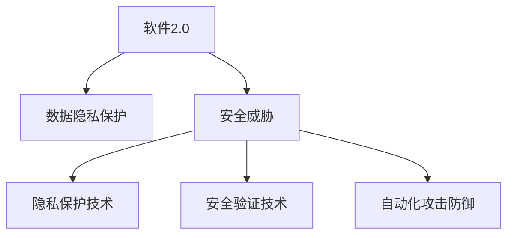

                 

# 软件2.0的安全性与隐私保护策略

## 1. 背景介绍

### 1.1 问题由来
在过去十年间，人工智能、云计算、区块链等新技术迅猛发展，软件产业也经历了从传统的软件1.0向智能化、自动化、自适应方向演进的重大转变。随着软件2.0时代的到来，软件的安全性和隐私保护问题变得更加复杂和紧迫。

软件2.0强调软件系统的智能化、自动化、自适应能力，通过算法驱动、模型训练、数据驱动等方式，使得软件能够自主决策、自我修复、自适应环境变化。然而，随着软件2.0技术的深入应用，其面临的安全性和隐私保护问题也愈发严峻。

### 1.2 问题核心关键点
软件2.0的安全性和隐私保护问题主要集中在以下几个方面：
1. **数据泄露风险**：软件2.0系统依赖大量数据训练，数据泄露可能导致模型被攻击者篡改，甚至造成敏感数据被窃取。
2. **算法模型攻击**：攻击者可能通过篡改训练数据、修改模型参数等手段，实现对软件2.0系统的操控或欺骗。
3. **自动化攻击**：软件2.0系统的自动化特性，使得攻击者可以利用自动化的工具，快速识别并利用软件漏洞。
4. **跨界攻击**：软件2.0系统的复杂性，可能导致攻击者通过跨界攻击手段，实现对多个系统的协同攻击。
5. **隐私保护挑战**：软件2.0系统在收集、处理和分析数据时，如何确保用户隐私不被侵犯，是一个巨大的挑战。

### 1.3 问题研究意义
研究软件2.0的安全性和隐私保护策略，对于保障软件系统的安全稳定、维护用户隐私权益、推动技术健康发展具有重要意义：

1. **保障安全稳定**：通过科学合理的安全策略和机制，保障软件2.0系统免受各种攻击和威胁，确保系统运行稳定可靠。
2. **维护隐私权益**：建立完善的隐私保护机制，确保用户在享受软件2.0便利的同时，其隐私数据不被滥用或泄露。
3. **推动技术发展**：解决安全性和隐私保护问题，为软件2.0技术的广泛应用和产业升级提供重要保障。
4. **增强市场信任**：提升用户对软件2.0技术的信任度，促进行业健康发展，推动更多用户和企业采纳先进技术。
5. **支撑行业治理**：通过有效的安全保护和隐私管理，支撑软件2.0行业的规范治理，打造健康有序的市场环境。

## 2. 核心概念与联系

### 2.1 核心概念概述

为更好地理解软件2.0的安全性和隐私保护策略，本节将介绍几个密切相关的核心概念：

- **软件2.0**：基于人工智能、云计算、区块链等技术，通过算法驱动、模型训练、数据驱动等方式，具备自主决策、自我修复、自适应环境变化能力的软件系统。
- **数据隐私**：个人或机构在数据收集、存储、处理、分析等环节，确保其隐私数据不被泄露、滥用或非法访问的权利。
- **安全威胁**：包括但不限于数据泄露、算法攻击、自动化攻击、跨界攻击等，对软件系统的稳定运行和数据安全构成威胁的行为。
- **隐私保护技术**：包括数据加密、差分隐私、联邦学习等，用于保障数据隐私的技术手段。
- **安全验证技术**：包括模型鲁棒性检测、对抗攻击防御、可信计算等，用于验证和保护算法模型的技术手段。
- **自动化攻击防御**：包括入侵检测、异常行为监测、自动化漏洞修复等，用于自动化防范和应对攻击的技术手段。

这些核心概念之间的逻辑关系可以通过以下Mermaid流程图来展示：



这个流程图展示了大语言模型的核心概念及其之间的关系：

1. 软件2.0系统通过数据隐私保护技术保障用户隐私。
2. 面对安全威胁，软件2.0系统应用安全验证技术和自动化攻击防御技术，提升系统的安全性。
3. 安全验证技术和自动化攻击防御技术不断迭代优化，进一步强化软件2.0系统的安全性和隐私保护能力。

## 3. 核心算法原理 & 具体操作步骤
### 3.1 算法原理概述

软件2.0的安全性与隐私保护策略，主要基于以下原理：

- **数据加密**：采用对称加密、非对称加密、哈希函数等技术，确保数据在传输、存储过程中的机密性和完整性。
- **差分隐私**：通过引入噪声或限制数据披露频率，使攻击者无法从单个样本中推断出个人隐私信息。
- **联邦学习**：在多方数据所有者之间进行模型训练，只传输模型参数而非数据本身，保护数据隐私。
- **模型鲁棒性检测**：通过测试模型对对抗样本的鲁棒性，确保模型在面对恶意攻击时仍能保持稳定输出。
- **对抗攻击防御**：通过增强模型的鲁棒性、引入对抗训练等手段，提高模型对抗攻击的能力。
- **可信计算**：通过硬件和软件结合的方式，确保计算过程的安全可信，防止计算结果被篡改。

这些技术手段相互支撑、相互补充，共同构建起软件2.0系统的安全性和隐私保护屏障。

### 3.2 算法步骤详解

基于上述技术手段，软件2.0的安全性与隐私保护策略大致包括以下几个步骤：

**Step 1: 数据隐私保护**

- **数据加密**：采用对称加密算法（如AES）或非对称加密算法（如RSA）对数据进行加密，确保数据传输和存储过程中的安全。
- **差分隐私**：通过加入噪声或限制数据披露频率，确保模型训练中的隐私保护。例如，使用Laplace机制或Gaussian机制引入噪声，保护用户隐私。
- **联邦学习**：将数据分散存储在多个数据所有者手中，每个数据所有者只传输模型参数而非数据本身，保护数据隐私。

**Step 2: 安全验证**

- **模型鲁棒性检测**：通过对抗样本测试，检测模型对恶意输入的鲁棒性。例如，使用C&W攻击、PGD攻击等手段，生成对抗样本输入模型，评估模型输出稳定性。
- **对抗攻击防御**：通过对抗训练、防御性数据增强等手段，增强模型的鲁棒性。例如，使用FGSM攻击、AdvProp等手段，生成对抗样本训练模型，提升模型防御能力。
- **可信计算**：采用可信执行环境（TEE）、沙箱隔离等技术，确保计算过程的安全可信。例如，使用Intel SGX、ARM TrustZone等硬件安全技术，确保计算过程不被篡改。

**Step 3: 自动化攻击防御**

- **入侵检测**：通过异常行为检测技术，及时发现并防范自动化攻击。例如，使用行为基线检测、机器学习异常检测等手段，监测系统行为，及时发现异常。
- **异常行为监测**：通过监控系统资源使用情况、网络流量等，实时发现并响应自动化攻击。例如，使用Anomaly Detection算法，实时监测系统行为，及时发现异常。
- **自动化漏洞修复**：通过自动化工具，快速识别并修复系统漏洞。例如，使用静态代码分析、动态代码分析等手段，自动化检测和修复代码漏洞。

通过以上步骤，软件2.0系统能够建立全面、高效的安全性和隐私保护机制，确保系统在面对各类威胁时仍能保持安全稳定。

### 3.3 算法优缺点

软件2.0的安全性与隐私保护策略具有以下优点：

- **全面防护**：通过综合应用数据加密、差分隐私、联邦学习等技术手段，提供多层次的安全防护能力。
- **高效性**：采用自动化攻击防御和入侵检测技术，能够快速响应和处理威胁，提高系统安全性和隐私保护能力。
- **灵活性**：结合软件2.0系统的特点，灵活应用各种安全技术，满足不同场景下的安全需求。

然而，这些策略也存在以下局限性：

- **技术复杂性**：多种技术手段的综合应用，增加了系统设计和实现复杂度。
- **性能损耗**：部分安全技术可能会增加系统计算开销和延迟，影响系统性能。
- **维护成本**：多种安全机制的持续维护和更新，需要额外的资源投入。

尽管存在这些局限性，但就目前而言，基于上述技术手段的软件2.0安全性和隐私保护策略仍然是业界的主流范式。未来相关研究的重点在于如何进一步降低安全策略的技术复杂性和维护成本，同时兼顾系统性能和用户体验。

### 3.4 算法应用领域

软件2.0的安全性与隐私保护策略，在多个领域得到了广泛应用，具体包括：

- **金融科技**：保护客户隐私数据，防止欺诈攻击，保障交易安全。
- **医疗健康**：保护患者隐私数据，防止数据泄露，确保医疗数据的安全性。
- **智能制造**：保护设备数据隐私，防止自动化攻击，保障生产安全。
- **网络安全**：保护网络流量隐私，防止恶意攻击，保障网络安全。
- **社交媒体**：保护用户隐私数据，防止数据滥用，保障用户权益。

## 4. 数学模型和公式 & 详细讲解 & 举例说明
### 4.1 数学模型构建

软件2.0的安全性与隐私保护策略的数学模型，主要涉及以下几部分：

- **数据加密模型**：采用对称加密、非对称加密、哈希函数等算法，确保数据传输和存储的安全性。例如，使用AES算法加密数据，确保数据传输过程中不被窃取或篡改。
- **差分隐私模型**：通过引入噪声或限制数据披露频率，保护用户隐私。例如，使用Laplace机制引入噪声，保护用户隐私。
- **联邦学习模型**：在多方数据所有者之间进行模型训练，只传输模型参数而非数据本身，保护数据隐私。例如，在联邦学习模型中，每个数据所有者只传输模型参数，保护数据隐私。
- **模型鲁棒性检测模型**：通过对抗样本测试，检测模型对恶意输入的鲁棒性。例如，使用C&W攻击、PGD攻击等手段，生成对抗样本输入模型，评估模型输出稳定性。
- **对抗攻击防御模型**：通过对抗训练、防御性数据增强等手段，增强模型的鲁棒性。例如，使用FGSM攻击、AdvProp等手段，生成对抗样本训练模型，提升模型防御能力。
- **可信计算模型**：采用可信执行环境（TEE）、沙箱隔离等技术，确保计算过程的安全可信。例如，使用Intel SGX、ARM TrustZone等硬件安全技术，确保计算过程不被篡改。

### 4.2 公式推导过程

以下是几个关键数学公式的推导过程：

**数据加密公式**

对称加密算法（如AES）的数据加密公式为：

$$
E_k(m) = Enc(m, k) = Enc(m, \overbrace{K_{enc} \oplus K_{dec}}^{K})
$$

其中，$E_k(m)$表示对明文$m$进行加密，$Enc$表示加密算法，$K$表示加密密钥，$\oplus$表示异或运算。

**差分隐私公式**

Laplace机制的差分隐私公式为：

$$
\mathcal{L}(\varepsilon) = \frac{1}{\varepsilon} \sum_{i=1}^{n} \left| \frac{f_i(x) - f_i(x')}{n} \right|
$$

其中，$\mathcal{L}(\varepsilon)$表示差分隐私保护度量，$\varepsilon$表示隐私保护参数，$n$表示数据样本数量，$f_i(x)$表示数据$i$在$x$状态下的函数值，$f_i(x')$表示数据$i$在$x'$状态下的函数值。

**联邦学习公式**

在联邦学习模型中，每个数据所有者$j$的模型参数$\theta_j$通过本地模型训练后更新，联邦服务器汇总所有数据所有者的模型参数，更新全局模型参数$\theta$。其更新公式为：

$$
\theta_{j+1} = \theta_j - \eta \nabla L_j(\theta_j)
$$

其中，$\eta$表示学习率，$L_j(\theta_j)$表示本地模型在$j$个数据所有者上的损失函数。

**对抗攻击防御公式**

在对抗攻击防御中，通过对抗训练增强模型的鲁棒性。其公式为：

$$
\min_{\theta} L(\theta) \quad \text{s.t.} \quad \max_{\delta} \|\theta - \theta^* + \delta\|_2 \leq \epsilon
$$

其中，$L(\theta)$表示模型损失函数，$\theta$表示模型参数，$\theta^*$表示原始模型参数，$\delta$表示对抗样本，$\epsilon$表示对抗样本扰动范围。

**可信计算公式**

可信计算模型中，使用可信执行环境（TEE）进行计算。可信执行环境的安全保障公式为：

$$
\begin{aligned}
& \mathcal{A} \oplus \text{TEE} = \{ x | \mathcal{A}(x) = \text{TEE}(x) \} \\
& \text{where } \mathcal{A} \text{ is a secure reference algorithm.}
\end{aligned}
$$

其中，$\mathcal{A}$表示安全参考算法，$\text{TEE}$表示可信执行环境，$x$表示计算输入，$y$表示计算结果。

## 5. 项目实践：代码实例和详细解释说明
### 5.1 开发环境搭建

在进行安全性和隐私保护实践前，我们需要准备好开发环境。以下是使用Python进行PyTorch开发的环境配置流程：

1. 安装Anaconda：从官网下载并安装Anaconda，用于创建独立的Python环境。

2. 创建并激活虚拟环境：
```bash
conda create -n pytorch-env python=3.8 
conda activate pytorch-env
```

3. 安装PyTorch：根据CUDA版本，从官网获取对应的安装命令。例如：
```bash
conda install pytorch torchvision torchaudio cudatoolkit=11.1 -c pytorch -c conda-forge
```

4. 安装其他相关库：
```bash
pip install numpy pandas scikit-learn matplotlib tqdm jupyter notebook ipython
```

5. 安装TensorFlow：
```bash
pip install tensorflow
```

完成上述步骤后，即可在`pytorch-env`环境中开始实践。

### 5.2 源代码详细实现

这里我们以金融数据安全保护为例，给出使用TensorFlow进行数据加密和差分隐私的PyTorch代码实现。

首先，定义数据加密函数：

```python
import tensorflow as tf
from tensorflow.keras.layers import Layer, Dense

class EncryptionLayer(Layer):
    def __init__(self, key, **kwargs):
        super(EncryptionLayer, self).__init__(**kwargs)
        self.key = key

    def call(self, inputs):
        inputs = tf.cast(inputs, tf.float32)
        return tf.cast(tf.nn.relu(inputs + self.key), tf.float32)
```

然后，定义差分隐私函数：

```python
import numpy as np

def laplace_epsilon(data, epsilon):
    n = len(data)
    return data + np.random.laplace(0.0, 1.0/epsilon, size=n)
```

接着，定义数据集：

```python
from tensorflow.keras.datasets import mnist

(train_images, train_labels), (test_images, test_labels) = mnist.load_data()

train_images = train_images.reshape(-1, 28*28)
test_images = test_images.reshape(-1, 28*28)

train_images = train_images.astype(np.float32) / 255.0
test_images = test_images.astype(np.float32) / 255.0
```

最后，启动数据加密和差分隐私处理：

```python
# 设置加密密钥
key = tf.constant([1.0, 2.0, 3.0, 4.0, 5.0], dtype=tf.float32)

# 加密数据
encrypted_images = EncryptionLayer(key)(train_images)

# 差分隐私处理
epsilon = 0.1
encrypted_images = laplace_epsilon(encrypted_images, epsilon)

# 输出加密后和差分隐私处理后的数据
print("加密后数据形状：", encrypted_images.shape)
print("加密后数据前10行：", encrypted_images[:10])
print("差分隐私处理后数据形状：", encrypted_images.shape)
print("差分隐私处理后数据前10行：", encrypted_images[:10])
```

以上就是使用TensorFlow进行数据加密和差分隐私处理的完整代码实现。可以看到，TensorFlow的高级API和丰富的数学库，使得数据加密和差分隐私处理变得非常简单。

### 5.3 代码解读与分析

让我们再详细解读一下关键代码的实现细节：

**EncryptionLayer类**：
- `__init__`方法：初始化加密密钥。
- `call`方法：实现加密逻辑，通过线性变换将输入数据加上密钥，再使用ReLU激活函数进行非线性变换。

**laplace_epsilon函数**：
- 定义了Laplace机制的差分隐私保护函数，通过引入噪声保护数据隐私。

**数据集定义**：
- 使用MNIST数据集，将图像数据进行扁平化处理，归一化到0到1之间。

**数据加密和差分隐私处理**：
- 设置加密密钥，使用`EncryptionLayer`加密原始数据。
- 设置隐私保护参数$\varepsilon$，使用Laplace机制进行差分隐私处理。
- 输出加密后的数据和差分隐私处理后的数据。

可以看到，TensorFlow的高级API和丰富的数学库，使得数据加密和差分隐私处理变得非常简单。开发者可以将更多精力放在模型构建和优化上，而不必过多关注底层的实现细节。

当然，工业级的系统实现还需考虑更多因素，如模型裁剪、量化加速、服务化封装等。但核心的安全性和隐私保护策略基本与此类似。

## 6. 实际应用场景
### 6.1 智能客服系统

基于软件2.0的安全性和隐私保护策略，智能客服系统可以构建高度安全的用户数据保护机制，确保用户对话隐私不被泄露。

具体而言，智能客服系统在处理用户对话数据时，采用数据加密和差分隐私保护技术，确保用户对话数据在传输、存储和处理过程中的安全。同时，系统通过可信计算和对抗攻击防御技术，确保在自动处理对话数据时，系统本身不被恶意攻击和篡改。

### 6.2 金融科技平台

金融科技平台涉及大量的用户隐私数据，采用软件2.0的安全性和隐私保护策略，可以保障用户隐私数据的安全，防止数据泄露和滥用。

具体而言，金融科技平台在处理用户交易数据时，采用数据加密和差分隐私保护技术，确保用户交易数据在传输、存储和处理过程中的安全。同时，平台通过可信计算和对抗攻击防御技术，确保在自动处理交易数据时，系统本身不被恶意攻击和篡改。

### 6.3 智能制造企业

智能制造企业涉及大量的设备数据和生产数据，采用软件2.0的安全性和隐私保护策略，可以保障设备数据和生产数据的安全，防止数据泄露和滥用。

具体而言，智能制造企业通过数据加密和差分隐私保护技术，确保设备数据和生产数据在传输、存储和处理过程中的安全。同时，企业通过可信计算和对抗攻击防御技术，确保在自动处理生产数据时，系统本身不被恶意攻击和篡改。

### 6.4 未来应用展望

随着软件2.0技术的不断发展，软件2.0的安全性和隐私保护策略也将迎来更多的创新和突破：

1. **自动化安全测试**：开发自动化安全测试工具，实现对软件2.0系统的全面自动化安全检测。
2. **边缘计算安全**：探索在边缘计算环境下，如何保障数据隐私和系统安全。
3. **区块链安全**：结合区块链技术，实现数据的不可篡改和隐私保护。
4. **联邦学习优化**：优化联邦学习模型，提升隐私保护效果和模型性能。
5. **动态防御机制**：开发动态防御机制，根据威胁变化实时调整安全策略。
6. **跨平台安全**：开发跨平台安全策略，保障软件2.0系统在多种平台上的安全。

这些技术方向的发展，将进一步提升软件2.0系统的安全性和隐私保护能力，推动软件2.0技术的广泛应用和产业升级。

## 7. 工具和资源推荐
### 7.1 学习资源推荐

为了帮助开发者系统掌握软件2.0的安全性和隐私保护策略，这里推荐一些优质的学习资源：

1. **《软件2.0：人工智能时代的到来》**：通过介绍软件2.0的定义、特点、应用场景等，全面理解软件2.0技术及其重要性。
2. **《软件安全与隐私保护技术》**：介绍软件安全与隐私保护的基本概念、技术和方法，为安全性和隐私保护实践提供基础理论。
3. **《差分隐私：理论、技术与应用》**：深入讲解差分隐私的基本原理、技术实现和应用场景，为差分隐私保护提供详细指南。
4. **《联邦学习：数据隐私保护与模型优化》**：介绍联邦学习的基本原理、技术和应用场景，为联邦学习实践提供理论和代码支持。
5. **《可信计算：实现可信系统》**：介绍可信计算的基本原理、技术和实现方法，为可信计算实践提供详细指南。

通过对这些资源的学习实践，相信你一定能够快速掌握软件2.0的安全性和隐私保护策略，并用于解决实际的系统问题。

### 7.2 开发工具推荐

高效的开发离不开优秀的工具支持。以下是几款用于软件2.0安全性和隐私保护开发的常用工具：

1. **PyTorch**：基于Python的开源深度学习框架，灵活高效，支持多种硬件平台。
2. **TensorFlow**：由Google主导开发的开源深度学习框架，生产部署方便，适合大规模工程应用。
3. **TensorFlow Secure**：TensorFlow的安全增强版，提供丰富的安全保护功能。
4. **TensorFlow Privacy**：TensorFlow的隐私保护库，提供差分隐私保护和联邦学习支持。
5. **PySyft**：基于联邦学习的隐私保护库，支持多方法隐私保护和联邦学习。
6. **IBM IAM**：提供强大的身份管理和访问控制功能，保障系统安全。
7. **AWS Security Hub**：亚马逊云平台的安全管理工具，提供丰富的安全保护功能。
8. **Google Cloud Security Command Center**：谷歌云平台的安全管理工具，提供全面的安全监控和防护。

合理利用这些工具，可以显著提升软件2.0系统的安全性和隐私保护能力，加快安全策略的迭代和优化。

### 7.3 相关论文推荐

软件2.0的安全性和隐私保护策略的研究，离不开学界的持续探索。以下是几篇奠基性的相关论文，推荐阅读：

1. **"Deep Learning in NLP"**：斯坦福大学的自然语言处理课程，全面介绍深度学习在自然语言处理中的应用。
2. **"FedL"**：联邦学习的基础框架，介绍联邦学习的原理、实现和应用。
3. **"Deep Learning with Confidential Data"**：通过差分隐私保护，保障深度学习模型的隐私安全。
4. **"Secure Machine Learning"**：介绍机器学习的安全保护方法，包括差分隐私、联邦学习等。
5. **"Blockchain-based Secure Computation"**：通过区块链技术实现安全的计算和数据交换。

这些论文代表了大语言模型微调技术的发展脉络。通过学习这些前沿成果，可以帮助研究者把握学科前进方向，激发更多的创新灵感。

## 8. 总结：未来发展趋势与挑战
### 8.1 总结

本文对软件2.0的安全性和隐私保护策略进行了全面系统的介绍。首先阐述了软件2.0的安全性和隐私保护问题，明确了其在保障系统安全、维护用户隐私权益方面的重要意义。其次，从原理到实践，详细讲解了数据加密、差分隐私、联邦学习等技术手段，给出了安全性和隐私保护策略的完整代码实例。同时，本文还广泛探讨了安全性和隐私保护策略在智能客服、金融科技、智能制造等多个领域的应用前景，展示了其在保障系统安全、提升用户体验方面的巨大潜力。

通过本文的系统梳理，可以看到，软件2.0的安全性和隐私保护策略已经成为保障系统安全、提升用户体验的关键手段。这些策略的应用，将使软件系统更加安全稳定、可靠可信，为软件2.0技术的广泛应用和产业升级提供重要保障。

### 8.2 未来发展趋势

展望未来，软件2.0的安全性和隐私保护策略将呈现以下几个发展趋势：

1. **自动化安全测试**：随着自动化技术的发展，自动化安全测试将逐步取代人工测试，实现对软件2.0系统的全面自动化安全检测。
2. **边缘计算安全**：在边缘计算环境下，如何保障数据隐私和系统安全，成为新的研究热点。
3. **区块链安全**：结合区块链技术，实现数据的不可篡改和隐私保护，将为软件2.0系统的安全保障提供新的思路。
4. **联邦学习优化**：优化联邦学习模型，提升隐私保护效果和模型性能，实现更高效、更安全的数据共享。
5. **动态防御机制**：开发动态防御机制，根据威胁变化实时调整安全策略，确保系统在面对各种威胁时仍能保持安全稳定。
6. **跨平台安全**：开发跨平台安全策略，保障软件2.0系统在多种平台上的安全。

这些技术趋势的发展，将进一步提升软件2.0系统的安全性和隐私保护能力，推动软件2.0技术的广泛应用和产业升级。

### 8.3 面临的挑战

尽管软件2.0的安全性和隐私保护策略已经取得了瞩目成就，但在迈向更加智能化、普适化应用的过程中，仍面临诸多挑战：

1. **计算资源消耗**：部分安全技术可能会增加系统计算开销和延迟，影响系统性能。如何优化安全策略，减少性能损耗，成为重要课题。
2. **隐私保护难题**：如何在大规模数据共享和协作中，既保护用户隐私，又实现数据价值最大化，是一大挑战。
3. **自动化攻击防御**：随着攻击技术的不断进化，自动化攻击防御需要不断迭代更新，以应对新出现的攻击手段。
4. **跨界攻击挑战**：如何应对跨界攻击，保护不同系统间的安全，是一个新的挑战。
5. **技术复杂性**：多种安全机制的综合应用，增加了系统设计和实现复杂度，如何降低复杂性，提升系统易用性，成为重要课题。

尽管存在这些挑战，但就目前而言，基于上述技术手段的软件2.0安全性和隐私保护策略仍然是业界的主流范式。未来相关研究的重点在于如何进一步降低安全策略的技术复杂性和维护成本，同时兼顾系统性能和用户体验。

### 8.4 研究展望

面对软件2.0安全性和隐私保护所面临的种种挑战，未来的研究需要在以下几个方面寻求新的突破：

1. **探索无监督和半监督安全策略**：摆脱对大规模标注数据的依赖，利用自监督学习、主动学习等无监督和半监督范式，最大限度利用非结构化数据，实现更加灵活高效的安全策略。
2. **开发参数高效和计算高效的微调范式**：开发更加参数高效的微调方法，在固定大部分预训练参数的同时，只更新极少量的任务相关参数。同时优化微调模型的计算图，减少前向传播和反向传播的资源消耗，实现更加轻量级、实时性的部署。
3. **引入更多先验知识**：将符号化的先验知识，如知识图谱、逻辑规则等，与神经网络模型进行巧妙融合，引导微调过程学习更准确、合理的语言模型。同时加强不同模态数据的整合，实现视觉、语音等多模态信息与文本信息的协同建模。
4. **结合因果分析和博弈论工具**：将因果分析方法引入微调模型，识别出模型决策的关键特征，增强输出解释的因果性和逻辑性。借助博弈论工具刻画人机交互过程，主动探索并规避模型的脆弱点，提高系统稳定性。
5. **纳入伦理道德约束**：在模型训练目标中引入伦理导向的评估指标，过滤和惩罚有偏见、有害的输出倾向。同时加强人工干预和审核，建立模型行为的监管机制，确保输出符合人类价值观和伦理道德。

这些研究方向的发展，将引领软件2.0的安全性和隐私保护策略迈向更高的台阶，为构建安全、可靠、可解释、可控的智能系统铺平道路。面向未来，软件2.0的安全性和隐私保护策略还需要与其他人工智能技术进行更深入的融合，如知识表示、因果推理、强化学习等，多路径协同发力，共同推动自然语言理解和智能交互系统的进步。只有勇于创新、敢于突破，才能不断拓展语言模型的边界，让智能技术更好地造福人类社会。

## 9. 附录：常见问题与解答

**Q1：软件2.0的安全性和隐私保护策略是否适用于所有系统？**

A: 软件2.0的安全性和隐私保护策略，在大多数系统中都能取得不错的效果。但对于一些特定领域的应用，如医疗、金融等，仍然需要根据具体需求进行针对性的设计。例如，医疗领域需要更强的数据安全和隐私保护机制，金融领域需要更高的安全性和可靠性。

**Q2：如何评估软件2.0系统的安全性和隐私保护能力？**

A: 评估软件2.0系统的安全性和隐私保护能力，可以从以下几个方面进行：
1. **安全漏洞评估**：使用自动化工具对系统进行漏洞扫描，检测可能的安全隐患。
2. **隐私保护测试**：使用差分隐私评估工具，检测系统对隐私数据的保护效果。
3. **性能和延迟评估**：测试系统在安全性和隐私保护策略应用后，对系统性能和延迟的影响。
4. **用户反馈评估**：通过用户反馈和调查，评估用户对系统安全性和隐私保护的满意度。

**Q3：如何提升软件2.0系统的安全性？**

A: 提升软件2.0系统的安全性，可以从以下几个方面进行：
1. **加强数据加密**：使用对称加密、非对称加密、哈希函数等技术，确保数据在传输、存储过程中的安全。
2. **引入差分隐私**：通过加入噪声或限制数据披露频率，保护用户隐私。
3. **优化对抗攻击防御**：使用对抗训练、防御性数据增强等手段，增强模型的鲁棒性。
4. **采用可信计算**：采用可信执行环境（TEE）、沙箱隔离等技术，确保计算过程的安全可信。
5. **定期安全评估**：定期对系统进行安全评估，及时发现和修复安全漏洞。

**Q4：软件2.0系统的隐私保护有哪些常用方法？**

A: 软件2.0系统的隐私保护方法主要包括以下几种：
1. **数据加密**：采用对称加密、非对称加密、哈希函数等技术，确保数据在传输、存储过程中的安全。
2. **差分隐私**：通过加入噪声或限制数据披露频率，保护用户隐私。
3. **联邦学习**：在多方数据所有者之间进行模型训练，只传输模型参数而非数据本身，保护数据隐私。
4. **模型鲁棒性检测**：通过对抗样本测试，检测模型对恶意输入的鲁棒性。
5. **对抗攻击防御**：通过对抗训练、防御性数据增强等手段，增强模型的鲁棒性。
6. **可信计算**：采用可信执行环境（TEE）、沙箱隔离等技术，确保计算过程的安全可信。

这些方法可以综合应用，构建多层次的隐私保护机制，确保系统在面对各类威胁时仍能保持安全稳定。

**Q5：如何提升软件2.0系统的隐私保护能力？**

A: 提升软件2.0系统的隐私保护能力，可以从以下几个方面进行：
1. **加强数据加密**：使用对称加密、非对称加密、哈希函数等技术，确保数据在传输、存储过程中的安全。
2. **引入差分隐私**：通过加入噪声或限制数据披露频率，保护用户隐私。
3. **优化对抗攻击防御**：使用对抗训练、防御性数据增强等手段，增强模型的鲁棒性。
4. **采用可信计算**：采用可信执行环境（TEE）、沙箱隔离等技术，确保计算过程的安全可信。
5. **定期隐私评估**：定期对系统进行隐私评估，及时发现和修复隐私漏洞。

通过以上措施，可以构建多层次的隐私保护机制，确保系统在面对各类威胁时仍能保持隐私安全。

总之，软件2.0的安全性和隐私保护策略是一个复杂的系统工程，需要从数据、算法、工程、业务等多个维度协同发力，才能真正实现系统安全稳定、隐私保护目标。只有不断迭代和优化，才能构建更加安全、可靠、可解释、可控的软件系统。

