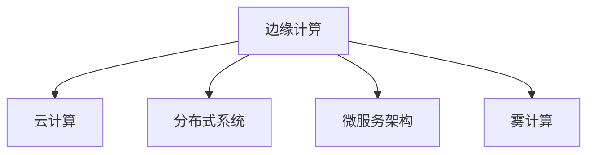

                 

# 边缘计算：在设备端处理数据

> 关键词：边缘计算, 设备端处理, 实时性, 数据隐私, 分布式系统

## 1. 背景介绍

### 1.1 问题由来
边缘计算（Edge Computing）是指在数据源（通常是智能设备）附近进行数据处理和分析，以减少数据传输的延迟和带宽占用，提高系统的实时性和可靠性。在移动设备、物联网（IoT）、智能家居、工业物联网（IIoT）等场景下，数据实时处理的需求日益突出。传统的中心化数据处理方式往往难以满足低延迟、高可靠性的要求，因而边缘计算逐渐成为数据处理的重要趋势。

### 1.2 问题核心关键点
边缘计算的核心在于将数据处理和分析任务从集中式的数据中心转移到分布式的网络边缘设备上，以提升系统的实时性和可扩展性。以下是边缘计算的几个关键点：
- **本地数据处理**：在设备端直接处理数据，减少数据传输。
- **数据存储本地化**：将数据存储在靠近数据源的设备上，降低延迟。
- **低带宽需求**：减少数据传输量，节约带宽资源。
- **实时性提升**：本地处理可以提供更快速的数据响应。
- **数据隐私保护**：在本地处理数据可以降低数据泄露的风险。

### 1.3 问题研究意义
边缘计算在提高数据处理效率、降低延迟、保护数据隐私等方面具有重要意义：

1. **实时性**：边缘计算能够将数据处理推到数据源附近，极大缩短了数据传输距离，从而提高了系统响应速度和实时性。
2. **带宽和成本优化**：通过减少数据传输量，边缘计算能够有效降低带宽需求和网络传输成本。
3. **数据隐私保护**：在设备端进行数据处理可以避免数据集中存储和传输过程中可能带来的隐私泄露风险。
4. **可扩展性**：分布式的网络结构使得边缘计算系统具有更好的可扩展性和容错能力。
5. **适应场景广**：边缘计算能够适应各种实时性要求高、数据量大的应用场景，如工业物联网、智能城市、移动医疗等。

## 2. 核心概念与联系

### 2.1 核心概念概述

为更好地理解边缘计算的核心概念和架构，本节将介绍几个紧密相关的核心概念：

- **边缘计算**：在设备端或网络边缘节点进行数据处理和分析，以提升系统的实时性和可靠性。
- **云计算**：通过互联网提供可扩展、弹性、按需的计算和存储资源，通常集中于数据中心。
- **分布式系统**：由多个独立的计算节点组成的系统，通过网络协同工作，提高系统的可靠性和扩展性。
- **微服务架构**：将应用程序拆分为多个小型、独立的服务，以提升系统的可维护性和扩展性。
- **雾计算**：一种新兴的计算范式，结合了边缘计算和云计算的优点，适合需要高实时性、低延迟的场景。

这些概念之间的逻辑关系可以通过以下Mermaid流程图来展示：



这个流程图展示了几大核心概念的相互联系：

1. 边缘计算与云计算相辅相成，共同构成现代计算体系。
2. 分布式系统和微服务架构是边缘计算的技术基础。
3. 雾计算在边缘计算和云计算之间架起桥梁，强调实时性和数据本地的重要性。

## 3. 核心算法原理 & 具体操作步骤
### 3.1 算法原理概述

边缘计算的核心算法原理主要包括以下几个方面：

- **数据本地化处理**：在数据源附近直接对数据进行处理和分析，减少数据传输延迟。
- **智能调度**：根据负载和数据特性，动态分配计算资源，实现负载均衡和资源优化。
- **边缘缓存**：在本地设备上缓存常用数据和中间结果，提升系统响应速度。
- **分布式存储**：将数据分散存储在多个设备上，提高系统的容错性和可靠性。

### 3.2 算法步骤详解

边缘计算的实现流程通常包括以下几个关键步骤：

**Step 1: 数据收集和传输优化**
- 从数据源收集实时数据。
- 对数据进行预处理和压缩，减少传输量。
- 使用本地存储和缓存技术，避免数据频繁传输。

**Step 2: 数据本地处理**
- 在设备端执行数据处理任务，如数据清洗、特征提取、模型训练等。
- 利用边缘计算框架（如Apache EdgeX、AWS Greengrass等）实现本地处理逻辑。

**Step 3: 智能调度与负载均衡**
- 实时监测系统负载和网络状况，动态分配计算资源。
- 采用负载均衡算法（如轮询、随机、最小连接数等）优化任务调度。

**Step 4: 结果存储与传输**
- 将处理结果缓存到本地设备，避免重复传输。
- 根据需求将处理结果传输到云端或远程设备，完成业务逻辑。

**Step 5: 反馈与优化**
- 收集处理结果和反馈信息，持续优化系统性能。
- 根据处理结果和反馈信息，动态调整算法和模型参数。

### 3.3 算法优缺点

边缘计算的优势在于其低延迟、高实时性和数据本地化处理的特性，但也存在以下缺点：

**优点：**
- 提高实时性：在设备端处理数据，减少数据传输延迟。
- 降低带宽需求：减少数据传输量，节约带宽资源。
- 保护数据隐私：在本地处理数据，降低数据泄露风险。

**缺点：**
- 资源受限：设备性能和存储容量有限，可能无法处理大规模数据。
- 难以维护：分布式系统管理和调试复杂。
- 难以升级：本地设备升级需要物理更换。

### 3.4 算法应用领域

边缘计算已经在多个领域得到了广泛应用，包括但不限于：

- **工业物联网**：通过在生产设备上处理实时数据，提升生产效率和设备维护。
- **智能城市**：通过在路灯、监控摄像头等设备上处理数据，提升城市管理效率和响应速度。
- **智能家居**：通过在智能家电上处理用户行为数据，提升用户体验和系统响应。
- **移动医疗**：通过在移动设备上处理健康数据，提升医疗服务的实时性和可访问性。
- **交通管理**：通过在交通监控设备上处理数据，提升交通流量管理和事故响应速度。

## 4. 数学模型和公式 & 详细讲解  
### 4.1 数学模型构建

边缘计算的数学模型通常包括以下几个部分：

- **输入数据模型**：表示从数据源收集的原始数据，通常为时序数据或图像数据。
- **数据处理模型**：表示在设备端进行的数据处理操作，如滤波、特征提取、模型训练等。
- **资源分配模型**：表示对计算资源和存储资源的分配策略，如基于负载的调度算法。
- **结果输出模型**：表示处理结果的输出方式，如直接存储到本地设备，或者传输到云端或远程设备。

### 4.2 公式推导过程

以工业物联网（IIoT）为例，假设有一组传感器数据$x_1, x_2, ..., x_n$，设备端的处理任务为$y = f(x)$，处理结果需要传输到云端进行进一步分析，公式如下：

$$
y = f(x) = \sum_{i=1}^{n} w_i x_i
$$

其中$w_i$为权重，$x_i$为传感器数据。

在边缘计算中，数据处理和结果输出过程可以表示为：

$$
y_{local} = f(x) = \sum_{i=1}^{n} w_i x_i
$$

处理结果$y_{local}$存储在本地设备上，需要传输到云端进行分析：

$$
y_{cloud} = g(y_{local}) = \sum_{j=1}^{m} z_j y_{local,j}
$$

其中$z_j$为权重，$y_{local,j}$为本地处理结果的不同部分。

### 4.3 案例分析与讲解

以智能城市中的交通流量监测为例，假设每个路口有一个摄像头采集车流量数据$x_1, x_2, ..., x_n$，设备端进行数据处理后得到车流量统计结果$y$，将其传输到云端进行分析。

假设设备端处理模型为：

$$
y = \sum_{i=1}^{n} w_i x_i + b
$$

其中$w_i$为权重，$b$为偏置。

在边缘计算中，首先采集车流量数据：

$$
x_1, x_2, ..., x_n \rightarrow y = \sum_{i=1}^{n} w_i x_i + b
$$

将处理结果$y$存储在本地设备上，并定时传输到云端进行分析：

$$
y_{cloud} = g(y_{local}) = \sum_{j=1}^{m} z_j y_{local,j}
$$

云端分析模型为：

$$
y_{cloud} = \sum_{j=1}^{m} z_j \left(\sum_{i=1}^{n} w_i x_i + b\right)
$$

其中$z_j$为云端分析模型中的权重。

## 5. 项目实践：代码实例和详细解释说明
### 5.1 开发环境搭建

边缘计算的开发环境搭建需要考虑以下几个方面：

1. **硬件环境**：选择适合的边缘计算设备，如工业路由器、嵌入式处理器、FPGA等。
2. **软件环境**：安装操作系统和相关开发工具，如Linux、Python、TensorFlow等。
3. **网络环境**：搭建私有网络，确保数据安全和传输速度。

以下是使用AWS Greengrass进行边缘计算开发的简要配置流程：

1. 在AWS管理控制台中创建Greengrass节点，选择相应的设备和操作系统。
2. 在节点上安装必要的软件包和依赖。
3. 配置网络环境，确保与云端的通信畅通。

### 5.2 源代码详细实现

以下是一个简单的Python脚本，用于在边缘设备上处理和传输传感器数据：

```python
import numpy as np
import json
import time

class SensorDataProcessor:
    def __init__(self):
        self.data = []
        self.weights = np.array([0.5, 0.3, 0.2])
        self.bias = 0.1
        self.latency = 0.01  # 本地处理时间

    def collect_data(self, data):
        self.data.append(data)

    def process_data(self):
        processed_data = np.dot(self.weights, self.data) + self.bias
        return processed_data

    def transmit_data(self):
        processed_data = self.process_data()
        latency = time.time()
        # 模拟传输到云端，并返回处理结果
        return {"data": processed_data.tolist(), "latency": latency}

if __name__ == "__main__":
    processor = SensorDataProcessor()

    # 模拟数据收集
    for i in range(1, 11):
        data = i * np.random.randn(3) + 10
        processor.collect_data(data)

    # 本地处理和结果传输
    result = processor.transmit_data()
    print(result)
```

### 5.3 代码解读与分析

上述代码实现了一个简单的传感器数据处理器，用于模拟边缘计算过程。以下是代码的详细解读：

- **数据收集**：在`collect_data`方法中，通过模拟传感器数据收集，将数据存储在`self.data`列表中。
- **数据处理**：在`process_data`方法中，对收集的数据进行处理，使用加权平均方法得到处理结果。
- **结果传输**：在`transmit_data`方法中，将处理结果传输到云端，并返回处理结果和本地处理时间。

## 6. 实际应用场景
### 6.1 智能城市交通管理

在智能城市交通管理中，通过在交通监控设备上部署边缘计算节点，可以实现实时的交通流量监测和分析。每个路口的监控摄像头采集车流量数据，通过边缘节点进行数据处理，然后将处理结果传输到云端进行分析，从而实现对交通流量的实时监控和预测。

### 6.2 工业设备维护

在工业设备维护中，通过在设备上部署边缘计算节点，可以实现对设备状态数据的实时监测和分析。每个设备上的传感器采集状态数据，通过边缘节点进行数据处理，然后将处理结果传输到云端进行分析，从而实现对设备状态的实时监控和预测，提前发现设备故障，减少停机时间。

### 6.3 智慧医疗健康监测

在智慧医疗健康监测中，通过在智能穿戴设备上部署边缘计算节点，可以实现对用户健康数据的实时监测和分析。每个设备上的传感器采集健康数据，通过边缘节点进行数据处理，然后将处理结果传输到云端进行分析，从而实现对用户健康的实时监控和预测，提供个性化的健康建议。

### 6.4 未来应用展望

随着边缘计算技术的不断发展，未来其在多个领域的应用前景将更加广阔：

1. **智能制造**：通过在生产设备上部署边缘计算节点，可以实现对生产过程的实时监测和优化，提升生产效率和设备维护。
2. **智能家居**：通过在智能家电上部署边缘计算节点，可以实现对用户行为数据的实时分析和反馈，提升用户体验。
3. **智能农业**：通过在农业设备上部署边缘计算节点，可以实现对农业环境的实时监测和优化，提高农业生产效率。
4. **智能交通**：通过在交通监控设备上部署边缘计算节点，可以实现对交通流量的实时监测和分析，提升交通管理效率。
5. **智慧城市**：通过在城市基础设施上部署边缘计算节点，可以实现对城市运行状态的实时监测和分析，提升城市管理水平。

## 7. 工具和资源推荐
### 7.1 学习资源推荐

为了帮助开发者系统掌握边缘计算的核心技术和应用方法，以下是一些推荐的学习资源：

1. **AWS Greengrass文档**：AWS Greengrass官方文档，详细介绍了边缘计算框架的使用方法和最佳实践。
2. **Azure IoT Edge文档**：Azure IoT Edge官方文档，提供了完整的边缘计算开发环境和API参考。
3. **TensorFlow Edge文档**：TensorFlow Edge官方文档，提供了边缘计算框架的开发工具和API参考。
4. **边缘计算标准和规范**：IEEE、IoT ONE等组织的边缘计算标准和规范，帮助开发者了解边缘计算的最新进展和技术趋势。

### 7.2 开发工具推荐

以下是几款常用的边缘计算开发工具：

1. **AWS Greengrass**：AWS提供的边缘计算平台，支持多种编程语言和设备。
2. **Azure IoT Edge**：Azure提供的边缘计算平台，支持设备管理和云平台集成。
3. **TensorFlow Edge**：TensorFlow提供的边缘计算框架，支持深度学习和模型推理。
4. **Huawei EdgeCloud**：华为提供的边缘计算平台，支持大规模边缘计算集群。
5. **Ali JestEdge**：阿里云提供的边缘计算平台，支持AI模型推理和设备管理。

### 7.3 相关论文推荐

以下是几篇边缘计算领域的经典论文，推荐阅读：

1. **Edge Computing: A Computational Paradigm for Smart Cities**：详细介绍了边缘计算在智慧城市中的应用方法和技术挑战。
2. **Edge Computing: A New Paradigm for Computing**：综述了边缘计算的架构、技术和应用场景。
3. **Edge Computing for Industrial Internet of Things**：介绍了边缘计算在工业物联网中的应用和挑战。
4. **Edge Computing for Real-Time Data Processing in IoT Applications**：探讨了边缘计算在物联网实时数据处理中的应用和优化方法。
5. **Fog Computing for Smart Internet of Things**：介绍了雾计算（一种边缘计算的变种）在物联网中的应用和挑战。

## 8. 总结：未来发展趋势与挑战
### 8.1 总结

边缘计算作为一种新兴的计算范式，通过将数据处理任务推向设备端，显著提升了系统的实时性和可靠性，适用于多种实时性要求高、数据量大的应用场景。边缘计算的应用覆盖了智能城市、工业物联网、智能家居、移动医疗等多个领域，展现出广阔的前景。

通过本文的系统梳理，可以看到，边缘计算已经逐步成为数据处理的重要趋势，但其发展仍面临一些挑战，需要进一步探索和解决。

### 8.2 未来发展趋势

展望未来，边缘计算的发展趋势主要包括以下几个方面：

1. **自动化管理**：通过自动化管理工具，简化边缘计算节点的部署和维护，提高系统的可扩展性和可靠性。
2. **智能调度**：结合机器学习和智能算法，优化资源分配和任务调度，提升系统的效率和性能。
3. **异构融合**：将边缘计算与云计算、雾计算等技术进行有机结合，构建异构分布式计算体系，提高系统的灵活性和可扩展性。
4. **边缘AI**：结合人工智能技术，提升边缘计算的数据处理能力和智能化水平，如边缘推理、边缘数据挖掘等。
5. **数据安全**：通过边缘加密和隐私保护技术，提升数据传输和存储的安全性。

### 8.3 面临的挑战

尽管边缘计算在多个领域已经展现出巨大的潜力，但在实际应用中仍面临一些挑战：

1. **资源受限**：边缘计算设备性能和存储容量有限，可能难以处理大规模数据。
2. **管理和调试复杂**：分布式系统和微服务架构增加了管理的复杂性，难以进行集中式调试和维护。
3. **数据一致性**：不同设备上的数据可能存在不一致性，需要解决数据同步和一致性问题。
4. **安全和隐私**：边缘计算涉及大量设备上的数据处理和传输，存在数据泄露和安全风险。
5. **互操作性**：不同厂商和平台之间的边缘计算设备和技术互操作性较差，存在技术壁垒。

### 8.4 研究展望

为了解决这些挑战，未来的研究需要从以下几个方向进行探索：

1. **资源优化**：开发高效的数据处理和存储技术，提升边缘计算设备的性能和容量。
2. **管理平台**：开发自动化管理平台，简化边缘计算节点的部署和维护。
3. **智能调度**：结合机器学习和智能算法，优化资源分配和任务调度。
4. **数据安全**：采用边缘加密和隐私保护技术，提升数据传输和存储的安全性。
5. **标准和规范**：制定边缘计算的标准和规范，促进不同厂商和平台之间的互操作性。

## 9. 附录：常见问题与解答

**Q1：边缘计算与云计算的区别是什么？**

A: 边缘计算和云计算都是分布式计算范式，但区别在于数据处理的位置和集中度。边缘计算将数据处理推向设备端，而云计算将数据处理集中在数据中心。边缘计算具有低延迟、高实时性、数据本地化处理等优势，适合对实时性要求高、数据量大的场景；而云计算具有弹性、可扩展、按需服务的特点，适合对数据存储和计算资源需求大的场景。

**Q2：边缘计算的资源优化有哪些方法？**

A: 边缘计算的资源优化可以从以下几个方面进行：
1. **数据压缩**：使用压缩算法（如LZ77、LZ78、LZW等）减少数据传输量。
2. **边缘缓存**：在本地设备上缓存常用数据和中间结果，提升系统响应速度。
3. **分布式存储**：将数据分散存储在多个设备上，提高系统的容错性和可靠性。
4. **智能调度**：结合机器学习和智能算法，优化资源分配和任务调度。

**Q3：边缘计算的自动化管理有哪些方法？**

A: 边缘计算的自动化管理可以从以下几个方面进行：
1. **容器化技术**：使用容器技术（如Docker、Kubernetes等）进行应用部署和资源管理。
2. **配置管理**：使用配置管理工具（如Ansible、Chef等）进行设备配置和更新。
3. **自动化部署**：使用CI/CD工具（如Jenkins、Travis CI等）进行自动化部署和测试。
4. **监控和告警**：使用监控工具（如Prometheus、Nagios等）进行实时监控和告警。

**Q4：边缘计算的数据安全和隐私保护有哪些方法？**

A: 边缘计算的数据安全和隐私保护可以从以下几个方面进行：
1. **边缘加密**：在数据传输过程中使用加密算法（如AES、RSA等）保护数据安全。
2. **访问控制**：使用身份验证和授权机制（如OAuth、RBAC等）限制数据访问权限。
3. **隐私保护**：使用差分隐私、联邦学习等技术保护用户隐私。
4. **安全监控**：使用入侵检测和异常检测技术（如IDS、IDS等）监控系统安全。

**Q5：边缘计算的互操作性有哪些挑战和解决方案？**

A: 边缘计算的互操作性面临以下挑战：
1. **异构设备**：不同厂商的设备硬件和软件差异较大。
2. **标准化不足**：缺乏统一的标准和规范，导致设备和服务之间的互操作性差。
3. **跨平台集成**：不同平台之间的边缘计算系统难以进行集成。

解决方案包括：
1. **标准化和规范**：制定边缘计算的标准和规范，推动行业统一。
2. **跨平台接口**：开发跨平台的API和SDK，支持不同厂商和平台之间的互操作性。
3. **虚拟化和容器化**：使用虚拟化和容器化技术，简化异构设备之间的集成。

---

作者：禅与计算机程序设计艺术 / Zen and the Art of Computer Programming

