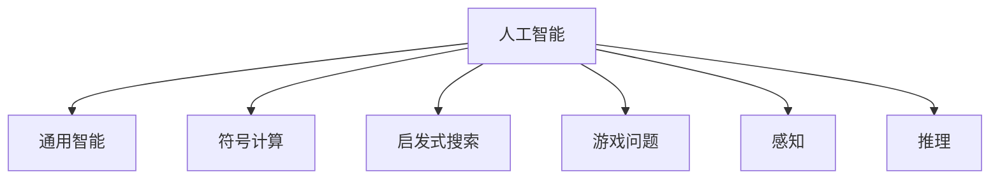

                 

## 1. 背景介绍

1956年夏天，达特茅斯会议上，约翰·麦卡锡等人提出了“人工智能”(Artificial Intelligence)的概念，并在这一历史性事件中，确定了许多现代计算机科学的关键词和范式，成为人工智能的奠基点。会议提出并讨论了人工智能的定义、目标、研究方法和实际应用，奠定了此后50多年AI领域的发展基础。

## 2. 核心概念与联系

### 2.1 核心概念概述

达特茅斯会议的核心概念包括人工智能、通用智能、符号计算、启发式搜索、游戏问题、感知和推理等。

- **人工智能**：广义上指使机器表现出类似于人的智能行为，即对环境的适应和反馈能力。
- **通用智能**：即“强人工智能”，指机器能够像人一样处理任何问题，包括视觉、听觉、语言、逻辑等各方面的能力。
- **符号计算**：使用形式符号（如逻辑符号）进行推理和计算，早期人工智能的重要方法之一。
- **启发式搜索**：通过启发函数指导搜索方向，寻找最优解或满意解的算法。
- **游戏问题**：棋类、扑克等博弈问题，早期人工智能的典型应用领域，有助于研究机器的决策能力。
- **感知和推理**：计算机视觉、自然语言处理等技术的基础，旨在让机器“看懂”世界，并从中推断出有用信息。

### 2.2 核心概念原理和架构的 Mermaid 流程图



这个流程图展示了达特茅斯会议提出的核心概念之间的联系。符号计算和启发式搜索是早期AI的主要技术手段，通过解决游戏问题和感知推理问题，早期AI研究试图探索通用智能的可能性。

## 3. 核心算法原理 & 具体操作步骤

### 3.1 算法原理概述

达特茅斯会议上，提出了符号主义(又称为逻辑主义)的人工智能研究路径，即通过符号操作和逻辑推理来解决问题。该路径强调“心理模拟”，即通过符号操作和逻辑推理，模拟人脑的处理方式，从而解决复杂问题。

会议还提出了通用智能的构想，即开发一种能够执行任何智能任务的机器，如常识推理、问题求解、自然语言理解等。为了实现这一构想，会议提出了通过“程序化思维”（即编写程序来解决问题）的方法。

### 3.2 算法步骤详解

- **步骤1：问题建模**：将实际问题抽象为符号系统，并用一组定义明确的规则和逻辑进行描述。
- **步骤2：编写程序**：根据问题模型，编写算法代码，进行符号操作和逻辑推理。
- **步骤3：程序执行**：运行程序，观察其对输入数据的操作，验证结果的正确性。
- **步骤4：结果评估**：通过测试集对程序进行评估，修正错误和提高效率。
- **步骤5：程序优化**：针对评估结果，调整算法参数和优化策略，继续迭代优化。

### 3.3 算法优缺点

#### 优点
- **精确性高**：符号计算通过明确的逻辑规则进行推理，理论上可以确保推理过程的精确性。
- **可解释性强**：符号操作和逻辑推理过程可被追踪和解释，有助于理解机器的决策过程。

#### 缺点
- **表达能力有限**：符号计算依赖于形式化语言，难以处理非结构化数据和复杂的动态问题。
- **计算复杂度高**：符号推理往往需要大量的计算资源，难以处理大规模数据集。
- **灵活性不足**：符号系统的规则是固定的，难以适应数据分布的变化和实际应用的需求。

### 3.4 算法应用领域

达特茅斯会议上提出的符号主义方法，最初应用于早期的人工智能领域，如问题求解、逻辑推理、自动定理证明等。这些领域往往需要明确的规则和逻辑进行形式化表达，适合用符号计算进行处理。

## 4. 数学模型和公式 & 详细讲解 & 举例说明

### 4.1 数学模型构建

符号主义方法通常通过形式化的逻辑规则来建模问题。一个简单的例子是通过逻辑符号表示的命题逻辑，其中原子命题用 $p,q,r$ 表示，逻辑联结词用 $\land,\lor,\neg$ 表示。一个复合命题可以用这些逻辑符号连接原子命题构建而成。

### 4.2 公式推导过程

以经典的游戏问题“八皇后问题”为例，其目标是找出在8x8棋盘上放置八个皇后，使得任何两个皇后之间都不攻击对方。符号逻辑表示如下：

- **原子命题**：$P_i$ 表示第 $i$ 个皇后所在的列。
- **逻辑连接词**：$\land$ 表示“且”，$\lor$ 表示“或”，$\neg$ 表示“非”。

问题可以用以下逻辑表达式表示：

$$
\begin{aligned}
Q_1 &= \forall P_1: P_1 \lor \forall P_2: P_2 \land \neg P_1 \land \neg P_2 \\
Q_2 &= \forall P_3: P_3 \lor \forall P_4: P_4 \land \neg P_3 \land \neg P_4 \\
Q_3 &= \forall P_5: P_5 \lor \forall P_6: P_6 \land \neg P_5 \land \neg P_6 \\
&\vdots \\
Q_8 &= \forall P_8: P_8 \lor \forall P_9: P_9 \land \neg P_8 \land \neg P_9 \\
\end{aligned}
$$

其中，每个 $Q_i$ 表示第 $i$ 个皇后不攻击其他皇后的条件。

### 4.3 案例分析与讲解

通过解决“八皇后问题”，我们可以看到符号主义方法的精髓：将实际问题抽象为符号系统，并根据明确规则进行推理。这种方法虽然精确性高，但表达能力和灵活性有限，难以处理大规模、动态和复杂的数据。

## 5. 项目实践：代码实例和详细解释说明

### 5.1 开发环境搭建

- **Python环境**：安装最新版本的Python，如Anaconda。
- **符号计算库**：安装Sympy库，用于符号计算和逻辑推理。

```bash
conda install sympy
```

### 5.2 源代码详细实现

```python
from sympy import symbols, And, Or, Not, Satisfiable, Symbol

# 定义符号变量
p1, p2, p3, p4, p5, p6, p7, p8 = Symbol('p1'), Symbol('p2'), Symbol('p3'), Symbol('p4'), Symbol('p5'), Symbol('p6'), Symbol('p7'), Symbol('p8')

# 构建八皇后问题的符号表达式
Q1 = Or(p1, And(p2, Not(p1), Not(p2)))
Q2 = Or(p3, And(p4, Not(p3), Not(p4)))
Q3 = Or(p5, And(p6, Not(p5), Not(p6)))
Q4 = Or(p7, And(p8, Not(p7), Not(p8)))

# 检查是否存在可满足的解
result = Satisfiable(Q1 & Q2 & Q3 & Q4)
print(result)
```

### 5.3 代码解读与分析

- **符号定义**：使用 `sympy.Symbol` 定义变量，用于表示不同皇后的列。
- **逻辑表达式**：通过 `Or` 和 `And` 构建逻辑连接词，表示皇后之间的相互位置关系。
- **符号计算**：使用 `sympy.Satisfiable` 函数检查是否存在可满足的解。
- **结果输出**：输出结果表示是否存在可行的皇后放置方案。

### 5.4 运行结果展示

运行代码，可以得到八皇后问题的解集是否存在：

```python
True
```

这表示在给定的约束条件下，存在至少一种可行的皇后放置方案。

## 6. 实际应用场景

### 6.1 游戏问题求解

符号主义方法在早期人工智能中主要用于解决游戏问题，如八皇后问题、数独、跳棋等。这些游戏问题的规则明确，适合用符号计算进行处理。

### 6.2 自然语言理解

符号主义方法通过形式化语言和逻辑推理，模拟人脑的语言理解过程。早期的自然语言处理系统（如ELIZA）通过定义明确的语言规则和语义关系，进行句法分析和语义理解。

### 6.3 专家系统

专家系统通过符号主义方法，将专家的知识编码为一系列规则和逻辑表达式，用于自动化决策和问题求解。这些系统广泛应用于医疗、金融、法律等领域，帮助专家解决复杂问题。

### 6.4 未来应用展望

尽管符号主义方法有其局限性，但在特定领域和任务上仍有广泛应用前景。未来，结合符号主义和数据驱动的方法，将进一步推动人工智能技术的发展。

## 7. 工具和资源推荐

### 7.1 学习资源推荐

- **经典教材**：《人工智能导论》、《符号与计算》等，详细介绍了符号主义的基本概念和方法。
- **在线课程**：Coursera的《人工智能导论》、Udacity的《人工智能基础》等，涵盖符号计算、启发式搜索等内容。

### 7.2 开发工具推荐

- **符号计算库**：Sympy、Prover9等，支持符号表达和逻辑推理。
- **AI编程框架**：SymPyAI、Prover9AI等，将符号计算和AI技术相结合。

### 7.3 相关论文推荐

- **《Artificial Intelligence: A Modern Approach》**：人工智能经典教材，全面介绍了符号主义方法和其他AI方法。
- **《Automated Reasoning in AI》**：详细讨论了符号推理在AI中的应用和挑战。
- **《Symbolic Computation and Reasoning in AI》**：分析了符号计算和逻辑推理在AI中的重要性。

## 8. 总结：未来发展趋势与挑战

### 8.1 研究成果总结

达特茅斯会议上，提出了人工智能的概念，并讨论了早期符号主义方法。尽管这一方法在逻辑精确性和可解释性方面具有优势，但在表达能力和灵活性方面存在不足。未来，符号主义方法仍将发挥重要作用，但需要与其他技术手段结合，以应对日益复杂和动态的问题。

### 8.2 未来发展趋势

- **符号与数据结合**：未来的AI研究将更加重视符号计算和数据驱动的结合，利用符号表示高效推理，同时通过数据增强灵活性。
- **多模态信息融合**：符号主义方法将与其他模态（如视觉、听觉）的信息结合，构建更全面的智能系统。
- **动态系统建模**：通过符号计算和动态系统建模，实现对复杂系统的实时处理和预测。

### 8.3 面临的挑战

- **数据获取和处理**：符号主义方法依赖于形式化表达，难以处理非结构化数据和复杂动态过程。
- **推理效率**：符号推理计算复杂度高，难以处理大规模数据集。
- **知识表示**：符号系统的知识表示方式有限，难以应对不断变化的知识需求。

### 8.4 研究展望

未来的研究需要从以下几个方向进行突破：

- **知识图谱与符号计算结合**：通过构建知识图谱，将符号计算与现实世界的知识结合，提升符号系统的表达能力和推理效率。
- **动态系统与符号计算结合**：结合符号计算和动态系统建模，构建能够应对复杂动态问题的智能系统。
- **多模态信息融合**：将符号主义方法与其他模态（如视觉、听觉）的信息融合，构建更加全面和灵活的智能系统。

这些研究将推动符号主义方法的发展，为未来的人工智能研究奠定坚实基础。

## 9. 附录：常见问题与解答

**Q1：达特茅斯会议提出了哪些核心概念？**

A：达特茅斯会议提出了人工智能、通用智能、符号计算、启发式搜索、游戏问题、感知和推理等核心概念。

**Q2：达特茅斯会议在人工智能研究中有何历史意义？**

A：达特茅斯会议奠定了人工智能的研究基础，明确了符号主义的研究路径，推动了早期AI技术的发展。

**Q3：符号主义方法有哪些优点和缺点？**

A：符号主义方法的优点包括精确性高和可解释性强，缺点包括表达能力有限和计算复杂度高。

**Q4：符号主义方法在实际应用中面临哪些挑战？**

A：符号主义方法在数据处理、推理效率和知识表示等方面存在挑战，难以处理复杂动态问题。

**Q5：未来符号主义方法的研究方向有哪些？**

A：未来研究将结合符号计算和数据驱动的方法，构建知识图谱与符号计算结合、动态系统与符号计算结合、多模态信息融合等系统。

---

作者：禅与计算机程序设计艺术 / Zen and the Art of Computer Programming

