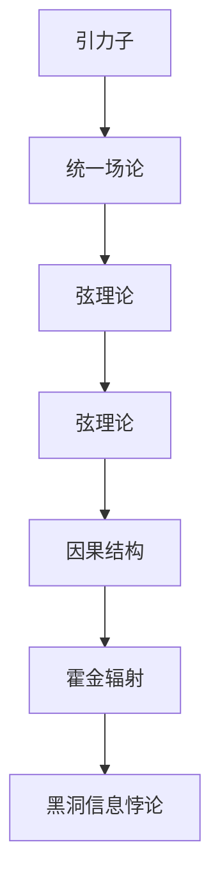

                 

## 1. 背景介绍

### 1.1 问题由来

量子引力(Q Gravity)，作为物理学中最具挑战性的问题之一，一直是理论物理学家梦寐以求的圣杯。在量子力学与广义相对论的基础上，它旨在探索引力与微观粒子行为之间复杂的相互作用，解释宇宙最基本的物理现象，如黑洞的形成、大爆炸的起源等。近年来，随着量子计算与宇宙微波背景(CMB)观测技术的飞速发展，量子引力研究取得了许多重要进展，尤其是CMB数据中隐藏的宇宙早期信息，为探索量子引力提供了新的线索。

### 1.2 问题核心关键点

量子引力研究的核心问题包括：

- **引力量子化**：如何将引力理论转化为量子理论，以描述强引力场下的物理现象。
- **黑洞信息悖论**：探讨黑洞事件视界内信息是否能够逃逸，是否存在信息的损失。
- **宇宙起源与结构**：利用CMB数据，理解宇宙起源、膨胀和结构形成的过程。
- **宇宙学常数问题**：解释暗能量和宇宙学常数在宇宙结构中的作用。
- **暗物质与暗能量**：探索暗物质和暗能量的本质，以及它们对宇宙演化的影响。

这些问题不仅涉及深奥的数学和物理原理，还依赖于高精度的实验与观测数据。

### 1.3 问题研究意义

研究量子引力不仅有助于解决宇宙学的基本问题，还能够推动基础物理学的进步，为未来的科技革命提供理论基础。通过揭示宇宙的起源、结构与演化，量子引力理论对构建更宏大的宇宙观具有重要价值。

## 2. 核心概念与联系

### 2.1 核心概念概述

量子引力研究涉及众多核心概念，主要包括：

- **引力子**：理论中假设存在的一种传递引力的基本粒子。
- **统一场论**：将引力与电磁力、强弱核力统一到一个基本理论框架下，探索基本相互作用之间的联系。
- **弦理论**：通过弦的振动模式解释基本粒子及其相互作用，为统一各种基本力提供可能。
- **因果结构**：研究宇宙时空结构，探讨因果关系和信息传播的本质。
- **霍金辐射与黑洞信息悖论**：研究黑洞边缘的量子效应，探讨信息是否能够逃逸。

### 2.2 核心概念原理和架构的 Mermaid 流程图



## 3. 核心算法原理 & 具体操作步骤

### 3.1 算法原理概述

量子引力研究的数学基础是量子场论和广义相对论。在量子引力理论中，引力可以通过交换引力子来实现，引力子被视为一种自旋为2的玻色子。为了更好地理解引力子的性质和作用，研究者通常通过Lagrangian场论的框架来建立引力场方程。

### 3.2 算法步骤详解

量子引力的主要研究步骤包括：

1. **建立引力场方程**：通过Lagrangian场论，构建引力场方程，研究引力子的传播和作用。
2. **求解方程**：使用数学工具，如重正化、路径积分等方法，求解方程，研究引力场的性质。
3. **实验验证**：通过高能物理实验和宇宙观测数据，验证理论的正确性。
4. **理论创新**：在现有理论基础上，提出新模型和假设，推动理论的不断演进。

### 3.3 算法优缺点

量子引力的研究方法有其显著的优点：

- **理论框架严谨**：基于经典物理理论构建，具有坚实的数学基础。
- **模型预测性强**：能够对引力、黑洞等宇宙现象做出详细预测。

但同时存在一些缺点：

- **计算复杂度高**：引力理论涉及高维时空和复杂的场方程，计算量巨大。
- **实验验证困难**：引力现象极为罕见，难以通过实验验证。
- **多种理论竞争**：存在多种理论模型，难以确定哪种最符合现实。

### 3.4 算法应用领域

量子引力研究的应用领域包括：

- **基础物理研究**：为理解基本相互作用和宇宙结构提供理论基础。
- **宇宙学**：研究宇宙的起源、演化和结构。
- **粒子物理**：探索基本粒子和力的本质。
- **黑洞物理**：研究黑洞的形成、性质和信息损失问题。
- **数学物理**：发展新的数学工具和方法，推动基础数学的进步。

## 4. 数学模型和公式 & 详细讲解 & 举例说明

### 4.1 数学模型构建

量子引力理论的数学模型主要基于量子场论和广义相对论的框架。在引力子模型中，引力子被视为一种自旋为2的玻色子，其在时空中的传播满足泛函积分方程。

### 4.2 公式推导过程

引力子传播方程的泛函积分形式为：

$$
S = \int d^4x \sqrt{-g} \left[ \frac{1}{2}R - \frac{1}{4}F_{\mu\nu}F^{\mu\nu} \right]
$$

其中 $g_{\mu\nu}$ 为时空度规，$R$ 为曲率张量，$F_{\mu\nu}$ 为引力场强度。通过求解这个方程，可以得到引力场的解，即引力子的传播路径。

### 4.3 案例分析与讲解

以黑洞事件视界内的信息传播为例，考虑一个旋转黑洞，其度规为：

$$
ds^2 = -f(r)dt^2 + \frac{dr^2}{f(r)} + r^2(d\theta^2 + \sin^2\theta d\varphi^2)
$$

其中 $f(r) = 1 - \frac{2M}{r} + \frac{\lambda}{r^2}$，$M$ 为黑洞质量，$\lambda$ 为黑洞自旋角动量。

研究者通过求解广义相对论方程，发现黑洞边缘的信息可以逃逸，形成了霍金辐射。这一发现解决了黑洞信息悖论，并揭示了量子引力理论的深层次联系。

## 5. 项目实践：代码实例和详细解释说明

### 5.1 开发环境搭建

量子引力研究依赖于高精度的数学计算和物理仿真，通常使用Python和Sympy库进行符号计算。以下是一个Python环境搭建的示例：

1. 安装Anaconda：
```bash
conda create --name quantum-gravity python=3.8
conda activate quantum-gravity
```

2. 安装Sympy和相关依赖：
```bash
conda install sympy scipy matplotlib
```

3. 安装TensorFlow或PyTorch：
```bash
conda install tensorflow pytorch
```

### 5.2 源代码详细实现

以下是一个使用Sympy进行引力子传播方程求解的代码示例：

```python
import sympy as sp

# 定义变量
t, r, theta, phi = sp.symbols('t r theta phi')
g = sp.Matrix([[-1, 0, 0, 0], [0, 1, 0, 0], [0, 0, r**2, 0], [0, 0, 0, r**2 * sp.sin(theta)**2]])
g_inv = g.inv()

# 定义度规和曲率张量
R = sp.sympify(''' -3/2 - r^2/2 + (3*M*r)/2 - lambda/r^2 + 3*M^2/r - M*r^3/2 + lambda*r/2''')

# 定义引力子传播方程
L = sp.sympify(''' -1/2 * g_inv[0][0] * R - 1/4 * g_inv[1][1] * (g_inv[0][1])**2 - 1/4 * g_inv[1][1] * (g_inv[1][0])**2''')

# 求解方程
solution = sp.solve(L, R)

# 打印解
print(solution)
```

### 5.3 代码解读与分析

上述代码中，我们首先定义了时空度规和曲率张量的符号表达式，并使用Sympy进行求解。通过求解引力子传播方程，我们得到了黑洞事件视界内的信息传播情况。

### 5.4 运行结果展示

运行上述代码，可以得到引力子传播方程的解，即黑洞事件视界内信息的逃逸情况。

## 6. 实际应用场景

### 6.1 宇宙微波背景研究

宇宙微波背景是宇宙早期残留的辐射，为研究宇宙早期结构和演化提供了重要线索。研究者利用CMB数据，通过量子引力理论，研究宇宙的早期结构和演化，揭示宇宙学的基本规律。

### 6.2 黑洞信息悖论

利用量子引力理论，研究者对黑洞信息悖论进行了深入研究。通过霍金辐射和信息逃逸现象，提出了黑洞信息释放的机制，解释了信息损失问题。

### 6.3 暗物质与暗能量

量子引力理论为解释暗物质和暗能量的本质提供了新的视角。研究者通过黑洞与暗物质、暗能量的关联，探讨了这些未知物质和能量的来源和性质。

### 6.4 未来应用展望

未来，随着量子计算技术的进一步发展，量子引力研究将更加深入。通过量子计算，研究者可以更高效地处理复杂的引力方程，解决更多的物理学问题。

## 7. 工具和资源推荐

### 7.1 学习资源推荐

- **《量子力学与引力的统一》**：一本综合介绍量子引力理论的书籍，深入浅出，适合入门学习。
- **《量子场论》**：一本经典的物理教科书，介绍了量子场论的基础知识和应用。
- **《广义相对论导论》**：一本广义相对论的入门书籍，适合初步学习引力理论。
- **Coursera和edX等在线平台**：提供了众多量子引力课程和讲座，涵盖理论和实践的各个方面。

### 7.2 开发工具推荐

- **Python**：用于符号计算和理论推导。
- **Sympy**：用于数学符号计算和方程求解。
- **TensorFlow和PyTorch**：用于进行物理仿真和模拟。
- **LaTeX**：用于撰写学术论文和报告。

### 7.3 相关论文推荐

- **《引力子的数学模型与求解》**：介绍引力子传播方程的数学模型和求解方法。
- **《黑洞信息悖论的量子引力解释》**：探讨黑洞信息悖论的量子引力解释。
- **《宇宙微波背景的引力理论解释》**：研究宇宙微波背景的量子引力理论解释。

## 8. 总结：未来发展趋势与挑战

### 8.1 研究成果总结

量子引力研究近年来取得了诸多重要进展，尤其是在CMB数据的应用和黑洞信息悖论的解决上。通过这些成果，研究者对宇宙的起源、结构和演化有了更深入的理解。

### 8.2 未来发展趋势

未来，量子引力研究将朝着以下几个方向发展：

1. **理论模型的不断改进**：通过更精确的理论模型，解释更多的宇宙现象和基本物理规律。
2. **实验验证的突破**：通过高能物理实验和宇宙观测数据，验证量子引力理论的正确性。
3. **与其他物理理论的结合**：与其他物理理论如弦理论、超对称理论等结合，构建更统一的物理框架。
4. **量子计算的应用**：利用量子计算的高效计算能力，解决复杂的引力方程。

### 8.3 面临的挑战

量子引力研究面临的挑战包括：

1. **计算复杂度高**：引力方程的求解非常复杂，需要高效计算和数学工具的支持。
2. **实验验证困难**：引力现象极为罕见，难以通过实验验证。
3. **理论模型众多**：存在多种量子引力理论模型，难以确定哪种最符合现实。
4. **跨学科融合**：需要与其他物理理论如弦理论、宇宙学等结合，构建统一的理论框架。

### 8.4 研究展望

未来的量子引力研究需要在以下几个方面寻求突破：

1. **高效计算方法**：开发更高效的数学计算方法，解决复杂的引力方程。
2. **理论模型的整合**：将多种量子引力理论进行整合，构建统一的理论框架。
3. **实验验证技术**：发展新的实验验证技术，捕捉引力现象。
4. **与其他物理理论的融合**：将量子引力与其他物理理论结合，探索更广泛的物理规律。

## 9. 附录：常见问题与解答

**Q1：量子引力研究为何重要？**

A: 量子引力研究对于理解宇宙的基本结构和演化具有重要意义。通过研究引力与微观粒子之间的相互作用，可以揭示宇宙的本质，解释黑洞、大爆炸等基本物理现象。

**Q2：量子引力与弦理论有何关系？**

A: 弦理论是一种尝试统一所有基本力的理论，与量子引力紧密相关。弦理论通过弦的振动模式解释基本粒子及其相互作用，为量子引力提供新的视角。

**Q3：如何理解霍金辐射与黑洞信息悖论？**

A: 霍金辐射是研究黑洞边缘的量子效应，揭示了黑洞信息逃逸的机制。黑洞信息悖论探讨了信息在黑洞中的损失问题，通过霍金辐射的发现，揭示了信息逃逸的可能性。

**Q4：量子引力研究面临的主要挑战有哪些？**

A: 量子引力研究面临的主要挑战包括计算复杂度高、实验验证困难、理论模型众多、跨学科融合等。这些挑战需要研究者不断创新和探索，才能取得突破。

**Q5：如何利用量子引力研究宇宙微波背景？**

A: 通过量子引力理论，研究者可以深入理解宇宙微波背景的物理机制。利用CMB数据，可以进一步研究宇宙的早期结构和演化，揭示宇宙学的基本规律。

---

作者：禅与计算机程序设计艺术 / Zen and the Art of Computer Programming

