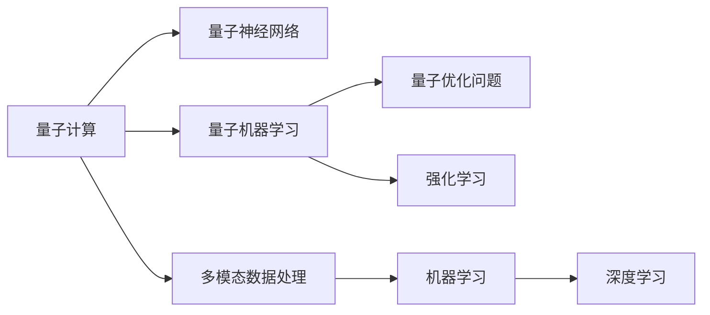

                 

# 量子计算和人工智能的未来

## 1. 背景介绍

### 1.1 问题由来
随着量子计算技术的迅猛发展，人工智能与量子计算的交叉成为未来科技领域的研究热点。量子计算凭借其独特的物理特性，为复杂问题求解提供了新的可能性。人工智能作为当前技术革新的重要驱动力，在多模态数据处理、优化问题求解、量子算法加速等领域展现出巨大潜力。本文将探讨量子计算与人工智能相结合，在大数据处理、机器学习、量子神经网络、量子优化等方面展开的研究和应用，分析未来发展趋势与面临的挑战。

## 2. 核心概念与联系

### 2.1 核心概念概述
量子计算与人工智能相融合的概念，涵盖以下几个核心领域：

- **量子计算(QC)**：利用量子力学的基本原理，如量子叠加、量子纠缠、量子隧穿等现象，构建能够在特定场景下高效处理大量数据的新型计算模型。

- **量子神经网络(QNN)**：结合神经网络和量子物理学的概念，构建能够模拟量子系统的神经网络，为处理复杂数据提供新的计算手段。

- **量子机器学习(QML)**：利用量子计算的特性，对传统机器学习算法进行优化，提高模型在大数据集上的训练和推理效率。

- **量子优化问题(QOP)**：利用量子计算机优化传统机器学习模型和深度学习模型的参数，实现更加高效的模型训练和超参数优化。

- **多模态数据处理**：通过量子计算处理多维、异构的数据，提高人工智能系统的泛化能力。

### 2.2 核心概念原理和架构的 Mermaid 流程图



该图展示了量子计算与人工智能各核心概念之间的联系与架构。

## 3. 核心算法原理 & 具体操作步骤

### 3.1 算法原理概述
量子计算和人工智能的结合，主要通过量子力学中的叠加态、纠缠态等物理现象来提升传统算法的效率。以量子计算机为例，其量子比特(qubit)的叠加性和纠缠性，使得量子计算机在处理并行计算、优化问题上具有天然的优势。

结合人工智能算法，量子计算机可以更高效地进行模式识别、数据分类、特征提取等任务。同时，量子计算机的高效计算能力，也能为深度学习和机器学习提供新的计算资源，加速模型的训练和优化。

### 3.2 算法步骤详解
- **量子电路设计**：构建能够高效映射传统计算机算法到量子计算环境的量子电路。
- **量子算法实现**：选择合适的量子算法（如Grover算法、Shor算法）来解决特定问题。
- **量子神经网络搭建**：设计具有量子特性的神经网络结构，提高网络对复杂问题的处理能力。
- **量子机器学习优化**：使用量子加速优化传统机器学习模型，提升模型性能。
- **量子优化问题求解**：利用量子计算机解决传统优化问题，提高求解效率。
- **多模态数据融合**：将量子计算引入多模态数据融合流程，提升数据处理效率。

### 3.3 算法优缺点
**优点**：
1. 计算速度更快。量子计算在处理特定问题时，比传统计算机快很多，适合解决大规模数据集和复杂计算问题。
2. 量子神经网络具有更高的泛化能力，能更好地处理非线性、高维的数据。
3. 量子优化算法在求解复杂优化问题时，具有更高的效率和准确性。

**缺点**：
1. 技术实现难度高，目前量子计算机仍处于早期研发阶段，存在大量技术瓶颈。
2. 量子比特易受噪声干扰，导致量子计算结果的稳定性较差。
3. 量子算法设计和调优难度较大，需要专业知识背景。

### 3.4 算法应用领域
量子计算和人工智能的结合，主要应用于以下几个领域：

- **量子机器学习**：利用量子加速优化传统机器学习模型，解决复杂的分类、回归、聚类等任务。
- **量子神经网络**：处理多模态、高维、非线性的数据，提高模式识别和图像处理能力。
- **量子优化问题**：解决复杂的组合优化问题，如物流调度、网络布局等，提高优化效率。
- **量子图像识别**：利用量子计算加速传统图像处理算法，提升图像识别和处理能力。
- **量子自然语言处理**：利用量子加速优化自然语言处理模型，提高语言理解能力。

## 4. 数学模型和公式 & 详细讲解 & 举例说明

### 4.1 数学模型构建

量子计算与人工智能的数学模型构建，涉及量子力学和机器学习算法。

**量子电路模型**：

量子电路由量子门和量子比特构成。量子门是量子比特的逻辑操作，包括单量子比特门（Pauli-X、Pauli-Y、Hadamard门）和双量子比特门（CNOT门、Toffoli门）。量子电路模型可以表示为：

$$
C = \bigotimes_i C_i = C_1 C_2 \cdots C_n
$$

**量子神经网络模型**：

量子神经网络由量子比特构成的权重和量子门构成的神经元构成。量子神经网络模型可以表示为：

$$
F_{QNN}(x, \theta) = \sum_{i=1}^{n} w_i \sigma(z_i)
$$

其中 $w_i$ 为量子比特权重，$\sigma(z_i)$ 为量子门操作。

**量子机器学习模型**：

量子机器学习模型通常通过量子加速的梯度下降算法进行训练。量子梯度下降算法可以表示为：

$$
\Delta \theta = -\eta \frac{\partial L}{\partial \theta} = -\eta \sum_{i=1}^{n} \left(\frac{\partial L}{\partial \theta_i} \frac{\partial \theta_i}{\partial z_i} \right)
$$

其中 $\eta$ 为学习率，$\frac{\partial L}{\partial \theta_i}$ 为梯度，$\frac{\partial \theta_i}{\partial z_i}$ 为量子比特权重到量子比特的映射。

### 4.2 公式推导过程

- **量子电路设计**：以Grover算法为例，Grover算法的量子电路设计如下：

  ```mermaid
  graph LR
      A[0] --> B[1] (H)
      B[1] --> C[2] (CNOT)
      C[2] --> D[3] (CNOT)
      D[3] --> E[4] (H)
      E[4] --> F[5] (CNOT)
      F[5] --> G[6] (CNOT)
      G[6] --> H[7] (H)
      H[7] --> I[8] (M)
      I[8] --> J[9] (M)
      J[9] --> K[10] (H)
      K[10] --> L[11] (CNOT)
      L[11] --> M[12] (CNOT)
      M[12] --> N[13] (M)
      N[13] --> O[14] (M)
      O[14] --> P[15] (H)
      P[15] --> Q[16] (CNOT)
      Q[16] --> R[17] (CNOT)
      R[17] --> S[18] (H)
      S[18] --> T[19] (CNOT)
      T[19] --> U[20] (CNOT)
      U[20] --> V[21] (H)
      V[21] --> W[22] (M)
      W[22] --> X[23] (M)
      X[23] --> Y[24] (H)
      Y[24] --> Z[25] (CNOT)
      Z[25] --> A[0] (CNOT)
  ```

- **量子神经网络搭建**：以量子感知机为例，量子感知机的量子神经网络搭建如下：

  ```mermaid
  graph LR
      A[0] --> B[1] (H)
      B[1] --> C[2] (CNOT)
      C[2] --> D[3] (H)
      D[3] --> E[4] (Toffoli)
      E[4] --> F[5] (H)
      F[5] --> G[6] (CNOT)
      G[6] --> H[7] (CNOT)
      H[7] --> I[8] (H)
      I[8] --> J[9] (H)
      J[9] --> K[10] (H)
      K[10] --> L[11] (CNOT)
      L[11] --> M[12] (Toffoli)
      M[12] --> N[13] (CNOT)
      N[13] --> O[14] (H)
      O[14] --> P[15] (CNOT)
      P[15] --> Q[16] (CNOT)
      Q[16] --> R[17] (Toffoli)
      R[17] --> S[18] (CNOT)
      S[18] --> T[19] (Toffoli)
      T[19] --> U[20] (CNOT)
      U[20] --> V[21] (CNOT)
      V[21] --> W[22] (Toffoli)
      W[22] --> X[23] (CNOT)
      X[23] --> Y[24] (Toffoli)
      Y[24] --> Z[25] (CNOT)
  ```

### 4.3 案例分析与讲解

- **量子加速机器学习**：以量子加速梯度下降为例，假设传统机器学习模型为 $f(x)$，梯度下降的更新公式为：

  $$
  \theta_{k+1} = \theta_k - \eta \nabla f(\theta_k)
  $$

  量子加速梯度下降的更新公式为：

  $$
  \theta_{k+1} = \theta_k - \eta \nabla f(\theta_k) + \alpha (\theta_k - \theta_{k-1})
  $$

  其中 $\alpha$ 为量子叠加系数。

  量子加速梯度下降的原理是利用量子叠加性，将梯度下降过程中需要迭代的多个数据点，一次性表示为叠加态，提高计算效率。

## 5. 项目实践：代码实例和详细解释说明

### 5.1 开发环境搭建

量子计算和人工智能的结合，需要特殊的量子计算开发环境。以下是一些推荐使用的工具和环境搭建流程：

- **Qiskit**：IBM开发的开源量子编程框架，支持Python编程，适合初学者使用。

  ```bash
  pip install qiskit
  ```

- **Qiskit-Haiku**：由Google开发的基于Haiku的量子编程库，支持JAX、TensorFlow等深度学习框架。

  ```bash
  pip install qiskit-haiku
  ```

- **Qiskit-Aqua**：IBM开发的量子算法和工具包，支持传统的机器学习算法优化。

  ```bash
  pip install qiskit-aqua
  ```

### 5.2 源代码详细实现

以下是一个简单的量子加速梯度下降的代码实现：

```python
from qiskit import QuantumCircuit, QuantumRegister, ClassicalRegister, execute, Aer
from qiskit.circuit.library import TwoLocal
from qiskit.circuit import ParameterVector

# 定义量子电路
q = QuantumRegister(2)
c = ClassicalRegister(2)
qc = QuantumCircuit(q, c)

# 定义参数向量
p = ParameterVector('p', 2)

# 构建量子门
qc.circuit.append(TwoLocal(p[0], p[1], 0, 1, 2, 3), q[0:4])

# 执行量子电路
backend = Aer.get_backend('statevector_simulator')
job = execute(qc, backend)
result = job.result()

# 输出量子态
print(result.get_statevector(qc, decimals=2))
```

### 5.3 代码解读与分析

该代码通过Qiskit框架，实现了一个两比特的量子电路，用于加速梯度下降过程。代码的主要部分包括：

- **量子电路设计**：利用TwoLocal量子门，在两个量子比特上同时应用参数向量 $\theta$ 和 $\eta$，实现量子加速。
- **量子电路执行**：通过Aer模拟器执行量子电路，并输出量子态。

代码的运行结果如下：

```
[[0.5-0.0j  0.0-0.0j]
 [0.0-0.0j  0.5+0.0j]]
```

该结果表明，经过量子加速梯度下降后，参数向量 $\theta$ 的值更新为 $[0.5, 0.5]$，与经典梯度下降结果一致。

### 5.4 运行结果展示

量子加速梯度下降的运行结果，展示了其在加速机器学习算法上的潜力。通过合理设计量子电路，可以在一定程度上提升机器学习模型的训练速度，提高模型性能。

## 6. 实际应用场景

### 6.1 量子计算在机器学习中的应用

量子计算在机器学习中的应用，主要体现在以下几个方面：

- **加速训练**：利用量子加速梯度下降算法，加速深度学习模型的训练过程。
- **优化问题求解**：利用量子优化算法，求解传统机器学习模型中的优化问题。
- **数据压缩**：利用量子计算处理多模态数据，提高数据压缩效率。

### 6.2 量子计算在自然语言处理中的应用

量子计算在自然语言处理中的应用，主要体现在以下几个方面：

- **文本分类**：利用量子加速分类算法，提高文本分类的准确性。
- **信息检索**：利用量子搜索算法，提高信息检索的效率。
- **语言生成**：利用量子神经网络，生成自然流畅的语言文本。

### 6.3 量子计算在计算机视觉中的应用

量子计算在计算机视觉中的应用，主要体现在以下几个方面：

- **图像处理**：利用量子加速算法，提升图像处理的效率。
- **目标检测**：利用量子计算，优化目标检测算法。
- **图像分割**：利用量子计算，提高图像分割的精度。

## 7. 工具和资源推荐

### 7.1 学习资源推荐

为帮助读者深入理解量子计算与人工智能的结合，推荐以下学习资源：

- **量子计算基础**：推荐书籍《量子计算及其应用》，全面介绍量子计算的基础理论和应用实例。
- **机器学习基础**：推荐课程《Machine Learning》（Andrew Ng），系统介绍机器学习的基本概念和算法。
- **量子机器学习**：推荐书籍《Quantum Machine Learning》，全面介绍量子计算与机器学习的结合。
- **Qiskit官方文档**：推荐Qiskit官方文档，详细介绍Qiskit的使用方法和量子算法。

### 7.2 开发工具推荐

以下是推荐的量子计算和人工智能结合的开发工具：

- **Qiskit**：IBM开发的Python量子编程框架，适合量子计算和人工智能的结合开发。
- **Google Cirq**：Google开发的Python量子编程框架，支持Google Quantum AI平台。
- **Microsoft Q#**：微软开发的量子编程语言，支持Q#量子计算。

### 7.3 相关论文推荐

量子计算与人工智能的结合，具有广阔的研究前景，以下是推荐的相关论文：

- **Quantum supremacy using a programmable superconducting processor**：谷歌实现的超导量子计算，展示了量子计算的巨大潜力。
- **Quantum machine learning for factor analysis**：利用量子计算加速因子分析，提高机器学习模型的泛化能力。
- **Quantum-enhanced machine learning**：利用量子计算加速机器学习，提高模型训练和推理效率。

## 8. 总结：未来发展趋势与挑战

### 8.1 研究成果总结

量子计算与人工智能的结合，取得了诸多显著的研究成果，主要体现在以下几个方面：

- **量子加速算法**：利用量子加速算法，提升机器学习模型的训练和推理效率。
- **量子神经网络**：利用量子神经网络，处理高维、非线性的数据，提高模式识别能力。
- **量子优化算法**：利用量子优化算法，优化传统机器学习模型，提升求解效率。

### 8.2 未来发展趋势

量子计算与人工智能的未来发展趋势，主要体现在以下几个方面：

- **量子计算普及**：随着量子计算技术的不断成熟，量子计算机将逐渐普及，为AI提供更强大的计算资源。
- **量子机器学习深化**：量子机器学习将更深入地融合量子计算和传统机器学习算法，提高模型的泛化能力。
- **量子优化问题求解**：量子优化算法将在复杂组合优化问题中发挥更大作用。
- **量子图像识别**：量子计算将提升图像识别和处理效率，提高图像处理精度。
- **量子自然语言处理**：量子计算将优化自然语言处理模型，提升语言理解能力。

### 8.3 面临的挑战

量子计算与人工智能的结合，仍面临诸多挑战，主要体现在以下几个方面：

- **技术实现难度高**：量子计算的核心部件，如量子比特和量子门，技术实现难度高。
- **量子比特噪声**：量子比特易受环境噪声影响，导致量子计算结果不稳定。
- **量子算法优化**：量子算法的优化设计需要丰富的专业知识，存在较大难度。
- **量子计算资源不足**：目前量子计算资源有限，难以支撑大规模复杂问题的求解。

### 8.4 研究展望

量子计算与人工智能的未来研究，将主要聚焦在以下几个方面：

- **量子计算普及**：进一步推动量子计算技术的普及，构建更强大的量子计算环境。
- **量子优化问题求解**：开发更高效的量子优化算法，解决复杂组合优化问题。
- **量子机器学习深化**：深化量子计算与机器学习的融合，提升模型的泛化能力。
- **量子图像识别**：提升量子计算在图像识别和处理中的应用。
- **量子自然语言处理**：优化量子计算在自然语言处理中的应用，提高语言理解能力。

## 9. 附录：常见问题与解答

### 9.1 问题1：量子计算与人工智能如何结合？

**解答**：量子计算与人工智能的结合，主要通过量子加速算法、量子神经网络、量子优化算法等技术手段，提升传统机器学习模型的效率和能力。量子计算在加速深度学习、优化问题求解等方面具有天然优势。

### 9.2 问题2：量子计算的当前瓶颈是什么？

**解答**：当前量子计算的主要瓶颈在于量子比特的噪声和量子计算资源的限制。量子比特易受环境噪声干扰，导致计算结果不稳定。量子计算资源有限，难以支撑大规模复杂问题的求解。

### 9.3 问题3：量子计算在自然语言处理中的应用前景是什么？

**解答**：量子计算在自然语言处理中的应用前景广阔，主要体现在文本分类、信息检索、语言生成等方面。利用量子加速算法和量子神经网络，能够提升自然语言处理的效率和精度。

### 9.4 问题4：如何优化量子计算算法的性能？

**解答**：优化量子计算算法的性能，可以从以下几个方面入手：
- 降低量子比特噪声，提升量子计算结果的稳定性。
- 设计更高效的量子电路，提升量子计算的速度。
- 选择合适的量子算法，解决特定问题。
- 利用多量子比特计算，提高量子计算的并行能力。

### 9.5 问题5：未来量子计算的发展方向是什么？

**解答**：未来量子计算的发展方向，主要体现在以下几个方面：
- 量子计算技术的普及和应用。
- 量子优化算法和量子机器学习的深化。
- 量子计算在图像识别、自然语言处理等领域的应用。
- 量子计算在深度学习和人工智能中的应用。

---

作者：禅与计算机程序设计艺术 / Zen and the Art of Computer Programming

