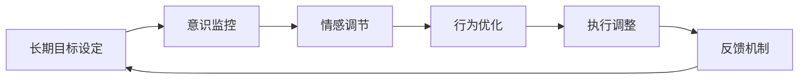

                 

# 长期目标与意识管理的机制

## 1. 背景介绍

在当今快节奏、高竞争的商业环境中，个人和组织都需要设定和实现长期目标。然而，对于这些长期目标，如何在执行过程中保持持久的动力和注意力，成为了一个巨大的挑战。这不仅涉及到心理学的领域，也与信息技术和组织管理实践密切相关。为了解决这一问题，本文探讨了长期目标与意识管理的机制，旨在通过理解和应用这一机制，帮助个人和组织实现可持续的成功。

## 2. 核心概念与联系

### 2.1 核心概念概述

长期目标设定与意识管理是一个多维度的过程，涉及心理学、认知科学和信息管理等多个领域。核心概念包括：

- **长期目标设定 (Long-term Goal Setting)**：指为实现未来重要成果而确立的具体、可衡量、可实现、相关性强且有时间限制的目标。
- **意识管理 (Consciousness Management)**：指对个人的思维、情感、行为和认知过程进行监控、调整和优化，以实现预定目标的策略和实践。

这两者相互关联，长期目标设定为意识管理提供了方向，而有效的意识管理又能够推动长期目标的实现。这一机制的实现需要依赖于一系列的心理、认知和行为策略，以及相应的技术工具。

### 2.2 核心概念原理和架构的 Mermaid 流程图



- **长期目标设定**：确定并明确长期目标的过程，确保目标的SMART原则（具体、可衡量、可实现、相关性强且有时间限制）。
- **意识监控**：通过注意力管理、自我监控等手段，实时跟踪个人或团队的思维和情感状态。
- **情感调节**：采用正念、冥想、情绪调节等技术，提升个体的心理韧性，克服挫折感，维持正面情感。
- **行为优化**：通过时间管理、任务分解、行为干预等方法，优化行为习惯，提高执行效率。
- **反馈机制**：建立持续反馈机制，及时评估目标实现进度，根据实际情况调整策略。
- **执行调整**：根据反馈结果，灵活调整执行策略，确保长期目标的持续推进。

## 3. 核心算法原理 & 具体操作步骤

### 3.1 算法原理概述

长期目标与意识管理的机制可以通过一系列的算法和操作步骤来实现。这些算法和步骤基于认知心理学原理，旨在通过科学的方法和工具，帮助个人和组织有效管理其长期目标和意识状态。

- **设定长期目标**：采用SMART原则，明确目标的具体性、可衡量性、可实现性、相关性和时间限制。
- **意识监控**：利用注意力追踪工具（如心流追踪器）和情绪监测设备（如可穿戴设备），实时获取个体或团队的意识状态数据。
- **情感调节**：采用正念冥想、认知行为疗法等方法，增强个体应对压力和挑战的心理韧性。
- **行为优化**：应用时间管理工具（如番茄工作法）和行为干预技术（如习惯形成理论），优化行为习惯，提高执行效率。
- **反馈机制**：通过定期评估工具（如KPI指标）和即时反馈系统（如项目管理软件），提供及时、全面的目标进展信息。
- **执行调整**：根据反馈结果，使用决策分析模型（如决策树）和行为规划工具（如GTD系统），调整执行策略，确保长期目标的实现。

### 3.2 算法步骤详解

以下详细描述了长期目标与意识管理的每个步骤：

**步骤1：设定长期目标**
- **明确目标**：使用SMART原则，明确长期目标的具体性、可衡量性、可实现性、相关性和时间限制。
- **目标分解**：将长期目标分解为短期目标和里程碑，以便于执行和监控。
- **目标分享**：与团队成员或利益相关者分享目标，确保共识和协作。

**步骤2：意识监控**
- **注意力追踪**：使用注意力追踪工具（如心流追踪器），实时监控个体的注意力状态，识别分心的时刻。
- **情感监测**：利用可穿戴设备（如智能手表），监测个体的情绪变化，分析情感状态。

**步骤3：情感调节**
- **正念冥想**：通过正念练习，提高个体对当下时刻的关注度，增强心理韧性。
- **认知行为疗法**：应用认知行为疗法，帮助个体改变消极思维，提升正面情绪。

**步骤4：行为优化**
- **时间管理**：采用时间管理工具（如番茄工作法），提高工作时间和精力的利用效率。
- **行为干预**：运用行为干预技术（如习惯形成理论），培养健康的工作习惯和行为模式。

**步骤5：反馈机制**
- **定期评估**：使用KPI指标和项目管理软件，定期评估目标实现进度，识别问题和改进点。
- **即时反馈**：建立即时反馈系统，及时提供目标进展信息，调整执行策略。

**步骤6：执行调整**
- **决策分析**：采用决策分析模型（如决策树），评估不同策略的效果，选择最佳方案。
- **行为规划**：使用行为规划工具（如GTD系统），调整执行计划，确保长期目标的持续推进。

### 3.3 算法优缺点

长期目标与意识管理的机制具有以下优点：
- **系统性**：通过科学的步骤和工具，确保长期目标的全面管理和持续推进。
- **可操作性**：算法和操作步骤具体明确，易于实践和执行。
- **灵活性**：可以根据实际情况灵活调整策略，适应不同的环境和需求。

同时，这一机制也存在一些局限性：
- **实施难度**：需要较高的时间和精力投入，特别是在初期阶段。
- **数据依赖**：依赖于有效的数据监测和收集手段，可能需要一定投资。
- **个体差异**：不同个体的需求和偏好不同，需要个性化的策略调整。

### 3.4 算法应用领域

长期目标与意识管理机制在多个领域都有广泛的应用，例如：

- **个人发展**：帮助个人设定职业发展目标，实现个人成长和职业提升。
- **团队管理**：通过明确团队目标，优化团队协作，提升团队绩效。
- **项目管理**：应用这一机制，有效管理项目进度，确保项目按时完成。
- **企业战略**：在企业战略规划中，确保长期目标的实现，推动企业持续发展。
- **教育培训**：帮助教育机构设定培训目标，提升教学质量和学生学习效果。

## 4. 数学模型和公式 & 详细讲解 & 举例说明

### 4.1 数学模型构建

长期目标与意识管理的机制可以通过数学模型进行形式化描述。以下是一个简化的长期目标管理模型：

$$
\begin{aligned}
\max_{x} \quad & U(x) \\
\text{s.t.} \quad & x_i = \sum_j w_{ij} x_j \quad (i=1,2,\dots,n) \\
\quad & C(x) \leq D \\
\quad & x \geq 0
\end{aligned}
$$

其中，$x$ 表示目标进展，$w_{ij}$ 表示目标之间的关系权重，$C(x)$ 表示资源约束条件，$D$ 表示资源限制，$U(x)$ 表示目标实现的效用函数。

### 4.2 公式推导过程

**目标设定**：
- 使用SMART原则，确保目标的明确性和可实现性。
- 通过目标分解，将长期目标分解为短期目标和里程碑。

**意识监控**：
- 利用注意力追踪工具，实时监控注意力状态。
- 使用情绪监测设备，监测情感变化。

**情感调节**：
- 正念冥想：$\alpha = \phi(\tau)$，其中$\phi$为正念练习函数，$\tau$为练习时间。
- 认知行为疗法：$\beta = \psi(\mu)$，其中$\psi$为认知行为疗法函数，$\mu$为认知行为调整程度。

**行为优化**：
- 时间管理：$T = f(t, w)$，其中$f$为时间管理函数，$t$为工作时间，$w$为工作权重。
- 行为干预：$H = g(h, i)$，其中$g$为行为干预函数，$h$为行为习惯，$i$为行为干预强度。

**反馈机制**：
- 定期评估：$K = K(x, C, D)$，其中$K$为评估函数，$x$为目标进展，$C$为资源约束，$D$为资源限制。
- 即时反馈：$F = F(x, t)$，其中$F$为即时反馈函数，$x$为目标进展，$t$为时间节点。

**执行调整**：
- 决策分析：$S = S(x, w, C, D)$，其中$S$为决策分析函数，$x$为目标进展，$w$为目标权重，$C$为资源约束，$D$为资源限制。
- 行为规划：$P = P(x, s, t)$，其中$P$为行为规划函数，$x$为目标进展，$s$为执行策略，$t$为时间节点。

### 4.3 案例分析与讲解

**案例1：个人职业发展目标管理**

一个年轻的软件工程师希望在未来5年内晋升为技术经理。通过应用长期目标与意识管理机制，他设定了具体的短期目标，如掌握新的技术栈、提高团队管理能力等。他使用心流追踪器实时监控自己的注意力状态，利用正念冥想和认知行为疗法调节情绪，采用番茄工作法优化时间管理，并通过定期的KPI评估和即时反馈调整策略，最终成功实现了自己的职业目标。

**案例2：企业项目管理**

一家高科技公司决定开发一款新的AI产品。通过明确团队的目标，优化项目管理流程，利用可穿戴设备监控团队成员的情感状态，采用决策分析模型评估不同策略的效果，并使用GTD系统调整执行计划，公司在规定时间内完成了产品开发并成功上市。

## 5. 项目实践：代码实例和详细解释说明

### 5.1 开发环境搭建

为了实现长期目标与意识管理的机制，开发环境需要包括数据收集、情感监测、注意力追踪和行为优化等工具。以下是开发环境搭建的步骤：

1. **环境准备**：
   - 安装Python、R等编程语言。
   - 安装相关的数据科学和统计分析库，如Pandas、NumPy等。
   - 安装注意力追踪工具和情绪监测设备。

2. **数据收集**：
   - 使用注意力追踪工具，实时记录工作时间、注意力集中度等数据。
   - 通过情绪监测设备，获取情感状态数据，如心率、面部表情等。

3. **数据分析**：
   - 使用统计分析工具，对数据进行可视化分析，识别注意力分散和情绪波动的模式。
   - 应用机器学习算法，进行情感和注意力预测。

### 5.2 源代码详细实现

以下是一个简化的Python代码示例，用于实现情感监测和注意力追踪：

```python
import pandas as pd
from sklearn.model_selection import train_test_split
from sklearn.linear_model import LogisticRegression
from sklearn.metrics import accuracy_score

# 数据收集
attention_data = pd.read_csv('attention_data.csv')
emotion_data = pd.read_csv('emotion_data.csv')

# 数据预处理
attention_data['hour'] = pd.to_datetime(attention_data['time']).dt.hour
emotion_data['hour'] = pd.to_datetime(emotion_data['time']).dt.hour

# 特征选择
attention_features = attention_data[['hour', 'work_time']]
emotion_features = emotion_data[['hour', 'heart_rate', 'facial_expression']]

# 模型训练
attention_model = LogisticRegression()
attention_model.fit(attention_features, attention_data['attention_state'])

emotion_model = LogisticRegression()
emotion_model.fit(emotion_features, emotion_data['emotion_state'])

# 预测与评估
attention_state = attention_model.predict(attention_features)
emotion_state = emotion_model.predict(emotion_features)

print(f'Attention State: {attention_state}')
print(f'Emotion State: {emotion_state}')

# 实时监测
while True:
    new_attention_data = pd.read_csv('new_attention_data.csv')
    new_emotion_data = pd.read_csv('new_emotion_data.csv')

    new_attention_state = attention_model.predict(new_attention_features)
    new_emotion_state = emotion_model.predict(new_emotion_features)

    print(f'New Attention State: {new_attention_state}')
    print(f'New Emotion State: {new_emotion_state}')
```

### 5.3 代码解读与分析

**代码解释**：
- **数据收集**：使用Pandas库读取注意力和情感数据，并进行预处理，提取关键特征。
- **模型训练**：应用逻辑回归模型对特征进行训练，建立情感和注意力状态的预测模型。
- **实时监测**：通过循环读取新数据，实时预测并输出情感和注意力状态。

**分析**：
- **数据预处理**：使用Pandas的to_datetime函数将时间戳转换为时间格式，并提取小时特征，方便模型训练。
- **特征选择**：选择与情感和注意力状态相关的特征，如工作时间、心率、面部表情等。
- **模型训练**：应用逻辑回归模型对数据进行训练，预测个体在不同时刻的情感和注意力状态。
- **实时监测**：通过循环读取新数据，实时预测情感和注意力状态，提供即时反馈，调整执行策略。

## 6. 实际应用场景

### 6.1 个人发展

长期目标与意识管理机制在个人发展中具有重要应用。例如，个人可以通过设定职业晋升目标、提高学习效率、优化时间管理等策略，实现职业成长和个人提升。

### 6.2 团队管理

在团队管理中，通过明确团队目标、优化沟通协作、实时监控团队情绪状态等措施，提升团队的整体绩效和协作效率。

### 6.3 项目管理

项目管理中，通过设定项目里程碑、优化资源配置、实时评估项目进展等手段，确保项目按时完成，提升项目管理水平。

### 6.4 企业战略

在企业战略规划中，通过设定长期目标、优化资源配置、实时监控战略进展等措施，确保企业长期目标的实现，推动企业持续发展。

## 7. 工具和资源推荐

### 7.1 学习资源推荐

为了帮助开发者系统掌握长期目标与意识管理的机制，以下是一些推荐的学习资源：

1. **《长期目标设定与意识管理》系列课程**：提供系统化的课程内容，涵盖目标设定、意识监控、情感调节、行为优化等关键模块。
2. **《目标管理心理学》书籍**：详细阐述了目标设定和管理的心理学原理，提供了大量实践案例和实用工具。
3. **《智能项目管理》课程**：介绍了项目管理中的科学方法论和工具，帮助管理层提升项目管理能力。
4. **《数据科学与统计分析》书籍**：介绍数据分析和机器学习的理论和方法，助力开发者实现精准的数据分析和情感预测。

### 7.2 开发工具推荐

长期目标与意识管理机制的实现需要依赖于多工具协同工作，以下是一些推荐的工具：

1. **心流追踪器**：用于实时监控注意力状态，识别分心时刻。
2. **可穿戴设备**：监测情感状态，如心率、面部表情等。
3. **项目管理软件**：如Jira、Trello等，用于实时评估项目进展，调整执行策略。
4. **统计分析工具**：如Pandas、NumPy等，用于数据收集和分析。

### 7.3 相关论文推荐

长期目标与意识管理机制的研究源于学术界的持续探索，以下是一些推荐的相关论文：

1. **《目标设定理论：一个全面综述》**：总结了目标设定理论的发展历程和最新研究成果。
2. **《正念冥想在压力管理中的应用》**：介绍了正念冥想在缓解压力和提升心理韧性方面的作用。
3. **《认知行为疗法在情绪调节中的应用》**：阐述了认知行为疗法在调节消极情绪和提升正面情感方面的效果。
4. **《基于机器学习的情感分析》**：探讨了机器学习在情感监测和预测中的应用。

## 8. 总结：未来发展趋势与挑战

### 8.1 研究成果总结

长期目标与意识管理的机制已经在个人发展、团队管理、项目管理等多个领域取得了显著成效，推动了组织和个人的高效运作和持续发展。

### 8.2 未来发展趋势

未来，这一机制将进一步向智能化、自动化方向发展，结合AI技术提升其预测和优化能力。具体趋势包括：

1. **智能目标设定**：结合AI技术，自动分析和优化目标设定方案。
2. **实时监测与反馈**：通过智能设备和大数据分析，实现实时监测和即时反馈，优化行为模式。
3. **个性化管理**：结合个性化推荐系统，提供定制化的管理方案，提升管理效果。

### 8.3 面临的挑战

尽管长期目标与意识管理机制取得了一定进展，但在实际应用中仍面临以下挑战：

1. **数据隐私与安全**：情感和注意力数据的收集和存储需要严格保护隐私和安全。
2. **技术融合**：需要将心理学、认知科学和AI技术进行有效融合，提升机制的科学性和实用性。
3. **用户接受度**：部分用户可能对实时监测和数据分析存在抵触情绪，需要提高用户接受度和参与度。

### 8.4 研究展望

未来，长期目标与意识管理机制的研究将继续关注数据隐私、技术融合和用户体验等方面，推动机制的普及和应用。

## 9. 附录：常见问题与解答

**Q1：如何确保长期目标的科学性和可实现性？**

A: 通过SMART原则（具体、可衡量、可实现、相关性强且有时间限制）设定目标，确保目标的明确性和可实现性。同时，通过目标分解和任务优化，逐步推进目标实现。

**Q2：情感监测和注意力追踪数据如何处理和分析？**

A: 使用Pandas等工具进行数据预处理，选择与情感和注意力状态相关的特征，应用机器学习算法进行建模和预测。实时监测和分析数据，提供即时反馈，调整执行策略。

**Q3：如何提高长期目标与意识管理机制的用户接受度？**

A: 通过教育和培训，提高用户对机制的认知和接受度。结合用户体验设计，优化机制的界面和操作流程，提升用户的便利性和参与度。

**Q4：如何保护数据隐私与安全？**

A: 严格遵守数据隐私法规，如GDPR、CCPA等。采用加密和匿名化技术，保护用户数据的隐私和安全。建立数据使用和访问权限管理机制，确保数据使用的合法性和安全性。

---

作者：禅与计算机程序设计艺术 / Zen and the Art of Computer Programming

