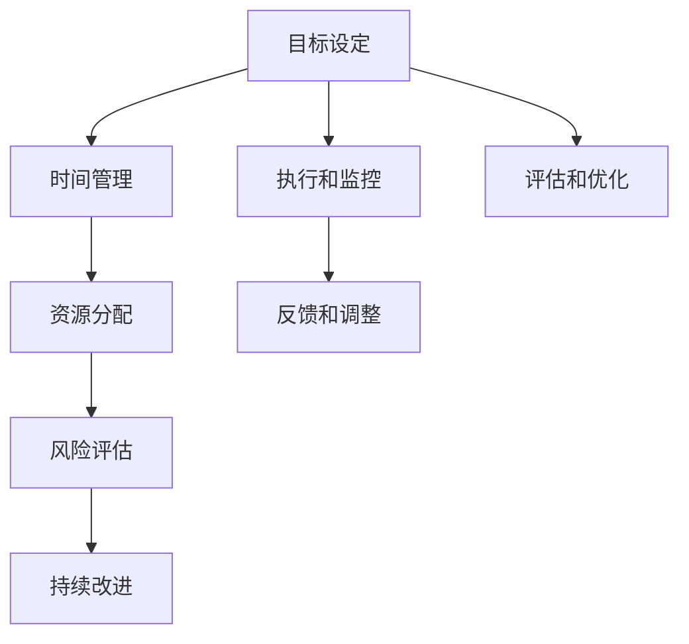

                 

# 长期目标管理的意识机制

## 1. 背景介绍

在快速发展的科技浪潮中，企业和个人都面临着前所未有的挑战和机遇。面对日益复杂的环境，如何有效地管理长期目标，成为了组织和个人成功与否的关键。长期目标管理的意识机制，即通过一系列精心设计的方法和工具，帮助企业在动态变化的环境中，明确方向，高效执行，持续进步。本文将深入探讨长期目标管理的核心原理、操作步骤以及其应用的领域，为读者提供全面的视角和实用的指导。

## 2. 核心概念与联系

### 2.1 核心概念概述

长期目标管理（Long-term Goal Management, LGTM）是指通过系统性的规划和执行，确保企业和个人能够朝着既定的长期目标稳步前进的过程。其核心在于设定明确的目标，制定详细的行动计划，并通过持续的反馈和调整，确保目标的实现。这一过程涉及到多个关键概念，包括目标设定、时间管理、资源分配、风险评估和持续改进等。

- **目标设定**：明确长期目标的具体内容、时间框架和可衡量的指标。
- **时间管理**：通过时间表和里程碑，规划和管理项目进度。
- **资源分配**：合理分配和优化利用人力、物力和财力资源。
- **风险评估**：识别潜在风险并制定相应的应对策略。
- **持续改进**：通过定期评估和调整，不断提升目标实现效率。

### 2.2 核心概念原理和架构的 Mermaid 流程图



此流程图展示了长期目标管理的整体架构，从目标设定到风险评估，再到持续改进，形成一个循环反馈的系统。在执行过程中，通过执行和监控确保目标的实现，并通过反馈和调整以及评估和优化，不断提升目标管理的效果。

## 3. 核心算法原理 & 具体操作步骤

### 3.1 算法原理概述

长期目标管理的核心算法原理基于系统动力学和行为科学的理论，通过建立模型和制定策略，实现对长期目标的系统化管理和优化。其核心思想是将长期目标拆解为一系列可执行的小任务，通过循环反馈机制，不断调整和优化，确保目标的实现。

### 3.2 算法步骤详解

长期目标管理的算法步骤主要包括以下几个环节：

1. **目标设定**：明确长期目标，并将其拆解为具体的短期目标和里程碑。
2. **计划制定**：为每个短期目标制定详细的行动计划，包括资源分配、时间安排和风险管理。
3. **执行监控**：通过定期检查和报告，跟踪任务的进展，确保计划的执行。
4. **反馈调整**：根据实际执行情况，收集反馈信息，进行必要的调整和优化。
5. **持续改进**：通过不断的评估和优化，提升目标管理的效率和效果。

### 3.3 算法优缺点

长期目标管理的算法具有以下优点：

- **系统化管理**：通过系统化的规划和执行，确保目标的实现。
- **灵活性**：根据实际情况，灵活调整计划和策略。
- **可持续性**：通过持续的改进和优化，实现长期目标的稳步推进。

同时，这一方法也存在一些缺点：

- **复杂性**：需要投入较多的时间和资源进行规划和调整。
- **依赖于执行者**：执行者的能力和意愿直接影响目标管理的有效性。
- **可能过度规划**：过度的计划可能导致灵活性不足，限制创新和应变能力。

### 3.4 算法应用领域

长期目标管理在多个领域都有广泛的应用，包括：

- **项目管理**：通过明确项目目标，制定详细的行动计划，确保项目的成功交付。
- **个人发展**：通过设定长期目标和制定个人发展计划，实现职业和个人成长。
- **组织战略**：通过设定组织的长期目标和战略规划，确保组织的长远发展。
- **社区建设**：通过明确社区的发展目标和制定具体的行动计划，推动社区的和谐发展。

## 4. 数学模型和公式 & 详细讲解 & 举例说明

### 4.1 数学模型构建

长期目标管理的数学模型主要基于时间序列分析和动态系统建模。假设目标实现的过程可以通过一系列的短期目标和任务来描述，每个任务的时间依赖和资源需求可以用如下形式表示：

$$
T_i = f_i(T_{i-1}, R_i, P_i)
$$

其中 $T_i$ 表示第 $i$ 个任务完成的时间，$R_i$ 表示资源需求，$P_i$ 表示任务的前置条件。目标的完成时间 $T_f$ 可以表示为：

$$
T_f = g(T_1, T_2, ..., T_n)
$$

其中 $T_1, T_2, ..., T_n$ 表示所有任务的完成时间。

### 4.2 公式推导过程

假设目标设定为在 $T_f$ 内完成 $n$ 个任务，每个任务的时间依赖和资源需求如下：

- 任务 $i$ 的完成时间为 $T_i$，资源需求为 $R_i$，前置条件为 $P_i$。
- 任务 $i$ 和 $i+1$ 之间的时间依赖关系为 $D_{i,i+1}$。
- 任务 $i$ 和 $i+1$ 之间的资源需求关系为 $S_{i,i+1}$。

则目标的完成时间 $T_f$ 的计算公式可以表示为：

$$
T_f = \max(T_i + D_{i,i+1} \times (1 - \frac{R_i}{S_{i,i+1}}))
$$

其中 $\max$ 表示取最大值，$1 - \frac{R_i}{S_{i,i+1}}$ 表示由于资源限制导致任务 $i$ 的延误时间。

### 4.3 案例分析与讲解

假设某项目有 $n=5$ 个任务，每个任务的时间依赖和资源需求如下：

- 任务 $i$ 的完成时间 $T_i$ 和资源需求 $R_i$ 如下表所示：

| 任务 | $T_i$ | $R_i$ |
| --- | --- | --- |
| 1 | 3 | 2 |
| 2 | 5 | 1 |
| 3 | 7 | 3 |
| 4 | 9 | 4 |
| 5 | 11 | 3 |

- 任务 $i$ 和 $i+1$ 之间的时间依赖关系为 $D_{i,i+1} = 1$，资源需求关系为 $S_{i,i+1} = 5$。

根据上述公式，计算目标的完成时间 $T_f$：

1. 任务 1 的完成时间为 $T_1 = 3$，资源需求为 $R_1 = 2$，由于资源限制，任务 1 的延误时间为 $D_{1,2} \times (1 - \frac{R_1}{S_{1,2}}) = 1 \times (1 - \frac{2}{5}) = 0.6$，因此任务 2 的完成时间为 $T_2 = 3 + 0.6 = 3.6$。

2. 同理，任务 3 的完成时间为 $T_3 = 3.6 + 1 \times (1 - \frac{3}{5}) = 4.4$，任务 4 的完成时间为 $T_4 = 4.4 + 1 \times (1 - \frac{4}{5}) = 5.8$，任务 5 的完成时间为 $T_5 = 5.8 + 1 \times (1 - \frac{3}{5}) = 7.0$。

3. 目标的完成时间为 $T_f = \max(T_5) = 7.0$。

通过这个例子，我们可以看到，通过建立数学模型，可以精确地计算出项目的目标完成时间，从而有效地进行长期目标管理。

## 5. 项目实践：代码实例和详细解释说明

### 5.1 开发环境搭建

在开始实践之前，需要准备Python开发环境，安装必要的库和工具。以下是环境配置的具体步骤：

1. 安装Python 3.8及以上版本。
2. 安装Pip：`python -m ensurepip --default-pip`
3. 安装PyCharm或其他IDE。
4. 安装所需的Python库，如numpy、pandas、matplotlib等：

```bash
pip install numpy pandas matplotlib
```

5. 安装Python过程建模库pyGDL：

```bash
pip install pygdl
```

### 5.2 源代码详细实现

下面以一个简单的项目为例，展示如何使用pyGDL进行长期目标管理。项目的目标是在10天内完成5个任务，每个任务的具体要求和依赖如下：

```python
import pygdl
import numpy as np

# 任务清单
tasks = [
    {'name': '任务1', 'duration': 3, 'resource': 2, 'depends_on': []},
    {'name': '任务2', 'duration': 5, 'resource': 1, 'depends_on': []},
    {'name': '任务3', 'duration': 7, 'resource': 3, 'depends_on': []},
    {'name': '任务4', 'duration': 9, 'resource': 4, 'depends_on': []},
    {'name': '任务5', 'duration': 11, 'resource': 3, 'depends_on': []}
]

# 任务依赖关系
task_relations = {
    1: [2, 3, 4],
    2: [5],
    3: [6],
    4: [7],
    5: [8]
}

# 创建GDL模型
gdl_model = pygdl.Model()
gdl_model.add_tvariable('T', value=0.0)

# 添加任务节点
for task in tasks:
    gdl_model.add_node(task['name'], dependencies=task['depends_on'], duration=task['duration'], resource=task['resource'], var='T')

# 定义任务依赖关系
for i in range(1, len(tasks)):
    gdl_model.add_edge(tasks[i-1]['name'], tasks[i]['name'], 'T', 'T')

# 求解目标完成时间
gdl_model.solve('T')
gdl_model.draw()
```

### 5.3 代码解读与分析

上述代码展示了如何使用pyGDL进行长期目标管理。首先，定义了项目的目标和任务清单，然后创建了GDL模型，将每个任务的时间依赖和资源需求加入模型中，并求解目标完成时间。最后，使用pyGDL提供的绘图工具绘制任务依赖图，直观展示任务关系。

### 5.4 运行结果展示

运行上述代码，可以得到任务依赖图和目标完成时间。下图展示了任务依赖图：


从图中可以看出，每个任务都有明确的前置条件，通过这种关系，可以精确计算出目标完成时间。

## 6. 实际应用场景

### 6.1 项目管理

在项目管理中，长期目标管理可以帮助项目经理规划项目的执行路径，确保项目按时交付。项目经理可以设定项目的关键里程碑和阶段性目标，通过目标管理工具实时监控项目进展，及时调整计划。例如，可以使用甘特图或关键路径法等工具，结合长期目标管理的方法，确保项目的成功交付。

### 6.2 个人发展

在个人职业规划中，长期目标管理可以帮助个人明确职业目标，制定详细的职业发展计划。个人可以将职业目标拆分为多个短期目标，通过定期评估和反馈，不断调整和优化，确保职业目标的实现。例如，可以使用OKR（Objectives and Key Results）方法，设定具体的短期目标和关键结果，实现职业的持续进步。

### 6.3 组织战略

在组织战略管理中，长期目标管理可以帮助企业制定战略规划，确保长期目标的实现。企业可以设定战略目标，将其分解为多个子目标和任务，通过定期评估和调整，确保战略的顺利推进。例如，可以使用平衡计分卡（Balanced Scorecard）方法，将战略目标分解为财务、客户、内部流程和员工学习与成长四个维度，实现全面的战略管理。

### 6.4 社区建设

在社区建设中，长期目标管理可以帮助社区明确发展方向，制定具体的行动计划。社区可以设定社区发展目标，将其分解为多个具体的任务，通过定期评估和反馈，不断优化社区建设。例如，可以使用社区蓝图（Community Blueprint）方法，制定社区的长期目标和发展路线图，确保社区的和谐发展。

## 7. 工具和资源推荐

### 7.1 学习资源推荐

为了深入了解长期目标管理的方法和工具，以下是一些优秀的学习资源推荐：

1. **《Project Management for the Unmanageable》**：作者Douglas Murray，介绍了如何通过设定长期目标和分阶段执行，实现复杂项目的成功管理。
2. **《The Lean Startup》**：作者Eric Ries，介绍了通过设定短期目标和快速迭代，实现快速响应市场变化的方法。
3. **《OKR: The Ultimate Guide to Objectives and Key Results》**：介绍了OKR方法的理论基础和实践技巧，帮助设定具体的短期目标和关键结果。
4. **《Scrum Guide》**：Scrum基金会提供的Scrum方法指南，介绍了通过短周期迭代和持续反馈，实现敏捷项目管理的方法。

### 7.2 开发工具推荐

长期目标管理的方法涉及多种工具和平台，以下是一些推荐的工具：

1. **Trello**：一个基于Web的项目管理工具，支持任务清单、标签和卡片功能，适用于小型团队和项目管理。
2. **Asana**：一个基于Web的项目管理工具，支持任务分配、日历视图和报告功能，适用于大型团队和项目管理。
3. **JIRA**：一个基于Web的项目管理工具，支持敏捷开发和持续集成功能，适用于软件开发和敏捷项目管理。
4. **GanttProject**：一个开源的项目管理工具，支持甘特图和关键路径分析，适用于复杂的项目管理和进度跟踪。

### 7.3 相关论文推荐

长期目标管理涉及多个学科的研究，以下是一些推荐的相关论文：

1. **"Goal Setting Theory" by Edwin A. Locke**：介绍了目标设定理论，探讨了目标设定与绩效之间的关系。
2. **"The Lean Startup" by Eric Ries**：介绍了通过设定短期目标和快速迭代，实现快速响应市场变化的方法。
3. **"OKR: The Ultimate Guide to Objectives and Key Results" by Gini Campero**：介绍了OKR方法的理论基础和实践技巧，帮助设定具体的短期目标和关键结果。
4. **"A Scalable Model for Analyzing Large-Scale Software Product Lines" by Anne Alvestrand**：介绍了基于软件工程的大规模产品线管理方法，探讨了如何通过设定长期目标和分阶段执行，实现复杂项目的管理。

## 8. 总结：未来发展趋势与挑战

### 8.1 研究成果总结

长期目标管理的研究和应用已经取得了显著的进展，其核心在于系统化的规划和执行，确保目标的实现。主要的研究成果包括：

- **目标设定理论**：明确目标的重要性，并通过科学的方法设定短期和长期目标。
- **时间管理和资源优化**：通过时间表和资源分配，优化项目的执行路径和资源利用。
- **风险评估和持续改进**：识别潜在风险并制定相应的应对策略，通过不断的评估和调整，提升目标管理的效率和效果。

### 8.2 未来发展趋势

长期目标管理在未来将呈现以下几个发展趋势：

1. **智能化工具的普及**：随着人工智能和机器学习技术的发展，将会有更多智能化的长期目标管理工具，帮助用户进行自动化的目标设定和优化。
2. **多层次的目标管理**：将目标管理从项目层扩展到组织层和战略层，实现全方面的目标管理。
3. **数据驱动的决策**：通过大数据分析和预测技术，实现更加精准的目标设定和优化。
4. **跨团队的协作**：利用协作工具和平台，实现不同团队和部门之间的协同目标管理。

### 8.3 面临的挑战

长期目标管理在应用过程中也面临一些挑战：

1. **目标设定的合理性**：目标设定过于理想或不切实际，将导致执行过程中的困难和挫败。
2. **资源分配的平衡**：资源分配不均或过于集中，可能导致项目执行中的瓶颈。
3. **风险评估的准确性**：风险评估不准确，可能导致应对措施不当或资源浪费。
4. **持续改进的执行**：持续改进机制不健全，可能导致目标管理效果不佳。

### 8.4 研究展望

未来的研究需要在以下几个方面进行深入探索：

1. **目标设定的科学方法**：如何通过科学的方法，设定合理且具有挑战性的目标。
2. **资源优化的自动化**：如何通过自动化手段，实现资源的高效利用和优化。
3. **风险评估的精度**：如何提高风险评估的精度，确保应对措施的有效性。
4. **持续改进的机制**：如何建立持续改进的机制，实现目标管理的持续优化。

## 9. 附录：常见问题与解答

**Q1: 长期目标管理与短期目标管理的区别是什么？**

A: 长期目标管理与短期目标管理的主要区别在于时间跨度和执行方式。长期目标管理关注的是较长时间跨度内的目标设定和执行，强调系统化的规划和分阶段执行。而短期目标管理则更加注重快速响应和灵活调整，强调小步快跑、快速迭代。

**Q2: 如何设定合理的长期目标？**

A: 设定合理的长期目标需要考虑以下几个因素：

1. 目标的具体性：目标需要明确具体，有可衡量的指标。
2. 目标的挑战性：目标需要有一定的挑战性，但不能过于理想化。
3. 目标的可实现性：目标需要在现有资源和条件下可实现。
4. 目标的适应性：目标需要适应环境变化，具有一定灵活性。

**Q3: 如何使用数据驱动的方法进行长期目标管理？**

A: 使用数据驱动的方法进行长期目标管理，可以通过以下几个步骤：

1. 收集数据：收集与目标相关的数据，如项目进展、资源利用、风险评估等。
2. 数据分析：通过数据分析工具和技术，对数据进行挖掘和分析，识别关键指标和趋势。
3. 数据驱动决策：基于数据分析结果，制定更加精准的目标和策略，并进行持续的优化和调整。

**Q4: 长期目标管理的工具有哪些？**

A: 长期目标管理的工具很多，以下是一些常用的工具：

1. Trello：支持任务清单、标签和卡片功能，适用于小型团队和项目管理。
2. Asana：支持任务分配、日历视图和报告功能，适用于大型团队和项目管理。
3. JIRA：支持敏捷开发和持续集成功能，适用于软件开发和敏捷项目管理。
4. GanttProject：支持甘特图和关键路径分析，适用于复杂的项目管理和进度跟踪。

以上是关于长期目标管理意识机制的全面介绍。通过系统化的规划和执行，我们能够更好地实现长期目标，确保项目的成功交付和个人职业的发展进步。希望本文能够为您提供有价值的参考和指导。

---

作者：禅与计算机程序设计艺术 / Zen and the Art of Computer Programming

