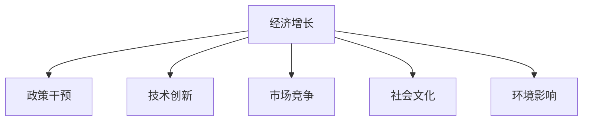

                 

# 阶段性因素对经济增长的影响

> 关键词：阶段性因素, 经济增长, 政策干预, 技术创新, 市场竞争, 社会文化, 环境影响

## 1. 背景介绍

### 1.1 问题由来
经济增长是人类社会发展的重要目标之一，也是政策制定者、经济学家长期关注的核心议题。理解影响经济增长的关键因素，并识别其作用机制，对于制定有效的宏观经济政策、促进长期经济健康发展至关重要。然而，由于经济系统本身的复杂性和动态性，经济增长的驱动因素并非一成不变，而是随着时间、地点、政策等因素的阶段性变化而呈现出不同的特征。

### 1.2 问题核心关键点
经济增长是一个多因素、多维度、多层次的复杂系统，涉及宏观层面、微观层面以及多层次的社会文化、政策制度、技术创新、市场环境等因素。本文聚焦于分析阶段性因素对经济增长的影响，将探讨政策干预、技术创新、市场竞争、社会文化、环境影响等关键因素，并试图通过系统性的框架分析，为理解这些因素在特定时期内如何影响经济增长提供科学依据。

### 1.3 问题研究意义
研究阶段性因素对经济增长的影响，有助于政策制定者和学者更深入理解经济系统的动态变化，优化宏观调控政策，提升经济增长的可持续性和稳定性。同时，通过科学的经济增长预测和分析，可以有效指导投资决策，提升经济资源配置效率，促进经济增长与社会福祉的协调发展。

## 2. 核心概念与联系

### 2.1 核心概念概述

为更好地理解阶段性因素对经济增长的影响，本节将介绍几个密切相关的核心概念：

- **经济增长**：指一国或地区在一定时期内生产的商品和服务的价值量的增加，通常以国内生产总值(GDP)增长率作为衡量指标。
- **阶段性因素**：指在特定时间点或时间段内对经济增长产生重要影响的外部或内部因素，如政策干预、技术创新、市场竞争、社会文化、环境影响等。
- **政策干预**：指政府通过宏观经济政策、行业政策、财政货币政策等手段，对经济活动进行调控和指导。
- **技术创新**：指通过新产品、新工艺、新技术的应用，推动生产效率提升，从而对经济增长产生积极影响。
- **市场竞争**：指市场中的供需双方通过竞争和合作，推动资源优化配置，促进经济效率提升。
- **社会文化**：指社会的基本价值观、文化传统、教育水平等，对经济发展方式、人力资源配置、社会稳定性等产生深远影响。
- **环境影响**：指自然环境因素对经济活动的影响，包括资源供应、生态保护、环境污染等问题。

这些核心概念之间的逻辑关系可以通过以下Mermaid流程图来展示：



这个流程图展示了一组关键因素如何共同作用于经济增长，影响经济发展的各个层面：

1. 经济增长与政策干预之间的双向互动，反映了宏观调控对经济活动的引导和响应。
2. 技术创新通过提升生产效率、推动新产业出现，直接影响经济增长。
3. 市场竞争通过优化资源配置、刺激创新，促进经济活动活力。
4. 社会文化通过塑造经济行为模式、影响消费习惯，间接作用于经济增长。
5. 环境影响通过影响资源可持续性、生态平衡，对经济活动产生深远影响。

这些因素共同构成了经济增长的复合系统，对经济发展的各个阶段产生复杂而微妙的影响。

## 3. 核心算法原理 & 具体操作步骤
### 3.1 算法原理概述

理解阶段性因素对经济增长的影响，需采用系统性、动态性的分析框架，通过模型构建、数据处理、结果验证等步骤，识别关键驱动因素，分析其作用机制，最终形成政策建议。核心算法包括但不限于：

- **多元线性回归模型**：用于分析多个独立变量对经济增长的影响，识别主要驱动因素。
- **时间序列分析**：通过时间序列数据，捕捉经济增长的趋势、周期性变化。
- **协整分析**：分析变量之间的长期均衡关系，识别经济系统中的因果链。
- **Granger因果检验**：检验一个变量是否对另一个变量的未来变化具有预测能力，识别关键影响因素。

### 3.2 算法步骤详解

基于上述算法原理，阶段性因素对经济增长的分析可以分为以下几个关键步骤：

**Step 1: 数据收集与预处理**
- 收集宏观经济数据（如GDP、就业率、通货膨胀率等）、政策数据（如财政政策、货币政策等）、科技数据（如专利申请量、R&D投入等）、市场数据（如企业数量、行业集中度等）、社会文化数据（如教育水平、人口结构等）、环境数据（如资源消耗、碳排放等）。
- 对数据进行清洗、标准化、缺失值处理等预处理工作，确保数据质量。

**Step 2: 模型构建与参数选择**
- 构建多元线性回归模型，设定经济增长为因变量，政策干预、技术创新、市场竞争、社会文化、环境影响等为自变量。
- 使用协整分析识别变量之间的长期均衡关系，排除不存在长期关系的变量。
- 使用Granger因果检验，确定各变量之间的因果关系，排除无因果关系的变量。

**Step 3: 模型训练与结果验证**
- 对最终选定的模型进行训练，使用历史数据拟合模型参数。
- 在验证集上评估模型性能，通过R方、调整R方、残差分析等指标验证模型的拟合优度和稳定性。
- 进行模型诊断，如检查异方差、自相关性、模型假设检验等，确保模型结果的可信性。

**Step 4: 结果分析与政策建议**
- 分析模型结果，识别阶段性因素对经济增长的影响大小和方向。
- 结合实际情况，提出针对性的政策建议，如调整宏观调控力度、优化科技创新政策、加强市场竞争环境、提升社会文化水平、保护生态环境等。
- 进行敏感性分析，评估不同阶段性因素对经济增长可能产生的变化，为政策制定提供科学依据。

### 3.3 算法优缺点

阶段性因素对经济增长的分析方法具有以下优点：

1. **系统性分析**：通过多元回归、协整分析、Granger因果检验等模型，全面系统地分析多个因素对经济增长的影响。
2. **时间序列分析**：通过时间序列模型，捕捉经济增长的趋势和周期性变化，分析不同阶段的经济动态。
3. **因果分析**：通过协整分析和Granger因果检验，明确各变量之间的因果关系，确保分析结果的可靠性和针对性。
4. **模型检验**：通过模型诊断，确保模型结果的合理性和可信度，提高政策建议的科学性。

但该方法也存在以下局限：

1. **数据质量依赖**：模型结果依赖于数据质量，若数据存在错误、缺失或不完整，可能会影响模型结果的准确性。
2. **变量选择复杂**：模型构建中需要进行变量选择，确定影响经济增长的关键因素，可能存在选择偏差。
3. **模型假设限制**：大多数模型基于一定的假设条件，如独立同分布、平稳性等，若假设不成立，模型结果可能失效。
4. **动态性考量不足**：部分模型（如静态回归）可能无法充分反映经济系统的动态变化和阶段性特征。

### 3.4 算法应用领域

阶段性因素对经济增长的分析方法广泛应用于以下几个领域：

- **宏观经济政策制定**：分析不同阶段的经济增长驱动因素，为政策制定提供数据支持，如调整税收政策、货币政策等。
- **行业分析与发展规划**：识别影响各行业发展的关键因素，指导行业发展规划，提升产业竞争力。
- **企业战略制定**：分析影响企业成长的关键外部因素，指导企业制定科学的发展战略，提升市场竞争力。
- **区域经济发展规划**：识别影响区域经济发展的关键因素，优化区域资源配置，促进经济协调发展。
- **社会政策设计**：分析社会文化、环境因素对经济增长的影响，推动社会政策的优化设计，促进社会公平与可持续发展。

以上领域均需要科学、系统的经济增长分析方法，以实现政策科学决策和经济发展的高效管理。

## 4. 数学模型和公式 & 详细讲解 & 举例说明

### 4.1 数学模型构建

在构建阶段性因素对经济增长的模型时，常用的数学模型包括多元线性回归模型和协整模型。

假设经济增长率 $y_t$ 受到 $n$ 个自变量 $x_{1t}, x_{2t}, \ldots, x_{nt}$ 的影响，可以构建如下多元线性回归模型：

$$
y_t = \alpha + \beta_1 x_{1t} + \beta_2 x_{2t} + \ldots + \beta_n x_{nt} + \epsilon_t
$$

其中 $\alpha$ 为常数项，$\beta_i$ 为各自变量的系数，$\epsilon_t$ 为误差项，假设满足同方差、独立性等条件。

### 4.2 公式推导过程

为了更好地理解模型构建和推导过程，以一个简单的例子说明：

假设某国经济增长率 $y_t$ 受政策干预 $x_1t$、技术创新 $x_2t$、市场竞争 $x_3t$、社会文化 $x_4t$、环境影响 $x_5t$ 的影响。我们构建多元线性回归模型，设定常数项 $\alpha = 0$，系数 $\beta_i$ 为参数估计值，误差项 $\epsilon_t$ 服从零均值、同方差正态分布。模型为：

$$
y_t = \beta_1 x_{1t} + \beta_2 x_{2t} + \beta_3 x_{3t} + \beta_4 x_{4t} + \beta_5 x_{5t} + \epsilon_t
$$

其中 $y_t$ 为经济增长率，$x_{1t}, x_{2t}, x_{3t}, x_{4t}, x_{5t}$ 分别为政策干预、技术创新、市场竞争、社会文化、环境影响，$\epsilon_t$ 为随机误差项。

### 4.3 案例分析与讲解

以中国经济增长为例，假设我们使用上述模型进行分析：

- **政策干预**：设定 $x_{1t}$ 为政府财政支出占GDP的比例，分析其对经济增长的影响。
- **技术创新**：设定 $x_{2t}$ 为专利申请量，分析其对经济增长的影响。
- **市场竞争**：设定 $x_{3t}$ 为企业数量，分析其对经济增长的影响。
- **社会文化**：设定 $x_{4t}$ 为人均受教育年限，分析其对经济增长的影响。
- **环境影响**：设定 $x_{5t}$ 为碳排放量，分析其对经济增长的影响。

通过对历史数据进行拟合，可以得到模型系数 $\beta_i$，进而分析每个因素对经济增长的贡献。

## 5. 项目实践：代码实例和详细解释说明

### 5.1 开发环境搭建

在进行阶段性因素对经济增长的分析前，我们需要准备好开发环境。以下是Python编程语言和相关库的安装步骤：

1. **安装Python**：
   - 下载并安装Python，选择最新版本进行安装。
   - 安装pip包管理工具。

2. **安装相关库**：
   - 安装pandas：
     ```bash
     pip install pandas
     ```
   - 安装numpy：
     ```bash
     pip install numpy
     ```
   - 安装scikit-learn：
     ```bash
     pip install scikit-learn
     ```
   - 安装statsmodels：
     ```bash
     pip install statsmodels
     ```

3. **安装图形界面库**：
   - 安装matplotlib：
     ```bash
     pip install matplotlib
     ```
   - 安装seaborn：
     ```bash
     pip install seaborn
     ```

完成上述步骤后，即可在Python环境中进行阶段性因素对经济增长的分析。

### 5.2 源代码详细实现

以下是一个使用Python和statsmodels库进行多元线性回归分析的代码示例：

```python
import pandas as pd
import numpy as np
from statsmodels.api import OLS
import matplotlib.pyplot as plt
import seaborn as sns

# 读取数据
data = pd.read_csv('economy_data.csv')

# 模型构建
X = data[['policy', 'tech', 'market', 'culture', 'environment']]
y = data['growth']

model = OLS(y, X)
results = model.fit()

# 模型评估
print(results.summary())

# 绘制残差图
residuals = results.resid
sns.residplot(x=results.fittedvalues, y=residuals)
plt.show()

# 绘制Q-Q图
sns.probplot(residuals, plot=plt)
plt.show()
```

在这个代码示例中，我们首先使用pandas库读取数据，然后使用statsmodels库构建多元线性回归模型。最后，使用matplotlib和seaborn库进行模型评估，包括残差图和Q-Q图，用于检查模型假设是否成立。

### 5.3 代码解读与分析

**代码解读**：
- 首先，我们使用pandas库读取经济数据，并将其存储在DataFrame对象中。
- 然后，使用statsmodels库的OLS函数构建多元线性回归模型，其中自变量为政策、技术、市场、社会文化、环境，因变量为经济增长率。
- 接着，调用fit方法拟合模型，并打印模型结果。
- 最后，使用matplotlib和seaborn库绘制残差图和Q-Q图，进行模型评估。

**分析**：
- 残差图用于检查模型假设，如同方差性、独立性、正态性等。若残差图分布均匀，则说明模型假设成立。
- Q-Q图用于检查残差是否服从正态分布，若残差接近对角线，则说明残差服从正态分布，模型假设成立。

## 6. 实际应用场景

### 6.1 宏观经济政策制定

在宏观经济政策制定中，理解阶段性因素对经济增长的影响，对于制定科学、有效的政策具有重要意义。

以应对经济衰退为例，政策制定者可以通过分析历史数据，识别影响经济增长的关键因素。例如，政策干预、技术创新、市场竞争等。政策制定者可以针对这些因素，制定相应的宏观调控政策，如增加财政支出、鼓励技术创新、优化市场竞争环境等，从而促进经济恢复。

### 6.2 行业分析与发展规划

在行业分析与发展规划中，理解阶段性因素对经济增长的影响，可以帮助行业制定科学的发展规划，提升产业竞争力。

例如，在评估新兴行业如人工智能、绿色能源的发展潜力时，可以分析技术创新、市场竞争、政策支持等因素对其增长的影响。通过科学分析，行业可以制定更具针对性的发展战略，如加强技术研发投入、优化市场环境、争取政策支持等，从而提升行业竞争力。

### 6.3 企业战略制定

在企业战略制定中，理解阶段性因素对经济增长的影响，可以帮助企业制定科学的发展战略，提升市场竞争力。

例如，企业可以通过分析影响其增长的关键因素，如技术创新、市场竞争、社会文化等，制定相应的战略措施。如加大研发投入、开拓新市场、提升品牌影响力等，从而增强企业竞争力，实现可持续发展。

### 6.4 区域经济发展规划

在区域经济发展规划中，理解阶段性因素对经济增长的影响，可以优化资源配置，促进经济协调发展。

例如，在评估某个地区的经济发展潜力时，可以分析影响其增长的关键因素，如政策支持、技术创新、市场竞争等。通过科学分析，制定更加合理的区域经济发展规划，如优化产业结构、提升基础设施、加强政策支持等，从而推动区域经济协调发展。

### 6.5 社会政策设计

在社会政策设计中，理解阶段性因素对经济增长的影响，可以促进社会公平与可持续发展。

例如，在分析教育水平对经济增长的影响时，可以制定相应的社会政策，如提升教育投入、改善教育质量、缩小教育差距等，从而促进社会公平与可持续发展。

## 7. 工具和资源推荐

### 7.1 学习资源推荐

为了帮助开发者系统掌握阶段性因素对经济增长的分析方法，这里推荐一些优质的学习资源：

1. **《宏观经济学》课程**：耶鲁大学经济系开设的宏观经济学课程，涵盖经济增长、货币政策、财政政策等内容，适合初学者和进阶者。
2. **《统计学导论》书籍**：斯坦福大学统计系编写的统计学教材，涵盖多元回归、协整分析、时间序列等内容，适合统计学学习者。
3. **《计量经济学》书籍**：张五常等经济学家编写的计量经济学教材，涵盖多种计量分析方法，适合经济学学习者。
4. **Coursera平台**：提供各类经济学和统计学课程，涵盖计量分析、经济增长理论等内容，适合在线学习。
5. **R语言社区**：R语言作为统计分析的常用工具，拥有丰富的学习资源和社区支持，适合深入学习。

通过这些资源的学习实践，相信你一定能够掌握阶段性因素对经济增长的分析方法，并用于解决实际的经济学问题。

### 7.2 开发工具推荐

高效的开发离不开优秀的工具支持。以下是几款用于阶段性因素对经济增长分析的常用工具：

1. **Python编程语言**：Python作为数据科学和机器学习的主流语言，具有丰富的数据处理和建模库，适合大规模数据分析。
2. **R语言**：R语言作为统计分析的重要工具，拥有丰富的统计分析库和数据可视化工具，适合数据探索和分析。
3. **statsmodels库**：Python的统计分析库，提供丰富的统计分析功能，适合进行多元回归、协整分析等建模。
4. **Pandas库**：Python的数据处理库，适合数据清洗、预处理等操作。
5. **Matplotlib和Seaborn库**：Python的数据可视化库，适合绘制图表和可视化分析结果。

合理利用这些工具，可以显著提升阶段性因素对经济增长分析的开发效率，加快创新迭代的步伐。

### 7.3 相关论文推荐

阶段性因素对经济增长的研究源于学界的持续研究。以下是几篇奠基性的相关论文，推荐阅读：

1. **《宏观经济增长的因素分析》**：罗伯特·巴罗(Robert Barro)，系统分析了影响经济增长的关键因素，包括政策干预、技术创新、市场竞争等。
2. **《经济增长的收敛性》**：保罗·罗默(Paul Romer)，探讨了经济增长的收敛性，分析了技术和知识积累对经济增长的影响。
3. **《新经济增长理论》**：戴维·罗默(David Romer)，提出了新经济增长理论，强调技术和知识积累对经济增长的重要性。
4. **《经济增长的外部性》**：罗杰·迈克鲁姆(Roger McAleese)，探讨了经济增长外部性，分析了外部性对经济增长的影响。
5. **《政策干预对经济增长的影响》**：托马斯·皮凯蒂(Thomas Piketty)，分析了政策干预对经济增长的影响，提出了新的政策干预思路。

这些论文代表了大规模因素对经济增长研究的发展脉络。通过学习这些前沿成果，可以帮助研究者把握学科前进方向，激发更多的创新灵感。

## 8. 总结：未来发展趋势与挑战

### 8.1 总结

本文对阶段性因素对经济增长的影响进行了全面系统的介绍。首先阐述了阶段性因素对经济增长的研究背景和意义，明确了政策干预、技术创新、市场竞争、社会文化、环境影响等关键因素，并试图通过系统性的框架分析，为理解这些因素在特定时期内如何影响经济增长提供科学依据。其次，从原理到实践，详细讲解了阶段性因素对经济增长的数学模型构建和操作步骤，给出了经济增长分析的完整代码实例。同时，本文还广泛探讨了阶段性因素对经济增长的应用场景，展示了其广阔的前景。

通过本文的系统梳理，可以看到，阶段性因素对经济增长的分析方法正在成为经济学研究的重要工具，极大地提升了经济增长的科学预测和决策支持能力。未来，伴随经济系统和社会环境的不断变化，阶段性因素对经济增长的分析方法也将不断发展，为经济学研究提供更加坚实的理论基础和实践指导。

### 8.2 未来发展趋势

展望未来，阶段性因素对经济增长的分析方法将呈现以下几个发展趋势：

1. **大数据分析**：随着大数据技术的发展，经济增长的数据来源将更加多样和全面，分析方法也将更加复杂和精细。
2. **机器学习应用**：利用机器学习技术，可以更加深入地分析经济增长的复杂动态，提高分析精度和速度。
3. **跨学科融合**：经济学将更多地与其他学科（如社会学、心理学、环境科学等）进行交叉融合，提升分析的全面性和深度。
4. **政策模拟**：利用模拟技术，可以动态评估不同政策对经济增长的影响，为政策制定提供科学依据。
5. **全球化分析**：在全球化背景下，分析不同国家或地区的经济增长差异，提出全球化政策建议。

这些趋势将推动阶段性因素对经济增长的分析方法不断进步，为经济学的深入研究和应用提供新的动力。

### 8.3 面临的挑战

尽管阶段性因素对经济增长的分析方法已经取得了显著进展，但在迈向更加智能化、普适化应用的过程中，它仍面临着诸多挑战：

1. **数据质量问题**：经济增长数据存在多样性、复杂性，数据质量参差不齐，可能影响分析结果的准确性。
2. **变量选择困难**：经济增长因素众多，变量选择复杂，可能存在选择偏差。
3. **模型假设限制**：大多数模型基于一定的假设条件，假设不成立时，模型结果可能失效。
4. **动态性考量不足**：部分模型（如静态回归）可能无法充分反映经济系统的动态变化和阶段性特征。
5. **政策影响不确定**：不同政策效果差异大，难以确定政策对经济增长的影响。

### 8.4 研究展望

面对阶段性因素对经济增长的分析所面临的挑战，未来的研究需要在以下几个方面寻求新的突破：

1. **多源数据融合**：利用大数据技术，整合多种数据源，提高数据质量，增强分析结果的可靠性。
2. **模型方法创新**：开发更加复杂、精细的建模方法，提高分析的全面性和精度。
3. **跨学科合作**：促进经济学与其他学科的深度合作，增强分析的全面性和深度。
4. **动态性分析**：开发动态经济模型，深入分析经济系统的动态变化和阶段性特征。
5. **政策效果评估**：建立政策效果的评估框架，科学评估不同政策对经济增长的影响。

这些研究方向的探索，必将引领阶段性因素对经济增长的分析方法迈向更高的台阶，为经济学的深入研究和应用提供新的动力。面向未来，阶段性因素对经济增长的分析方法需要与其他经济学理论和技术进行更深入的融合，共同推动经济增长理论的进步和应用。只有勇于创新、敢于突破，才能不断拓展经济增长的边界，为人类经济社会发展提供更加坚实的理论基础和实践指导。

## 9. 附录：常见问题与解答

**Q1: 如何理解阶段性因素对经济增长的影响？**

A: 阶段性因素对经济增长的影响是指特定时期内的外部或内部因素对经济增长速度和方向的变化产生的影响。例如，政策干预、技术创新、市场竞争、社会文化、环境影响等。这些因素通过不同机制，对经济活动产生复杂而微妙的影响，从而影响经济增长的趋势和波动。

**Q2: 如何识别影响经济增长的关键因素？**

A: 识别影响经济增长的关键因素，通常需要进行变量选择和模型构建。变量选择通常采用统计方法，如协整分析、Granger因果检验等，以确定对经济增长有显著影响的变量。模型构建则采用多元回归、协整模型等，通过拟合历史数据，识别不同因素对经济增长的贡献和影响。

**Q3: 阶段性因素对经济增长的影响有哪些？**

A: 阶段性因素对经济增长的影响是多方面的，主要包括政策干预、技术创新、市场竞争、社会文化、环境影响等。这些因素通过不同机制，对经济活动产生复杂而微妙的影响，从而影响经济增长的趋势和波动。

**Q4: 阶段性因素对经济增长的分析方法有哪些？**

A: 阶段性因素对经济增长的分析方法包括多元线性回归、协整分析、Granger因果检验等。这些方法通过模型构建、数据处理、结果验证等步骤，识别关键驱动因素，分析其作用机制，最终形成政策建议。

**Q5: 如何进行模型评估和优化？**

A: 模型评估和优化通常需要进行残差分析、Q-Q图、Granger因果检验等，以检查模型假设是否成立，模型结果是否可靠。同时，需要通过敏感性分析、模型改进等手段，优化模型参数和变量选择，提高分析精度和准确性。

---

作者：禅与计算机程序设计艺术 / Zen and the Art of Computer Programming

