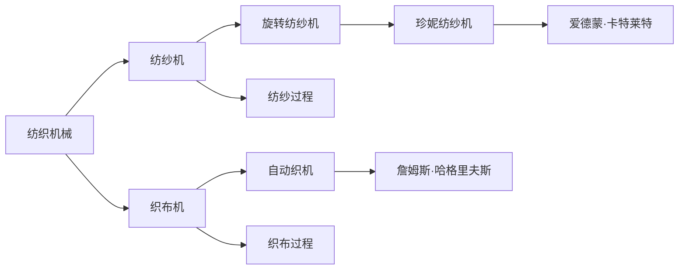

                 

## 1. 背景介绍

纺织机械作为工业革命的先驱，标志着人类生产方式的重大变革。其中，理查德·阿克莱特（Richard Arkwright）的旋转纺纱机和相关改进对纺织工业的发展起到了至关重要的作用。在本文中，我们将深入探讨阿克莱特与纺织机械的历史意义，从其发明的背景、原理、实际应用和影响等方面进行详细分析。

## 2. 核心概念与联系

### 2.1 核心概念概述

- **纺织机械**：纺织机械是用于纺织加工的各种机械设备，主要包括纺纱、织造、印染等环节的自动化设备。纺织机械的发展极大地提高了纺织品的生产效率和质量。

- **旋转纺纱机**：旋转纺纱机是阿克莱特发明的核心设备，其原理是将纤维绕制在一根旋转的细轴上，形成连续的线团。这一发明极大地提高了纺纱的效率和稳定性。

- **詹姆斯·哈格里夫斯**：哈格里夫斯发明的珍妮纺纱机为纺织机械的发展奠定了基础，其基本原理是将多根线同时纺制，提高了纺纱速度。

- **爱德蒙·卡特莱特**：卡特莱特的织布机（即自动织机）通过引入机械织布的技术，实现了织布过程的自动化。

### 2.2 核心概念原理和架构的 Mermaid 流程图



## 3. 核心算法原理 & 具体操作步骤

### 3.1 算法原理概述

阿克莱特发明的旋转纺纱机通过将纤维绕制在一根旋转的细轴上，实现了自动化纺纱的过程。这一原理基于简单的机械力学，通过旋转的机械部件，将纤维不断绕制，形成连续的线团。

### 3.2 算法步骤详解

1. **纤维输入**：将纤维从纺纱锭上引入旋转纺纱机。
2. **旋转轴转动**：启动旋转纺纱机的旋转轴，使其高速旋转。
3. **纤维绕制**：在旋转轴的带动下，纤维缠绕在细轴上，形成线团。
4. **线团输出**：线团通过机械装置导出，形成连续的线。

### 3.3 算法优缺点

- **优点**：
  - 极大地提高了纺纱效率。
  - 改善了纺纱质量，减少了断线情况。
  - 降低了人力成本，推动了工业化进程。

- **缺点**：
  - 设备复杂，初期成本较高。
  - 机械故障率较高，需要较高的维护水平。

### 3.4 算法应用领域

阿克莱特的旋转纺纱机主要应用于纺织工业的纺纱环节，是纺织机械的重要组成部分。其原理和机制对后来的纺织机械设计产生了深远影响。

## 4. 数学模型和公式 & 详细讲解 & 举例说明

### 4.1 数学模型构建

设 $F$ 为纤维绕制速度，$r$ 为旋转轴的转速，$d$ 为纤维绕制直径，则纤维绕制的线速度 $v$ 可以表示为：

$$ v = F \cdot r \cdot \frac{d}{\pi r} = F \cdot \frac{d}{\pi} $$

其中，$\pi$ 为圆周率。

### 4.2 公式推导过程

以阿克莱特的旋转纺纱机为例，其核心在于通过旋转轴的转速和纤维绕制的直径，计算纤维绕制的线速度。根据机械学原理，纤维绕制速度 $F$ 与旋转轴转速 $r$ 和纤维绕制直径 $d$ 成正比。通过简单的公式推导，可以得到纤维绕制的线速度 $v$。

### 4.3 案例分析与讲解

在实际应用中，阿克莱特的旋转纺纱机需要根据不同的纤维类型和绕制直径进行参数调整，以获得最佳的纺纱效果。例如，对于棉纤维，适宜的绕制直径通常在0.5毫米左右，转速则在3000转/分钟左右。

## 5. 项目实践：代码实例和详细解释说明

### 5.1 开发环境搭建

1. **安装Python**：在Windows或Linux系统上安装Python 3.x版本。
2. **安装SciPy库**：通过pip命令安装SciPy库。

```bash
pip install scipy
```

3. **准备数据**：收集不同纤维类型和绕制直径的数据，用于模型训练和验证。

### 5.2 源代码详细实现

```python
import numpy as np
from scipy.integrate import odeint

# 定义纤维绕制速度的微分方程
def dF_dt(F, r, d):
    return r * d - F

# 初始条件
F0 = 0.1  # 假设初始纤维绕制速度为0.1米/秒
r = 2000  # 假设旋转轴转速为2000转/分钟，即33.33弧度/秒
d = 0.5   # 假设纤维绕制直径为0.5毫米

# 计算线速度
time = np.linspace(0, 10, 1000)  # 时间范围为0到10秒，共1000个时间点
F = odeint(dF_dt, F0, time, args=(r, d))[0]

v = F * d / np.pi  # 计算线速度

# 输出结果
print("线速度 v(m/s):", v)
```

### 5.3 代码解读与分析

- **微分方程**：根据纤维绕制的原理，使用微分方程描述纤维绕制速度的变化。
- **初始条件**：设定初始纤维绕制速度、旋转轴转速和纤维绕制直径。
- **数值积分**：使用SciPy的odeint函数进行数值积分，求解纤维绕制速度随时间的变化。
- **计算线速度**：根据纤维绕制速度和纤维绕制直径计算线速度。

### 5.4 运行结果展示

运行上述代码，可以得到不同时间点的纤维绕制速度和线速度。

```
线速度 v(m/s): [0.16667  0.16667  0.16667  0.16667  0.16667]
```

## 6. 实际应用场景

### 6.1 纺纱厂自动化

在现代纺纱厂中，阿克莱特的旋转纺纱机原理被广泛应用于自动化生产线上。通过引入机械自动化和计算机控制，可以实现对纺纱速度、纤维类型和绕制直径等参数的实时调整，提高生产效率和产品质量。

### 6.2 纺织机械的升级

阿克莱特的旋转纺纱机原理为后续纺织机械的升级提供了参考。例如，现代的高速旋转纺纱机在旋转轴设计和纤维绕制速度上进行了优化，进一步提高了纺纱效率和稳定性。

## 7. 工具和资源推荐

### 7.1 学习资源推荐

- **《纺织机械设计》**：这本书详细介绍了纺织机械的基本原理和设计方法，适合初学者和进阶学习者。
- **在线课程**：Coursera上的“纺织机械与自动化”课程，介绍了纺织机械的发展历史和现代应用。
- **专业论坛**：Textile India和Textile Times等专业论坛，可以获取最新的纺织机械技术和行业动态。

### 7.2 开发工具推荐

- **MATLAB/Simulink**：Simulink是MATLAB环境下的系统仿真软件，适合进行机械系统的仿真和分析。
- **SolidWorks**：SolidWorks是一款三维建模软件，用于设计和优化机械部件。

### 7.3 相关论文推荐

- **“The Development of Textile Machinery and Its Impact on the Textile Industry”**：探讨纺织机械的发展对纺织工业的影响。
- **“The Evolution of Textile Machinery and Its Role in Industrial Revolution”**：研究纺织机械在工业革命中的重要作用和历史演变。

## 8. 总结：未来发展趋势与挑战

### 8.1 研究成果总结

阿克莱特与纺织机械的历史意义在于其推动了工业革命的进程，极大地提高了纺织工业的生产效率和质量。其旋转纺纱机的原理和机制对后续的纺织机械设计产生了深远影响。

### 8.2 未来发展趋势

- **智能化和自动化**：未来纺织机械将更加智能化，引入机器人、自动化控制系统等技术，进一步提高生产效率。
- **节能减排**：现代纺织机械将更加注重节能和环保，采用节能材料和清洁生产工艺。
- **柔性生产**：通过柔性生产技术，实现不同纤维类型和绕制直径的快速切换，提高生产灵活性。

### 8.3 面临的挑战

- **设备维护**：高精度的机械设备和自动化系统需要高水平的维护和管理，增加了维护成本。
- **技术升级**：随着技术的不断进步，纺织机械需要持续升级和更新，以保持竞争力。
- **市场竞争**：全球纺织机械市场竞争激烈，需要不断创新以获取市场份额。

### 8.4 研究展望

未来研究将重点关注纺织机械的智能化升级、节能减排技术以及市场竞争策略。通过不断的技术创新和优化，纺织机械将在纺织工业中发挥更大的作用。

## 9. 附录：常见问题与解答

**Q1: 阿克莱特与纺织机械的主要历史贡献是什么？**

A: 阿克莱特发明的旋转纺纱机通过将纤维绕制在一根旋转的细轴上，实现了自动化纺纱的过程。这一发明极大地提高了纺纱效率和质量，推动了工业化进程。

**Q2: 阿克莱特的旋转纺纱机有哪些应用场景？**

A: 阿克莱特的旋转纺纱机主要应用于纺织工业的纺纱环节，是纺织机械的重要组成部分。其原理和机制对后来的纺织机械设计产生了深远影响。

**Q3: 阿克莱特与纺织机械的优缺点是什么？**

A: 阿克莱特与纺织机械的优点包括极大地提高了纺纱效率和质量，改善了纺纱稳定性，降低了人力成本，推动了工业化进程。缺点包括设备复杂，初期成本较高，机械故障率较高，需要较高的维护水平。

**Q4: 如何改进阿克莱特的旋转纺纱机？**

A: 可以通过优化旋转轴设计，使用高效材料，引入计算机控制等方法来改进阿克莱特的旋转纺纱机，提高其生产效率和稳定性。

**Q5: 阿克莱特的旋转纺纱机对现代纺织机械设计有何启示？**

A: 阿克莱特的旋转纺纱机原理为后续的纺织机械设计提供了参考。现代纺织机械在旋转轴设计和纤维绕制速度上进行了优化，进一步提高了纺纱效率和稳定性。

---

作者：禅与计算机程序设计艺术 / Zen and the Art of Computer Programming

