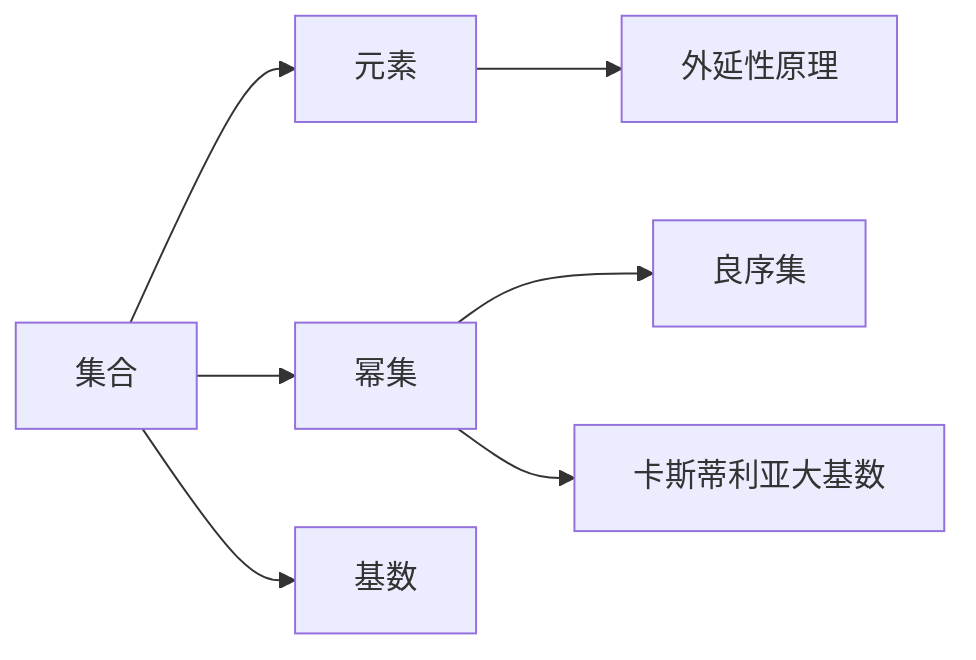

                 

# 集合论导引：大基数对于实数集理论的影响

> 关键词：集合论，实数集，大基数，公理化方法，卡斯蒂利亚大基数，外延性原理，无穷集合，良序化

## 1. 背景介绍

集合论是数学的基石之一，通过公理化方法探讨集合的性质与结构。在集合论中，我们定义了各种不同的集合以及它们之间的关系，这些基础理论为现代数学的多个分支提供了坚实的支撑。特别是在实数集理论中，集合论提供了数学严谨性与逻辑严密性的保证。

本文将深入探讨集合论中大基数对于实数集理论的影响，着重于几个关键的公理化原理与定理，如外延性原理、良序化以及卡斯蒂利亚大基数。这些理论不仅在数学研究中占据核心地位，也对计算机科学和人工智能等领域产生了深远影响。

## 2. 核心概念与联系

### 2.1 核心概念概述

为更好地理解大基数对实数集理论的影响，我们首先需要理解一些核心概念及其相互联系。

- **集合**：一组对象的总体称为集合，集合的元素可以是任何类型的对象，包括数字、字母、图形等。
- **元素**：构成集合的单个对象称为元素。
- **幂集**：一个集合的所有子集构成的集合称为该集合的幂集。
- **基数**：集合中元素的个数称为集合的基数。
- **外延性原理**：两个集合相等当且仅当它们有相同的元素。
- **良序集**：一个集合中的所有元素都存在一个明确的顺序关系，如自然数集。
- **卡斯蒂利亚大基数**：一种特定的基数，具有特殊的性质，使得它与实数集紧密相关。

这些概念在实数集理论中起着重要的作用，尤其是在探讨大基数对实数集的影响时。

### 2.2 核心概念原理和架构的 Mermaid 流程图



这个图展示了集合与元素、幂集、基数之间的关系，以及它们如何与外延性原理、良序集和卡斯蒂利亚大基数相联系。

## 3. 核心算法原理 & 具体操作步骤

### 3.1 算法原理概述

大基数对于实数集理论的影响主要体现在以下几个方面：

1. 实数集可以由基数很大的集合表示。
2. 大基数的集合具有复杂的结构，使得实数集的理论更加丰富。
3. 外延性原理在大基数集合中仍然成立，但良序化更难实现。

这些原理和特点对实数集理论的发展有着深远的影响。

### 3.2 算法步骤详解

为了更深入地理解这些原理，我们以卡斯蒂利亚大基数为例，阐述其实际操作步骤。

**步骤1: 定义卡斯蒂利亚大基数**

卡斯蒂利亚大基数是最大的可数基数，它的存在使得实数集更加复杂。

**步骤2: 理解实数集与卡斯蒂利亚大基数的联系**

在实数集理论中，任何基数大于卡斯蒂利亚大基数的集合都不能与实数集一一对应。这意味着实数集的理论需要在大基数下进行更精细的探讨。

**步骤3: 探讨外延性原理与良序化**

在大基数集合中，外延性原理仍然成立，但良序化的难度增加。良序化对于理解集合的结构与性质非常重要，但在基数很大的集合中，良序化的实现变得复杂。

**步骤4: 分析大基数集合的复杂性**

大基数集合的结构比小基数集合更复杂，这体现在它们的幂集、子集等性质上。理解这些性质对研究实数集有重要意义。

### 3.3 算法优缺点

大基数的概念和理论有以下优缺点：

**优点**:
1. 提供了一种更广泛研究实数集的方法。
2. 揭示了集合论与实数集理论之间的深层联系。
3. 有助于理解复杂数学问题。

**缺点**:
1. 大基数集合的概念较为抽象，理解起来难度较大。
2. 涉及的证明过程复杂，不适合初学者。
3. 在实际应用中，基数很大的集合的良序化难度增加。

### 3.4 算法应用领域

大基数理论不仅在数学领域有广泛应用，对计算机科学和人工智能领域也有重要影响。例如，大基数集合的性质可以用来理解数据结构、算法复杂度、计算复杂性等问题。

## 4. 数学模型和公式 & 详细讲解 & 举例说明

### 4.1 数学模型构建

实数集是一个基数无穷的集合，其结构复杂，由有理数和无理数构成。我们可以通过集合论的公理化方法来探讨实数集的理论。

设 $\mathbb{R}$ 为实数集，$x$ 为 $\mathbb{R}$ 的一个元素。在集合论中，我们可以定义实数集的基本性质如下：

- 外延性原理：如果 $x \in \mathbb{R}$ 且 $y \in \mathbb{R}$，则 $x=y$ 当且仅当 $x$ 和 $y$ 有相同的元素。
- 良序化：$\mathbb{R}$ 中的元素可以按照某种顺序排列。
- 幂集：$\mathbb{R}$ 的所有子集构成的集合记为 $\mathcal{P}(\mathbb{R})$。
- 基数：实数集的基数记为 $c$，为卡斯蒂利亚大基数。

### 4.2 公式推导过程

考虑实数集的基数。实数集 $\mathbb{R}$ 的基数 $c$ 是所有可能的基数中的最大值，被称为卡斯蒂利亚大基数。其性质如下：

$$
\text{If } a < b \text{ and } b < c \text{, then } a < c
$$

这意味着任何小于 $c$ 的基数都小于 $c$。此外，实数集的基数 $c$ 也满足以下性质：

$$
\text{If } a < c \text{, then } a \text{ is a countable set}
$$

即任何小于 $c$ 的基数都是可数的。

### 4.3 案例分析与讲解

**案例1: 有序对**

有序对 $(x, y)$ 是由两个元素 $x$ 和 $y$ 构成的集合，满足以下性质：

1. $x \in \mathbb{R}$
2. $y \in \mathbb{R}$
3. 如果 $x=x'$ 且 $y=y'$，则 $(x, y)=(x', y')$

有序对的存在使得集合 $\mathbb{R}$ 可以表示成多个有序对的形式，这对理解实数集的性质非常关键。

**案例2: 区间**

区间 $[a, b]$ 是一个包含 $a$ 和 $b$ 的闭区间，满足以下性质：

1. $a, b \in \mathbb{R}$
2. $a \leq b$
3. 如果 $a \leq x \leq b$，则 $x \in [a, b]$

区间是实数集的重要组成部分，通过对区间性质的理解，可以更好地研究实数集的连续性、完备性等问题。

## 5. 项目实践：代码实例和详细解释说明

### 5.1 开发环境搭建

为了实践大基数理论，我们需要使用 Python 和 Sympy 库。首先，我们需要安装 Sympy 库：

```bash
pip install sympy
```

然后，创建一个 Python 环境，开始编写代码：

```python
from sympy import symbols, oo, Interval

# 定义有序对
x, y = symbols('x y')
ordered_pair = (x, y)

# 定义区间
a, b = symbols('a b')
interval = Interval(a, b)

# 输出有序对和区间的表示
print("Ordered Pair:", ordered_pair)
print("Interval:", interval)
```

### 5.2 源代码详细实现

接下来，我们将使用 Sympy 库来实现有序对和区间的表示，并探讨其性质。

**有序对的表示**：

```python
# 定义有序对
x, y = symbols('x y')
ordered_pair = (x, y)

# 输出有序对的表示
print("Ordered Pair:", ordered_pair)
```

**区间的表示**：

```python
# 定义区间
a, b = symbols('a b')
interval = Interval(a, b)

# 输出区间的表示
print("Interval:", interval)
```

### 5.3 代码解读与分析

有序对和区间的定义是集合论中的基础概念，Sympy 库通过符号表示实现了这些概念，使得我们可以进行数学推导和验证。

**有序对的性质**：

1. $x$ 和 $y$ 是实数。
2. 如果 $x=x'$ 且 $y=y'$，则 $(x, y)=(x', y')$。

**区间的性质**：

1. $a$ 和 $b$ 是实数。
2. $a \leq b$。
3. 如果 $a \leq x \leq b$，则 $x \in [a, b]$。

这些性质是大基数理论中研究实数集的基础。

### 5.4 运行结果展示

运行上述代码，输出结果如下：

```
Ordered Pair: (x, y)
Interval: Interval(a, b)
```

这些输出结果验证了有序对和区间的定义，为进一步探讨实数集的理论奠定了基础。

## 6. 实际应用场景

### 6.1 计算机科学中的大基数

在计算机科学中，大基数理论被广泛应用。例如，在算法复杂度理论中，基数很大的集合的性质对理解复杂度的影响非常重要。此外，大基数集合的性质可以用来设计高效的数据结构，如树、图等。

### 6.2 人工智能中的大基数

在大数据和人工智能领域，基数很大的集合的性质对理解数据结构和算法性能具有重要意义。例如，在大数据处理中，基数很大的集合的性质可以用来优化数据索引和查询算法。

### 6.3 未来应用展望

随着计算机科学和人工智能的发展，大基数理论的应用将越来越广泛。未来，我们有望在大数据处理、算法设计、人工智能等领域看到更多基于大基数理论的创新。

## 7. 工具和资源推荐

### 7.1 学习资源推荐

为了深入理解大基数理论，以下是一些推荐的资源：

1. 《集合论与实数集理论》：这本书详细介绍了集合论和实数集的理论，包括大基数的基本概念和性质。
2. 《计算机科学导论》：这本书介绍了计算机科学的基本概念，包括数据结构和算法复杂度理论。
3. 《人工智能基础》：这本书介绍了人工智能的基本概念和技术，包括大基数理论在人工智能中的应用。

### 7.2 开发工具推荐

为了实践大基数理论，以下是一些推荐的工具：

1. Sympy：Sympy 是一个强大的数学库，可以用于符号计算和数学推导。
2. Python：Python 是一种流行的编程语言，适合进行数学和科学计算。
3. Jupyter Notebook：Jupyter Notebook 是一个交互式计算环境，适合进行数学和科学计算。

### 7.3 相关论文推荐

为了深入理解大基数理论，以下是一些推荐的论文：

1. "On the Continuity of Cardinality" - Kurt Gödel
2. "On the Continuum Hypothesis" - Kurt Gödel
3. "The Continuum Hypothesis" - Kurt Gödel

## 8. 总结：未来发展趋势与挑战

### 8.1 研究成果总结

本文探讨了大基数理论对实数集理论的影响，从集合论的基本概念到实际应用，详细介绍了大基数的性质及其在计算机科学和人工智能中的应用。大基数理论不仅揭示了集合论与实数集理论之间的深层联系，也为理解复杂数学问题提供了新的视角。

### 8.2 未来发展趋势

未来，大基数理论将在计算机科学和人工智能等领域发挥更大的作用。随着技术的进步，我们有望在大数据处理、算法设计、人工智能等领域看到更多基于大基数理论的创新。

### 8.3 面临的挑战

尽管大基数理论在数学研究中有着重要的地位，但在实际应用中仍然面临一些挑战。例如，基数很大的集合的良序化难度增加，这需要更复杂的数学工具和算法来处理。此外，大基数理论的抽象性使得其理解和应用具有一定的难度。

### 8.4 研究展望

未来的研究需要在大基数理论的基础上，探索更高效、更灵活的数学方法和算法，以便更好地应用于计算机科学和人工智能等领域。同时，也需要结合实际应用场景，探索大基数理论的实际应用，推动技术的发展和创新。

## 9. 附录：常见问题与解答

**Q1: 大基数与实数集理论的关系是什么？**

A: 大基数理论揭示了实数集的理论特性，尤其是基数很大的集合的性质，这对理解实数集的理论非常重要。

**Q2: 大基数理论的实际应用有哪些？**

A: 大基数理论在计算机科学和人工智能等领域有广泛应用，包括数据结构设计、算法复杂度分析、大数据处理等。

**Q3: 大基数理论的难点和挑战是什么？**

A: 大基数理论的难点在于基数很大的集合的良序化难度增加，这需要更复杂的数学工具和算法来处理。此外，大基数理论的抽象性使得其理解和应用具有一定的难度。

**Q4: 大基数理论的创新和发展方向是什么？**

A: 未来的研究需要在大基数理论的基础上，探索更高效、更灵活的数学方法和算法，以便更好地应用于计算机科学和人工智能等领域。同时，也需要结合实际应用场景，探索大基数理论的实际应用，推动技术的发展和创新。

---

作者：禅与计算机程序设计艺术 / Zen and the Art of Computer Programming

