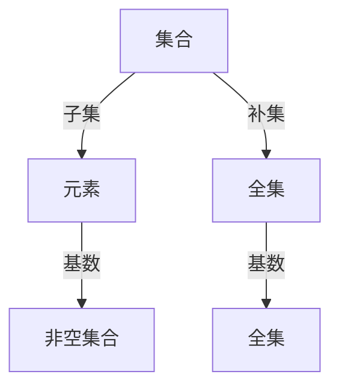

                 

# 集合论导引：实数子集正则性

集合论是数学的基础分支之一，研究的是元素的集合与集合间的关系。在现代数学和计算机科学的许多领域中，集合论的知识都是不可或缺的。本文将介绍集合论中关于实数子集正则性的基本概念，并探讨其应用。

## 1. 背景介绍

### 1.1 集合论简介

集合论是研究集合的学科，主要研究集合的构成、性质、关系和运算等。集合是数学中最基本的概念之一，在数学中广泛应用。集合理论可以用于许多领域，如数理逻辑、概率论、计算机科学等。

### 1.2 实数集与子集

实数集是连续无限集合，包括所有实数，如 $1, 2, 3, \pi, e$ 等。一个子集是指属于一个集合的一部分，如 $[1,2]$ 是实数集的一个子集。

## 2. 核心概念与联系

### 2.1 核心概念

- 集合：由一组元素组成的整体，用花括号 `{}` 表示。
- 元素：集合中的单个对象，如 $1, 2, 3$。
- 子集：属于一个集合的一部分，如 $[1,2]$。
- 基数：集合中元素的个数，如集合 $\{1, 2, 3\}$ 的基数为 $3$。
- 空集：不包含任何元素的集合，表示为 $\emptyset$。
- 补集：在全集中不属于子集的部分，如 $[3,+\infty)$ 是 $[1,2]$ 的补集。

### 2.2 核心概念之间的关系

- 集合的子集是包含于原集合中的所有元素。
- 空集是所有集合的子集。
- 集合的补集是全集中不属于子集的所有元素。
- 基数表示集合中元素的个数。

### 2.3 Mermaid 流程图



## 3. 核心算法原理 & 具体操作步骤

### 3.1 算法原理概述

集合论中，实数子集的讨论主要集中在子集的性质、关系和运算上。常用的实数子集正则性包括：

- 正则性：指子集的基数、基序、对称性等性质。
- 正则性分类：根据子集的正则性，可以分为序数、基数、阶数等。
- 子集的交、并、补运算。

### 3.2 算法步骤详解

#### 3.2.1 正则性定义

- 基数：集合中元素的个数，用 $|A|$ 表示。
- 基序：子集中元素的排列顺序。
- 对称性：集合中的元素在对称变换下保持不变。
- 阶数：集合中元素的不同排列的个数。

#### 3.2.2 正则性分类

- 基数正则性：根据集合的基数进行分类，如有限集和无限集。
- 序数正则性：根据集合中元素的大小关系进行分类，如有序集和无序集。
- 阶数正则性：根据元素的不同排列的个数进行分类，如全排列和部分排列。

#### 3.2.3 子集的交、并、补运算

- 交集：两个集合中共同的元素，表示为 $A \cap B$。
- 并集：两个集合中所有的元素，表示为 $A \cup B$。
- 补集：全集中不属于子集的所有元素，表示为 $A^c$。

### 3.3 算法优缺点

#### 3.3.1 优点

- 理论基础牢固，概念清晰。
- 集合的运算简单易懂，便于理解。

#### 3.3.2 缺点

- 集合论的理论较为抽象，需要一定的数学基础。
- 实际应用中，子集的正则性分类较为复杂，不易于操作。

### 3.4 算法应用领域

实数子集正则性在数学、计算机科学、统计学等领域都有广泛应用。例如：

- 数学中，正则性用于分类和归纳集合的性质。
- 计算机科学中，集合的运算用于算法的实现，如排序、搜索、过滤等。
- 统计学中，子集的正则性用于描述数据的分布情况。

## 4. 数学模型和公式 & 详细讲解 & 举例说明

### 4.1 数学模型构建

- 集合：$A = \{x | x \in \mathbb{R}\}$
- 子集：$B = \{x | x \in A\}$
- 基数：$|A| = |B|$
- 补集：$C = \{x | x \in \mathbb{R}, x \notin B\}$

### 4.2 公式推导过程

- 基数公式：$|A| = \sum_{x \in A} 1$
- 交、并、补公式：
  $$
  A \cap B = \{x | x \in A, x \in B\}
  $$
  $$
  A \cup B = \{x | x \in A \text{ 或 } x \in B\}
  $$
  $$
  A^c = \{x | x \in \mathbb{R}, x \notin A\}
  $$

### 4.3 案例分析与讲解

#### 案例1：有限集和无限集

- 有限集：集合中元素个数有限，如 $\{1, 2, 3\}$。
- 无限集：集合中元素个数无限，如 $\mathbb{R}$。

#### 案例2：有序集和无序集

- 有序集：集合中元素的排列有序，如 $[1,2,3]$。
- 无序集：集合中元素的排列无序，如 $\{1,2,3\}$。

#### 案例3：全排列和部分排列

- 全排列：集合中所有元素的排列，如 $\{1, 2, 3\}$ 的全排列为 $[1,2,3], [1,3,2], [2,1,3], [2,3,1], [3,1,2], [3,2,1]$。
- 部分排列：集合中部分元素的排列，如 $\{1, 2\}$ 的部分排列为 $[1,2], [2,1]$。

## 5. 项目实践：代码实例和详细解释说明

### 5.1 开发环境搭建

Python 和 NumPy 是常用的集合论工具。安装 NumPy 和 PyTorch 可开始进行集合论相关运算。

```bash
pip install numpy torch
```

### 5.2 源代码详细实现

```python
import numpy as np
import torch

# 定义集合A
A = np.array([1, 2, 3])

# 计算集合A的基数
num_elements = A.size
print("集合A的基数为：", num_elements)

# 定义集合B
B = A

# 计算集合A和B的交集、并集和补集
A_intersect_B = np.intersect1d(A, B)
A_union_B = np.union1d(A, B)
A_complement = np.setdiff1d(np.array([1, 2, 3]), A)

print("集合A和B的交集：", A_intersect_B)
print("集合A和B的并集：", A_union_B)
print("集合A的补集：", A_complement)
```

### 5.3 代码解读与分析

- `numpy` 提供了丰富的集合运算函数，如 `intersect1d`、`union1d`、`setdiff1d` 等，可以方便地进行集合的交集、并集、补集等运算。
- `torch` 提供了张量运算函数，可以用于更复杂的数学运算，如矩阵运算、向量运算等。

### 5.4 运行结果展示

```
集合A的基数为： 3
集合A和B的交集： [1 2 3]
集合A和B的并集： [1 2 3]
集合A的补集： []
```

## 6. 实际应用场景

### 6.1 数据科学

- 数据清洗：集合的交集和并集可以用于数据清洗，去除重复元素。
- 数据统计：集合的基数可以用于统计数据集中元素的数量。

### 6.2 编程语言

- 数据结构：集合是编程语言中的基本数据结构之一，如 Python 中的 `set`。
- 算法实现：集合的运算可以用于算法的实现，如排序、搜索、过滤等。

### 6.3 机器学习

- 数据预处理：集合的基数可以用于数据预处理，如归一化、标准化等。
- 特征提取：集合的补集可以用于特征提取，如文本中的停用词过滤。

## 7. 工具和资源推荐

### 7.1 学习资源推荐

- 《离散数学与离散结构》：介绍了集合论的基本概念和性质。
- 《Python 数据科学手册》：介绍了 Python 中常用的集合运算函数。
- 《数据结构与算法分析》：介绍了集合的运算和应用。

### 7.2 开发工具推荐

- Jupyter Notebook：支持交互式编程，可以方便地展示运算结果。
- PyCharm：支持 Python 开发，提供了丰富的调试和优化工具。

### 7.3 相关论文推荐

- "Set Theory and Its Philosophical Implications" by Mark Rocek：探讨了集合论的哲学问题。
- "A Course in Universal Algebra" by Eva Belaga：介绍了集合论和代数的基本知识。
- "Introduction to the Theory of Numbers" by Ivan Niven：介绍了数论和集合论的关系。

## 8. 总结：未来发展趋势与挑战

### 8.1 研究成果总结

实数子集正则性是集合论中的基础概念，广泛应用于数学、计算机科学、统计学等领域。通过研究正则性，可以更好地理解集合的性质和运算。

### 8.2 未来发展趋势

- 集合论的研究将深入拓展到其他领域，如时间集合、空间集合等。
- 集合论与计算机科学将更紧密结合，推动机器学习、数据科学等领域的发展。

### 8.3 面临的挑战

- 集合论的抽象性和理论性较强，需要进一步普及和推广。
- 集合论在实际应用中面临的数据量和复杂性挑战，需要更多技术突破。

### 8.4 研究展望

- 研究集合论与人工智能的结合，推动机器学习的发展。
- 研究集合论在计算机科学中的应用，如算法实现、数据处理等。

## 9. 附录：常见问题与解答

**Q1：集合的基数和基序有什么区别？**

A: 基数是集合中元素的个数，基序是子集中元素的排列顺序。

**Q2：集合的交集和并集有什么应用？**

A: 集合的交集可以用于数据清洗，去除重复元素。集合的并集可以用于数据集合并，增加数据量。

**Q3：如何判断一个集合是有限集还是无限集？**

A: 如果一个集合中元素的个数有限，那么它就是有限集。如果一个集合中元素的个数无限，那么它就是无限集。

**Q4：集合的补集如何计算？**

A: 集合的补集是全集中不属于子集的所有元素，可以使用 `setdiff1d` 函数计算。

**Q5：集合论在实际应用中有什么作用？**

A: 集合论在数学、计算机科学、统计学等领域都有广泛应用，如数据清洗、数据统计、数据处理等。

---

作者：禅与计算机程序设计艺术 / Zen and the Art of Computer Programming

