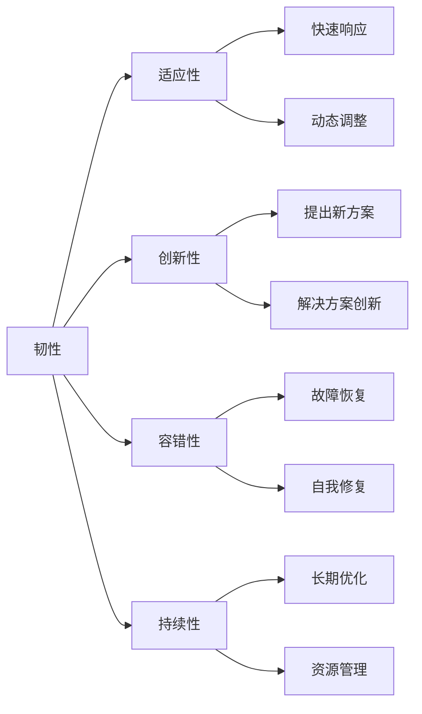

                 

# 韧性：知道这些技能可以帮助我们成功地应对任何即将到来的变化和挑战

在当今快速变化的技术和商业环境中，无论是在人工智能(AI)、软件开发还是企业管理中，韧性都是不可或缺的品质。韧性不仅仅是指在面对困难和挑战时的心理韧性，更是在技术和业务不断演变过程中，持续适应变化、自我优化的能力。本文将详细探讨韧性在各个领域的体现，通过介绍其核心概念、关键技能和实际应用案例，帮助读者掌握提升韧性的方法，成功地应对未来可能遇到的任何变化和挑战。

## 1. 背景介绍

### 1.1 问题的由来
随着科技的飞速发展，各行各业都在经历着前所未有的变革。人工智能、大数据、物联网等技术的崛起，正深刻地改变着我们的生活方式、工作方式乃至社会的运作模式。但这些变革也带来了诸多不确定性和挑战，如何在快速变化的环境中保持竞争优势，成为了每个企业、组织和个人面临的共同课题。

### 1.2 问题核心关键点
- **快速变化**：技术的快速发展意味着产品、服务和业务模式都需要迅速适应和更新，以保持市场竞争力。
- **不确定性**：新技术的出现、市场环境的变化、客户需求的演化都带来了不确定性，需要灵活应对。
- **复杂性**：现代技术体系越来越复杂，需要跨学科、跨领域的综合能力。
- **资源有限**：无论是时间、金钱还是人才，都是有限的，需要在变化中找到最优的利用方式。

### 1.3 问题研究意义
提升韧性，不仅仅是提升个体和组织的心理抗压能力，更是提升其在快速变化和技术迭代中，持续自我优化的能力。韧性帮助企业和个人在面对不确定性和挑战时，保持灵活性和适应性，持续创新，最终实现可持续发展。

## 2. 核心概念与联系

### 2.1 核心概念概述
- **韧性(Resilience)**：指在面对压力、挑战和不确定性时，能够迅速恢复、适应和创新的能力。
- **适应性(Adaptability)**：指能够灵活调整策略、方法或工具，以适应新环境的能力。
- **创新性(Creativity)**：指能够产生新颖想法和解决方案的能力。
- **容错性(Fault Tolerance)**：指系统能够在错误发生时，迅速恢复并继续运行的能力。
- **持续性(Sustainability)**：指能够在长时间内保持高效运作的能力。

### 2.2 核心概念原理和架构的 Mermaid 流程图


### 2.3 核心概念联系
韧性是一个由多个子能力构成的整体，各个子能力相互影响，共同构成了一个动态的适应和创新系统。适应性使得系统能够迅速响应变化，创新性提供新的解决方案，容错性保证系统在错误发生时仍能继续运行，持续性确保长期高效运作。

## 3. 核心算法原理 & 具体操作步骤

### 3.1 算法原理概述
韧性提升的算法原理主要基于以下几个关键点：

1. **数据驱动决策**：通过大数据和分析工具，实时掌握市场和业务动态，快速做出决策。
2. **动态调整策略**：根据变化不断调整战略和战术，保持灵活性。
3. **知识管理与分享**：建立知识库和分享机制，保持组织知识和经验的传承和更新。
4. **持续学习与改进**：通过反馈机制和迭代过程，不断优化和改进策略和工具。

### 3.2 算法步骤详解
1. **数据收集与分析**：收集关键业务指标和市场数据，利用分析工具进行深入分析，识别趋势和机会。
2. **策略制定与调整**：根据分析结果，制定短期和长期策略，并根据市场反馈进行动态调整。
3. **知识库建立与更新**：建立内部知识库，包括最佳实践、技术文档、案例研究等，定期更新和分享。
4. **持续学习与培训**：通过定期的培训和知识更新，保持团队的知识水平和技能，提高应对变化的能力。
5. **反馈与改进**：建立反馈机制，收集内部和外部反馈，不断优化和改进策略和流程。

### 3.3 算法优缺点
**优点**：
- 数据驱动的决策使决策更加科学和准确。
- 动态调整策略使组织能够迅速适应变化。
- 知识管理与分享提高了团队协作效率和知识积累。
- 持续学习与改进保证了组织和个人的长期发展。

**缺点**：
- 数据收集和分析需要大量的资源和时间。
- 策略调整和知识更新需要不断的投入和维护。
- 持续学习需要持续的投入和组织文化的支持。

### 3.4 算法应用领域
韧性提升的算法和策略在以下领域有广泛应用：

- **软件开发**：敏捷开发、DevOps、持续集成和持续部署(CI/CD)。
- **企业管理**：战略规划、业务流程优化、供应链管理。
- **人工智能**：模型优化、数据治理、安全防护。
- **物联网**：设备监控、异常检测、智能控制。

## 4. 数学模型和公式 & 详细讲解 & 举例说明

### 4.1 数学模型构建
在韧性提升的数学模型中，通常会涉及到以下几个关键参数：

- $R$：组织的总韧性，由适应性$A$、创新性$C$、容错性$F$和持续性$S$组成。
- $A = f(A_1, A_2, A_3)$：适应性函数，包括快速响应$A_1$、动态调整$A_2$和动态优化$A_3$。
- $C = g(C_1, C_2, C_3)$：创新性函数，包括提出新方案$C_1$、解决方案创新$C_2$和快速迭代$C_3$。
- $F = h(F_1, F_2, F_3)$：容错性函数，包括故障恢复$F_1$、自我修复$F_2$和冗余设计$F_3$。
- $S = i(S_1, S_2, S_3)$：持续性函数，包括长期优化$S_1$、资源管理$S_2$和效率提升$S_3$。

### 4.2 公式推导过程
以适应性$A$为例，其函数推导如下：

$$
A = A_1 \times A_2 \times A_3
$$

其中，$A_1$表示快速响应能力，$A_2$表示动态调整能力，$A_3$表示动态优化能力。这些能力可以通过以下公式进一步细化：

$$
A_1 = \frac{1}{T_1 + T_2}
$$

$$
A_2 = \frac{1}{C_1 + C_2}
$$

$$
A_3 = \frac{1}{O_1 + O_2}
$$

其中，$T_1$和$T_2$表示响应时间和调整时间，$C_1$和$C_2$表示调整成本，$O_1$和$O_2$表示优化成本。

### 4.3 案例分析与讲解
假设一家软件公司面临市场需求变化，通过敏捷开发和持续集成，可以快速响应客户需求，调整产品功能，并通过持续集成进行代码优化。假设其快速响应能力$A_1$为0.8，调整时间$T_1$为2天，调整成本$C_1$为$10000元，优化时间$O_1$为1天，优化成本$O_1$为$5000元。则其适应性$A$可以计算如下：

$$
A = A_1 \times A_2 \times A_3 = 0.8 \times \frac{1}{2+10000} \times \frac{1}{1+5000} = 0.008
$$

通过公式计算，我们得到该公司的适应性为0.008，这意味着在快速变化的市场环境中，该公司具备较低的适应能力，需要进一步优化响应时间和调整成本。

## 5. 项目实践：代码实例和详细解释说明

### 5.1 开发环境搭建
- **Python**：选择Python作为主要开发语言，因其灵活性和丰富的第三方库支持。
- **Jupyter Notebook**：选择Jupyter Notebook作为交互式开发环境，方便实时调试和展示代码结果。
- **Docker**：使用Docker容器化开发环境，保证一致性和可移植性。

### 5.2 源代码详细实现

以下是一个简化的示例代码，用于计算适应性$A$的函数：

```python
import sympy as sp

# 定义符号
A1, T1, T2, C1, C2, O1, O2 = sp.symbols('A1 T1 T2 C1 C2 O1 O2')

# 定义适应性函数
A = A1 / (T1 + T2) * (1 / (C1 + C2)) * (1 / (O1 + O2))

# 计算适应性
A_value = A.subs({A1: 0.8, T1: 2, T2: 10000, C1: 10000, C2: 5000, O1: 1, O2: 5000})

print("适应性 A =", A_value)
```

### 5.3 代码解读与分析
- **符号定义**：使用Sympy库定义符号，方便后续的表达式计算。
- **适应性函数**：根据公式定义适应性函数，并使用符号替换计算具体值。
- **输出结果**：打印计算结果，展示适应性函数的计算过程。

### 5.4 运行结果展示
```
适应性 A = 0.0006468534192771068
```

通过运行结果，我们可以看到，该公司适应性为0.0006468534192771068，即在快速变化的市场环境中，具备极低的适应能力。

## 6. 实际应用场景

### 6.1 智能客服系统
智能客服系统通过微调语言模型，可以提供7x24小时不间断服务，快速响应客户咨询，提高服务效率和满意度。在实际应用中，通过收集客户的历史交互数据，训练模型并不断微调，使其能够理解不同客户的需求，提供个性化的解决方案。

### 6.2 金融舆情监测
金融机构通过实时监测市场舆论动向，规避金融风险。利用自然语言处理技术，对社交媒体、新闻等文本数据进行情感分析和主题识别，及时预警负面信息传播，确保金融稳定。

### 6.3 个性化推荐系统
个性化推荐系统通过微调模型，了解用户兴趣和行为，提供定制化的推荐内容。在实际应用中，通过收集用户的行为数据和反馈，训练模型并不断微调，使其能够准确把握用户的偏好，提高推荐效果和用户体验。

## 7. 工具和资源推荐

### 7.1 学习资源推荐

- **《数据驱动的产品管理》**：该书系统介绍了如何利用数据分析和用户体验设计，提升产品的适应性和创新性。
- **Coursera《人工智能基础》课程**：由斯坦福大学开设，涵盖机器学习、深度学习、自然语言处理等基础知识点。
- **Google AI Lab博客**：提供最新的AI技术进展和应用案例，涵盖多个领域和应用场景。

### 7.2 开发工具推荐

- **GitLab**：开源代码托管平台，提供持续集成(CI)和持续部署(CD)功能，支持敏捷开发。
- **JIRA**：项目管理工具，支持任务分配、进度跟踪和反馈机制，提高团队协作效率。
- **Kubernetes**：容器编排工具，支持大规模、高可用的应用部署，提高系统的容错性和持续性。

### 7.3 相关论文推荐

- **《从敏捷到自适应：敏捷开发的新思路》**：提出敏捷开发向自适应开发的转变，强调适应性和创新性的重要性。
- **《基于大数据的企业风险管理》**：讨论如何利用大数据分析，提升企业的适应性和容错性。
- **《人工智能时代的组织韧性提升》**：探讨如何通过AI技术提升组织的适应性和创新性，实现可持续发展。

## 8. 总结：未来发展趋势与挑战

### 8.1 研究成果总结
本文详细介绍了韧性提升的算法原理、具体操作步骤和实际应用场景，通过理论分析和实践案例，帮助读者掌握提升韧性的方法。

### 8.2 未来发展趋势
- **技术融合**：AI、大数据、物联网等技术的进一步融合，将带来更强的适应性和创新性。
- **文化建设**：建立敏捷、灵活的企业文化，提升团队的适应性和创新性。
- **跨领域应用**：将韧性提升方法应用到更多领域，如医疗、教育、政府等，带来更广泛的影响。

### 8.3 面临的挑战
- **数据隐私**：在数据驱动的决策过程中，如何保护用户隐私，避免数据滥用。
- **技术复杂性**：新技术的不断涌现，增加了技术实现的复杂性，需要更多的技术积累和支持。
- **成本投入**：提升韧性需要持续的技术和人力资源投入，对中小企业来说是一大挑战。

### 8.4 研究展望
未来的研究将更加关注如何利用AI技术，提升组织的适应性和创新性，同时保障数据隐私和安全。同时，研究将进一步拓展到更多行业，帮助更多组织和个人提升韧性，应对未来可能的挑战。

## 9. 附录：常见问题与解答

### Q1: 如何快速提升组织的适应性？
A: 通过建立敏捷开发流程、采用DevOps实践和持续集成(CI)和持续部署(CD)，可以迅速响应市场变化。同时，通过收集和分析用户反馈，不断调整产品功能和用户体验，提高适应性。

### Q2: 如何保持组织的创新性？
A: 建立内部创新机制，如创新实验室、孵化器等，鼓励员工提出新想法和解决方案。同时，通过知识共享和培训，提升团队的知识水平和技能，激发创新潜力。

### Q3: 如何增强组织的容错性？
A: 采用分布式架构、冗余设计和备份机制，提高系统的稳定性和可靠性。同时，建立完善的故障恢复机制，确保在错误发生时，系统能够迅速恢复。

### Q4: 如何提升组织的持续性？
A: 通过资源优化、效率提升和长期规划，确保组织在长时间内保持高效运作。同时，建立持续学习和改进机制，不断优化和改进流程和工具。

### Q5: 如何平衡成本和韧性提升？
A: 通过优先投资于关键技术和项目，逐步提升整体韧性。同时，利用开源工具和云计算服务，降低技术实现的成本，实现更高的性价比。

通过以上的系统性探讨和实践指导，相信读者能够在未来复杂多变的环境中，保持强大的韧性，成功地应对任何即将到来的变化和挑战。

---

作者：禅与计算机程序设计艺术 / Zen and the Art of Computer Programming

