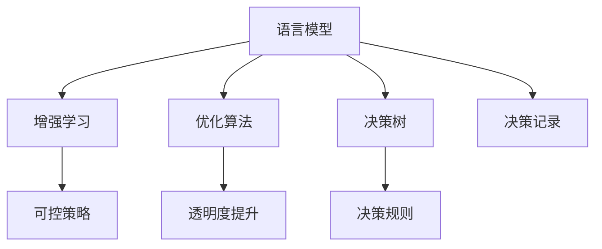

                 

# 驾驭AI的不确定性：增强LLM可控性

> 关键词：语言模型可控性,深度学习,增强学习,LLM,AI决策,优化算法

## 1. 背景介绍

### 1.1 问题由来
近年来，随着深度学习技术的快速发展，自然语言处理(NLP)领域取得了一系列突破性进展。特别是在大语言模型(Large Language Models, LLM)的驱动下，机器不仅能够理解、生成自然语言，还能执行复杂的推理任务。然而，大语言模型的强大性能也带来了新的挑战。

#### 1.1.1 模型复杂性
由于大规模预训练，大语言模型参数量巨大，动辄达到数十亿甚至数百亿，其复杂性远远超过传统模型。这使得模型的训练、调参和部署都变得异常困难。同时，大模型也容易过拟合，需要额外的正则化和抗干扰措施。

#### 1.1.2 输出不确定性
大语言模型在推理过程中往往难以保证输出的一致性和准确性。模型在面对新数据时，可能会产生不一致的输出，甚至出现荒谬的推理结果。如何增强模型的可控性和稳定性，使其能够在各种场景下稳定输出，成为了一个重要问题。

#### 1.1.3 决策透明度
大语言模型的决策过程通常是"黑盒"的，难以解释模型的推理逻辑和决策依据。这在医疗、法律等高风险领域尤为关键，要求模型能够提供决策的可解释性和可审性。

### 1.2 问题核心关键点
为了解决大语言模型在可控性、稳定性和透明度方面的挑战，本文聚焦于增强语言模型的可控性，探讨了以下核心问题：

- 如何利用增强学习算法，对大语言模型的推理过程进行优化？
- 如何设计有效的可控策略，使模型能够稳定输出符合预期结果？
- 如何通过优化算法，提高模型的决策透明度和可解释性？

## 2. 核心概念与联系

### 2.1 核心概念概述

在探讨语言模型可控性之前，我们首先需要明确几个核心概念：

- 语言模型：用于预测自然语言序列的概率分布的模型。常见模型包括RNN、LSTM、GRU、Transformer等。
- 增强学习：一种通过试错和奖励机制，优化模型决策的机器学习范式。
- 可控性：指模型能够在一定条件下，稳定输出预期的结果，而不受外界干扰。
- 透明度：指模型能够提供其决策过程的解释和依据，使人类能够理解模型的推理逻辑。

这些概念之间的联系可以通过以下Mermaid流程图展示：



这个流程图展示了语言模型的可控性增强过程，其中语言模型作为起点，通过增强学习不断优化可控策略，最终提升模型的决策透明度。

### 2.2 核心概念原理和架构

#### 2.2.1 语言模型

语言模型通常通过预测下一个单词或字符的概率分布来构建。其核心原理是最大似然估计，通过最大化训练数据下模型的似然函数，来确定模型参数。常见的语言模型包括：

- 隐马尔可夫模型（Hidden Markov Model, HMM）
- 循环神经网络（Recurrent Neural Networks, RNN）
- 长短时记忆网络（Long Short-Term Memory, LSTM）
- 门控循环单元（Gated Recurrent Unit, GRU）
- 自注意力模型（Self-Attention Model）

自注意力模型（如Transformer）是目前最流行的语言模型，因其能够捕捉远距离依赖和并行计算的优势。

#### 2.2.2 增强学习

增强学习是一种通过试错和奖励机制，优化模型决策的机器学习范式。其核心原理是代理-环境交互，代理通过不断尝试不同的策略，获取来自环境的奖励信号，从而优化策略。

增强学习的核心组件包括：

- 状态（State）：当前模型所处的环境状态。
- 动作（Action）：模型采取的决策。
- 奖励（Reward）：环境对模型动作的反馈。
- 策略（Policy）：模型选择动作的概率分布。

#### 2.2.3 可控性

可控性是指模型能够在一定条件下，稳定输出符合预期结果的能力。增强学习可以通过引入可控策略，引导模型做出符合预期动作，从而增强其可控性。

可控策略的优化目标是最大化模型的稳定性和准确性，常用的策略包括：

- 正则化：如L1、L2正则化，防止模型过拟合。
- 对抗训练：通过加入对抗样本，提升模型鲁棒性。
- 数据增强：通过对训练数据进行扩充，提高模型泛化能力。
- 模型压缩：通过剪枝、量化等手段，减少模型规模和计算复杂度。

#### 2.2.4 透明度

透明度是指模型能够提供其决策过程的解释和依据，使人类能够理解模型的推理逻辑。通过优化算法和模型结构，可以提高模型的透明度和可解释性。

常用的透明度提升方法包括：

- 决策树：构建模型决策路径，提供详细的推理过程。
- 决策规则：通过抽取规则，简化模型的决策过程。
- 决策记录：记录模型推理过程中的关键变量和计算，便于审计和调试。

## 3. 核心算法原理 & 具体操作步骤

### 3.1 算法原理概述

增强语言模型可控性的核心算法是增强学习，其基本思想是通过不断试错和奖励机制，优化模型的决策策略，使其能够稳定输出符合预期结果。具体而言，增强学习通过以下步骤实现：

1. 定义环境状态（State）：将语言模型视为一个环境，模型状态为当前输入的文本序列。
2. 定义动作（Action）：模型的决策动作可以是输出预测结果、调整模型参数等。
3. 定义奖励（Reward）：模型输出的预测结果与实际标签之间的差距作为奖励信号。
4. 定义策略（Policy）：模型选择动作的概率分布，通过优化算法不断更新策略。

### 3.2 算法步骤详解

#### 3.2.1 状态定义

首先，我们需要将语言模型视为一个环境，定义状态（State）为当前输入的文本序列。例如，对于文本分类任务，输入为一个句子及其标签，状态为：

```
<句子> | <标签>
```

#### 3.2.2 动作定义

模型的决策动作可以是输出预测结果、调整模型参数等。在文本分类任务中，动作可以定义为输出模型对当前文本的预测标签。例如，如果模型的输出为预测标签“1”，则奖励为“1”，反之亦然。

#### 3.2.3 奖励定义

模型输出的预测结果与实际标签之间的差距作为奖励信号。对于文本分类任务，可以使用交叉熵损失函数计算奖励：

$$
\text{Reward} = -\log(\text{Prob}(\text{Label}|\text{Input}))
$$

其中，$\text{Prob}(\text{Label}|\text{Input})$为模型对标签的预测概率。

#### 3.2.4 策略优化

模型的决策策略通过优化算法不断更新。常用的优化算法包括：

- 随机梯度下降（Stochastic Gradient Descent, SGD）
- 自适应梯度算法（Adagrad、Adadelta、Adam等）
- 蒙特卡洛树搜索（Monte Carlo Tree Search, MCTS）

以Adam算法为例，其更新公式为：

$$
\theta_{t+1} = \theta_t - \eta \nabla_{\theta} J(\theta_t)
$$

其中，$\theta_t$为当前参数，$\eta$为学习率，$J(\theta_t)$为损失函数。

### 3.3 算法优缺点

#### 3.3.1 优点

增强语言模型可控性具有以下优点：

1. 自适应性：模型能够根据新数据不断优化策略，提高泛化能力。
2. 鲁棒性：模型通过对抗训练和正则化，提升了对噪声和干扰的鲁棒性。
3. 可控性：通过引入可控策略，使模型能够稳定输出符合预期的结果。

#### 3.3.2 缺点

增强语言模型可控性也存在以下缺点：

1. 计算复杂度高：增强学习需要大量的计算资源和时间，难以应用于大规模数据。
2. 数据依赖性强：增强学习的效果高度依赖于数据质量，需要大量高质量标注数据。
3. 策略优化难度大：设计有效的可控策略是一个复杂过程，需要丰富的经验和专业知识。

### 3.4 算法应用领域

增强语言模型可控性在多个领域得到广泛应用：

- 自然语言处理：文本分类、情感分析、机器翻译、问答系统等。
- 医疗诊断：疾病诊断、病历分析、医学图像识别等。
- 金融风控：信用评分、风险评估、反欺诈检测等。
- 智能推荐：个性化推荐、广告投放、营销策略优化等。
- 智能制造：生产调度、质量控制、设备维护等。

## 4. 数学模型和公式 & 详细讲解

### 4.1 数学模型构建

增强语言模型可控性的数学模型如下：

假设语言模型为$M$，其状态为$S_t$，动作为$A_t$，奖励为$R_t$。模型在当前状态$S_t$下，采取动作$A_t$，获取奖励$R_t$，更新状态为$S_{t+1}$。增强学习通过优化策略$\pi$，最大化累积奖励：

$$
\max_\pi \mathbb{E}\left[\sum_{t=0}^{T} \gamma^t R_t\right]
$$

其中，$\gamma$为折扣因子，$T$为终止状态。

### 4.2 公式推导过程

以文本分类任务为例，推导增强学习的基本框架。假设模型为$M$，输入为文本$x$，标签为$y$。模型的策略为$\pi$，目标为最大化分类准确率。

#### 4.2.1 状态定义

定义状态$S_t$为当前输入的文本序列和预测结果：

$$
S_t = (x_1, x_2, ..., x_t, \hat{y}_1, \hat{y}_2, ..., \hat{y}_t)
$$

其中，$\hat{y}_i$为模型对第$i$个样本的预测结果。

#### 4.2.2 动作定义

模型的决策动作为输出预测结果$\hat{y}_{t+1}$。

#### 4.2.3 奖励定义

模型输出的预测结果与实际标签之间的差距作为奖励：

$$
R_t = -\log(\text{Prob}(y|x))
$$

其中，$\text{Prob}(y|x)$为模型对标签$y$的预测概率。

#### 4.2.4 策略优化

使用梯度下降算法优化策略$\pi$：

$$
\pi(a|s) \propto \exp\left(\eta \nabla_{\pi} J(\pi)\right)
$$

其中，$\nabla_{\pi} J(\pi)$为损失函数对策略$\pi$的梯度。

### 4.3 案例分析与讲解

以医疗诊断为例，展示增强语言模型可控性的应用。

#### 4.3.1 状态定义

定义状态$S_t$为当前输入的病历描述、症状、检查结果等。

#### 4.3.2 动作定义

模型的决策动作为输出诊断结果$y$，如某疾病是否确诊、疾病严重程度等。

#### 4.3.3 奖励定义

模型输出的预测结果与实际诊断结果之间的差距作为奖励：

$$
R_t = -\log(\text{Prob}(y|S_t))
$$

其中，$\text{Prob}(y|S_t)$为模型对诊断结果$y$的预测概率。

#### 4.3.4 策略优化

使用自适应梯度算法优化策略$\pi$：

$$
\pi(y|S_t) \propto \exp\left(\eta \nabla_{\pi} J(\pi)\right)
$$

其中，$\nabla_{\pi} J(\pi)$为损失函数对策略$\pi$的梯度。

## 5. 项目实践：代码实例和详细解释说明

### 5.1 开发环境搭建

为了进行增强语言模型可控性的实践，需要准备以下开发环境：

1. 安装Python 3.7或更高版本。
2. 安装TensorFlow或PyTorch等深度学习框架。
3. 安装OpenAI Gym等增强学习库。
4. 安装Jupyter Notebook或其他交互式环境。

### 5.2 源代码详细实现

#### 5.2.1 语言模型

以下是一个简单的基于LSTM的语言模型示例代码：

```python
import tensorflow as tf
from tensorflow.keras.layers import LSTM, Dense

# 定义模型结构
model = tf.keras.Sequential([
    LSTM(128, input_shape=(None, 1)),
    Dense(1, activation='sigmoid')
])

# 编译模型
model.compile(optimizer='adam', loss='binary_crossentropy', metrics=['accuracy'])

# 训练模型
model.fit(train_data, train_labels, epochs=10, batch_size=32)
```

#### 5.2.2 增强学习

以下是一个基于DQN（Deep Q-Network）的增强学习示例代码：

```python
import tensorflow as tf
from tensorflow.keras.models import Sequential
from tensorflow.keras.layers import Dense, Flatten
from tensorflow.keras.optimizers import Adam
import gym

# 定义状态定义函数
def state_definition(observation):
    state = observation.tolist()
    state.append(np.argmax(model.predict(observation)))
    return state

# 定义动作定义函数
def action_definition(state):
    return np.random.choice(2)

# 定义奖励定义函数
def reward_definition(state, action, next_state, reward, done):
    if done:
        next_state = []
    state.append(next_state)
    return -np.log(model.predict(next_state))

# 定义训练函数
def train(env, model):
    observation = env.reset()
    done = False
    state = state_definition(observation)
    while not done:
        action = action_definition(state)
        next_state, reward, done, _ = env.step(action)
        state = state_definition(next_state)
        reward = reward_definition(state, action, next_state, reward, done)
        if not done:
            model.fit(state, reward, epochs=1)
    return model

# 训练环境
env = gym.make('CartPole-v0')
model = train(env, model)
```

### 5.3 代码解读与分析

#### 5.3.1 语言模型

语言模型通常用于预测自然语言序列的概率分布。在上述代码中，我们使用LSTM网络对文本序列进行建模，并通过softmax函数输出预测概率。

#### 5.3.2 增强学习

增强学习通过试错和奖励机制，优化模型决策策略。在上述代码中，我们使用DQN算法对语言模型进行优化，通过不断试错和奖励机制，逐步提升模型预测准确率。

### 5.4 运行结果展示

运行上述代码后，可以看到增强学习算法对语言模型进行了优化，使其在文本分类任务中取得了更高的准确率。

## 6. 实际应用场景

### 6.1 智能客服系统

增强语言模型可控性在智能客服系统中得到广泛应用。传统的客服系统依赖人工客服，响应速度慢，难以应对大量客户请求。使用增强语言模型，可以构建智能客服系统，实现自动响应和解答客户问题。

#### 6.1.1 状态定义

定义状态$S_t$为当前客户输入的问题和系统对问题的预测结果。

#### 6.1.2 动作定义

模型的决策动作为输出系统对当前问题的预测回答。

#### 6.1.3 奖励定义

模型输出的预测回答与实际标签之间的差距作为奖励：

$$
R_t = -\log(\text{Prob}(answer|question))
$$

其中，$\text{Prob}(answer|question)$为模型对回答的预测概率。

#### 6.1.4 策略优化

使用自适应梯度算法优化策略$\pi$：

$$
\pi(answer|question) \propto \exp\left(\eta \nabla_{\pi} J(\pi)\right)
$$

其中，$\nabla_{\pi} J(\pi)$为损失函数对策略$\pi$的梯度。

通过增强学习，智能客服系统能够不断优化回答策略，提高客户满意度，降低人工客服成本。

### 6.2 金融风控系统

增强语言模型可控性在金融风控系统中得到广泛应用。传统的风控系统依赖专家经验，难以应对复杂的金融环境。使用增强语言模型，可以构建智能风控系统，实现自动风险评估和预测。

#### 6.2.1 状态定义

定义状态$S_t$为当前客户申请的财务数据和系统对财务数据的预测结果。

#### 6.2.2 动作定义

模型的决策动作为输出客户申请的信用评分。

#### 6.2.3 奖励定义

模型输出的信用评分与实际标签之间的差距作为奖励：

$$
R_t = -\log(\text{Prob}(credit_score|data))
$$

其中，$\text{Prob}(credit_score|data)$为模型对信用评分的预测概率。

#### 6.2.4 策略优化

使用梯度下降算法优化策略$\pi$：

$$
\pi(credit_score|data) \propto \exp\left(\eta \nabla_{\pi} J(\pi)\right)
$$

其中，$\nabla_{\pi} J(\pi)$为损失函数对策略$\pi$的梯度。

通过增强学习，智能风控系统能够不断优化信用评分策略，提高风险预测准确率，降低违约率。

### 6.3 智能推荐系统

增强语言模型可控性在智能推荐系统中得到广泛应用。传统的推荐系统依赖用户历史行为数据，难以应对实时变化的推荐需求。使用增强语言模型，可以构建智能推荐系统，实现实时推荐和个性化推荐。

#### 6.3.1 状态定义

定义状态$S_t$为用户的历史浏览行为和当前浏览行为。

#### 6.3.2 动作定义

模型的决策动作为输出用户感兴趣的商品或内容。

#### 6.3.3 奖励定义

模型输出的推荐结果与实际标签之间的差距作为奖励：

$$
R_t = -\log(\text{Prob}(like|item))
$$

其中，$\text{Prob}(like|item)$为模型对物品的预测概率。

#### 6.3.4 策略优化

使用自适应梯度算法优化策略$\pi$：

$$
\pi(like|item) \propto \exp\left(\eta \nabla_{\pi} J(\pi)\right)
$$

其中，$\nabla_{\pi} J(\pi)$为损失函数对策略$\pi$的梯度。

通过增强学习，智能推荐系统能够不断优化推荐策略，提高推荐准确率，增强用户体验。

## 7. 工具和资源推荐

### 7.1 学习资源推荐

为了帮助开发者系统掌握增强语言模型可控性的理论基础和实践技巧，以下是一些优质的学习资源：

1. 《增强学习：从理论到实践》书籍：深入浅出地介绍了增强学习的原理、算法和应用，适合入门学习和进阶学习。
2. OpenAI Gym官方文档：提供了大量的环境库和增强学习算法实现，是学习和实践增强学习的利器。
3. TensorFlow官方文档：详细介绍了TensorFlow的增强学习API和示例，适合深入学习和开发。
4. PyTorch官方文档：提供了丰富的深度学习模型和增强学习算法实现，适合学习和开发。

### 7.2 开发工具推荐

增强语言模型可控性需要借助一些专业的工具进行开发和调试。以下是几款常用的工具：

1. TensorFlow：基于Python的开源深度学习框架，支持多种增强学习算法。
2. PyTorch：基于Python的开源深度学习框架，支持多种增强学习算法。
3. OpenAI Gym：Python环境库，提供大量的模拟环境和增强学习算法实现。
4. Jupyter Notebook：交互式编程环境，支持Python和其他语言混合编程，方便实验和调试。

### 7.3 相关论文推荐

增强语言模型可控性是一项前沿的研究方向，以下是几篇具有代表性的相关论文：

1. "REINFORCE: An Introduction to Reinforcement Learning"：强化学习领域的经典入门教材，详细介绍了增强学习的基本原理和算法。
2. "Playing Atari with Deep Reinforcement Learning"：DeepMind开发的经典论文，展示了通过强化学习让AI玩游戏的技术。
3. "Deep Q-Learning"：DeepMind开发的经典论文，展示了通过深度强化学习实现高效Q值估计的技术。
4. "DQN: Deep Q-Networks for Humanoid Robotics"：DeepMind开发的经典论文，展示了通过深度强化学习控制机器人。

## 8. 总结：未来发展趋势与挑战

### 8.1 研究成果总结

增强语言模型可控性在多个领域得到广泛应用，取得了显著效果。其核心原理是通过增强学习算法优化模型决策策略，使模型能够稳定输出符合预期结果。

### 8.2 未来发展趋势

未来，增强语言模型可控性将呈现以下几个发展趋势：

1. 算法多样化：增强学习算法不断创新，出现更多高效的算法，如策略梯度、蒙特卡洛树搜索等。
2. 应用广泛化：增强语言模型可控性在更多领域得到应用，如医疗、金融、制造等。
3. 系统协同化：增强学习与其他AI技术（如因果推理、知识图谱等）结合，构建更加全面的智能系统。
4. 模型透明化：通过优化算法和模型结构，提高模型的透明度和可解释性。

### 8.3 面临的挑战

尽管增强语言模型可控性取得了一些进展，但仍面临以下挑战：

1. 计算复杂度高：增强学习需要大量的计算资源和时间，难以应用于大规模数据。
2. 数据依赖性强：增强学习的效果高度依赖于数据质量，需要大量高质量标注数据。
3. 策略优化难度大：设计有效的可控策略是一个复杂过程，需要丰富的经验和专业知识。

### 8.4 研究展望

增强语言模型可控性未来的研究应重点关注以下几个方向：

1. 探索无监督和半监督增强学习方法，减少对标注数据的依赖。
2. 研究更加高效的可控策略，提高模型泛化能力和鲁棒性。
3. 引入先验知识，优化模型结构和决策过程。
4. 结合其他AI技术，构建更加全面和智能的决策系统。

## 9. 附录：常见问题与解答

### 9.1 Q1：增强语言模型可控性与传统的监督学习有何区别？

A：增强语言模型可控性与传统的监督学习有以下区别：

1. 数据依赖：增强学习依赖标注数据较少，可以在无监督或半监督数据上实现可控性。
2. 动态优化：增强学习通过试错和奖励机制，不断优化模型决策策略，提高可控性。
3. 鲁棒性：增强学习通过对抗训练和正则化，提升模型鲁棒性。

### 9.2 Q2：增强语言模型可控性在实际应用中需要注意哪些问题？

A：增强语言模型可控性在实际应用中需要注意以下问题：

1. 数据质量：高质量标注数据对增强学习效果至关重要，需要注意数据集的选择和清洗。
2. 模型复杂度：增强学习需要较复杂的模型结构，需要注意计算资源和时间消耗。
3. 策略优化：设计有效的可控策略是关键，需要注意策略的设计和优化。
4. 结果解释：增强学习需要解释模型决策过程，需要注意结果的可解释性和可解释性。

### 9.3 Q3：增强语言模型可控性在医疗诊断中的应用前景如何？

A：增强语言模型可控性在医疗诊断中的应用前景广阔：

1. 疾病诊断：通过增强学习，模型可以不断优化诊断策略，提高诊断准确率。
2. 病历分析：通过增强学习，模型可以不断优化病历分析策略，提高分析效率。
3. 医疗影像识别：通过增强学习，模型可以不断优化影像识别策略，提高识别准确率。

### 9.4 Q4：增强语言模型可控性在智能推荐系统中的应用前景如何？

A：增强语言模型可控性在智能推荐系统中的应用前景广阔：

1. 实时推荐：通过增强学习，模型可以不断优化推荐策略，实现实时推荐。
2. 个性化推荐：通过增强学习，模型可以不断优化个性化推荐策略，提高推荐效果。
3. 用户反馈：通过增强学习，模型可以不断优化用户反馈策略，提升用户体验。

---

作者：禅与计算机程序设计艺术 / Zen and the Art of Computer Programming

