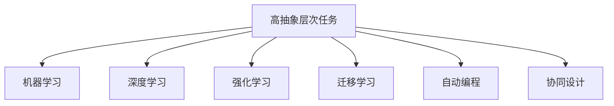

                 

## 1. 背景介绍

### 1.1 问题由来
在当今信息时代，高抽象层次任务（High-level Tasks）在科技、教育、艺术、设计等多个领域日益重要。从机器学习模型的训练、智能系统的优化，到新学科的发展，高抽象层次任务的实现对人类社会的发展具有深远的影响。

在过去，高抽象层次任务往往需要人类通过长时间的训练和实践才能掌握，而如今，借助强大的算法和计算资源，机器可以自动完成这些任务。然而，尽管技术在进步，人类依然需要在高抽象层次任务上投入大量的精力。

### 1.2 问题核心关键点
高抽象层次任务的重要性主要体现在以下几个方面：

- **复杂性与多样性**：这些任务往往需要处理大量非结构化数据，如文本、图像、音频等，这些数据本身具有高度复杂性和多样性。
- **创造性与创新性**：高抽象层次任务通常涉及创作、设计、创新等，这些过程需要丰富的经验、想象力和独特的视角。
- **跨领域应用**：高抽象层次任务往往需要跨学科的知识和技术，才能实现最优解决方案。
- **价值观与伦理**：高层次任务往往与人类社会的价值观、伦理道德紧密相关，这些任务的实现需要兼顾人类利益和社会责任。
- **资源消耗与效率**：高抽象层次任务的完成通常需要大量的资源和时间，如何提升效率和降低成本，一直是这些任务追求的目标。

## 2. 核心概念与联系

### 2.1 核心概念概述

为了更好地理解高抽象层次任务的重要性，本节将介绍几个密切相关的核心概念：

- **高抽象层次任务**：指那些需要高度理解和处理复杂数据，并具备一定创造性和创新性的任务。这类任务通常跨越多个学科领域，对数据处理能力有很高的要求。
- **机器学习**：通过数据训练，让机器学习并应用特定任务的知识，以此提高自动化决策和执行的能力。
- **深度学习**：一种机器学习范式，通过多层次的非线性映射，使机器可以处理和理解复杂的非结构化数据。
- **强化学习**：通过与环境的互动，让机器在实践中学习最优策略的机器学习方式。
- **迁移学习**：将一个领域学到的知识，迁移应用到另一个相关领域的学习方法，可以减少新领域数据量不足的问题。
- **自动编程**：一种让机器能够编写和执行代码的自动化技术，能够简化程序开发过程。
- **协同设计**：一种结合人类与机器在协同完成任务中各擅长的领域，提升任务完成效率和质量的方式。

这些核心概念之间的逻辑关系可以通过以下Mermaid流程图来展示：



这个流程图展示出高抽象层次任务与机器学习等核心概念之间的关系：

1. 高抽象层次任务通常通过机器学习来实现自动化处理。
2. 深度学习是机器学习的一个分支，可以处理复杂的非结构化数据。
3. 强化学习通过试错和奖励机制，让机器不断优化其策略。
4. 迁移学习可以将一个领域的经验迁移到另一个领域，减少新领域的数据需求。
5. 自动编程和协同设计进一步提升了高抽象层次任务的完成效率和质量。

## 3. 核心算法原理 & 具体操作步骤
### 3.1 算法原理概述

高抽象层次任务的自动化处理，通常依赖于复杂的算法和模型。以下是对这些算法原理的概述：

- **深度学习模型**：如卷积神经网络（CNN）、循环神经网络（RNN）和变分自编码器（VAE）等，用于处理和分析非结构化数据。
- **强化学习模型**：如Q-learning、Policy Gradient和Deep Q-Networks等，用于在动态环境中做出最优决策。
- **迁移学习模型**：如基于知识图谱的迁移学习方法，用于在相关领域中应用预训练模型的知识。
- **自动编程技术**：如代码生成、符号执行和元编程等，用于生成和优化代码。
- **协同设计工具**：如协作开发平台、虚拟现实（VR）和增强现实（AR）等，用于人类与机器的协同设计。

这些算法的核心思想是通过数据、模型和任务的不同特性，选择合适的算法和模型，进行自动化的处理和优化。

### 3.2 算法步骤详解

以下以深度学习模型在自然语言处理（NLP）任务中的应用为例，详细讲解其算法步骤：

1. **数据预处理**：收集和清洗数据，将其转化为模型可以处理的格式。
2. **模型选择**：根据任务需求选择合适的深度学习模型，如BERT、GPT等。
3. **模型训练**：利用标注数据训练模型，最小化损失函数，更新模型参数。
4. **模型评估**：在验证集和测试集上评估模型性能，调整模型参数和超参数。
5. **模型部署**：将训练好的模型部署到生产环境，进行实际应用。

### 3.3 算法优缺点

高抽象层次任务的自动化处理，具有以下优点：

- **效率提升**：通过自动化处理，可以大幅度提升任务的完成效率，减少人力和时间成本。
- **质量提升**：自动化处理能够提高任务的精度和一致性，降低人为错误和偏差。
- **知识传播**：通过标准化和自动化处理，能够传播最佳实践和标准化知识。
- **可扩展性**：自动化处理系统具有高度可扩展性，能够轻松应对复杂多变的环境。

然而，高抽象层次任务的自动化处理也存在一些缺点：

- **依赖高质量数据**：模型训练依赖于高质量、大量的标注数据，获取这些数据往往需要耗费大量的时间和精力。
- **模型复杂性**：高抽象层次任务的模型通常非常复杂，需要高度的技术专长和计算资源。
- **缺乏创造性**：自动化处理可能会限制一些需要人类创造性和创新性的任务。
- **伦理问题**：自动化处理可能带来数据隐私、公平性等伦理问题，需要认真对待。

### 3.4 算法应用领域

高抽象层次任务的自动化处理，在多个领域中得到了广泛的应用：

- **自然语言处理**：如文本分类、机器翻译、语音识别等，利用深度学习模型进行自动化处理。
- **计算机视觉**：如图像识别、目标检测、人脸识别等，通过卷积神经网络进行自动化处理。
- **智能推荐系统**：如个性化推荐、广告投放等，通过协同过滤和强化学习进行自动化处理。
- **金融分析**：如风险评估、欺诈检测等，利用强化学习模型进行自动化处理。
- **自动驾驶**：如环境感知、路径规划等，通过深度学习和强化学习进行自动化处理。
- **智能制造**：如工业自动化、智能维护等，利用自动化编程和协同设计进行优化。

## 4. 数学模型和公式 & 详细讲解 & 举例说明

### 4.1 数学模型构建

以深度学习在自然语言处理中的应用为例，构建数学模型。

假设输入序列为 $X=\{x_1,x_2,\ldots,x_n\}$，输出序列为 $Y=\{y_1,y_2,\ldots,y_n\}$，其中 $x_i$ 为输入的第 $i$ 个词，$y_i$ 为输出的第 $i$ 个标签。

定义一个序列的交叉熵损失函数 $\ell$ 为：

$$
\ell(X,Y) = -\frac{1}{n}\sum_{i=1}^n \log\frac{p(y_i|x_i)}{\hat{p}(y_i|x_i)}
$$

其中 $p(y_i|x_i)$ 表示模型预测的正确概率，$\hat{p}(y_i|x_i)$ 表示模型在 $x_i$ 下的真实概率。

### 4.2 公式推导过程

考虑一个简单的二分类问题，输入为文本序列 $X$，输出为标签 $Y$。

定义一个二元分类器的预测函数 $f(x)$ 为：

$$
f(x) = \sigma(Wx+b)
$$

其中 $W$ 为权重矩阵，$b$ 为偏置项，$\sigma$ 为激活函数，通常使用sigmoid函数。

利用交叉熵损失函数，定义训练目标函数 $L$ 为：

$$
L = -\frac{1}{n}\sum_{i=1}^n [y_i \log f(x_i) + (1-y_i)\log (1-f(x_i))]
$$

通过梯度下降等优化算法，最小化损失函数 $L$，更新权重矩阵 $W$ 和偏置项 $b$。

### 4.3 案例分析与讲解

以BERT模型在情感分析中的应用为例，详细讲解其数学模型和公式推导过程。

BERT模型是一种预训练语言模型，用于理解上下文和语义关系。其核心思想是将语料库中的句子进行掩码，让模型预测被掩码的单词，以此学习上下文信息。

假设有两个句子 $S_1$ 和 $S_2$，其中 $S_1$ 是正面情感，$S_2$ 是负面情感。假设BERT模型预测 $S_1$ 中的某个单词 $x$ 为正面情感，模型将输出 $\hat{y}=1$，表示预测正确。

使用交叉熵损失函数计算损失：

$$
\ell(S_1,S_2) = -\log\frac{p(y_1|S_1)}{\hat{p}(y_1|S_1)} - \log\frac{p(y_2|S_2)}{\hat{p}(y_2|S_2)}
$$

其中 $y_1$ 表示 $S_1$ 中单词 $x$ 的标签，$y_2$ 表示 $S_2$ 中单词 $x$ 的标签。

通过反向传播算法计算损失函数的梯度，更新模型参数 $W$ 和 $b$，最小化损失函数 $\ell$。

## 5. 项目实践：代码实例和详细解释说明
### 5.1 开发环境搭建

在进行项目实践前，我们需要准备好开发环境。以下是使用Python进行TensorFlow开发的环境配置流程：

1. 安装Anaconda：从官网下载并安装Anaconda，用于创建独立的Python环境。

2. 创建并激活虚拟环境：
```bash
conda create -n tf-env python=3.8 
conda activate tf-env
```

3. 安装TensorFlow：根据CUDA版本，从官网获取对应的安装命令。例如：
```bash
conda install tensorflow -c pytorch -c conda-forge
```

4. 安装各类工具包：
```bash
pip install numpy pandas scikit-learn matplotlib tqdm jupyter notebook ipython
```

完成上述步骤后，即可在`tf-env`环境中开始项目实践。

### 5.2 源代码详细实现

下面以情感分析任务为例，给出使用TensorFlow对BERT模型进行情感分析任务微调的代码实现。

首先，定义情感分析任务的数据处理函数：

```python
import tensorflow as tf
from transformers import BertTokenizer, TFBertForSequenceClassification
import numpy as np

def load_and_preprocess_data():
    # 读取数据
    # 返回输入序列、标签、分词器
```

然后，定义模型和优化器：

```python
# 定义模型
model = TFBertForSequenceClassification.from_pretrained('bert-base-cased', num_labels=2)

# 定义优化器
optimizer = tf.keras.optimizers.Adam(learning_rate=5e-5)
```

接着，定义训练和评估函数：

```python
def train_epoch(model, dataset, batch_size, optimizer):
    model.train()
    epoch_loss = 0
    for batch in dataset:
        input_ids = batch['input_ids']
        attention_mask = batch['attention_mask']
        labels = batch['labels']
        with tf.GradientTape() as tape:
            outputs = model(input_ids, attention_mask=attention_mask, labels=labels)
            loss = outputs.loss
        gradients = tape.gradient(loss, model.trainable_variables)
        optimizer.apply_gradients(zip(gradients, model.trainable_variables))
        epoch_loss += loss
    return epoch_loss / len(dataset)

def evaluate(model, dataset, batch_size):
    model.eval()
    preds, labels = [], []
    for batch in dataset:
        input_ids = batch['input_ids']
        attention_mask = batch['attention_mask']
        labels = batch['labels']
        outputs = model(input_ids, attention_mask=attention_mask)
        preds.append(outputs.logits.argmax(axis=1).numpy())
        labels.append(labels.numpy())
    return preds, labels

# 训练函数
def train(model, dataset, batch_size, epochs, optimizer):
    dataset = dataset.shuffle(buffer_size=10000)
    steps_per_epoch = len(dataset) // batch_size
    for epoch in range(epochs):
        epoch_loss = train_epoch(model, dataset, batch_size, optimizer)
        print(f'Epoch {epoch+1}, train loss: {epoch_loss:.3f}')
```

最后，启动训练流程并在测试集上评估：

```python
dataset = load_and_preprocess_data()
train(model, dataset, batch_size=32, epochs=3, optimizer=optimizer)

test_dataset = load_and_preprocess_data(test_set)
preds, labels = evaluate(model, test_dataset, batch_size=32)
print(classification_report(labels, preds))
```

以上就是使用TensorFlow对BERT模型进行情感分析任务微调的完整代码实现。可以看到，TensorFlow提供的API使得模型的加载和微调过程变得简洁高效。

### 5.3 代码解读与分析

让我们再详细解读一下关键代码的实现细节：

**load_and_preprocess_data函数**：
- 定义了数据加载和预处理的关键组件，包括输入序列、标签、分词器等。
- 使用TensorFlow的DS API，将数据转化为模型可以处理的格式，同时进行必要的预处理。

**model定义**：
- 使用TensorFlow的Transformer API，加载预训练的BERT模型。
- 设置模型的输出层为二分类，对应于情感分析任务的标签。

**optimizer定义**：
- 选择Adam优化器，设置学习率为5e-5。
- 根据任务需求，可以选择不同的优化器，如SGD、RMSprop等。

**train_epoch函数**：
- 在每个批次上前向传播计算损失函数。
- 使用TensorFlow的GradientTape API，计算损失函数的梯度。
- 反向传播更新模型参数，记录每个批次的损失。
- 计算平均损失并返回。

**evaluate函数**：
- 在每个批次上前向传播计算模型的输出。
- 记录预测标签和真实标签。
- 使用sklearn的classification_report函数，计算分类指标并输出。

**train函数**：
- 在数据集上循环迭代，每个epoch计算平均损失。
- 使用TFDS API的BufferedDataset，方便数据集的无序读取和洗牌。
- 通过循环控制每个epoch的迭代次数，调整训练轮数。

**代码实现**：
- 代码实现了TensorFlow的DS API和Transformer API的结合，充分利用了TensorFlow的并行计算能力和Transformer的预训练模型。
- 代码使用了TensorFlow的GradientTape API，方便计算梯度并进行优化。
- 代码使用了sklearn的classification_report函数，方便评估模型性能。

## 6. 实际应用场景
### 6.1 智能客服系统

基于高抽象层次任务，智能客服系统可以自动处理大量的客户咨询，提升服务效率和质量。

系统通过自然语言处理技术，将客户的咨询内容转化为结构化的数据，并通过训练好的模型进行情感分析和意图识别。

具体而言，系统可以分析客户的情感倾向（正面、负面或中性）和咨询意图（查询、投诉、建议等），并根据不同情境提供相应的回答。

在实际应用中，系统可以不断学习客户咨询中的新术语和表达方式，提升模型的泛化能力和适应性。

### 6.2 金融舆情监测

高抽象层次任务在金融舆情监测中同样发挥着重要作用。

系统通过自然语言处理技术，自动监测和分析金融领域的新闻、报道、评论等文本内容，识别出其中的舆情倾向和风险因素。

具体而言，系统可以通过情感分析技术，判断市场情绪是乐观还是悲观，并根据不同情绪采取相应的应对措施。

此外，系统还可以识别出舆情中的关键事件和人物，分析其对市场的影响，为投资者提供参考。

### 6.3 个性化推荐系统

高抽象层次任务在个性化推荐系统中的应用，体现在对用户行为的深入理解和学习。

系统通过自然语言处理技术，分析和理解用户评论、评分等文本数据，挖掘出用户的偏好和兴趣。

具体而言，系统可以根据用户的评论内容，分析其对不同商品的评价，从而推荐相似的商品。

此外，系统还可以结合用户的浏览和点击行为，进行行为序列建模，提供更个性化的推荐结果。

### 6.4 未来应用展望

未来，随着高抽象层次任务的不断进步，其在更多领域的应用前景将更加广阔。

在智慧医疗领域，高抽象层次任务可以用于医疗问答、病历分析、药物研发等，提升医疗服务的智能化水平，辅助医生诊疗。

在智能教育领域，高抽象层次任务可以用于作业批改、学情分析、知识推荐等，因材施教，促进教育公平，提高教学质量。

在智慧城市治理中，高抽象层次任务可以用于城市事件监测、舆情分析、应急指挥等环节，提高城市管理的自动化和智能化水平，构建更安全、高效的未来城市。

此外，在企业生产、社会治理、文娱传媒等众多领域，高抽象层次任务也将不断涌现，为传统行业数字化转型升级提供新的技术路径。

## 7. 工具和资源推荐
### 7.1 学习资源推荐

为了帮助开发者系统掌握高抽象层次任务的理论基础和实践技巧，这里推荐一些优质的学习资源：

1. 《深度学习》系列书籍：由多位知名学者共同编写，涵盖了深度学习的基础知识和前沿技术。
2. 《自然语言处理入门》系列课程：斯坦福大学开设的NLP明星课程，提供了丰富的视频和作业资源，适合初学者入门。
3. 《机器学习实战》书籍：介绍机器学习在实际项目中的应用，包括NLP、图像识别等任务。
4. 《自然语言处理系统构建》书籍：介绍自然语言处理系统的设计、开发和部署，涵盖多个NLP任务。
5. HuggingFace官方文档：提供了丰富的预训练模型和工具，方便开发者快速上手实现高抽象层次任务。

通过对这些资源的学习实践，相信你一定能够快速掌握高抽象层次任务的精髓，并用于解决实际的NLP问题。

### 7.2 开发工具推荐

高效的开发离不开优秀的工具支持。以下是几款用于高抽象层次任务开发的常用工具：

1. TensorFlow：基于Python的开源深度学习框架，提供了丰富的API和工具，适合快速迭代研究。
2. PyTorch：基于Python的开源深度学习框架，灵活性高，适合复杂模型的开发和优化。
3. TensorBoard：TensorFlow配套的可视化工具，可实时监测模型训练状态，并提供丰富的图表呈现方式。
4. Weights & Biases：模型训练的实验跟踪工具，可以记录和可视化模型训练过程中的各项指标。
5. TensorFlow Extended（TFX）：TensorFlow的扩展工具，用于自动化机器学习流程和数据管道。
6. PyTorch Lightning：PyTorch的扩展库，用于简化深度学习模型的构建和训练。

合理利用这些工具，可以显著提升高抽象层次任务的开发效率，加快创新迭代的步伐。

### 7.3 相关论文推荐

高抽象层次任务的发展源于学界的持续研究。以下是几篇奠基性的相关论文，推荐阅读：

1. Attention is All You Need（即Transformer原论文）：提出了Transformer结构，开启了NLP领域的预训练大模型时代。
2. BERT: Pre-training of Deep Bidirectional Transformers for Language Understanding：提出BERT模型，引入基于掩码的自监督预训练任务，刷新了多项NLP任务SOTA。
3. Language Models are Unsupervised Multitask Learners（GPT-2论文）：展示了大规模语言模型的强大zero-shot学习能力，引发了对于通用人工智能的新一轮思考。
4. Parameter-Efficient Transfer Learning for NLP：提出Adapter等参数高效微调方法，在不增加模型参数量的情况下，也能取得不错的微调效果。
5. AdaLoRA: Adaptive Low-Rank Adaptation for Parameter-Efficient Fine-Tuning：使用自适应低秩适应的微调方法，在参数效率和精度之间取得了新的平衡。

这些论文代表了大语言模型微调技术的发展脉络。通过学习这些前沿成果，可以帮助研究者把握学科前进方向，激发更多的创新灵感。

## 8. 总结：未来发展趋势与挑战
### 8.1 总结

本文对高抽象层次任务进行了全面系统的介绍。首先阐述了高抽象层次任务的重要性，明确了其在科技、教育、艺术等领域的关键作用。其次，从原理到实践，详细讲解了高抽象层次任务的数学模型和算法原理，给出了具体的代码实例。同时，本文还广泛探讨了高抽象层次任务在多个行业领域的应用前景，展示了其广泛的应用潜力。此外，本文精选了高抽象层次任务的各类学习资源，力求为读者提供全方位的技术指引。

通过本文的系统梳理，可以看到，高抽象层次任务在自动化处理和智能化应用中具有重要地位，极大提升了任务的完成效率和质量。未来，随着高抽象层次任务的不断进步，其在更多领域的应用前景将更加广阔，为人类社会的发展带来深远影响。

### 8.2 未来发展趋势

展望未来，高抽象层次任务的自动化处理，将呈现以下几个发展趋势：

1. **模型规模持续增大**：随着算力成本的下降和数据规模的扩张，高抽象层次任务的模型规模将持续增长。超大规模模型蕴含的丰富知识，将进一步提升任务完成的精度和效率。
2. **模型复杂性降低**：随着模型压缩、稀疏化等技术的进步，高抽象层次任务的模型复杂性将逐步降低，更加轻量级和高效的模型将不断涌现。
3. **跨领域应用的增多**：随着跨学科知识和技术的融合，高抽象层次任务将在更多领域中得到应用，提升各个领域的智能化水平。
4. **伦理和安全性的重视**：高抽象层次任务的自动化处理，将更加注重数据隐私、公平性和安全性，建立健全的伦理监管机制。
5. **人机协同的增强**：高抽象层次任务将更多地依赖人机协同的方式，结合人类和机器的优势，提升任务完成的精度和质量。

以上趋势凸显了高抽象层次任务的广阔前景。这些方向的探索发展，将进一步提升高抽象层次任务的性能和应用范围，为人类认知智能的进化带来深远影响。

### 8.3 面临的挑战

尽管高抽象层次任务的自动化处理已经取得了瞩目成就，但在迈向更加智能化、普适化应用的过程中，仍面临诸多挑战：

1. **数据质量和多样性**：高抽象层次任务依赖高质量、多样化的数据，数据获取和预处理需要大量的时间和资源。
2. **模型泛化性不足**：模型在特定领域或场景中表现良好，但在新领域或场景中泛化能力有限，容易产生过拟合。
3. **计算资源限制**：高抽象层次任务的模型复杂性高，计算资源需求大，对算力、内存和存储等硬件资源有较高的要求。
4. **模型公平性和可解释性**：自动化处理可能会产生偏见，如何保证模型的公平性和可解释性，仍然是一个亟待解决的问题。
5. **数据隐私和安全**：高抽象层次任务涉及大量敏感数据，如何保护用户隐私，防止数据泄露，也是一个重要挑战。

正视高抽象层次任务面临的这些挑战，积极应对并寻求突破，将是大语言模型微调走向成熟的必由之路。相信随着学界和产业界的共同努力，这些挑战终将一一被克服，高抽象层次任务必将在构建人机协同的智能时代中扮演越来越重要的角色。

### 8.4 研究展望

面对高抽象层次任务所面临的种种挑战，未来的研究需要在以下几个方面寻求新的突破：

1. **数据高效利用**：探索无监督和半监督学习方法，利用少量标注数据进行高效训练。
2. **模型压缩和优化**：开发更加轻量级、高效的模型，提高计算资源利用效率。
3. **跨领域知识融合**：结合跨学科知识，提升模型在多领域的泛化能力和适应性。
4. **伦理和安全性约束**：引入伦理导向的评估指标，建立健全的伦理监管机制，确保模型输出的公平性和安全性。
5. **人机协同设计**：探索人机协同设计的最佳实践，充分利用人类和机器的优势，提升任务完成的精度和质量。

这些研究方向的探索，将引领高抽象层次任务迈向更高的台阶，为构建安全、可靠、可解释、可控的智能系统铺平道路。面向未来，高抽象层次任务还需要与其他人工智能技术进行更深入的融合，如知识表示、因果推理、强化学习等，多路径协同发力，共同推动自然语言理解和智能交互系统的进步。只有勇于创新、敢于突破，才能不断拓展高抽象层次任务的边界，让智能技术更好地造福人类社会。

## 9. 附录：常见问题与解答

**Q1：高抽象层次任务是否适用于所有应用场景？**

A: 高抽象层次任务适用于处理非结构化数据、需要深度理解和创新的应用场景。但某些特定领域，如军事、医学等，可能需要更多的人类干预和专业知识，难以完全依赖自动化处理。

**Q2：如何提高高抽象层次任务的泛化能力？**

A: 提高泛化能力的方法包括：
1. 增加数据多样性：使用更多的数据和多样化的场景进行训练。
2. 引入正则化技术：如Dropout、L2正则等，防止模型过拟合。
3. 使用迁移学习：通过迁移已有领域的经验，提高在新领域中的泛化能力。
4. 引入对抗训练：使用对抗样本进行训练，提升模型的鲁棒性。
5. 使用模型集成：结合多个模型的输出，提高预测的稳定性。

**Q3：高抽象层次任务的计算资源消耗大，如何优化？**

A: 优化高抽象层次任务的计算资源消耗的方法包括：
1. 模型压缩：使用知识蒸馏、剪枝等技术，减少模型参数量。
2. 混合精度训练：使用混合精度算法，降低计算精度要求。
3. 分布式训练：使用多机多卡进行分布式训练，提高训练效率。
4. 硬件加速：使用GPU、TPU等高性能硬件，加速模型训练和推理。

**Q4：如何提升高抽象层次任务的公平性和可解释性？**

A: 提升高抽象层次任务的公平性和可解释性的方法包括：
1. 引入公平性评估指标：使用公平性指标评估模型的输出，避免偏见。
2. 使用可解释模型：选择可解释性高的模型，如决策树、规则引擎等。
3. 引入人类监督：通过人工审核和干预，确保模型的输出符合伦理规范。
4. 使用对抗样本：使用对抗样本测试模型的鲁棒性，避免过拟合。
5. 引入公平性算法：使用公平性算法，平衡不同群体的利益。

这些方法需要综合应用，才能有效提升高抽象层次任务的公平性和可解释性，确保其在实际应用中的可靠性和安全性。

---

作者：禅与计算机程序设计艺术 / Zen and the Art of Computer Programming

