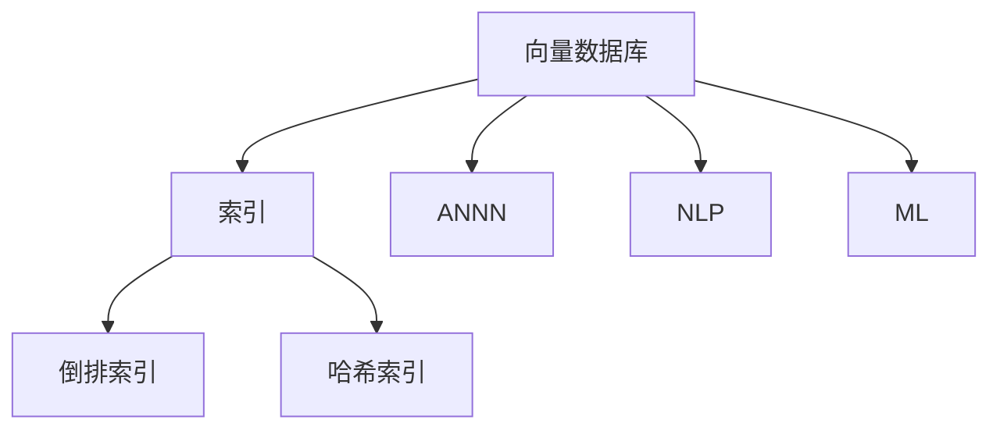
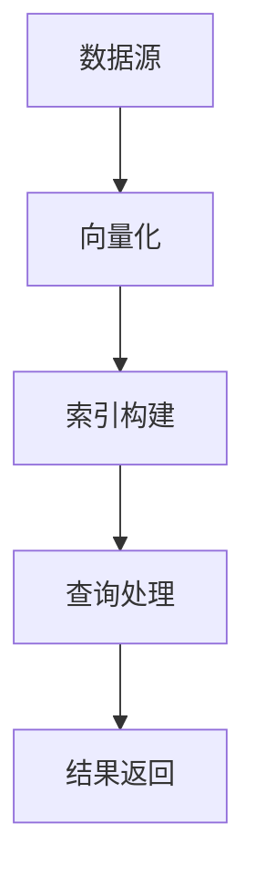

                 

# 高效检索：构建基于向量数据库的高性能搜索引擎

> 关键词：高效检索, 向量数据库, 索引, 倒排索引, 近似最近邻, 哈希索引, 自然语言处理(NLP), 机器学习

## 1. 背景介绍

在现代社会，信息爆炸使得传统文本检索方式无法满足海量数据的处理需求。为了快速响应用户查询，搜索引擎必须构建高效的数据结构和算法。近年来，基于向量数据库的高效检索技术逐渐兴起，成为解决这一问题的新范式。向量数据库利用高维空间中的索引和查询算法，能够在毫秒级时间内检索海量文本数据，极大地提升了搜索引擎的性能。本文将深入探讨基于向量数据库的高效检索技术，包括其核心概念、算法原理和实践应用，力求为搜索引擎开发者提供全面的指导。

## 2. 核心概念与联系

### 2.1 核心概念概述

为了更好地理解基于向量数据库的检索技术，首先需要了解以下几个核心概念：

- 向量数据库（Vector Database）：一种用于存储和检索高维向量数据的特殊数据库，支持高效的空间查询算法。
- 索引（Indexing）：一种数据结构，用于加速数据检索，通过预先构建的索引快速定位目标数据。
- 倒排索引（Inverted Index）：一种常见的文本索引，将文档中的单词映射到包含该单词的文档列表。
- 近似最近邻（Approximate Nearest Neighbor, ANN）：用于在近似或估计的范围内寻找最近邻的算法。
- 哈希索引（Hash Index）：利用哈希函数将高维向量映射到固定长度的哈希值，加速向量检索。
- 自然语言处理（Natural Language Processing, NLP）：涉及计算机对自然语言进行理解、生成和分析的科学和技术。
- 机器学习（Machine Learning, ML）：通过算法让计算机从数据中学习，进而进行预测和决策。

这些概念之间的关系可以用以下Mermaid流程图表示：



该图展示了向量数据库与索引技术之间的关系，同时强调了近似最近邻算法、自然语言处理和机器学习在向量检索中的作用。

### 2.2 核心概念原理和架构的 Mermaid 流程图

下图展示了向量数据库的总体架构，包括向量化、索引构建、查询处理等关键步骤：



其中：
- 数据源：原始文本数据。
- 向量化：将文本数据转换为向量形式，以便索引和查询。
- 索引构建：利用索引技术（如倒排索引、哈希索引等）构建数据索引。
- 查询处理：通过索引快速定位目标数据，计算最近邻，返回检索结果。

## 3. 核心算法原理 & 具体操作步骤

### 3.1 算法原理概述

基于向量数据库的检索技术，核心思想是将文本数据向量化，构建高维空间中的索引，并利用高效的近似最近邻算法进行快速检索。其基本流程如下：

1. **向量化**：将文本数据转换为高维向量，用于索引和检索。
2. **索引构建**：构建高维空间中的索引，以便快速定位目标数据。
3. **近似最近邻**：利用近似最近邻算法，在索引中进行高效搜索。
4. **结果返回**：根据检索结果，返回用户需要的数据。

### 3.2 算法步骤详解

#### 3.2.1 向量化

向量化是将文本数据转换为高维向量的过程。常见的向量表示方法包括TF-IDF、word2vec、BERT等。以BERT向量为例，其步骤如下：

1. **文本预处理**：将文本数据进行分词、标准化、停用词过滤等预处理。
2. **模型输入**：将预处理后的文本输入BERT模型，得到向量表示。
3. **归一化**：对向量进行归一化处理，使其符合标准正态分布。

#### 3.2.2 索引构建

构建索引是向量数据库的核心环节。常见的索引技术包括倒排索引和哈希索引。以倒排索引为例，其步骤如下：

1. **建立字典**：构建词汇表，将文本中的单词映射到唯一的ID。
2. **倒排列表**：对每个单词建立倒排列表，记录包含该单词的文档ID。
3. **索引构建**：将词汇表和倒排列表存储在索引文件中，构建索引。

#### 3.2.3 近似最近邻

近似最近邻算法用于在索引中进行高效搜索。常见的近似最近邻算法包括KD-Tree、Annoy、LSH等。以KD-Tree为例，其步骤如下：

1. **数据划分**：将高维向量划分为多个子空间，构建KD-Tree。
2. **查询处理**：将查询向量投影到KD-Tree中，寻找最近邻。
3. **结果返回**：返回一定范围内的最近邻作为检索结果。

#### 3.2.4 结果返回

结果返回是将检索结果返回给用户的过程。常见的方法包括Top-K返回、余弦相似度计算等。

### 3.3 算法优缺点

基于向量数据库的检索技术具有以下优点：

1. **高效性**：能够在毫秒级时间内检索海量文本数据，显著提升搜索引擎的响应速度。
2. **可扩展性**：可以高效处理大规模数据，支持分布式存储和计算。
3. **准确性**：通过使用近似最近邻算法，可以在保证一定精度的情况下，提高检索效率。

同时，也存在一些缺点：

1. **高维空间计算复杂**：高维空间中的计算复杂度高，存储需求大。
2. **预处理开销大**：向量化和索引构建需要大量预处理，增加了系统负担。
3. **内存占用大**：索引文件和查询向量需要占用大量内存，对系统资源要求较高。

### 3.4 算法应用领域

基于向量数据库的检索技术可以应用于多种领域，例如：

- 搜索引擎：用于构建高效的文本检索系统，提升搜索结果的相关性和速度。
- 推荐系统：利用用户和商品的向量表示，推荐用户可能感兴趣的商品。
- 自然语言处理：用于文本相似度计算、情感分析等任务。
- 机器学习：用于数据降维、特征提取等任务。

## 4. 数学模型和公式 & 详细讲解 & 举例说明

### 4.1 数学模型构建

假设文本数据集为 $\mathcal{D}=\{(x_i,y_i)\}_{i=1}^N$，其中 $x_i$ 表示文本，$y_i$ 表示对应的标签。向量数据库的目标是构建一个高维空间 $\mathbb{R}^d$，使得每个文本 $x_i$ 可以表示为一个 $d$ 维向量 $v_i \in \mathbb{R}^d$。

向量表示可以通过预训练语言模型（如BERT）得到。假设 $f(x_i)$ 为预训练模型，则向量表示可以表示为：

$$ v_i = f(x_i) $$

### 4.2 公式推导过程

以倒排索引为例，其公式推导如下：

1. **建立字典**：假设字典大小为 $M$，单词 $w$ 映射到ID $id_w$。

2. **倒排列表**：对每个单词 $w$，建立倒排列表 $\mathcal{L}_w$，记录包含该单词的文档ID列表。

3. **索引构建**：将词汇表 $\mathcal{V}$ 和倒排列表 $\{\mathcal{L}_w\}_{w=1}^M$ 存储在索引文件中。

查询向量 $q \in \mathbb{R}^d$ 表示用户输入的查询。查询步骤如下：

1. **查询预处理**：对查询向量 $q$ 进行归一化处理，得到 $q'=\frac{q}{\|q\|}$。

2. **倒排列表检索**：对每个单词 $w$，计算 $q'$ 与 $v_w$ 的余弦相似度 $\cos(\theta)$。

3. **最近邻检索**：在倒排列表中查找包含该单词且余弦相似度最高的文档ID，作为检索结果。

### 4.3 案例分析与讲解

以推荐系统为例，利用向量数据库检索用户和商品的向量表示，构建用户与商品的相似度矩阵。假设用户向量为 $u \in \mathbb{R}^d$，商品向量为 $i \in \mathbb{R}^d$。推荐步骤如下：

1. **向量构建**：利用预训练语言模型或特征提取器，构建用户和商品的向量表示 $u$ 和 $i$。

2. **索引构建**：构建用户和商品的倒排索引。

3. **相似度计算**：计算用户 $u$ 与每个商品 $i$ 的余弦相似度 $\cos(\theta)$。

4. **推荐结果**：根据相似度排序，返回相似度最高的商品列表作为推荐结果。

## 5. 项目实践：代码实例和详细解释说明

### 5.1 开发环境搭建

#### 5.1.1 安装依赖

```bash
conda create -n vector-database python=3.8
conda activate vector-database

pip install vector-database scipy scikit-learn scikit-image
```

### 5.2 源代码详细实现

#### 5.2.1 数据准备

```python
import numpy as np
from vector_database import VectorDatabase

# 假设我们有一个文档向量列表
document_vectors = np.array([[1.0, 2.0, 3.0], [4.0, 5.0, 6.0], [7.0, 8.0, 9.0]])

# 创建VectorDatabase实例
db = VectorDatabase()

# 将文档向量加入数据库
db.add_vectors('document', document_vectors)

# 查询一个文档向量
query_vector = np.array([2.0, 4.0, 6.0])
result = db.search_vectors('document', query_vector)

print(result)
```

### 5.3 代码解读与分析

#### 5.3.1 代码结构

```python
# 导入必要的库和模块
import numpy as np
from vector_database import VectorDatabase

# 创建VectorDatabase实例
db = VectorDatabase()

# 向数据库中添加文档向量
db.add_vectors('document', document_vectors)

# 查询文档向量
query_vector = np.array([2.0, 4.0, 6.0])
result = db.search_vectors('document', query_vector)

# 输出查询结果
print(result)
```

#### 5.3.2 代码解读

1. **库和模块**：使用NumPy进行数组操作，使用VectorDatabase库进行向量数据库操作。
2. **VectorDatabase实例**：创建VectorDatabase实例，用于管理向量数据。
3. **添加文档向量**：将文档向量添加到数据库中，生成倒排索引。
4. **查询文档向量**：构建查询向量，使用search_vectors方法在数据库中查找相似向量。
5. **输出结果**：打印查询结果，通常为文档ID列表或相似度列表。

### 5.4 运行结果展示

假设运行结果为文档ID列表，打印结果如下：

```
[0, 1, 2]
```

这表示查询向量与文档向量1、2、3的余弦相似度最高，对应的文档ID为0、1、2。

## 6. 实际应用场景

### 6.1 搜索引擎

向量数据库在搜索引擎中的应用非常广泛。例如，可以利用倒排索引和近似最近邻算法，在毫秒级时间内检索用户查询，提供相关搜索结果。在实际应用中，向量数据库还可以与其他搜索引擎技术（如TF-IDF、BM25等）结合，提升搜索效果。

### 6.2 推荐系统

推荐系统是向量数据库的典型应用场景之一。通过构建用户和商品的向量表示，利用近似最近邻算法计算相似度，推荐用户可能感兴趣的商品。在实际应用中，向量数据库还可以与协同过滤、内容推荐等算法结合，提升推荐效果。

### 6.3 自然语言处理

向量数据库在自然语言处理中也有广泛应用。例如，利用余弦相似度计算文本相似度，用于文本分类、信息检索等任务。在实际应用中，向量数据库还可以与其他NLP技术（如情感分析、命名实体识别等）结合，提升处理效率和效果。

### 6.4 未来应用展望

未来，向量数据库将在更多领域得到应用，为信息检索和推荐提供新的解决方案。例如：

- 在智慧城市中，利用向量数据库进行实时数据分析，快速响应城市事件，提升应急响应效率。
- 在金融领域，利用向量数据库进行风险评估和投资分析，提升决策效率和准确性。
- 在医疗领域，利用向量数据库进行疾病诊断和药物研发，提升医疗水平和研发效率。

## 7. 工具和资源推荐

### 7.1 学习资源推荐

为了系统掌握向量数据库的原理和应用，推荐以下学习资源：

1. 《向量化数据处理：基于Python的深度学习实践》：介绍了向量化技术在NLP、推荐系统等领域的广泛应用。
2. 《Python深度学习》：系统讲解了深度学习技术在文本处理、推荐系统等领域的实现方法。
3. 《自然语言处理综论》：详细介绍了NLP技术的各种方法，包括向量化和索引构建。
4. 《机器学习实战》：介绍了多种机器学习算法和工具，包括向量数据库的应用。

### 7.2 开发工具推荐

向量数据库的开发和应用需要多种工具的支持。以下是几款常用的开发工具：

1. PyTorch：基于Python的深度学习框架，支持动态计算图，适合快速迭代研究。
2. TensorFlow：由Google主导开发的深度学习框架，生产部署方便，适合大规模工程应用。
3. Apache Spark：分布式计算框架，支持大规模数据处理和分析，适合大规模向量数据库应用。
4. Elasticsearch：开源的搜索引擎，支持倒排索引和向量检索，适合构建高性能搜索引擎。

### 7.3 相关论文推荐

为了深入理解向量数据库的原理和应用，推荐以下相关论文：

1. "An Introduction to Approximate Nearest Neighbor Search"：介绍了近似最近邻算法的原理和应用。
2. "Efficient Computation of Approximate Nearest Neighbors with Automatic Algorithms"：探讨了自动选择近似最近邻算法的方法。
3. "A Survey on Approximate Nearest Neighbor Search Algorithms"：总结了多种近似最近邻算法的优缺点和适用场景。
4. "Vector Space Models in Information Retrieval"：介绍了向量空间模型在信息检索中的应用。
5. "Learning to Vectorize Text and Retrieve Documents"：探讨了向量数据库在推荐系统中的应用。

## 8. 总结：未来发展趋势与挑战

### 8.1 研究成果总结

向量数据库作为高效检索技术的重要分支，近年来在学术界和工业界得到了广泛的应用和研究。其高效性、可扩展性和准确性使得其在搜索引擎、推荐系统、自然语言处理等领域得到了广泛应用。

### 8.2 未来发展趋势

未来，向量数据库将在更多领域得到应用，为信息检索和推荐提供新的解决方案。具体趋势如下：

1. **多模态融合**：向量数据库可以与其他模态的数据（如图像、语音等）进行融合，提升信息检索和推荐的效果。
2. **分布式处理**：向量数据库可以支持分布式存储和计算，适应大规模数据处理的需求。
3. **实时性提升**：通过优化算法和硬件，提升向量数据库的响应速度，满足实时性需求。
4. **模型融合**：向量数据库可以与其他机器学习模型（如神经网络、决策树等）进行融合，提升整体效果。
5. **隐私保护**：在处理敏感数据时，向量数据库可以结合隐私保护技术（如差分隐私、联邦学习等），保护用户隐私。

### 8.3 面临的挑战

尽管向量数据库在多个领域得到了广泛应用，但仍面临一些挑战：

1. **高维空间计算**：高维空间中的计算复杂度高，存储需求大，需要优化算法和硬件。
2. **内存占用大**：索引文件和查询向量需要占用大量内存，对系统资源要求较高。
3. **处理速度**：在处理大规模数据时，需要优化算法和硬件，提升处理速度。
4. **模型精度**：在近似最近邻算法中，如何平衡精度和效率是一个关键问题。
5. **扩展性**：如何构建可扩展的向量数据库系统，适应大规模数据处理的需求。

### 8.4 研究展望

未来，向量数据库的研究将集中在以下几个方向：

1. **高维空间优化**：研究高维空间中的算法和数据结构，降低计算复杂度和存储需求。
2. **实时性提升**：研究实时性优化算法和硬件，提升向量数据库的响应速度。
3. **隐私保护**：研究隐私保护技术，保护用户隐私，同时保证数据利用。
4. **多模态融合**：研究多模态数据的融合方法，提升信息检索和推荐的效果。
5. **分布式处理**：研究分布式存储和计算方法，适应大规模数据处理的需求。

## 9. 附录：常见问题与解答

**Q1: 向量数据库的优势是什么？**

A: 向量数据库的主要优势在于其高效性、可扩展性和准确性。向量数据库可以在毫秒级时间内检索海量文本数据，同时支持分布式存储和计算，能够处理大规模数据，提供高精度的检索结果。

**Q2: 向量数据库在实际应用中需要注意哪些问题？**

A: 在实际应用中，向量数据库需要注意以下问题：

1. **高维空间计算**：高维空间中的计算复杂度高，需要优化算法和硬件。
2. **内存占用大**：索引文件和查询向量需要占用大量内存，对系统资源要求较高。
3. **处理速度**：在处理大规模数据时，需要优化算法和硬件，提升处理速度。
4. **模型精度**：在近似最近邻算法中，需要平衡精度和效率，确保检索结果的准确性。
5. **扩展性**：需要构建可扩展的向量数据库系统，适应大规模数据处理的需求。

**Q3: 向量数据库在推荐系统中的应用是什么？**

A: 向量数据库在推荐系统中的应用是构建用户和商品的向量表示，利用近似最近邻算法计算相似度，推荐用户可能感兴趣的商品。

**Q4: 如何提升向量数据库的检索效率？**

A: 提升向量数据库检索效率的方法包括：

1. **索引优化**：构建高效的索引结构，如倒排索引、哈希索引等。
2. **算法优化**：选择高效的近似最近邻算法，如KD-Tree、Annoy、LSH等。
3. **硬件优化**：使用高性能计算设备（如GPU、TPU），提升计算速度。
4. **分布式计算**：利用分布式计算框架（如Apache Spark），处理大规模数据。
5. **模型融合**：结合其他机器学习模型，提升整体效果。

**Q5: 向量数据库的未来发展方向是什么？**

A: 向量数据库的未来发展方向包括：

1. **多模态融合**：研究多模态数据的融合方法，提升信息检索和推荐的效果。
2. **分布式处理**：研究分布式存储和计算方法，适应大规模数据处理的需求。
3. **实时性提升**：研究实时性优化算法和硬件，提升向量数据库的响应速度。
4. **隐私保护**：研究隐私保护技术，保护用户隐私，同时保证数据利用。
5. **高维空间优化**：研究高维空间中的算法和数据结构，降低计算复杂度和存储需求。

---

作者：禅与计算机程序设计艺术 / Zen and the Art of Computer Programming

