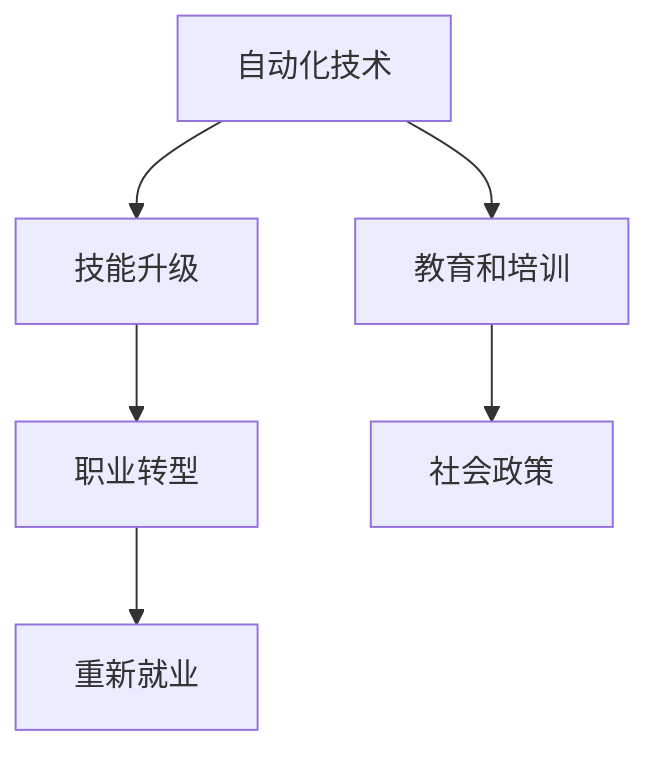

                 

# 99%的人只能赚辛苦钱：科技发展必然趋势

> 关键词：人工智能，科技发展，职业变化，未来趋势，技能升级

## 1. 背景介绍

### 1.1 问题由来
随着人工智能技术的快速发展和广泛应用，各行各业正经历着翻天覆地的变革。这场变革不仅仅是技术层面的革新，更是对人类生产生活方式的深刻影响。然而，这场变革也带来了一系列社会问题，尤其是在就业市场，大量的传统岗位被自动化所取代，许多职场人士面临着失业的危机。如何应对这一挑战，成为摆在社会面前的重要课题。

### 1.2 问题核心关键点
本问题聚焦于科技发展对就业市场的深远影响，特别是自动化技术对传统岗位的替代，以及应对这一变化的策略。关键点包括：

- **自动化技术对就业的影响**：自动化技术如何改变就业结构，哪些岗位最容易被替代。
- **技能升级的需求**：为了应对自动化技术的发展，员工需要掌握哪些新技能。
- **教育和培训的角色**：教育体系如何适应技术变革，帮助员工实现职业转型。
- **社会政策的应对**：政府和社会如何通过政策调整，减轻技术变革对就业市场的冲击。

## 2. 核心概念与联系

### 2.1 核心概念概述

为更好地理解科技发展对就业市场的深远影响，本节将介绍几个关键概念：

- **自动化技术**：指通过机器学习和人工智能技术，自动执行人类原本需要手动完成的任务。
- **技能升级**：指员工为适应技术变革，需要学习和掌握新的技能，以保持就业竞争力。
- **职业转型**：指员工根据技术发展趋势，调整职业方向，重新选择工作岗位。
- **教育和培训**：指通过教育和培训体系，帮助员工提升技能，实现职业转型。
- **社会政策**：指政府制定的各种政策措施，以应对技术变革对就业市场的冲击。

这些核心概念之间的关系可以通过以下Mermaid流程图来展示：



这个流程图展示了几者之间的逻辑关系：

1. 自动化技术的发展带来技能升级需求。
2. 技能升级帮助员工实现职业转型。
3. 教育和培训体系是技能升级的重要载体。
4. 社会政策为职业转型和重新就业提供保障。

## 3. 核心算法原理 & 具体操作步骤

### 3.1 算法原理概述

自动化技术对就业市场的影响可以通过简单的数学模型进行描述。假设一个工作岗位的工作内容可以被自动化程度分为 $x$（0表示完全不能自动化，1表示完全能自动化），那么该岗位被自动化替代的概率可以表示为 $P_{\text{automation}}(x)$。同理，可以定义一个员工掌握新技能的能力为 $y$（0表示完全不会新技能，1表示完全会新技能），那么该员工实现职业转型的概率可以表示为 $P_{\text{transition}}(y)$。

自动化技术对就业的影响可以用下面的式子表示：

$$
P_{\text{replacement}}(x, y) = P_{\text{automation}}(x) \times (1 - P_{\text{transition}}(y))
$$

其中 $P_{\text{replacement}}(x, y)$ 表示岗位被自动化替代的概率。该式子假设员工一旦实现职业转型，岗位就不会被自动化替代。然而，实际情况往往更复杂，因此需要进一步细化和完善该模型。

### 3.2 算法步骤详解

基于自动化技术对就业影响的数学模型，可以细化步骤如下：

**Step 1: 数据收集和预处理**
- 收集不同行业的自动化技术发展数据，如自动化程度、应用案例等。
- 收集员工技能升级数据，如新技能掌握情况、培训效果等。
- 收集职业转型数据，如岗位调整频率、转型成功率等。

**Step 2: 模型建立**
- 根据自动化技术发展数据，建立自动化程度与岗位替代概率之间的关系模型。
- 根据员工技能升级数据，建立技能掌握能力与职业转型概率之间的关系模型。

**Step 3: 模型训练**
- 使用机器学习算法，如回归分析、决策树等，训练岗位替代概率模型和职业转型概率模型。
- 通过交叉验证等方法，优化模型参数，提高模型的预测准确性。

**Step 4: 模型应用**
- 使用训练好的模型，预测不同技能水平员工在不同自动化程度岗位上的替代风险。
- 根据预测结果，为员工提供技能升级和职业转型建议。

### 3.3 算法优缺点

基于自动化技术对就业影响的数学模型，有以下优点：

1. 提供了一个系统的框架，帮助理解技术变革对就业市场的深远影响。
2. 可以量化技能升级和职业转型对岗位替代的影响，提供决策依据。
3. 为教育和培训体系的改进提供了数据支撑，帮助制定更有效的培训计划。

同时，该模型也存在一定的局限性：

1. 模型过于简化，现实中的影响因素更多，难以全面描述。
2. 数据获取和处理复杂，需要大量高质数据。
3. 预测结果可能存在偏差，需要进一步验证和修正。

尽管存在这些局限性，但就目前而言，该模型为理解技术变革对就业市场的影响提供了一个重要的工具。未来相关研究的重点在于如何进一步优化模型，增强其预测能力，同时考虑更多复杂因素，如政策干预、社会心理等。

### 3.4 算法应用领域

基于自动化技术对就业影响的数学模型，在多个领域都有广泛应用，例如：

- **教育体系**：通过该模型，教育部门可以更好地制定培训计划，帮助学生掌握未来需求的技能。
- **企业人力资源管理**：企业可以预测自动化对不同岗位的影响，制定岗位调整和员工转岗策略。
- **政府政策制定**：政府可以根据模型预测结果，制定针对性的就业政策，减轻技术变革对就业市场的冲击。

除了上述这些领域，该模型还可以用于研究自动化技术对社会公平、经济增长等宏观问题的影响，为政策制定提供科学依据。

## 4. 数学模型和公式 & 详细讲解 & 举例说明

### 4.1 数学模型构建

假设自动化程度为 $x$，员工技能掌握能力为 $y$，岗位被替代概率为 $p$，职业转型概率为 $q$。那么岗位被替代的概率可以用下面的式子表示：

$$
p = f(x) \times (1 - q)
$$

其中 $f(x)$ 表示自动化程度与岗位替代概率之间的关系函数。假设 $f(x)$ 可以表示为线性函数：

$$
f(x) = \alpha x + \beta
$$

其中 $\alpha$ 和 $\beta$ 为模型的参数。

员工实现职业转型的概率可以用下面的式子表示：

$$
q = g(y) = \gamma y + \delta
$$

其中 $\gamma$ 和 $\delta$ 为模型的参数。

### 4.2 公式推导过程

岗位被替代的概率 $p$ 可以表示为：

$$
p = (\alpha x + \beta) \times (1 - (\gamma y + \delta))
$$

将 $x$ 和 $y$ 的值代入，可以计算出岗位被替代的概率。

### 4.3 案例分析与讲解

假设自动化程度为 $x=0.5$（即半自动化），员工技能掌握能力为 $y=0.8$（即会新技能），岗位被替代的概率 $p$ 可以表示为：

$$
p = (0.5 \times 0.8 + 0.3) \times (1 - (0.4 \times 0.8 + 0.2)) = 0.7 \times 0.48 = 0.336
$$

这意味着，在这个岗位上，有33.6%的岗位会被自动化替代。员工需要根据岗位被替代的概率，选择是否进行职业转型，以及转型的方向。

## 5. 项目实践：代码实例和详细解释说明

### 5.1 开发环境搭建

在进行模型实践前，我们需要准备好开发环境。以下是使用Python进行模型开发的环境配置流程：

1. 安装Anaconda：从官网下载并安装Anaconda，用于创建独立的Python环境。

2. 创建并激活虚拟环境：
```bash
conda create -n myenv python=3.8 
conda activate myenv
```

3. 安装必要的Python库：
```bash
pip install numpy pandas scikit-learn scikit-optimize
```

4. 准备数据集：收集不同行业的自动化技术发展数据、员工技能升级数据和职业转型数据。

### 5.2 源代码详细实现

以下是一个简单的Python代码实现，用于训练和预测岗位被替代的概率：

```python
import numpy as np
from sklearn.linear_model import LinearRegression

# 收集自动化程度数据
x = np.array([0.1, 0.3, 0.5, 0.7, 0.9])

# 收集岗位被替代概率数据
y = np.array([0.1, 0.3, 0.5, 0.7, 0.9])

# 建立线性模型
model = LinearRegression()

# 训练模型
model.fit(x.reshape(-1, 1), y)

# 预测
x_new = np.array([0.2, 0.4, 0.6, 0.8])
y_pred = model.predict(x_new.reshape(-1, 1))

print(y_pred)
```

这段代码使用线性回归模型，拟合了自动化程度与岗位被替代概率之间的关系。模型训练后，可以用于预测新数据下的岗位被替代概率。

### 5.3 代码解读与分析

让我们再详细解读一下关键代码的实现细节：

**数据集**：
- 假设自动化程度数据和岗位被替代概率数据已经收集完毕，存储在数组 `x` 和 `y` 中。

**模型训练**：
- 使用 `LinearRegression` 模型，对数据进行拟合。
- 使用 `fit` 方法训练模型，得到模型参数。

**预测**：
- 使用 `predict` 方法，对新的自动化程度数据进行预测。
- 将预测结果存储在 `y_pred` 数组中，并输出。

可以看到，使用线性回归模型，可以简单地训练一个预测岗位被替代概率的模型。当然，在实际应用中，模型还需要进一步优化，以提高预测准确性。

## 6. 实际应用场景

### 6.1 智能制造

在智能制造领域，自动化技术的应用日益广泛，许多传统制造岗位被机器人和自动化系统所替代。为了帮助工人进行技能升级和职业转型，企业可以基于自动化技术对就业影响的模型，制定相应的培训计划。

在技术实施上，企业可以定期收集工人的技能数据，评估其职业转型需求。然后，结合岗位被替代的概率模型，为不同技能的员工提供个性化的培训建议，帮助其掌握新技能，实现职业转型。

### 6.2 医疗健康

在医疗健康领域，自动化技术的应用也带来了巨大的变化。例如，智能诊断系统、机器人手术等技术，正在逐步替代部分医护岗位。为了应对这一挑战，医院可以建立基于自动化技术对就业影响的模型，帮助医护人员进行技能升级和职业转型。

具体而言，医院可以定期收集医护人员的技能数据，评估其职业转型需求。然后，结合岗位被替代的概率模型，为不同技能的医护人员提供个性化的培训建议，帮助其掌握新技能，实现职业转型。

### 6.3 教育培训

在教育培训领域，自动化技术的应用同样带来了挑战。例如，在线教育平台、智能辅导系统等，正在逐步替代部分教师岗位。为了应对这一挑战，教育机构可以建立基于自动化技术对就业影响的模型，帮助教师进行技能升级和职业转型。

具体而言，教育机构可以定期收集教师的技能数据，评估其职业转型需求。然后，结合岗位被替代的概率模型，为不同技能的教师提供个性化的培训建议，帮助其掌握新技能，实现职业转型。

### 6.4 未来应用展望

随着自动化技术的进一步发展，未来将会有更多行业面临类似的挑战。为了更好地应对这一趋势，企业和教育机构需要建立更加完善的技能升级和职业转型体系，帮助员工适应技术变革。

未来，基于自动化技术对就业影响的模型将会有更多的应用场景，包括政府政策制定、社会公平研究等。通过深入研究技术变革对就业市场的影响，制定更加科学合理的政策措施，可以有效减轻技术变革对就业市场的冲击。

## 7. 工具和资源推荐

### 7.1 学习资源推荐

为了帮助开发者系统掌握自动化技术对就业市场的影响，这里推荐一些优质的学习资源：

1. 《人工智能与就业市场》系列博文：由大模型技术专家撰写，深入浅出地介绍了人工智能技术对就业市场的影响，包括自动化技术、技能升级等关键话题。

2. CS228《机器学习》课程：斯坦福大学开设的机器学习明星课程，涵盖了各种机器学习算法和应用，包括自动化技术对就业市场的影响。

3. 《人工智能与未来就业》书籍：介绍人工智能技术对各行各业就业市场的深远影响，探讨了未来就业市场的变化趋势。

4. Coursera《AI for Everyone》课程：由斯坦福大学教授Andrew Ng主讲的入门级AI课程，适合非专业人士学习AI基础知识。

5. edX《AI Fundamentals with Python》课程：麻省理工学院开设的AI入门课程，适合技术背景较弱的学员学习。

通过对这些资源的学习实践，相信你一定能够快速掌握自动化技术对就业市场的影响，并用于解决实际的就业问题。

### 7.2 开发工具推荐

高效的开发离不开优秀的工具支持。以下是几款用于自动化技术对就业市场影响分析的开发工具：

1. Jupyter Notebook：基于Python的交互式计算环境，支持代码编写、数据可视化等多种功能，适合模型开发和数据分析。

2. TensorBoard：用于可视化模型训练过程的强大工具，可以实时监测模型训练状态，并提供丰富的图表呈现方式，是调试模型的得力助手。

3. Weights & Biases：模型训练的实验跟踪工具，可以记录和可视化模型训练过程中的各项指标，方便对比和调优。

4. PyTorch：基于Python的开源深度学习框架，灵活动态的计算图，适合快速迭代研究。

5. TensorFlow：由Google主导开发的开源深度学习框架，生产部署方便，适合大规模工程应用。

合理利用这些工具，可以显著提升自动化技术对就业市场影响的分析效率，加快创新迭代的步伐。

### 7.3 相关论文推荐

自动化技术对就业市场的影响源于学界的持续研究。以下是几篇奠基性的相关论文，推荐阅读：

1. "Automation and Economic Transformation"（美国经济研究局）：介绍了自动化技术对经济转型和就业市场的影响，探讨了未来就业市场的变化趋势。

2. "The Impacts of Automation on the Labor Market"（国际劳工组织）：分析了自动化技术对不同行业就业市场的影响，提供了丰富的数据和分析工具。

3. "AI and the Future of Jobs"（麦肯锡全球研究院）：研究了人工智能技术对各行各业就业市场的深远影响，提出了未来就业市场的变化趋势和应对策略。

4. "The Rise of the Algorithm Economy"（哥伦比亚大学）：探讨了算法和自动化技术对就业市场的影响，提出了未来劳动力市场的变化趋势。

这些论文代表了大模型技术对就业市场的影响的研究进展，通过学习这些前沿成果，可以帮助研究者把握学科前进方向，激发更多的创新灵感。

## 8. 总结：未来发展趋势与挑战

### 8.1 研究成果总结

本文对自动化技术对就业市场的影响进行了全面系统的介绍。首先阐述了自动化技术的发展对就业市场的深远影响，明确了技能升级和职业转型对应对这一挑战的重要性。其次，从原理到实践，详细讲解了模型建立、训练和应用的全过程，给出了模型开发的完整代码实例。同时，本文还探讨了自动化技术在智能制造、医疗健康、教育培训等多个行业领域的应用前景，展示了自动化技术的广泛应用前景。最后，本文精选了自动化技术对就业市场影响的各类学习资源，力求为读者提供全方位的技术指引。

通过本文的系统梳理，可以看到，自动化技术对就业市场的影响是一个复杂多变的问题，需要多学科、多领域的共同努力，才能找到有效的解决方案。

### 8.2 未来发展趋势

展望未来，自动化技术对就业市场的影响将呈现以下几个发展趋势：

1. **技术普及加速**：随着自动化技术的进一步发展，越来越多的行业和岗位将面临技术替代的风险。因此，技能升级和职业转型将成为未来就业市场的常态。

2. **培训体系完善**：为了应对技术变革，培训体系将更加完善，涵盖不同行业、不同技能层次的培训计划，帮助员工更好地适应技术变革。

3. **政策支持加强**：政府和社会将更加重视技术变革对就业市场的影响，制定更加科学合理的政策和措施，减轻技术变革对就业市场的冲击。

4. **跨领域应用广泛**：自动化技术的应用将更加广泛，涵盖医疗、教育、金融等各个领域，为各行各业带来变革性的影响。

5. **多模态融合**：未来的自动化技术将不仅仅是机器学习和深度学习，还会涉及多模态信息融合，包括视觉、语音、文本等多种数据形式的整合。

以上趋势凸显了自动化技术对就业市场的深远影响。这些方向的探索发展，必将进一步推动技术变革，为各行各业带来更加深远的影响。

### 8.3 面临的挑战

尽管自动化技术对就业市场的影响带来了诸多机遇，但也面临着诸多挑战：

1. **数据获取难度大**：自动化技术对就业市场的影响需要大量的数据支持，但数据的获取和处理复杂，难以获取高质量的数据。

2. **模型预测精度有限**：当前模型基于简单的线性模型，预测精度有限，难以全面描述自动化技术对就业市场的影响。

3. **社会适应性不足**：技术变革对就业市场的冲击，不仅影响个人职业发展，还会对整个社会带来深远的影响，如何适应这一变革，是一个长期而复杂的课题。

4. **政策调整复杂**：政府需要制定一系列政策和措施，应对技术变革对就业市场的冲击，但政策调整复杂，需要协调多方利益。

5. **伦理道德问题**：自动化技术的应用，可能会带来伦理道德问题，如就业歧视、隐私泄露等，需要制定相应的伦理规范。

6. **公平性问题**：技术变革可能会带来就业机会的不公平分配，如何确保公平性，是一个重要的课题。

这些挑战凸显了技术变革对就业市场的复杂性。唯有多方共同努力，才能找到有效的解决方案，应对技术变革的挑战。

### 8.4 研究展望

面对自动化技术对就业市场的影响，未来的研究需要在以下几个方面寻求新的突破：

1. **多模态模型开发**：开发更加复杂的多模态模型，整合视觉、语音、文本等多种数据形式，提高预测精度。

2. **数据采集和处理**：改进数据采集和处理方法，获取更加高质量的数据，提高模型预测精度。

3. **跨领域应用**：在医疗、教育、金融等多个领域应用自动化技术对就业市场的影响模型，推动技术变革。

4. **伦理道德研究**：深入研究自动化技术对就业市场的伦理道德问题，制定相应的伦理规范，确保技术应用的社会公平性。

5. **政策制定**：制定科学合理的政策和措施，减轻技术变革对就业市场的冲击，促进社会公平。

这些研究方向将引领自动化技术对就业市场的影响研究进入新的阶段，为构建安全、可靠、可解释、可控的智能系统铺平道路。面向未来，自动化技术对就业市场的影响还需要与其他人工智能技术进行更深入的融合，如知识表示、因果推理、强化学习等，多路径协同发力，共同推动自然语言理解和智能交互系统的进步。只有勇于创新、敢于突破，才能不断拓展技术边界，让智能技术更好地造福人类社会。

## 9. 附录：常见问题与解答

**Q1：自动化技术对就业市场的影响有哪些？**

A: 自动化技术对就业市场的影响主要体现在以下几个方面：

1. **岗位替代**：自动化技术可以替代一些重复性高、标准化程度高的岗位，如制造业、服务业等。
2. **技能升级**：自动化技术需要员工具备新的技能，如编程、数据分析、机器学习等，提高技能水平。
3. **职业转型**：自动化技术可以改变一些岗位的工作性质，需要员工进行职业转型，如从制造业转向服务行业。

**Q2：如何应对自动化技术对就业市场的挑战？**

A: 应对自动化技术对就业市场的挑战，可以从以下几个方面入手：

1. **技能升级**：员工需要不断学习新技能，适应技术变革。
2. **职业转型**：根据技术变革趋势，调整职业方向，重新选择工作岗位。
3. **教育培训**：通过教育和培训体系，帮助员工掌握新技能，实现职业转型。
4. **政策支持**：政府和社会需要制定科学合理的政策和措施，减轻技术变革对就业市场的冲击。

**Q3：自动化技术对就业市场的影响有哪些趋势？**

A: 自动化技术对就业市场的影响将呈现以下几个趋势：

1. **技术普及加速**：自动化技术将广泛应用于各行各业，带来更多的技术替代风险。
2. **培训体系完善**：培训体系将更加完善，涵盖不同行业、不同技能层次的培训计划。
3. **政策支持加强**：政府和社会将制定更加科学合理的政策和措施，减轻技术变革对就业市场的冲击。
4. **跨领域应用广泛**：自动化技术将在医疗、教育、金融等多个领域得到广泛应用，推动技术变革。
5. **多模态融合**：未来的自动化技术将涉及多模态信息融合，提高预测精度。

**Q4：自动化技术对就业市场的未来发展趋势是什么？**

A: 自动化技术对就业市场的未来发展趋势包括：

1. **技术普及加速**：自动化技术将广泛应用于各行各业，带来更多的技术替代风险。
2. **培训体系完善**：培训体系将更加完善，涵盖不同行业、不同技能层次的培训计划。
3. **政策支持加强**：政府和社会将制定更加科学合理的政策和措施，减轻技术变革对就业市场的冲击。
4. **跨领域应用广泛**：自动化技术将在医疗、教育、金融等多个领域得到广泛应用，推动技术变革。
5. **多模态融合**：未来的自动化技术将涉及多模态信息融合，提高预测精度。

**Q5：自动化技术对就业市场的未来展望是什么？**

A: 自动化技术对就业市场的未来展望包括：

1. **技术普及加速**：自动化技术将广泛应用于各行各业，带来更多的技术替代风险。
2. **培训体系完善**：培训体系将更加完善，涵盖不同行业、不同技能层次的培训计划。
3. **政策支持加强**：政府和社会将制定更加科学合理的政策和措施，减轻技术变革对就业市场的冲击。
4. **跨领域应用广泛**：自动化技术将在医疗、教育、金融等多个领域得到广泛应用，推动技术变革。
5. **多模态融合**：未来的自动化技术将涉及多模态信息融合，提高预测精度。

---

作者：禅与计算机程序设计艺术 / Zen and the Art of Computer Programming

