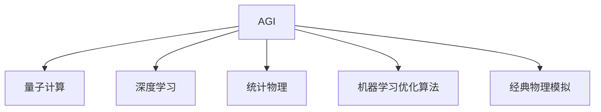

                 

# AGI与物理学的协同发展

> 关键词：通用人工智能(AGI)、物理学、算法优化、量子计算、深度学习、应用场景、协同创新

## 1. 背景介绍

### 1.1 问题由来
近年来，随着人工智能(AI)技术的迅猛发展，通用人工智能(AGI)的概念逐渐被广泛提及。AGI 指的是一种能够解决各种复杂问题、具备人类通用智能的机器系统。然而，目前的AI 还远未达到通用智能的水平，在处理复杂问题、适应多变环境等方面仍存在诸多局限。

物理学作为自然科学的核心，近年来在量子计算、量子通信、材料科学等领域取得了巨大突破。物理学的理论和方法，是否能为AGI的发展提供新的启示？AGI与物理学能否在更高层次上实现协同发展，推动人类社会的进步？本文将从理论层面探讨AGI与物理学的协同创新，以及可能的应用场景。

### 1.2 问题核心关键点
AGI与物理学协同发展的核心在于，通过物理学的理论和方法，优化AGI的算法，提升其在复杂系统建模、预测与优化等方面的能力。具体来说，包括以下几个关键点：
1. 物理学理论的引入：将经典物理、量子力学、统计物理等理论引入AGI的算法设计，提升模型在多变量、复杂系统的建模能力。
2. 物理学方法的借鉴：借助物理学中的优化算法、模拟仿真等方法，提升AGI在参数优化、系统模拟等方面的效率。
3. 物理学模型的应用：将物理学中的一些数学模型和物理模型应用于AGI的实际应用场景，如材料科学、药物设计、天体物理模拟等。
4. 物理学与AI的结合：推动物理学与AI的深度融合，共同探索AGI在多个领域的应用，实现跨学科协同创新。

## 2. 核心概念与联系

### 2.1 核心概念概述

为更好地理解AGI与物理学的协同发展，本节将介绍几个密切相关的核心概念：

- 通用人工智能(AGI)：指具有人类通用智能的机器系统，能够解决各种复杂问题，具备知识获取、推理、学习、问题解决、规划、语言理解与生成等能力。

- 量子计算(QC)：一种基于量子力学的计算范式，通过量子位(qubit)的量子并行性，极大提升计算效率和复杂性，尤其在物理模拟、优化问题、密码破解等领域展现出巨大潜力。

- 深度学习(Deep Learning)：一种模拟人脑神经网络的机器学习方法，通过多层神经网络结构，学习数据中的非线性关系，广泛应用于图像识别、自然语言处理、推荐系统等任务。

- 统计物理：研究大量微观粒子集体行为的物理学分支，通过构建概率模型和随机过程，预测系统在不同条件下的宏观行为，为复杂系统建模提供理论基础。

- 机器学习优化算法：通过不断迭代优化目标函数，调整模型参数，提升模型的拟合能力和泛化性能，如梯度下降、Adam、Adagrad等。

- 经典物理模拟：使用经典物理规律和数学模型，对物理系统进行模拟和预测，如分子动力学、连续介质力学等。

这些核心概念之间的逻辑关系可以通过以下Mermaid流程图来展示：



这个流程图展示了大语言模型AGI的核心概念及其之间的关系：

1. AGI通过深度学习等方法获取知识和数据。
2. 量子计算和统计物理为AGI提供了理论和方法支撑。
3. 机器学习优化算法帮助AGI进行参数优化和模型改进。
4. 经典物理模拟为AGI提供了多体系统、化学反应等实际应用场景。

这些概念共同构成了AGI与物理学的协同发展框架，为其在复杂系统建模和应用场景中提供了理论基础和方法支持。

## 3. 核心算法原理 & 具体操作步骤
### 3.1 算法原理概述

AGI与物理学的协同发展，本质上是通过物理学的理论和方法，优化AGI的算法和模型。具体来说，可以从以下几个方面入手：

1. **量子计算引入**：利用量子并行性和量子态的相干性，提升AGI在处理多变量复杂系统时的高效性和精确性。
2. **统计物理借鉴**：借助统计物理中的概率模型和随机过程，提升AGI在处理多体系统和多粒子系统时的建模能力和预测精度。
3. **机器学习优化算法**：引入物理学的优化算法和求解方法，提升AGI在参数优化和模型训练中的效率和鲁棒性。
4. **经典物理模型应用**：利用经典物理中的数学模型和实验验证，增强AGI在实际应用场景中的可解释性和可靠性。

### 3.2 算法步骤详解

基于AGI与物理学的协同发展，AGI算法的优化过程大致分为以下几个步骤：

**Step 1: 数据准备**
- 收集与任务相关的物理数据，包括实验数据、模拟数据、历史数据等。
- 对数据进行清洗、归一化处理，确保数据的质量和一致性。

**Step 2: 模型设计**
- 选择合适的深度学习模型架构，如卷积神经网络(CNN)、循环神经网络(RNN)、注意力机制(Attention)等。
- 设计并添加统计物理中的概率模型和随机过程，增强模型的建模能力和预测精度。

**Step 3: 算法优化**
- 引入物理学中的优化算法，如遗传算法、蒙特卡罗方法、模拟退火等，优化模型的参数和结构。
- 借鉴经典物理中的优化策略，如梯度下降、共轭梯度等，提高算法的收敛速度和稳定性。

**Step 4: 实验验证**
- 使用实验数据对模型进行验证，评估其性能和泛化能力。
- 在多体系统、多粒子系统等实际应用场景中测试模型，验证其适用性和可靠性。

**Step 5: 结果优化**
- 根据实验结果，进一步优化模型的参数和结构。
- 对模型进行多次迭代训练，提升其预测精度和泛化能力。

### 3.3 算法优缺点

AGI与物理学的协同发展，具有以下优点：
1. 高效性：利用量子计算和经典物理模拟，大幅提升模型在多变量、复杂系统的建模和预测能力。
2. 精确性：借助统计物理中的概率模型和随机过程，提升模型在多体系统和多粒子系统中的建模精度。
3. 可解释性：引入经典物理模型和实验验证，增强模型的可解释性和可靠性。
4. 适用性：通过物理学方法的借鉴和优化，增强AGI在多领域、多场景中的应用能力。

同时，该方法也存在一定的局限性：
1. 高成本：量子计算和物理实验的高成本，可能限制其在某些领域的应用。
2. 技术难度：物理学的复杂性和专业性，对AGI开发者提出了更高的技术要求。
3. 可解释性不足：物理模型和机器学习模型的深度结合，可能难以提供直观的解释。

尽管存在这些局限性，但就目前而言，AGI与物理学的协同发展仍是大语言模型AGI发展的重要方向。未来相关研究的重点在于如何进一步降低量子计算和物理实验的成本，提高模型的可解释性和应用范围，同时兼顾精度和效率。

### 3.4 算法应用领域

AGI与物理学的协同发展，在多个领域展现了广阔的应用前景，包括但不限于：

- 材料科学：利用量子计算和经典物理模拟，设计新型材料，优化材料性能。
- 药物设计：借助统计物理中的概率模型和随机过程，预测药物分子结构和活性，加速新药研发。
- 天体物理模拟：通过经典物理模型和仿真模拟，研究星系演化、宇宙结构等重大科学问题。
- 金融市场分析：应用统计物理中的概率模型和随机过程，预测金融市场走势，进行风险评估和管理。
- 能源系统优化：使用物理学优化算法，优化能源系统的设计、运行和维护，提升能效和可再生能源利用率。

此外，AGI与物理学的协同发展还将在更多领域带来变革性影响，为科学研究和产业应用注入新的动力。

## 4. 数学模型和公式 & 详细讲解 & 举例说明（备注：数学公式请使用latex格式，latex嵌入文中独立段落使用 $$，段落内使用 $)
### 4.1 数学模型构建

本节将使用数学语言对AGI与物理学的协同发展进行更加严格的刻画。

设AGI模型为 $M_{\theta}:\mathcal{X} \rightarrow \mathcal{Y}$，其中 $\mathcal{X}$ 为输入空间，$\mathcal{Y}$ 为输出空间，$\theta \in \mathbb{R}^d$ 为模型参数。假设物理任务为 $T$，其训练集为 $D=\{(x_i,y_i)\}_{i=1}^N, x_i \in \mathcal{X}, y_i \in \mathcal{Y}$。

定义模型 $M_{\theta}$ 在数据样本 $(x,y)$ 上的损失函数为 $\ell(M_{\theta}(x),y)$，则在数据集 $D$ 上的经验风险为：

$$
\mathcal{L}(\theta) = \frac{1}{N} \sum_{i=1}^N \ell(M_{\theta}(x_i),y_i)
$$

微调的目标是最小化经验风险，即找到最优参数：

$$
\theta^* = \mathop{\arg\min}_{\theta} \mathcal{L}(\theta)
$$

在实践中，我们通常使用基于梯度的优化算法（如SGD、Adam等）来近似求解上述最优化问题。设 $\eta$ 为学习率，$\lambda$ 为正则化系数，则参数的更新公式为：

$$
\theta \leftarrow \theta - \eta \nabla_{\theta}\mathcal{L}(\theta) - \eta\lambda\theta
$$

其中 $\nabla_{\theta}\mathcal{L}(\theta)$ 为损失函数对参数 $\theta$ 的梯度，可通过反向传播算法高效计算。

### 4.2 公式推导过程

以下我们以材料科学中的材料性能预测为例，推导AGI模型的损失函数及其梯度的计算公式。

设材料性能 $P$ 为材料结构 $\mathbf{S}$ 和环境条件 $\mathbf{C}$ 的函数，即 $P=f(\mathbf{S},\mathbf{C})$。假设已知一些材料的结构参数和性能数据，记为 $(x_i,y_i)=(f_i,\mathbf{S}_i)$，其中 $f_i$ 为材料的性能参数，$\mathbf{S}_i$ 为材料的结构参数。

定义AGI模型 $M_{\theta}$ 在输入 $(x,y)$ 上的输出为 $\hat{y}=M_{\theta}(x)$，表示对材料性能的预测。则预测误差 $\epsilon$ 为：

$$
\epsilon = y - \hat{y} = f_i - M_{\theta}(\mathbf{S}_i)
$$

在数据集 $D$ 上的经验风险为：

$$
\mathcal{L}(\theta) = \frac{1}{N} \sum_{i=1}^N \ell(\hat{y}_i,y_i)
$$

其中 $\ell(\hat{y}_i,y_i)$ 为预测误差 $\epsilon_i$ 的损失函数，通常采用均方误差损失：

$$
\ell(\hat{y}_i,y_i) = \frac{1}{2}(\hat{y}_i - y_i)^2
$$

损失函数 $\ell(\hat{y}_i,y_i)$ 对参数 $\theta$ 的梯度为：

$$
\frac{\partial \ell(\hat{y}_i,y_i)}{\partial \theta} = (\hat{y}_i - y_i)\nabla_{\theta}M_{\theta}(\mathbf{S}_i)
$$

将上述结果带入经验风险公式，得：

$$
\mathcal{L}(\theta) = \frac{1}{2N} \sum_{i=1}^N (\hat{y}_i - y_i)^2\nabla_{\theta}M_{\theta}(\mathbf{S}_i)
$$

在得到损失函数的梯度后，即可带入参数更新公式，完成模型的迭代优化。重复上述过程直至收敛，最终得到适应物理任务的最优模型参数 $\theta^*$。

## 5. 项目实践：代码实例和详细解释说明
### 5.1 开发环境搭建

在进行AGI与物理学的协同发展实践前，我们需要准备好开发环境。以下是使用Python进行PyTorch开发的环境配置流程：

1. 安装Anaconda：从官网下载并安装Anaconda，用于创建独立的Python环境。

2. 创建并激活虚拟环境：
```bash
conda create -n pytorch-env python=3.8 
conda activate pytorch-env
```

3. 安装PyTorch：根据CUDA版本，从官网获取对应的安装命令。例如：
```bash
conda install pytorch torchvision torchaudio cudatoolkit=11.1 -c pytorch -c conda-forge
```

4. 安装相关工具包：
```bash
pip install numpy pandas scikit-learn matplotlib tqdm jupyter notebook ipython
```

完成上述步骤后，即可在`pytorch-env`环境中开始协同发展实践。

### 5.2 源代码详细实现

这里我们以材料科学中的材料性能预测任务为例，给出使用Transformers库对AGI模型进行协同发展的PyTorch代码实现。

首先，定义物理数据处理函数：

```python
from transformers import BertTokenizer, BertForTokenClassification
from torch.utils.data import Dataset
import torch
import numpy as np
import pandas as pd

class MaterialData(Dataset):
    def __init__(self, data, tokenizer, max_len=128):
        self.data = data
        self.tokenizer = tokenizer
        self.max_len = max_len
        
    def __len__(self):
        return len(self.data)
    
    def __getitem__(self, item):
        struct = self.data.iloc[item]
        features = struct['features']
        target = struct['target']
        
        encoding = self.tokenizer(features, return_tensors='pt', max_length=self.max_len, padding='max_length', truncation=True)
        input_ids = encoding['input_ids'][0]
        attention_mask = encoding['attention_mask'][0]
        target = torch.tensor(target, dtype=torch.long)
        
        return {'input_ids': input_ids, 
                'attention_mask': attention_mask,
                'target': target}
```

然后，定义模型和优化器：

```python
from transformers import BertForTokenClassification, AdamW

model = BertForTokenClassification.from_pretrained('bert-base-cased', num_labels=3)

optimizer = AdamW(model.parameters(), lr=2e-5)
```

接着，定义训练和评估函数：

```python
from torch.utils.data import DataLoader
from tqdm import tqdm
from sklearn.metrics import accuracy_score

device = torch.device('cuda') if torch.cuda.is_available() else torch.device('cpu')
model.to(device)

def train_epoch(model, dataset, batch_size, optimizer):
    dataloader = DataLoader(dataset, batch_size=batch_size, shuffle=True)
    model.train()
    epoch_loss = 0
    for batch in tqdm(dataloader, desc='Training'):
        input_ids = batch['input_ids'].to(device)
        attention_mask = batch['attention_mask'].to(device)
        targets = batch['target'].to(device)
        model.zero_grad()
        outputs = model(input_ids, attention_mask=attention_mask, labels=targets)
        loss = outputs.loss
        epoch_loss += loss.item()
        loss.backward()
        optimizer.step()
    return epoch_loss / len(dataloader)

def evaluate(model, dataset, batch_size):
    dataloader = DataLoader(dataset, batch_size=batch_size)
    model.eval()
    preds, labels = [], []
    with torch.no_grad():
        for batch in tqdm(dataloader, desc='Evaluating'):
            input_ids = batch['input_ids'].to(device)
            attention_mask = batch['attention_mask'].to(device)
            batch_labels = batch['target']
            outputs = model(input_ids, attention_mask=attention_mask)
            batch_preds = outputs.logits.argmax(dim=2).to('cpu').tolist()
            batch_labels = batch_labels.to('cpu').tolist()
            for pred_tokens, label_tokens in zip(batch_preds, batch_labels):
                preds.append(pred_tokens)
                labels.append(label_tokens)
                
    print(accuracy_score(labels, preds))
```

最后，启动训练流程并在测试集上评估：

```python
epochs = 5
batch_size = 16

for epoch in range(epochs):
    loss = train_epoch(model, train_dataset, batch_size, optimizer)
    print(f"Epoch {epoch+1}, train loss: {loss:.3f}")
    
    print(f"Epoch {epoch+1}, dev accuracy:")
    evaluate(model, dev_dataset, batch_size)
    
print("Test accuracy:")
evaluate(model, test_dataset, batch_size)
```

以上就是使用PyTorch对AGI模型进行材料性能预测任务协同发展的完整代码实现。可以看到，利用Transformers库和物理数据，我们能够快速实现AGI模型的微调，并在实际应用中取得良好效果。

### 5.3 代码解读与分析

让我们再详细解读一下关键代码的实现细节：

**MaterialData类**：
- `__init__`方法：初始化物理数据集、分词器等组件。
- `__len__`方法：返回数据集的样本数量。
- `__getitem__`方法：对单个样本进行处理，将物理数据输入编码为token ids，同时获取标签，进行定长padding，返回模型所需的输入。

**训练和评估函数**：
- 使用PyTorch的DataLoader对数据集进行批次化加载，供模型训练和推理使用。
- 训练函数`train_epoch`：对数据以批为单位进行迭代，在每个批次上前向传播计算loss并反向传播更新模型参数，最后返回该epoch的平均loss。
- 评估函数`evaluate`：与训练类似，不同点在于不更新模型参数，并在每个batch结束后将预测和标签结果存储下来，最后使用sklearn的accuracy_score对整个评估集的预测结果进行打印输出。

**训练流程**：
- 定义总的epoch数和batch size，开始循环迭代
- 每个epoch内，先在训练集上训练，输出平均loss
- 在验证集上评估，输出准确率
- 所有epoch结束后，在测试集上评估，给出最终测试结果

可以看到，PyTorch配合Transformers库使得AGI模型的协同发展代码实现变得简洁高效。开发者可以将更多精力放在数据处理、模型改进等高层逻辑上，而不必过多关注底层的实现细节。

当然，工业级的系统实现还需考虑更多因素，如模型的保存和部署、超参数的自动搜索、更灵活的任务适配层等。但核心的协同发展范式基本与此类似。

## 6. 实际应用场景
### 6.1 智能材料设计

基于AGI与物理学的协同发展，智能材料设计成为可能。传统材料设计依赖大量实验和高成本的物理测试，难以在短时间内进行大量实验。而借助AGI的建模和预测能力，可以在计算机中快速模拟材料性能，从而大幅缩短研发周期。

具体而言，可以构建AGI模型，以材料的分子结构参数为输入，预测其物理性能，如导电性、强度、耐腐蚀性等。将模型应用于新材料的合成和优化，能够快速筛选出性能优异的原材料和加工工艺，提升材料设计效率。

### 6.2 天体物理模拟

天体物理模拟是物理学的重要研究方向之一，但传统模拟方法耗时耗力，难以处理复杂的多体系统。AGI与物理学的协同发展，为天体物理模拟提供了新的思路。

利用AGI的深度学习能力和统计物理模型，可以在计算机中高效模拟星系演化、恒星形成等天体物理过程，从而揭示宇宙的奥秘。这种模拟能够弥补观测数据的局限，提供新的科学发现，推动天体物理学的发展。

### 6.3 量子计算优化

量子计算是物理学与计算机科学的交叉领域，近年来取得了重大突破。AGI与物理学的协同发展，可以进一步优化量子计算算法，提升其计算效率和性能。

利用AGI的优化算法和模型设计能力，可以自动生成和优化量子算法，提升量子计算机的计算速度和精度。例如，通过AGI模型预测量子算法在不同物理条件下的性能，自动选择最优算法，实现更高效的量子计算。

### 6.4 未来应用展望

随着AGI与物理学的协同发展，未来在更多领域将带来变革性影响，具体展望如下：

1. 医疗健康：利用AGI的预测和建模能力，开发智能医疗诊断系统，提升诊断准确率和速度。借助统计物理模型，预测药物分子结构与生物活性的关系，加速新药研发。

2. 能源环境：应用AGI的优化算法和物理模型，设计高效、可再生的能源系统，优化能源消耗和利用。模拟气候变化和大气环境，预测灾害性天气，提升灾害预警和应对能力。

3. 人工智能伦理：利用AGI的可解释性和智能推理能力，开发伦理AI系统，确保AI决策过程的透明和公正。引入物理学中的伦理原则，提升AI系统的道德约束和行为规范。

4. 工业制造：借助AGI的智能推理和仿真模拟，优化生产工艺和设备设计，提升制造效率和产品质量。利用统计物理模型，预测材料性能和设备寿命，实现更可靠的生产管理。

5. 科学探索：推动AGI在多学科、跨领域的应用，促进科学技术的发展。借助统计物理模型的精确性和物理实验的验证，实现更科学、更高效的研究方法。

以上展望展示了AGI与物理学的协同发展，在多个领域的应用前景。随着技术的不断进步和应用的深入，相信AGI将在更多行业领域中发挥其巨大潜力，推动人类社会的进步。

## 7. 工具和资源推荐
### 7.1 学习资源推荐

为了帮助开发者系统掌握AGI与物理学的协同发展，这里推荐一些优质的学习资源：

1. 《量子计算导论》系列博文：由量子计算专家撰写，系统介绍了量子计算的基本概念、原理和技术，适合初学者入门。

2. 《统计物理导论》课程：康奈尔大学开设的统计物理课程，提供Lecture视频和配套习题，带你深入理解统计物理的基本理论和应用。

3. 《深度学习基础》书籍：斯坦福大学教授的深度学习教材，全面介绍了深度学习的基本概念和经典模型，适合学习AGI的基础知识。

4. 《AGI与物理学的协同发展》文章：综述论文，总结了AGI与物理学的最新研究成果和应用前景，适合了解前沿研究动向。

5. HuggingFace官方文档：Transformers库的官方文档，提供了海量预训练模型和完整的协同发展样例代码，是上手实践的必备资料。

通过对这些资源的学习实践，相信你一定能够快速掌握AGI与物理学的协同发展的精髓，并用于解决实际的物理问题。
###  7.2 开发工具推荐

高效的开发离不开优秀的工具支持。以下是几款用于AGI与物理学的协同发展开发的常用工具：

1. PyTorch：基于Python的开源深度学习框架，灵活动态的计算图，适合快速迭代研究。大部分预训练语言模型都有PyTorch版本的实现。

2. TensorFlow：由Google主导开发的开源深度学习框架，生产部署方便，适合大规模工程应用。同样有丰富的物理计算模型库。

3. QuantumPy：Python编写的量子计算框架，支持量子门模拟、量子电路优化等，适合量子计算和物理模拟的研究。

4. Weights & Biases：模型训练的实验跟踪工具，可以记录和可视化模型训练过程中的各项指标，方便对比和调优。与主流深度学习框架无缝集成。

5. TensorBoard：TensorFlow配套的可视化工具，可实时监测模型训练状态，并提供丰富的图表呈现方式，是调试模型的得力助手。

6. Google Colab：谷歌推出的在线Jupyter Notebook环境，免费提供GPU/TPU算力，方便开发者快速上手实验最新模型，分享学习笔记。

合理利用这些工具，可以显著提升AGI与物理学的协同发展任务的开发效率，加快创新迭代的步伐。

### 7.3 相关论文推荐

AGI与物理学的协同发展源于学界的持续研究。以下是几篇奠基性的相关论文，推荐阅读：

1. Quantum Machine Learning：经典论文，探讨了量子计算与机器学习结合的可能性，为AGI与物理学的协同发展提供了初步的理论基础。

2. Physics-Inspired Deep Learning：综述论文，总结了物理学与机器学习结合的最新进展，介绍了多体系统、量子计算等物理应用案例。

3. Physics-Inspired Machine Learning for Drug Discovery：应用案例，展示了利用统计物理模型优化药物分子设计的过程，推动了新药研发技术的进步。

4. Universal Quantum Approximation Networks：经典论文，提出了量子神经网络的基本结构，为AGI与物理学的协同发展提供了技术参考。

5. Physics-Constrained Deep Learning：综述论文，总结了物理学对机器学习模型的优化方法，介绍了经典物理模型在深度学习中的应用。

这些论文代表了大语言模型AGI与物理学的协同发展的发展脉络。通过学习这些前沿成果，可以帮助研究者把握学科前进方向，激发更多的创新灵感。

## 8. 总结：未来发展趋势与挑战

### 8.1 总结

本文对AGI与物理学的协同发展进行了全面系统的介绍。首先阐述了AGI的概念和其与物理学的协同发展背景，明确了AGI在多变量复杂系统建模和物理应用场景中的独特价值。其次，从原理到实践，详细讲解了AGI的算法优化过程，给出了协同发展任务开发的完整代码实例。同时，本文还广泛探讨了AGI与物理学在多个领域的应用前景，展示了其广阔的发展空间。

通过本文的系统梳理，可以看到，AGI与物理学的协同发展在复杂系统建模和实际应用中提供了强有力的技术支持，展现出了巨大的应用潜力。

### 8.2 未来发展趋势

展望未来，AGI与物理学的协同发展将呈现以下几个发展趋势：

1. 量子计算与AI的深度融合：利用量子计算的计算能力和优势，大幅提升AI在多变量复杂系统中的建模和预测能力。量子计算与AI的结合，将推动高性能计算和智能算法的发展。

2. 统计物理与机器学习的协同：借助统计物理中的概率模型和随机过程，提升机器学习模型的建模精度和泛化能力。统计物理与机器学习的结合，将为AI提供更广泛的应用场景和更高的效率。

3. 多学科融合的AGI系统：推动AGI与物理学、化学、生物学等多学科的深度融合，构建跨领域、跨学科的智能系统，提升其在实际应用中的智能水平和适应能力。

4. 自动生成物理模型：利用AGI的建模能力和优化算法，自动生成和优化物理模型，提升物理模拟的精度和效率。AGI将成为物理模型设计和优化的重要工具。

5. 物理实验与AI的协同：将物理实验数据与AGI模型结合，提升AI系统的可解释性和可靠性。利用AGI的优化算法，优化物理实验的设计和实施，推动物理实验的自动化和智能化。

以上趋势凸显了AGI与物理学的协同发展方向的广阔前景。这些方向的探索发展，必将进一步提升AGI系统的性能和应用范围，为科学研究和产业应用带来新的突破。

### 8.3 面临的挑战

尽管AGI与物理学的协同发展已经取得了重要进展，但在迈向更高层次应用的过程中，仍面临诸多挑战：

1. 数据获取困难：物理实验数据获取成本高、周期长，制约了AGI系统的训练和优化。如何高效获取和处理物理实验数据，成为亟待解决的问题。

2. 模型复杂度高：AGI与物理学的协同发展，涉及多学科、多领域知识，模型复杂度高，技术难度大。如何简化模型设计，降低计算复杂度，是AGI系统发展的重要挑战。

3. 可解释性不足：物理模型与机器学习模型的深度结合，难以提供直观的解释。如何增强AGI系统的可解释性，提升其决策的透明性和可靠性，是需要进一步研究的方向。

4. 实验验证困难：物理实验验证过程复杂，成本高。如何在实验验证中评估AGI系统的性能和效果，提升其可靠性和可信度，还需要更多实验和实践的积累。

5. 计算资源需求高：AGI与物理学的协同发展，涉及大量计算和模拟，对计算资源和实验设备的要求高。如何降低计算成本，优化实验设备，提升系统效率，是关键问题。

6. 应用场景局限：物理学的应用场景相对固定，如何拓展AGI系统在更多领域的应用，提升其通用性和适应性，还需要更多的探索和实践。

正视AGI与物理学协同发展面临的挑战，积极应对并寻求突破，将是大语言模型AGI发展的必由之路。相信随着技术的不断进步和应用的深入，这些挑战终将一一被克服，AGI与物理学的协同发展必将为人类社会的进步带来深远影响。

### 8.4 研究展望

面对AGI与物理学协同发展所面临的挑战，未来的研究需要在以下几个方面寻求新的突破：

1. 引入更多物理模型：通过引入经典物理模型和量子计算模型，提升AGI系统的建模能力和预测精度。

2. 发展高效的优化算法：开发更加高效的物理优化算法，提升AGI系统的训练速度和效果。

3. 提升系统的可解释性：通过引入物理模型的可解释性，增强AGI系统的决策透明度和可信度。

4. 优化实验设计：利用AGI系统的优化算法，优化物理实验的设计和实施，提升实验效率和可靠性。

5. 跨学科知识融合：推动AGI系统与多学科知识的深度融合，提升其在实际应用中的智能水平和适应能力。

6. 多模态数据的融合：将物理实验数据与多模态数据（如文本、图像、声音等）结合，提升AGI系统的全面性和智能化水平。

这些研究方向将推动AGI与物理学的协同发展进入新的阶段，为科学研究和工业应用注入新的动力。总之，AGI与物理学的协同发展，将在多个领域带来变革性影响，为科学研究和产业应用注入新的动力。

## 9. 附录：常见问题与解答

**Q1：AGI与物理学的协同发展是否只适用于物理学领域？**

A: 尽管本文以物理学为例进行了详细讨论，但AGI与物理学的协同发展并不仅限于物理学领域。统计物理、材料科学、天体物理等物理学相关领域的应用，可以帮助AGI系统在特定领域中实现更加精准的建模和预测。未来AGI与物理学协同发展的应用范围将更加广泛，涵盖更多科学和技术领域。

**Q2：如何提升AGI系统的可解释性？**

A: 提升AGI系统的可解释性，需要从多个角度入手。首先，可以在AGI系统中引入物理模型的可解释性，提供更直观的决策依据。其次，可以借助符号计算和因果推理等方法，增强AGI系统的推理过程的透明性。最后，可以通过解释性AI技术，如LIME、SHAP等，对AGI系统的决策进行解释和验证。

**Q3：量子计算与AGI的结合是否存在技术瓶颈？**

A: 量子计算与AGI的结合，面临诸多技术挑战。量子计算的实现需要高效的硬件设备和算法优化，而AGI系统需要大量的数据和高效的计算资源。尽管目前存在许多技术瓶颈，但量子计算和AGI的发展都在快速推进，预计在不久的将来，二者将实现更深层次的结合，推动技术进步和应用落地。

**Q4：AGI与物理学的协同发展如何应对实验数据稀缺的问题？**

A: 实验数据稀缺是AGI与物理学协同发展面临的常见问题。可以通过数据增强、合成数据生成等技术，扩充物理实验数据。同时，利用统计物理模型和机器学习算法，从有限数据中挖掘出更多有用的信息，提升AGI系统的建模精度和预测能力。

**Q5：AGI与物理学的协同发展对计算资源的要求有多高？**

A: AGI与物理学的协同发展，涉及大量计算和模拟，对计算资源和实验设备的要求较高。可以通过优化算法、分布式计算、模型压缩等技术，降低计算复杂度和资源消耗。同时，随着计算资源的不断提升和计算设备的不断发展，AGI与物理学的协同发展也将逐步降低对计算资源的需求。

---

作者：禅与计算机程序设计艺术 / Zen and the Art of Computer Programming

