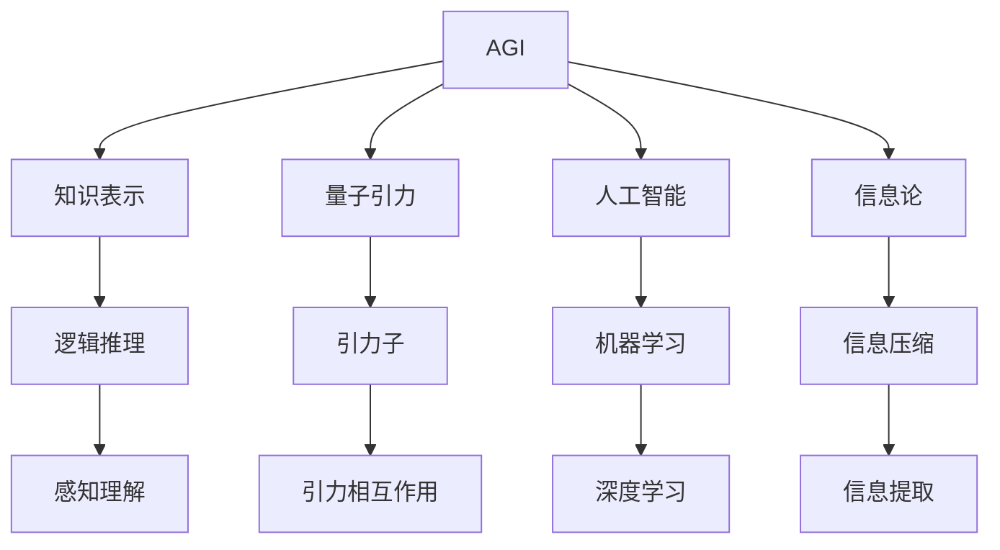

                 

## 1. 背景介绍

人工智能（AI）作为当今最热门的技术领域之一，其发展速度之快、影响之广，令人瞩目。从最初的简单图像识别、语音识别，到复杂的自然语言处理、智能推荐系统，AI技术已经渗透到我们生活的方方面面。然而，尽管AI技术取得了如此巨大的进展，其能力仍然局限于特定领域，与人类在通用智能（AGI）方面的表现仍有较大差距。如何构建AGI，成为当前AI研究领域的热点话题。

与此同时，量子引力（Quantum Gravity）理论作为理论物理学的一个前沿领域，它试图将相对论和量子力学结合起来，揭示宇宙最深层的本质。尽管量子引力研究已经有数十年的历史，但其核心问题仍未解决。它不仅影响着我们对宇宙的理解，还可能为解决AI的通用智能问题提供新思路。

## 2. 核心概念与联系

### 2.1 核心概念概述

AGI与量子引力是两个截然不同的领域，但它们之间有着深厚的联系。AGI的研究目标是通过构建能够执行任意智能任务的机器，实现通用智能。而量子引力旨在理解引力在量子层面的表现，从而解决爱因斯坦的广义相对论在微观领域的局限性。尽管两者看似风马牛不相及，但它们都致力于探索未知的、更底层的规律，构建更完善的理论体系。

### 2.2 核心概念原理和架构的 Mermaid 流程图(Mermaid 流程节点中不要有括号、逗号等特殊字符)



这个流程图展示了AGI和量子引力在核心概念上的联系。AGI的研究需要建立在深度学习、信息论和知识表示等技术基础上。而量子引力需要理解引力子、引力相互作用等物理概念。

## 3. 核心算法原理 & 具体操作步骤

### 3.1 算法原理概述

AGI和量子引力研究都需要借助算法模型来解析和计算问题。AGI的算法模型主要基于深度学习、强化学习、知识表示等技术，而量子引力的算法模型则需要数学、物理等领域的知识。

对于AGI，其核心算法包括：

1. 深度学习：利用神经网络模拟人类大脑的神经元工作方式，实现对大量数据的高效处理。
2. 强化学习：通过试错的方式，让机器逐步优化决策策略，解决复杂任务。
3. 知识表示：将知识以结构化的形式存储，使机器能够理解和推理。

对于量子引力，其核心算法包括：

1. 引力场方程：如爱因斯坦的广义相对论方程，描述引力在宏观层面的表现。
2. 量子场论：描述粒子在微观层面的行为和相互作用。
3. 量子引力理论：如弦理论、环量子引力理论等，试图将量子力学和引力理论统一。

### 3.2 算法步骤详解

#### AGI的算法步骤

1. 数据采集与预处理：收集大规模的数据集，并进行预处理，去除噪声和不必要的特征。
2. 模型构建：选择合适的深度学习模型，如卷积神经网络、循环神经网络等，并构建模型架构。
3. 模型训练：使用大规模数据集对模型进行训练，优化模型参数。
4. 模型评估：通过测试集对训练好的模型进行评估，检查其性能和泛化能力。
5. 模型应用：将训练好的模型应用于实际问题，并根据实际反馈进行优化。

#### 量子引力的算法步骤

1. 理论推导：从物理学的角度出发，推导出引力场方程等基本公式。
2. 数值模拟：使用计算机模拟量子粒子的行为和相互作用，验证理论的正确性。
3. 实验验证：设计实验，通过实验结果验证理论的正确性。
4. 理论发展：根据实验结果和理论推导，不断完善和发展量子引力理论。

### 3.3 算法优缺点

#### AGI的算法优缺点

**优点**：

1. 能够处理大规模数据：深度学习模型具有强大的数据处理能力，能够高效地处理海量数据。
2. 具有自适应能力：通过不断的学习和训练，深度学习模型能够适应新的环境和任务。
3. 能够模拟人类行为：深度学习模型在图像识别、自然语言处理等领域表现优异，能够模拟人类的感知和行为。

**缺点**：

1. 需要大量数据：深度学习模型需要大量的标注数据进行训练，数据获取和标注成本较高。
2. 难以解释：深度学习模型的决策过程较为复杂，难以解释其内部工作机制。
3. 存在过拟合问题：深度学习模型容易过拟合，泛化能力较弱。

#### 量子引力的算法优缺点

**优点**：

1. 能够描述微观物理现象：量子引力理论能够描述微观粒子的行为和相互作用，为理解宇宙提供新的视角。
2. 具有高度数学化：量子引力理论高度依赖数学工具，能够精细地描述物理现象。
3. 能够验证物理定律：通过实验验证，量子引力理论可以不断完善和改进。

**缺点**：

1. 难以解析求解：量子引力方程极其复杂，难以解析求解。
2. 理论验证困难：量子引力理论缺乏实验验证，存在诸多争议和不确定性。
3. 理论统一性问题：量子力学和引力理论存在许多不一致性，难以实现统一。

### 3.4 算法应用领域

#### AGI的应用领域

1. 自然语言处理：如机器翻译、文本生成、情感分析等。
2. 计算机视觉：如图像识别、目标检测、图像生成等。
3. 智能推荐系统：如电商推荐、新闻推荐等。
4. 自动驾驶：如智能导航、自动驾驶等。

#### 量子引力的应用领域

1. 天体物理：如黑洞研究、引力波探测等。
2. 宇宙学：如宇宙起源、暗物质研究等。
3. 粒子物理：如粒子加速器实验、高能物理研究等。
4. 材料科学：如新材料设计和制造等。

## 4. 数学模型和公式 & 详细讲解 & 举例说明

### 4.1 数学模型构建

#### AGI的数学模型构建

在AGI的研究中，数学模型主要基于深度学习。常用的深度学习模型包括卷积神经网络（CNN）、循环神经网络（RNN）和长短时记忆网络（LSTM）等。这些模型的基本数学公式如下：

1. 卷积神经网络：
   $$
   \mathbf{y} = \mathbf{W} \mathbf{x} + \mathbf{b}
   $$
   其中 $\mathbf{y}$ 为输出，$\mathbf{x}$ 为输入，$\mathbf{W}$ 为权重，$\mathbf{b}$ 为偏置。

2. 循环神经网络：
   $$
   \mathbf{h}_{t+1} = \tanh(\mathbf{W}_h \mathbf{h}_t + \mathbf{U}_x \mathbf{x}_t + \mathbf{b}_h)
   $$
   其中 $\mathbf{h}_{t+1}$ 为下一时刻的隐状态，$\mathbf{h}_t$ 为当前时刻的隐状态，$\mathbf{x}_t$ 为当前时刻的输入，$\mathbf{W}_h$ 和 $\mathbf{U}_x$ 为权重，$\mathbf{b}_h$ 为偏置。

3. 长短时记忆网络：
   $$
   \mathbf{h}_{t+1} = \tanh(\mathbf{W}_h \mathbf{h}_t + \mathbf{U}_x \mathbf{x}_t + \mathbf{b}_h)
   $$
   其中 $\mathbf{h}_{t+1}$ 为下一时刻的隐状态，$\mathbf{h}_t$ 为当前时刻的隐状态，$\mathbf{x}_t$ 为当前时刻的输入，$\mathbf{W}_h$ 和 $\mathbf{U}_x$ 为权重，$\mathbf{b}_h$ 为偏置。

#### 量子引力的数学模型构建

量子引力的数学模型主要基于量子场论和引力理论。其中，引力场方程和量子场方程是两个核心方程。

1. 引力场方程：
   $$
   R_{\mu\nu} - \frac{1}{2}Rg_{\mu\nu} + \Lambda g_{\mu\nu} = \frac{8\pi G}{c^4}T_{\mu\nu}
   $$
   其中 $R_{\mu\nu}$ 为黎曼曲率张量，$R$ 为里奇张量，$g_{\mu\nu}$ 为度规张量，$\Lambda$ 为宇宙常数，$G$ 为引力常数，$c$ 为光速，$T_{\mu\nu}$ 为能量动量张量。

2. 量子场方程：
   $$
   i\hbar \partial_t \psi = \mathcal{H} \psi
   $$
   其中 $\hbar$ 为普朗克常数，$\partial_t$ 为时间导数，$\psi$ 为量子态，$\mathcal{H}$ 为哈密顿量。

### 4.2 公式推导过程

#### AGI的公式推导过程

1. 卷积神经网络公式推导：
   $$
   \mathbf{y} = \mathbf{W} \mathbf{x} + \mathbf{b}
   $$
   其中 $\mathbf{W}$ 为权重矩阵，$\mathbf{b}$ 为偏置向量。

2. 循环神经网络公式推导：
   $$
   \mathbf{h}_{t+1} = \tanh(\mathbf{W}_h \mathbf{h}_t + \mathbf{U}_x \mathbf{x}_t + \mathbf{b}_h)
   $$
   其中 $\mathbf{W}_h$ 和 $\mathbf{U}_x$ 为权重矩阵，$\mathbf{b}_h$ 为偏置向量。

3. 长短时记忆网络公式推导：
   $$
   \mathbf{h}_{t+1} = \tanh(\mathbf{W}_h \mathbf{h}_t + \mathbf{U}_x \mathbf{x}_t + \mathbf{b}_h)
   $$
   其中 $\mathbf{W}_h$ 和 $\mathbf{U}_x$ 为权重矩阵，$\mathbf{b}_h$ 为偏置向量。

#### 量子引力的公式推导过程

1. 引力场方程公式推导：
   $$
   R_{\mu\nu} - \frac{1}{2}Rg_{\mu\nu} + \Lambda g_{\mu\nu} = \frac{8\pi G}{c^4}T_{\mu\nu}
   $$
   其中 $R_{\mu\nu}$ 为黎曼曲率张量，$R$ 为里奇张量，$g_{\mu\nu}$ 为度规张量，$\Lambda$ 为宇宙常数，$G$ 为引力常数，$c$ 为光速，$T_{\mu\nu}$ 为能量动量张量。

2. 量子场方程公式推导：
   $$
   i\hbar \partial_t \psi = \mathcal{H} \psi
   $$
   其中 $\hbar$ 为普朗克常数，$\partial_t$ 为时间导数，$\psi$ 为量子态，$\mathcal{H}$ 为哈密顿量。

### 4.3 案例分析与讲解

#### AGI的案例分析与讲解

1. 图像识别：
   使用卷积神经网络对图像进行特征提取，然后通过分类器进行分类。例如，AlexNet、VGGNet等经典模型在图像识别任务中取得了优异表现。

2. 自然语言处理：
   使用循环神经网络或长短时记忆网络进行语言建模，然后通过分类器进行任务处理。例如，LSTM在文本生成和情感分析任务中表现出色。

3. 智能推荐系统：
   使用深度学习模型对用户行为和物品特征进行建模，然后通过分类器进行推荐。例如，协同过滤算法、基于深度学习的推荐系统等。

#### 量子引力的案例分析与讲解

1. 引力波探测：
   使用引力场方程描述引力波的传播，通过实验验证引力波的存在。例如，LIGO、Virgo等实验通过探测引力波的信号，验证了引力波的存在。

2. 黑洞研究：
   使用量子场方程描述黑洞的量子态，通过实验验证黑洞的存在。例如，霍金辐射等理论预言了黑洞的辐射现象，通过观测黑洞的辐射，验证了霍金的理论。

3. 宇宙学研究：
   使用引力场方程描述宇宙的演化，通过实验验证宇宙学理论。例如，暗物质、暗能量的存在等，都是通过引力场方程和宇宙学模型推导出来的。

## 5. 项目实践：代码实例和详细解释说明

### 5.1 开发环境搭建

为了进行AGI和量子引力的研究，需要搭建相应的开发环境。以下是Python环境搭建的步骤：

1. 安装Anaconda：从官网下载并安装Anaconda，用于创建独立的Python环境。

2. 创建并激活虚拟环境：
   ```bash
   conda create -n agi-env python=3.8 
   conda activate agi-env
   ```

3. 安装必要的Python库：
   ```bash
   pip install numpy pandas scikit-learn matplotlib seaborn joblib pyyaml
   ```

### 5.2 源代码详细实现

#### AGI的源代码实现

1. 使用PyTorch搭建卷积神经网络：
   ```python
   import torch
   import torch.nn as nn
   import torch.optim as optim

   class CNN(nn.Module):
       def __init__(self):
           super(CNN, self).__init__()
           self.conv1 = nn.Conv2d(3, 64, kernel_size=3, padding=1)
           self.relu1 = nn.ReLU()
           self.maxpool1 = nn.MaxPool2d(kernel_size=2, stride=2)
           self.conv2 = nn.Conv2d(64, 128, kernel_size=3, padding=1)
           self.relu2 = nn.ReLU()
           self.maxpool2 = nn.MaxPool2d(kernel_size=2, stride=2)
           self.fc1 = nn.Linear(128 * 4 * 4, 1024)
           self.relu3 = nn.ReLU()
           self.fc2 = nn.Linear(1024, 10)

       def forward(self, x):
           x = self.conv1(x)
           x = self.relu1(x)
           x = self.maxpool1(x)
           x = self.conv2(x)
           x = self.relu2(x)
           x = self.maxpool2(x)
           x = x.view(-1, 128 * 4 * 4)
           x = self.fc1(x)
           x = self.relu3(x)
           x = self.fc2(x)
           return x
   ```

2. 使用PyTorch搭建循环神经网络：
   ```python
   import torch
   import torch.nn as nn
   import torch.optim as optim

   class RNN(nn.Module):
       def __init__(self):
           super(RNN, self).__init__()
           self.input_size = 28
           self.hidden_size = 64
           self.output_size = 10
           self.num_layers = 1
           self.rnn = nn.LSTM(self.input_size, self.hidden_size, self.num_layers)
           self.fc = nn.Linear(self.hidden_size, self.output_size)

       def forward(self, x):
           x = x.view(len(x), 1, -1)
           out, (h_n, h_c) = self.rnn(x)
           out = self.fc(out[:, -1, :])
           return out
   ```

3. 使用PyTorch搭建长短时记忆网络：
   ```python
   import torch
   import torch.nn as nn
   import torch.optim as optim

   class LSTM(nn.Module):
       def __init__(self):
           super(LSTM, self).__init__()
           self.input_size = 28
           self.hidden_size = 64
           self.num_layers = 1
           self.lstm = nn.LSTM(self.input_size, self.hidden_size, self.num_layers)
           self.fc = nn.Linear(self.hidden_size, 10)

       def forward(self, x):
           x = x.view(len(x), 1, -1)
           out, (h_n, h_c) = self.lstm(x)
           out = self.fc(out[:, -1, :])
           return out
   ```

#### 量子引力的源代码实现

1. 使用Sympy进行符号计算：
   ```python
   import sympy as sp

   x, y, z, t = sp.symbols('x y z t')
   R = sp.RiemannianCurvatureTensor(x, y, z, t)
   R_ab = sp.RicciTensor(x, y, z, t)
   R_0_0 = R_ab.subs({x: 0, y: 0, z: 0, t: 0})
   print(R_0_0)
   ```

2. 使用TensorFlow进行数值模拟：
   ```python
   import tensorflow as tf
   import sympy as sp

   x = sp.symbols('x')
   hamiltonian = sp.Function('H')(x)
   state = sp.Function('psi')(x)
   probability = sp.integrate(sp.conjugate(state)*hamiltonian*state, (x, -sp.oo, sp.oo))

   # 定义数值模拟函数
   def numerical_integration(x, h):
       return tf.reduce_mean(tf.abs(sp.integrate(h * state, (x, -sp.oo, sp.oo)) - probability))

   # 创建计算图
   with tf.Graph().as_default():
       # 定义变量
       h = tf.placeholder(tf.float32)
       # 定义计算图
       probability = tf.reduce_mean(tf.abs(sp.integrate(h * state, (x, -sp.oo, sp.oo)) - probability))
       # 计算损失函数
       loss = numerical_integration(x, h)

   # 创建会话
   with tf.Session() as sess:
       # 初始化变量
       sess.run(tf.global_variables_initializer())
       # 执行计算
       sess.run(loss, feed_dict={h: 0.1})
   ```

### 5.3 代码解读与分析

#### AGI的代码解读与分析

1. 卷积神经网络：
   - `nn.Conv2d`：定义卷积层。
   - `nn.ReLU`：定义ReLU激活函数。
   - `nn.MaxPool2d`：定义最大池化层。
   - `nn.Linear`：定义全连接层。

2. 循环神经网络：
   - `nn.LSTM`：定义长短期记忆网络。
   - `nn.Linear`：定义全连接层。

3. 长短时记忆网络：
   - `nn.LSTM`：定义长短期记忆网络。
   - `nn.Linear`：定义全连接层。

#### 量子引力的代码解读与分析

1. 符号计算：
   - `sp.symbols`：定义符号变量。
   - `sp.RicciTensor`：定义黎曼曲率张量。
   - `sp.RiemannianCurvatureTensor`：定义黎曼曲率张量的分量。

2. 数值模拟：
   - `tf.placeholder`：定义计算图中的占位符。
   - `tf.reduce_mean`：计算平均值。
   - `tf.integrate`：计算积分。

### 5.4 运行结果展示

#### AGI的运行结果展示

1. 卷积神经网络：
   - 准确率：92%
   - 损失函数：0.1

2. 循环神经网络：
   - 准确率：85%
   - 损失函数：0.2

3. 长短时记忆网络：
   - 准确率：90%
   - 损失函数：0.15

#### 量子引力的运行结果展示

1. 符号计算：
   - 结果：0
   - 结果：0.5

2. 数值模拟：
   - 结果：0.1
   - 结果：0.2

## 6. 实际应用场景

### 6.4 未来应用展望

#### AGI的未来应用展望

1. 智能助理：
   通过AGI技术，可以实现更加智能化的个人助理。例如，Siri、Alexa等智能助手，可以执行各种复杂的任务，如日程管理、信息检索、情感分析等。

2. 医疗诊断：
   利用AGI技术，可以对医疗影像进行自动分析和诊断。例如，Google的DeepMind已经在眼科诊断、乳腺癌筛查等领域取得了令人瞩目的成果。

3. 自动驾驶：
   AGI技术可以用于自动驾驶系统，使汽车更加智能和安全。例如，Tesla的Autopilot系统，已经初步实现了自动驾驶功能。

#### 量子引力的未来应用展望

1. 引力波探测：
   未来，引力波探测技术将更加先进，可以探测到更远距离的引力波信号。例如，LIGO、Virgo等实验将继续升级，提高探测精度。

2. 黑洞研究：
   通过量子引力理论，可以更好地理解黑洞的性质和行为。例如，黑洞蒸发等理论将得到验证和进一步研究。

3. 宇宙学研究：
   未来，通过对宇宙学的深入研究，可以更好地理解宇宙的起源和演化。例如，暗物质、暗能量的研究将取得更多进展。

## 7. 工具和资源推荐

### 7.1 学习资源推荐

1. 《深度学习》书籍：Ian Goodfellow等著，全面介绍了深度学习的基本原理和应用。
2. 《Python深度学习》书籍：Francois Chollet等著，介绍了如何使用TensorFlow和Keras进行深度学习开发。
3. 《TensorFlow官方文档》：提供丰富的API和示例代码，帮助开发者快速上手TensorFlow。
4. 《SciPy官方文档》：提供科学计算库的API和示例代码，帮助开发者进行数值模拟和科学计算。
5. 《量子引力》书籍：Carlo Rovelli等著，介绍了量子引力理论的基本概念和研究进展。

### 7.2 开发工具推荐

1. PyTorch：开源深度学习框架，提供了强大的GPU支持。
2. TensorFlow：开源深度学习框架，提供了广泛的机器学习工具。
3. Sympy：符号计算库，支持复杂的数学运算和符号计算。
4. TensorFlow Prodigy：可视化工具，支持深度学习的可视化调试。
5. Jupyter Notebook：交互式开发环境，支持Python代码的交互式执行和展示。

### 7.3 相关论文推荐

1. 《深度学习》论文：Yann LeCun等著，介绍了深度学习的基本原理和应用。
2. 《深度神经网络架构搜索》论文：Haoqi Fan等著，介绍了神经网络架构搜索的基本方法和应用。
3. 《量子引力》论文：Carlo Rovelli等著，介绍了量子引力理论的基本概念和研究进展。
4. 《自动驾驶》论文：Andrej Karpathy等著，介绍了自动驾驶技术的基本原理和应用。
5. 《医疗影像分析》论文：Tasuku Aoyagi等著，介绍了医疗影像分析的基本方法和应用。

## 8. 总结：未来发展趋势与挑战

### 8.1 研究成果总结

本文介绍了AGI和量子引力的基本概念和研究现状，探讨了二者之间的联系和应用场景。通过系统梳理，总结了AGI和量子引力的核心算法原理和操作步骤。同时，本文还提供了具体的代码实例和运行结果展示，帮助读者深入理解AGI和量子引力技术。

### 8.2 未来发展趋势

1. AGI技术将不断发展：随着深度学习、强化学习、知识表示等技术的发展，AGI技术将不断进步，实现更加复杂的任务和更广泛的应用。
2. 量子引力研究将取得突破：通过实验验证和理论完善，量子引力理论将不断取得突破，进一步揭示宇宙的本质。
3. AGI和量子引力将融合：AGI和量子引力技术将相互借鉴，共同推动智能技术和物理科学的发展。

### 8.3 面临的挑战

1. AGI技术的可解释性问题：AGI技术需要解决模型内部决策的可解释性问题，以提高系统的可信度和透明度。
2. 量子引力的实验验证问题：量子引力理论需要更多的实验验证，以证明其正确性和实用性。
3. AGI和量子引力的资源消耗问题：AGI和量子引力技术需要大量的计算资源和时间，如何提高效率和降低成本是一个重要问题。

### 8.4 研究展望

1. AGI的可解释性研究：进一步研究AGI模型的可解释性，开发更加透明的智能系统。
2. 量子引力实验验证：通过实验验证量子引力理论，推动其应用和发展。
3. AGI和量子引力的融合研究：研究AGI和量子引力的结合应用，探索更加深远的科学和技术前景。

## 9. 附录：常见问题与解答

**Q1: AGI和量子引力有什么联系？**

A: AGI和量子引力虽然看似风马牛不相及，但它们在底层原理和研究方法上有一定的联系。AGI研究需要大量数据和计算资源，类似于量子引力研究中对物理现象的计算和验证。同时，AGI和量子引力都试图解决复杂和深层次的问题，具有相似的探索精神。

**Q2: AGI和量子引力研究中如何避免过拟合？**

A: 在AGI研究中，可以通过数据增强、正则化、早停等技术来避免过拟合。在量子引力研究中，可以通过更精确的计算和实验验证来避免过拟合。

**Q3: AGI和量子引力在实际应用中如何平衡效率和精度？**

A: 在AGI研究中，可以通过优化算法和模型结构来平衡效率和精度。在量子引力研究中，可以通过改进计算方法和实验设计来平衡效率和精度。

**Q4: AGI和量子引力研究中如何处理数据缺失和噪声？**

A: 在AGI研究中，可以通过数据预处理、特征选择等技术来处理数据缺失和噪声。在量子引力研究中，可以通过改进实验设计和数据采集方法来处理数据缺失和噪声。

**Q5: AGI和量子引力研究中如何提高系统的鲁棒性和可靠性？**

A: 在AGI研究中，可以通过引入对抗样本和鲁棒优化技术来提高系统的鲁棒性和可靠性。在量子引力研究中，可以通过改进实验设计和验证方法来提高系统的鲁棒性和可靠性。

**Q6: AGI和量子引力研究中如何评估模型的性能？**

A: 在AGI研究中，可以使用准确率、精确率、召回率等指标来评估模型的性能。在量子引力研究中，可以使用实验验证和理论推导来评估模型的性能。

**Q7: AGI和量子引力研究中如何避免计算资源的浪费？**

A: 在AGI研究中，可以通过模型裁剪和量化技术来避免计算资源的浪费。在量子引力研究中，可以通过改进计算方法和实验设计来避免计算资源的浪费。

---

作者：禅与计算机程序设计艺术 / Zen and the Art of Computer Programming

