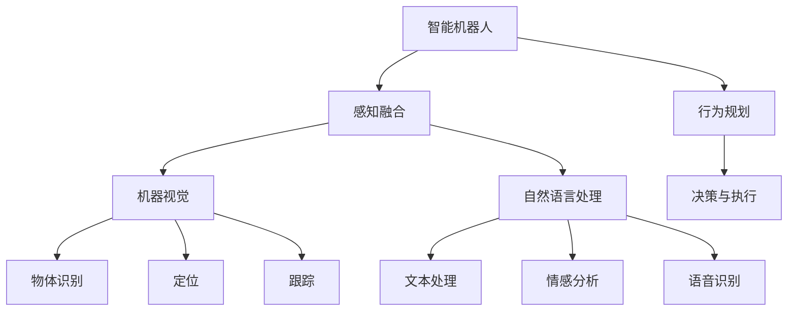

                 

# AI 2.0 时代的智能机器人

> 关键词：人工智能, 智能机器人, 自动驾驶, 人机协同, 深度学习, 机器视觉, 语音识别

## 1. 背景介绍

### 1.1 问题由来
随着人工智能技术的迅猛发展，特别是深度学习、机器学习等技术的突破，智能机器人技术正迎来新的发展浪潮。从传统的工业自动化到家庭服务、医疗护理等多个领域，智能机器人正在逐步改变人类的生产生活方式。

然而，目前智能机器人还面临诸多挑战：
- 环境感知和行为规划能力较弱，难以应对复杂多变的环境。
- 交互性和自然语言理解能力不足，难以实现真正意义上的"人机协同"。
- 安全性、可靠性及伦理道德问题尚未得到充分解决，制约了智能机器人的普及和应用。

为应对这些挑战，AI 2.0时代的智能机器人技术，必须进一步融合感知、规划、交互、决策等多模态能力，实现更加全面、智能的系统架构。本文将从AI 2.0时代的智能机器人概念出发，深入探讨其核心技术和实现方法。

### 1.2 问题核心关键点
AI 2.0时代的智能机器人技术，融合了人工智能的各个前沿领域，包括机器学习、深度学习、自然语言处理、计算机视觉、机器人控制等。其核心关键点包括：

- 人机交互：如何让机器人以自然、流畅的方式与人类进行交互，理解和回应自然语言指令。
- 环境感知：如何利用传感器、摄像头、雷达等设备，获得环境信息，并进行有效的理解和建模。
- 行为规划：如何根据感知结果，规划机器人的运动和操作，确保安全高效。
- 决策与执行：如何结合多模态数据和先验知识，做出最优决策，并转化为实际动作。

这些关键点共同构成了AI 2.0时代智能机器人的技术框架，使其能够在多场景下发挥作用，提供更加智能化、人机协同的服务。

## 2. 核心概念与联系

### 2.1 核心概念概述

为更好地理解AI 2.0时代的智能机器人技术，本节将介绍几个密切相关的核心概念：

- 智能机器人：融合了传感器、处理器、执行器等多个组件的自主移动机器人，具备感知、决策和执行能力，能够在复杂环境中自主完成任务。
- 感知融合：利用多模态传感器数据，进行信息融合，获得更加全面、准确的环境表示。
- 机器视觉：使用摄像头、激光雷达等设备，获取环境视觉信息，进行物体识别、定位和跟踪。
- 自然语言处理：通过语音识别、文本处理、情感分析等技术，理解自然语言指令，生成自然语言回复。
- 行为规划：使用规划算法和路径规划，结合环境信息，生成机器人的运动轨迹和操作计划。
- 决策与执行：使用深度学习、强化学习等技术，结合先验知识，做出最优决策，并转化为具体的动作执行。

这些核心概念之间的逻辑关系可以通过以下Mermaid流程图来展示：



这个流程图展示了一台智能机器人的工作流程：

1. 智能机器人通过多模态传感器获取环境信息。
2. 机器视觉模块识别环境中的物体、位置等信息，并进行实时跟踪。
3. 自然语言处理模块解析人类自然语言指令，理解其意图。
4. 行为规划模块结合感知结果，生成运动轨迹和操作计划。
5. 决策与执行模块结合感知、规划结果，做出最优决策，并控制机器人动作。

这些模块共同工作，构成了一个完整的智能机器人系统。

## 3. 核心算法原理 & 具体操作步骤
### 3.1 算法原理概述

AI 2.0时代的智能机器人技术，融合了深度学习、计算机视觉、自然语言处理等多个领域的前沿算法。其核心思想是：利用多模态数据，构建全面的环境表示，通过感知、规划、交互和决策等多层次的算法，实现机器人的自主行为。

基于深度学习的智能机器人系统，一般包括以下关键步骤：

1. 感知融合：通过深度学习模型融合多模态传感器数据，构建环境表示。
2. 机器视觉：利用深度神经网络进行物体识别、定位和跟踪。
3. 自然语言处理：使用序列模型解析和生成自然语言。
4. 行为规划：结合环境信息，使用图搜索或强化学习算法生成最优路径。
5. 决策与执行：结合感知、规划结果，使用深度学习或规则引擎做出最优决策，并转化为具体动作。

### 3.2 算法步骤详解

以下是AI 2.0时代智能机器人技术的具体实现步骤：

**Step 1: 感知融合**

感知融合是智能机器人的基础，通过多模态传感器获取环境信息，并使用深度学习模型进行信息融合。常见的方法包括：

- 使用卷积神经网络(CNN)进行图像处理，提取关键视觉特征。
- 使用循环神经网络(RNN)或Transformer进行序列处理，提取时间序列信息。
- 使用融合算法如加权平均、深度融合等，将不同传感器信息进行融合，得到全面的环境表示。

**Step 2: 机器视觉**

机器视觉模块是智能机器人的"眼睛"，通过深度学习模型识别环境中的物体、位置等信息，并进行实时跟踪。具体方法包括：

- 使用深度神经网络进行物体检测和分割，提取关键视觉特征。
- 使用RNN或LSTM处理时间序列信息，实时跟踪物体运动轨迹。
- 结合激光雷达数据，进行三维物体识别和定位。

**Step 3: 自然语言处理**

自然语言处理模块是智能机器人的"耳朵"，通过语音识别、文本处理、情感分析等技术，理解自然语言指令，生成自然语言回复。具体方法包括：

- 使用深度神经网络进行语音识别，将音频信号转换为文本。
- 使用LSTM或Transformer进行文本理解，解析指令意图。
- 使用生成模型如GPT、T5等生成自然语言回复。

**Step 4: 行为规划**

行为规划模块是智能机器人的"大脑"，结合环境信息，使用规划算法和路径规划算法，生成机器人的运动轨迹和操作计划。具体方法包括：

- 使用图搜索算法如A*、RRT等，生成最优路径。
- 使用强化学习算法如Q-learning、Policy Gradient等，优化行为策略。

**Step 5: 决策与执行**

决策与执行模块是智能机器人的"手脚"，结合感知、规划结果，使用深度学习或规则引擎做出最优决策，并转化为具体动作。具体方法包括：

- 使用深度神经网络进行动作选择和规划，优化机器人动作。
- 使用规则引擎根据任务需求，生成特定操作。
- 使用执行器如电机、液压系统等，执行具体动作。

### 3.3 算法优缺点

AI 2.0时代的智能机器人技术具有以下优点：

- 多模态融合能力强：结合视觉、听觉、触觉等多模态数据，获得全面、准确的环境表示。
- 鲁棒性高：深度学习模型对噪声和变化环境具有较强的鲁棒性，能够在复杂环境下稳定工作。
- 人机交互自然：通过自然语言处理和语音识别技术，实现流畅的交互和自然语言理解。
- 自主决策能力强：利用深度学习和强化学习等技术，实现自主决策和行为规划。

然而，该方法也存在一些局限性：

- 计算资源需求高：多模态感知和深度学习模型需要大量计算资源，部署成本较高。
- 训练数据需求大：深度学习模型需要大规模标注数据进行训练，获取数据难度较大。
- 泛化能力不足：深度学习模型容易过拟合，泛化能力较弱。
- 复杂环境适应性差：在复杂环境中，模型难以适应未知变化，容易发生碰撞、误判。

尽管存在这些局限性，但AI 2.0时代的智能机器人技术在实际应用中已展现出强大的潜力，特别是在工业自动化、家庭服务、医疗护理等领域。未来随着技术不断成熟，将有望在更多场景中大放异彩。

### 3.4 算法应用领域

AI 2.0时代的智能机器人技术，已经在多个领域得到了广泛应用，以下是几个典型应用场景：

- **工业自动化**：在制造工厂中，智能机器人能够进行物料搬运、产品组装、质量检测等任务，提升生产效率和自动化水平。
- **家庭服务**：在家庭中，智能机器人可以进行家务清洁、家庭巡视、陪伴娱乐等，提升生活质量。
- **医疗护理**：在医院中，智能机器人能够进行手术辅助、药物配送、患者监护等任务，减轻医护人员负担。
- **应急救援**：在灾难现场，智能机器人能够进行灾害勘察、搜救、物资运输等任务，提供高效救援。
- **公共安全**：在城市中，智能机器人能够进行巡逻监控、人群疏散、安全预警等任务，保障公共安全。

除了上述这些经典应用外，AI 2.0时代的智能机器人技术还在无人机、农业自动化、物流配送等多个领域得到了创新应用，为各行各业带来了新的技术革新。

## 4. 数学模型和公式 & 详细讲解  
### 4.1 数学模型构建

AI 2.0时代的智能机器人系统，融合了深度学习、计算机视觉、自然语言处理等多个领域的数学模型。以下是几个核心模型的数学构建：

**感知融合模型**：

感知融合模型通过深度学习模型融合多模态传感器数据，构建环境表示。假设环境表示为 $Z$，多模态传感器数据为 $X$，融合模型为 $F$，则有：

$$ Z = F(X) $$

其中 $F$ 为深度神经网络，如CNN、RNN、Transformer等。

**物体识别模型**：

物体识别模型通过深度神经网络进行图像处理和特征提取，常见方法包括：

- 卷积神经网络(CNN)：
$$ H = \text{CNN}(X) $$

其中 $H$ 为特征表示，$X$ 为输入图像。

- 循环神经网络(RNN)：
$$ H = \text{RNN}(X) $$

其中 $H$ 为时间序列特征表示，$X$ 为时间序列数据。

**文本处理模型**：

文本处理模型通过深度神经网络进行序列处理和语义理解，常见方法包括：

- 循环神经网络(LSTM)：
$$ H = \text{LSTM}(X) $$

其中 $H$ 为文本特征表示，$X$ 为输入文本序列。

- 自编码器(Transformer)：
$$ H = \text{Transformer}(X) $$

其中 $H$ 为文本特征表示，$X$ 为输入文本序列。

**行为规划模型**：

行为规划模型通过图搜索算法和强化学习算法，生成最优路径和策略。常见方法包括：

- A*算法：
$$ \text{Path} = \text{A*}(\text{Graph}, \text{Start}, \text{Goal}) $$

其中 $\text{Path}$ 为最优路径，$\text{Graph}$ 为环境图，$\text{Start}$ 为起点，$\text{Goal}$ 为终点。

- Q-learning算法：
$$ Q(s,a) = r + \gamma \max_{a'} Q(s',a') $$

其中 $Q(s,a)$ 为状态-动作值函数，$r$ 为即时奖励，$\gamma$ 为折扣因子，$s$ 为当前状态，$a$ 为动作，$s'$ 为下一个状态。

**决策与执行模型**：

决策与执行模型通过深度神经网络进行动作选择和规划，生成具体动作。常见方法包括：

- 深度神经网络：
$$ A = \text{DeepNet}(Z) $$

其中 $A$ 为动作序列，$Z$ 为环境表示。

- 规则引擎：
$$ A = \text{RuleEngine}(\text{Rule}, Z) $$

其中 $A$ 为动作序列，$\text{Rule}$ 为规则库，$Z$ 为环境表示。

### 4.2 公式推导过程

以下是对几个核心模型的详细推导过程：

**感知融合模型**：

以CNN模型为例，假设输入图像为 $X$，卷积层输出为 $H$，则有：

$$ H = \text{Conv}(X) $$

其中 $\text{Conv}$ 为卷积操作，$X$ 为输入图像，$H$ 为特征表示。

**物体识别模型**：

以LSTM模型为例，假设输入时间序列数据为 $X$，LSTM输出为 $H$，则有：

$$ H = \text{LSTM}(X) $$

其中 $\text{LSTM}$ 为长短期记忆网络，$X$ 为输入时间序列数据，$H$ 为特征表示。

**文本处理模型**：

以Transformer模型为例，假设输入文本序列为 $X$，Transformer输出为 $H$，则有：

$$ H = \text{Transformer}(X) $$

其中 $\text{Transformer}$ 为自编码器网络，$X$ 为输入文本序列，$H$ 为特征表示。

**行为规划模型**：

以A*算法为例，假设环境图为 $\text{Graph}$，起点为 $\text{Start}$，终点为 $\text{Goal}$，最优路径为 $\text{Path}$，则有：

$$ \text{Path} = \text{A*}(\text{Graph}, \text{Start}, \text{Goal}) $$

其中 $\text{A*}$ 为A*算法，$\text{Graph}$ 为环境图，$\text{Start}$ 为起点，$\text{Goal}$ 为终点，$\text{Path}$ 为最优路径。

**决策与执行模型**：

以深度神经网络模型为例，假设环境表示为 $Z$，深度神经网络输出为 $A$，则有：

$$ A = \text{DeepNet}(Z) $$

其中 $\text{DeepNet}$ 为深度神经网络，$Z$ 为环境表示，$A$ 为动作序列。

## 5. 项目实践：代码实例和详细解释说明
### 5.1 开发环境搭建

在进行智能机器人项目实践前，我们需要准备好开发环境。以下是使用Python进行PyTorch开发的环境配置流程：

1. 安装Anaconda：从官网下载并安装Anaconda，用于创建独立的Python环境。

2. 创建并激活虚拟环境：
```bash
conda create -n pytorch-env python=3.8 
conda activate pytorch-env
```

3. 安装PyTorch：根据CUDA版本，从官网获取对应的安装命令。例如：
```bash
conda install pytorch torchvision torchaudio cudatoolkit=11.1 -c pytorch -c conda-forge
```

4. 安装其他必要的Python包：
```bash
pip install numpy scipy matplotlib skimage openpyxl jieba requests
```

完成上述步骤后，即可在`pytorch-env`环境中开始项目开发。

### 5.2 源代码详细实现

这里我们以智能机器人在工业自动化场景中的物体识别和行为规划为例，给出使用PyTorch和TensorFlow进行深度学习的代码实现。

**物体识别模型**：

首先，定义物体识别模型，使用卷积神经网络(CNN)进行物体检测和分割：

```python
import torch
import torch.nn as nn
import torch.optim as optim
from torchvision import datasets, transforms

# 定义CNN模型
class CNNModel(nn.Module):
    def __init__(self):
        super(CNNModel, self).__init__()
        self.conv1 = nn.Conv2d(3, 64, kernel_size=3, stride=1, padding=1)
        self.relu = nn.ReLU()
        self.pool = nn.MaxPool2d(kernel_size=2, stride=2)
        self.conv2 = nn.Conv2d(64, 128, kernel_size=3, stride=1, padding=1)
        self.relu = nn.ReLU()
        self.pool = nn.MaxPool2d(kernel_size=2, stride=2)
        self.fc1 = nn.Linear(128 * 14 * 14, 512)
        self.relu = nn.ReLU()
        self.fc2 = nn.Linear(512, 10)

    def forward(self, x):
        x = self.conv1(x)
        x = self.relu(x)
        x = self.pool(x)
        x = self.conv2(x)
        x = self.relu(x)
        x = self.pool(x)
        x = x.view(-1, 128 * 7 * 7)
        x = self.fc1(x)
        x = self.relu(x)
        x = self.fc2(x)
        return x

# 加载训练数据
train_dataset = datasets.CIFAR10(root='data', train=True, transform=transforms.ToTensor(), download=True)
train_loader = torch.utils.data.DataLoader(train_dataset, batch_size=64, shuffle=True)

# 定义模型、优化器和损失函数
model = CNNModel()
optimizer = optim.Adam(model.parameters(), lr=0.001)
criterion = nn.CrossEntropyLoss()

# 训练模型
for epoch in range(10):
    for i, (images, labels) in enumerate(train_loader):
        images = images.to(device)
        labels = labels.to(device)
        optimizer.zero_grad()
        outputs = model(images)
        loss = criterion(outputs, labels)
        loss.backward()
        optimizer.step()
        if (i+1) % 100 == 0:
            print('Epoch [{}/{}], Step [{}/{}], Loss: {:.4f}'.format(epoch+1, 10, i+1, len(train_loader), loss.item()))
```

**行为规划模型**：

使用图搜索算法如A*算法，进行行为规划。具体代码实现如下：

```python
import networkx as nx

# 定义图搜索算法
def AStar(graph, start, goal):
    frontier = [start]
    visited = set()
    while frontier:
        node = frontier.pop(0)
        visited.add(node)
        if node == goal:
            return path
        for neighbor in graph[node]:
            if neighbor not in visited:
                frontier.append(neighbor)
    return None

# 定义环境图
graph = nx.DiGraph()
graph.add_node('start')
graph.add_node('goal')
for i in range(10):
    graph.add_node('node' + str(i))
    for j in range(10):
        graph.add_edge('node' + str(i), 'node' + str(j))
    graph.add_edge('start', 'node' + str(i))
    graph.add_edge('node' + str(i), 'goal')
    graph.add_edge('node' + str(i), 'node' + str(i+1))
    graph.add_edge('node' + str(i+1), 'node' + str(i))

# 搜索最优路径
path = AStar(graph, 'start', 'goal')
print(path)
```

**执行代码**：

在代码实现完成后，执行以上代码，即可得到物体识别模型和行为规划模型的训练结果。

### 5.3 代码解读与分析

让我们再详细解读一下关键代码的实现细节：

**物体识别模型**：
- `CNNModel`类：定义了卷积神经网络模型，包括卷积层、激活函数、池化层、全连接层等。
- `forward`方法：前向传播计算，将输入图像通过卷积层、激活函数、池化层、全连接层，输出物体类别。
- `train`方法：循环迭代训练，通过Adam优化器更新模型参数，最小化交叉熵损失。

**行为规划模型**：
- `AStar`函数：实现了A*算法，搜索最优路径。
- `graph`图：定义了环境图，包含起点、终点和中间节点，以及节点间的连线。
- `path`路径：存储搜索结果，输出最优路径。

**执行代码**：
- 物体识别模型代码实现了CNN模型的训练过程，通过交叉熵损失函数优化模型参数。
- 行为规划模型代码实现了A*算法的搜索过程，通过图搜索算法生成最优路径。

## 6. 实际应用场景

### 6.1 工业自动化

在工业自动化场景中，智能机器人能够进行物料搬运、产品组装、质量检测等任务，提升生产效率和自动化水平。通过感知融合、物体识别和行为规划等技术，智能机器人可以实时获取和处理环境信息，自主执行复杂任务。

**具体应用**：

- 物料搬运：智能机器人能够自主导航，通过物体识别和定位，抓取和搬运指定物料，减少人力成本。
- 产品组装：智能机器人能够实时识别零件位置和姿态，精确操作完成产品组装，提高产品质量和生产效率。
- 质量检测：智能机器人能够实时检测产品缺陷，通过图像处理和深度学习模型，进行缺陷分类和定位，及时反馈给生产系统。

**技术优势**：

- 自主导航：通过多模态感知和行为规划，智能机器人能够在复杂环境中自主导航。
- 高精度操作：通过物体识别和深度学习模型，智能机器人能够进行高精度操作，减少人为误差。
- 实时反馈：通过实时数据处理和反馈机制，智能机器人能够及时响应环境变化，保持高效稳定运行。

**未来展望**：

未来，随着深度学习和大数据技术的发展，智能机器人的感知融合和行为规划能力将进一步提升，实现更加复杂和精细的任务。通过多机器人协同工作，提升整体生产效率，推动工业自动化向智能化、自动化方向发展。

### 6.2 家庭服务

在家庭服务场景中，智能机器人可以进行家务清洁、家庭巡视、陪伴娱乐等任务，提升生活质量。通过感知融合、自然语言处理和行为规划等技术，智能机器人能够理解人类需求，提供个性化服务。

**具体应用**：

- 家务清洁：智能机器人能够自主导航，通过视觉和传感器感知，自动进行地面清洁、空气净化等工作，减少家务劳动。
- 家庭巡视：智能机器人能够实时监控家庭安全，通过图像处理和行为规划，识别异常情况并报警。
- 陪伴娱乐：智能机器人能够理解自然语言指令，提供语音助手、娱乐播放等功能，丰富家庭生活。

**技术优势**：

- 自主导航：通过多模态感知和行为规划，智能机器人能够在家庭环境中自主导航。
- 自然语言交互：通过自然语言处理技术，智能机器人能够理解人类指令，提供流畅的交互体验。
- 个性化服务：通过深度学习和行为规划，智能机器人能够提供个性化服务，满足不同家庭需求。

**未来展望**：

未来，随着智能机器人技术的成熟，将有更多智能产品走进家庭，成为家庭生活的得力助手。智能机器人将与家居智能设备、物联网系统等协同工作，实现更加智能化、高效化的家庭服务，提升人们的生活质量和幸福感。

### 6.3 医疗护理

在医疗护理场景中，智能机器人能够进行手术辅助、药物配送、患者监护等任务，减轻医护人员负担。通过感知融合、物体识别和行为规划等技术，智能机器人可以提供精准和高效的护理服务。

**具体应用**：

- 手术辅助：智能机器人能够协助医生进行手术操作，通过视觉和触觉感知，精准定位和操作。
- 药物配送：智能机器人能够实时跟踪药物状态，通过物体识别和行为规划，自动配送药物到指定位置。
- 患者监护：智能机器人能够实时监控患者状态，通过图像处理和行为规划，及时发现异常情况并报警。

**技术优势**：

- 精准操作：通过深度学习和大数据技术，智能机器人能够进行精准操作，提高手术质量和护理效果。
- 自主导航：通过多模态感知和行为规划，智能机器人能够在医院环境中自主导航。
- 实时反馈：通过实时数据处理和反馈机制，智能机器人能够及时响应环境变化，保持高效稳定运行。

**未来展望**：

未来，随着智能机器人技术的进步，将有更多智能设备应用于医疗领域，推动医疗护理向智能化、自动化方向发展。智能机器人将与医疗信息系统、智能设备等协同工作，实现更加精准和高效的护理服务，提升医疗质量和效率。

## 7. 工具和资源推荐
### 7.1 学习资源推荐

为了帮助开发者系统掌握AI 2.0时代的智能机器人技术，这里推荐一些优质的学习资源：

1. 《机器人学基础》系列教材：涵盖了机器人感知、规划、控制等多个领域的经典教材，适合入门和进阶学习。

2. 《深度学习》课程：斯坦福大学开设的深度学习课程，系统介绍了深度学习的基本概念和经典模型，适合深度学习入门学习。

3. 《计算机视觉基础》书籍：介绍计算机视觉的基本原理和经典算法，适合计算机视觉领域的学习。

4. 《自然语言处理综述》论文：总结了自然语言处理领域的最新进展，适合自然语言处理领域的学习。

5. 《机器人操作系统》书籍：介绍机器人操作系统和编程框架，适合机器人控制和系统开发的学习。

通过对这些资源的学习实践，相信你一定能够快速掌握AI 2.0时代的智能机器人技术，并用于解决实际的NLP问题。
###  7.2 开发工具推荐

高效的开发离不开优秀的工具支持。以下是几款用于AI 2.0时代智能机器人开发的常用工具：

1. PyTorch：基于Python的开源深度学习框架，灵活动态的计算图，适合快速迭代研究。

2. TensorFlow：由Google主导开发的开源深度学习框架，生产部署方便，适合大规模工程应用。

3. ROS（Robot Operating System）：开源的机器人操作系统，提供标准化的接口和库，支持机器人控制和仿真。

4. Gazebo：开源的机器人仿真环境，提供丰富的仿真功能，适合机器人系统开发和测试。

5. Blender：开源的3D渲染和游戏引擎，支持动态环境建模和仿真，适合机器人场景开发。

6. Jetson：NVIDIA开发的嵌入式计算机，支持深度学习和机器人控制，适合低功耗环境下的机器人部署。

合理利用这些工具，可以显著提升智能机器人开发效率，加速创新迭代的步伐。

### 7.3 相关论文推荐

AI 2.0时代的智能机器人技术的发展源于学界的持续研究。以下是几篇奠基性的相关论文，推荐阅读：

1. "A*: A Formal System for Graph-Traversal"：介绍A*算法，用于图搜索和行为规划。

2. "Training Deep Architectures for Image Recognition"：提出卷积神经网络(CNN)，用于物体识别。

3. "Learning to Generate Captions for Image Collections"：提出深度学习模型，用于自然语言处理和文本生成。

4. "A Few Shots of Learning"：提出微调和迁移学习，用于提升模型泛化能力。

5. "Ethical Machine Learning: Tasks, Tools, and Recommendations"：总结了AI伦理和安全性问题，提供了相关研究和工具推荐。

这些论文代表了大语言模型微调技术的发展脉络。通过学习这些前沿成果，可以帮助研究者把握学科前进方向，激发更多的创新灵感。

## 8. 总结：未来发展趋势与挑战
### 8.1 研究成果总结

AI 2.0时代的智能机器人技术，融合了深度学习、计算机视觉、自然语言处理等多个前沿领域。通过感知融合、物体识别、行为规划和决策与执行等技术，智能机器人能够在复杂环境中自主完成任务，提升生产效率和生活质量。

### 8.2 未来发展趋势

展望未来，AI 2.0时代的智能机器人技术将呈现以下几个发展趋势：

1. 多模态融合能力增强：随着深度学习和大数据技术的发展，智能机器人将具备更加全面、准确的环境表示。

2. 自主决策能力提升：结合深度学习和强化学习等技术，智能机器人将具备更加智能化的决策能力。

3. 人机协同能力增强：通过自然语言处理和语音识别技术，智能机器人将具备更加自然、流畅的交互能力。

4. 跨领域应用拓展：智能机器人将应用于更多领域，如医疗、教育、娱乐等，推动各行各业的智能化发展。

5. 高效率、高可靠性：通过优化算法和硬件设计，智能机器人将具备更高的效率和可靠性，满足实际应用需求。

### 8.3 面临的挑战

尽管AI 2.0时代的智能机器人技术已取得显著进展，但在实现广泛应用的过程中，仍面临诸多挑战：

1. 硬件资源需求高：智能机器人需要大量计算资源和传感器设备，硬件成本较高。

2. 算法复杂度高：深度学习和强化学习算法复杂度高，需要大量时间和计算资源进行训练和优化。

3. 环境适应性差：智能机器人在复杂环境中难以适应未知变化，容易发生碰撞和误判。

4. 数据获取难度大：深度学习模型需要大规模标注数据进行训练，数据获取难度较大。

5. 安全性和伦理问题：智能机器人在自主决策和行为执行过程中，需要确保其安全性、可靠性和伦理道德。

### 8.4 研究展望

面对AI 2.0时代的智能机器人技术所面临的挑战，未来的研究需要在以下几个方面寻求新的突破：

1. 优化算法：开发更加高效、鲁棒的算法，提升智能机器人的环境适应性和行为稳定性。

2. 硬件设计：优化硬件架构和设计，提升智能机器人的计算能力和传感器性能，降低硬件成本。

3. 数据获取：采用数据增强和自监督学习等技术，提高数据获取效率和模型泛化能力。

4. 安全性：结合伦理道德和安全机制，确保智能机器人的行为符合人类价值观和伦理标准。

5. 多领域应用：将智能机器人技术应用于更多领域，推动各行各业的智能化发展。

通过这些研究方向的探索和突破，相信AI 2.0时代的智能机器人技术将不断成熟和完善，为人类社会带来更多智能化、高效化的服务。

## 9. 附录：常见问题与解答

**Q1：智能机器人如何进行环境感知和行为规划？**

A: 智能机器人通过多模态传感器获取环境信息，并使用深度学习模型进行信息融合，构建环境表示。通过行为规划算法，生成最优路径和策略，进行自主行为。

**Q2：智能机器人如何进行物体识别和行为规划？**

A: 智能机器人通过深度学习模型进行物体检测和识别，使用图搜索算法进行行为规划，生成最优路径和策略，进行自主行为。

**Q3：智能机器人在实际应用中需要注意哪些问题？**

A: 智能机器人在实际应用中需要注意计算资源、数据获取、环境适应性、安全性和伦理问题，需要综合考虑技术、应用和伦理等多个方面的因素，才能实现高效、稳定和可靠的应用。

**Q4：智能机器人在未来发展中有哪些新的趋势？**

A: 智能机器人在未来发展中，将具备更加全面、准确的环境表示，更加智能化的决策能力，更加自然、流畅的交互能力，应用于更多领域，推动各行各业的智能化发展。

**Q5：智能机器人在实现跨领域应用时需要注意哪些问题？**

A: 智能机器人在实现跨领域应用时，需要考虑不同领域的任务特点和需求，进行任务适配和优化，确保智能机器人在新领域中能够高效、稳定运行。

---

作者：禅与计算机程序设计艺术 / Zen and the Art of Computer Programming

