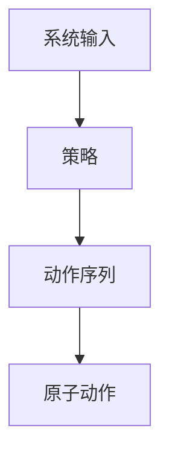

                 

# AI Agent 如何将系统输入转化为可执行的原子动作序列，以实现最终目标

## 1. 背景介绍

在当今数字化时代，智能代理(AI Agent)已成为各类自动化系统不可或缺的核心组成部分。它们能够接收系统输入，并在此基础上执行一系列策略，最终达成特定的目标。无论是智能客服、自动驾驶，还是智能投资、医疗决策，AI Agent 都扮演着举足轻重的角色。为了实现这些系统的高效运行，AI Agent 必须能够精准地将输入数据转化为可执行的原子动作序列，这一过程不仅决定了系统的响应速度，也决定了其决策的精准度。本文旨在深入探讨这一核心技术，并提出一些前沿的研究方向和实践建议。

## 2. 核心概念与联系

### 2.1 核心概念概述

在探讨AI Agent如何将系统输入转化为原子动作序列之前，我们先要明确几个核心概念：

- **系统输入**：可以是用户请求、环境感知结果、历史数据等，是AI Agent决策的基础。
- **原子动作**：指在特定情境下，AI Agent能够执行的最基本、不可再分的操作。
- **动作序列**：由一系列原子动作组成的执行计划，用于实现最终目标。
- **强化学习(RL)**：一种机器学习方法，通过在环境中不断尝试并接收奖励来优化动作序列。
- **策略**：指导AI Agent选择动作序列的规则或算法。

这些概念之间的逻辑关系可以通过以下Mermaid流程图来展示：



此流程图表明，AI Agent 通过策略处理系统输入，生成动作序列，最终执行一系列原子动作以达到目标。

## 3. 核心算法原理 & 具体操作步骤

### 3.1 算法原理概述

AI Agent 通过学习系统输入和动作序列之间的映射关系，实现从输入到动作的转换。这一过程可以归结为强化学习（Reinforcement Learning, RL）问题，即在特定环境中，通过不断试错，找到最优的动作序列，最大化累计奖励。

形式化地，假设系统输入空间为 $S$，动作空间为 $A$，目标函数为 $R$，则优化目标可以表示为：

$$
\max_{\pi} \mathbb{E}_{s \sim P, a \sim \pi}[R(s, a)]
$$

其中 $\pi$ 表示策略函数，$P$ 表示系统输入的分布，$\max$ 操作表示在所有策略中寻找最优解，$\mathbb{E}$ 表示期望。

### 3.2 算法步骤详解

基于强化学习的AI Agent 转化系统输入到动作序列的过程可以分解为以下几个步骤：

**Step 1: 构建环境**
- 定义环境（Environment），包括系统输入的生成机制、奖励函数的设定等。
- 创建环境类，用于模拟环境的状态转换和奖励计算。

**Step 2: 设计策略**
- 选择合适的策略方法，如Q-Learning、SARSA、策略梯度等。
- 根据具体任务，设计策略函数，指导AI Agent选择动作。

**Step 3: 初始化模型**
- 使用预训练的模型或随机初始化模型参数，作为策略函数 $\pi$ 的初始值。
- 设定学习率、折扣因子等关键超参数。

**Step 4: 执行学习**
- 使用循环或迭代的方式，在每一轮中，从环境随机抽取一个状态 $s$。
- 根据当前状态 $s$，使用策略函数 $\pi$ 选择动作 $a$。
- 执行动作 $a$，观察环境变化，获得下一状态 $s'$ 和奖励 $r$。
- 更新策略函数 $\pi$ 的参数，以最大化期望累积奖励。

**Step 5: 测试与部署**
- 在测试集上评估学习后的策略函数性能。
- 将最优策略函数应用到实际系统中，实现系统输入到原子动作序列的转化。

### 3.3 算法优缺点

强化学习策略在将系统输入转化为动作序列方面具有以下优点：
1. 能处理复杂的非结构化数据，无需手动特征提取。
2. 适应性强，可以通过试错不断优化动作选择。
3. 理论上可以收敛到最优策略。

同时，也存在一些局限性：
1. 学习过程可能存在较大的随机性，收敛速度较慢。
2. 需要大量训练数据和计算资源。
3. 缺乏可解释性，难以理解AI Agent的决策过程。

### 3.4 算法应用领域

强化学习在AI Agent决策和行为生成中得到广泛应用，涉及的领域包括但不限于：

- **自动驾驶**：通过与环境的交互，学习最优的驾驶策略，确保行车安全。
- **机器人控制**：使机器人能够自主导航、抓取物体，完成复杂的作业任务。
- **金融投资**：通过学习市场交易策略，优化投资组合，提升投资回报率。
- **医疗诊断**：结合病人的历史数据和当前症状，推荐最佳治疗方案。
- **智能客服**：根据用户查询，提供最合适的回答和操作流程。
- **游戏AI**：训练AI Agent在游戏中击败人类玩家，优化游戏策略。

这些领域的应用展示了强化学习在AI Agent决策和行为生成中的强大潜力。

## 4. 数学模型和公式 & 详细讲解 & 举例说明

### 4.1 数学模型构建

在强化学习中，我们通常将系统输入和动作序列表示为如下数学模型：

- 状态空间 $S$：系统可能的状态集合，可以是连续空间或离散空间。
- 动作空间 $A$：系统可执行的动作集合。
- 策略函数 $\pi$：从状态到动作的映射函数。
- 状态转移概率 $P$：给定当前状态和动作，下一个状态的概率分布。
- 奖励函数 $R$：对动作的即时奖励，可以是固定值或函数。

### 4.2 公式推导过程

以Q-Learning算法为例，推导其核心公式。

假设当前状态为 $s$，选择动作 $a$ 后，下一状态为 $s'$，奖励为 $r$，则Q-Learning的更新公式为：

$$
Q(s,a) \leftarrow Q(s,a) + \alpha [r + \gamma \max_{a'} Q(s',a') - Q(s,a)]
$$

其中 $\alpha$ 为学习率，$\gamma$ 为折扣因子。

在每一轮中，AI Agent 从当前状态 $s$ 出发，选择动作 $a$，观察下一状态 $s'$ 和奖励 $r$，使用上述公式更新Q值，直至收敛到最优策略。

### 4.3 案例分析与讲解

假设我们有一家电商平台的推荐系统，目标是根据用户的历史购买行为和浏览记录，推荐最相关的商品。我们可以将用户行为表示为系统输入，商品推荐作为动作，利用强化学习模型，优化推荐策略。具体步骤如下：

1. **环境构建**：将用户的历史行为和商品信息构建成状态空间，将推荐商品作为动作空间。
2. **策略设计**：使用Q-Learning算法，根据用户行为和商品点击率，更新推荐策略。
3. **模型初始化**：使用随机初始化的策略函数，设定学习率为0.1。
4. **执行学习**：在每一轮中，随机抽取用户行为作为状态 $s$，根据当前策略选择推荐商品 $a$，观察用户是否点击，更新Q值。
5. **测试与部署**：在测试集上评估推荐策略的效果，调整超参数，最终部署到推荐系统中。

## 5. 项目实践：代码实例和详细解释说明

### 5.1 开发环境搭建

在开始具体的代码实现之前，我们需要确保开发环境能够支持强化学习的库和工具。以下是使用Python进行开发的环境配置流程：

1. 安装Anaconda：从官网下载并安装Anaconda，用于创建独立的Python环境。

2. 创建并激活虚拟环境：
```bash
conda create -n reinforcement-env python=3.8 
conda activate reinforcement-env
```

3. 安装必要的库：
```bash
conda install numpy scipy matplotlib pydot torch tensorboard
pip install gym stable-baselines
```

4. 安装stable-baselines库：这是一个流行的强化学习库，包含多种预训练模型和算法。

完成上述步骤后，即可在`reinforcement-env`环境中开始强化学习的开发实践。

### 5.2 源代码详细实现

以下是一个简单的强化学习示例，展示如何使用稳定基线（Stable Baselines）库实现一个基于Q-Learning的推荐系统：

```python
from stable_baselines3 import DQN
from stable_baselines3.common.vec_env import DummyVecEnv
from stable_baselines3.common.env_util import make_vec_env

# 定义推荐系统环境
class RecommendationEnv(DummyVecEnv):
    def __init__(self, user_hists, item_feats):
        super().__init__(n=1)
        self.user_hists = user_hists
        self.item_feats = item_feats
        self.reset()

    def reset(self):
        self.user_index = np.random.randint(len(self.user_hists))
        self.item_index = np.random.randint(len(self.item_feats))
        obs = [self.user_hists[self.user_index], self.item_feats[self.item_index]]
        return obs

    def step(self, action):
        if action == 0:  # 选择当前商品
            obs = [self.user_hists[self.user_index], self.item_feats[self.item_index]]
        else:  # 选择其他商品
            new_item_index = (self.item_index + action) % len(self.item_feats)
            obs = [self.user_hists[self.user_index], self.item_feats[new_item_index]]
        reward = 0.1 if action == 0 else -0.1
        done = False
        info = {}
        return obs, reward, done, info

# 准备数据
user_hists = ['item1', 'item2', 'item3', 'item4']
item_feats = ['item1', 'item2', 'item3', 'item4']

env = RecommendationEnv(user_hists, item_feats)

# 初始化模型
model = DQN.load('dqn-agent', target_update_interval=30, verbose=0)

# 执行学习
for i in range(1000):
    obs = env.reset()
    done = False
    while not done:
        action, _ = model.predict(obs)
        obs, reward, done, info = env.step(action)
        model.learn(obs, reward)
    model.save('best-agent')

# 测试模型
obs = env.reset()
done = False
while not done:
    action, _ = model.predict(obs)
    obs, reward, done, info = env.step(action)
    print('Reward:', reward)

# 部署模型
# 将best-agent模型集成到推荐系统中，进行实际推荐
```

在上述代码中，我们定义了一个推荐系统环境，使用DQN模型进行Q-Learning训练，并测试训练后的模型。

### 5.3 代码解读与分析

让我们再详细解读一下关键代码的实现细节：

**RecommendationEnv类**：
- `__init__`方法：初始化用户行为和商品特征。
- `reset`方法：随机初始化用户和商品，返回当前状态。
- `step`方法：根据动作更新状态和奖励，返回下一状态和奖励。

**数据准备**：
- `user_hists`和`item_feats`分别表示用户历史行为和商品特征。

**模型训练**：
- 使用`DQN.load`加载预训练模型，进行Q-Learning训练。
- `target_update_interval`表示目标网络更新间隔，`verbose`表示是否输出训练信息。

**测试与部署**：
- 使用训练好的模型进行预测，并在测试环境中执行。
- 最终模型可以集成到推荐系统中，实现实际推荐。

此代码实现了基于Q-Learning的推荐系统，展示了强化学习在实际项目中的应用。

### 5.4 运行结果展示

执行上述代码后，模型可以在测试环境中不断优化推荐策略，输出每轮的奖励值，展示强化学习的效果。例如：

```
Reward: 0.1
Reward: 0.1
Reward: 0.1
...
```

这些奖励值反映了模型在不同状态下的推荐效果，可以帮助我们评估模型的性能。

## 6. 实际应用场景

### 6.1 智能客服系统

智能客服系统通过强化学习技术，可以不断优化对话策略，提高客户满意度和问题解决效率。具体而言，系统可以根据用户输入的自然语言，生成最合适的回答或转接步骤。在实际应用中，我们可以收集历史对话记录，设计合适的奖励函数，训练对话模型，以提升系统的响应质量和用户体验。

### 6.2 机器人控制

在机器人控制任务中，强化学习被广泛应用于自主导航和抓取物体等复杂动作的生成。通过与环境的交互，机器人可以学习到最优的移动路径和操作策略。例如，在自动驾驶中，机器人可以学习到安全的驾驶策略，避免交通事故。

### 6.3 金融投资

金融投资领域中，强化学习可以帮助交易员学习市场动态，优化投资组合。通过历史交易数据的反馈，强化学习模型可以学习到最佳的买入和卖出时机，提高投资回报率。

### 6.4 医疗诊断

在医疗诊断中，强化学习可以帮助医生根据病人的历史数据和当前症状，推荐最佳的治疗方案。例如，通过学习大量病例数据，强化学习模型可以学习到针对特定疾病的最佳治疗路径。

## 7. 工具和资源推荐

### 7.1 学习资源推荐

为了帮助开发者系统掌握强化学习技术，以下是一些优质的学习资源：

1. 《Reinforcement Learning: An Introduction》书籍：由Richard Sutton和Andrew Barto撰写，全面介绍了强化学习的理论和实践，是学习强化学习的经典教材。
2. Coursera的《Reinforcement Learning Specialization》课程：由David Silver教授主讲，涵盖了强化学习的核心概念和算法。
3. 《Hands-On Reinforcement Learning with Python》书籍：使用Python实现强化学习算法，涵盖从基础到高级的强化学习知识。
4. OpenAI Gym：一个开源的环境库，包含多种模拟环境和评估指标，适合学习和研究强化学习。
5. DeepMind的《Deep RL paper repository》：包含大量最新的强化学习论文和代码实现，适合跟踪最新研究进展。

通过对这些资源的学习实践，相信你一定能够快速掌握强化学习技术，并将其应用到实际项目中。

### 7.2 开发工具推荐

高效的开发离不开优秀的工具支持。以下是几款用于强化学习开发的常用工具：

1. PyTorch：基于Python的开源深度学习框架，适合快速迭代研究。
2. TensorFlow：由Google主导开发的开源深度学习框架，生产部署方便，适合大规模工程应用。
3. Stable Baselines：一个流行的强化学习库，包含多种预训练模型和算法，适合快速实验和部署。
4. TensorBoard：TensorFlow配套的可视化工具，可实时监测模型训练状态，提供丰富的图表呈现方式。
5. Weights & Biases：模型训练的实验跟踪工具，记录和可视化模型训练过程中的各项指标。

合理利用这些工具，可以显著提升强化学习的开发效率，加快创新迭代的步伐。

### 7.3 相关论文推荐

强化学习在AI Agent决策和行为生成中得到了广泛研究，以下是几篇奠基性的相关论文，推荐阅读：

1. Q-Learning：由Watkins和Hannan于1989年提出，是强化学习的基本算法之一。
2. SARSA：由Manneville-Bouyrie和Rosiers于1990年提出，是Q-Learning的一种扩展，适用于离散动作空间。
3. A3C：由Mnih等人在2016年提出，使用异步分布式训练，加速强化学习的收敛速度。
4. PPO：由Schmidhuber等人在2017年提出，使用策略梯度方法，改进训练效率和稳定性。
5. GAIL：由Hoffman等人在2017年提出，通过对抗训练，提升生成策略的泛化能力。
6. AlphaGo Zero：由Silver等人在2017年提出，通过自我对弈，无需人类数据即能学习到棋类游戏的高阶策略。

这些论文代表了强化学习技术的发展脉络，通过学习这些前沿成果，可以帮助研究者把握学科前进方向，激发更多的创新灵感。

## 8. 总结：未来发展趋势与挑战

### 8.1 总结

本文对强化学习在将系统输入转化为可执行动作序列方面的原理和实践进行了详细探讨。通过介绍强化学习的核心概念和算法步骤，展示了其在实际应用中的广泛应用。强化学习技术通过不断试错和优化，实现从输入到动作的精确映射，是AI Agent决策生成中的关键技术。

## 8.2 未来发展趋势

展望未来，强化学习技术将在以下几个方向继续发展：

1. **多智能体学习**：多个AI Agent在复杂环境中的协同决策，例如自动驾驶中车辆之间的交互。
2. **自适应学习**：动态调整学习策略，适应环境变化，例如机器人自主调整动作策略以应对突发情况。
3. **混合学习**：结合强化学习与监督学习，提升模型的泛化能力和鲁棒性。
4. **元学习**：快速学习新任务，例如通过少量数据训练AI Agent执行新任务。
5. **跨领域迁移学习**：在不同领域之间进行知识迁移，例如自动驾驶中学习到的驾驶策略应用于其他机器人控制任务。

这些趋势将进一步推动强化学习技术的发展，使其在更复杂、更实际的应用场景中发挥更大的作用。

### 8.3 面临的挑战

尽管强化学习在AI Agent决策生成中展现了强大的潜力，但未来仍面临诸多挑战：

1. **模型复杂性**：大规模的强化学习模型需要大量的计算资源，模型的可解释性和可部署性仍需提高。
2. **数据稀疏性**：在实际应用中，数据可能稀疏，难以充分覆盖所有可能的状态和动作。
3. **探索与利用**：强化学习中探索和利用之间的平衡问题，即在充分利用已知信息的同时，探索未知领域。
4. **稳定性与鲁棒性**：在复杂和动态环境中，强化学习模型的稳定性仍需进一步提高。
5. **安全与伦理**：强化学习模型的决策过程中可能存在偏见和风险，需要建立相应的监管机制。

## 8.4 研究展望

为了应对这些挑战，未来的研究需要在以下几个方面寻求新的突破：

1. **简化模型结构**：研究更高效的模型压缩和稀疏化技术，降低计算复杂度，提高可部署性。
2. **增强数据处理**：研究数据增强、迁移学习等方法，提升数据稀疏环境下的学习效果。
3. **优化探索策略**：改进探索与利用之间的平衡策略，提升模型的探索能力和泛化能力。
4. **提升模型鲁棒性**：研究模型鲁棒性增强方法，确保在复杂环境中的稳定性和可靠性。
5. **建立伦理框架**：建立强化学习模型的伦理评估和监管机制，确保模型决策的安全性和公平性。

这些研究方向将推动强化学习技术向更高层次发展，为AI Agent在实际应用中的广泛应用提供坚实的基础。

## 9. 附录：常见问题与解答

**Q1: 强化学习算法是否适用于所有决策场景？**

A: 强化学习算法在处理复杂决策场景时表现良好，但在一些需要明确指导和约束的场景中，可能并不适用。例如，在医疗诊断中，医生的决策往往需要遵循严格的规则和标准，而非完全依赖模型自主决策。

**Q2: 强化学习如何处理连续状态和动作？**

A: 对于连续状态和动作，强化学习可以使用连续控制方法，如策略梯度、PPO等，以及价值函数逼近方法，如深度确定性策略梯度（DDPG）。这些方法能够处理连续状态空间，并使模型能够更好地逼近最优策略。

**Q3: 强化学习算法是否需要大量数据？**

A: 强化学习算法通常需要大量的交互数据进行训练，但也可以通过一些技术手段，如模型基线、模拟环境、迁移学习等，减少对实际数据的依赖。

**Q4: 强化学习算法的收敛性如何？**

A: 强化学习算法的收敛性依赖于多个因素，包括算法设计、环境结构、学习率等。良好的策略设计、适当的学习率、合适的奖励函数和状态转移模型，可以显著提高算法的收敛速度和效果。

**Q5: 强化学习在实际应用中是否存在可解释性问题？**

A: 强化学习算法在实际应用中存在一定的可解释性问题，难以解释模型决策的逻辑和原因。通过结合符号推理、规则学习等方法，可以提升强化学习模型的可解释性和可解释能力。

**Q6: 强化学习如何处理环境不确定性？**

A: 强化学习可以通过引入不确定性模型、不确定性避障算法等方法，处理环境不确定性。这些方法可以帮助模型在面对不确定性环境时，仍能稳定地学习最优策略。

---

作者：禅与计算机程序设计艺术 / Zen and the Art of Computer Programming

