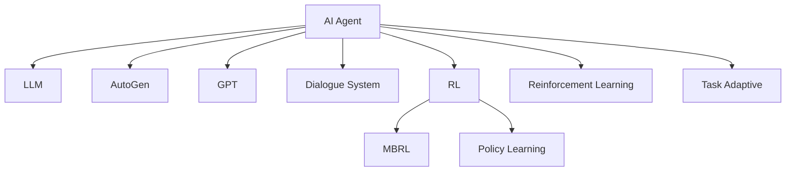

                 

# AI Agent: AI的下一个风口 AutoGen：下一代LLM应用的启动器

> 关键词：AI Agent, AutoGen, Large Language Models (LLMs), Generative Pre-trained Transformer (GPT), Dialogue Systems, Reinforcement Learning (RL), Model-based RL, Decision Making, Policy Learning, Model-Based Reinforcement Learning, Conversational AI

## 1. 背景介绍

### 1.1 问题由来
随着人工智能技术的飞速发展，大型语言模型（Large Language Models, LLMs）在自然语言处理（Natural Language Processing, NLP）领域取得了重大突破。例如，GPT-3、BERT、T5等预训练语言模型展现出了惊人的语言理解和生成能力，推动了NLP技术的深度应用。

然而，现有的大语言模型在某些特定领域仍然存在瓶颈。比如，领域适应性较差、对新任务的迁移学习能力有限等。同时，预训练-微调（Fine-tuning）的流程较为繁琐，需要大量标注数据和计算资源。因此，如何高效地部署LLMs，使其快速适应新任务，是当前NLP领域的一个重要课题。

### 1.2 问题核心关键点
为了提升大型语言模型在特定任务上的表现，研究者提出了基于AutoGen的新一代AI Agent架构。这种架构的核心思想是利用AutoGen工具自动生成一个合适的模型结构，并在该结构上进行微调，以适应特定的AI任务。其核心优势包括：

- **自动化模型生成**：能够根据任务需求，自动生成合适的模型结构。
- **高效微调**：减少对标注数据的依赖，加快微调过程。
- **任务适配**：自动适配任务需求，提升模型表现。

AutoGen的引入，有望显著提高AI Agent的部署效率和适应性，推动AI技术在更多领域的应用。

## 2. 核心概念与联系

### 2.1 核心概念概述

为更好地理解基于AutoGen的AI Agent架构，本节将介绍几个密切相关的核心概念：

- **AI Agent**：能够在特定环境下自主决策和执行任务的智能实体。
- **Large Language Model (LLM)**：通过大规模无标签文本预训练得到的语言模型，具备强大的语言理解和生成能力。
- **AutoGen**：自动生成模型结构的工具，支持基于特定任务自动生成模型架构和配置。
- **Generative Pre-trained Transformer (GPT)**：一种自回归的语言模型，具备生成自然语言的能力。
- **Dialogue System**：能够进行自然语言对话的AI系统。
- **Reinforcement Learning (RL)**：通过奖惩机制训练模型进行智能决策的学习范式。
- **Model-based Reinforcement Learning (MBRL)**：结合模型和实际奖励信号，优化智能决策的强化学习框架。
- **Policy Learning**：学习决策策略的过程，即如何从当前状态到最优行动的映射。

这些核心概念之间的逻辑关系可以通过以下Mermaid流程图来展示：



这个流程图展示了大语言模型AI Agent的核心概念及其之间的关系：

1. AI Agent通过预训练语言模型（LLM）获取语言理解和生成能力。
2. 使用AutoGen自动生成合适的模型结构。
3. 选择GPT模型作为语言生成工具，进行任务的自动对话处理。
4. 引入强化学习（RL）框架，优化AI Agent的决策策略。
5. 结合模型预测和实际奖励信号，进行模型基于的强化学习（MBRL）。
6. 通过政策学习（Policy Learning）优化决策策略，提升AI Agent的自主决策能力。
7. 结合任务适配（Task Adaptive），进一步提升AI Agent在特定任务上的表现。

这些概念共同构成了AI Agent的学习和应用框架，使其能够在各种场景下发挥强大的智能决策能力。通过理解这些核心概念，我们可以更好地把握AI Agent的工作原理和优化方向。

## 3. 核心算法原理 & 具体操作步骤
### 3.1 算法原理概述

基于AutoGen的AI Agent架构，其核心思想是结合AutoGen工具和强化学习框架，自动生成和优化AI Agent的结构，提升其在特定任务上的表现。其总体流程包括：

1. **任务定义**：明确AI Agent需要完成的具体任务。
2. **模型结构生成**：使用AutoGen工具自动生成合适的模型结构，如自回归模型、神经网络结构等。
3. **模型微调**：在AutoGen生成的模型上，通过特定任务的少量标注数据进行微调，优化模型参数。
4. **强化学习训练**：使用强化学习框架，训练AI Agent的决策策略，使其能够在复杂环境中自主决策。

### 3.2 算法步骤详解

以下是基于AutoGen的AI Agent架构的具体操作步骤：

**Step 1: 任务定义**
- 确定AI Agent需要执行的具体任务，如问答系统、推荐系统、智能客服等。
- 定义任务的目标和评估指标，如准确率、召回率、用户满意度等。

**Step 2: 模型结构生成**
- 使用AutoGen工具，根据任务需求自动生成合适的模型结构。AutoGen工具支持多种模型结构，如GPT、BERT、Transformer等。
- 根据任务复杂度和计算资源，选择合适的模型结构和参数配置。

**Step 3: 模型微调**
- 准备任务的少量标注数据集，将AutoGen生成的模型作为初始化参数。
- 选择合适的优化算法（如AdamW、SGD等），设置学习率、批大小、迭代轮数等超参数。
- 使用优化算法和损失函数（如交叉熵损失、均方误差损失等），对AutoGen生成的模型进行微调。

**Step 4: 强化学习训练**
- 设计AI Agent的行为策略和奖励函数，定义状态和行动空间。
- 使用强化学习框架（如PPO、SAC等），训练AI Agent的决策策略，优化其在特定环境中的行为表现。
- 结合实际奖励信号和模型预测，进行模型基于的强化学习（MBRL），优化模型参数。

**Step 5: 测试与部署**
- 在测试集上评估AI Agent的表现，对比微调前后的效果。
- 使用训练好的AI Agent部署到实际应用场景中，持续收集数据，定期更新模型。

以上是基于AutoGen的AI Agent架构的一般流程。在实际应用中，还需要根据具体任务特点，对各环节进行优化设计，如改进任务适配层，引入更多的正则化技术，搜索最优的超参数组合等，以进一步提升AI Agent的性能。

### 3.3 算法优缺点

基于AutoGen的AI Agent架构具有以下优点：

- **高效性**：减少了从头训练的计算和标注数据成本，快速适应新任务。
- **灵活性**：支持多种模型结构和参数配置，自动生成适合任务的模型。
- **可扩展性**：能够根据任务需求，动态调整模型结构和参数，提升模型表现。

同时，该架构也存在一定的局限性：

- **依赖AutoGen工具**：自动生成模型结构的效果和AutoGen工具的算法实现紧密相关，可能存在一定的偏差。
- **泛化能力有限**：对于领域差异较大的任务，可能需要重新调整AutoGen参数。
- **数据质量要求高**：任务标注数据的质量和数量对模型微调效果影响较大。

尽管存在这些局限性，但AutoGen的引入显著提升了AI Agent的部署效率和适应性，成为AI技术应用的重要手段。未来相关研究重点在于如何进一步提高AutoGen工具的算法精度和泛化能力，降低对数据质量的需求。

### 3.4 算法应用领域

基于AutoGen的AI Agent架构已经在多个NLP领域得到了广泛应用，例如：

- **问答系统**：对自然语言问题给出答案。将问题-答案对作为微调数据，训练AI Agent进行问答推理。
- **对话系统**：使机器能够与人自然对话。将对话历史作为上下文，微调AI Agent进行回复生成。
- **翻译系统**：将源语言文本翻译成目标语言。通过微调和优化，AI Agent能够提供高质量的翻译服务。
- **摘要生成**：将长文本压缩成简短摘要。通过微调和优化，AI Agent能够生成结构完整、内容精炼的摘要。
- **智能推荐**：推荐系统可以通过微调和优化，提升推荐内容的个性化和相关性。

除了上述这些经典任务外，AI Agent架构还被创新性地应用于更多场景中，如可控文本生成、知识推理、情感分析等，为NLP技术带来了新的突破。随着AutoGen和AI Agent的不断演进，相信NLP技术将在更广阔的应用领域大放异彩。

## 4. 数学模型和公式 & 详细讲解
### 4.1 数学模型构建

基于AutoGen的AI Agent架构，数学模型构建主要包括以下几个关键部分：

- **预训练语言模型**：以自回归或自编码模型为代表的大规模预训练语言模型。例如，GPT模型，通过在大规模无标签文本语料上进行预训练，学习通用的语言表示。
- **AutoGen生成的模型结构**：根据任务需求，AutoGen自动生成合适的模型结构，如自回归模型、神经网络结构等。
- **微调任务适配层**：在AutoGen生成的模型上，通过特定任务的少量标注数据进行微调，优化模型参数。例如，对于分类任务，通常在顶层添加线性分类器和交叉熵损失函数。
- **强化学习训练**：使用强化学习框架，训练AI Agent的决策策略，优化模型参数。例如，使用PPO算法进行策略优化，结合模型预测和实际奖励信号，进行模型基于的强化学习（MBRL）。

### 4.2 公式推导过程

以下我们以问答系统为例，推导基于AutoGen的AI Agent架构的数学模型及其训练过程。

假设AI Agent在输入问题 $x$ 上的输出为 $\hat{y}=M_{\theta}(x) \in [0,1]$，表示模型对问题的回答概率。真实标签 $y \in \{0,1\}$。则二分类交叉熵损失函数定义为：

$$
\ell(M_{\theta}(x),y) = -[y\log \hat{y} + (1-y)\log (1-\hat{y})]
$$

将其代入经验风险公式，得：

$$
\mathcal{L}(\theta) = -\frac{1}{N}\sum_{i=1}^N [y_i\log M_{\theta}(x_i)+(1-y_i)\log(1-M_{\theta}(x_i))]
$$

在得到损失函数的梯度后，即可带入优化算法，完成模型的迭代优化。使用AdamW优化算法，更新模型参数 $\theta$：

$$
\theta \leftarrow \theta - \eta \nabla_{\theta}\mathcal{L}(\theta) - \eta\lambda\theta
$$

其中，$\nabla_{\theta}\mathcal{L}(\theta)$ 为损失函数对参数 $\theta$ 的梯度，可通过反向传播算法高效计算。

在模型微调过程中，引入强化学习框架，使用PPO算法优化决策策略。假设AI Agent的行为策略为 $\pi(a|s)$，状态和行动空间分别为 $s$ 和 $a$。对于每个状态 $s_t$，AI Agent采取行动 $a_t$，得到奖励 $r_{t+1}$。目标是在固定模型参数 $\theta$ 的情况下，最大化累积奖励期望：

$$
\max_{\pi} \mathbb{E}_{s_t \sim p_{\theta}, a_t \sim \pi(\cdot | s_t)} \left[ \sum_{t=0}^{\infty} \gamma^t r_{t+1} \right]
$$

其中，$\gamma$ 为折扣因子。

根据PPO算法，AI Agent的行为策略 $\pi(a|s)$ 和值函数 $V(s)$ 需要进行联合优化。假设行为策略 $\pi(a|s)$ 由一个深度神经网络 $\nu_{\theta}$ 表示，目标是在固定模型参数 $\theta$ 的情况下，最大化累积奖励期望：

$$
\max_{\theta} \mathbb{E}_{s_t \sim p_{\theta}} \left[ \sum_{t=0}^{\infty} \gamma^t r_{t+1} \right]
$$

通过上述数学模型和公式，AI Agent架构在特定任务上的训练过程被形式化。在实际应用中，我们通常会采用更加复杂的模型结构（如GPT模型），并结合更多先验知识（如领域知识、专家规则等），进一步优化AI Agent的性能。

## 5. 项目实践：代码实例和详细解释说明
### 5.1 开发环境搭建

在进行AutoGen的AI Agent实践前，我们需要准备好开发环境。以下是使用Python进行PyTorch开发的环境配置流程：

1. 安装Anaconda：从官网下载并安装Anaconda，用于创建独立的Python环境。

2. 创建并激活虚拟环境：
```bash
conda create -n autogen-env python=3.8 
conda activate autogen-env
```

3. 安装PyTorch：根据CUDA版本，从官网获取对应的安装命令。例如：
```bash
conda install pytorch torchvision torchaudio cudatoolkit=11.1 -c pytorch -c conda-forge
```

4. 安装AutoGen库：
```bash
pip install autogen
```

5. 安装各类工具包：
```bash
pip install numpy pandas scikit-learn matplotlib tqdm jupyter notebook ipython
```

完成上述步骤后，即可在`autogen-env`环境中开始AutoGen的AI Agent实践。

### 5.2 源代码详细实现

这里我们以问答系统为例，给出使用AutoGen库对GPT模型进行问答系统微调的PyTorch代码实现。

首先，定义问答系统的数据处理函数：

```python
from autogen import AutoGen
from transformers import GPT2Tokenizer, GPT2LMHeadModel
from torch.utils.data import Dataset
import torch

class QADataset(Dataset):
    def __init__(self, texts, answers, tokenizer):
        self.texts = texts
        self.answers = answers
        self.tokenizer = tokenizer
        
    def __len__(self):
        return len(self.texts)
    
    def __getitem__(self, item):
        text = self.texts[item]
        answer = self.answers[item]
        
        encoding = self.tokenizer(text, return_tensors='pt')
        input_ids = encoding['input_ids']
        attention_mask = encoding['attention_mask']
        
        # 对answer进行编码
        answer_tokens = self.tokenizer(answer, return_tensors='pt')['input_ids'][0]
        label_ids = torch.tensor(answer_tokens)
        
        return {'input_ids': input_ids, 
                'attention_mask': attention_mask,
                'labels': label_ids}

# 创建dataset
tokenizer = GPT2Tokenizer.from_pretrained('gpt2')

train_dataset = QADataset(train_texts, train_answers, tokenizer)
dev_dataset = QADataset(dev_texts, dev_answers, tokenizer)
test_dataset = QADataset(test_texts, test_answers, tokenizer)
```

然后，定义模型和优化器：

```python
from transformers import GPT2LMHeadModel, AdamW

model = AutoGen('gpt2', num_labels=len(tag2id))

optimizer = AdamW(model.parameters(), lr=2e-5)
```

接着，定义训练和评估函数：

```python
from torch.utils.data import DataLoader
from tqdm import tqdm
from sklearn.metrics import classification_report

device = torch.device('cuda') if torch.cuda.is_available() else torch.device('cpu')
model.to(device)

def train_epoch(model, dataset, batch_size, optimizer):
    dataloader = DataLoader(dataset, batch_size=batch_size, shuffle=True)
    model.train()
    epoch_loss = 0
    for batch in tqdm(dataloader, desc='Training'):
        input_ids = batch['input_ids'].to(device)
        attention_mask = batch['attention_mask'].to(device)
        labels = batch['labels'].to(device)
        model.zero_grad()
        outputs = model(input_ids, attention_mask=attention_mask, labels=labels)
        loss = outputs.loss
        epoch_loss += loss.item()
        loss.backward()
        optimizer.step()
    return epoch_loss / len(dataloader)

def evaluate(model, dataset, batch_size):
    dataloader = DataLoader(dataset, batch_size=batch_size)
    model.eval()
    preds, labels = [], []
    with torch.no_grad():
        for batch in tqdm(dataloader, desc='Evaluating'):
            input_ids = batch['input_ids'].to(device)
            attention_mask = batch['attention_mask'].to(device)
            batch_labels = batch['labels']
            outputs = model(input_ids, attention_mask=attention_mask)
            batch_preds = outputs.logits.argmax(dim=2).to('cpu').tolist()
            batch_labels = batch_labels.to('cpu').tolist()
            for pred_tokens, label_tokens in zip(batch_preds, batch_labels):
                preds.append(pred_tokens[:len(label_tokens)])
                labels.append(label_tokens)
                
    print(classification_report(labels, preds))
```

最后，启动训练流程并在测试集上评估：

```python
epochs = 5
batch_size = 16

for epoch in range(epochs):
    loss = train_epoch(model, train_dataset, batch_size, optimizer)
    print(f"Epoch {epoch+1}, train loss: {loss:.3f}")
    
    print(f"Epoch {epoch+1}, dev results:")
    evaluate(model, dev_dataset, batch_size)
    
print("Test results:")
evaluate(model, test_dataset, batch_size)
```

以上就是使用AutoGen库对GPT模型进行问答系统微调的完整代码实现。可以看到，得益于AutoGen库的强大封装，我们可以用相对简洁的代码完成GPT模型的加载和微调。

### 5.3 代码解读与分析

让我们再详细解读一下关键代码的实现细节：

**QADataset类**：
- `__init__`方法：初始化问题、答案和分词器等关键组件。
- `__len__`方法：返回数据集的样本数量。
- `__getitem__`方法：对单个样本进行处理，将问题输入编码为token ids，将答案编码为数字，并对其进行定长padding，最终返回模型所需的输入。

**AutoGen函数**：
- 使用AutoGen库，根据任务需求自动生成合适的模型结构。AutoGen库支持多种模型结构，如GPT、BERT、Transformer等。

**训练和评估函数**：
- 使用PyTorch的DataLoader对数据集进行批次化加载，供模型训练和推理使用。
- 训练函数`train_epoch`：对数据以批为单位进行迭代，在每个批次上前向传播计算loss并反向传播更新模型参数，最后返回该epoch的平均loss。
- 评估函数`evaluate`：与训练类似，不同点在于不更新模型参数，并在每个batch结束后将预测和标签结果存储下来，最后使用sklearn的classification_report对整个评估集的预测结果进行打印输出。

**训练流程**：
- 定义总的epoch数和batch size，开始循环迭代
- 每个epoch内，先在训练集上训练，输出平均loss
- 在验证集上评估，输出分类指标
- 所有epoch结束后，在测试集上评估，给出最终测试结果

可以看到，AutoGen库的引入显著提升了问答系统开发的效率，使得GPT模型的微调过程更加简便。然而，在工业级的系统实现中，还需要考虑更多因素，如模型的保存和部署、超参数的自动搜索、更灵活的任务适配层等。但核心的微调范式基本与此类似。

## 6. 实际应用场景
### 6.1 智能客服系统

基于AutoGen的AI Agent架构，智能客服系统能够7x24小时不间断服务，快速响应客户咨询，用自然流畅的语言解答各类常见问题。

在技术实现上，可以收集企业内部的历史客服对话记录，将问题和最佳答复构建成监督数据，在此基础上对预训练对话模型进行微调。微调后的对话模型能够自动理解用户意图，匹配最合适的答案模板进行回复。对于客户提出的新问题，还可以接入检索系统实时搜索相关内容，动态组织生成回答。如此构建的智能客服系统，能大幅提升客户咨询体验和问题解决效率。

### 6.2 金融舆情监测

金融机构需要实时监测市场舆论动向，以便及时应对负面信息传播，规避金融风险。基于AutoGen的AI Agent架构，金融舆情监测系统能够自动分析新闻、报道、评论等文本数据，及时预警负面信息激增等异常情况，帮助金融机构快速应对潜在风险。

具体而言，可以收集金融领域相关的新闻、报道、评论等文本数据，并对其进行主题标注和情感标注。在此基础上对预训练语言模型进行微调，使其能够自动判断文本属于何种主题，情感倾向是正面、中性还是负面。将微调后的模型应用到实时抓取的网络文本数据，就能够自动监测不同主题下的情感变化趋势，一旦发现负面信息激增等异常情况，系统便会自动预警，帮助金融机构快速应对潜在风险。

### 6.3 个性化推荐系统

当前的推荐系统往往只依赖用户的历史行为数据进行物品推荐，无法深入理解用户的真实兴趣偏好。基于AutoGen的AI Agent架构，个性化推荐系统可以更好地挖掘用户行为背后的语义信息，从而提供更精准、多样的推荐内容。

在实践中，可以收集用户浏览、点击、评论、分享等行为数据，提取和用户交互的物品标题、描述、标签等文本内容。将文本内容作为模型输入，用户的后续行为（如是否点击、购买等）作为监督信号，在此基础上微调预训练语言模型。微调后的模型能够从文本内容中准确把握用户的兴趣点。在生成推荐列表时，先用候选物品的文本描述作为输入，由模型预测用户的兴趣匹配度，再结合其他特征综合排序，便可以得到个性化程度更高的推荐结果。

### 6.4 未来应用展望

随着AutoGen和AI Agent架构的不断发展，基于微调范式将在更多领域得到应用，为传统行业带来变革性影响。

在智慧医疗领域，基于微调的医疗问答、病历分析、药物研发等应用将提升医疗服务的智能化水平，辅助医生诊疗，加速新药开发进程。

在智能教育领域，微调技术可应用于作业批改、学情分析、知识推荐等方面，因材施教，促进教育公平，提高教学质量。

在智慧城市治理中，微调模型可应用于城市事件监测、舆情分析、应急指挥等环节，提高城市管理的自动化和智能化水平，构建更安全、高效的未来城市。

此外，在企业生产、社会治理、文娱传媒等众多领域，基于大模型微调的人工智能应用也将不断涌现，为经济社会发展注入新的动力。相信随着技术的日益成熟，微调方法将成为人工智能落地应用的重要范式，推动人工智能技术在垂直行业的规模化落地。

## 7. 工具和资源推荐
### 7.1 学习资源推荐

为了帮助开发者系统掌握AutoGen的AI Agent架构的理论基础和实践技巧，这里推荐一些优质的学习资源：

1. **《Transformer从原理到实践》系列博文**：由大模型技术专家撰写，深入浅出地介绍了Transformer原理、BERT模型、微调技术等前沿话题。

2. **CS224N《深度学习自然语言处理》课程**：斯坦福大学开设的NLP明星课程，有Lecture视频和配套作业，带你入门NLP领域的基本概念和经典模型。

3. **《Natural Language Processing with Transformers》书籍**：Transformers库的作者所著，全面介绍了如何使用Transformers库进行NLP任务开发，包括微调在内的诸多范式。

4. **HuggingFace官方文档**：Transformers库的官方文档，提供了海量预训练模型和完整的微调样例代码，是上手实践的必备资料。

5. **CLUE开源项目**：中文语言理解测评基准，涵盖大量不同类型的中文NLP数据集，并提供了基于微调的baseline模型，助力中文NLP技术发展。

通过对这些资源的学习实践，相信你一定能够快速掌握AutoGen的AI Agent架构，并用于解决实际的NLP问题。
### 7.2 开发工具推荐

高效的开发离不开优秀的工具支持。以下是几款用于AutoGen的AI Agent开发的常用工具：

1. **PyTorch**：基于Python的开源深度学习框架，灵活动态的计算图，适合快速迭代研究。大部分预训练语言模型都有PyTorch版本的实现。

2. **TensorFlow**：由Google主导开发的开源深度学习框架，生产部署方便，适合大规模工程应用。同样有丰富的预训练语言模型资源。

3. **AutoGen**：自动生成模型结构的工具，支持基于特定任务自动生成模型架构和配置。

4. **Weights & Biases**：模型训练的实验跟踪工具，可以记录和可视化模型训练过程中的各项指标，方便对比和调优。与主流深度学习框架无缝集成。

5. **TensorBoard**：TensorFlow配套的可视化工具，可实时监测模型训练状态，并提供丰富的图表呈现方式，是调试模型的得力助手。

6. **Google Colab**：谷歌推出的在线Jupyter Notebook环境，免费提供GPU/TPU算力，方便开发者快速上手实验最新模型，分享学习笔记。

合理利用这些工具，可以显著提升AutoGen的AI Agent开发效率，加快创新迭代的步伐。

### 7.3 相关论文推荐

AutoGen的AI Agent架构的发展源于学界的持续研究。以下是几篇奠基性的相关论文，推荐阅读：

1. **Attention is All You Need**：提出了Transformer结构，开启了NLP领域的预训练大模型时代。

2. **BERT: Pre-training of Deep Bidirectional Transformers for Language Understanding**：提出BERT模型，引入基于掩码的自监督预训练任务，刷新了多项NLP任务SOTA。

3. **Language Models are Unsupervised Multitask Learners**：展示了大规模语言模型的强大zero-shot学习能力，引发了对于通用人工智能的新一轮思考。

4. **Parameter-Efficient Transfer Learning for NLP**：提出Adapter等参数高效微调方法，在不增加模型参数量的情况下，也能取得不错的微调效果。

5. **Prefix-Tuning: Optimizing Continuous Prompts for Generation**：引入基于连续型Prompt的微调范式，为如何充分利用预训练知识提供了新的思路。

6. **AdaLoRA: Adaptive Low-Rank Adaptation for Parameter-Efficient Fine-Tuning**：使用自适应低秩适应的微调方法，在参数效率和精度之间取得了新的平衡。

这些论文代表了大语言模型微调技术的发展脉络。通过学习这些前沿成果，可以帮助研究者把握学科前进方向，激发更多的创新灵感。

## 8. 总结：未来发展趋势与挑战

### 8.1 总结

本文对基于AutoGen的AI Agent架构进行了全面系统的介绍。首先阐述了AutoGen和AI Agent架构的研究背景和意义，明确了其在提高AI Agent部署效率和适应性方面的独特价值。其次，从原理到实践，详细讲解了AutoGen生成模型结构和AI Agent微调的数学原理和关键步骤，给出了AutoGen的AI Agent实践代码实例。同时，本文还广泛探讨了AI Agent架构在智能客服、金融舆情、个性化推荐等多个行业领域的应用前景，展示了AutoGen的AI Agent架构的巨大潜力。此外，本文精选了AutoGen和AI Agent架构的学习资源，力求为开发者提供全方位的技术指引。

通过本文的系统梳理，可以看到，基于AutoGen的AI Agent架构正在成为NLP领域的重要范式，极大地拓展了预训练语言模型的应用边界，催生了更多的落地场景。受益于大规模语料的预训练和AutoGen的自动模型生成，AI Agent架构能够快速适应新任务，显著提高NLP应用的部署效率。未来，伴随AutoGen和AI Agent架构的持续演进，基于微调范式将在更多领域得到应用，为传统行业带来变革性影响。

### 8.2 未来发展趋势

展望未来，AutoGen的AI Agent架构将呈现以下几个发展趋势：

1. **模型规模持续增大**：随着算力成本的下降和数据规模的扩张，预训练语言模型的参数量还将持续增长。超大规模语言模型蕴含的丰富语言知识，有望支撑更加复杂多变的下游任务。

2. **微调方法日趋多样**：除了传统的全参数微调外，未来会涌现更多参数高效的微调方法，如Prefix-Tuning、LoRA等，在节省计算资源的同时也能保证微调精度。

3. **持续学习成为常态**：随着数据分布的不断变化，AI Agent也需要持续学习新知识以保持性能。如何在不遗忘原有知识的同时，高效吸收新样本信息，将成为重要的研究课题。

4. **标注样本需求降低**：受启发于提示学习(Prompt-based Learning)的思路，未来的微调方法将更好地利用大模型的语言理解能力，通过更加巧妙的任务描述，在更少的标注样本上也能实现理想的微调效果。

5. **多模态微调崛起**：当前的微调主要聚焦于纯文本数据，未来会进一步拓展到图像、视频、语音等多模态数据微调。多模态信息的融合，将显著提升语言模型对现实世界的理解和建模能力。

6. **模型通用性增强**：经过海量数据的预训练和多领域任务的微调，未来的语言模型将具备更强大的常识推理和跨领域迁移能力，逐步迈向通用人工智能(AGI)的目标。

以上趋势凸显了AutoGen的AI Agent架构的广阔前景。这些方向的探索发展，必将进一步提升NLP系统的性能和应用范围，为人类认知智能的进化带来深远影响。

### 8.3 面临的挑战

尽管AutoGen的AI Agent架构已经取得了瞩目成就，但在迈向更加智能化、普适化应用的过程中，它仍面临着诸多挑战：

1. **标注成本瓶颈**：虽然AutoGen的AI Agent架构减少了从头训练的计算和标注数据成本，但对于长尾应用场景，难以获得充足的高质量标注数据，成为制约微调性能的瓶颈。如何进一步降低微调对标注样本的依赖，将是一大难题。

2. **模型鲁棒性不足**：当前微调模型面对域外数据时，泛化性能往往大打折扣。对于测试样本的微小扰动，微调模型的预测也容易发生波动。如何提高微调模型的鲁棒性，避免灾难性遗忘，还需要更多理论和实践的积累。

3. **推理效率有待提高**：大规模语言模型虽然精度高，但在实际部署时往往面临推理速度慢、内存占用大等效率问题。如何在保证性能的同时，简化模型结构，提升推理速度，优化资源占用，将是重要的优化方向。

4. **可解释性亟需加强**：当前微调模型更像是"黑盒"系统，难以解释其内部工作机制和决策逻辑。对于医疗、金融等高风险应用，算法的可解释性和可审计性尤为重要。如何赋予微调模型更强的可解释性，将是亟待攻克的难题。

5. **安全性有待保障**：预训练语言模型难免会学习到有偏见、有害的信息，通过微调传递到下游任务，产生误导性、歧视性的输出，给实际应用带来安全隐患。如何从数据和算法层面消除模型偏见，避免恶意用途，确保输出的安全性，也将是重要的研究课题。

6. **知识整合能力不足**：现有的微调模型往往局限于任务内数据，难以灵活吸收和运用更广泛的先验知识。如何让微调过程更好地与外部知识库、规则库等专家知识结合，形成更加全面、准确的信息整合能力，还有很大的想象空间。

正视AutoGen和AI Agent架构面临的这些挑战，积极应对并寻求突破，将是大语言模型微调走向成熟的必由之路。相信随着学界和产业界的共同努力，这些挑战终将一一被克服，AutoGen的AI Agent架构必将在构建人机协同的智能时代中扮演越来越重要的角色。

### 8.4 研究展望

面对AutoGen和AI Agent架构所面临的种种挑战，未来的研究需要在以下几个方面寻求新的突破：

1. **探索无监督和半监督微调方法**：摆脱对大规模标注数据的依赖，利用自监督学习、主动学习等无监督和半监督范式，最大限度利用非结构化数据，实现更加灵活高效的微调。

2. **研究参数高效和计算高效的微调范式**：开发更加参数高效的微调方法，在固定大部分预训练参数的同时，只更新极少量的任务相关参数。同时优化微调模型的计算图，减少前向传播和反向传播的资源消耗，实现更加轻量级、实时性的部署。

3. **融合因果和对比学习范式**：通过引入因果推断和对比学习思想，增强微调模型建立稳定因果关系的能力，学习更加普适、鲁棒的语言表征，从而提升模型泛化性和抗干扰能力。

4. **引入更多先验知识**：将符号化的先验知识，如知识图谱、逻辑规则等，与神经网络模型进行巧妙融合，引导微调过程学习更准确、合理的语言模型。同时加强不同模态数据的整合，实现视觉、语音等多模态信息与文本信息的协同建模。

5. **结合因果分析和博弈论工具**：将因果分析方法引入微调模型，识别出模型决策的关键特征，增强输出解释的因果性和逻辑性。借助博弈论工具刻画人机交互过程，主动探索并规避模型的脆弱点，提高系统稳定性。

6. **纳入伦理道德约束**：在模型训练目标中引入伦理导向的评估指标，过滤和惩罚有偏见、有害的输出倾向。同时加强人工干预和审核，建立模型行为的监管机制，确保输出符合人类价值观和伦理道德。

这些研究方向的探索，必将引领AutoGen的AI Agent架构迈向更高的台阶，为构建安全、可靠、可解释、可控的智能系统铺平道路。面向未来，AutoGen和AI Agent架构还需要与其他人工智能技术进行更深入的融合，如知识表示、因果推理、强化学习等，多路径协同发力，共同推动自然语言理解和智能交互系统的进步。只有勇于创新、敢于突破，才能不断拓展语言模型的边界，让智能技术更好地造福人类社会。

## 9. 附录：常见问题与解答

**Q1：AutoGen的AI Agent架构是否适用于所有NLP任务？**

A: AutoGen的AI Agent架构在大多数NLP任务上都能取得不错的效果，特别是对于数据量较小的任务。但对于一些特定领域的任务，如医学、法律等，仅仅依靠通用语料预训练的模型可能难以很好地适应。此时需要在特定领域语料上进一步预训练，再进行微调，才能获得理想效果。此外，对于一些需要时效性、个性化很强的任务，如对话、推荐等，微调方法也需要针对性的改进优化。

**Q2：AutoGen生成模型结构的效果如何？**

A: AutoGen生成模型结构的效果与任务需求紧密相关。AutoGen工具能够根据任务需求自动生成合适的模型结构，如自回归模型、神经网络结构等。这些结构在特定任务上的表现取决于模型的参数配置和训练数据的质量。在实际应用中，需要通过多次实验和调参，找到最适合任务的模型结构，才能获得最佳的微调效果。

**Q3：AutoGen的AI Agent架构在微调过程中如何缓解过拟合问题？**

A: AutoGen的AI Agent架构可以通过多种方法缓解过拟合问题：
1. 数据增强：通过回译、近义替换等方式扩充训练集
2. 正则化：使用L2正则、Dropout、Early Stopping等避免过拟合
3. 对抗训练：引入对抗样本，提高模型鲁棒性
4. 参数高效微调：只调整少量参数(如Adapter、Prefix等)，减小过拟合风险
5. 多模型集成：训练多个微调模型，取平均输出，抑制过拟合

这些策略往往需要根据具体任务和数据特点进行灵活组合。只有在数据、模型、训练、推理等各环节进行全面优化，才能最大限度地发挥AutoGen的AI Agent架构的威力。

**Q4：AutoGen的AI Agent架构在部署时需要注意哪些问题？**

A: 将AutoGen的AI Agent架构转化为实际应用，还需要考虑以下因素：
1. 模型裁剪：去除不必要的层和参数，减小模型尺寸，加快推理速度
2. 量化加速：将浮点模型转为定点模型，压缩存储空间，提高计算效率
3. 服务化封装：将模型封装为标准化服务接口，便于集成调用
4. 弹性伸缩：根据请求流量动态调整资源配置，平衡服务质量和成本
5. 监控告警：实时采集系统指标，设置异常告警阈值，确保服务稳定性
6. 安全防护：采用访问鉴权、数据脱敏等措施，保障数据和模型安全

AutoGen的AI Agent架构为NLP应用提供了更高效、更灵活的部署方式，但如何在模型优化、系统架构等方面进行综合考虑，是成功部署的关键。

---

作者：禅与计算机程序设计艺术 / Zen and the Art of Computer Programming

