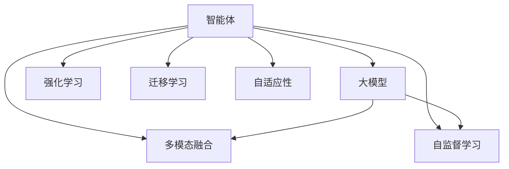

                 

## AI Agent: AI的下一个风口 大模型驱动的智能体

> 关键词：智能体(Agent)，大模型，强化学习，迁移学习，多模态融合，自适应性，自监督学习，知识图谱

在人工智能领域，智能体(Agent)正迅速崛起，成为推动AI技术发展和应用的风口。不同于传统的基于规则的系统，智能体通过大模型驱动，具备自主学习和推理能力，能够更加灵活地适应复杂多变的环境。本文将系统介绍智能体的核心概念、技术原理、实施步骤和实际应用场景，帮助读者深入理解这一前沿方向，并展望其未来发展趋势。

## 1. 背景介绍

### 1.1 问题由来
随着人工智能技术的不断成熟，尤其是深度学习技术的普及，传统的基于规则和模板的系统已无法满足复杂环境下的应用需求。智能体作为新一代AI模型，能够自我学习、自我推理，具有更强的适应性和自主性。特别是近年来，通过大模型驱动，智能体在自然语言处理、智能推荐、无人驾驶、智能制造等多个领域展现出巨大潜力。

### 1.2 问题核心关键点
智能体的核心在于将预训练模型作为初始化参数，通过有监督学习或无监督学习的方式进行微调或迁移学习，进而适应特定任务。相比于传统的基于规则的系统，智能体具备以下优势：

- 自适应性强：智能体能够自主学习，适应不同环境和任务需求。
- 泛化能力强：智能体通过大模型进行预训练，具备更强的泛化能力，能够在复杂环境中高效决策。
- 知识迁移能力强：智能体能够将预训练的知识迁移到特定任务上，快速提升性能。

然而，智能体在实际应用中也面临着一些挑战：

- 高成本的标注数据：智能体训练通常需要大量的标注数据，对于高成本的标注任务，获取高质量标注数据成为一大难题。
- 可解释性不足：智能体作为"黑盒"模型，其决策过程缺乏可解释性，难以进行调试和优化。
- 鲁棒性有待提高：智能体在对抗样本、噪声数据等不良情况下，性能波动较大，需要提高模型的鲁棒性。

### 1.3 问题研究意义
智能体技术对于推动人工智能技术的普及和应用具有重要意义：

- 推动AI技术落地：智能体技术可大幅降低AI应用的门槛，推动AI技术在各行各业的落地应用。
- 提升AI应用效果：通过大模型驱动，智能体能够在特定任务上获得更好的性能表现。
- 促进AI技术演进：智能体技术推动了AI从规则驱动向数据驱动的转变，加速了AI技术的演进。

## 2. 核心概念与联系

### 2.1 核心概念概述

为更好地理解大模型驱动的智能体，本节将介绍几个密切相关的核心概念：

- **智能体(Agent)**：能够感知环境、做出决策并执行行动的实体，具备自主学习和推理能力。
- **大模型(Large Model)**：指参数量在亿级以上的深度神经网络模型，如BERT、GPT、Transformer等，通过在大规模数据上进行预训练，具备强大的表示和推理能力。
- **强化学习(Reinforcement Learning, RL)**：通过奖励机制引导智能体在环境中学习最优策略，适用于智能体在复杂环境中的决策优化。
- **迁移学习(Transfer Learning)**：通过将预训练模型迁移到特定任务上进行微调，提升模型在特定任务上的性能。
- **多模态融合(Multimodal Fusion)**：将视觉、语音、文本等多模态数据进行融合，提升智能体的感知和理解能力。
- **自适应性(Adaptability)**：智能体能够根据环境变化自主调整策略和行为。
- **自监督学习(Self-supervised Learning)**：通过自监督任务训练模型，利用无标签数据学习到模型表示。

这些概念之间的逻辑关系可以通过以下Mermaid流程图来展示：



这个流程图展示了大模型驱动的智能体的核心概念及其之间的关系：

1. 智能体通过大模型进行预训练，具备基本的感知和推理能力。
2. 强化学习引导智能体在复杂环境中学习最优策略。
3. 迁移学习使得智能体能够快速适应特定任务。
4. 多模态融合增强智能体的感知能力。
5. 自适应性使智能体具备环境变化的自主调整能力。
6. 自监督学习通过无标签数据学习到更强的表示能力。

这些概念共同构成了大模型驱动的智能体的学习和应用框架，使其能够在复杂多变的环境下高效决策和执行任务。

## 3. 核心算法原理 & 具体操作步骤

### 3.1 算法原理概述

大模型驱动的智能体，本质上是通过强化学习和迁移学习的方式，将预训练大模型适配到特定任务上。其核心思想是：将大模型作为初始化参数，通过在特定环境中的自主学习，逐步调整参数，最终适应并优化特定任务。

形式化地，假设预训练大模型为 $M_{\theta}$，其中 $\theta$ 为预训练得到的模型参数。假设智能体需要在特定环境 $\mathcal{E}$ 中学习，环境的状态空间为 $\mathcal{S}$，动作空间为 $\mathcal{A}$，智能体的奖励函数为 $R(\cdot)$。智能体的目标是通过自主学习，最大化期望奖励 $E[R(\cdot)]$。

智能体的学习过程通常包括：

- 感知环境：智能体通过传感器感知环境状态 $s_t$。
- 决策执行：智能体根据当前状态 $s_t$ 选择动作 $a_t$ 并执行，得到奖励 $r_{t+1}$ 和新状态 $s_{t+1}$。
- 策略更新：智能体根据奖励信号调整策略参数 $\theta$，以优化未来期望奖励。

具体而言，智能体的学习过程可以描述为：

$$
\theta \leftarrow \theta - \eta \nabla_{\theta} J(\theta) \\
J(\theta) = -\sum_{t} R(s_t, a_t) + \gamma \max_{a} \mathbb{E}_{s'|s,a} [J(\theta')] 
$$

其中，$\nabla_{\theta} J(\theta)$ 为智能体策略参数的梯度，$\eta$ 为学习率，$J(\theta)$ 为智能体策略的累积奖励，$\gamma$ 为折扣因子。

### 3.2 算法步骤详解

大模型驱动的智能体的一般流程如下：

**Step 1: 准备预训练模型和环境**
- 选择合适的预训练大模型 $M_{\theta}$ 作为初始化参数。
- 构建模拟或真实环境 $\mathcal{E}$，描述智能体需要完成任务的任务空间、状态空间、动作空间等。

**Step 2: 设计奖励函数**
- 根据任务需求，设计合适的奖励函数 $R(\cdot)$，定义智能体在不同状态下的奖励值。
- 确保奖励函数能够激励智能体向期望的行为靠拢。

**Step 3: 设置学习参数**
- 选择合适的优化算法及其参数，如Adam、SGD等，设置学习率、批大小、迭代轮数等。
- 设置折扣因子 $\gamma$，以平衡短期和长期奖励。

**Step 4: 执行学习过程**
- 在每一步中，智能体感知环境状态 $s_t$，选择动作 $a_t$ 并执行，得到奖励 $r_{t+1}$ 和新状态 $s_{t+1}$。
- 根据奖励信号，更新智能体策略参数 $\theta$，以优化未来期望奖励。
- 重复上述步骤直至智能体收敛或达到预设的迭代轮数。

**Step 5: 测试和部署**
- 在测试环境上评估智能体的性能，对比学习前后的效果。
- 使用学习后的智能体对新环境进行推理预测，集成到实际应用系统中。

以上是智能体的基本学习流程。在实际应用中，还需要根据具体任务和环境，对学习过程的各个环节进行优化设计，如改进奖励函数，引入更多的正则化技术，搜索最优的超参数组合等，以进一步提升智能体的性能。

### 3.3 算法优缺点

大模型驱动的智能体具有以下优点：
1. 自适应性强：智能体能够自主学习，适应不同环境和任务需求。
2. 泛化能力强：通过大模型进行预训练，具备更强的泛化能力，能够在复杂环境中高效决策。
3. 知识迁移能力强：通过迁移学习，智能体能够快速适应特定任务，提升性能。

同时，该方法也存在一定的局限性：
1. 依赖高成本的标注数据：智能体训练通常需要大量的标注数据，对于高成本的标注任务，获取高质量标注数据成为一大难题。
2. 可解释性不足：智能体作为"黑盒"模型，其决策过程缺乏可解释性，难以进行调试和优化。
3. 鲁棒性有待提高：智能体在对抗样本、噪声数据等不良情况下，性能波动较大，需要提高模型的鲁棒性。

尽管存在这些局限性，但就目前而言，大模型驱动的智能体方法仍是最主流范式。未来相关研究的重点在于如何进一步降低智能体对标注数据的依赖，提高模型的可解释性和鲁棒性，同时兼顾性能优化。

### 3.4 算法应用领域

大模型驱动的智能体已经在多个领域得到了应用，涵盖几乎所有常见任务，例如：

- 自然语言处理：如问答系统、文本生成、机器翻译等。通过强化学习和迁移学习，智能体能够学习语言-语言映射，实现高效的自然语言理解。
- 智能推荐：如电商推荐、音乐推荐等。通过多模态融合和自适应性，智能体能够学习用户行为，提供个性化推荐。
- 无人驾驶：如自动驾驶汽车、无人机等。通过强化学习和环境感知，智能体能够实现自主决策和动作执行。
- 智能制造：如工业机器人、智能仓库等。通过多模态融合和自适应性，智能体能够实现复杂任务自动化。
- 医疗诊断：如医学影像分析、智能问诊等。通过强化学习和迁移学习，智能体能够学习疾病诊断知识，辅助医生诊疗。

除了上述这些经典任务外，智能体技术也被创新性地应用到更多场景中，如智能客服、金融分析、智能交通等，为各行各业带来新的变革。随着预训练模型和智能体方法的不断进步，相信智能体技术将在更广阔的应用领域大放异彩。

## 4. 数学模型和公式 & 详细讲解

### 4.1 数学模型构建

本节将使用数学语言对大模型驱动的智能体的学习过程进行更加严格的刻画。

记智能体在环境 $\mathcal{E}$ 中的状态空间为 $\mathcal{S}$，动作空间为 $\mathcal{A}$，状态转移概率为 $P(\cdot)$，智能体的奖励函数为 $R(\cdot)$，策略参数为 $\theta$。智能体的学习目标为最大化期望奖励 $J(\theta)$：

$$
J(\theta) = -\sum_{t} R(s_t, a_t) + \gamma \max_{a} \mathbb{E}_{s'|s,a} [J(\theta')] 
$$

在离散环境中，智能体的策略 $Q$ 可以表示为：

$$
Q(s_t, a_t) = \mathbb{E}_{s_{t+1}, r_{t+1}} [R(s_t, a_t) + \gamma Q(s_{t+1}, a_{t+1})]
$$

在连续环境中，智能体的策略 $Q$ 可以表示为：

$$
Q(s_t, a_t) = \mathbb{E}_{s_{t+1}, r_{t+1}} [R(s_t, a_t) + \gamma \max_a Q(s_{t+1}, a)]
$$

其中，$Q(s_t, a_t)$ 表示智能体在状态 $s_t$ 下选择动作 $a_t$ 的预期奖励。

### 4.2 公式推导过程

以下我们以强化学习中的Q-learning算法为例，推导其更新公式。

假设智能体在状态 $s_t$ 下选择动作 $a_t$，得到奖励 $r_{t+1}$ 和下一个状态 $s_{t+1}$。根据Q-learning算法，智能体更新策略 $Q$ 的公式为：

$$
Q(s_t, a_t) \leftarrow Q(s_t, a_t) + \eta [R(s_t, a_t) + \gamma \max_{a} Q(s_{t+1}, a) - Q(s_t, a_t)]
$$

其中，$\eta$ 为学习率，$\max_{a} Q(s_{t+1}, a)$ 表示在状态 $s_{t+1}$ 下选择最优动作的预期奖励。

在实际应用中，为了提高智能体的鲁棒性和可解释性，还需要引入正则化技术，如L2正则、Dropout、Early Stopping等，防止模型过拟合。同时，可以通过多模型集成、对抗训练等方法，进一步提升智能体的性能。

## 5. 项目实践：代码实例和详细解释说明

### 5.1 开发环境搭建

在进行智能体实践前，我们需要准备好开发环境。以下是使用Python进行Reinforcement Learning实验的环境配置流程：

1. 安装Anaconda：从官网下载并安装Anaconda，用于创建独立的Python环境。

2. 创建并激活虚拟环境：
```bash
conda create -n reinforcement-env python=3.8 
conda activate reinforcement-env
```

3. 安装PyTorch和Gym：
```bash
conda install pytorch torchvision torchaudio cudatoolkit=11.1 -c pytorch -c conda-forge
pip install gym
```

4. 安装OpenAI Gym环境：
```bash
pip install gym[atari]
```

完成上述步骤后，即可在`reinforcement-env`环境中开始智能体实践。

### 5.2 源代码详细实现

下面我们以智能体在Atari环境中的训练为例，给出使用PyTorch和Gym库的代码实现。

首先，导入所需库：

```python
import torch
import torch.nn as nn
import torch.optim as optim
import gym
import numpy as np
```

然后，定义智能体的策略网络：

```python
class DQN(nn.Module):
    def __init__(self, state_dim, action_dim):
        super(DQN, self).__init__()
        self.fc1 = nn.Linear(state_dim, 256)
        self.fc2 = nn.Linear(256, action_dim)

    def forward(self, x):
        x = F.relu(self.fc1(x))
        x = self.fc2(x)
        return x
```

接着，定义智能体的训练函数：

```python
def train(env, model, optimizer, batch_size, gamma, epsilon):
    state_dim = env.observation_space.shape[0]
    action_dim = env.action_space.n
    model = model.to(device)
    
    for episode in range(1000):
        state = env.reset()
        state = torch.FloatTensor([state]).to(device)
        done = False
        rewards = []
        steps = []
        while not done:
            if np.random.uniform() < epsilon:
                action = env.action_space.sample()
            else:
                action = model.forward(state).argmax().item()
            next_state, reward, done, _ = env.step(action)
            rewards.append(reward)
            steps.append(1)
            state = torch.FloatTensor([next_state]).to(device)
            if done:
                for r in reversed(rewards):
                    loss = -torch.sum(model.forward(state) * torch.tensor([r]) + gamma * model.forward(state).detach() * torch.max(model.forward(state), dim=1)[0]).mean()
                    optimizer.zero_grad()
                    loss.backward()
                    optimizer.step()
                rewards = []
                steps = []
    env.close()
```

最后，启动训练流程：

```python
env = gym.make('Atari-Pong-v4')
device = torch.device('cuda' if torch.cuda.is_available() else 'cpu')
model = DQN(84, env.action_space.n)
optimizer = optim.Adam(model.parameters(), lr=0.001)
train(env, model, optimizer, batch_size=64, gamma=0.9, epsilon=0.01)
```

以上就是使用PyTorch和Gym库对智能体在Atari环境中进行训练的完整代码实现。可以看到，通过简化的代码实现，我们能够快速构建智能体模型并进行训练。

### 5.3 代码解读与分析

让我们再详细解读一下关键代码的实现细节：

**DQN类**：
- `__init__`方法：初始化神经网络模型。
- `forward`方法：定义模型的前向传播过程，通过线性变换输出动作值。

**train函数**：
- 初始化智能体的状态维度、动作维度等关键参数。
- 在每轮训练中，智能体与环境交互，根据当前状态选择动作，得到奖励和下一状态。
- 根据Q-learning算法更新智能体的策略参数。
- 每轮训练结束后，关闭环境。

在实际应用中，智能体的训练过程需要考虑更多因素，如如何设计奖励函数、如何选择合适的优化器、如何设置学习率和折扣因子等。但核心的训练流程基本与此类似。

## 6. 实际应用场景

### 6.1 智能推荐系统

智能推荐系统通过智能体学习用户行为，预测用户兴趣，并提供个性化推荐。传统的推荐系统往往只依赖用户的历史行为数据进行推荐，难以发现更深层次的用户兴趣。智能推荐系统则通过强化学习和大模型，能够学习到用户行为背后的隐含语义，从而提供更加精准、多样化的推荐内容。

在实践中，智能推荐系统可以收集用户浏览、点击、评分等行为数据，提取和用户交互的物品标题、描述、标签等文本内容。通过智能体对文本数据进行多模态融合，学习到物品和用户行为的语义表示。利用强化学习在大规模数据上进行训练，优化智能体的策略，使其能够预测用户未来行为，并生成推荐列表。

### 6.2 无人驾驶

无人驾驶系统通过智能体学习驾驶行为，实现自主决策和路径规划。传统的无人驾驶系统依赖规则驱动，难以适应复杂多变的驾驶环境。智能体通过强化学习和多模态感知，能够学习到驾驶行为的先验知识和环境感知能力，从而实现高效决策和动作执行。

在实践中，无人驾驶系统可以收集车载传感器数据、GPS数据、摄像头图像等多模态数据，通过智能体进行融合和分析，学习到道路、交通、行人等环境元素的语义表示。利用强化学习在模拟环境中进行训练，优化智能体的决策策略，使其能够在实际驾驶环境中执行自主决策和路径规划。

### 6.3 智能客服

智能客服系统通过智能体学习对话历史，提供自然流畅的客户服务。传统的客服系统依赖人工规则和模板，无法满足复杂多变的客户需求。智能客服系统通过强化学习和多模态感知，能够学习到客户的语义表示，从而提供更加个性化、自动化的服务。

在实践中，智能客服系统可以收集历史客户对话记录，提取客户问题和回复的文本内容。通过智能体对文本数据进行多模态融合，学习到客户和客服对话的语义表示。利用强化学习在大规模数据上进行训练，优化智能体的策略，使其能够在实际客服系统中进行对话生成和用户意图理解。

### 6.4 未来应用展望

随着智能体技术的不断演进，其在更多领域的应用前景值得期待：

- 医疗诊断：通过智能体学习医学影像和病历数据，辅助医生进行疾病诊断和治疗。
- 金融分析：通过智能体学习金融市场数据，进行风险评估和投资决策。
- 智能家居：通过智能体学习用户行为，自动控制家居设备，提升生活体验。
- 智能城市：通过智能体学习交通和环境数据，优化城市管理和资源配置。
- 智能制造：通过智能体学习生产流程和设备数据，优化生产过程和提高效率。

随着智能体技术的不断完善，其在各行业的应用将更加广泛，为人类社会带来深远影响。智能体技术的发展，将进一步推动人工智能技术的普及和应用，为各行各业带来新的变革和机遇。

## 7. 工具和资源推荐

### 7.1 学习资源推荐

为了帮助开发者系统掌握智能体的理论基础和实践技巧，这里推荐一些优质的学习资源：

1. 《Reinforcement Learning: An Introduction》：由Richard S. Sutton和Andrew G. Barto所著的经典教材，全面介绍了强化学习的基本原理和算法。
2. CS294T《Reinforcement Learning》课程：由UC Berkeley开设的强化学习课程，有Lecture视频和配套作业，深入讲解强化学习的基本理论和实践。
3. 《Hands-On Reinforcement Learning with PyTorch》书籍：介绍使用PyTorch进行强化学习的实战案例，涵盖智能体、Q-learning、深度Q网络等内容。
4. OpenAI Gym官方文档：OpenAI Gym的官方文档，提供了大量的环境和实验样例，方便开发者快速上手实验智能体。
5. PyTorch官方文档：PyTorch的官方文档，提供了详细的API介绍和示例代码，帮助开发者掌握深度学习框架。

通过对这些资源的学习实践，相信你一定能够快速掌握智能体的精髓，并用于解决实际的AI问题。

### 7.2 开发工具推荐

高效的开发离不开优秀的工具支持。以下是几款用于智能体开发的常用工具：

1. PyTorch：基于Python的开源深度学习框架，灵活动态的计算图，适合快速迭代研究。

2. TensorFlow：由Google主导开发的开源深度学习框架，生产部署方便，适合大规模工程应用。

3. Gym：OpenAI开发的强化学习环境，提供了多种环境模拟和测试框架。

4. Weights & Biases：模型训练的实验跟踪工具，可以记录和可视化模型训练过程中的各项指标，方便对比和调优。

5. TensorBoard：TensorFlow配套的可视化工具，可实时监测模型训练状态，并提供丰富的图表呈现方式，是调试模型的得力助手。

6. Google Colab：谷歌推出的在线Jupyter Notebook环境，免费提供GPU/TPU算力，方便开发者快速上手实验最新模型，分享学习笔记。

合理利用这些工具，可以显著提升智能体的开发效率，加快创新迭代的步伐。

### 7.3 相关论文推荐

智能体技术的发展源于学界的持续研究。以下是几篇奠基性的相关论文，推荐阅读：

1. AlphaGo：DeepMind开发的智能体，通过强化学习和多模态感知，在围棋等复杂游戏中取得优异成绩。

2. DQN：DeepMind开发的深度强化学习算法，通过Q-learning在大规模环境中进行学习和决策。

3. PPO：OpenAI开发的强化学习算法，通过策略梯度优化智能体的决策策略，提升学习效率。

4. GAIL：OpenAI开发的生成对抗强化学习算法，通过对抗训练增强智能体的鲁棒性。

5. MAML：Google开发的元学习算法，通过迁移学习加速智能体在新环境中的适应。

这些论文代表了大模型驱动的智能体的发展脉络。通过学习这些前沿成果，可以帮助研究者把握学科前进方向，激发更多的创新灵感。

## 8. 总结：未来发展趋势与挑战

### 8.1 总结

本文对大模型驱动的智能体技术进行了全面系统的介绍。首先阐述了智能体的核心概念、技术原理、实施步骤和实际应用场景，帮助读者深入理解这一前沿方向。其次，从原理到实践，详细讲解了智能体的数学模型和具体算法，提供了完整的代码实现和解释说明。

通过本文的系统梳理，可以看到，大模型驱动的智能体技术正在成为AI领域的重要方向，具有广阔的应用前景。得益于大模型和强化学习的深度融合，智能体能够在复杂多变的环境下高效决策和执行任务，推动AI技术的进一步演进。未来，伴随智能体技术的不断进步，其在更多领域的应用将更加广泛，为人类社会带来深远影响。

### 8.2 未来发展趋势

展望未来，大模型驱动的智能体技术将呈现以下几个发展趋势：

1. 多模态融合能力的提升：随着视觉、语音、文本等模态数据的融合，智能体的感知和理解能力将进一步增强，能够处理更加复杂的环境信息。

2. 自适应能力的增强：智能体将具备更加灵活的环境适应能力，能够根据任务需求自动调整策略和行为。

3. 迁移学习能力的提升：智能体将在更广泛的任务中进行迁移学习，提升在不同任务上的泛化能力。

4. 知识图谱与智能体的结合：智能体将与知识图谱等外部知识库进行深度融合，学习到更丰富、更全面的先验知识。

5. 持续学习能力的提升：智能体将具备持续学习的能力，能够不断从新数据中学习，保持知识的更新和进化。

6. 伦理和安全性保障：智能体的开发和使用将更加注重伦理和安全性，确保算法的公正、透明和可解释性。

以上趋势凸显了大模型驱动的智能体技术的广阔前景。这些方向的探索发展，必将进一步提升智能体的性能和应用范围，为构建智能型社会铺平道路。

### 8.3 面临的挑战

尽管大模型驱动的智能体技术已经取得了显著进展，但在迈向更加智能化、普适化应用的过程中，它仍面临着诸多挑战：

1. 高成本的标注数据：智能体训练通常需要大量的标注数据，对于高成本的标注任务，获取高质量标注数据成为一大难题。

2. 可解释性不足：智能体作为"黑盒"模型，其决策过程缺乏可解释性，难以进行调试和优化。

3. 鲁棒性有待提高：智能体在对抗样本、噪声数据等不良情况下，性能波动较大，需要提高模型的鲁棒性。

4. 模型复杂性：智能体的模型参数量较大，计算资源消耗高，需要高效的算法和设备支持。

5. 伦理和安全性问题：智能体的决策可能涉及伦理和隐私问题，需要确保算法的公正性和安全性。

6. 环境变化适应性：智能体需要具备较强的环境变化适应能力，避免在环境变化时性能退化。

这些挑战需要研究者进行持续攻关，通过算法优化、设备提升、伦理设计等多方面的努力，才能推动智能体技术的不断进步和普及。

### 8.4 研究展望

面对智能体技术面临的诸多挑战，未来的研究需要在以下几个方面寻求新的突破：

1. 高效的无监督学习和迁移学习方法：探索无需标注数据的智能体学习范式，减少对标注数据的依赖。

2. 参数高效和计算高效的智能体方法：开发更加参数高效和计算高效的智能体算法，提高训练和推理效率。

3. 提升智能体的鲁棒性和可解释性：引入因果推断、对抗训练等技术，增强智能体的鲁棒性和可解释性。

4. 知识图谱与智能体的深度融合：将知识图谱等外部知识库与智能体进行深度融合，提升智能体的决策能力。

5. 多模态智能体方法：开发多模态融合的智能体算法，增强智能体在复杂环境中的感知和理解能力。

6. 伦理和安全性设计：在智能体的开发和应用中引入伦理导向的设计，确保算法的公正性和安全性。

这些研究方向的探索，必将引领智能体技术迈向更高的台阶，为构建安全、可靠、可解释、可控的智能系统铺平道路。面向未来，智能体技术还需要与其他AI技术进行更深入的融合，如知识表示、因果推理、强化学习等，多路径协同发力，共同推动人工智能技术的进步。只有勇于创新、敢于突破，才能不断拓展智能体的边界，让智能技术更好地造福人类社会。

## 9. 附录：常见问题与解答

**Q1：智能体是否适用于所有NLP任务？**

A: 智能体在大多数NLP任务上都能取得不错的效果，特别是对于数据量较小的任务。但对于一些特定领域的任务，如医学、法律等，仅仅依靠通用语料预训练的模型可能难以很好地适应。此时需要在特定领域语料上进一步预训练，再进行微调，才能获得理想效果。此外，对于一些需要时效性、个性化很强的任务，如对话、推荐等，智能体方法也需要针对性的改进优化。

**Q2：如何选择合适的智能体学习算法？**

A: 智能体的学习算法多种多样，包括强化学习、迁移学习、自监督学习等。选择何种算法取决于具体任务的特点。对于环境复杂、决策困难的任务，强化学习通常能够取得更好的效果。对于已有大量标注数据的任务，迁移学习能够快速提升性能。对于需要学习到复杂语义表示的任务，自监督学习能够提供更好的知识迁移能力。

**Q3：智能体在实际应用中需要注意哪些问题？**

A: 智能体在实际应用中需要注意以下问题：
1. 数据质量：智能体的训练效果依赖于高质量的数据，需要确保标注数据的准确性和多样性。
2. 模型复杂度：智能体的模型参数量较大，需要高效的算法和设备支持。
3. 伦理和安全性：智能体的决策可能涉及伦理和隐私问题，需要确保算法的公正性和安全性。
4. 可解释性：智能体作为"黑盒"模型，其决策过程缺乏可解释性，需要提高算法的可解释性。
5. 鲁棒性：智能体在对抗样本、噪声数据等不良情况下，性能波动较大，需要提高模型的鲁棒性。

这些因素需要开发者在设计智能体系统时进行全面考虑，以确保系统的性能和可靠性。

**Q4：智能体在落地部署时需要注意哪些问题？**

A: 将智能体模型转化为实际应用，还需要考虑以下因素：
1. 模型裁剪：去除不必要的层和参数，减小模型尺寸，加快推理速度。
2. 量化加速：将浮点模型转为定点模型，压缩存储空间，提高计算效率。
3. 服务化封装：将模型封装为标准化服务接口，便于集成调用。
4. 弹性伸缩：根据请求流量动态调整资源配置，平衡服务质量和成本。
5. 监控告警：实时采集系统指标，设置异常告警阈值，确保服务稳定性。
6. 安全防护：采用访问鉴权、数据脱敏等措施，保障数据和模型安全。

智能体技术的发展，需要考虑从模型设计到应用部署的各个环节，以确保系统的性能和安全性。

---

作者：禅与计算机程序设计艺术 / Zen and the Art of Computer Programming

