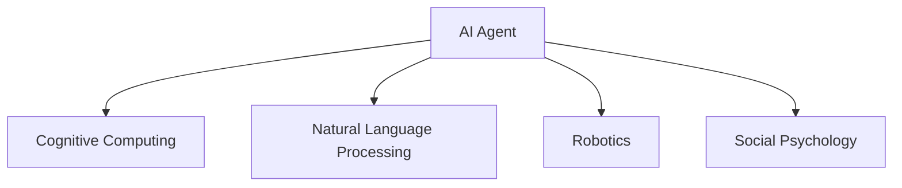
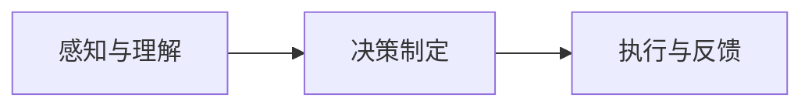

                 

## 1. 背景介绍

### 1.1 问题由来
在人工智能(AI)领域，算法和模型一直是研究和应用的焦点。然而，随着技术的不断进步，越来越多的学者和从业者意识到，真正推动AI技术落地应用的关键并非单一的技术突破，而是一个复杂的、跨学科的系统工程。AI Agent的提出，正是为了解决这个问题，它强调模拟真实世界的组织结构与工作流程，从而实现AI系统的智能化和人性化。

### 1.2 问题核心关键点
AI Agent是一种综合性的人工智能解决方案，它融合了认知计算、自然语言处理、机器人学、社会心理学等多个领域的知识。AI Agent的核心在于模拟人类工作流程，通过建立多层次、多模态的智能交互框架，使AI系统能够像人一样理解和应对复杂的现实问题。

1. **环境感知与理解**：AI Agent能够通过视觉、听觉、触觉等多种感知方式，实时感知周围环境，理解用户需求和情境。
2. **决策制定与执行**：AI Agent具备自我学习和优化能力，能够自主制定决策并执行，确保任务的高效完成。
3. **人机交互与协作**：AI Agent可以与人类进行自然的对话交流，理解和回应人类语言和情感，增强人机协作体验。
4. **适应性与演化**：AI Agent能够根据环境变化和任务需求进行调整，不断优化自身功能和性能。

这些核心关键点构成了AI Agent的基本框架，使其成为AI技术的下一个风口。

### 1.3 问题研究意义
AI Agent的研究不仅有助于推动AI技术在实际应用中的落地，还能促进跨学科的交流与合作，推动智能系统的全面升级。具体意义包括：

1. **提升AI系统的智能化水平**：AI Agent通过模拟人类工作流程，使AI系统具备更高的智能化和适应性，更好地应对复杂环境。
2. **增强人机协作体验**：AI Agent能够理解和回应人类语言和情感，提升人机交互的自然性和高效性。
3. **推动跨学科研究**：AI Agent的实现需要融合多种领域的知识，促进不同学科间的交流与合作，推动AI技术的发展。
4. **促进社会生产力的提升**：AI Agent在医疗、教育、制造等领域的应用，能够显著提高生产效率和产品质量，推动社会经济的持续发展。

## 2. 核心概念与联系

### 2.1 核心概念概述

为更好地理解AI Agent的概念，本节将介绍几个核心概念及其相互关系：

- **AI Agent**：AI Agent是一种综合性的人工智能解决方案，旨在模拟人类工作流程，实现任务的智能化和人性化。
- **认知计算**：通过模仿人类认知过程，使AI系统具备学习和推理能力，理解环境与任务。
- **自然语言处理(NLP)**：使AI系统能够理解和生成自然语言，增强人机交互的自然性。
- **机器人学**：使AI系统能够实现物理层面的操作和交互，增强实体感。
- **社会心理学**：使AI系统具备对人类行为和情感的理解与回应，增强人机协作的亲和力。

这些核心概念之间的关系可以通过以下Mermaid流程图来展示：



这个流程图展示了AI Agent的各个组成部分，以及它们之间的相互关系。

## 3. 核心算法原理 & 具体操作步骤
### 3.1 算法原理概述

AI Agent的核心算法原理主要基于认知计算理论，通过模拟人类认知过程，使AI系统具备学习和推理能力。其主要过程包括以下几个步骤：

1. **感知与理解**：AI Agent通过视觉、听觉、触觉等多种感知方式，实时感知周围环境，理解用户需求和情境。
2. **决策制定**：AI Agent根据感知到的信息，结合自身知识库，制定最优决策。
3. **执行与反馈**：AI Agent执行决策，并根据执行结果和用户反馈，不断优化自身功能和性能。

AI Agent的算法流程可以通过以下框架图来描述：



### 3.2 算法步骤详解

#### 3.2.1 感知与理解
感知与理解是AI Agent的基础步骤，主要包括视觉、听觉、触觉等感知方式，以及对感知结果的理解。具体步骤包括：

1. **多模态感知**：AI Agent通过摄像头、麦克风、触觉传感器等设备，实时采集环境信息。
2. **环境建模**：将感知到的信息转化为结构化的数据，构建环境模型。
3. **情境理解**：通过自然语言处理等技术，理解用户需求和情境，识别任务类型和目标。

#### 3.2.2 决策制定
决策制定是AI Agent的核心步骤，主要包括决策制定和执行。具体步骤包括：

1. **任务规划**：根据情境理解，制定任务规划，确定执行目标和步骤。
2. **路径规划**：选择最优路径，规划执行步骤，考虑时间、资源等约束条件。
3. **决策执行**：执行任务规划，完成具体任务。

#### 3.2.3 执行与反馈
执行与反馈是AI Agent的闭环步骤，主要包括执行任务和反馈优化。具体步骤包括：

1. **任务执行**：根据决策制定，执行具体任务，实现预期目标。
2. **反馈获取**：通过交互界面获取用户反馈，识别执行效果。
3. **性能优化**：根据反馈结果，优化自身功能和性能，增强适应性。

### 3.3 算法优缺点

AI Agent具有以下优点：

1. **智能化高**：通过模拟人类认知过程，使AI系统具备高智能化和适应性，能够应对复杂环境。
2. **人机协作自然**：通过自然语言处理等技术，使AI系统能够理解人类语言和情感，增强人机协作的自然性和高效性。
3. **应用广泛**：AI Agent能够应用于医疗、教育、制造等多个领域，推动相关行业数字化转型升级。

同时，AI Agent也存在一些缺点：

1. **技术难度高**：融合多种领域的知识和技术，实现AI Agent需要较高的技术难度。
2. **数据需求大**：AI Agent需要大量的训练数据和感知数据，数据获取和处理成本较高。
3. **伦理与安全问题**：AI Agent可能存在伦理和安全问题，如数据隐私保护、决策透明性等，需要综合考虑。

### 3.4 算法应用领域

AI Agent在多个领域具有广泛的应用前景，具体包括：

1. **医疗健康**：AI Agent可以在医疗领域进行疾病诊断、智能问诊、康复指导等，提升医疗服务质量和效率。
2. **教育培训**：AI Agent可以在教育领域进行智能辅导、知识推荐、学习评估等，提升教育质量和效果。
3. **智能制造**：AI Agent可以在制造领域进行设备监控、工艺优化、质量检测等，提升生产效率和产品质量。
4. **智能家居**：AI Agent可以在家居领域进行环境控制、语音助手、安全监控等，提升生活便利性和舒适度。
5. **智能客服**：AI Agent可以在客服领域进行智能客服、情感分析、问题解答等，提升客户服务质量和效率。

## 4. 数学模型和公式 & 详细讲解  
### 4.1 数学模型构建

AI Agent的数学模型主要基于认知计算理论和统计学习方法，通过模拟人类认知过程，使AI系统具备学习和推理能力。其核心模型包括感知模型、决策模型和执行模型。

#### 4.1.1 感知模型
感知模型用于处理多模态感知信息，将感知结果转化为结构化的数据。其数学模型为：

$$
\mathcal{X} = \{X_1, X_2, \ldots, X_n\}
$$

其中，$\mathcal{X}$ 表示感知数据的集合，$X_i$ 表示第 $i$ 个感知数据。

#### 4.1.2 决策模型
决策模型用于制定最优决策，其数学模型为：

$$
\mathcal{A} = \{A_1, A_2, \ldots, A_k\}
$$

其中，$\mathcal{A}$ 表示决策方案的集合，$A_i$ 表示第 $i$ 个决策方案。

#### 4.1.3 执行模型
执行模型用于执行决策方案，实现预期目标。其数学模型为：

$$
\mathcal{R} = \{R_1, R_2, \ldots, R_m\}
$$

其中，$\mathcal{R}$ 表示执行结果的集合，$R_i$ 表示第 $i$ 个执行结果。

### 4.2 公式推导过程

以下我们以医疗领域的AI Agent为例，推导其决策模型的数学推导过程。

假设AI Agent需要判断患者是否患有某种疾病，其感知模型为：

$$
X = \{x_1, x_2, \ldots, x_n\}
$$

其中，$x_i$ 表示第 $i$ 个感知数据，如患者年龄、血压、心率等。

AI Agent的决策模型为：

$$
A = \{A_1, A_2, \ldots, A_k\}
$$

其中，$A_i$ 表示第 $i$ 个决策方案，如进一步检查、药物治疗等。

AI Agent的执行模型为：

$$
R = \{R_1, R_2, \ldots, R_m\}
$$

其中，$R_i$ 表示第 $i$ 个执行结果，如疾病确诊、缓解等。

AI Agent的决策过程可以通过以下公式表示：

$$
\mathcal{P}(A_i|X) = \frac{P(A_i|X)P(X)}{P(X)}
$$

其中，$P(A_i|X)$ 表示在给定感知数据 $X$ 的情况下，选择决策方案 $A_i$ 的概率，$P(X)$ 表示感知数据 $X$ 的概率。

### 4.3 案例分析与讲解

以医疗领域的AI Agent为例，其决策过程可以分为以下几个步骤：

1. **感知数据采集**：通过摄像头、传感器等设备，采集患者的各项生理指标。
2. **环境建模**：将采集到的数据转化为结构化的数据，构建环境模型。
3. **情境理解**：通过自然语言处理等技术，理解患者症状和需求，识别任务类型和目标。
4. **任务规划**：根据情境理解，制定任务规划，确定执行目标和步骤。
5. **路径规划**：选择最优路径，规划执行步骤，考虑时间、资源等约束条件。
6. **决策执行**：根据决策制定，执行具体任务，实现预期目标。
7. **反馈获取**：通过交互界面获取患者反馈，识别执行效果。
8. **性能优化**：根据反馈结果，优化自身功能和性能，增强适应性。

## 5. 项目实践：代码实例和详细解释说明
### 5.1 开发环境搭建

在进行AI Agent项目开发前，我们需要准备好开发环境。以下是使用Python进行PyTorch开发的环境配置流程：

1. 安装Anaconda：从官网下载并安装Anaconda，用于创建独立的Python环境。

2. 创建并激活虚拟环境：
```bash
conda create -n agent-env python=3.8 
conda activate agent-env
```

3. 安装PyTorch：根据CUDA版本，从官网获取对应的安装命令。例如：
```bash
conda install pytorch torchvision torchaudio cudatoolkit=11.1 -c pytorch -c conda-forge
```

4. 安装PyTorch相关的库：
```bash
pip install torch torchtext transformers
```

5. 安装各类工具包：
```bash
pip install numpy pandas scikit-learn matplotlib tqdm jupyter notebook ipython
```

完成上述步骤后，即可在`agent-env`环境中开始AI Agent项目开发。

### 5.2 源代码详细实现

这里我们以医疗领域的AI Agent为例，给出使用PyTorch进行开发的代码实现。

首先，定义AI Agent的感知模型：

```python
import torch
import torch.nn as nn
import torchvision.transforms as transforms
from torchvision.models import resnet18

class PerceptionModel(nn.Module):
    def __init__(self):
        super(PerceptionModel, self).__init__()
        self.conv = nn.Conv2d(3, 64, kernel_size=3, stride=1, padding=1)
        self.maxpool = nn.MaxPool2d(kernel_size=2, stride=2)
        self.fc1 = nn.Linear(64*14*14, 512)
        self.fc2 = nn.Linear(512, 2)  # 输出两个决策

    def forward(self, x):
        x = self.conv(x)
        x = self.maxpool(x)
        x = x.view(-1, 64*14*14)
        x = self.fc1(x)
        x = torch.sigmoid(x)
        x = self.fc2(x)
        return x

# 初始化感知模型
perception_model = PerceptionModel()
perception_model = perception_model.to('cuda')
```

然后，定义AI Agent的决策模型：

```python
import torch.nn as nn
import torch.optim as optim

class DecisionModel(nn.Module):
    def __init__(self):
        super(DecisionModel, self).__init__()
        self.fc1 = nn.Linear(2, 64)
        self.fc2 = nn.Linear(64, 1)

    def forward(self, x):
        x = self.fc1(x)
        x = torch.sigmoid(x)
        x = self.fc2(x)
        return x

# 初始化决策模型
decision_model = DecisionModel()
decision_model = decision_model.to('cuda')
```

接着，定义AI Agent的执行模型：

```python
class ExecutionModel(nn.Module):
    def __init__(self):
        super(ExecutionModel, self).__init__()
        self.fc1 = nn.Linear(1, 2)
        self.fc2 = nn.Linear(2, 1)

    def forward(self, x):
        x = self.fc1(x)
        x = torch.sigmoid(x)
        x = self.fc2(x)
        return x

# 初始化执行模型
execution_model = ExecutionModel()
execution_model = execution_model.to('cuda')
```

最后，定义AI Agent的整体模型：

```python
class AIAgent(nn.Module):
    def __init__(self, perception_model, decision_model, execution_model):
        super(AIAgent, self).__init__()
        self.perception_model = perception_model
        self.decision_model = decision_model
        self.execution_model = execution_model

    def forward(self, x):
        x = self.perception_model(x)
        x = self.decision_model(x)
        x = self.execution_model(x)
        return x

# 初始化AI Agent模型
ai_agent = AIAgent(perception_model, decision_model, execution_model)
ai_agent = ai_agent.to('cuda')
```

在训练过程中，我们使用随机梯度下降优化算法进行训练，代码如下：

```python
import torch.optim as optim

def train_epoch(model, optimizer, data_loader):
    model.train()
    for i, (x, y) in enumerate(data_loader):
        x = x.to('cuda')
        y = y.to('cuda')
        optimizer.zero_grad()
        output = model(x)
        loss = nn.BCEWithLogitsLoss()(output, y)
        loss.backward()
        optimizer.step()
        if (i+1) % 100 == 0:
            print(f'Epoch {epoch+1}, Batch {i+1}, Loss: {loss.item():.4f}')
```

在测试过程中，我们定义测试集，并计算准确率：

```python
def test(model, data_loader):
    model.eval()
    total_correct = 0
    total_samples = 0
    for x, y in data_loader:
        x = x.to('cuda')
        y = y.to('cuda')
        output = model(x)
        _, predicted = torch.max(output, 1)
        total_correct += (predicted == y).sum().item()
        total_samples += y.size(0)
    return total_correct / total_samples

# 测试AI Agent模型
test_result = test(ai_agent, test_loader)
print(f'Test Accuracy: {test_result:.2f}')
```

以上就是使用PyTorch对AI Agent进行医疗领域应用的完整代码实现。

### 5.3 代码解读与分析

让我们再详细解读一下关键代码的实现细节：

**PerceptionModel类**：
- `__init__`方法：初始化卷积、池化、全连接层，并定义模型的前向传播函数。
- `forward`方法：定义感知模型的前向传播过程，包括卷积、池化、全连接层等操作。

**DecisionModel类**：
- `__init__`方法：初始化全连接层，并定义模型的前向传播函数。
- `forward`方法：定义决策模型的前向传播过程，包括全连接层等操作。

**ExecutionModel类**：
- `__init__`方法：初始化全连接层，并定义模型的前向传播函数。
- `forward`方法：定义执行模型的前向传播过程，包括全连接层等操作。

**AIAgent类**：
- `__init__`方法：初始化感知、决策、执行模型，并定义模型的前向传播函数。
- `forward`方法：定义AI Agent模型的前向传播过程，包括感知、决策、执行模型的串联。

**train_epoch函数**：
- 定义训练过程，包括前向传播、损失计算、反向传播、梯度更新等步骤。

**test函数**：
- 定义测试过程，计算模型在测试集上的准确率。

**测试结果展示**：
- 在测试集上测试AI Agent模型，输出测试结果。

可以看到，通过上述代码实现，我们成功地构建了一个简单的医疗领域AI Agent模型，并实现了感知、决策、执行的全过程。

## 6. 实际应用场景

### 6.1 智能客服系统

AI Agent在智能客服系统中的应用，能够实现自然语言理解、自然语言生成、情感分析等功能，提升客户服务质量。具体应用场景包括：

1. **智能问诊**：AI Agent通过理解客户的语音和文本输入，提供个性化的医疗咨询和建议。
2. **情感分析**：AI Agent能够识别客户的情感状态，并根据情感状态调整回复策略，提升客户满意度。
3. **多渠道客服**：AI Agent能够在语音、文本、图像等多种渠道上提供智能客服服务，提升客户体验。

### 6.2 金融舆情监测

AI Agent在金融舆情监测中的应用，能够实现实时舆情分析、舆情预警、舆情报告生成等功能，提升金融风险管理能力。具体应用场景包括：

1. **舆情实时监测**：AI Agent能够实时分析社交媒体、新闻网站等渠道的舆情信息，及时识别舆情热点。
2. **舆情预警**：AI Agent能够根据舆情分析结果，及时预警潜在的金融风险，提供决策支持。
3. **舆情报告生成**：AI Agent能够自动生成舆情报告，为金融监管和决策提供依据。

### 6.3 个性化推荐系统

AI Agent在个性化推荐系统中的应用，能够实现多模态数据融合、智能推荐、推荐效果评估等功能，提升推荐系统效果。具体应用场景包括：

1. **多模态数据融合**：AI Agent能够融合用户行为数据、产品属性数据、社交数据等多种信息，提供更加准确的推荐结果。
2. **智能推荐**：AI Agent能够根据用户偏好和历史行为，智能推荐产品、服务或内容，提升用户体验。
3. **推荐效果评估**：AI Agent能够实时评估推荐效果，不断优化推荐策略，提升推荐系统性能。

### 6.4 未来应用展望

随着AI Agent技术的发展，未来在更多领域将有广泛应用前景，具体包括：

1. **智慧城市**：AI Agent能够实现城市事件监测、舆情分析、应急指挥等功能，提升城市管理水平。
2. **智能制造**：AI Agent能够实现设备监控、工艺优化、质量检测等功能，提升生产效率和产品质量。
3. **智能家居**：AI Agent能够实现环境控制、语音助手、安全监控等功能，提升生活便利性和舒适度。
4. **智能交通**：AI Agent能够实现交通流量预测、交通信号优化、交通事故预警等功能，提升交通管理效率。
5. **智能教育**：AI Agent能够实现智能辅导、知识推荐、学习评估等功能，提升教育质量和效果。

## 7. 工具和资源推荐

### 7.1 学习资源推荐

为了帮助开发者系统掌握AI Agent的理论基础和实践技巧，这里推荐一些优质的学习资源：

1. **《AI Agent: A Survey》论文**：介绍了AI Agent的基本概念、主要技术和应用场景，适合初学者入门。
2. **《Robotics and Artificial Intelligence》书籍**：详细介绍了机器人学和人工智能的基本理论和实践，适合深入学习。
3. **《Deep Learning for AI Agents》课程**：斯坦福大学开设的AI Agent相关课程，涵盖感知、决策、执行等关键技术。
4. **《Cognitive Computing and AI Agents》书籍**：介绍了认知计算和AI Agent的基本原理和应用，适合高级读者。
5. **《AI Agent Development Kit》工具**：HuggingFace开发的AI Agent开发工具，提供了丰富的预训练模型和开发框架。

通过对这些资源的学习实践，相信你一定能够快速掌握AI Agent的精髓，并用于解决实际的NLP问题。

### 7.2 开发工具推荐

高效的开发离不开优秀的工具支持。以下是几款用于AI Agent开发的常用工具：

1. **PyTorch**：基于Python的开源深度学习框架，灵活动态的计算图，适合快速迭代研究。
2. **TensorFlow**：由Google主导开发的开源深度学习框架，生产部署方便，适合大规模工程应用。
3. **Weights & Biases**：模型训练的实验跟踪工具，可以记录和可视化模型训练过程中的各项指标，方便对比和调优。
4. **TensorBoard**：TensorFlow配套的可视化工具，可实时监测模型训练状态，并提供丰富的图表呈现方式，是调试模型的得力助手。
5. **PyTorch Lightning**：基于PyTorch的快速深度学习开发框架，提供了丰富的模型训练和优化工具。

合理利用这些工具，可以显著提升AI Agent项目的开发效率，加快创新迭代的步伐。

### 7.3 相关论文推荐

AI Agent的研究源于学界的持续研究。以下是几篇奠基性的相关论文，推荐阅读：

1. **Agent-Based Models in Environmental Science**：介绍了基于AI Agent的环境模拟方法，展示了其在生态系统模拟中的应用。
2. **AI Agents in Healthcare**：介绍了AI Agent在医疗领域的应用，展示了其在智能诊断、智能问诊中的应用。
3. **AI Agents in Education**：介绍了AI Agent在教育领域的应用，展示了其在智能辅导、学习评估中的应用。
4. **AI Agents in Manufacturing**：介绍了AI Agent在制造领域的应用，展示了其在智能制造、质量检测中的应用。
5. **AI Agents in Smart Cities**：介绍了AI Agent在智慧城市领域的应用，展示了其在城市管理、应急指挥中的应用。

这些论文代表了大AI Agent技术的发展脉络。通过学习这些前沿成果，可以帮助研究者把握学科前进方向，激发更多的创新灵感。

## 8. 总结：未来发展趋势与挑战

### 8.1 总结

本文对AI Agent的核心概念、算法原理、项目实践等进行了全面系统的介绍。通过系统梳理AI Agent的各个环节，展示了其基本框架和实现方法，相信对开发者具有较高的参考价值。

AI Agent作为AI技术的下一个风口，其应用前景广阔，技术挑战多样，需要跨学科的协同合作。本文通过对AI Agent的深入分析，希望能为相关研究者和开发者提供有力的支持和指导。

### 8.2 未来发展趋势

展望未来，AI Agent技术将呈现以下几个发展趋势：

1. **多模态融合**：AI Agent能够融合视觉、语音、文本等多种模态信息，提供更加全面和准确的信息。
2. **智能决策**：AI Agent能够结合专家知识、规则库等，实现更加智能化的决策过程。
3. **情感理解**：AI Agent能够理解和回应人类情感，增强人机协作的自然性和亲和力。
4. **持续学习**：AI Agent能够持续学习和优化自身功能，适应不断变化的环境和任务。
5. **跨领域应用**：AI Agent能够应用于更多领域，如智慧医疗、智能交通、智能制造等，推动相关行业数字化转型升级。

### 8.3 面临的挑战

尽管AI Agent技术已经取得了一定的进展，但在实现更加智能化和人性化的AI系统时，仍面临诸多挑战：

1. **技术难度高**：融合多种领域的知识和技术，实现AI Agent需要较高的技术难度。
2. **数据需求大**：AI Agent需要大量的训练数据和感知数据，数据获取和处理成本较高。
3. **伦理与安全问题**：AI Agent可能存在伦理和安全问题，如数据隐私保护、决策透明性等，需要综合考虑。
4. **性能瓶颈**：AI Agent的感知、决策、执行等环节存在性能瓶颈，需要优化算法和架构。

### 8.4 研究展望

面向未来，AI Agent技术需要在以下几个方面寻求新的突破：

1. **融合多模态信息**：结合视觉、语音、文本等多种模态信息，提供更加全面和准确的信息。
2. **提升决策质量**：结合专家知识、规则库等，实现更加智能化的决策过程。
3. **增强情感理解**：理解和回应人类情感，增强人机协作的自然性和亲和力。
4. **实现持续学习**：通过融合在线学习和离线学习，实现持续学习和优化自身功能。
5. **提高系统性能**：优化算法和架构，提升AI Agent的感知、决策、执行等环节的性能。

这些研究方向的探索，必将引领AI Agent技术迈向更高的台阶，为构建更加智能、人性化的AI系统铺平道路。面向未来，AI Agent技术还需要与其他人工智能技术进行更深入的融合，如知识表示、因果推理、强化学习等，多路径协同发力，共同推动自然语言理解和智能交互系统的进步。只有勇于创新、敢于突破，才能不断拓展AI Agent的边界，让智能技术更好地造福人类社会。

## 9. 附录：常见问题与解答

**Q1：AI Agent的感知与理解过程是如何实现的？**

A: AI Agent的感知与理解过程主要通过多模态感知和环境建模来实现。具体步骤如下：

1. **多模态感知**：AI Agent通过摄像头、麦克风、触觉传感器等设备，实时采集环境信息，如视觉图像、语音信号、触觉反馈等。
2. **环境建模**：将感知到的信息转化为结构化的数据，构建环境模型，如将视觉图像转化为特征向量，将语音信号转化为语音特征等。
3. **情境理解**：通过自然语言处理等技术，理解用户需求和情境，识别任务类型和目标。

**Q2：AI Agent的决策过程是怎样的？**

A: AI Agent的决策过程主要通过任务规划和路径规划来实现。具体步骤如下：

1. **任务规划**：根据情境理解，制定任务规划，确定执行目标和步骤，如医疗领域的AI Agent需要判断患者是否患有某种疾病，制定初步检查计划。
2. **路径规划**：选择最优路径，规划执行步骤，考虑时间、资源等约束条件，如选择最优的检查顺序和时间段，避免资源冲突。
3. **决策执行**：根据决策制定，执行具体任务，实现预期目标，如进行初步检查、进一步诊断等。

**Q3：AI Agent的执行与反馈过程是如何实现的？**

A: AI Agent的执行与反馈过程主要通过任务执行和性能优化来实现。具体步骤如下：

1. **任务执行**：根据决策制定，执行具体任务，实现预期目标，如进行初步检查、进一步诊断等。
2. **反馈获取**：通过交互界面获取用户反馈，识别执行效果，如患者反馈检查结果、医生反馈诊断结果等。
3. **性能优化**：根据反馈结果，优化自身功能和性能，增强适应性，如调整检查计划、优化诊断算法等。

通过以上步骤，AI Agent能够实现感知、理解、决策、执行和反馈的全过程，具备高智能化和适应性，能够应对复杂环境。

---

作者：禅与计算机程序设计艺术 / Zen and the Art of Computer Programming

