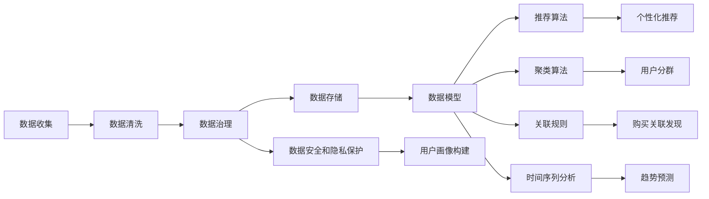

                 

# AI DMP 数据基建：数据模型与算法

## 1. 背景介绍

### 1.1 问题由来

随着互联网应用的普及和数字化进程的加快，用户数据逐渐成为各大企业最重要的资产之一。如何有效地收集、存储和利用这些数据，通过智能决策支持业务增长和用户个性化服务，是企业数字化转型中的关键课题。在此背景下，数据管理平台（Data Management Platform, DMP）应运而生。DMP作为集数据收集、存储、清洗、分析、应用于一体的数据基础设施，能够实现数据资源的高效整合和利用，成为推动数字化商业发展的核心引擎。

DMP的核心在于数据模型与算法，通过构建和优化数据模型，结合先进的算法技术，对海量用户数据进行深度挖掘和分析，产生有价值的洞察，驱动商业决策。本文将深入探讨DMP的数据模型与算法，通过理论分析与实践案例相结合的方式，详细介绍其核心原理和具体操作步骤，希望能为读者提供清晰的思路和实用的指导。

### 1.2 问题核心关键点

本文聚焦于AI DMP中数据模型与算法的构建与应用，核心关键点包括：
- 数据模型：指用于描述和组织数据结构的概念化模型，包括用户画像、行为轨迹、互动特征等，是DMP数据建模的基础。
- 算法技术：指在数据模型基础上，用于数据挖掘和分析的算法，如推荐算法、聚类算法、关联规则等，是DMP数据应用的核心。
- 数据基建：指基于数据模型与算法的DMP架构设计，包括数据源整合、数据治理、数据服务等，是DMP技术的支撑。
- 应用实践：指通过DMP实现的各种商业应用，如个性化推荐、广告投放、用户细分等，是DMP技术落地的具体场景。

这些关键点构成了AI DMP技术的核心框架，通过理解这些关键概念，我们可以更好地把握DMP的构建思路和应用策略。

## 2. 核心概念与联系

### 2.1 核心概念概述

DMP中的数据模型与算法，涉及多领域知识，需要跨学科综合应用。以下列举一些核心概念及其关联：

- **数据模型**：指用于描述和组织数据结构的概念化模型。常见的数据模型包括用户画像、行为轨迹、互动特征等。用户画像描述用户的基本属性、兴趣偏好、行为模式等；行为轨迹记录用户在网络上的行为路径，包括浏览、点击、购买等行为；互动特征描述用户与内容的互动情况，如评论、分享、评分等。
- **数据治理**：指对数据进行管理、监控和优化的过程，包括数据源整合、数据质量管理、数据安全等。数据治理是DMP运行的基础，确保数据的准确性、完整性和安全性。
- **推荐算法**：指通过分析用户行为和互动特征，为每位用户推荐个性化内容或商品。推荐算法如协同过滤、基于内容的推荐、深度学习推荐等。
- **聚类算法**：指将用户划分为不同群体，用于市场细分、用户分群等。常见的聚类算法如K-means、层次聚类、DBSCAN等。
- **关联规则**：指通过分析用户行为和商品之间的关系，发现潜在的购买关联。关联规则算法如Apriori、FP-growth等。
- **时间序列分析**：指通过时间序列数据建模和分析，预测用户行为趋势和变化规律。时间序列算法如ARIMA、LSTM等。
- **用户分群**：指根据用户行为和互动特征，将用户划分为不同群体，用于个性化推荐、广告投放等。用户分群算法如FCM、Louvain等。

这些核心概念通过数据治理和技术算法，相互联系，共同构成了DMP的数据基建框架。

### 2.2 核心概念原理和架构的 Mermaid 流程图



该图展示了DMP核心概念之间的关联和流动。数据从收集开始，经过清洗和治理，最终存储和建模，然后通过算法分析产生洞察，服务于商业决策。

## 3. 核心算法原理 & 具体操作步骤

### 3.1 算法原理概述

DMP中的数据模型与算法，主要基于统计学、机器学习、数据挖掘等方法，通过建模和分析，实现数据的深度挖掘和价值提取。其核心原理包括以下几个方面：

1. **数据建模**：将原始数据通过概念化模型进行组织和描述，形成结构化数据。常见的数据模型如用户画像、行为轨迹等，通过属性和维度的设计，描述用户的基本信息、行为特征和互动情况。
2. **算法分析**：在数据模型的基础上，使用各种算法进行深度挖掘和分析，提取有用的信息。如通过推荐算法预测用户兴趣，通过聚类算法发现用户群体，通过关联规则分析用户行为与商品之间的关联性等。
3. **数据治理**：确保数据的准确性、完整性和安全性，是DMP运行的基础。包括数据源整合、数据质量管理、数据安全等，确保数据的可用性和可靠性。

### 3.2 算法步骤详解

DMP的数据模型与算法构建主要包括以下几个步骤：

**Step 1: 数据收集和预处理**
- 收集来自不同渠道的用户数据，包括线上和线下的行为数据、交易数据、社交数据等。
- 对数据进行清洗和预处理，去除噪音和异常值，标准化数据格式，确保数据质量。

**Step 2: 数据建模**
- 设计用户画像、行为轨迹、互动特征等数据模型，对数据进行概念化描述和组织。
- 通过统计学方法，对用户画像和行为轨迹进行建模，如构建用户画像的特征向量，设计行为轨迹的时间序列模型等。
- 使用机器学习方法，对互动特征进行建模，如构建用户与内容的互动矩阵，设计互动特征的特征向量等。

**Step 3: 算法分析**
- 根据业务需求，选择合适的算法进行数据挖掘和分析，如推荐算法、聚类算法、关联规则等。
- 在推荐算法中，使用协同过滤、基于内容的推荐、深度学习推荐等方法，为每位用户推荐个性化内容或商品。
- 在聚类算法中，使用K-means、层次聚类、DBSCAN等方法，将用户划分为不同群体，用于市场细分和用户分群。
- 在关联规则中，使用Apriori、FP-growth等方法，发现用户行为与商品之间的购买关联。
- 在使用时间序列分析时，可以使用ARIMA、LSTM等方法，预测用户行为趋势和变化规律。

**Step 4: 数据治理**
- 对数据进行治理，包括数据源整合、数据质量管理、数据安全等。
- 通过数据源整合，将来自不同渠道的数据进行统一管理和集成。
- 通过数据质量管理，确保数据的准确性、完整性和一致性。
- 通过数据安全保护，确保数据的隐私和安全，防止数据泄露和滥用。

**Step 5: 数据应用**
- 将数据模型和算法分析结果应用于商业决策，如个性化推荐、广告投放、用户细分等。
- 通过个性化推荐，提升用户体验和转化率，增加用户粘性。
- 通过广告投放，精准定位用户群体，提高广告投放效果和ROI。
- 通过用户细分，实现市场细分和目标客户管理，优化营销策略。

### 3.3 算法优缺点

DMP的数据模型与算法具有以下优点：
1. 高效性：通过优化数据模型和算法，能够快速处理大量数据，提升数据挖掘和分析的效率。
2. 可扩展性：DMP的数据模型与算法可以根据业务需求灵活调整，适应不同的业务场景。
3. 精准性：通过精确的数据建模和算法分析，能够准确预测用户行为和需求，提升决策精准度。
4. 自动化：DMP的数据模型与算法能够自动化运行，减少人工干预和出错风险。

同时，DMP的数据模型与算法也存在一些局限：
1. 数据依赖性强：DMP的效果很大程度上依赖于数据质量，对数据源的完整性和准确性要求较高。
2. 模型复杂度高：构建和维护复杂的数据模型和算法，需要较高的技术门槛和资源投入。
3. 隐私风险高：用户数据涉及个人隐私，DMP需要严格遵守隐私保护法规，防止数据滥用和泄露。
4. 应用场景有限：DMP主要应用于线上和线下结合的业务场景，对纯线上或线下场景的支持有限。

尽管存在这些局限，但DMP的数据模型与算法在数据驱动的商业决策中发挥了重要作用，为各行业带来了显著的商业价值。

### 3.4 算法应用领域

DMP的数据模型与算法在多个领域得到了广泛应用，具体包括：

**1. 个性化推荐**
- 通过分析用户行为和互动特征，为每位用户推荐个性化内容或商品。DMP的数据模型和算法能够精确预测用户兴趣和需求，提升推荐效果，增加用户粘性。

**2. 广告投放**
- 通过聚类算法将用户划分为不同群体，实现精准的广告投放。DMP的数据模型和算法能够根据用户特征和行为，优化广告投放策略，提高广告投放效果和ROI。

**3. 用户细分**
- 通过聚类算法将用户划分为不同群体，实现市场细分和目标客户管理。DMP的数据模型和算法能够帮助企业识别高价值客户，优化营销策略，提升市场竞争力。

**4. 行为预测**
- 通过时间序列分析预测用户行为趋势和变化规律，为企业决策提供有力支持。DMP的数据模型和算法能够预测用户未来的行为，帮助企业提前布局，抢占市场先机。

**5. 商品关联分析**
- 通过关联规则分析用户行为与商品之间的关联性，发现潜在的购买关联。DMP的数据模型和算法能够帮助企业发现商品的销售规律，优化商品组合和库存管理。

**6. 内容推荐**
- 通过推荐算法为内容平台推荐个性化内容，提升用户粘性和平台活跃度。DMP的数据模型和算法能够根据用户行为和互动特征，实现内容推荐，提升用户满意度。

以上应用领域展示了DMP数据模型与算法的广泛应用，为各行业带来了显著的商业价值。

## 4. 数学模型和公式 & 详细讲解  
### 4.1 数学模型构建

DMP中的数据模型与算法构建，主要基于统计学和机器学习的数学模型。以下是一些常见的数学模型及其构建方法：

**用户画像模型**
- 描述用户的属性和行为特征，通常使用向量空间模型，将用户画像表示为高维特征向量。
- 用户画像建模的数学模型为：$\mathbf{u} = \mathbf{A} \mathbf{x}$，其中 $\mathbf{u}$ 为用户画像向量，$\mathbf{A}$ 为特征矩阵，$\mathbf{x}$ 为特征权重向量。

**行为轨迹模型**
- 描述用户在不同时间点的行为序列，通常使用时间序列模型，如ARIMA、LSTM等。
- 行为轨迹建模的数学模型为：$\mathbf{y} = \mathbf{C} \mathbf{x} + \mathbf{e}$，其中 $\mathbf{y}$ 为行为轨迹序列，$\mathbf{C}$ 为时间权重矩阵，$\mathbf{x}$ 为特征权重向量，$\mathbf{e}$ 为误差项。

**推荐算法模型**
- 描述用户与内容之间的互动关系，通常使用协同过滤、基于内容的推荐等方法。
- 推荐算法建模的数学模型为：$\mathbf{r} = \mathbf{U} \mathbf{V}^T + \mathbf{b}$，其中 $\mathbf{r}$ 为用户对内容的评分矩阵，$\mathbf{U}$ 为用户权重矩阵，$\mathbf{V}$ 为内容权重矩阵，$\mathbf{b}$ 为偏置项。

### 4.2 公式推导过程

以用户画像模型为例，介绍其数学推导过程。

**用户画像模型推导**

用户画像模型通常使用向量空间模型进行表示，将用户画像表示为高维特征向量。设用户画像 $\mathbf{u}$ 包含 $n$ 个特征，每个特征权重为 $w_i$，特征矩阵 $\mathbf{A}$ 为 $m \times n$ 矩阵，特征权重向量 $\mathbf{x}$ 为 $n \times 1$ 矩阵，则用户画像模型为：

$$
\mathbf{u} = \mathbf{A} \mathbf{x}
$$

其中 $\mathbf{A}$ 的每一行表示用户画像的特征向量，$\mathbf{x}$ 的每个元素表示对应特征的权重。通过求解 $\mathbf{x}$，可以得到用户画像的特征权重，从而实现用户画像的建模。

### 4.3 案例分析与讲解

以用户推荐系统为例，介绍DMP中的推荐算法应用。

**用户推荐系统案例**

用户推荐系统通过分析用户行为和互动特征，为每位用户推荐个性化内容或商品。设用户行为矩阵 $\mathbf{R}$ 为 $m \times n$ 矩阵，用户权重矩阵 $\mathbf{U}$ 为 $m \times k$ 矩阵，内容权重矩阵 $\mathbf{V}$ 为 $n \times k$ 矩阵，偏置项 $\mathbf{b}$ 为 $m \times 1$ 矩阵，则推荐算法模型为：

$$
\mathbf{r} = \mathbf{U} \mathbf{V}^T + \mathbf{b}
$$

其中 $\mathbf{r}$ 为用户对内容的评分矩阵，$\mathbf{U}$ 为用户权重矩阵，$\mathbf{V}$ 为内容权重矩阵，$\mathbf{b}$ 为偏置项。通过求解 $\mathbf{U}$ 和 $\mathbf{V}$，可以得到用户和内容的特征权重，从而实现推荐算法的建模。

具体推导过程如下：

1. 用户行为矩阵 $\mathbf{R}$ 通过统计用户对内容的评分，生成 $m \times n$ 矩阵，其中 $m$ 为内容数量，$n$ 为用户数量。
2. 用户权重矩阵 $\mathbf{U}$ 通过统计用户的历史评分和互动情况，生成 $m \times k$ 矩阵，其中 $k$ 为特征数量。
3. 内容权重矩阵 $\mathbf{V}$ 通过统计内容的属性和特征，生成 $n \times k$ 矩阵。
4. 偏置项 $\mathbf{b}$ 通过统计内容的平均评分和用户互动情况，生成 $m \times 1$ 矩阵。
5. 将 $\mathbf{R}$、$\mathbf{U}$、$\mathbf{V}$、$\mathbf{b}$ 代入推荐算法模型，求解 $\mathbf{U}$ 和 $\mathbf{V}$，得到用户和内容的特征权重。
6. 通过求解 $\mathbf{U}$ 和 $\mathbf{V}$，得到用户和内容的特征权重，从而实现推荐算法的建模。

## 5. 项目实践：代码实例和详细解释说明
### 5.1 开发环境搭建

在进行DMP数据建模和算法应用开发前，需要先搭建好开发环境。以下是使用Python和PyTorch进行DMP开发的常见环境配置步骤：

1. 安装Anaconda：从官网下载并安装Anaconda，用于创建独立的Python环境。
2. 创建并激活虚拟环境：
```bash
conda create -n dmp-env python=3.8 
conda activate dmp-env
```
3. 安装PyTorch：根据CUDA版本，从官网获取对应的安装命令。例如：
```bash
conda install pytorch torchvision torchaudio cudatoolkit=11.1 -c pytorch -c conda-forge
```
4. 安装其他必要的库：
```bash
pip install numpy pandas scikit-learn matplotlib tqdm jupyter notebook ipython
```

完成上述步骤后，即可在`dmp-env`环境中开始DMP数据建模和算法应用的开发。

### 5.2 源代码详细实现

以下是一个使用PyTorch进行用户推荐系统建模的代码实现：

```python
import torch
import torch.nn as nn
from torch.nn import Linear, Embedding
from torch.nn.functional import sigmoid

class UserRecommendationModel(nn.Module):
    def __init__(self, num_users, num_contents, num_features):
        super(UserRecommendationModel, self).__init__()
        self.user_weight = nn.Embedding(num_users, num_features)
        self.content_weight = nn.Embedding(num_contents, num_features)
        self.user_bias = nn.Parameter(torch.randn(num_users, 1))
        self.content_bias = nn.Parameter(torch.randn(num_contents, 1))

    def forward(self, user_id, content_id):
        user_weight = self.user_weight(user_id).view(-1, 1)
        content_weight = self.content_weight(content_id).view(-1, 1)
        user_bias = self.user_bias[user_id].view(-1, 1)
        content_bias = self.content_bias[content_id].view(-1, 1)
        predictions = user_weight * content_weight + user_bias + content_bias
        return predictions

# 构建用户行为矩阵
user_id = torch.LongTensor([0, 1, 2, 3, 4])
content_id = torch.LongTensor([0, 1, 2, 3, 4, 5])
R = torch.randn(user_id.size()[0], content_id.size()[0])
user_recommendation_model = UserRecommendationModel(num_users=5, num_contents=6, num_features=4)
predictions = user_recommendation_model(user_id, content_id)
print(predictions)
```

这段代码实现了基于协同过滤推荐算法的用户推荐系统，包括用户权重矩阵和内容权重矩阵的嵌入，以及偏置项的计算。通过用户ID和内容ID的输入，可以预测用户对内容的评分。

### 5.3 代码解读与分析

让我们再详细解读一下关键代码的实现细节：

**UserRecommendationModel类**
- `__init__`方法：初始化用户权重矩阵和内容权重矩阵，以及偏置项。
- `forward`方法：实现模型前向传播，计算用户对内容的评分预测。

**用户行为矩阵R**
- 使用`torch.LongTensor`创建用户ID和内容ID的张量。
- 使用`torch.randn`生成随机评分矩阵，作为用户行为矩阵。

**用户推荐系统代码**
- 实例化`UserRecommendationModel`类，传入用户数量、内容数量和特征数量。
- 使用`user_id`和`content_id`输入，计算用户对内容的评分预测，打印输出结果。

这段代码展示了基于协同过滤推荐算法的用户推荐系统建模过程，通过嵌入和加权的方式，实现了对用户行为和内容的建模，并生成了评分预测。

## 6. 实际应用场景

### 6.1 智能推荐系统

DMP中的推荐算法，在智能推荐系统中得到了广泛应用。智能推荐系统通过分析用户行为和互动特征，为每位用户推荐个性化内容或商品，提高用户体验和转化率。

在技术实现上，可以收集用户的浏览、点击、购买等行为数据，构建用户画像和行为轨迹模型。通过推荐算法，如协同过滤、基于内容的推荐、深度学习推荐等，为每位用户推荐个性化内容或商品。智能推荐系统已经被广泛应用于电商平台、视频平台、社交平台等，提高了用户粘性和平台活跃度。

### 6.2 广告投放优化

DMP中的广告投放优化，通过聚类算法将用户划分为不同群体，实现精准的广告投放。广告投放优化通过分析用户行为和互动特征，将用户划分为不同的群体，如高价值用户、潜在客户等，优化广告投放策略，提高广告投放效果和ROI。

在技术实现上，可以收集用户的历史行为数据，构建用户画像和行为轨迹模型。通过聚类算法，如K-means、层次聚类、DBSCAN等，将用户划分为不同群体。根据不同群体的特征，优化广告投放策略，如精准投放、定向广告等，提升广告投放效果和广告收入。

### 6.3 用户细分管理

DMP中的用户细分，通过聚类算法将用户划分为不同群体，实现市场细分和目标客户管理。用户细分通过分析用户行为和互动特征，将用户划分为不同的群体，如高价值客户、忠诚客户等，优化营销策略，提升市场竞争力。

在技术实现上，可以收集用户的历史行为数据，构建用户画像和行为轨迹模型。通过聚类算法，如K-means、层次聚类、DBSCAN等，将用户划分为不同群体。根据不同群体的特征，制定针对性的营销策略，如个性化推荐、定向广告等，提升市场竞争力。

### 6.4 未来应用展望

随着DMP技术的不断发展，其数据模型与算法将在更多领域得到应用，为传统行业带来变革性影响。

在智慧医疗领域，DMP可以帮助医疗机构分析患者数据，实现精准医疗和个性化治疗。在智能交通领域，DMP可以分析交通流量数据，优化交通管理和调度。在金融领域，DMP可以帮助金融机构分析用户行为，优化信用评估和风险管理。

总之，DMP的数据模型与算法在多个领域具有广泛应用前景，为各行各业带来了新的机遇和挑战。未来，随着技术的不断进步和数据的持续积累，DMP将成为企业数字化转型的核心引擎，推动数字化商业的全面升级。

## 7. 工具和资源推荐

### 7.1 学习资源推荐

为了帮助开发者系统掌握DMP的数据模型与算法，以下是一些优质的学习资源：

1. 《数据科学与机器学习基础》系列书籍：全面介绍数据科学和机器学习的基本概念和方法，适合初学者入门。
2. 《Python数据科学手册》：介绍Python在数据科学和机器学习中的应用，包括数据处理、数据分析、模型构建等。
3. 《深度学习》课程：斯坦福大学开设的深度学习课程，涵盖深度学习的理论基础和实践应用，适合进阶学习。
4. 《机器学习实战》书籍：介绍机器学习算法的实现和应用，适合动手实践。
5. 《PyTorch深度学习入门》书籍：介绍PyTorch框架的使用方法和深度学习算法的实现，适合动手实践。

通过对这些资源的学习实践，相信你一定能够快速掌握DMP的数据模型与算法的精髓，并用于解决实际的商业问题。

### 7.2 开发工具推荐

高效的开发离不开优秀的工具支持。以下是几款用于DMP数据建模和算法开发的常用工具：

1. Python：Python是数据科学和机器学习的主流语言，具有丰富的数据处理和分析库，如Pandas、NumPy、Scikit-learn等。
2. PyTorch：基于Python的深度学习框架，具有动态计算图和自动微分功能，适合快速迭代研究。
3. TensorFlow：由Google主导开发的深度学习框架，生产部署方便，适合大规模工程应用。
4. Weights & Biases：模型训练的实验跟踪工具，可以记录和可视化模型训练过程中的各项指标，方便对比和调优。
5. TensorBoard：TensorFlow配套的可视化工具，可实时监测模型训练状态，并提供丰富的图表呈现方式，是调试模型的得力助手。
6. Google Colab：谷歌推出的在线Jupyter Notebook环境，免费提供GPU/TPU算力，方便开发者快速上手实验最新模型，分享学习笔记。

合理利用这些工具，可以显著提升DMP数据建模和算法的开发效率，加快创新迭代的步伐。

### 7.3 相关论文推荐

DMP的数据模型与算法在研究领域也得到了广泛关注，以下是几篇奠基性的相关论文，推荐阅读：

1. "The Recommender Systems Handbook" 书籍：全面介绍推荐系统的发展历程和算法实现，适合深入了解推荐算法。
2. "Data Mining and Statistical Learning" 书籍：介绍数据挖掘和统计学习的基本概念和方法，适合理解数据模型和算法原理。
3. "Introduction to Machine Learning with PyTorch" 书籍：介绍PyTorch框架的使用方法和深度学习算法的实现，适合动手实践。
4. "Collaborative Filtering Techniques for Recommender Systems" 论文：介绍协同过滤推荐算法的原理和实现，适合理解推荐算法的细节。
5. "A Survey on Clustering Algorithms" 论文：介绍聚类算法的发展历程和算法实现，适合理解聚类算法的细节。
6. "Association Rule Mining Techniques" 论文：介绍关联规则算法的原理和实现，适合理解关联规则算法的细节。

这些论文代表了大数据领域的最新研究进展，通过学习这些前沿成果，可以帮助研究者把握学科前进方向，激发更多的创新灵感。

## 8. 总结：未来发展趋势与挑战

### 8.1 研究成果总结

本文详细介绍了DMP中的数据模型与算法，通过理论分析与实践案例相结合的方式，详细介绍其核心原理和操作步骤。具体内容如下：

1. **数据模型构建**：描述用户画像、行为轨迹、互动特征等数据模型的概念和构建方法。
2. **算法分析应用**：介绍推荐算法、聚类算法、关联规则等算法的原理和实现方法。
3. **数据治理优化**：阐述数据治理的基础作用，包括数据源整合、数据质量管理、数据安全等。
4. **实际应用场景**：展示智能推荐系统、广告投放优化、用户细分管理等实际应用场景。

通过这些内容的系统梳理，可以看出，DMP的数据模型与算法在多个领域具有广泛应用前景，为传统行业带来了新的机遇和挑战。

### 8.2 未来发展趋势

展望未来，DMP的数据模型与算法将呈现以下几个发展趋势：

1. **数据融合技术**：通过融合多种数据源，实现数据的多模态融合，提升数据的完整性和准确性。
2. **深度学习模型**：采用深度学习模型，如神经网络、Transformer等，提升数据的挖掘能力和分析精度。
3. **联邦学习**：通过联邦学习技术，实现数据的分布式处理和隐私保护，提升数据的安全性和隐私性。
4. **自动化建模**：采用自动化建模技术，如自动化特征工程、自动化超参数优化等，提升模型的建模效率和精度。
5. **实时计算技术**：采用实时计算技术，如Spark Streaming、Flink等，实现数据的实时处理和分析，提升系统的响应速度和实时性。
6. **混合决策机制**：采用混合决策机制，将数据模型和人工决策相结合，提升系统的决策精准度和灵活性。

这些发展趋势将进一步推动DMP技术的进步，提升其在实际应用中的效果和价值。

### 8.3 面临的挑战

尽管DMP的数据模型与算法在多个领域得到了广泛应用，但在迈向更加智能化、普适化应用的过程中，仍然面临诸多挑战：

1. **数据质量问题**：DMP的效果很大程度上依赖于数据质量，如何保证数据的完整性、准确性和一致性，是一个重要的挑战。
2. **模型复杂性**：构建和维护复杂的数据模型和算法，需要较高的技术门槛和资源投入，如何简化模型，提升建模效率，是一个亟待解决的问题。
3. **隐私和安全问题**：用户数据涉及个人隐私，如何保护用户隐私，防止数据滥用和泄露，是一个重要的安全挑战。
4. **计算资源问题**：大规模数据处理和模型训练需要大量的计算资源，如何优化计算资源使用，提升系统效率，是一个重要的技术挑战。
5. **应用场景限制**：DMP主要应用于线上和线下结合的业务场景，对纯线上或线下场景的支持有限，如何拓展应用场景，是一个重要的挑战。

尽管存在这些挑战，但DMP的数据模型与算法在数据驱动的商业决策中发挥了重要作用，为各行业带来了显著的商业价值。

### 8.4 研究展望

面对DMP数据模型与算法面临的挑战，未来的研究需要在以下几个方面寻求新的突破：

1. **数据质量提升**：通过数据清洗、数据标注、数据融合等技术，提升数据的质量和完整性。
2. **模型简化优化**：采用简单高效的模型结构，如线性模型、决策树等，提升模型的建模效率和精度。
3. **隐私保护技术**：采用差分隐私、联邦学习等技术，保护用户隐私，防止数据滥用和泄露。
4. **计算资源优化**：采用模型并行、模型压缩、混合精度训练等技术，优化计算资源使用，提升系统效率。
5. **应用场景拓展**：采用多模态数据融合、混合决策机制等技术，拓展DMP的应用场景，提升系统的普适性。

这些研究方向的探索，必将引领DMP数据模型与算法技术的进步，为构建安全、可靠、高效的数据驱动商业决策系统铺平道路。

## 9. 附录：常见问题与解答

**Q1：DMP中的推荐算法如何实现？**

A: DMP中的推荐算法主要基于协同过滤、基于内容的推荐、深度学习推荐等方法。以协同过滤推荐算法为例，首先需要构建用户行为矩阵R，然后使用用户权重矩阵U和内容权重矩阵V进行线性加权，得到用户对内容的评分预测。通过设置合适的权重参数，可以实现推荐算法的建模和优化。

**Q2：DMP中的聚类算法如何实现？**

A: DMP中的聚类算法主要基于K-means、层次聚类、DBSCAN等方法。以K-means聚类算法为例，首先需要计算每个用户与每个聚类的距离，然后通过迭代更新，将用户分配到最近的聚类中心。通过设置合适的聚类数量和迭代次数，可以实现聚类算法的建模和优化。

**Q3：DMP中的时间序列分析如何实现？**

A: DMP中的时间序列分析主要基于ARIMA、LSTM等方法。以ARIMA时间序列模型为例，首先需要构建时间序列数据，然后使用ARIMA模型进行建模和预测。通过设置合适的ARIMA参数，可以实现时间序列分析的建模和优化。

**Q4：DMP中的用户画像构建如何实现？**

A: DMP中的用户画像构建主要基于向量空间模型，将用户画像表示为高维特征向量。以用户画像模型为例，首先需要设计用户画像的属性和维度，然后使用向量空间模型进行建模和计算。通过设置合适的特征维度和权重，可以实现用户画像的建模和优化。

通过这些常见问题的解答，可以看出DMP中的数据模型与算法在实际应用中具有广泛的应用前景和挑战，需要不断探索和优化。

---

作者：禅与计算机程序设计艺术 / Zen and the Art of Computer Programming

