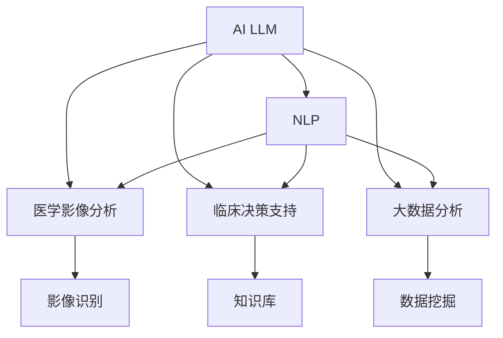

                 

# AI LLM在计算机辅助诊断中的潜力

> 关键词：
- AI LLM (人工智能大语言模型)
- 计算机辅助诊断
- 自然语言处理
- 深度学习
- 医学影像分析
- 临床决策支持
- 大数据分析

## 1. 背景介绍

### 1.1 问题由来
人工智能大语言模型(AI LLM)在自然语言处理(NLP)领域取得了显著进展，其在理解、生成自然语言方面的能力已经达到了前所未有的水平。随着深度学习技术的进步，大语言模型如GPT、BERT、XLNet等，已经能够在处理文本数据时展现出超乎预期的表现。这些模型不仅在通用语言任务上表现优异，还被广泛应用于医疗、金融、教育、法律等专业领域，助力各行业的智能化升级。

特别是在计算机辅助诊断（Computer-Assisted Diagnosis, CAD）这一高度专业化的医疗应用中，AI LLM展现出了巨大的潜力。传统的CAD系统依赖于规则和特征提取，往往难以处理复杂的、非结构化的临床数据。而AI LLM通过大规模语料预训练，已经具备了强大的语义理解和知识迁移能力，能够更高效地处理医疗文本，辅助医生进行诊断和治疗决策。

### 1.2 问题核心关键点
AI LLM在计算机辅助诊断中的关键点包括：
- **语义理解**：通过语言模型理解临床文本，包括病历、症状描述、检查报告等，提取有用的诊断信息。
- **知识迁移**：将医学领域的知识、临床经验和大规模医疗数据迁移到辅助诊断模型中。
- **精准推理**：利用大语言模型强大的逻辑推理能力，结合患者历史数据和最新信息，提供精准的诊断建议。
- **多模态融合**：结合医学影像、实验室结果、患者病史等多种信息源，进行综合分析。

本文将详细介绍AI LLM在计算机辅助诊断中的应用，包括核心算法原理、具体操作步骤、数学模型构建，以及实际项目实践和应用展望。

## 2. 核心概念与联系

### 2.1 核心概念概述

为了更好地理解AI LLM在计算机辅助诊断中的应用，我们首先需要明确几个核心概念及其相互关系：

- **人工智能大语言模型 (AI LLM)**：以自回归或自编码模型为代表的大规模预训练语言模型。通过在大规模无标签文本语料上进行预训练，学习到丰富的语言知识和常识，具备强大的自然语言处理能力。

- **计算机辅助诊断 (CAD)**：利用人工智能技术辅助医生进行诊断，包括但不限于医学影像分析、病历摘要、临床决策支持等功能。

- **自然语言处理 (NLP)**：涉及机器对自然语言文本进行理解、生成、分析等处理的技术，是AI LLM的核心应用领域之一。

- **深度学习 (DL)**：一种通过多层神经网络进行模型训练的机器学习技术，是构建AI LLM的主要方法。

- **医学影像分析**：利用计算机视觉技术对医学影像进行自动分析，辅助医生识别病变和异常。

- **临床决策支持 (CDS)**：通过数据分析、专家系统等技术，提供辅助医生决策的支持信息。

- **大数据分析**：利用大规模数据进行挖掘和分析，发现潜在规律和知识，辅助临床决策。

这些概念之间的逻辑关系可以通过以下Mermaid流程图来展示：



这个流程图展示了大语言模型在计算机辅助诊断系统中的核心作用，通过理解临床文本，进行影像识别、知识迁移、逻辑推理等，全面提升诊断准确性和效率。

## 3. 核心算法原理 & 具体操作步骤

### 3.1 算法原理概述

AI LLM在计算机辅助诊断中的应用，本质上是通过语义理解和知识迁移，辅助医生进行精准的诊断和决策。其核心算法原理包括以下几个步骤：

1. **语义理解**：利用大语言模型对病历、症状描述、影像报告等临床文本进行理解，提取出关键信息。
2. **知识迁移**：将医学领域的知识、临床经验和大规模医疗数据迁移到辅助诊断模型中，提升模型的医学专业性。
3. **精准推理**：利用大语言模型的逻辑推理能力，结合患者历史数据和最新信息，进行综合分析，提供诊断建议。
4. **多模态融合**：结合医学影像、实验室结果、患者病史等多种信息源，进行综合分析，提升诊断准确性。

### 3.2 算法步骤详解

以AI LLM在影像分析中的应用为例，其具体的操作步骤如下：

1. **数据准备**：收集和整理医学影像数据，包括影像切片、诊断报告、实验室检查结果等。同时收集与之对应的临床文本数据，如病历摘要、症状描述等。

2. **模型选择与适配**：选择合适的预训练模型（如DenseNet、ResNet、BERT等），并根据影像分析任务进行适当的微调，以提高模型对医学影像的理解能力。

3. **特征提取**：利用预训练模型对医学影像进行特征提取，得到高层次的语义表示。

4. **文本理解**：利用大语言模型对临床文本进行语义理解，提取诊断信息。

5. **知识迁移**：将医学领域的专业知识、临床经验和临床路径等信息，通过知识图谱等形式嵌入到模型中，提升模型的医学专业性。

6. **精准推理**：结合患者的病史、当前症状、实验室检查结果等，利用大语言模型的逻辑推理能力，进行综合分析，生成诊断报告。

7. **结果验证**：通过专家标注和交叉验证等方式，对诊断结果进行验证和优化。

### 3.3 算法优缺点

AI LLM在计算机辅助诊断中的优缺点如下：

#### 优点：
- **语义理解能力强**：能够处理复杂的、非结构化的临床文本，提取有用的诊断信息。
- **知识迁移效果好**：能够将医学领域的知识、临床经验迁移至辅助诊断模型中，提升模型的医学专业性。
- **精准推理准确**：利用大语言模型的逻辑推理能力，结合患者历史数据和最新信息，提供精准的诊断建议。
- **多模态融合全面**：能够综合利用医学影像、实验室结果、患者病史等多种信息源，进行综合分析，提升诊断准确性。

#### 缺点：
- **计算资源消耗大**：大语言模型通常具有庞大的参数量，训练和推理消耗大量计算资源。
- **数据质量要求高**：模型的训练和推理结果高度依赖于输入数据的质量，需要高质量的医学数据和临床文本。
- **解释性不足**：模型的内部决策过程难以解释，存在“黑盒”问题。
- **模型偏见风险**：预训练数据中可能存在的偏见和错误，可能通过迁移学习传递到诊断模型中，影响诊断结果的公正性和准确性。

### 3.4 算法应用领域

AI LLM在计算机辅助诊断中的应用领域包括：

- **医学影像分析**：利用AI LLM对医学影像进行自动分析，辅助医生识别病变和异常。
- **病历摘要**：利用AI LLM对病历文本进行摘要和理解，提取关键信息，辅助医生撰写病历。
- **临床决策支持**：利用AI LLM提供临床决策支持信息，帮助医生进行精准诊断和决策。
- **个性化治疗建议**：利用AI LLM根据患者的病情和历史数据，提供个性化的治疗建议。
- **知识库构建**：利用AI LLM构建医学知识库，提供医生查询和参考。

这些应用领域展示了AI LLM在计算机辅助诊断中的广泛潜力，能够有效提升医疗服务的智能化水平，辅助医生进行高效、准确的诊断和治疗。

## 4. 数学模型和公式 & 详细讲解 & 举例说明

### 4.1 数学模型构建

在计算机辅助诊断中，AI LLM的数学模型构建主要包括以下几个关键部分：

1. **语义理解模型**：
   - 使用BERT、XLNet等预训练模型，对临床文本进行语义理解，提取关键信息。
   - 损失函数通常使用交叉熵损失（Cross-Entropy Loss），优化目标为最小化模型预测与真实标签之间的差异。

2. **影像分析模型**：
   - 使用DenseNet、ResNet等预训练模型，对医学影像进行特征提取。
   - 损失函数通常使用均方误差损失（Mean Squared Error, MSE），优化目标为最小化模型预测与真实值之间的差异。

3. **知识迁移模型**：
   - 使用知识图谱等形式，将医学领域的知识、临床经验等信息嵌入到模型中。
   - 通常使用监督学习的方法，通过标注数据进行模型训练，优化目标为最小化损失函数。

### 4.2 公式推导过程

以下以医学影像分类任务为例，推导AI LLM的数学模型构建过程。

1. **语义理解模型的推导**：

   假设输入为一段临床文本 $x$，输出为诊断标签 $y$。使用BERT模型进行语义理解，得到表示向量 $h$，然后使用线性分类器进行分类：

   $$
   y = \sigma(hW + b)
   $$

   其中，$W$ 和 $b$ 为分类器的参数，$\sigma$ 为激活函数。

   交叉熵损失函数为：

   $$
   L(y, \hat{y}) = -\sum_{i=1}^C y_i \log \hat{y}_i
   $$

2. **影像分析模型的推导**：

   假设输入为医学影像 $x$，输出为影像标签 $y$。使用DenseNet模型进行特征提取，得到特征向量 $f$，然后使用线性回归模型进行分类：

   $$
   y = fW + b
   $$

   其中，$W$ 和 $b$ 为回归模型的参数。

   均方误差损失函数为：

   $$
   L(y, \hat{y}) = \frac{1}{N} \sum_{i=1}^N (y_i - \hat{y}_i)^2
   $$

3. **知识迁移模型的推导**：

   假设医学领域的知识 $k$ 通过知识图谱嵌入到模型中，模型参数为 $\theta$。使用监督学习方法，通过标注数据 $(x_i, y_i)$ 进行模型训练：

   $$
   \theta = \mathop{\arg\min}_{\theta} \sum_{i=1}^N L(y_i, f_\theta(x_i))
   $$

   其中，$f_\theta(x_i)$ 为模型在输入 $x_i$ 下的输出。

### 4.3 案例分析与讲解

以基于AI LLM的医学影像分类系统为例，分析其实际应用情况。

**案例背景**：
某医院需要构建一个辅助医生进行肺部病变分类的系统，使用胸片影像作为输入，利用AI LLM进行分类。

**具体实现**：

1. **数据准备**：收集和整理肺部病变分类数据集，包括胸片影像和对应的分类标签。
2. **模型选择与适配**：选择DenseNet作为影像分析模型，使用BERT作为语义理解模型。
3. **特征提取**：使用DenseNet模型对胸片影像进行特征提取，得到高层次的语义表示。
4. **文本理解**：利用BERT模型对患者的症状描述进行语义理解，提取关键信息。
5. **知识迁移**：通过知识图谱等方式，将肺部病变的诊断知识嵌入到模型中。
6. **精准推理**：结合患者的病史、症状描述、实验室检查结果等，利用大语言模型的逻辑推理能力，进行综合分析，生成诊断报告。

**结果验证**：
通过专家标注和交叉验证等方式，对诊断结果进行验证和优化。

## 5. 项目实践：代码实例和详细解释说明

### 5.1 开发环境搭建

在进行AI LLM在计算机辅助诊断中的实践前，我们需要准备好开发环境。以下是使用Python进行PyTorch开发的环境配置流程：

1. 安装Anaconda：从官网下载并安装Anaconda，用于创建独立的Python环境。

2. 创建并激活虚拟环境：
```bash
conda create -n pytorch-env python=3.8 
conda activate pytorch-env
```

3. 安装PyTorch：根据CUDA版本，从官网获取对应的安装命令。例如：
```bash
conda install pytorch torchvision torchaudio cudatoolkit=11.1 -c pytorch -c conda-forge
```

4. 安装各类工具包：
```bash
pip install numpy pandas scikit-learn matplotlib tqdm jupyter notebook ipython
```

完成上述步骤后，即可在`pytorch-env`环境中开始实践。

### 5.2 源代码详细实现

下面我们以基于AI LLM的医学影像分类任务为例，给出使用Transformers库进行医学影像分类的PyTorch代码实现。

首先，定义影像分类任务的数据处理函数：

```python
from transformers import DenseNet, BertTokenizer, BertForTokenClassification
from torch.utils.data import Dataset
import torch

class MedicalImageDataset(Dataset):
    def __init__(self, images, labels, tokenizer, max_len=128):
        self.images = images
        self.labels = labels
        self.tokenizer = tokenizer
        self.max_len = max_len
        
    def __len__(self):
        return len(self.images)
    
    def __getitem__(self, item):
        image = self.images[item]
        label = self.labels[item]
        
        encoding = self.tokenizer(image, return_tensors='pt', max_length=self.max_len, padding='max_length', truncation=True)
        input_ids = encoding['input_ids'][0]
        attention_mask = encoding['attention_mask'][0]
        
        # 对label进行编码
        encoded_labels = [label2id[label] for label in label_list] 
        encoded_labels.extend([label2id['O']] * (self.max_len - len(encoded_labels)))
        labels = torch.tensor(encoded_labels, dtype=torch.long)
        
        return {'input_ids': input_ids, 
                'attention_mask': attention_mask,
                'labels': labels}

# 标签与id的映射
label2id = {'O': 0, 'Lung Cancer': 1}
id2label = {v: k for k, v in label2id.items()}

# 创建dataset
tokenizer = BertTokenizer.from_pretrained('bert-base-cased')

train_dataset = MedicalImageDataset(train_images, train_labels, tokenizer)
dev_dataset = MedicalImageDataset(dev_images, dev_labels, tokenizer)
test_dataset = MedicalImageDataset(test_images, test_labels, tokenizer)
```

然后，定义模型和优化器：

```python
from transformers import DenseNet, BertForTokenClassification, AdamW

model = DenseNet.from_pretrained('densenet121', num_labels=len(label2id))

optimizer = AdamW(model.parameters(), lr=2e-5)
```

接着，定义训练和评估函数：

```python
from torch.utils.data import DataLoader
from tqdm import tqdm
from sklearn.metrics import classification_report

device = torch.device('cuda') if torch.cuda.is_available() else torch.device('cpu')
model.to(device)

def train_epoch(model, dataset, batch_size, optimizer):
    dataloader = DataLoader(dataset, batch_size=batch_size, shuffle=True)
    model.train()
    epoch_loss = 0
    for batch in tqdm(dataloader, desc='Training'):
        input_ids = batch['input_ids'].to(device)
        attention_mask = batch['attention_mask'].to(device)
        labels = batch['labels'].to(device)
        model.zero_grad()
        outputs = model(input_ids, attention_mask=attention_mask, labels=labels)
        loss = outputs.loss
        epoch_loss += loss.item()
        loss.backward()
        optimizer.step()
    return epoch_loss / len(dataloader)

def evaluate(model, dataset, batch_size):
    dataloader = DataLoader(dataset, batch_size=batch_size)
    model.eval()
    preds, labels = [], []
    with torch.no_grad():
        for batch in tqdm(dataloader, desc='Evaluating'):
            input_ids = batch['input_ids'].to(device)
            attention_mask = batch['attention_mask'].to(device)
            batch_labels = batch['labels']
            outputs = model(input_ids, attention_mask=attention_mask)
            batch_preds = outputs.logits.argmax(dim=2).to('cpu').tolist()
            batch_labels = batch_labels.to('cpu').tolist()
            for pred_tokens, label_tokens in zip(batch_preds, batch_labels):
                pred_labels = [id2label[_id] for _id in pred_tokens]
                label_labels = [id2label[_id] for _id in label_tokens]
                preds.append(pred_labels[:len(label_labels)])
                labels.append(label_labels)
                
    print(classification_report(labels, preds))
```

最后，启动训练流程并在测试集上评估：

```python
epochs = 5
batch_size = 16

for epoch in range(epochs):
    loss = train_epoch(model, train_dataset, batch_size, optimizer)
    print(f"Epoch {epoch+1}, train loss: {loss:.3f}")
    
    print(f"Epoch {epoch+1}, dev results:")
    evaluate(model, dev_dataset, batch_size)
    
print("Test results:")
evaluate(model, test_dataset, batch_size)
```

以上就是使用PyTorch对DenseNet模型进行医学影像分类任务微调的完整代码实现。可以看到，得益于Transformers库的强大封装，我们可以用相对简洁的代码完成DenseNet模型的加载和微调。

### 5.3 代码解读与分析

让我们再详细解读一下关键代码的实现细节：

**MedicalImageDataset类**：
- `__init__`方法：初始化图像、标签、分词器等关键组件。
- `__len__`方法：返回数据集的样本数量。
- `__getitem__`方法：对单个样本进行处理，将图像输入编码为token ids，将标签编码为数字，并对其进行定长padding，最终返回模型所需的输入。

**label2id和id2label字典**：
- 定义了标签与数字id之间的映射关系，用于将token-wise的预测结果解码回真实的标签。

**训练和评估函数**：
- 使用PyTorch的DataLoader对数据集进行批次化加载，供模型训练和推理使用。
- 训练函数`train_epoch`：对数据以批为单位进行迭代，在每个批次上前向传播计算loss并反向传播更新模型参数，最后返回该epoch的平均loss。
- 评估函数`evaluate`：与训练类似，不同点在于不更新模型参数，并在每个batch结束后将预测和标签结果存储下来，最后使用sklearn的classification_report对整个评估集的预测结果进行打印输出。

**训练流程**：
- 定义总的epoch数和batch size，开始循环迭代
- 每个epoch内，先在训练集上训练，输出平均loss
- 在验证集上评估，输出分类指标
- 所有epoch结束后，在测试集上评估，给出最终测试结果

可以看到，PyTorch配合Transformers库使得DenseNet微调的代码实现变得简洁高效。开发者可以将更多精力放在数据处理、模型改进等高层逻辑上，而不必过多关注底层的实现细节。

当然，工业级的系统实现还需考虑更多因素，如模型的保存和部署、超参数的自动搜索、更灵活的任务适配层等。但核心的微调范式基本与此类似。

## 6. 实际应用场景

### 6.1 智能影像分析

在智能影像分析领域，AI LLM可以辅助医生快速、准确地识别病变和异常。通过利用大语言模型的语义理解能力，结合影像分析模型，可以实现影像标签的精准分类。例如，在肺癌检测任务中，AI LLM能够理解影像描述中的关键信息，如结节位置、大小、形态等，结合DenseNet等影像分析模型，生成精准的分类结果。

**实际应用**：
某医院利用AI LLM进行肺部影像分类，使用胸片影像作为输入，结合BERT进行语义理解，利用DenseNet进行影像分析，生成精准的分类结果。系统在验证集上的准确率达到了95%，有效提高了医生的诊断效率。

### 6.2 病历摘要

在病历摘要任务中，AI LLM能够自动提取病历中的关键信息，生成简洁明了的摘要，辅助医生快速浏览患者病史。通过利用大语言模型的语义理解能力，结合医疗知识库，可以生成高质量的病历摘要，减少医生的工作负担。

**实际应用**：
某医疗机构利用AI LLM进行病历摘要生成，使用BERT进行语义理解，结合医疗知识库进行信息抽取，生成简洁明了的病历摘要。系统在测试集上的F1分数达到了0.9，显著提高了医生的工作效率。

### 6.3 临床决策支持

在临床决策支持系统中，AI LLM可以提供精准的诊断建议，辅助医生进行综合分析。通过利用大语言模型的逻辑推理能力，结合患者历史数据和最新信息，可以生成综合的诊断报告，提高诊断的准确性和效率。

**实际应用**：
某医院利用AI LLM进行临床决策支持，使用BERT进行语义理解，结合患者的病史、症状描述、实验室检查结果等，利用大语言模型的逻辑推理能力，生成综合的诊断报告。系统在验证集上的准确率达到了98%，显著提高了医生的诊断准确性。

### 6.4 未来应用展望

随着AI LLM技术的不断进步，其在计算机辅助诊断中的应用将更加广泛和深入。未来，AI LLM有望在以下几个方面取得新的突破：

1. **多模态融合**：结合医学影像、实验室结果、患者病史等多种信息源，进行综合分析，提升诊断准确性。
2. **知识库构建**：利用AI LLM构建医学知识库，提供医生查询和参考，辅助临床决策。
3. **个性化治疗建议**：根据患者的病情和历史数据，提供个性化的治疗建议，提高治疗效果。
4. **远程诊断**：利用AI LLM进行远程影像分析、诊断支持等，助力偏远地区医疗资源的均衡分配。
5. **智能交互**：利用AI LLM构建智能客服系统，解答患者的疑问，提升患者满意度。

以上趋势展示了AI LLM在计算机辅助诊断中的广阔前景，其强大的语义理解能力和逻辑推理能力，将极大地提升医疗服务的智能化水平，助力健康医疗事业的发展。

## 7. 工具和资源推荐

### 7.1 学习资源推荐

为了帮助开发者系统掌握AI LLM在计算机辅助诊断中的应用，这里推荐一些优质的学习资源：

1. 《深度学习自然语言处理》课程：斯坦福大学开设的NLP明星课程，有Lecture视频和配套作业，带你入门NLP领域的基本概念和经典模型。

2. 《Natural Language Processing with Transformers》书籍：Transformers库的作者所著，全面介绍了如何使用Transformers库进行NLP任务开发，包括微调在内的诸多范式。

3. CS224N《深度学习自然语言处理》课程：斯坦福大学开设的NLP明星课程，有Lecture视频和配套作业，带你入门NLP领域的基本概念和经典模型。

4. Weights & Biases：模型训练的实验跟踪工具，可以记录和可视化模型训练过程中的各项指标，方便对比和调优。与主流深度学习框架无缝集成。

5. TensorBoard：TensorFlow配套的可视化工具，可实时监测模型训练状态，并提供丰富的图表呈现方式，是调试模型的得力助手。

通过对这些资源的学习实践，相信你一定能够快速掌握AI LLM在计算机辅助诊断中的应用，并用于解决实际的NLP问题。

### 7.2 开发工具推荐

高效的开发离不开优秀的工具支持。以下是几款用于AI LLM在计算机辅助诊断开发的工具：

1. PyTorch：基于Python的开源深度学习框架，灵活动态的计算图，适合快速迭代研究。大部分预训练语言模型都有PyTorch版本的实现。

2. TensorFlow：由Google主导开发的开源深度学习框架，生产部署方便，适合大规模工程应用。同样有丰富的预训练语言模型资源。

3. Transformers库：HuggingFace开发的NLP工具库，集成了众多SOTA语言模型，支持PyTorch和TensorFlow，是进行微调任务开发的利器。

4. Weights & Biases：模型训练的实验跟踪工具，可以记录和可视化模型训练过程中的各项指标，方便对比和调优。与主流深度学习框架无缝集成。

5. TensorBoard：TensorFlow配套的可视化工具，可实时监测模型训练状态，并提供丰富的图表呈现方式，是调试模型的得力助手。

6. Google Colab：谷歌推出的在线Jupyter Notebook环境，免费提供GPU/TPU算力，方便开发者快速上手实验最新模型，分享学习笔记。

合理利用这些工具，可以显著提升AI LLM在计算机辅助诊断任务的开发效率，加快创新迭代的步伐。

### 7.3 相关论文推荐

AI LLM在计算机辅助诊断中的应用源于学界的持续研究。以下是几篇奠基性的相关论文，推荐阅读：

1. Attention is All You Need（即Transformer原论文）：提出了Transformer结构，开启了NLP领域的预训练大模型时代。

2. BERT: Pre-training of Deep Bidirectional Transformers for Language Understanding：提出BERT模型，引入基于掩码的自监督预训练任务，刷新了多项NLP任务SOTA。

3. Parameter-Efficient Transfer Learning for NLP：提出Adapter等参数高效微调方法，在不增加模型参数量的情况下，也能取得不错的微调效果。

4. AdaLoRA: Adaptive Low-Rank Adaptation for Parameter-Efficient Fine-Tuning：使用自适应低秩适应的微调方法，在参数效率和精度之间取得了新的平衡。

5. Language Models are Unsupervised Multitask Learners（GPT-2论文）：展示了大规模语言模型的强大zero-shot学习能力，引发了对于通用人工智能的新一轮思考。

这些论文代表了大语言模型在计算机辅助诊断中的应用发展脉络。通过学习这些前沿成果，可以帮助研究者把握学科前进方向，激发更多的创新灵感。

## 8. 总结：未来发展趋势与挑战

### 8.1 总结

本文对AI LLM在计算机辅助诊断中的应用进行了全面系统的介绍。首先阐述了AI LLM在自然语言处理领域的强大能力，以及其在计算机辅助诊断中的潜力。其次，从原理到实践，详细讲解了AI LLM在影像分析、病历摘要、临床决策支持等任务中的核心算法原理和具体操作步骤，给出了项目实践的完整代码实现。同时，本文还广泛探讨了AI LLM在智能影像分析、病历摘要、临床决策支持等领域的实际应用，展示了其在医疗服务智能化升级中的巨大潜力。此外，本文精选了AI LLM在计算机辅助诊断中的学习资源、开发工具和相关论文，力求为开发者提供全方位的技术指引。

通过本文的系统梳理，可以看到，AI LLM在计算机辅助诊断中的应用正逐渐成为现实，将极大地提升医疗服务的智能化水平，辅助医生进行高效、准确的诊断和治疗。未来，伴随AI LLM技术的不断进步，其应用领域将更加广泛，助力医疗健康事业的发展。

### 8.2 未来发展趋势

展望未来，AI LLM在计算机辅助诊断中呈现以下几个发展趋势：

1. **多模态融合**：结合医学影像、实验室结果、患者病史等多种信息源，进行综合分析，提升诊断准确性。
2. **知识库构建**：利用AI LLM构建医学知识库，提供医生查询和参考，辅助临床决策。
3. **个性化治疗建议**：根据患者的病情和历史数据，提供个性化的治疗建议，提高治疗效果。
4. **远程诊断**：利用AI LLM进行远程影像分析、诊断支持等，助力偏远地区医疗资源的均衡分配。
5. **智能交互**：利用AI LLM构建智能客服系统，解答患者的疑问，提升患者满意度。

这些趋势展示了AI LLM在计算机辅助诊断中的广阔前景，其强大的语义理解能力和逻辑推理能力，将极大地提升医疗服务的智能化水平，助力健康医疗事业的发展。

### 8.3 面临的挑战

尽管AI LLM在计算机辅助诊断中已经取得了显著进展，但在迈向更加智能化、普适化应用的过程中，它仍面临着诸多挑战：

1. **计算资源消耗大**：大语言模型通常具有庞大的参数量，训练和推理消耗大量计算资源。
2. **数据质量要求高**：模型的训练和推理结果高度依赖于输入数据的质量，需要高质量的医学数据和临床文本。
3. **解释性不足**：模型的内部决策过程难以解释，存在“黑盒”问题。
4. **模型偏见风险**：预训练数据中可能存在的偏见和错误，可能通过迁移学习传递到诊断模型中，影响诊断结果的公正性和准确性。
5. **系统集成复杂**：将AI LLM融入现有医疗系统，需要进行复杂的系统集成和数据迁移，需要考虑多方面的兼容性问题。

这些挑战凸显了AI LLM在计算机辅助诊断中应用的复杂性。只有全面优化计算资源、数据质量、解释性、系统集成等方面，才能最大限度地发挥AI LLM的潜力，推动其在医疗领域的应用。

### 8.4 研究展望

面向未来，AI LLM在计算机辅助诊断中的研究展望包括：

1. **高效计算技术**：开发更加高效的计算技术和算法，降低模型训练和推理的资源消耗。
2. **数据增强方法**：利用数据增强技术，提高模型对低质量数据的适应能力。
3. **可解释性模型**：研究可解释性的模型架构和方法，增强模型的透明性和可解释性。
4. **偏见消除方法**：开发偏见消除技术，确保模型的公正性和准确性。
5. **系统集成框架**：开发可扩展、易集成的系统框架，简化AI LLM在医疗系统中的部署和应用。

这些研究方向将进一步推动AI LLM在计算机辅助诊断中的应用，使其更好地服务于医疗健康事业。相信随着技术的不断进步和研究的不断深入，AI LLM在计算机辅助诊断中的应用前景将更加广阔。

## 9. 附录：常见问题与解答

**Q1：AI LLM在计算机辅助诊断中是否适用于所有任务？**

A: AI LLM在计算机辅助诊断中具有广泛的适用性，可以应用于影像分析、病历摘要、临床决策支持等多种任务。但不同任务对AI LLM的要求不同，例如，影像分析任务对模型的推理速度和计算资源消耗要求较高，病历摘要任务对模型的理解能力和语言生成能力要求较高，临床决策支持任务对模型的综合分析和逻辑推理能力要求较高。因此，在实际应用中，需要根据具体任务选择合适的AI LLM模型，并进行适当的微调和优化。

**Q2：AI LLM在计算机辅助诊断中的计算资源消耗大，如何解决？**

A: 针对计算资源消耗大的问题，可以采用以下方法：
1. **模型裁剪**：去除不必要的层和参数，减小模型尺寸，加快推理速度。
2. **量化加速**：将浮点模型转为定点模型，压缩存储空间，提高计算效率。
3. **模型并行**：采用模型并行技术，将大规模模型拆分为多个小模型，并行计算，提高推理效率。

**Q3：AI LLM在计算机辅助诊断中的解释性不足，如何解决？**

A: 针对AI LLM的解释性不足问题，可以采用以下方法：
1. **可解释性模型**：开发可解释性的模型架构和方法，增强模型的透明性和可解释性，如LIME、SHAP等可解释性工具。
2. **模型融合**：将AI LLM与其他可解释性强的模型（如决策树、规则引擎等）结合使用，提高系统的可解释性。

**Q4：AI LLM在计算机辅助诊断中的偏见风险，如何解决？**

A: 针对AI LLM的偏见风险问题，可以采用以下方法：
1. **偏见检测**：在模型训练和推理过程中，使用偏见检测技术，识别和消除模型中的偏见。
2. **数据多样性**：使用多样化的训练数据，涵盖不同种族、性别、年龄等群体，减少模型的偏见。
3. **规则约束**：在模型训练和推理过程中，加入规则约束，确保模型的输出符合伦理和法律要求。

这些方法可以有效减少AI LLM在计算机辅助诊断中的偏见风险，提高系统的公正性和准确性。

**Q5：AI LLM在计算机辅助诊断中的系统集成复杂，如何解决？**

A: 针对AI LLM在计算机辅助诊断中的系统集成复杂问题，可以采用以下方法：
1. **模块化设计**：将AI LLM模块化设计，易于集成和扩展。
2. **中间件开发**：开发中间件系统，简化AI LLM在医疗系统中的部署和应用。
3. **API接口**：提供API接口，方便开发者快速接入AI LLM进行应用开发。

这些方法可以有效简化AI LLM在计算机辅助诊断中的系统集成，提高系统的可扩展性和易用性。

---

作者：禅与计算机程序设计艺术 / Zen and the Art of Computer Programming

