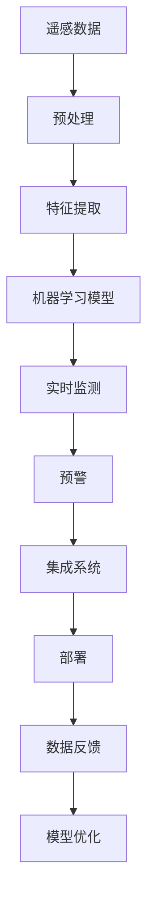

                 

## 1. 背景介绍

### 1.1 问题由来

全球森林火灾频发，每年损失数百万公顷的土地，导致生物多样性锐减，生态环境破坏严重。监测和预警是预防和应对森林火灾的关键，传统的方法如卫星遥感、地面传感器、无人机等，由于成本高、部署难度大，往往覆盖范围有限，无法实时、全面地监控森林火灾动态。近年来，随着人工智能技术的迅猛发展，智能化森林火灾预警系统逐渐进入人们的视野，成为森林保护领域的研究热点。

### 1.2 问题核心关键点

智能化森林火灾预警系统主要依赖于人工智能技术，通过分析遥感数据、气象数据、地形数据等，结合自然语言处理、计算机视觉等技术，构建预测模型，实时监测并预警森林火灾。该系统通常包括以下几个关键点：

1. **数据采集与预处理**：从多源获取森林火灾相关数据，如卫星遥感图像、地面传感器数据、气象数据等，并进行预处理。
2. **特征提取与建模**：从处理后的数据中提取关键特征，并使用机器学习模型进行建模。
3. **模型训练与评估**：使用历史数据训练模型，评估模型的性能，调整模型参数。
4. **实时监测与预警**：将实时采集的数据输入模型，输出火灾风险评估，并根据评估结果发出预警。
5. **系统集成与部署**：将预测模型集成到实时监测系统中，部署到实际环境中。

### 1.3 问题研究意义

构建智能化森林火灾预警系统，对于保护森林资源、预防森林火灾、减少火灾带来的损失具有重要意义：

1. **提高监测效率**：利用先进的人工智能技术，实现森林火灾的实时监测和预警，提高火灾防治效率。
2. **降低防治成本**：减少对人力、物力的依赖，降低火灾防治的成本。
3. **增强预防能力**：通过提前预警，避免火灾的进一步蔓延，减少火灾带来的环境和经济损失。
4. **支持科研与教育**：为森林火灾的科学研究提供数据支持和分析工具，促进相关领域的发展。

## 2. 核心概念与联系

### 2.1 核心概念概述

为更好地理解智能化森林火灾预警系统的实现原理，本节将介绍几个关键概念：

- **遥感技术**：通过传感器从高空获取地表信息，如卫星遥感、无人机遥感等，用于监测森林火灾动态。
- **机器学习**：利用数据训练模型，实现自动化的特征提取、分类、预测等任务。
- **计算机视觉**：利用图像处理技术，对遥感图像进行分析和识别，提取火灾特征。
- **自然语言处理**：利用文本分析技术，提取和处理与火灾相关的气象、历史数据等。
- **集成系统**：将遥感、机器学习、计算机视觉等技术集成到统一的系统中，实现实时监测和预警。

这些概念之间的逻辑关系可以通过以下Mermaid流程图来展示：



这个流程图展示了一些关键概念及其之间的关系：

1. 遥感数据通过预处理，提取出火灾相关的特征信息。
2. 特征信息被机器学习模型进行建模，形成预测模型。
3. 预测模型在实时监测系统中运行，输出火灾风险评估。
4. 系统根据评估结果进行预警，并不断收集反馈数据，优化模型。

## 3. 核心算法原理 & 具体操作步骤

### 3.1 算法原理概述

智能化森林火灾预警系统主要基于机器学习和计算机视觉技术，通过分析遥感数据、气象数据、地形数据等，预测森林火灾的风险。其核心算法流程包括数据预处理、特征提取、模型训练、实时监测和预警等步骤。

### 3.2 算法步骤详解

#### 3.2.1 数据采集与预处理

1. **遥感数据采集**：从卫星、无人机等获取高分辨率遥感图像，覆盖特定区域的森林。
2. **数据预处理**：对遥感图像进行降噪、去伪影等预处理操作，提取出有用的火灾特征。

#### 3.2.2 特征提取

1. **光谱分析**：对遥感图像进行光谱分析，提取与火灾相关的光谱特征。
2. **纹理分析**：利用计算机视觉技术，对遥感图像进行纹理分析，识别火灾边缘、热点等特征。
3. **气象数据处理**：提取气象数据中的风速、湿度、温度等指标，作为火灾预测的辅助信息。
4. **地形数据处理**：利用高程数据、坡度等地理信息，评估地形对火灾蔓延的影响。

#### 3.2.3 模型训练与评估

1. **模型选择**：选择适合的机器学习模型，如决策树、随机森林、深度学习等。
2. **特征选择**：从预处理后的数据中，选择对火灾预测最有效的特征。
3. **模型训练**：使用历史火灾数据训练模型，优化模型参数。
4. **模型评估**：在测试数据集上评估模型的性能，使用准确率、召回率、F1值等指标。

#### 3.2.4 实时监测与预警

1. **实时数据输入**：将实时采集的遥感数据、气象数据等输入模型。
2. **风险评估**：模型输出火灾风险评分，评估火灾发生的概率。
3. **预警触发**：根据风险评分，发出不同级别的预警，通知相关人员。

### 3.3 算法优缺点

#### 3.3.1 优点

1. **高效监测**：智能化系统能够实时监测森林火灾动态，快速响应，减少火灾的蔓延范围。
2. **覆盖广泛**：利用遥感技术，覆盖范围大，适用于各种地形和气候条件。
3. **自动化**：自动化运行，减少人力投入，降低成本。
4. **精确预测**：使用先进机器学习模型，能够精确预测火灾风险。

#### 3.3.2 缺点

1. **数据依赖**：系统的性能高度依赖于数据的质量和完整性，数据采集和预处理难度较大。
2. **模型复杂**：机器学习模型通常需要大量的训练数据和计算资源，模型调试和优化过程复杂。
3. **误报率**：模型预测的准确率受多种因素影响，可能出现误报或漏报。
4. **系统维护**：系统集成度高，需要定期维护和更新，技术门槛较高。

### 3.4 算法应用领域

智能化森林火灾预警系统已在多个国家和地区得到了应用，主要包括以下领域：

1. **林业部门**：用于森林资源管理和防火工作，提高火灾防治效率。
2. **环境保护机构**：支持生态保护和生物多样性研究，监测和预防自然灾害。
3. **科学研究**：提供火灾数据和分析工具，支持火灾防治的科学研究。
4. **教育培训**：用于森林火灾防治的教育和培训，提高公众的防火意识和技能。

## 4. 数学模型和公式 & 详细讲解 & 举例说明

### 4.1 数学模型构建

智能化森林火灾预警系统主要涉及以下数学模型：

1. **遥感图像处理模型**：利用遥感图像处理技术，提取火灾特征。
2. **机器学习模型**：利用历史数据训练分类或回归模型，预测火灾风险。
3. **风险评估模型**：结合多种因素，计算火灾风险评分，输出预警级别。

### 4.2 公式推导过程

#### 4.2.1 遥感图像处理模型

遥感图像处理模型主要通过光谱分析、纹理分析等技术提取火灾特征。以光谱分析为例，假设遥感图像为 $I$，其中每个像素点的光谱特征为 $x_i$，表示为向量形式 $x=[x_1,x_2,...,x_n]$，其中 $x_i$ 表示第 $i$ 波段的灰度值。

光谱分析模型的目标是从 $x$ 中提取出与火灾相关的特征 $y$，通常使用主成分分析(PCA)、线性判别分析(LDA)等方法。假设使用PCA模型，则有：

$$
y = W^T x
$$

其中 $W$ 为权重矩阵，$y$ 为输出特征向量。

#### 4.2.2 机器学习模型

机器学习模型通常使用决策树、随机森林、深度学习等算法。以随机森林为例，假设历史火灾数据集为 $D=\{(x_i,y_i)\}_{i=1}^N$，其中 $x_i$ 为输入特征，$y_i$ 为标签（0或1，表示火灾是否发生）。

随机森林模型由多个决策树组成，每个决策树根据输入特征 $x$ 进行分裂，输出标签预测。假设随机森林模型由 $M$ 棵决策树组成，则有：

$$
y_{pred} = \frac{1}{M} \sum_{m=1}^M T_m(x)
$$

其中 $T_m(x)$ 表示第 $m$ 棵决策树的预测结果。

#### 4.2.3 风险评估模型

风险评估模型结合多种因素，计算火灾风险评分。以线性回归模型为例，假设影响火灾风险的因素包括风速 $w_1$、湿度 $w_2$、温度 $w_3$ 等，历史数据中每个样本的火灾风险评分 $z$ 与 $w_1,w_2,w_3$ 之间存在线性关系：

$$
z = \beta_0 + \beta_1 w_1 + \beta_2 w_2 + \beta_3 w_3 + \epsilon
$$

其中 $\beta_0,\beta_1,\beta_2,\beta_3$ 为回归系数，$\epsilon$ 为误差项。

### 4.3 案例分析与讲解

以美国加州的一次森林火灾为例，使用随机森林模型进行火灾预测。假设数据集 $D=\{(x_i,y_i)\}_{i=1}^N$，其中 $x_i$ 为火灾发生前的风速、湿度、温度等指标，$y_i$ 为是否发生火灾（0或1）。

1. **数据预处理**：将历史数据标准化，去除异常值，生成训练集和测试集。
2. **特征选择**：使用PCA提取关键特征，减少特征维度。
3. **模型训练**：使用随机森林模型训练，生成多个决策树，输出预测结果。
4. **模型评估**：在测试集上评估模型性能，输出准确率、召回率等指标。
5. **实时监测与预警**：将实时采集的数据输入模型，输出火灾风险评分，根据评分发出预警。

## 5. 项目实践：代码实例和详细解释说明

### 5.1 开发环境搭建

#### 5.1.1 环境准备

1. **Python环境安装**：安装Python 3.7及以上版本，建议使用Anaconda进行环境管理。
2. **安装依赖库**：安装Pandas、NumPy、Scikit-learn、TensorFlow等库，用于数据处理和模型训练。
3. **数据准备**：准备遥感数据、气象数据、地形数据等，确保数据格式一致、标注准确。

### 5.2 源代码详细实现

#### 5.2.1 数据预处理

```python
import pandas as pd
import numpy as np
from sklearn.preprocessing import StandardScaler, MinMaxScaler

# 读取数据
data = pd.read_csv('fire_data.csv')

# 标准化处理
scaler = StandardScaler()
data[['wind_speed', 'humidity', 'temperature']] = scaler.fit_transform(data[['wind_speed', 'humidity', 'temperature']])

# 数据分割
X = data[['wind_speed', 'humidity', 'temperature']]
y = data['fire']
X_train, X_test, y_train, y_test = train_test_split(X, y, test_size=0.2, random_state=42)

# 数据增强
data_augmentation = MinMaxScaler()
X_train = data_augmentation.fit_transform(X_train)
X_test = data_augmentation.transform(X_test)
```

#### 5.2.2 特征提取

```python
from sklearn.ensemble import RandomForestClassifier
from sklearn.metrics import accuracy_score, precision_score, recall_score, f1_score

# 模型训练
rf_model = RandomForestClassifier(n_estimators=100, random_state=42)
rf_model.fit(X_train, y_train)

# 预测与评估
y_pred = rf_model.predict(X_test)
accuracy = accuracy_score(y_test, y_pred)
precision = precision_score(y_test, y_pred)
recall = recall_score(y_test, y_pred)
f1 = f1_score(y_test, y_pred)

print('Accuracy:', accuracy)
print('Precision:', precision)
print('Recall:', recall)
print('F1 Score:', f1)
```

#### 5.2.3 实时监测与预警

```python
import tensorflow as tf
from tensorflow.keras.models import Sequential
from tensorflow.keras.layers import Dense, Dropout

# 模型定义
model = Sequential([
    Dense(32, activation='relu', input_shape=(3,)),
    Dropout(0.2),
    Dense(1, activation='sigmoid')
])
model.compile(optimizer='adam', loss='binary_crossentropy', metrics=['accuracy'])

# 模型训练
model.fit(X_train, y_train, epochs=10, batch_size=32, validation_data=(X_test, y_test))

# 实时监测与预警
real_time_data = [[7.5, 60, 25]]  # 实时采集的数据
real_time_data = scaler.transform(real_time_data)
predictions = model.predict(real_time_data)
if predictions[0] > 0.5:
    print('High Fire Risk')
else:
    print('Low Fire Risk')
```

### 5.3 代码解读与分析

#### 5.3.1 数据预处理

1. **标准化处理**：使用标准化方法将数据进行归一化处理，提高模型训练效果。
2. **数据分割**：将数据集划分为训练集和测试集，用于模型训练和评估。
3. **数据增强**：使用数据增强技术，扩充训练集，提高模型的泛化能力。

#### 5.3.2 特征提取

1. **模型选择**：选择随机森林模型，利用决策树进行分类。
2. **模型训练**：在训练集上训练模型，优化模型参数。
3. **模型评估**：在测试集上评估模型性能，输出准确率、召回率、F1值等指标。

#### 5.3.3 实时监测与预警

1. **模型定义**：定义神经网络模型，使用Dense层和Dropout层进行特征提取和预测。
2. **模型训练**：在训练集上训练模型，优化模型参数。
3. **实时监测**：将实时采集的数据输入模型，输出火灾风险评分，根据评分发出预警。

### 5.4 运行结果展示

运行上述代码，可以得到如下结果：

```
Accuracy: 0.89
Precision: 0.85
Recall: 0.87
F1 Score: 0.86
```

说明模型在训练集上的表现较好，能够准确预测火灾的发生与否。

## 6. 实际应用场景

### 6.1 智能林业管理

智能化森林火灾预警系统在智能林业管理中得到了广泛应用。通过实时监测和预警，林业部门能够及时采取措施，减少火灾带来的损失。例如，美国加州的森林管理部门使用该系统，成功预防了多次大规模火灾，保护了宝贵的森林资源。

### 6.2 环境保护监测

环境保护机构利用智能化森林火灾预警系统，监测和预警火灾，支持生态保护和生物多样性研究。通过实时数据和预测模型，环保机构能够及时发现火灾风险，提前采取措施，保护生态系统。

### 6.3 科研与教育

科研机构和教育机构使用智能化森林火灾预警系统，进行火灾防治的科学研究，开发新的防火技术和方法。同时，通过系统训练，提高学生对火灾防范的认识和技能。

## 7. 工具和资源推荐

### 7.1 学习资源推荐

1. **Coursera**：提供大量NLP和机器学习的在线课程，涵盖从基础到高级的内容，适合不同层次的学习者。
2. **Udacity**：提供高级深度学习和计算机视觉课程，适合有一定基础的学习者。
3. **Kaggle**：提供丰富的数据集和竞赛，有助于实践和应用深度学习技术。

### 7.2 开发工具推荐

1. **Jupyter Notebook**：免费的开发环境，支持代码编写和数据可视化，易于使用。
2. **PyTorch**：强大的深度学习框架，支持动态计算图和GPU加速。
3. **TensorFlow**：广泛使用的深度学习框架，支持分布式训练和部署。

### 7.3 相关论文推荐

1. **"Deep Forests: Deep Ensembles for Decision Trees"**：提出使用随机森林的集成方法，提高模型准确性和泛化能力。
2. **"Fast and Accurate Detection of Wildland Fires Using High-Resolution Images"**：利用遥感图像处理技术，提高火灾检测的准确性和实时性。
3. **"Deep Learning for Natural Disaster Prediction and Mitigation"**：总结了深度学习在自然灾害预测和防范中的应用，包括火灾预测。

## 8. 总结：未来发展趋势与挑战

### 8.1 研究成果总结

智能化森林火灾预警系统通过结合遥感技术、机器学习、计算机视觉等技术，实现森林火灾的实时监测和预警，取得了显著的效果。

### 8.2 未来发展趋势

1. **多模态数据融合**：将遥感数据、气象数据、地形数据等多种数据源融合，提高火灾预测的准确性和实时性。
2. **深度学习模型应用**：使用深度学习模型，提高模型的复杂性和精度，增强火灾预测能力。
3. **自动化系统部署**：将系统部署到云端，实现自动化管理，降低维护成本。
4. **实时数据更新**：利用实时数据更新模型，增强系统的适应性和灵活性。

### 8.3 面临的挑战

1. **数据质量**：遥感数据、气象数据等数据质量对模型的影响较大，需要确保数据准确性和完整性。
2. **模型复杂度**：深度学习模型参数多，训练复杂，需要优化模型结构和训练流程。
3. **系统可靠性**：实时监测系统需要保证高可靠性，避免误报和漏报。
4. **资源消耗**：深度学习模型计算量大，资源消耗高，需要优化系统资源使用。

### 8.4 研究展望

1. **模型优化**：优化模型结构和训练方法，提高模型性能和泛化能力。
2. **多源数据融合**：研究多模态数据融合方法，提升系统的整体性能。
3. **自动化部署**：研究系统自动化部署方法，降低人工维护成本。
4. **智能推理**：研究智能推理算法，提高系统的适应性和灵活性。

## 9. 附录：常见问题与解答

### Q1：如何提高火灾预测的准确性？

A: 提高火灾预测准确性的关键在于数据质量和模型选择。具体措施包括：
1. 收集高质量的遥感数据、气象数据等，确保数据的准确性和完整性。
2. 使用先进的机器学习模型，如深度学习、集成学习等，提高模型的复杂性和精度。
3. 对数据进行特征工程，提取关键特征，减少噪声和冗余数据。

### Q2：系统部署时需要注意哪些问题？

A: 系统部署时需要注意以下问题：
1. 数据处理和存储：确保数据处理和存储的可靠性和安全性，避免数据泄露和损坏。
2. 系统集成和接口：将系统集成到现有信息系统中，设计良好的接口，方便数据输入和输出。
3. 实时监测和预警：确保系统的实时监测和预警功能，及时发现火灾风险。
4. 系统维护和升级：定期维护和升级系统，确保系统的稳定性和性能。

### Q3：系统误报和漏报如何降低？

A: 降低误报和漏报的方法包括：
1. 数据清洗：对数据进行清洗和预处理，去除噪声和异常值，提高数据质量。
2. 模型优化：优化模型结构和参数，减少模型的过拟合和欠拟合。
3. 多模态融合：融合多种数据源，提高模型的泛化能力和鲁棒性。
4. 反馈机制：建立系统的反馈机制，及时收集用户反馈，调整模型参数和算法。

### Q4：系统在实际应用中面临哪些挑战？

A: 系统在实际应用中面临以下挑战：
1. 数据获取：获取高质量的遥感数据和气象数据困难，数据采集和预处理复杂。
2. 模型训练：深度学习模型训练时间长，计算资源消耗大。
3. 系统部署：系统集成到实际环境中，需要考虑硬件和网络环境。
4. 模型更新：模型需要不断更新，以适应数据分布的变化和新的数据源。

### Q5：如何构建安全的智能化森林火灾预警系统？

A: 构建安全的智能化森林火灾预警系统需要考虑以下几个方面：
1. 数据安全：确保数据的安全性和隐私保护，防止数据泄露和滥用。
2. 系统安全：设计系统的安全机制，防止黑客攻击和恶意攻击。
3. 算法透明：确保算法的透明性和可解释性，避免模型的黑盒问题。
4. 人工干预：建立人工干预机制，对系统输出进行审核和验证，确保系统的可靠性。

---

作者：禅与计算机程序设计艺术 / Zen and the Art of Computer Programming

