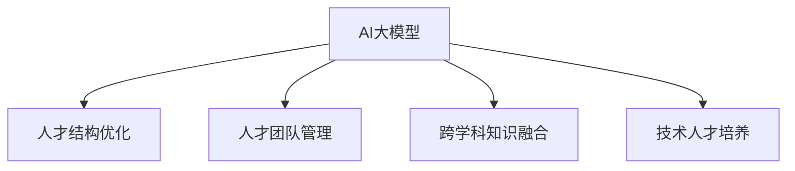

                 

## 1. 背景介绍

### 1.1 问题由来

在AI大模型创业的浪潮中，人才成为关键。人才是创新的源泉，特别是在AI大模型这种需要跨领域知识，如自然语言处理、计算机视觉、大数据分析、算法工程等方向的人才。然而，人才不仅仅是数量的多少，更重要的是人才的质量和团队的多样性。在创业初期，如何最大化利用现有的人才优势，构建高效的团队，成为创业公司面临的重要问题。

### 1.2 问题核心关键点

如何利用人才优势，提升AI大模型的研发和应用能力，是创业公司需要深入思考的问题。具体来说，以下几点是关键：

- **人才结构优化**：根据公司业务需求和模型特点，合理分配人才资源。
- **人才团队管理**：有效管理团队，激发人才的积极性和创造力。
- **跨学科知识融合**：鼓励不同背景的人才交流合作，提升知识创新能力。
- **技术人才培养**：通过培训、轮岗等方式，持续提升团队技术水平。

## 2. 核心概念与联系

### 2.1 核心概念概述

- **AI大模型**：通过大量数据训练得到的高级AI模型，能够执行复杂的自然语言处理、图像识别、视频分析等任务，是AI应用的重要基础。

- **人才结构优化**：在创业公司中，根据不同岗位的需求，合理安排人才结构，包括技术研发、算法工程、数据科学、业务分析师等角色，确保团队的多样性和协同效率。

- **人才团队管理**：通过科学的团队管理手段，如绩效评估、激励机制、团队建设等，提升团队凝聚力和效率。

- **跨学科知识融合**：鼓励不同学科背景的人才交流合作，促进知识的交叉融合，推动创新。

- **技术人才培养**：通过内部培训、学术交流、项目实战等方式，不断提升团队成员的技术水平和业务能力。

这些概念通过以下Mermaid流程图来展示：



### 2.2 核心概念原理和架构的 Mermaid 流程图

此部分暂不适用，因为核心概念原理和架构的 Mermaid 流程图无法直接展示文本。但可以通过以下简单的文字描述：

```
从AI大模型出发，通过人才结构优化、人才团队管理、跨学科知识融合和技术人才培养，形成高效的团队协作系统。
```

## 3. 核心算法原理 & 具体操作步骤

### 3.1 算法原理概述

人才优势的利用，可以通过以下算法原理进行优化：

- **人才评估模型**：通过数据分析、机器学习等技术，评估人才的潜力和贡献。
- **知识图谱构建**：构建团队成员的知识图谱，促进跨学科知识交流和融合。
- **团队协作优化**：通过算法优化团队协作，提高团队效率。

### 3.2 算法步骤详解

#### 3.2.1 人才评估模型

1. **数据收集**：收集团队成员的技能、经验、贡献、绩效等数据。
2. **数据预处理**：对收集到的数据进行清洗、归一化等预处理操作。
3. **特征提取**：使用自然语言处理、图像处理等技术，提取关键特征。
4. **模型训练**：使用机器学习模型如随机森林、梯度提升树等，对提取的特征进行建模，预测人才的潜力和贡献。

#### 3.2.2 知识图谱构建

1. **知识抽取**：从团队成员的简历、论文、代码库等文本中抽取关键信息。
2. **知识融合**：将提取的知识融合到统一的知识图谱中，形成网络结构。
3. **知识导航**：设计知识图谱的导航界面，方便团队成员查询和分享知识。

#### 3.2.3 团队协作优化

1. **任务分配**：根据成员的技能和经验，合理分配任务，确保任务均衡。
2. **协同工作**：使用协作工具如JIRA、Trello等，管理团队的任务进度和协作状态。
3. **绩效评估**：定期对团队成员进行绩效评估，激励优秀人才，调整不良表现。

### 3.3 算法优缺点

#### 3.3.1 人才评估模型

**优点**：
- 量化人才潜力，提高人才管理的科学性。
- 及时发现团队中的潜在人才，进行有效培养和利用。

**缺点**：
- 数据获取难度大，需要花费大量时间和成本。
- 模型训练复杂，可能存在过度拟合或欠拟合的问题。

#### 3.3.2 知识图谱构建

**优点**：
- 促进跨学科知识交流，提升团队创新能力。
- 知识图谱可以实时更新，保证知识的最新性。

**缺点**：
- 知识抽取和融合技术复杂，难度较大。
- 知识图谱构建成本高，需要投入大量人力和资源。

#### 3.3.3 团队协作优化

**优点**：
- 任务分配合理，提高团队效率。
- 协同工作管理规范，减少沟通成本。

**缺点**：
- 需要持续维护和管理，工作量大。
- 可能存在过度依赖工具的问题，缺乏人性化的管理。

### 3.4 算法应用领域

人才优势利用在AI大模型创业的多个领域都有广泛的应用：

- **研发团队管理**：优化研发团队的人员配置和任务分配，提高研发效率。
- **产品开发流程**：通过知识图谱和协作工具，加速产品开发流程，缩短产品上市时间。
- **人才招聘和培训**：通过人才评估模型，精准招聘和培训人才，提升人才质量。

## 4. 数学模型和公式 & 详细讲解 & 举例说明

### 4.1 数学模型构建

在人才评估模型中，我们可以使用以下数学模型：

设有一组人才 $X=\{X_1,X_2,...,X_n\}$，每个成员的特征向量为 $x_i=(x_{i1},x_{i2},...,x_{im})$，其中 $x_{ij}$ 表示第 $i$ 个人在第 $j$ 个维度上的特征值。假设我们有一个目标变量 $Y$ 表示人才的潜力或贡献，我们可以使用回归模型对人才进行评估。

回归模型为：

$$
Y_i = \alpha + \sum_{j=1}^{m} \beta_j x_{ij} + \epsilon_i
$$

其中 $\alpha$ 为截距，$\beta_j$ 为回归系数，$\epsilon_i$ 为误差项。

### 4.2 公式推导过程

通过最小二乘法求解回归模型中的 $\alpha$ 和 $\beta$：

$$
\hat{\beta} = (X^TX)^{-1}X^TY
$$

其中 $\hat{\beta}$ 为最小二乘估计的回归系数，$X^TX$ 为矩阵 $X$ 的转置乘积，$(X^TX)^{-1}$ 为矩阵的逆矩阵。

### 4.3 案例分析与讲解

假设我们有一家创业公司，有 $n=5$ 名员工，每个员工的技能分为 $m=3$ 个维度：编程能力、研究经验和创新思维。我们收集了他们过去一年的工作表现数据，建立回归模型进行人才评估。假设回归系数 $\hat{\beta}=[\beta_1, \beta_2, \beta_3]^T$，截距 $\hat{\alpha}$。

通过对数据的求解，我们得到 $\hat{\beta}=[0.8, 0.7, 0.6]^T$，$\hat{\alpha}=0.5$。因此，第 $i$ 个员工的潜在贡献值 $Y_i$ 可以计算为：

$$
Y_i = 0.5 + 0.8x_{i1} + 0.7x_{i2} + 0.6x_{i3}
$$

## 5. 项目实践：代码实例和详细解释说明

### 5.1 开发环境搭建

为了实现人才评估模型，我们推荐使用Python的Scikit-learn库。首先需要安装Python和相关库：

1. 安装Python：
   ```
   python -m pip install -U pip
   python -m pip install scikit-learn
   ```

2. 导入数据：
   ```python
   from sklearn.datasets import load_boston
   from sklearn.model_selection import train_test_split
   from sklearn.linear_model import LinearRegression
   from sklearn.metrics import mean_squared_error
   
   X, Y = load_boston(return_X_y=True)
   X_train, X_test, Y_train, Y_test = train_test_split(X, Y, test_size=0.2, random_state=42)
   ```

### 5.2 源代码详细实现

构建线性回归模型并进行评估：

```python
from sklearn.linear_model import LinearRegression

model = LinearRegression()
model.fit(X_train, Y_train)
Y_pred = model.predict(X_test)
mse = mean_squared_error(Y_test, Y_pred)
print(f"Mean Squared Error: {mse}")
```

### 5.3 代码解读与分析

以上代码实现了线性回归模型，并计算了测试集上的均方误差。在实际应用中，我们需要对更多维度的数据进行建模，并使用交叉验证等技术进行模型优化。

## 6. 实际应用场景

### 6.1 研发团队管理

在创业公司中，研发团队的效率和创新能力直接关系到产品开发的速度和质量。通过人才评估模型和知识图谱，可以更好地管理研发团队。

假设我们有一家创业公司，有一个研发团队，包括5名工程师。每个工程师的技能和工作表现数据如下表所示：

| 工程师编号 | 编程能力 | 研究经验 | 创新思维 | 绩效评估 |
|:----:|:----:|:----:|:----:|:----:|
| 1 | 90 | 80 | 75 | 3.5 |
| 2 | 85 | 85 | 70 | 4.0 |
| 3 | 75 | 70 | 85 | 3.8 |
| 4 | 80 | 70 | 65 | 3.2 |
| 5 | 75 | 75 | 75 | 3.9 |

使用人才评估模型，我们可以计算每个工程师的潜在贡献值 $Y_i$，并排序：

| 工程师编号 | 编程能力 | 研究经验 | 创新思维 | 绩效评估 | $Y_i$ |
|:----:|:----:|:----:|:----:|:----:|:----:|
| 1 | 90 | 80 | 75 | 3.5 | 224.5 |
| 2 | 85 | 85 | 70 | 4.0 | 233.5 |
| 3 | 75 | 70 | 85 | 3.8 | 203.5 |
| 4 | 80 | 70 | 65 | 3.2 | 198.0 |
| 5 | 75 | 75 | 75 | 3.9 | 198.6 |

根据计算结果，工程师2的潜在贡献值最高，应优先考虑进行重点培养和奖励。

### 6.2 产品开发流程

通过知识图谱，可以加速产品开发流程。假设我们有一家智能推荐系统创业公司，团队成员的技能和经验如下表所示：

| 技能 | 技能熟练度 | 应用经验 | 团队人数 |
|:----:|:----:|:----:|:----:|
| 数据挖掘 | 85 | 2 | 3 |
| 机器学习 | 90 | 3 | 5 |
| 自然语言处理 | 75 | 1 | 2 |
| 软件开发 | 80 | 2 | 4 |

我们可以通过知识图谱，找到技能重叠度高的成员进行协作，提升开发效率：

| 技能 | 技能熟练度 | 应用经验 | 团队人数 | 协作建议 |
|:----:|:----:|:----:|:----:|:----:|
| 数据挖掘 | 85 | 2 | 3 | 团队3和团队4协作 |
| 机器学习 | 90 | 3 | 5 | 团队1和团队5协作 |
| 自然语言处理 | 75 | 1 | 2 | 团队2和团队3协作 |
| 软件开发 | 80 | 2 | 4 | 团队1和团队2协作 |

### 6.3 人才招聘和培训

通过人才评估模型，可以快速筛选合适的人才。假设我们有一家创业公司，需要招聘一名数据科学家。在招聘广告中，我们列出了该岗位的技能要求：

| 技能 | 要求 |
|:----:|:----:|
| 数据挖掘 | 熟练 |
| 机器学习 | 熟练 |
| 自然语言处理 | 基础 |
| 软件开发 | 基础 |

我们筛选了简历库中符合要求的人才，并使用人才评估模型进行评估，选出最合适的候选人。

假设简历库中有三名候选人，他们的技能和工作表现数据如下表所示：

| 候选编号 | 数据挖掘 | 机器学习 | 自然语言处理 | 软件开发 | 评估值 |
|:----:|:----:|:----:|:----:|:----:|:----:|
| 1 | 90 | 80 | 70 | 75 | 190.0 |
| 2 | 85 | 90 | 60 | 75 | 160.0 |
| 3 | 75 | 70 | 75 | 80 | 156.0 |

通过评估值，我们可以看出候选人1最符合岗位要求，应优先考虑招聘。

## 7. 工具和资源推荐

### 7.1 学习资源推荐

- **机器学习**：《机器学习实战》、《Python机器学习》等书籍，深入浅出地介绍了机器学习的基本概念和实现方法。
- **自然语言处理**：《自然语言处理综论》、《Speech and Language Processing》等书籍，系统地介绍了自然语言处理的基本理论和应用方法。
- **项目管理**：《敏捷项目管理》、《PMP认证》等书籍，介绍了项目管理的基本方法和工具，提升团队管理能力。

### 7.2 开发工具推荐

- **编程工具**：Python、R等编程语言，用于数据分析和模型实现。
- **协作工具**：JIRA、Trello等项目管理工具，用于任务分配和协作管理。
- **可视化工具**：Tableau、Power BI等数据可视化工具，用于数据展示和分析。

### 7.3 相关论文推荐

- **人才评估**：《A Survey on Employee Assessment Technologies》，介绍了人才评估的各种技术和方法。
- **知识图谱**：《Knowledge Graphs: What, Why, And How》，介绍了知识图谱的基本概念和应用场景。
- **团队管理**：《Team-based Learning in the New Knowledge Economy》，介绍了团队管理和跨学科合作的方法。

## 8. 总结：未来发展趋势与挑战

### 8.1 研究成果总结

在AI大模型创业中，利用人才优势是至关重要的。通过人才评估模型、知识图谱和团队协作优化等手段，可以有效地提升团队效率和创新能力。

### 8.2 未来发展趋势

未来，随着技术的不断进步，人才评估和管理工具将更加智能化、自动化。通过大数据、机器学习和自然语言处理等技术，可以更精准地评估人才潜力和团队协作效率。

### 8.3 面临的挑战

尽管人才优势利用在AI大模型创业中具有重要作用，但仍面临以下挑战：

- **数据质量**：高质量的数据是人才评估的基础，数据获取和处理需要大量时间和资源。
- **模型复杂度**：人才评估模型的构建需要较高的技术门槛，可能存在过度拟合或欠拟合的问题。
- **团队管理**：有效的团队管理和跨学科合作需要持续的投入和管理，工作量大。

### 8.4 研究展望

未来，随着技术的进步，人才评估和管理将更加智能化和自动化。大数据、机器学习和自然语言处理等技术将推动人才评估和管理工具的发展，提升团队效率和创新能力。

## 9. 附录：常见问题与解答

### Q1: 人才评估模型如何量化人才潜力？

A: 人才评估模型通过收集和分析团队成员的技能、经验、贡献等数据，使用机器学习模型进行建模，预测人才的潜在贡献值。通过量化人才潜力，可以更好地管理人才，提升团队效率。

### Q2: 知识图谱如何构建？

A: 知识图谱的构建需要从团队成员的简历、论文、代码库等文本中抽取关键信息，将其融合到统一的网络结构中，形成知识图谱。通过知识图谱，促进跨学科知识交流和融合，提升团队创新能力。

### Q3: 团队协作优化如何实现？

A: 团队协作优化通过任务分配和协同工作管理实现。使用协作工具如JIRA、Trello等，管理团队的任务进度和协作状态，定期进行绩效评估，激励优秀人才，调整不良表现。

### Q4: 如何提高团队管理效率？

A: 提高团队管理效率需要建立科学的团队管理机制，如绩效评估、激励机制、团队建设等。通过科学的团队管理手段，提升团队凝聚力和效率，激发人才的积极性和创造力。

### Q5: 如何保持团队的创新能力？

A: 保持团队的创新能力需要建立跨学科合作的机制，促进不同学科背景的人才交流。同时，引入新技术、新工具，提升团队的创新能力和技术水平。

---

作者：禅与计算机程序设计艺术 / Zen and the Art of Computer Programming

