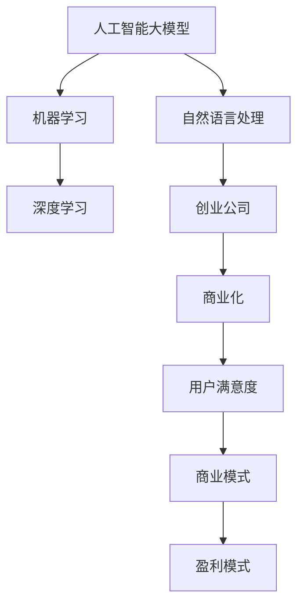

                 

# AI 大模型创业：如何利用商业优势？

> 关键词：人工智能大模型,创业,商业化,机器学习,深度学习,自然语言处理,NLP,技术转化

## 1. 背景介绍

### 1.1 问题由来
近年来，随着人工智能技术的快速发展，尤其是深度学习和大模型的兴起，推动了AI在各行业中的应用与落地。特别是在自然语言处理（NLP）领域，大模型凭借其强大的语言理解能力，逐渐成为解决各种NLP问题的利器。然而，技术转化为商业价值是AI创业公司面临的一项巨大挑战。在市场竞争日益激烈的背景下，如何利用AI大模型在商业上取得优势，成为AI创业者必须解答的关键问题。

### 1.2 问题核心关键点
在创业过程中，利用AI大模型获取商业优势主要关注以下几个核心关键点：

- **技术先进性**：大模型在NLP领域的广泛应用和卓越性能是其核心竞争力。
- **市场适应性**：模型应能快速适配不同业务场景，提高用户接受度。
- **用户体验**：用户体验是产品成功的关键，如何通过大模型提升用户满意度是重点。
- **商业盈利模式**：如何通过产品实现盈利，寻找可持续的商业模式是创业公司的核心目标。

### 1.3 问题研究意义
本文将深入探讨AI大模型如何被转化为商业优势，为AI创业者提供具体的策略和方法。本研究有助于理解如何构建商业化AI产品，提升AI企业的市场竞争力，加速AI技术的产业化进程。

## 2. 核心概念与联系

### 2.1 核心概念概述

为更好地理解AI大模型创业的商业优势，本节将介绍几个关键概念：

- **人工智能大模型**：以Transformer架构为代表的大规模预训练语言模型，通过在大规模无标签文本数据上进行预训练，学习通用的语言表示。
- **创业公司**：在人工智能领域创办的新兴企业，以技术驱动为核心竞争力。
- **商业化**：将AI技术或产品转化为市场化和商业化的过程，使其具有实用价值和经济效益。
- **自然语言处理（NLP）**：研究计算机如何理解、处理、生成人类语言的技术。
- **机器学习**：使用算法和统计模型让计算机系统从数据中学习并进行预测或决策。
- **深度学习**：一种特殊类型的机器学习，使用多层神经网络进行数据处理和建模。

这些概念之间的逻辑关系可以通过以下Mermaid流程图来展示：



这个流程图展示了大模型在创业公司中如何通过商业化的各个环节，最终转化为实际的经济价值。

## 3. 核心算法原理 & 具体操作步骤
### 3.1 算法原理概述

AI大模型的商业化通常涉及以下算法原理：

- **预训练**：在大规模无标签文本数据上进行预训练，学习通用语言表示。
- **微调**：针对特定任务，使用少量标注数据进行有监督学习，提高模型在该任务上的性能。
- **推理**：在实际应用中，对模型进行推理预测，输出结果。
- **优化**：通过优化模型结构、参数和算法，提升模型性能和效率。

这些步骤相互关联，共同构成AI大模型商业化的完整流程。

### 3.2 算法步骤详解

以下是AI大模型商业化的具体操作步骤：

1. **数据准备**：收集并标注所需领域的数据集。
2. **模型选择**：选择合适的预训练模型或构建新的模型。
3. **模型微调**：在标注数据上对模型进行微调，优化模型性能。
4. **模型部署**：将训练好的模型部署到云端或本地服务器上。
5. **用户测试**：在实际场景中测试模型的性能和用户体验。
6. **商业化**：根据测试结果和用户反馈，调整产品，找到可持续的商业模式。

### 3.3 算法优缺点

使用AI大模型进行商业化的优点包括：

- **高效**：预训练模型可以快速适配新任务，节省时间和成本。
- **准确**：预训练模型在大规模数据上进行学习，具有较高的准确性和泛化能力。
- **灵活**：模型可以微调适配各种业务场景，提高应用灵活性。

缺点则包括：

- **成本高**：预训练模型需要大量计算资源和标注数据。
- **技术门槛高**：需要具备深度学习和自然语言处理的专业知识。
- **数据依赖性强**：模型性能高度依赖数据质量，标注数据不足可能影响效果。

### 3.4 算法应用领域

AI大模型在多个领域具有广泛的应用前景：

- **医疗健康**：辅助诊断、药物研发、患者情感分析等。
- **金融服务**：信用评分、风险管理、投资策略等。
- **教育培训**：个性化学习、作业批改、智能辅导等。
- **智能客服**：语音识别、情感识别、意图理解等。
- **智能家居**：语音控制、自然语言交互、智能推荐等。

这些应用场景展示了AI大模型在商业化过程中可以带来的巨大商业价值和社会效益。

## 4. 数学模型和公式 & 详细讲解 & 举例说明

### 4.1 数学模型构建

假设有一个基于BERT的大模型，预训练得到的参数为$\theta$，微调任务为文本分类。我们定义一个二分类任务，输入为$x$，输出为$y$。则模型的预测函数可以表示为：

$$
\hat{y} = M_{\theta}(x)
$$

其中，$M_{\theta}$是BERT模型，$\theta$是模型参数。模型的损失函数为交叉熵损失：

$$
\mathcal{L}(\theta) = -\frac{1}{N}\sum_{i=1}^N y_i\log \hat{y}_i + (1-y_i)\log (1-\hat{y}_i)
$$

### 4.2 公式推导过程

对于二分类任务，我们可以利用上述定义的损失函数，结合梯度下降法进行模型的优化：

$$
\theta \leftarrow \theta - \eta \nabla_{\theta}\mathcal{L}(\theta)
$$

其中$\eta$为学习率。梯度计算可以通过反向传播算法完成：

$$
\nabla_{\theta}\mathcal{L}(\theta) = -\frac{1}{N}\sum_{i=1}^N \nabla_{\theta}\ell(M_{\theta}(x_i),y_i)
$$

### 4.3 案例分析与讲解

假设我们有一个情感分类任务，训练集为1000条电影评论，测试集为100条电影评论。使用BERT模型，将评论转化为向量表示，并通过微调得到情感分类器。具体步骤如下：

1. **数据准备**：收集1000条电影评论，并进行情感标注。
2. **模型选择**：使用预训练的BERT模型作为初始化参数。
3. **微调**：使用100条标注数据对模型进行微调，调整顶层分类器。
4. **测试**：在测试集上评估模型性能，对比微调前后效果。

通过上述步骤，我们可以得到在特定领域的高性能情感分类器，将其商业化，应用于在线电影评价系统中，从而提升用户体验。

## 5. 项目实践：代码实例和详细解释说明
### 5.1 开发环境搭建

为了进行商业化的AI大模型实践，首先需要搭建开发环境。以下是使用Python和PyTorch搭建开发环境的步骤：

1. **安装Python和Anaconda**：下载并安装Python和Anaconda，并创建一个新的虚拟环境。
2. **安装PyTorch和相关库**：使用conda安装PyTorch、transformers等库。
3. **安装深度学习框架**：使用pip安装TensorFlow、Keras等深度学习框架。

完成上述步骤后，即可在虚拟环境中进行模型开发和微调。

### 5.2 源代码详细实现

以下是使用BERT进行情感分类任务的Python代码实现：

```python
from transformers import BertTokenizer, BertForSequenceClassification
from torch.utils.data import DataLoader, Dataset
import torch

# 定义数据集
class MovieReviewDataset(Dataset):
    def __init__(self, texts, labels):
        self.texts = texts
        self.labels = labels
        self.tokenizer = BertTokenizer.from_pretrained('bert-base-uncased')

    def __len__(self):
        return len(self.texts)

    def __getitem__(self, item):
        text = self.texts[item]
        label = self.labels[item]
        encoding = self.tokenizer(text, return_tensors='pt', padding='max_length', max_length=512)
        input_ids = encoding['input_ids']
        attention_mask = encoding['attention_mask']
        label = torch.tensor(label, dtype=torch.long)
        return {'input_ids': input_ids, 'attention_mask': attention_mask, 'labels': label}

# 加载数据
train_dataset = MovieReviewDataset(train_texts, train_labels)
dev_dataset = MovieReviewDataset(dev_texts, dev_labels)
test_dataset = MovieReviewDataset(test_texts, test_labels)

# 模型初始化
model = BertForSequenceClassification.from_pretrained('bert-base-uncased', num_labels=2)

# 训练模型
device = torch.device('cuda' if torch.cuda.is_available() else 'cpu')
model.to(device)
optimizer = torch.optim.Adam(model.parameters(), lr=1e-5)
loss_fn = torch.nn.CrossEntropyLoss()

for epoch in range(epochs):
    model.train()
    total_loss = 0
    for batch in DataLoader(train_dataset, batch_size=16, shuffle=True):
        input_ids = batch['input_ids'].to(device)
        attention_mask = batch['attention_mask'].to(device)
        labels = batch['labels'].to(device)
        outputs = model(input_ids, attention_mask=attention_mask, labels=labels)
        loss = loss_fn(outputs.logits, labels)
        optimizer.zero_grad()
        loss.backward()
        optimizer.step()
        total_loss += loss.item()

    print(f'Epoch {epoch+1}, loss: {total_loss/len(train_dataset):.4f}')

# 模型评估
model.eval()
with torch.no_grad():
    total_correct = 0
    total_labels = 0
    for batch in DataLoader(dev_dataset, batch_size=16):
        input_ids = batch['input_ids'].to(device)
        attention_mask = batch['attention_mask'].to(device)
        labels = batch['labels'].to(device)
        outputs = model(input_ids, attention_mask=attention_mask)
        predictions = torch.argmax(outputs.logits, dim=1)
        total_correct += (predictions == labels).sum().item()
        total_labels += len(batch)
    print(f'Dev Accuracy: {total_correct/total_labels:.4f}')
```

### 5.3 代码解读与分析

在上述代码中，我们首先定义了数据集类`MovieReviewDataset`，用于处理电影评论数据。然后，加载了训练集、验证集和测试集，初始化了BERT模型，并使用Adam优化器进行训练。在训练过程中，我们使用了交叉熵损失函数，并在每个epoch结束后在验证集上评估模型性能。

## 6. 实际应用场景
### 6.1 智能客服系统

智能客服系统是大模型商业化的典型应用场景之一。智能客服可以7x24小时不间断地处理用户咨询，通过自然语言处理技术理解用户意图，并自动提供解决方案。通过微调，模型可以不断优化，适应不同行业和场景的客服需求。

### 6.2 金融舆情监测

金融机构需要实时监测市场舆情，及时发现潜在风险。大模型可以处理海量文本数据，通过微调学习金融领域的语言表示，识别市场动态和舆情变化，帮助金融机构进行风险预警。

### 6.3 个性化推荐系统

推荐系统是另一个大模型商业化的应用场景。通过微调模型，可以学习用户行为和偏好，为用户提供个性化的推荐内容。模型可以根据用户反馈不断优化，提高推荐效果。

### 6.4 未来应用展望

未来，随着AI大模型的不断发展，将会有更多商业化应用出现。例如，在智能医疗、智能制造、智能交通等领域，大模型可以辅助医生诊断、优化生产流程、提升交通安全等。这些应用将进一步推动AI技术在各行业的应用和发展。

## 7. 工具和资源推荐
### 7.1 学习资源推荐

为了帮助AI创业者掌握AI大模型商业化的技能，以下是一些推荐的学习资源：

1. **深度学习与自然语言处理**：斯坦福大学的Coursera课程，系统讲解深度学习、自然语言处理的基础知识和应用。
2. **Transformers库**：Hugging Face提供的开源库，包含多种预训练模型，可以用于微调、推理等任务。
3. **TensorFlow和PyTorch**：Google和Facebook开源的深度学习框架，支持各种深度学习任务。
4. **Kaggle竞赛**：参加Kaggle的NLP竞赛，通过实际项目提升实践能力。

### 7.2 开发工具推荐

以下是一些推荐的大模型开发工具：

1. **Anaconda**：用于创建和管理虚拟环境，方便Python和相关库的安装。
2. **Jupyter Notebook**：交互式的编程环境，支持代码编写、数据可视化等。
3. **TensorBoard**：用于可视化模型训练和推理过程中的各种指标。
4. **Weights & Biases**：用于记录和跟踪模型训练过程，分析模型性能。

### 7.3 相关论文推荐

以下是一些推荐的相关论文，帮助深入理解大模型商业化：

1. **Attention is All You Need**：Transformer的原始论文，介绍Transformer的架构和训练方法。
2. **BERT: Pre-training of Deep Bidirectional Transformers for Language Understanding**：BERT的论文，介绍BERT的预训练和微调方法。
3. **Hugging Face官方文档**：提供丰富的预训练模型和代码样例，帮助理解和应用大模型。
4. **Parameter-Efficient Transfer Learning for NLP**：介绍 Adapter等参数高效微调方法，优化模型训练效率。
5. **Fine-tuning Large Pretrained Models for Multilingual NLP Tasks**：介绍多语言NLP任务的微调方法，拓展模型的应用范围。

## 8. 总结：未来发展趋势与挑战
### 8.1 总结

本文探讨了AI大模型在创业过程中的商业化应用。通过详细讲解模型预训练、微调、推理等关键步骤，帮助AI创业者掌握大模型商业化的核心技术。同时，介绍了实际应用场景，展望了未来发展方向，提供了相关的学习资源、开发工具和论文推荐，为AI创业者提供了全面的技术支持和指导。

### 8.2 未来发展趋势

未来，AI大模型在商业化过程中将继续发展，以下是一些趋势：

1. **模型规模不断增大**：随着计算资源和数据规模的增长，预训练模型将更加庞大，性能将进一步提升。
2. **微调方法更加多样化**：参数高效微调、自监督微调等方法将得到更广泛应用。
3. **应用场景更加多样化**：AI大模型将在更多领域实现商业化，如医疗、金融、制造等。
4. **用户体验进一步提升**：通过优化模型和算法，提升用户体验，增强用户粘性。
5. **商业模式更加多样化**：如API服务、订阅模式、按需付费等，将满足不同客户的需求。

### 8.3 面临的挑战

尽管AI大模型在商业化过程中取得了显著进展，但仍面临一些挑战：

1. **数据获取和标注成本高**：高质量的数据获取和标注需要大量时间和资源。
2. **技术复杂度高**：AI大模型的构建和商业化需要较高的技术门槛。
3. **算法复杂度高**：模型训练和优化过程复杂，需要深入理解和实践。
4. **市场竞争激烈**：AI大模型领域竞争激烈，需要不断创新以保持竞争力。
5. **用户隐私和安全问题**：用户数据隐私和安全问题需要得到充分关注。

### 8.4 研究展望

面对这些挑战，未来的研究可以从以下几个方面进行探索：

1. **优化数据获取和标注**：利用无监督学习、半监督学习等方法，降低数据获取和标注成本。
2. **提升技术门槛**：通过开源和协作，降低技术门槛，让更多人参与AI大模型的构建和应用。
3. **优化算法性能**：开发更高效、更灵活的微调方法，提升模型性能和训练效率。
4. **探索新商业模式**：如数据即服务、平台即服务等，拓展商业化的空间。
5. **保护用户隐私和安全**：建立完善的隐私保护机制，确保用户数据安全。

## 9. 附录：常见问题与解答

**Q1：AI大模型商业化的核心是什么？**

A: AI大模型商业化的核心在于如何利用其强大的语言处理能力，解决实际业务问题，提升用户体验，找到可持续的商业模式。

**Q2：如何选择适合的预训练模型？**

A: 选择预训练模型需要考虑业务需求、数据规模和技术能力等因素。对于文本分类任务，BERT和GPT-2等预训练模型效果较好。对于其他任务，可以根据具体需求选择合适的模型。

**Q3：如何提升模型性能？**

A: 提升模型性能需要从数据、模型、算法等多个方面进行优化。例如，使用更好的数据预处理技术、调整模型结构、改进优化算法等。

**Q4：如何降低数据获取和标注成本？**

A: 利用无监督学习、半监督学习等方法，减少对标注数据的依赖。同时，可以使用开源数据集和预训练模型，降低数据获取成本。

**Q5：如何解决用户隐私和安全问题？**

A: 建立完善的隐私保护机制，如数据加密、匿名化等措施，确保用户数据的安全。同时，遵循相关法律法规，保护用户隐私。

---

作者：禅与计算机程序设计艺术 / Zen and the Art of Computer Programming

