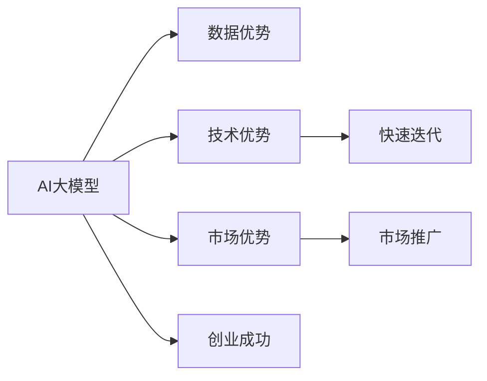

                 

# AI 大模型创业：如何利用国际优势？

在当前科技飞速发展的时代，AI大模型以其卓越的性能和广泛的应用前景，成为了众多创业者和企业家的关注焦点。然而，如何充分利用国际优势，把握大模型创业的机会，成为了摆在面前的一大挑战。本文将详细探讨如何通过利用国际优势，加速AI大模型创业的成功之路。

## 1. 背景介绍

### 1.1 问题由来

随着深度学习技术的发展，大模型（Large Models）如BERT、GPT等在自然语言处理、计算机视觉、语音识别等领域取得了显著的进步，并开始广泛应用于工业生产、医疗健康、金融服务等各个行业。AI大模型的出现，不仅推动了技术进步，也催生了众多创业机会。

然而，创业过程中，很多创业者面临的困难之一是如何充分利用国际优势，特别是在数据、技术和市场方面。因此，本文旨在探讨如何通过利用国际优势，加速AI大模型创业的成功。

### 1.2 问题核心关键点

要充分利用国际优势，创业首先需要明确以下几个关键点：

- **数据优势**：利用国际多样化、大范围的数据资源，提升大模型训练质量和泛化能力。
- **技术优势**：紧跟国际前沿技术动态，快速迭代和优化大模型算法。
- **市场优势**：基于全球市场需求，打造具有国际竞争力的产品和服务。

## 2. 核心概念与联系

### 2.1 核心概念概述

- **AI大模型**：指的是基于深度学习技术，经过大规模数据预训练和微调得到的高性能模型，具有很强的通用性和泛化能力。
- **国际优势**：指在全球范围内，可以获取到的多样化数据资源、前沿技术和广阔的市场机会，这些资源可以帮助大模型创业企业在竞争中占据优势。
- **创业成功**：指通过充分利用国际优势，快速迭代和优化产品，满足市场需求，最终实现商业化成功。

### 2.2 核心概念原理和架构的 Mermaid 流程图



该图展示了AI大模型创业过程中，如何利用数据、技术和市场优势，通过快速迭代和市场推广，最终实现创业成功。

## 3. 核心算法原理 & 具体操作步骤

### 3.1 算法原理概述

AI大模型创业的算法原理主要基于以下几个方面：

- **数据驱动**：利用国际多样化的数据资源，进行大规模预训练，提升模型的泛化能力和准确性。
- **技术创新**：紧跟国际前沿技术动态，持续优化模型算法，提升模型性能。
- **市场需求**：通过市场调研，明确目标市场和用户需求，进行有针对性的产品设计和开发。

### 3.2 算法步骤详解

1. **数据收集与处理**：
    - 利用国际数据资源，如大规模自然语言文本、图像、视频等，进行数据收集和预处理。
    - 使用数据增强、数据清洗等技术，提升数据质量，确保模型训练的稳定性和有效性。

2. **模型训练与优化**：
    - 利用大模型架构，如Transformer、BERT等，进行大规模预训练和微调。
    - 采用先进的技术，如分布式训练、混合精度训练等，提高训练效率，缩短迭代周期。

3. **市场调研与产品设计**：
    - 进行市场调研，了解目标市场和用户需求，进行有针对性的产品设计和开发。
    - 使用用户反馈，进行快速迭代，优化产品功能和用户体验。

### 3.3 算法优缺点

**优点**：
- 充分利用国际多样化数据资源，提升模型泛化能力和准确性。
- 紧跟国际前沿技术动态，持续优化模型算法，提升性能。
- 基于全球市场需求，打造具有国际竞争力的产品和服务。

**缺点**：
- 数据收集和处理成本高，需要大量时间和资源投入。
- 技术迭代和优化需要高水平的技术团队支持，门槛较高。
- 市场推广和运营需要复杂的商业策略和市场资源。

### 3.4 算法应用领域

AI大模型创业可以广泛应用于以下领域：

- **自然语言处理**：如文本分类、情感分析、机器翻译、问答系统等。
- **计算机视觉**：如图像识别、目标检测、图像生成等。
- **语音识别与处理**：如语音合成、语音识别、语音情感分析等。
- **医疗健康**：如医学影像分析、药物研发、患者问诊等。
- **金融服务**：如信用评分、风险评估、欺诈检测等。

## 4. 数学模型和公式 & 详细讲解 & 举例说明

### 4.1 数学模型构建

AI大模型的构建主要基于深度学习技术，其数学模型包括神经网络、卷积神经网络（CNN）、循环神经网络（RNN）、Transformer等。

### 4.2 公式推导过程

以Transformer为例，其核心公式为：

$$
\text{Attention}(Q, K, V) = \text{Softmax}(QW^QT)K^T
$$

其中，$Q$、$K$、$V$分别为查询、键、值矩阵，$W^Q$、$W^K$、$W^V$分别为投影矩阵。该公式实现了Transformer模型中注意力机制的计算。

### 4.3 案例分析与讲解

假设我们要训练一个图像识别模型，其输入为图像数据，输出为分类标签。我们可以使用卷积神经网络（CNN）构建模型，并使用交叉熵损失函数进行训练。

数学模型为：

$$
\mathcal{L}(y, \hat{y}) = -\frac{1}{N} \sum_{i=1}^N y_i \log \hat{y}_i
$$

其中，$y$为真实标签，$\hat{y}$为模型预测结果，$N$为样本数量。通过最小化损失函数$\mathcal{L}$，可以不断优化模型参数，提升模型性能。

## 5. 项目实践：代码实例和详细解释说明

### 5.1 开发环境搭建

为了进行AI大模型创业的开发，我们需要搭建一个高性能的开发环境。以下是Python和TensorFlow的开发环境搭建步骤：

1. 安装Anaconda：从官网下载并安装Anaconda，用于创建独立的Python环境。

2. 创建并激活虚拟环境：
```bash
conda create -n tf-env python=3.7 
conda activate tf-env
```

3. 安装TensorFlow：根据CUDA版本，从官网获取对应的安装命令。例如：
```bash
conda install tensorflow
```

4. 安装各类工具包：
```bash
pip install numpy pandas scikit-learn matplotlib tqdm jupyter notebook ipython
```

### 5.2 源代码详细实现

以下是使用TensorFlow实现一个简单的图像分类模型的代码：

```python
import tensorflow as tf
from tensorflow.keras import layers, models

# 加载数据
(x_train, y_train), (x_test, y_test) = tf.keras.datasets.mnist.load_data()

# 数据预处理
x_train = x_train.reshape(x_train.shape[0], 28, 28, 1).astype('float32') / 255
x_test = x_test.reshape(x_test.shape[0], 28, 28, 1).astype('float32') / 255

# 构建模型
model = models.Sequential([
    layers.Conv2D(32, (3, 3), activation='relu', input_shape=(28, 28, 1)),
    layers.MaxPooling2D((2, 2)),
    layers.Flatten(),
    layers.Dense(64, activation='relu'),
    layers.Dense(10, activation='softmax')
])

# 编译模型
model.compile(optimizer=tf.keras.optimizers.Adam(), loss='categorical_crossentropy', metrics=['accuracy'])

# 训练模型
model.fit(x_train, y_train, epochs=10, validation_data=(x_test, y_test))

# 评估模型
model.evaluate(x_test, y_test)
```

### 5.3 代码解读与分析

**数据预处理**：将图像数据进行归一化和预处理，确保数据输入模型的格式和规模一致。

**模型构建**：使用卷积神经网络（CNN）架构，通过多层卷积、池化、全连接等操作，构建一个简单的图像分类模型。

**模型编译与训练**：使用Adam优化器，交叉熵损失函数进行模型编译，并使用训练集进行模型训练，同时在验证集上进行性能评估。

**模型评估**：使用测试集进行模型评估，输出模型的准确率和损失。

## 6. 实际应用场景

### 6.1 智能医疗

在智能医疗领域，AI大模型可以用于医学影像分析、患者问诊、药物研发等任务。通过利用国际多样化的医疗数据，进行大规模预训练和微调，可以提升模型的诊断准确性和预测能力。

### 6.2 智能金融

在智能金融领域，AI大模型可以用于信用评分、风险评估、欺诈检测等任务。通过利用国际多样化的金融数据，进行大规模预训练和微调，可以提升模型的风险识别能力和欺诈检测能力。

### 6.3 智能制造

在智能制造领域，AI大模型可以用于设备故障预测、生产调度优化、质量控制等任务。通过利用国际多样化的工业数据，进行大规模预训练和微调，可以提升模型的预测准确性和优化能力。

## 7. 工具和资源推荐

### 7.1 学习资源推荐

为了帮助创业者系统掌握AI大模型的理论基础和实践技巧，这里推荐一些优质的学习资源：

1. 《深度学习》书籍：Ian Goodfellow、Yoshua Bengio、Aaron Courville合著的经典教材，系统介绍了深度学习的各个方面，包括神经网络、优化算法、模型训练等。

2. 《TensorFlow官方文档》：TensorFlow的官方文档，提供了详细的API参考、案例教程和最佳实践。

3. 《自然语言处理与深度学习》课程：斯坦福大学的经典NLP课程，系统讲解了NLP领域的各项技术和应用，适合初学者和进阶学习者。

4. HuggingFace官方文档：HuggingFace的官方文档，提供了丰富的预训练模型和微调示例，是实际应用开发的好帮手。

5. GitHub开源项目：GitHub上丰富的AI大模型开源项目，可以提供更多的学习资源和实践经验。

### 7.2 开发工具推荐

以下是几款用于AI大模型创业开发的常用工具：

1. TensorFlow：由Google主导开发的开源深度学习框架，生产部署方便，适合大规模工程应用。

2. PyTorch：基于Python的开源深度学习框架，灵活动态的计算图，适合快速迭代研究。

3. Keras：基于TensorFlow和Theano的高级API，简单易用，适合初学者入门。

4. Weights & Biases：模型训练的实验跟踪工具，可以记录和可视化模型训练过程中的各项指标，方便对比和调优。

5. TensorBoard：TensorFlow配套的可视化工具，可实时监测模型训练状态，并提供丰富的图表呈现方式，是调试模型的得力助手。

### 7.3 相关论文推荐

AI大模型创业的研究源自学界的持续研究。以下是几篇奠基性的相关论文，推荐阅读：

1. Attention is All You Need：提出了Transformer结构，开启了NLP领域的预训练大模型时代。

2. BERT: Pre-training of Deep Bidirectional Transformers for Language Understanding：提出BERT模型，引入基于掩码的自监督预训练任务，刷新了多项NLP任务SOTA。

3. Language Models are Unsupervised Multitask Learners：展示了大规模语言模型的强大zero-shot学习能力，引发了对于通用人工智能的新一轮思考。

4. Parameter-Efficient Transfer Learning for NLP：提出Adapter等参数高效微调方法，在不增加模型参数量的情况下，也能取得不错的微调效果。

5. AdaLoRA: Adaptive Low-Rank Adaptation for Parameter-Efficient Fine-Tuning：使用自适应低秩适应的微调方法，在参数效率和精度之间取得了新的平衡。

这些论文代表了大模型创业技术的发展脉络。通过学习这些前沿成果，可以帮助研究者把握学科前进方向，激发更多的创新灵感。

## 8. 总结：未来发展趋势与挑战

### 8.1 总结

本文对AI大模型创业进行了全面系统的介绍，主要从数据、技术和市场三个方面探讨了如何充分利用国际优势，加速AI大模型创业的成功。具体内容如下：

1. 数据驱动：充分利用国际多样化数据资源，提升模型训练质量和泛化能力。
2. 技术创新：紧跟国际前沿技术动态，持续优化模型算法，提升性能。
3. 市场需求：基于全球市场需求，打造具有国际竞争力的产品和服务。

通过本文的系统梳理，可以看到，AI大模型创业需要充分利用国际优势，不断迭代和优化产品，才能在竞争中占据优势。未来，随着AI技术的不断发展，大模型创业将迎来更多的机遇和挑战。

### 8.2 未来发展趋势

展望未来，AI大模型创业将呈现以下几个发展趋势：

1. 数据资源更加丰富：随着互联网和物联网的普及，全球数据量将进一步增长，数据驱动的AI大模型将更具竞争力。

2. 技术创新加速：AI大模型算法和技术将持续创新，如Transformer的进一步优化、GPT-3的扩展应用等，推动大模型性能不断提升。

3. 市场应用多样化：AI大模型将应用于更多行业领域，如智能制造、智能交通、智能家居等，带来更广泛的应用场景和商业价值。

4. 跨界融合加强：AI大模型将与其他技术（如区块链、物联网、大数据等）进行跨界融合，形成更完整的技术生态系统。

5. 伦理和法律问题：AI大模型在应用过程中，需注意伦理和法律问题，如隐私保护、数据安全、知识产权等。

### 8.3 面临的挑战

尽管AI大模型创业拥有广阔的前景，但在迈向更加智能化、普适化应用的过程中，仍面临诸多挑战：

1. 数据隐私和安全：如何在保护数据隐私的同时，充分利用国际数据资源，是一个重要挑战。

2. 技术复杂度：AI大模型的构建和训练需要高水平的技术团队，需要投入大量时间和资源。

3. 市场竞争激烈：AI大模型领域竞争激烈，如何在众多企业中脱颖而出，是创业企业面临的一大挑战。

4. 伦理和法律问题：AI大模型在应用过程中，需注意伦理和法律问题，如隐私保护、数据安全、知识产权等。

5. 用户体验：AI大模型在实际应用中，需注重用户体验，提升产品的易用性和可靠性。

### 8.4 研究展望

未来，AI大模型创业的研究方向将集中在以下几个方面：

1. 数据隐私保护：研究如何充分利用国际数据资源，同时保护数据隐私和安全。

2. 技术优化：研究如何提升AI大模型的训练效率和性能，降低成本和资源消耗。

3. 市场推广：研究如何利用国际市场优势，推广和应用AI大模型产品，提升市场竞争力。

4. 跨界融合：研究AI大模型与其他技术的跨界融合，形成更完整的技术生态系统。

5. 伦理和法律问题：研究如何在AI大模型应用过程中，遵循伦理和法律规范，确保应用的公正性和安全性。

总之，AI大模型创业需要充分利用国际优势，不断创新和优化，才能在竞争中占据优势，实现商业化成功。未来，随着AI技术的不断发展，大模型创业将迎来更多的机遇和挑战。

## 9. 附录：常见问题与解答

**Q1：如何充分利用国际优势进行AI大模型创业？**

A: 充分利用国际优势进行AI大模型创业，主要从以下几个方面入手：
1. 数据驱动：利用国际多样化数据资源，进行大规模预训练和微调，提升模型的泛化能力和准确性。
2. 技术创新：紧跟国际前沿技术动态，持续优化模型算法，提升性能。
3. 市场需求：基于全球市场需求，打造具有国际竞争力的产品和服务。

**Q2：AI大模型创业过程中，数据隐私和安全如何保障？**

A: AI大模型创业过程中，数据隐私和安全是一个重要问题。以下是一些保障措施：
1. 数据匿名化：对数据进行匿名化处理，保护用户隐私。
2. 数据加密：对数据进行加密处理，防止数据泄露。
3. 访问控制：严格控制数据访问权限，防止未授权访问。
4. 安全审计：定期进行数据安全审计，确保数据安全。

**Q3：AI大模型创业过程中，如何应对激烈的市场竞争？**

A: AI大模型创业过程中，市场竞争激烈是一个重要问题。以下是一些应对措施：
1. 明确目标市场：明确目标市场和用户需求，进行有针对性的产品设计和开发。
2. 持续创新：持续进行技术创新，提升产品竞争力。
3. 用户反馈：通过用户反馈，进行快速迭代和优化，提升用户体验。
4. 市场推广：利用市场推广策略，扩大产品覆盖面。

**Q4：AI大模型创业过程中，如何提升用户体验？**

A: AI大模型创业过程中，提升用户体验是一个重要问题。以下是一些提升措施：
1. 易用性：提升产品的易用性，使用户能快速上手。
2. 交互设计：优化产品界面和交互设计，提升用户满意度。
3. 用户支持：提供完善的用户支持和售后服务，解决用户问题。
4. 个性化推荐：根据用户行为和偏好，进行个性化推荐，提升用户体验。

总之，AI大模型创业需要充分利用国际优势，不断创新和优化，才能在竞争中占据优势，实现商业化成功。未来，随着AI技术的不断发展，大模型创业将迎来更多的机遇和挑战。

---

作者：禅与计算机程序设计艺术 / Zen and the Art of Computer Programming

