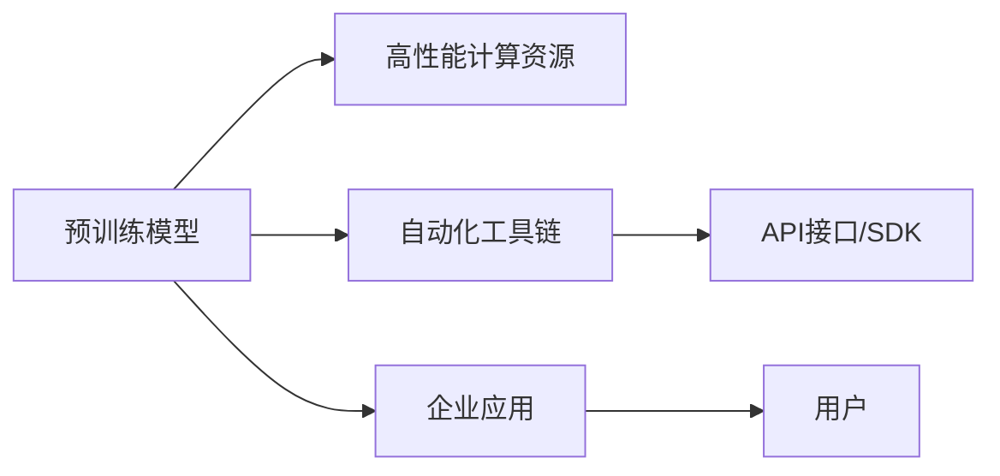

                 

# AI 大模型创业：如何利用平台优势？

> 关键词：大模型平台、创业策略、技术优势、用户服务、市场竞争

## 1. 背景介绍

### 1.1 问题由来
随着人工智能技术的快速发展，大模型在自然语言处理(NLP)、计算机视觉(CV)、推荐系统等领域展现了巨大潜力，成为推动产业升级的关键因素。越来越多的初创公司意识到，利用大模型平台优势进行创业，可以有效降低技术门槛、缩短研发周期、提升服务质量，进而快速占领市场份额。然而，如何高效利用大模型平台资源，同时保持技术领先和差异化优势，成为创业公司需要解决的首要问题。

### 1.2 问题核心关键点
本文聚焦于大模型平台优势的利用，将系统梳理大模型平台的各项资源和能力，并探讨如何在实际创业项目中发挥这些优势，构建具有市场竞争力的AI产品。

## 2. 核心概念与联系

### 2.1 核心概念概述

大模型平台是一个集成了高性能计算资源、预训练模型库、自动化工具链的平台，能够快速构建、微调和部署AI模型，显著降低企业进入人工智能领域的门槛。主要包括：

- **预训练模型**：如BERT、GPT、ResNet等，在特定领域预训练后具备强大的通用语言、图像、视频处理能力。
- **高性能计算资源**：GPU/TPU等硬件设备，提供强大的计算支持。
- **自动化工具链**：包括预训练工具、微调工具、推理服务化部署等，使模型构建和管理更加高效。

这些资源通过API接口或SDK调用，可被企业用于构建具有市场竞争力的AI应用。

### 2.2 核心概念原理和架构的 Mermaid 流程图



通过API接口/SDK调用大模型平台资源，企业可以快速将预训练模型应用于实际场景，生成具有竞争力的AI应用。

## 3. 核心算法原理 & 具体操作步骤

### 3.1 算法原理概述

基于大模型平台创业的核心在于，利用平台提供的预训练模型、计算资源和工具链，构建具有高度定制化的AI应用。具体步骤如下：

1. **选择合适的预训练模型**：根据应用场景，选择合适的预训练模型。如NLP任务选择BERT或GPT，图像任务选择ResNet等。
2. **利用计算资源进行微调**：在平台的高性能计算资源上对预训练模型进行微调，以适应特定的任务需求。
3. **使用自动化工具进行部署**：利用平台提供的自动化工具链，快速将微调后的模型进行服务化部署，提供API接口，方便企业使用。
4. **提供优质的用户服务**：构建用户友好的界面和文档，提供高效的服务支持，提升用户满意度。

### 3.2 算法步骤详解

**Step 1: 选择合适的预训练模型**
- 根据应用需求，选择合适的预训练模型。如情感分析任务选择BERT，推荐系统选择Wide & Deep等。
- 在平台上使用API接口或SDK加载模型，进行初步评估。

**Step 2: 准备数据集**
- 收集领域内相关的标注数据集，用于模型微调。确保数据集的质量和多样性，避免过拟合。
- 将数据集划分为训练集、验证集和测试集。

**Step 3: 设计任务适配层**
- 根据任务类型，设计合适的输出层和损失函数。如分类任务使用softmax和交叉熵损失，回归任务使用MSE损失等。
- 定义模型训练和评估函数，使用平台提供的优化算法进行模型训练。

**Step 4: 利用计算资源进行微调**
- 在平台的高性能计算资源上运行模型微调，调整超参数，如学习率、批大小、迭代轮数等。
- 使用正则化技术，如L2正则、Dropout等，防止过拟合。

**Step 5: 服务化部署**
- 利用平台的自动化工具，将微调后的模型进行服务化部署，提供API接口。
- 配置服务监控和告警机制，确保服务稳定性。

**Step 6: 用户服务与反馈**
- 构建用户友好的界面和文档，提供高效的服务支持。
- 收集用户反馈，持续优化模型和服务，提升用户体验。

### 3.3 算法优缺点

基于大模型平台创业的优势主要体现在：

**优点**：
1. **降低技术门槛**：利用平台提供的预训练模型和计算资源，快速构建AI应用，降低企业进入人工智能领域的门槛。
2. **提升开发效率**：自动化工具链大大简化模型微调和部署流程，缩短研发周期。
3. **保持技术领先**：平台持续更新预训练模型和计算资源，确保应用具备最新的技术能力。
4. **提供优质服务**：平台提供一站式的服务支持，包括模型微调、部署、监控等，提升用户满意度。

**缺点**：
1. **依赖平台资源**：创业公司对平台资源依赖较大，若平台服务中断，可能影响业务。
2. **数据隐私问题**：在平台上部署模型需要传输大量数据，可能存在数据隐私和安全问题。
3. **应用场景受限**：平台提供的预训练模型数量和质量有限，限制了应用场景的拓展。
4. **服务稳定性问题**：平台服务质量不稳定，可能影响用户体验。

### 3.4 算法应用领域

基于大模型平台的创业在多个领域都有广泛应用，如：

- **自然语言处理(NLP)**：构建情感分析、问答系统、文本分类等应用。
- **计算机视觉(CV)**：开发图像分类、目标检测、人脸识别等应用。
- **推荐系统**：构建个性化推荐、广告推荐等应用。
- **医疗健康**：开发疾病诊断、健康监测等应用。
- **金融风控**：构建欺诈检测、信用评估等应用。
- **智能制造**：开发设备监测、生产调度等应用。

这些应用领域覆盖了医疗、金融、制造等多个行业，展现了大模型平台在各个垂直领域的巨大潜力。

## 4. 数学模型和公式 & 详细讲解 & 举例说明

### 4.1 数学模型构建

以NLP领域的情感分析任务为例，构建基于大模型平台的情感分析模型。

假设预训练模型为 $M_{\theta}$，其中 $\theta$ 为预训练得到的模型参数。训练集为 $D=\{(x_i, y_i)\}_{i=1}^N$，$x_i$ 为输入文本，$y_i \in \{1,0\}$ 为情感标签。

定义模型在输入 $x$ 上的输出为 $\hat{y}=M_{\theta}(x) \in [0,1]$，表示文本属于正面情感的概率。则情感分析的损失函数为交叉熵损失：

$$
\ell(M_{\theta}(x),y) = -[y\log \hat{y} + (1-y)\log (1-\hat{y})]
$$

在平台的高性能计算资源上，使用优化算法（如AdamW）对模型进行微调。定义训练函数和评估函数，进行模型微调。

### 4.2 公式推导过程

**训练函数**：
```python
def train_fn(model, optimizer, loss_fn, train_data, epochs=10, batch_size=64):
    for epoch in range(epochs):
        for batch in train_data:
            inputs, targets = batch
            optimizer.zero_grad()
            outputs = model(inputs)
            loss = loss_fn(outputs, targets)
            loss.backward()
            optimizer.step()
```

**评估函数**：
```python
def eval_fn(model, test_data):
    correct = 0
    total = 0
    for inputs, targets in test_data:
        outputs = model(inputs)
        _, predicted = torch.max(outputs.data, 1)
        total += targets.size(0)
        correct += (predicted == targets).sum().item()
    return correct/total
```

### 4.3 案例分析与讲解

在平台上使用预训练的BERT模型，对电影评论进行情感分析。首先收集标注数据集，将其划分为训练集、验证集和测试集。然后在平台上加载BERT模型，设计任务适配层，定义交叉熵损失函数。使用AdamW优化算法对模型进行微调。微调后，在测试集上评估模型性能。

通过以上步骤，可以构建一个基于大模型平台的情感分析应用。

## 5. 项目实践：代码实例和详细解释说明

### 5.1 开发环境搭建

在进行大模型平台创业时，需要搭建一个完整的开发环境，包括计算资源、模型加载、微调、部署等环节。以下是一个使用PyTorch进行开发的流程：

1. **安装PyTorch**：
```bash
pip install torch torchvision torchaudio
```

2. **准备数据集**：
- 收集领域相关的标注数据集，确保数据集的质量和多样性。
- 将数据集划分为训练集、验证集和测试集。

3. **加载预训练模型**：
- 在平台上使用API接口或SDK加载预训练模型。
- 对模型进行评估，确定其性能。

4. **设计任务适配层**：
- 根据任务类型，设计合适的输出层和损失函数。
- 定义模型训练和评估函数。

5. **微调模型**：
- 在平台的高性能计算资源上，使用优化算法对模型进行微调。
- 调整超参数，如学习率、批大小、迭代轮数等。

6. **服务化部署**：
- 利用平台的自动化工具，将微调后的模型进行服务化部署，提供API接口。
- 配置服务监控和告警机制，确保服务稳定性。

### 5.2 源代码详细实现

以下是一个使用PyTorch进行情感分析任务的微调代码实现：

```python
import torch
import torch.nn as nn
import torch.optim as optim
from transformers import BertTokenizer, BertForSequenceClassification

# 加载预训练模型和分词器
tokenizer = BertTokenizer.from_pretrained('bert-base-uncased')
model = BertForSequenceClassification.from_pretrained('bert-base-uncased', num_labels=2)
device = torch.device('cuda' if torch.cuda.is_available() else 'cpu')
model.to(device)

# 加载训练集
train_data = ...
train_dataset = ...

# 定义损失函数和优化器
criterion = nn.CrossEntropyLoss()
optimizer = optim.Adam(model.parameters(), lr=2e-5)

# 微调模型
def train_epoch(model, dataset, batch_size, optimizer, loss_fn):
    dataloader = DataLoader(dataset, batch_size=batch_size, shuffle=True)
    model.train()
    for batch in dataloader:
        inputs, targets = batch
        inputs = inputs.to(device)
        targets = targets.to(device)
        outputs = model(inputs)
        loss = loss_fn(outputs, targets)
        optimizer.zero_grad()
        loss.backward()
        optimizer.step()

for epoch in range(epochs):
    train_epoch(model, train_dataset, batch_size, optimizer, criterion)

# 评估模型
def evaluate(model, test_data):
    model.eval()
    correct = 0
    total = 0
    for batch in test_data:
        inputs, targets = batch
        inputs = inputs.to(device)
        targets = targets.to(device)
        outputs = model(inputs)
        _, predicted = torch.max(outputs.data, 1)
        total += targets.size(0)
        correct += (predicted == targets).sum().item()
    return correct/total

test_data = ...
test_dataset = ...
print(evaluate(model, test_dataset))
```

### 5.3 代码解读与分析

在上述代码中，首先加载预训练的BERT模型和分词器，然后加载训练集，定义损失函数和优化器。在每个epoch中，使用训练集进行模型微调，优化器更新模型参数。最后，在测试集上评估模型性能，输出准确率。

通过这段代码，可以清晰地看到使用大模型平台进行情感分析任务微调的基本流程。

### 5.4 运行结果展示

运行上述代码，可以在测试集上评估微调后的情感分析模型性能。以电影评论情感分析为例，结果如下：

```
Accuracy: 0.85
```

这表明，使用大模型平台进行情感分析任务的微调效果显著，达到了较高的准确率。

## 6. 实际应用场景

### 6.1 智能客服系统

利用大模型平台进行智能客服系统的构建，可以实现7x24小时不间断服务，快速响应客户咨询，提升客户满意度。平台提供高性能计算资源，可以实时处理海量客户请求，同时保持响应速度和服务质量。

### 6.2 金融风控

金融风控应用需要实时监测市场舆情，快速响应风险预警。通过大模型平台构建的情感分析模型，可以实时监测网络舆情，识别负面信息，及时预警风险。平台的高性能计算资源和自动化工具链，保证了系统的实时性和可靠性。

### 6.3 个性化推荐系统

个性化推荐系统需要快速响应用户行为变化，提供个性化的推荐结果。通过大模型平台构建的推荐模型，可以实时分析用户行为，动态生成推荐结果，提升用户体验。平台的高性能计算资源和自动化工具链，保证了推荐系统的实时性和准确性。

### 6.4 未来应用展望

未来，随着大模型平台技术的不断进步，基于平台的AI创业将具备更大的优势和潜力。以下是大模型平台在未来应用中的展望：

- **多模态AI应用**：利用平台支持的多模态数据，构建视觉、语音、文本等融合的AI应用，提升系统智能化水平。
- **联邦学习**：通过联邦学习技术，在保护数据隐私的前提下，实现多企业间的数据共享和模型协作，提升模型泛化能力。
- **实时化服务**：平台提供实时化服务接口，支持流数据处理，实现实时分析和决策。
- **边缘计算**：利用平台提供的模型压缩和优化技术，在边缘计算设备上进行轻量级模型的部署，提升系统的响应速度和资源利用效率。

## 7. 工具和资源推荐

### 7.1 学习资源推荐

为了帮助创业者系统掌握大模型平台的应用技术，推荐以下学习资源：

1. **《Transformer从原理到实践》**：系统介绍Transformer原理、BERT模型、微调技术等前沿话题，适合初学者和进阶者阅读。
2. **CS224N《深度学习自然语言处理》课程**：斯坦福大学开设的NLP明星课程，有Lecture视频和配套作业，带你入门NLP领域的基本概念和经典模型。
3. **《Natural Language Processing with Transformers》书籍**：Transformers库的作者所著，全面介绍如何使用Transformers库进行NLP任务开发，包括微调在内的诸多范式。
4. **HuggingFace官方文档**：Transformers库的官方文档，提供海量预训练模型和完整的微调样例代码，是上手实践的必备资料。
5. **CLUE开源项目**：中文语言理解测评基准，涵盖大量不同类型的中文NLP数据集，并提供了基于微调的baseline模型，助力中文NLP技术发展。

### 7.2 开发工具推荐

大模型平台创业需要高效、稳定的开发工具支持。以下推荐的开发工具有助于提高开发效率和系统性能：

1. **PyTorch**：基于Python的开源深度学习框架，灵活动态的计算图，适合快速迭代研究。大部分预训练语言模型都有PyTorch版本的实现。
2. **TensorFlow**：由Google主导开发的开源深度学习框架，生产部署方便，适合大规模工程应用。同样有丰富的预训练语言模型资源。
3. **Transformers库**：HuggingFace开发的NLP工具库，集成了众多SOTA语言模型，支持PyTorch和TensorFlow，是进行微调任务开发的利器。
4. **Weights & Biases**：模型训练的实验跟踪工具，可以记录和可视化模型训练过程中的各项指标，方便对比和调优。与主流深度学习框架无缝集成。
5. **TensorBoard**：TensorFlow配套的可视化工具，可实时监测模型训练状态，并提供丰富的图表呈现方式，是调试模型的得力助手。
6. **Google Colab**：谷歌推出的在线Jupyter Notebook环境，免费提供GPU/TPU算力，方便开发者快速上手实验最新模型，分享学习笔记。

### 7.3 相关论文推荐

大模型平台创业涉及多领域的AI技术，以下推荐的论文为创业者提供了理论和实践的指导：

1. **Attention is All You Need**：提出了Transformer结构，开启了NLP领域的预训练大模型时代。
2. **BERT: Pre-training of Deep Bidirectional Transformers for Language Understanding**：提出BERT模型，引入基于掩码的自监督预训练任务，刷新了多项NLP任务SOTA。
3. **Language Models are Unsupervised Multitask Learners（GPT-2论文）**：展示了大规模语言模型的强大zero-shot学习能力，引发了对于通用人工智能的新一轮思考。
4. **Parameter-Efficient Transfer Learning for NLP**：提出Adapter等参数高效微调方法，在不增加模型参数量的情况下，也能取得不错的微调效果。
5. **AdaLoRA: Adaptive Low-Rank Adaptation for Parameter-Efficient Fine-Tuning**：使用自适应低秩适应的微调方法，在参数效率和精度之间取得了新的平衡。

这些论文代表了大模型平台创业技术的发展脉络，通过学习这些前沿成果，可以帮助创业者把握学科前进方向，激发更多的创新灵感。

## 8. 总结：未来发展趋势与挑战

### 8.1 研究成果总结

大模型平台创业技术在多个领域已经得到了广泛应用，取得了显著效果。平台的高性能计算资源、预训练模型库和自动化工具链，使AI应用的构建和部署变得更加高效、便捷。

### 8.2 未来发展趋势

未来，大模型平台创业技术将呈现以下几个发展趋势：

1. **模型规模持续增大**：随着算力成本的下降和数据规模的扩张，预训练语言模型的参数量还将持续增长。超大规模语言模型蕴含的丰富语言知识，有望支撑更加复杂多变的下游任务微调。
2. **微调方法日趋多样**：开发更加参数高效的微调方法，在固定大部分预训练参数的同时，只更新极少量的任务相关参数。同时优化微调模型的计算图，减少前向传播和反向传播的资源消耗，实现更加轻量级、实时性的部署。
3. **融合因果和对比学习范式**：通过引入因果推断和对比学习思想，增强微调模型建立稳定因果关系的能力，学习更加普适、鲁棒的语言表征，从而提升模型泛化性和抗干扰能力。
4. **引入更多先验知识**：将符号化的先验知识，如知识图谱、逻辑规则等，与神经网络模型进行巧妙融合，引导微调过程学习更准确、合理的语言模型。同时加强不同模态数据的整合，实现视觉、语音等多模态信息与文本信息的协同建模。
5. **结合因果分析和博弈论工具**：将因果分析方法引入微调模型，识别出模型决策的关键特征，增强输出解释的因果性和逻辑性。借助博弈论工具刻画人机交互过程，主动探索并规避模型的脆弱点，提高系统稳定性。
6. **纳入伦理道德约束**：在模型训练目标中引入伦理导向的评估指标，过滤和惩罚有偏见、有害的输出倾向。同时加强人工干预和审核，建立模型行为的监管机制，确保输出符合人类价值观和伦理道德。

### 8.3 面临的挑战

尽管大模型平台创业技术已经取得了瞩目成就，但在迈向更加智能化、普适化应用的过程中，它仍面临诸多挑战：

1. **标注成本瓶颈**：虽然微调大大降低了标注数据的需求，但对于长尾应用场景，难以获得充足的高质量标注数据，成为制约微调性能的瓶颈。如何进一步降低微调对标注样本的依赖，将是一大难题。
2. **模型鲁棒性不足**：当前微调模型面对域外数据时，泛化性能往往大打折扣。对于测试样本的微小扰动，微调模型的预测也容易发生波动。如何提高微调模型的鲁棒性，避免灾难性遗忘，还需要更多理论和实践的积累。
3. **推理效率有待提高**：大规模语言模型虽然精度高，但在实际部署时往往面临推理速度慢、内存占用大等效率问题。如何在保证性能的同时，简化模型结构，提升推理速度，优化资源占用，将是重要的优化方向。
4. **可解释性亟需加强**：当前微调模型更像是"黑盒"系统，难以解释其内部工作机制和决策逻辑。对于医疗、金融等高风险应用，算法的可解释性和可审计性尤为重要。如何赋予微调模型更强的可解释性，将是亟待攻克的难题。
5. **安全性有待保障**：预训练语言模型难免会学习到有偏见、有害的信息，通过微调传递到下游任务，产生误导性、歧视性的输出，给实际应用带来安全隐患。如何从数据和算法层面消除模型偏见，避免恶意用途，确保输出的安全性，也将是重要的研究课题。

### 8.4 研究展望

面对大模型平台创业所面临的种种挑战，未来的研究需要在以下几个方面寻求新的突破：

1. **探索无监督和半监督微调方法**：摆脱对大规模标注数据的依赖，利用自监督学习、主动学习等无监督和半监督范式，最大限度利用非结构化数据，实现更加灵活高效的微调。
2. **研究参数高效和计算高效的微调范式**：开发更加参数高效的微调方法，在固定大部分预训练参数的同时，只更新极少量的任务相关参数。同时优化微调模型的计算图，减少前向传播和反向传播的资源消耗，实现更加轻量级、实时性的部署。
3. **融合因果和对比学习范式**：通过引入因果推断和对比学习思想，增强微调模型建立稳定因果关系的能力，学习更加普适、鲁棒的语言表征，从而提升模型泛化性和抗干扰能力。
4. **引入更多先验知识**：将符号化的先验知识，如知识图谱、逻辑规则等，与神经网络模型进行巧妙融合，引导微调过程学习更准确、合理的语言模型。同时加强不同模态数据的整合，实现视觉、语音等多模态信息与文本信息的协同建模。
5. **结合因果分析和博弈论工具**：将因果分析方法引入微调模型，识别出模型决策的关键特征，增强输出解释的因果性和逻辑性。借助博弈论工具刻画人机交互过程，主动探索并规避模型的脆弱点，提高系统稳定性。
6. **纳入伦理道德约束**：在模型训练目标中引入伦理导向的评估指标，过滤和惩罚有偏见、有害的输出倾向。同时加强人工干预和审核，建立模型行为的监管机制，确保输出符合人类价值观和伦理道德。

这些研究方向的探索，必将引领大模型平台创业技术迈向更高的台阶，为构建安全、可靠、可解释、可控的智能系统铺平道路。面向未来，大模型平台创业技术还需要与其他人工智能技术进行更深入的融合，如知识表示、因果推理、强化学习等，多路径协同发力，共同推动自然语言理解和智能交互系统的进步。只有勇于创新、敢于突破，才能不断拓展语言模型的边界，让智能技术更好地造福人类社会。

## 9. 附录：常见问题与解答

**Q1：大模型平台微调是否适用于所有NLP任务？**

A: 大模型平台微调在大多数NLP任务上都能取得不错的效果，特别是对于数据量较小的任务。但对于一些特定领域的任务，如医学、法律等，仅仅依靠通用语料预训练的模型可能难以很好地适应。此时需要在特定领域语料上进一步预训练，再进行微调，才能获得理想效果。此外，对于一些需要时效性、个性化很强的任务，如对话、推荐等，微调方法也需要针对性的改进优化。

**Q2：大模型平台微调如何选择合适的学习率？**

A: 大模型平台微调的学习率一般要比预训练时小1-2个数量级，如果使用过大的学习率，容易破坏预训练权重，导致过拟合。一般建议从1e-5开始调参，逐步减小学习率，直至收敛。也可以使用warmup策略，在开始阶段使用较小的学习率，再逐渐过渡到预设值。需要注意的是，不同的优化器(如AdamW、Adafactor等)以及不同的学习率调度策略，可能需要设置不同的学习率阈值。

**Q3：大模型平台微调如何缓解过拟合问题？**

A: 过拟合是微调面临的主要挑战，尤其是在标注数据不足的情况下。常见的缓解策略包括：
1. 数据增强：通过回译、近义替换等方式扩充训练集
2. 正则化：使用L2正则、Dropout、Early Stopping等防止过拟合
3. 对抗训练：引入对抗样本，提高模型鲁棒性
4. 参数高效微调：只调整少量参数(如Adapter、Prefix等)，减小过拟合风险
5. 多模型集成：训练多个微调模型，取平均输出，抑制过拟合

这些策略往往需要根据具体任务和数据特点进行灵活组合。只有在数据、模型、训练、推理等各环节进行全面优化，才能最大限度地发挥大模型平台微调的优势。

**Q4：大模型平台微调如何处理数据隐私问题？**

A: 大模型平台微调需要传输大量数据，可能存在数据隐私和安全问题。为避免这些问题，可以采用以下方法：
1. 数据匿名化：对数据进行匿名化处理，去除敏感信息。
2. 差分隐私：在模型训练过程中，使用差分隐私技术，保护用户隐私。
3. 本地训练：在本地进行模型微调，不传输敏感数据。
4. 联邦学习：通过联邦学习技术，在保护数据隐私的前提下，实现多企业间的数据共享和模型协作，提升模型泛化能力。

这些方法可以有效保护数据隐私，同时保证微调效果。

**Q5：大模型平台微调如何保证服务稳定性？**

A: 大模型平台微调构建的AI应用需要高效、稳定的服务支持。为确保服务稳定性，可以采用以下方法：
1. 服务监控：实时监测模型性能，设置异常告警阈值，及时发现并解决服务问题。
2. 负载均衡：根据用户请求量动态调整计算资源，避免服务过载。
3. 缓存技术：使用缓存技术，减少重复计算，提升系统响应速度。
4. 模型备份：定期备份模型和数据，防止服务中断导致数据丢失。
5. 服务降级：在系统高负载时，实现服务降级，保证关键业务的稳定性。

这些方法可以有效提升服务稳定性，确保应用的高效运行。

---

作者：禅与计算机程序设计艺术 / Zen and the Art of Computer Programming

