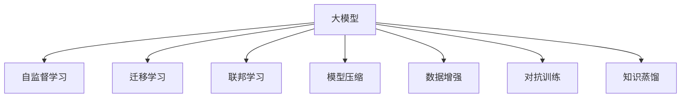

                 

# AI 大模型创业：如何利用数据优势？

## 1. 背景介绍

### 1.1 问题由来
随着人工智能技术的快速进步，尤其是深度学习在图像识别、自然语言处理等领域取得的突破性进展，大模型（Large Models）开始受到广泛关注。这些大模型在参数规模、精度、泛化能力等方面都远超传统模型，能够应用于更加复杂、广泛的问题。然而，大模型的训练和维护需要巨量的数据和算力支持，这给创业公司和中小型企业的实践带来了巨大挑战。如何在有限的资源下，有效利用数据优势，推动大模型创业的发展，是当前热议的话题。

### 1.2 问题核心关键点
大模型创业的核心在于如何高效利用数据，实现模型的高效训练和泛化。数据优势的利用可以从以下几个方面进行：

- **数据质量**：高质量的数据是训练出高性能模型的基础。创业公司需要构建适合自身业务的数据集，优化数据标注和清洗流程。
- **数据多样性**：多样化的数据可以提升模型的泛化能力，减少过拟合。通过多源数据采集，增加数据多样性。
- **数据规模**：大模型的训练需要海量数据，规模足够的数据集能够提升模型的精度和泛化能力。
- **数据隐私**：在收集和使用数据时，需遵守数据隐私法规，保护用户隐私。
- **数据治理**：建立数据管理、存储、使用的体系，确保数据的高效流动和使用。

本文将从核心概念、算法原理、项目实践和应用展望等角度，深入探讨如何利用数据优势，推动AI大模型创业的发展。

## 2. 核心概念与联系

### 2.1 核心概念概述

为更好地理解大模型创业，本文将介绍几个密切相关的核心概念：

- **大模型（Large Models）**：指具有亿级参数规模，能够在复杂任务上取得优异表现的深度学习模型。如GPT-3、BERT等。
- **自监督学习（Self-Supervised Learning）**：指利用无标签数据，通过自建任务进行模型训练，减少对人工标注数据的依赖。
- **迁移学习（Transfer Learning）**：指将一个领域学到的知识，迁移到另一个相关领域，提升新任务的学习效率。
- **联邦学习（Federated Learning）**：指在分布式环境下，多个用户端协同训练模型，保护数据隐私。
- **模型压缩（Model Compression）**：指在保留模型精度的情况下，通过剪枝、量化等技术，减小模型规模，提升推理效率。
- **数据增强（Data Augmentation）**：指通过对数据进行扰动、变换等操作，增加数据多样性，减少过拟合。
- **对抗训练（Adversarial Training）**：指通过引入对抗样本，提升模型的鲁棒性和泛化能力。
- **知识蒸馏（Knowledge Distillation）**：指将大模型的知识传递给小模型，提升小模型的性能。

这些核心概念之间存在紧密的联系，共同构成AI大模型创业的数据驱动框架，如图1所示。



### 2.2 核心概念原理和架构

**大模型**：
- 参数规模通常在十亿到百亿级别。
- 通过自监督预训练，学习通用的语言或视觉表示。
- 结构通常采用Transformer等深度神经网络。

**自监督学习**：
- 利用未标注数据进行预训练，如通过掩码语言模型、上下文预测等任务，学习语言或视觉表示。
- 自监督预训练可以提升模型的初始化性能，减少人工标注数据的依赖。

**迁移学习**：
- 利用预训练模型的知识，提升特定任务上的模型性能。
- 迁移学习可以通过微调、知识蒸馏等方式实现。

**联邦学习**：
- 在分布式环境下，多个用户端协同训练模型。
- 模型在用户端本地训练，只有模型参数在中心端合并。
- 保护用户数据的隐私和安全。

**模型压缩**：
- 通过剪枝、量化、蒸馏等技术，减小模型规模，提升推理效率。
- 模型压缩可以帮助大模型更好地部署在资源有限的设备上。

**数据增强**：
- 通过数据变换、扰动等手段，增加数据多样性，减少过拟合。
- 数据增强可以在模型训练阶段和推理阶段使用。

**对抗训练**：
- 通过引入对抗样本，提升模型对噪声的鲁棒性。
- 对抗训练可以增强模型的泛化能力，减少过拟合。

**知识蒸馏**：
- 通过大模型对小模型进行知识传递，提升小模型的性能。
- 知识蒸馏可以在模型训练和推理阶段使用。

这些概念共同构成了大模型创业的数据驱动框架，为大模型在资源有限、数据多样、隐私保护等场景下，提供高效、稳健的解决方案。

## 3. 核心算法原理 & 具体操作步骤

### 3.1 算法原理概述

大模型创业的核心在于如何高效利用数据，实现模型的高效训练和泛化。以下是基于数据优势的大模型训练和微调的主要算法原理：

1. **自监督预训练**：通过自监督任务，如掩码语言模型、上下文预测等，在大规模无标签数据上进行预训练，学习通用的语言或视觉表示。

2. **迁移学习**：在特定任务上，利用预训练模型进行微调，提升模型在该任务上的性能。

3. **知识蒸馏**：将大模型的知识传递给小模型，提升小模型的性能，减少计算资源消耗。

4. **联邦学习**：在分布式环境下，多个用户端协同训练模型，保护用户数据的隐私和安全。

5. **模型压缩**：通过剪枝、量化等技术，减小模型规模，提升推理效率。

6. **数据增强**：通过对数据进行变换、扰动等操作，增加数据多样性，减少过拟合。

7. **对抗训练**：通过引入对抗样本，提升模型对噪声的鲁棒性，增强模型的泛化能力。

### 3.2 算法步骤详解

**步骤1: 数据准备**
- 收集适合自身业务的数据集。
- 进行数据清洗、标注和预处理。

**步骤2: 模型构建**
- 选择合适的预训练模型，如BERT、GPT-3等。
- 根据任务需求，设计合适的任务适配层，如分类器、解码器等。

**步骤3: 模型微调**
- 在标注数据集上，对预训练模型进行微调，提升模型在该任务上的性能。
- 使用适当的优化算法和超参数设置。

**步骤4: 模型压缩**
- 使用剪枝、量化等技术，减小模型规模，提升推理效率。

**步骤5: 对抗训练**
- 在训练过程中，引入对抗样本，提升模型对噪声的鲁棒性。

**步骤6: 联邦学习**
- 在分布式环境下，协同训练模型，保护用户数据隐私。

**步骤7: 模型评估和部署**
- 在测试集上评估模型性能。
- 部署模型到实际应用中，提供推理服务。

### 3.3 算法优缺点

**优点**：
- 数据优势的利用可以提升模型的泛化能力和精度。
- 自监督预训练和迁移学习减少了人工标注数据的依赖。
- 联邦学习保护用户数据隐私，适合隐私敏感的业务场景。
- 模型压缩和对抗训练提升推理效率和鲁棒性。

**缺点**：
- 数据准备和清洗需要大量时间和人力。
- 模型压缩和对抗训练可能降低模型精度。
- 联邦学习对网络带宽和延迟要求较高。

### 3.4 算法应用领域

基于数据优势的大模型创业，已经在多个领域得到应用：

- **自然语言处理（NLP）**：如情感分析、文本分类、机器翻译等。
- **计算机视觉（CV）**：如图像分类、物体检测、语义分割等。
- **推荐系统**：如电商推荐、新闻推荐等。
- **智能医疗**：如病历分析、医学影像分析等。
- **智能制造**：如设备故障预测、供应链优化等。

## 4. 数学模型和公式 & 详细讲解 & 举例说明

### 4.1 数学模型构建

本文将使用数学语言对基于数据优势的大模型训练过程进行更加严格的刻画。

**自监督预训练**：
- 利用未标注数据进行预训练，学习通用的语言或视觉表示。
- 数学模型为：
  $$
  \min_{\theta} L_{\text{self-supervised}}(\theta, X)
  $$
  其中 $X$ 为无标签数据集，$\theta$ 为模型参数，$L_{\text{self-supervised}}$ 为自监督损失函数。

**迁移学习**：
- 在特定任务上，利用预训练模型进行微调，提升模型在该任务上的性能。
- 数学模型为：
  $$
  \min_{\theta} L_{\text{task-specific}}(\theta, D_{\text{task}})
  $$
  其中 $D_{\text{task}}$ 为标注数据集，$L_{\text{task-specific}}$ 为特定任务损失函数。

**知识蒸馏**：
- 将大模型的知识传递给小模型，提升小模型的性能。
- 数学模型为：
  $$
  \min_{\theta} L_{\text{distillation}}(\theta, \theta^*, D_{\text{task}})
  $$
  其中 $\theta^*$ 为大模型参数，$L_{\text{distillation}}$ 为知识蒸馏损失函数。

**联邦学习**：
- 在分布式环境下，多个用户端协同训练模型，保护用户数据的隐私和安全。
- 数学模型为：
  $$
  \min_{\theta} \frac{1}{N} \sum_{i=1}^N L_{\text{local}}(\theta, D_i)
  $$
  其中 $N$ 为参与联邦学习的用户数，$L_{\text{local}}$ 为本地损失函数。

**模型压缩**：
- 通过剪枝、量化等技术，减小模型规模，提升推理效率。
- 数学模型为：
  $$
  \min_{\theta} \frac{1}{2} \| \theta \|_F^2
  $$
  其中 $\|\cdot\|_F$ 为矩阵的Frobenius范数，表示模型参数的L2正则项。

**数据增强**：
- 通过对数据进行变换、扰动等操作，增加数据多样性，减少过拟合。
- 数学模型为：
  $$
  \min_{\theta} L_{\text{augmented}}(\theta, X)
  $$
  其中 $X$ 为数据集，$L_{\text{augmented}}$ 为增强后的损失函数。

**对抗训练**：
- 通过引入对抗样本，提升模型对噪声的鲁棒性，增强模型的泛化能力。
- 数学模型为：
  $$
  \min_{\theta} \max_{\delta} L_{\text{adversarial}}(\theta, X+\delta)
  $$
  其中 $\delta$ 为对抗噪声，$L_{\text{adversarial}}$ 为对抗损失函数。

### 4.2 公式推导过程

以下我们以自监督预训练为例，推导自监督损失函数的计算公式。

假设模型 $M_{\theta}$ 在输入 $x$ 上的输出为 $M_{\theta}(x)$，则掩码语言模型的自监督损失函数为：
$$
L_{\text{masked}}(\theta, x) = -\log \frac{M_{\theta}(x)}{M_{\theta}(x)}
$$
其中 $\log$ 为自然对数。

对于整个数据集 $X$，自监督损失函数为：
$$
L_{\text{self-supervised}}(\theta, X) = \frac{1}{N} \sum_{i=1}^N L_{\text{masked}}(\theta, x_i)
$$

在得到自监督损失函数后，即可带入模型参数进行优化，最小化损失函数，得到最优参数 $\theta^*$。

### 4.3 案例分析与讲解

假设某创业公司要构建一个情感分析系统，步骤如下：

**步骤1: 数据准备**
- 收集公司内部的客户评论数据，进行清洗和标注。
- 将文本数据转化为模型的输入格式，如BertTokenizer。

**步骤2: 模型构建**
- 选择合适的预训练模型，如BERT。
- 在模型顶层设计情感分类器，如Softmax分类器。
- 设定适当的超参数，如学习率、批大小、迭代轮数等。

**步骤3: 模型微调**
- 在标注数据集上，对预训练模型进行微调，提升模型在该任务上的性能。
- 使用AdamW优化算法，设定适当的学习率。

**步骤4: 模型压缩**
- 使用剪枝、量化等技术，减小模型规模，提升推理效率。
- 保留模型中关键的层，删除冗余的参数。

**步骤5: 对抗训练**
- 在训练过程中，引入对抗样本，提升模型对噪声的鲁棒性。
- 通过对抗生成网络（Adversarial Generative Networks, Adversarial GANs）生成对抗样本，并引入训练过程。

**步骤6: 联邦学习**
- 在分布式环境下，协同训练模型，保护用户数据隐私。
- 使用 federated learning 库，如 PySyft，进行联邦学习。

**步骤7: 模型评估和部署**
- 在测试集上评估模型性能。
- 部署模型到实际应用中，提供推理服务。

通过以上步骤，该公司可以在有限的资源下，高效利用数据优势，构建出高性能的情感分析系统，提升客户体验和服务质量。

## 5. 项目实践：代码实例和详细解释说明

### 5.1 开发环境搭建

在进行大模型创业实践前，我们需要准备好开发环境。以下是使用Python进行PyTorch开发的环境配置流程：

1. 安装Anaconda：从官网下载并安装Anaconda，用于创建独立的Python环境。

2. 创建并激活虚拟环境：
```bash
conda create -n pytorch-env python=3.8 
conda activate pytorch-env
```

3. 安装PyTorch：根据CUDA版本，从官网获取对应的安装命令。例如：
```bash
conda install pytorch torchvision torchaudio cudatoolkit=11.1 -c pytorch -c conda-forge
```

4. 安装Transformers库：
```bash
pip install transformers
```

5. 安装各类工具包：
```bash
pip install numpy pandas scikit-learn matplotlib tqdm jupyter notebook ipython
```

完成上述步骤后，即可在`pytorch-env`环境中开始创业实践。

### 5.2 源代码详细实现

下面以自然语言处理（NLP）中的情感分析任务为例，给出使用Transformers库对BERT模型进行微调的PyTorch代码实现。

首先，定义情感分析任务的数据处理函数：

```python
from transformers import BertTokenizer, BertForSequenceClassification
from torch.utils.data import Dataset
import torch

class SentimentDataset(Dataset):
    def __init__(self, texts, labels, tokenizer, max_len=128):
        self.texts = texts
        self.labels = labels
        self.tokenizer = tokenizer
        self.max_len = max_len
        
    def __len__(self):
        return len(self.texts)
    
    def __getitem__(self, item):
        text = self.texts[item]
        label = self.labels[item]
        
        encoding = self.tokenizer(text, return_tensors='pt', max_length=self.max_len, padding='max_length', truncation=True)
        input_ids = encoding['input_ids'][0]
        attention_mask = encoding['attention_mask'][0]
        
        # 将标签编码为数字
        encoded_labels = [label2id[label] for label in labels] 
        encoded_labels.extend([label2id['O']] * (self.max_len - len(encoded_labels)))
        labels = torch.tensor(encoded_labels, dtype=torch.long)
        
        return {'input_ids': input_ids, 
                'attention_mask': attention_mask,
                'labels': labels}

# 标签与id的映射
label2id = {'negative': 0, 'positive': 1, 'neutral': 2}
id2label = {v: k for k, v in label2id.items()}

# 创建dataset
tokenizer = BertTokenizer.from_pretrained('bert-base-cased')

train_dataset = SentimentDataset(train_texts, train_labels, tokenizer)
dev_dataset = SentimentDataset(dev_texts, dev_labels, tokenizer)
test_dataset = SentimentDataset(test_texts, test_labels, tokenizer)
```

然后，定义模型和优化器：

```python
from transformers import AdamW

model = BertForSequenceClassification.from_pretrained('bert-base-cased', num_labels=len(label2id))

optimizer = AdamW(model.parameters(), lr=2e-5)
```

接着，定义训练和评估函数：

```python
from torch.utils.data import DataLoader
from tqdm import tqdm
from sklearn.metrics import classification_report

device = torch.device('cuda') if torch.cuda.is_available() else torch.device('cpu')
model.to(device)

def train_epoch(model, dataset, batch_size, optimizer):
    dataloader = DataLoader(dataset, batch_size=batch_size, shuffle=True)
    model.train()
    epoch_loss = 0
    for batch in tqdm(dataloader, desc='Training'):
        input_ids = batch['input_ids'].to(device)
        attention_mask = batch['attention_mask'].to(device)
        labels = batch['labels'].to(device)
        model.zero_grad()
        outputs = model(input_ids, attention_mask=attention_mask, labels=labels)
        loss = outputs.loss
        epoch_loss += loss.item()
        loss.backward()
        optimizer.step()
    return epoch_loss / len(dataloader)

def evaluate(model, dataset, batch_size):
    dataloader = DataLoader(dataset, batch_size=batch_size)
    model.eval()
    preds, labels = [], []
    with torch.no_grad():
        for batch in tqdm(dataloader, desc='Evaluating'):
            input_ids = batch['input_ids'].to(device)
            attention_mask = batch['attention_mask'].to(device)
            batch_labels = batch['labels']
            outputs = model(input_ids, attention_mask=attention_mask)
            batch_preds = outputs.logits.argmax(dim=2).to('cpu').tolist()
            batch_labels = batch_labels.to('cpu').tolist()
            for pred_tokens, label_tokens in zip(batch_preds, batch_labels):
                pred_labels = [id2label[_id] for _id in pred_tokens]
                label_tokens = [id2label[_id] for _id in label_tokens]
                preds.append(pred_labels[:len(label_tokens)])
                labels.append(label_tokens)
                
    print(classification_report(labels, preds))
```

最后，启动训练流程并在测试集上评估：

```python
epochs = 5
batch_size = 16

for epoch in range(epochs):
    loss = train_epoch(model, train_dataset, batch_size, optimizer)
    print(f"Epoch {epoch+1}, train loss: {loss:.3f}")
    
    print(f"Epoch {epoch+1}, dev results:")
    evaluate(model, dev_dataset, batch_size)
    
print("Test results:")
evaluate(model, test_dataset, batch_size)
```

以上就是使用PyTorch对BERT进行情感分析任务微调的完整代码实现。可以看到，得益于Transformers库的强大封装，我们可以用相对简洁的代码完成BERT模型的加载和微调。

### 5.3 代码解读与分析

让我们再详细解读一下关键代码的实现细节：

**SentimentDataset类**：
- `__init__`方法：初始化文本、标签、分词器等关键组件。
- `__len__`方法：返回数据集的样本数量。
- `__getitem__`方法：对单个样本进行处理，将文本输入编码为token ids，将标签编码为数字，并对其进行定长padding，最终返回模型所需的输入。

**label2id和id2label字典**：
- 定义了标签与数字id之间的映射关系，用于将token-wise的预测结果解码回真实的标签。

**训练和评估函数**：
- 使用PyTorch的DataLoader对数据集进行批次化加载，供模型训练和推理使用。
- 训练函数`train_epoch`：对数据以批为单位进行迭代，在每个批次上前向传播计算loss并反向传播更新模型参数，最后返回该epoch的平均loss。
- 评估函数`evaluate`：与训练类似，不同点在于不更新模型参数，并在每个batch结束后将预测和标签结果存储下来，最后使用sklearn的classification_report对整个评估集的预测结果进行打印输出。

**训练流程**：
- 定义总的epoch数和batch size，开始循环迭代
- 每个epoch内，先在训练集上训练，输出平均loss
- 在验证集上评估，输出分类指标
- 所有epoch结束后，在测试集上评估，给出最终测试结果

可以看到，PyTorch配合Transformers库使得BERT微调的代码实现变得简洁高效。开发者可以将更多精力放在数据处理、模型改进等高层逻辑上，而不必过多关注底层的实现细节。

当然，工业级的系统实现还需考虑更多因素，如模型的保存和部署、超参数的自动搜索、更灵活的任务适配层等。但核心的微调范式基本与此类似。

## 6. 实际应用场景

### 6.1 智能客服系统

基于大模型创业的对话技术，可以广泛应用于智能客服系统的构建。传统客服往往需要配备大量人力，高峰期响应缓慢，且一致性和专业性难以保证。而使用创业公司构建的对话模型，可以7x24小时不间断服务，快速响应客户咨询，用自然流畅的语言解答各类常见问题。

在技术实现上，可以收集企业内部的历史客服对话记录，将问题和最佳答复构建成监督数据，在此基础上对预训练对话模型进行微调。微调后的对话模型能够自动理解用户意图，匹配最合适的答案模板进行回复。对于客户提出的新问题，还可以接入检索系统实时搜索相关内容，动态组织生成回答。如此构建的智能客服系统，能大幅提升客户咨询体验和问题解决效率。

### 6.2 金融舆情监测

金融机构需要实时监测市场舆论动向，以便及时应对负面信息传播，规避金融风险。传统的人工监测方式成本高、效率低，难以应对网络时代海量信息爆发的挑战。基于大模型创业的文本分类和情感分析技术，为金融舆情监测提供了新的解决方案。

具体而言，可以收集金融领域相关的新闻、报道、评论等文本数据，并对其进行主题标注和情感标注。在此基础上对预训练语言模型进行微调，使其能够自动判断文本属于何种主题，情感倾向是正面、中性还是负面。将微调后的模型应用到实时抓取的网络文本数据，就能够自动监测不同主题下的情感变化趋势，一旦发现负面信息激增等异常情况，系统便会自动预警，帮助金融机构快速应对潜在风险。

### 6.3 个性化推荐系统

当前的推荐系统往往只依赖用户的历史行为数据进行物品推荐，无法深入理解用户的真实兴趣偏好。基于大模型创业的个性化推荐系统，可以更好地挖掘用户行为背后的语义信息，从而提供更精准、多样的推荐内容。

在实践中，可以收集用户浏览、点击、评论、分享等行为数据，提取和用户交互的物品标题、描述、标签等文本内容。将文本内容作为模型输入，用户的后续行为（如是否点击、购买等）作为监督信号，在此基础上微调预训练语言模型。微调后的模型能够从文本内容中准确把握用户的兴趣点。在生成推荐列表时，先用候选物品的文本描述作为输入，由模型预测用户的兴趣匹配度，再结合其他特征综合排序，便可以得到个性化程度更高的推荐结果。

### 6.4 未来应用展望

随着大模型创业技术的不断发展，基于数据优势的大模型将在更多领域得到应用，为传统行业带来变革性影响。

在智慧医疗领域，基于大模型创业的医疗问答、病历分析、药物研发等应用将提升医疗服务的智能化水平，辅助医生诊疗，加速新药开发进程。

在智能教育领域，基于大模型创业的作业批改、学情分析、知识推荐等方面，因材施教，促进教育公平，提高教学质量。

在智慧城市治理中，基于大模型创业的城市事件监测、舆情分析、应急指挥等环节，提高城市管理的自动化和智能化水平，构建更安全、高效的未来城市。

此外，在企业生产、社会治理、文娱传媒等众多领域，基于大模型创业的人工智能应用也将不断涌现，为经济社会发展注入新的动力。相信随着技术的日益成熟，基于数据优势的大模型创业必将在构建人机协同的智能时代中扮演越来越重要的角色。

## 7. 工具和资源推荐

### 7.1 学习资源推荐

为了帮助开发者系统掌握大模型创业的理论基础和实践技巧，这里推荐一些优质的学习资源：

1. 《Transformer from NLP to CV》系列博文：由大模型技术专家撰写，深入浅出地介绍了Transformer原理、BERT模型、微调技术等前沿话题。

2. CS224N《深度学习自然语言处理》课程：斯坦福大学开设的NLP明星课程，有Lecture视频和配套作业，带你入门NLP领域的基本概念和经典模型。

3. 《Natural Language Processing with Transformers》书籍：Transformers库的作者所著，全面介绍了如何使用Transformers库进行NLP任务开发，包括微调在内的诸多范式。

4. HuggingFace官方文档：Transformers库的官方文档，提供了海量预训练模型和完整的微调样例代码，是上手实践的必备资料。

5. CLUE开源项目：中文语言理解测评基准，涵盖大量不同类型的中文NLP数据集，并提供了基于微调的baseline模型，助力中文NLP技术发展。

通过对这些资源的学习实践，相信你一定能够快速掌握大模型创业的精髓，并用于解决实际的NLP问题。
###  7.2 开发工具推荐

高效的开发离不开优秀的工具支持。以下是几款用于大模型创业开发的常用工具：

1. PyTorch：基于Python的开源深度学习框架，灵活动态的计算图，适合快速迭代研究。大部分预训练语言模型都有PyTorch版本的实现。

2. TensorFlow：由Google主导开发的开源深度学习框架，生产部署方便，适合大规模工程应用。同样有丰富的预训练语言模型资源。

3. Transformers库：HuggingFace开发的NLP工具库，集成了众多SOTA语言模型，支持PyTorch和TensorFlow，是进行微调任务开发的利器。

4. Weights & Biases：模型训练的实验跟踪工具，可以记录和可视化模型训练过程中的各项指标，方便对比和调优。与主流深度学习框架无缝集成。

5. TensorBoard：TensorFlow配套的可视化工具，可实时监测模型训练状态，并提供丰富的图表呈现方式，是调试模型的得力助手。

6. Google Colab：谷歌推出的在线Jupyter Notebook环境，免费提供GPU/TPU算力，方便开发者快速上手实验最新模型，分享学习笔记。

合理利用这些工具，可以显著提升大模型创业的开发效率，加快创新迭代的步伐。

### 7.3 相关论文推荐

大模型创业技术的发展源于学界的持续研究。以下是几篇奠基性的相关论文，推荐阅读：

1. Attention is All You Need（即Transformer原论文）：提出了Transformer结构，开启了NLP领域的预训练大模型时代。

2. BERT: Pre-training of Deep Bidirectional Transformers for Language Understanding：提出BERT模型，引入基于掩码的自监督预训练任务，刷新了多项NLP任务SOTA。

3. Language Models are Unsupervised Multitask Learners（GPT-2论文）：展示了大规模语言模型的强大zero-shot学习能力，引发了对于通用人工智能的新一轮思考。

4. Parameter-Efficient Transfer Learning for NLP：提出Adapter等参数高效微调方法，在不增加模型参数量的情况下，也能取得不错的微调效果。

5. Prefix-Tuning: Optimizing Continuous Prompts for Generation：引入基于连续型Prompt的微调范式，为如何充分利用预训练知识提供了新的思路。

6. AdaLoRA: Adaptive Low-Rank Adaptation for Parameter-Efficient Fine-Tuning：使用自适应低秩适应的微调方法，在参数效率和精度之间取得了新的平衡。

这些论文代表了大模型创业技术的发展脉络。通过学习这些前沿成果，可以帮助研究者把握学科前进方向，激发更多的创新灵感。

## 8. 总结：未来发展趋势与挑战

### 8.1 总结

本文对基于数据优势的大模型创业方法进行了全面系统的介绍。首先阐述了大模型创业的研究背景和意义，明确了数据优势在模型训练和优化中的核心作用。其次，从原理到实践，详细讲解了大模型训练和微调的具体算法和操作步骤，给出了完整的数据准备、模型构建、微调、压缩、训练、评估和部署的代码实例。同时，本文还广泛探讨了数据优势在大模型创业中的多个应用场景，展示了数据驱动的强大生命力。

通过本文的系统梳理，可以看到，基于数据优势的大模型创业正在成为NLP领域的重要范式，极大地拓展了预训练语言模型的应用边界，催生了更多的落地场景。受益于大规模语料的预训练，创业公司可以在有限的资源下，高效构建高性能的NLP系统，推动人工智能技术在垂直行业的规模化落地。未来，伴随数据优势的进一步挖掘和应用，大模型创业必将迎来更多的突破和发展机遇。

### 8.2 未来发展趋势

展望未来，基于数据优势的大模型创业技术将呈现以下几个发展趋势：

1. **自监督预训练的普及**：随着自监督预训练技术的成熟，更多的创业公司将利用其提升模型的初始化性能，减少人工标注数据的依赖。

2. **迁移学习的多样化**：除了传统的微调外，知识蒸馏、联邦学习等方法将得到广泛应用，提升模型在特定任务上的性能。

3. **模型压缩的自动化**：模型压缩技术将进一步发展，结合自动化剪枝、量化、蒸馏等技术，减小模型规模，提升推理效率。

4. **数据增强的智能化**：数据增强技术将更加智能，结合模型输出的概率分布进行动态调整，进一步提升模型的泛化能力。

5. **对抗训练的广泛化**：对抗训练技术将广泛应用于模型鲁棒性和泛化能力的提升，减少过拟合风险。

6. **联邦学习的常态化**：联邦学习将广泛应用于分布式环境下的模型训练，保护用户数据隐私，提升模型性能。

以上趋势凸显了大模型创业技术的广阔前景。这些方向的探索发展，必将进一步提升NLP系统的性能和应用范围，为人类认知智能的进化带来深远影响。

### 8.3 面临的挑战

尽管基于数据优势的大模型创业技术已经取得了瞩目成就，但在迈向更加智能化、普适化应用的过程中，它仍面临着诸多挑战：

1. **数据准备和清洗的复杂性**：高质量的数据是训练出高性能模型的基础，但数据准备和清洗需要大量时间和人力。

2. **模型压缩和推理效率的平衡**：在减小模型规模的同时，保持模型精度，是一个需要不断权衡的问题。

3. **联邦学习的资源消耗**：联邦学习对网络带宽和延迟要求较高，可能带来额外的成本和复杂性。

4. **数据隐私和安全**：在分布式环境中，如何保护用户数据隐私，是一个重要且复杂的任务。

5. **模型的可解释性和可控性**：大模型往往是"黑盒"系统，难以解释其内部工作机制和决策逻辑，这对应用场景如医疗、金融等尤为重要。

6. **对抗样本和鲁棒性**：大模型在面对对抗样本时，可能出现泛化能力下降的问题。

正视大模型创业面临的这些挑战，积极应对并寻求突破，将是大模型创业走向成熟的必由之路。相信随着学界和产业界的共同努力，这些挑战终将一一被克服，大模型创业必将在构建人机协同的智能时代中扮演越来越重要的角色。

### 8.4 研究展望

面对大模型创业所面临的挑战，未来的研究需要在以下几个方面寻求新的突破：

1. **自动化数据标注**：探索无监督和半监督标注方法，利用自监督学习、主动学习等技术，最大化利用非结构化数据，减少人工标注的依赖。

2. **高效模型压缩**：开发更加高效的模型压缩方法，如动态剪枝、混合精度训练等，在保证模型性能的同时，减小推理资源消耗。

3. **分布式联邦学习**：研究分布式联邦学习算法，提升联邦学习效率，降低通信开销，支持更大规模的联邦学习应用。

4. **增强数据隐私保护**：研究新的隐私保护技术，如差分隐私、同态加密等，提升联邦学习中数据隐私的保护水平。

5. **提升模型可解释性**：引入因果分析、符号推理等方法，提升模型的可解释性和可控性。

6. **增强模型鲁棒性**：研究对抗样本生成和鲁棒性提升技术，增强模型对噪声的鲁棒性，提高模型泛化能力。

这些研究方向的探索，必将引领大模型创业技术迈向更高的台阶，为构建安全、可靠、可解释、可控的智能系统铺平道路。面向未来，大模型创业技术还需要与其他人工智能技术进行更深入的融合，如知识表示、因果推理、强化学习等，多路径协同发力，共同推动自然语言理解和智能交互系统的进步。只有勇于创新、敢于突破，才能不断拓展语言模型的边界，让智能技术更好地造福人类社会。

## 9. 附录：常见问题与解答

**Q1：大模型创业是否可以适用于所有NLP任务？**

A: 大模型创业的核心在于利用数据优势进行模型训练和优化。理论上，大模型创业可以适用于各种NLP任务，但具体效果还需根据任务和数据特点进行评估。对于数据量较小、语料质量较差的任务，可能需要进一步的预处理和优化。

**Q2：如何选择合适的学习率？**

A: 学习率的选择通常需要根据任务和数据特点进行调整。一般建议从较小的值开始，如1e-5，逐步增大，直至达到预设的收敛条件。也可以使用warmup策略，在开始阶段使用较小的学习率，再逐渐过渡到预设值。不同的优化器（如AdamW、Adafactor等）可能需要设置不同的学习率阈值。

**Q3：大模型创业是否需要大量的标注数据？**

A: 大模型创业中的自监督预训练可以极大减少对标注数据的依赖。但在特定任务上微调时，仍需收集和标注足够的数据进行训练。对于数据量较小的任务，可以考虑利用少样本学习、迁移学习等技术，提升模型性能。

**Q4：大模型创业中的模型压缩和推理效率如何平衡？**

A: 模型压缩技术在减小模型规模的同时，也需关注模型精度的损失。常用的模型压缩技术包括剪枝、量化、蒸馏等。通过自动化剪枝和混合精度训练等方法，可以在保证模型精度的前提下，进一步提升推理效率。

**Q5：大模型创业中的联邦学习需要注意哪些问题？**

A: 联邦学习中的数据隐私保护是一个重要且复杂的任务。一般需要采用差分隐私、同态加密等技术，保护用户数据隐私。同时，网络带宽和延迟也是联邦学习的重要挑战，需要通过合理的算法设计和系统优化来解决。

通过以上问题的解答，相信读者能够更加深入地理解大模型创业的核心概念和关键技术，为自身的项目实践提供有价值的参考。希望本文能为您提供有益的指导，助您在人工智能大模型创业的道路上取得成功。

---

作者：禅与计算机程序设计艺术 / Zen and the Art of Computer Programming

