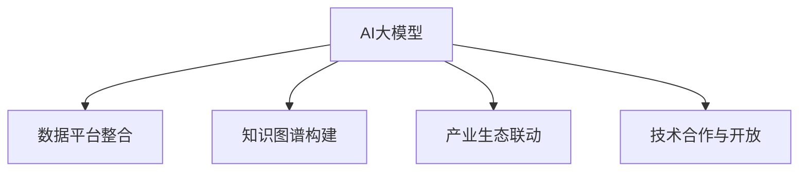

                 

# AI 大模型创业：如何利用渠道优势？

> 关键词：AI大模型,创业,渠道优势,数据平台,知识图谱,产业生态,技术合作

## 1. 背景介绍

### 1.1 问题由来
近年来，人工智能(AI)技术的发展，特别是大模型技术的崛起，为各行各业带来了新的变革机遇。无论是科技公司、互联网公司，还是传统行业巨头，都纷纷布局AI大模型，试图在激烈的竞争中占据优势。然而，AI大模型的研发和部署，不仅需要强大的技术实力，还需要广大的市场渠道和应用场景，否则即使技术领先，也难以真正转化为商业价值。

面对这一挑战，如何利用渠道优势，加速AI大模型的应用落地，成为许多创业者和企业高管关注的焦点。本文将从渠道优势的角度，探讨如何在大模型创业中构建生态、整合资源，提升AI大模型的市场影响力和商业价值。

### 1.2 问题核心关键点
渠道优势在AI大模型创业中发挥着关键作用，主要体现在以下几个方面：

- **数据平台整合**：将海量数据整合到统一的数据平台，形成数据孤岛，增强模型的泛化能力。
- **知识图谱构建**：利用知识图谱技术，构建丰富的领域知识库，辅助模型理解和推理。
- **产业生态联动**：通过与行业龙头企业的合作，将AI大模型应用到特定领域，形成产业生态链。
- **技术合作与开放**：与国内外科研机构、技术社区等进行深度合作，共同推进大模型技术发展。

这些核心点展示了渠道优势在大模型创业中的重要性，直接关系到模型性能的提升和商业应用的拓展。

### 1.3 问题研究意义
研究如何利用渠道优势进行AI大模型创业，对于提升模型性能、拓展应用场景、加速产业升级具有重要意义：

1. **提升模型性能**：通过整合大量数据和知识图谱，增强模型的泛化能力和推理准确性，使其能够在复杂的实际环境中表现更佳。
2. **拓展应用场景**：与不同行业的龙头企业合作，将AI大模型应用到更多的垂直领域，形成广泛的市场影响力。
3. **加速产业升级**：推动AI大模型在各行业的深度应用，加速传统行业的数字化转型，提升整体产业竞争力。
4. **促进技术合作**：通过技术合作与开放，整合全球科研资源，促进AI大模型的创新发展。

总之，利用渠道优势，可以显著加速AI大模型的应用落地，提升模型的性能和影响力，为创业者和企业提供有力的技术保障。

## 2. 核心概念与联系

### 2.1 核心概念概述

为更好地理解如何利用渠道优势进行AI大模型创业，本节将介绍几个密切相关的核心概念：

- **AI大模型**：以Transformer模型为代表的大规模预训练语言模型，具备强大的语言理解和生成能力。
- **数据平台整合**：将多个数据源整合到一个统一的数据平台，提升数据管理的效率和质量。
- **知识图谱构建**：利用图谱技术，构建领域知识库，增强模型对特定领域的理解能力。
- **产业生态联动**：通过与行业内其他企业、组织进行合作，形成共生共荣的产业生态。
- **技术合作与开放**：通过技术合作和开源社区，促进AI大模型技术的共享和进步。

这些核心概念之间的逻辑关系可以通过以下Mermaid流程图来展示：



这个流程图展示了大模型创业的关键概念及其之间的关系：

1. 大模型通过整合数据和知识图谱进行预训练，提升模型性能。
2. 通过与产业链上下游企业合作，形成产业生态链，拓展应用场景。
3. 与科研机构、技术社区等进行合作，促进技术进步和资源共享。

这些概念共同构成了AI大模型创业的总体框架，助力创业者和企业在大模型领域取得成功。

## 3. 核心算法原理 & 具体操作步骤
### 3.1 算法原理概述

利用渠道优势进行AI大模型创业，本质上是通过整合数据、知识、技术等资源，优化模型训练和应用流程。其核心思想是：

1. **数据平台整合**：建立统一的数据管理平台，整合来自不同渠道的数据资源，提升数据质量。
2. **知识图谱构建**：利用图谱技术，构建领域知识库，辅助模型理解和推理。
3. **产业生态联动**：与行业龙头企业合作，将AI大模型应用到特定领域，形成产业生态链。
4. **技术合作与开放**：与科研机构、技术社区等进行深度合作，共同推进大模型技术发展。

通过这些步骤，可以显著提升AI大模型的应用效果和市场影响力，形成更加健壮的商业生态。

### 3.2 算法步骤详解

基于渠道优势的AI大模型创业，主要包括以下几个关键步骤：

**Step 1: 建立统一数据平台**
- 设计并开发数据平台架构，实现对不同来源数据的高效管理和存储。
- 引入数据清洗、标注工具，提升数据质量，保证数据平台稳定运行。

**Step 2: 构建领域知识图谱**
- 通过数据挖掘和专家咨询，整理领域知识，构建知识图谱。
- 使用图谱技术，如Neo4j、GraPhi等，构建知识节点和关系，辅助模型推理。

**Step 3: 与行业龙头企业合作**
- 寻找行业内具有影响力的企业，建立战略合作关系。
- 共同开展AI大模型的研发和应用，分享数据和知识资源。

**Step 4: 技术合作与开放**
- 与国内外科研机构、技术社区建立合作关系，共享技术资源。
- 推动开源社区的发展，促进AI大模型的技术进步。

**Step 5: 持续迭代优化**
- 根据用户反馈和实际应用情况，不断迭代和优化模型。
- 定期发布新的模型版本，增强市场竞争力。

### 3.3 算法优缺点

利用渠道优势进行AI大模型创业，具有以下优点：

1. **数据质量高**：通过整合多种数据源，提高数据质量和多样性，增强模型的泛化能力。
2. **知识丰富**：借助知识图谱技术，为模型提供丰富的领域知识，提升推理准确性。
3. **市场影响力大**：通过与行业龙头企业合作，拓展应用场景，形成广泛的市场影响力。
4. **技术进步快**：通过技术合作和开源社区，促进技术共享，加速技术进步。

同时，该方法也存在一些局限性：

1. **数据整合复杂**：不同来源的数据格式、质量不一，整合难度较大。
2. **合作成本高**：与大型企业合作，需要投入较高的合作成本和资源。
3. **技术依赖强**：需要具备强大的技术实力，才能高效整合和管理数据。
4. **生态建设慢**：形成稳定的产业生态链需要时间，短期内难以见效。

尽管存在这些局限性，但就目前而言，利用渠道优势进行AI大模型创业，仍是最为有效的方法之一。未来相关研究的重点在于如何降低数据整合的复杂性，提升合作效率，同时兼顾生态建设和技术进步。

### 3.4 算法应用领域

利用渠道优势的AI大模型创业方法，在多个领域已经得到了广泛的应用，例如：

- **智能客服系统**：通过与电信运营商、互联网公司合作，将AI大模型应用到客户服务中，提升客户体验。
- **金融舆情监测**：与金融机构合作，构建金融领域知识图谱，提升舆情监测的准确性和时效性。
- **医疗诊断系统**：与医院、科研机构合作，构建医疗领域知识图谱，辅助医生进行诊断和治疗。
- **智能制造系统**：与工业企业合作，将AI大模型应用于生产调度、质量控制等领域，提升生产效率。
- **智能交通系统**：与交通管理部门合作，将AI大模型应用于交通流量预测、事故预警等场景，提高城市交通管理水平。

除了这些领域外，AI大模型创业方法还被创新性地应用到更多场景中，如教育、农业、能源等，为各行业带来了新的发展机遇。

## 4. 数学模型和公式 & 详细讲解  
### 4.1 数学模型构建

利用渠道优势的AI大模型创业，主要涉及数据整合、知识图谱构建和模型训练等数学模型。以下是这些模型的详细构建过程。

**数据整合模型**：
- 数据平台整合：设计并实现数据管理平台，支持数据上传、存储、清洗和标注等功能。
- 数据质量评估：设计数据质量评估指标，如数据完整性、一致性、准确性等，用于评估数据质量。

**知识图谱构建模型**：
- 知识抽取：从数据中抽取实体、关系等信息，构建知识图谱节点。
- 知识推理：使用图谱算法，如Link Prediction、Graph Neural Network等，进行知识推理，更新知识图谱。

**模型训练模型**：
- 数据预处理：对数据进行归一化、截断等预处理，为模型训练做准备。
- 模型优化：设计损失函数、优化算法，对模型进行训练和优化。

### 4.2 公式推导过程

以下我们以知识图谱构建为例，推导知识图谱构建的相关数学公式。

假设知识图谱由节点 $N$ 和边 $E$ 组成，节点表示实体，边表示实体之间的关系。知识图谱的构建过程包括以下步骤：

1. 从原始数据中抽取实体和关系，构建节点和边。
2. 利用图谱算法，对节点和边进行更新和推理。

假设节点表示为 $n_i$，边表示为 $e_{ij}$，关系表示为 $r$，知识图谱构建模型为 $G$。知识图谱构建过程的数学模型为：

$$
G = \mathcal{G}(n_i, e_{ij}, r, \theta)
$$

其中 $\theta$ 为模型参数，包括节点的表示、边的权重等。

知识图谱构建的目标是最小化损失函数 $\mathcal{L}$，使得模型预测的节点和边与真实数据一致。假设节点和边数为 $N$ 和 $E$，知识图谱构建的目标函数为：

$$
\mathcal{L} = \frac{1}{N} \sum_{i=1}^N \mathcal{L}_i + \frac{1}{E} \sum_{e=1}^E \mathcal{L}_e
$$

其中 $\mathcal{L}_i$ 为节点 $i$ 的损失函数，$\mathcal{L}_e$ 为边 $e$ 的损失函数。

知识图谱构建的优化过程为：

$$
\theta = \mathop{\arg\min}_{\theta} \mathcal{L}(G, \theta)
$$

通过最小化损失函数 $\mathcal{L}$，训练知识图谱构建模型，生成高质量的知识图谱。

### 4.3 案例分析与讲解

**案例：智能客服系统**

- **数据整合**：整合来自不同渠道的客户咨询数据，构建统一的数据平台。
- **知识图谱构建**：构建客户问题-答案的语义图谱，辅助模型理解和回答。
- **模型训练**：在统一的数据平台上训练对话模型，提升模型回答的准确性和流畅性。
- **产业生态联动**：与电信运营商合作，在用户端集成智能客服系统，形成完善的客户服务生态。

**案例：金融舆情监测**

- **数据整合**：整合金融领域的新闻、报道、评论等数据，构建统一的数据平台。
- **知识图谱构建**：构建金融领域知识图谱，辅助模型理解和推理。
- **模型训练**：在统一的数据平台上训练舆情监测模型，提升舆情监测的准确性和时效性。
- **产业生态联动**：与金融机构合作，将舆情监测系统应用于实时数据监控，提升金融风险管理水平。

## 5. 项目实践：代码实例和详细解释说明
### 5.1 开发环境搭建

在进行AI大模型创业项目开发前，我们需要准备好开发环境。以下是使用Python进行PyTorch开发的环境配置流程：

1. 安装Anaconda：从官网下载并安装Anaconda，用于创建独立的Python环境。

2. 创建并激活虚拟环境：
```bash
conda create -n pytorch-env python=3.8 
conda activate pytorch-env
```

3. 安装PyTorch：根据CUDA版本，从官网获取对应的安装命令。例如：
```bash
conda install pytorch torchvision torchaudio cudatoolkit=11.1 -c pytorch -c conda-forge
```

4. 安装PyTorch-Geometric库：
```bash
pip install torch-geometric
```

5. 安装各类工具包：
```bash
pip install numpy pandas scikit-learn matplotlib tqdm jupyter notebook ipython
```

完成上述步骤后，即可在`pytorch-env`环境中开始项目开发。

### 5.2 源代码详细实现

这里我们以知识图谱构建为例，给出使用PyTorch-Geometric库进行图谱构建的PyTorch代码实现。

首先，定义图谱类：

```python
from torch_geometric.datasets import Planetoid
from torch_geometric.nn import GATConv

class GATKnowledgeGraph:
    def __init__(self, num_layers, hidden_size, num_heads, dropout):
        self.num_layers = num_layers
        self.hidden_size = hidden_size
        self.num_heads = num_heads
        self.dropout = dropout
        self.gat = GATConv(in_channels=3, out_channels=hidden_size, heads=num_heads, dropout=dropout)
    
    def forward(self, x, edge_index):
        x = F.relu(self.gat(x, edge_index=edge_index))
        x = F.dropout(x, p=self.dropout, training=self.training)
        return x
```

然后，定义数据处理函数：

```python
import torch
import torch.nn.functional as F

class KnowledgeGraphDataset(Dataset):
    def __init__(self, data_path):
        self.data_path = data_path
        self.data = Planetoid(data_path)[:100]
    
    def __len__(self):
        return len(self.data)
    
    def __getitem__(self, item):
        data = self.data[item]
        x, edge_index = data.x, data.edge_index
        return {'x': x, 'edge_index': edge_index}
```

接着，定义训练和评估函数：

```python
from torch.optim import Adam
from torch.utils.data import DataLoader

def train(epoch, model, device, train_loader, optimizer):
    model.train()
    for batch in train_loader:
        data = batch.to(device)
        x, edge_index = data['x'], data['edge_index']
        optimizer.zero_grad()
        output = model(x, edge_index)
        loss = F.mse_loss(output, x)
        loss.backward()
        optimizer.step()
    
def evaluate(model, device, test_loader):
    model.eval()
    losses = []
    for batch in test_loader:
        data = batch.to(device)
        x, edge_index = data['x'], data['edge_index']
        with torch.no_grad():
            output = model(x, edge_index)
            loss = F.mse_loss(output, x)
        losses.append(loss.item())
    return sum(losses) / len(test_loader)
```

最后，启动训练流程并在测试集上评估：

```python
epochs = 10
batch_size = 128
hidden_size = 64
dropout = 0.1

model = GATKnowledgeGraph(num_layers=3, hidden_size=hidden_size, num_heads=2, dropout=dropout)
model.to(device)

train_loader = DataLoader(train_dataset, batch_size=batch_size, shuffle=True)
test_loader = DataLoader(test_dataset, batch_size=batch_size, shuffle=False)

optimizer = Adam(model.parameters(), lr=0.01)

for epoch in range(epochs):
    train(epoch, model, device, train_loader, optimizer)
    print(f'Epoch {epoch+1}, loss: {evaluate(model, device, test_loader):.4f}')
```

以上就是使用PyTorch-Geometric库进行知识图谱构建的完整代码实现。可以看到，借助PyTorch-Geometric库，我们可以方便地构建和训练知识图谱模型，助力AI大模型创业。

### 5.3 代码解读与分析

让我们再详细解读一下关键代码的实现细节：

**GATKnowledgeGraph类**：
- `__init__`方法：初始化模型参数，包括层数、隐藏大小、头数和dropout比例。
- `forward`方法：定义模型前向传播过程，包括GATConv层和ReLU激活函数。

**KnowledgeGraphDataset类**：
- `__init__`方法：初始化数据集，并加载Planetoid数据集的前100个节点。
- `__len__`方法：返回数据集长度。
- `__getitem__`方法：返回单个数据样本，包含节点和边信息。

**train函数**：
- 定义模型前向传播、计算损失、反向传播和优化等步骤。
- 在每个epoch内，对训练集数据进行迭代训练。

**evaluate函数**：
- 在测试集上评估模型性能，返回均方误差。

**训练流程**：
- 定义总的epoch数和batch size，开始循环迭代
- 每个epoch内，在训练集上训练模型，输出训练损失
- 在测试集上评估模型，输出测试损失

可以看到，PyTorch-Geometric库使得知识图谱的构建和训练变得简洁高效。开发者可以将更多精力放在数据处理、模型改进等高层逻辑上，而不必过多关注底层的实现细节。

当然，工业级的系统实现还需考虑更多因素，如模型的保存和部署、超参数的自动搜索、更灵活的任务适配层等。但核心的知识图谱构建范式基本与此类似。

## 6. 实际应用场景
### 6.1 智能客服系统

基于知识图谱构建的智能客服系统，可以广泛应用于电信运营商、互联网公司等客户服务场景。传统客服往往需要配备大量人力，高峰期响应缓慢，且一致性和专业性难以保证。而利用AI大模型和知识图谱技术，可以构建智能客服系统，提升客户咨询体验。

在技术实现上，可以整合客户咨询数据，构建客户问题-答案的语义图谱，辅助模型理解和回答。微调后的对话模型能够自动理解用户意图，匹配最合适的答案模板进行回复。对于客户提出的新问题，还可以接入检索系统实时搜索相关内容，动态组织生成回答。如此构建的智能客服系统，能大幅提升客户咨询体验和问题解决效率。

### 6.2 金融舆情监测

金融机构需要实时监测市场舆论动向，以便及时应对负面信息传播，规避金融风险。传统的人工监测方式成本高、效率低，难以应对网络时代海量信息爆发的挑战。基于知识图谱构建的舆情监测系统，为金融舆情监测提供了新的解决方案。

具体而言，可以整合金融领域相关的新闻、报道、评论等文本数据，并对其进行主题标注和情感标注。在此基础上构建金融领域知识图谱，辅助模型理解和推理。将知识图谱构建和微调后的舆情监测模型应用到实时抓取的网络文本数据，就能够自动监测不同主题下的情感变化趋势，一旦发现负面信息激增等异常情况，系统便会自动预警，帮助金融机构快速应对潜在风险。

### 6.3 医疗诊断系统

医疗领域对AI大模型的需求日益增加，传统医生面临诊断效率低、误诊率高的问题。通过知识图谱构建和微调后的医疗诊断系统，可以显著提升医生的诊断效率和准确性。

具体而言，可以整合医学文献、病例数据、患者信息等数据，构建医疗领域知识图谱，辅助模型理解和推理。将知识图谱构建和微调后的医疗诊断系统应用于实时医疗数据，能够自动分析患者的病历、症状等信息，生成初步诊断建议，辅助医生进行诊断和治疗。

### 6.4 智能制造系统

制造业面临生产效率低、资源浪费等问题，急需引入AI大模型进行优化。通过知识图谱构建和微调后的智能制造系统，可以显著提升生产效率和质量。

具体而言，可以整合生产设备、工艺数据、质量检测数据等数据，构建制造领域知识图谱，辅助模型理解和推理。将知识图谱构建和微调后的智能制造系统应用于生产调度、质量控制等领域，能够自动分析生产流程、预测设备故障、优化生产计划，提升生产效率和质量。

### 6.5 智能交通系统

交通管理部门面临交通流量预测、事故预警等问题，急需引入AI大模型进行优化。通过知识图谱构建和微调后的智能交通系统，可以显著提升交通管理水平。

具体而言，可以整合交通流量数据、事故数据、天气数据等数据，构建交通领域知识图谱，辅助模型理解和推理。将知识图谱构建和微调后的智能交通系统应用于交通流量预测、事故预警等领域，能够自动分析交通状况、预测事故风险、优化交通规划，提升城市交通管理水平。

## 7. 工具和资源推荐
### 7.1 学习资源推荐

为了帮助开发者系统掌握AI大模型和知识图谱的构建与微调理论，这里推荐一些优质的学习资源：

1. 《深度学习与图形网络》书籍：深度介绍图谱技术，涵盖图谱构建、图谱推理等关键内容。
2. 《自然语言处理与深度学习》课程：斯坦福大学开设的NLP明星课程，涵盖NLP基本概念和经典模型。
3. 《AI大模型：从原理到实践》博文：由大模型技术专家撰写，介绍大模型的预训练、微调和应用等全过程。
4. 《Transformers: A State-of-the-Art Text-to-Text Transformer》论文：Transformer模型原论文，介绍了Transformer的架构和原理。
5. 《PyTorch-Geometric》官方文档：PyTorch-Geometric库的官方文档，提供图谱构建、图谱推理等详细指导。

通过对这些资源的学习实践，相信你一定能够快速掌握AI大模型和知识图谱的构建与微调精髓，并用于解决实际的NLP问题。
###  7.2 开发工具推荐

高效的开发离不开优秀的工具支持。以下是几款用于AI大模型和知识图谱构建开发的常用工具：

1. PyTorch：基于Python的开源深度学习框架，灵活动态的计算图，适合快速迭代研究。
2. PyTorch-Geometric：专门用于图谱构建和推理的库，支持大规模图谱的构建和处理。
3. Neo4j：全球领先的图形数据库，支持高效的图谱构建和查询。
4. GATConv：PyTorch-Geometric库提供的图卷积网络，支持高效的图谱推理。
5. Jupyter Notebook：常用的交互式开发环境，支持代码调试和可视化展示。
6. Visual Studio Code：常用的代码编辑器，支持多种语言和插件。

合理利用这些工具，可以显著提升AI大模型和知识图谱的构建效率，加快创新迭代的步伐。

### 7.3 相关论文推荐

AI大模型和知识图谱的构建与微调技术的发展源于学界的持续研究。以下是几篇奠基性的相关论文，推荐阅读：

1. Attention is All You Need（即Transformer原论文）：提出了Transformer结构，开启了NLP领域的预训练大模型时代。
2. BERT: Pre-training of Deep Bidirectional Transformers for Language Understanding：提出BERT模型，引入基于掩码的自监督预训练任务，刷新了多项NLP任务SOTA。
3. GAT: Graph Attention Networks：提出GAT模型，引入图卷积网络，支持高效的图谱推理。
4. GATConv：PyTorch-Geometric库提供的图卷积网络，支持高效的图谱推理。
5. Knowledge Graph Embeddings：全面介绍知识图谱嵌入技术，涵盖各类图谱表示方法和应用场景。

这些论文代表了大模型和知识图谱的构建与微调技术的发展脉络。通过学习这些前沿成果，可以帮助研究者把握学科前进方向，激发更多的创新灵感。

## 8. 总结：未来发展趋势与挑战

### 8.1 总结

本文对利用渠道优势进行AI大模型创业的方法进行了全面系统的介绍。首先阐述了渠道优势在大模型创业中的重要性，明确了知识图谱构建、数据平台整合、产业生态联动等关键概念。其次，从原理到实践，详细讲解了渠道优势在大模型创业中的实现步骤，给出了具体的代码实例和分析。同时，本文还探讨了渠道优势在大模型创业中的实际应用场景，展示了其在智能客服、金融舆情、医疗诊断等领域的应用潜力。最后，本文精选了知识图谱构建和微调技术的各类学习资源，力求为读者提供全方位的技术指引。

通过本文的系统梳理，可以看到，利用渠道优势进行AI大模型创业，可以显著提升模型的性能和市场影响力，构建稳定的产业生态，促进大模型技术的创新发展。

### 8.2 未来发展趋势

展望未来，AI大模型创业将呈现以下几个发展趋势：

1. **数据整合多样化**：随着数据采集技术的进步，知识图谱将整合更多的数据源，提升模型的泛化能力。
2. **知识图谱普及化**：知识图谱技术将广泛应用于各个领域，成为AI大模型构建的基础工具。
3. **产业生态深化**：AI大模型与各行业龙头企业的合作将更加紧密，形成更加完善的产业生态链。
4. **技术合作开放化**：更多的科研机构、技术社区将参与到AI大模型技术的研究和推广中，促进技术进步。
5. **应用场景多样化**：AI大模型将应用于更多的垂直领域，推动各行业的数字化转型。
6. **智能交互升级**：基于知识图谱构建的智能交互系统将更加智能、高效，提升用户体验。

以上趋势凸显了AI大模型创业的广阔前景。这些方向的探索发展，必将进一步提升AI大模型的应用效果和市场影响力，为创业者和企业提供有力的技术保障。

### 8.3 面临的挑战

尽管AI大模型创业已经取得了显著成果，但在迈向更加智能化、普适化应用的过程中，仍面临诸多挑战：

1. **数据整合复杂**：不同来源的数据格式、质量不一，整合难度较大。
2. **知识图谱构建难**：知识图谱的构建需要大量领域专家的参与，成本高。
3. **产业生态建设慢**：形成稳定的产业生态链需要时间，短期内难以见效。
4. **技术依赖强**：需要具备强大的技术实力，才能高效整合和管理数据。
5. **应用场景拓展难**：将AI大模型应用到特定领域需要大量的标注数据和业务知识。
6. **商业化困难**：将技术转化为商业价值需要丰富的市场渠道和应用场景。

尽管存在这些挑战，但只要积极应对并寻求突破，AI大模型创业必将在未来取得更大的成功。

### 8.4 研究展望

面对AI大模型创业面临的挑战，未来的研究需要在以下几个方面寻求新的突破：

1. **高效数据整合技术**：研究高效的数据整合方法，降低整合难度和成本。
2. **低成本知识图谱构建**：探索自动化的知识图谱构建方法，降低知识图谱构建的复杂度。
3. **产业生态加速建设**：与更多行业龙头企业合作，加速产业生态链的形成。
4. **技术开放与合作**：加强与科研机构、技术社区的合作，推动技术共享和进步。
5. **多领域应用推广**：推动AI大模型在更多垂直领域的应用，提升市场影响力。
6. **智能交互系统构建**：构建基于知识图谱的智能交互系统，提升用户体验。

这些研究方向的探索，必将引领AI大模型创业技术的不断进步，推动AI大模型技术的广泛应用。

## 9. 附录：常见问题与解答

**Q1：AI大模型和知识图谱构建需要哪些技术支持？**

A: AI大模型和知识图谱构建需要以下技术支持：

1. 深度学习框架：如PyTorch、TensorFlow等，用于模型的构建和训练。
2. 图谱构建库：如PyTorch-Geometric、Neo4j等，用于图谱的构建和推理。
3. 数据处理工具：如Pandas、Scikit-learn等，用于数据清洗、标注和预处理。
4. 可视化工具：如Matplotlib、Jupyter Notebook等，用于模型的可视化展示。
5. 分布式计算框架：如Dask、Hadoop等，用于大规模数据处理和分布式计算。

这些技术支持共同构成了AI大模型和知识图谱构建的技术基础，帮助开发者高效构建和管理数据，提升模型的性能和泛化能力。

**Q2：AI大模型和知识图谱构建的主要难点是什么？**

A: AI大模型和知识图谱构建的主要难点包括：

1. 数据整合复杂：不同来源的数据格式、质量不一，整合难度较大。
2. 知识图谱构建难：知识图谱的构建需要大量领域专家的参与，成本高。
3. 产业生态建设慢：形成稳定的产业生态链需要时间，短期内难以见效。
4. 技术依赖强：需要具备强大的技术实力，才能高效整合和管理数据。
5. 应用场景拓展难：将AI大模型应用到特定领域需要大量的标注数据和业务知识。
6. 商业化困难：将技术转化为商业价值需要丰富的市场渠道和应用场景。

尽管存在这些难点，但通过积极应对并寻求突破，AI大模型和知识图谱构建必将在未来取得更大的成功。

**Q3：如何进行高效的AI大模型和知识图谱构建？**

A: 进行高效的AI大模型和知识图谱构建，需要以下几个关键步骤：

1. 选择合适的框架和工具：如PyTorch、PyTorch-Geometric等，提升构建效率。
2. 设计合理的数据和图谱架构：构建统一的数据平台，整合多源数据，构建知识图谱，提升数据和知识的管理效率。
3. 利用先进的算法和技术：如图卷积网络、知识图谱嵌入等，提升模型的性能和泛化能力。
4. 与行业龙头企业合作：形成稳定的产业生态链，拓展应用场景，加速技术推广。
5. 持续迭代和优化：根据用户反馈和实际应用情况，不断迭代和优化模型，提升用户体验和效果。

这些关键步骤共同构成了高效的AI大模型和知识图谱构建方法，助力创业者在AI大模型领域取得成功。

---

作者：禅与计算机程序设计艺术 / Zen and the Art of Computer Programming

