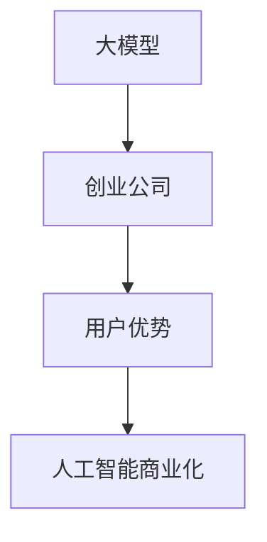

                 

# AI 大模型创业：如何利用用户优势？

> 关键词：大模型,创业,用户优势,人工智能,AI商业化

## 1. 背景介绍

在当今AI浪潮席卷之下，大模型（Large Models）因其强大的泛化能力和适应性，已经成为创业公司关注的焦点。大模型不仅能提供高质量的预测和建议，还能支持复杂的应用场景，如自动驾驶、推荐系统、智能客服等。然而，尽管大模型的技术潜力巨大，但要实现成功商业化，创业公司还需要解决一系列挑战。其中，如何有效利用用户优势，成为了一个重要问题。

本文将深入探讨如何利用用户优势，帮助AI大模型创业公司在竞争中脱颖而出。我们将从核心概念、算法原理、实践步骤、应用场景等多个角度，全面剖析用户优势如何转化为竞争优势。

## 2. 核心概念与联系

### 2.1 核心概念概述

在进行深入探讨之前，我们先明确几个核心概念：

- **大模型（Large Models）**：指能够处理大规模数据，具备复杂特征学习能力的深度学习模型。常见的有大规模预训练语言模型，如BERT、GPT等。
- **创业公司（Startup）**：指的是新成立，致力于解决特定问题的科技公司。这类公司在初期通常资源有限，但创新力强。
- **用户优势（User Advantage）**：指的是通过用户数据和行为，优化模型，提升性能的过程。利用用户优势可以加速模型的训练和优化，提高模型的精准度。
- **人工智能（AI）商业化**：指将AI技术应用于实际业务中，创造经济价值的过程。

这些概念之间的关系可以通过以下Mermaid流程图来展示：



该流程图说明了大模型在创业公司中的应用路径：大模型通过用户优势得到优化和提升，最终实现AI商业化。

## 3. 核心算法原理 & 具体操作步骤

### 3.1 算法原理概述

利用用户优势优化大模型的过程，本质上是一种有监督学习。其核心思想是，通过收集用户数据，包括文本、行为、反馈等，对大模型进行微调，使其能够更好地适应用户需求。

具体来说，假设大模型为 $M_{\theta}$，输入为 $x$，输出为 $y$，模型损失函数为 $\mathcal{L}(y, \hat{y})$。用户优势可以转化为更多标注数据，即增加样本 $(x_i, y_i)$，通过这些数据来优化模型参数 $\theta$，使模型在给定任务上的表现更好。

### 3.2 算法步骤详解

利用用户优势优化大模型的步骤如下：

1. **数据收集**：收集用户行为数据，如浏览记录、点击行为、搜索查询等。这些数据应尽可能丰富和多样化，以便模型能够学习到不同场景下的用户偏好。

2. **数据预处理**：对收集到的数据进行清洗、去重、标注等预处理操作，确保数据的质量和格式一致。

3. **模型微调**：使用微调算法，如Fine-Tuning，对大模型进行训练。微调过程中，模型利用新收集的数据进行反向传播，更新参数，优化损失函数。

4. **性能评估**：在微调后，对模型进行评估，确保其在新场景下的表现。可以使用各种评估指标，如准确率、召回率、F1分数等。

5. **模型部署**：将微调后的模型部署到实际应用中，进行生产测试。

### 3.3 算法优缺点

利用用户优势优化大模型的优势在于：

- **提升模型精度**：通过用户数据，模型能够更好地适应特定场景，提高预测和推荐的准确性。
- **加速模型迭代**：用户数据能够快速积累，加速模型训练和优化过程。
- **降低成本**：利用现有用户数据，减少了对额外标注数据的依赖，降低了数据收集和处理的成本。

缺点包括：

- **数据隐私问题**：用户数据的收集和利用可能涉及隐私问题，需要严格的合规和安全措施。
- **数据质量问题**：用户数据可能存在噪声和偏差，需要严格的数据预处理和去噪处理。
- **过度拟合风险**：过度依赖用户数据，可能导致模型在特定场景下过度拟合，降低泛化能力。

### 3.4 算法应用领域

利用用户优势优化大模型的应用场景非常广泛，包括但不限于以下几个领域：

- **智能推荐系统**：如电商平台的商品推荐、内容平台的文章推荐等。通过用户行为数据，优化推荐模型，提高推荐精度。
- **智能客服系统**：通过用户互动记录，优化模型，提升客户服务质量。
- **广告定向投放**：利用用户行为数据，优化广告定向模型，提高广告效果。
- **金融风控**：通过用户交易数据，优化风控模型，降低风险。
- **健康医疗**：利用患者数据，优化医疗诊断模型，提高诊断准确性。

## 4. 数学模型和公式 & 详细讲解 & 举例说明

### 4.1 数学模型构建

利用用户优势优化大模型的数学模型可以描述为：

$$
\theta = \arg\min_\theta \frac{1}{N} \sum_{i=1}^N \mathcal{L}(y_i, M_{\theta}(x_i))
$$

其中 $x_i$ 为输入数据，$y_i$ 为标注数据，$\mathcal{L}$ 为损失函数，$N$ 为数据量。

### 4.2 公式推导过程

以推荐系统为例，假设用户对物品 $i$ 的评分 $y_i$ 为 $1, 0$ 表示是否喜欢，利用交叉熵损失函数 $\mathcal{L}$ 可表示为：

$$
\mathcal{L}(y_i, M_{\theta}(x_i)) = -(y_i \log M_{\theta}(x_i) + (1-y_i) \log(1-M_{\theta}(x_i)))
$$

通过反向传播算法，更新模型参数 $\theta$。具体推导如下：

$$
\frac{\partial \mathcal{L}}{\partial \theta} = -\frac{1}{N} \sum_{i=1}^N (y_i \frac{\partial M_{\theta}(x_i)}{\partial \theta} - (1-y_i) \frac{\partial (1-M_{\theta}(x_i))}{\partial \theta})
$$

### 4.3 案例分析与讲解

考虑一个电商平台的商品推荐系统。平台收集了用户的历史购买数据和浏览记录，利用这些数据对商品推荐模型进行微调。假设模型初始预测用户喜欢物品 $i$ 的概率为 $p_i$，实际标签为 $y_i$，则损失函数为：

$$
\mathcal{L}(y_i, p_i) = -(y_i \log p_i + (1-y_i) \log(1-p_i))
$$

通过优化该损失函数，更新模型参数，使得预测结果更加准确。

## 5. 项目实践：代码实例和详细解释说明

### 5.1 开发环境搭建

要搭建基于用户优势的AI大模型项目，需要以下环境：

- **Python**：主流编程语言，Python 3.8 及以上版本。
- **PyTorch**：常用的深度学习框架，支持GPU加速。
- **TensorFlow**：另一个流行的深度学习框架，支持分布式训练和生产部署。
- **Scikit-learn**：常用的机器学习库，支持模型评估和特征处理。
- **Pandas**：用于数据处理和分析。
- **Jupyter Notebook**：用于交互式编程和数据可视化。

### 5.2 源代码详细实现

以电商平台的商品推荐系统为例，以下是一个简单的代码实现：

```python
import torch
import torch.nn as nn
import torch.optim as optim
from sklearn.metrics import mean_squared_error

# 定义模型
class RecommenderNet(nn.Module):
    def __init__(self, input_dim, output_dim):
        super(RecommenderNet, self).__init__()
        self.fc1 = nn.Linear(input_dim, 64)
        self.fc2 = nn.Linear(64, 32)
        self.fc3 = nn.Linear(32, output_dim)
        self.relu = nn.ReLU()
    
    def forward(self, x):
        x = self.fc1(x)
        x = self.relu(x)
        x = self.fc2(x)
        x = self.relu(x)
        x = self.fc3(x)
        return x

# 数据准备
train_data = pd.read_csv('train.csv')
test_data = pd.read_csv('test.csv')
user_features = train_data[['user_id', 'age', 'gender']]
item_features = train_data[['item_id', 'price', 'category']]
user_item_data = pd.merge(user_features, item_features, on='user_id', how='left').dropna()

# 模型训练
model = RecommenderNet(input_dim=8, output_dim=1)
criterion = nn.MSELoss()
optimizer = optim.Adam(model.parameters(), lr=0.001)
for epoch in range(100):
    optimizer.zero_grad()
    outputs = model(user_item_data[['user_id', 'item_id']])
    loss = criterion(outputs, user_item_data['score'])
    loss.backward()
    optimizer.step()
    if epoch % 10 == 0:
        print(f'Epoch {epoch}, Loss: {loss.item()}')

# 模型评估
test_outputs = model(test_data[['user_id', 'item_id']])
test_loss = criterion(test_outputs, test_data['score'])
print(f'Test Loss: {test_loss.item()}')
```

### 5.3 代码解读与分析

上述代码中，我们定义了一个简单的神经网络模型，用于对电商平台的商品进行推荐。通过收集用户的历史购买数据和浏览记录，对模型进行训练和优化。

具体步骤如下：

1. **数据准备**：将用户特征和物品特征进行合并，去除缺失值。
2. **模型训练**：使用MSE损失函数，通过Adam优化器更新模型参数。
3. **模型评估**：在测试集上评估模型性能，输出平均损失。

## 6. 实际应用场景

### 6.1 智能推荐系统

智能推荐系统是利用用户优势的典型应用。通过收集用户行为数据，如浏览记录、点击行为、评分等，优化推荐模型，提升推荐精度。推荐系统在电商、内容、社交媒体等多个领域都有广泛应用。

### 6.2 智能客服系统

智能客服系统通过收集用户互动数据，优化模型，提升客服质量。在电商、银行、电信等场景中，智能客服系统能够提供7x24小时的智能服务，提升用户体验。

### 6.3 广告定向投放

广告定向投放通过收集用户行为数据，优化广告定向模型，提高广告效果。广告主可以基于用户兴趣和行为，精准投放广告，提高广告ROI。

### 6.4 金融风控

金融风控通过收集用户交易数据，优化风控模型，降低风险。在信贷、保险等领域，利用用户数据，可以更准确地评估用户信用风险。

### 6.5 健康医疗

健康医疗通过收集患者数据，优化医疗诊断模型，提高诊断准确性。在医疗影像、电子病历等领域，利用患者数据，可以辅助医生进行诊断。

## 7. 工具和资源推荐

### 7.1 学习资源推荐

- **《深度学习入门》**：陈云著作，介绍了深度学习的基础知识和实践技巧。
- **《深度学习实战》**：李沐著作，提供了丰富的深度学习实践案例。
- **Coursera 深度学习课程**：由斯坦福大学Andrew Ng教授主讲，涵盖深度学习的基础理论和实践技能。
- **Kaggle 竞赛平台**：提供大量数据集和竞赛题目，有助于实践和提升模型能力。
- **GitHub**：查找和分享开源项目，学习前沿技术。

### 7.2 开发工具推荐

- **PyTorch**：支持GPU加速，适合研究和实验。
- **TensorFlow**：支持分布式训练和生产部署，适合工程应用。
- **Jupyter Notebook**：用于交互式编程和数据可视化。
- **AWS SageMaker**：提供云端机器学习平台，支持模型训练和部署。
- **Google Colab**：提供免费GPU资源，适合学习和实验。

### 7.3 相关论文推荐

- **《深度学习》**：Ian Goodfellow著作，介绍了深度学习的基础理论和实践技巧。
- **《深度学习与神经网络》**：Michael Nielsen著作，深入浅出地介绍了神经网络的基础知识和实践技巧。
- **《自然语言处理综述》**：Zhang Liyong著作，提供了自然语言处理领域的最新研究成果和应用案例。
- **《推荐系统》**：Wang Wei著作，详细介绍了推荐系统的理论和实践。

## 8. 总结：未来发展趋势与挑战

### 8.1 研究成果总结

本文详细介绍了利用用户优势优化大模型的技术原理和实践步骤。通过收集和利用用户数据，可以显著提升模型的准确性和泛化能力，加速模型的迭代和优化。这些方法已经被广泛应用于智能推荐、智能客服、广告定向等多个领域，取得了显著的效果。

### 8.2 未来发展趋势

未来，随着数据量的不断增加和计算能力的提升，利用用户优势优化大模型的技术将不断进步。以下是一些趋势：

1. **自动化数据收集**：通过智能数据采集技术，自动收集和处理用户数据，降低人工成本。
2. **多模态数据融合**：将文本、图像、语音等多种数据融合，提供更加全面的用户画像。
3. **个性化推荐**：利用用户数据，实现更加个性化和多样化的推荐。
4. **实时推荐**：基于实时数据，提供实时推荐服务，提高用户体验。
5. **联邦学习**：通过分布式计算和隐私保护技术，实现跨平台的用户数据共享和模型优化。

### 8.3 面临的挑战

尽管利用用户优势优化大模型取得了不少进展，但仍面临一些挑战：

1. **数据隐私问题**：用户数据的收集和使用可能涉及隐私问题，需要严格的数据隐私保护措施。
2. **数据质量问题**：用户数据可能存在噪声和偏差，需要进行严格的数据清洗和去噪处理。
3. **模型泛化能力**：过度依赖用户数据可能导致模型泛化能力不足，需要平衡利用和泛化。
4. **计算资源问题**：大规模用户数据的收集和处理需要大量的计算资源，需要进行优化和改进。

### 8.4 研究展望

未来，针对这些挑战，需要进一步研究：

1. **隐私保护技术**：研究如何保护用户隐私，确保用户数据的安全性。
2. **数据质量提升**：研究如何提升数据质量，减少噪声和偏差。
3. **模型泛化方法**：研究如何提高模型泛化能力，平衡利用和泛化。
4. **计算资源优化**：研究如何优化计算资源，提升数据处理和模型训练的效率。

## 9. 附录：常见问题与解答

**Q1：如何处理用户数据隐私问题？**

A: 处理用户数据隐私问题需要从多个方面入手：
1. **数据匿名化**：对用户数据进行匿名化处理，去除可识别信息。
2. **差分隐私**：使用差分隐私技术，确保用户数据不被识别。
3. **数据去重**：去除重复数据，避免用户数据被多次使用。
4. **访问控制**：严格控制数据的访问权限，确保数据安全。

**Q2：如何提升数据质量？**

A: 提升数据质量需要从数据采集、处理和分析等多个环节进行优化：
1. **数据清洗**：对数据进行清洗，去除噪声和异常值。
2. **数据标注**：对数据进行标注，确保数据的一致性和准确性。
3. **数据增强**：使用数据增强技术，扩充训练数据。
4. **特征工程**：进行有效的特征提取和选择，提高数据质量。

**Q3：如何提高模型泛化能力？**

A: 提高模型泛化能力需要从模型设计和数据处理两个方面进行优化：
1. **模型设计**：设计更加复杂和深层的模型，提高模型的表达能力。
2. **数据多样化**：收集多样化的数据，提高模型的泛化能力。
3. **正则化技术**：使用正则化技术，如L2正则、Dropout等，防止过拟合。
4. **多模型集成**：训练多个模型，取平均输出，提高模型的泛化能力。

**Q4：如何优化计算资源？**

A: 优化计算资源需要从多个方面进行优化：
1. **分布式计算**：使用分布式计算技术，提升数据处理和模型训练的效率。
2. **硬件加速**：使用GPU、TPU等硬件加速设备，提升计算速度。
3. **模型压缩**：使用模型压缩技术，减少模型大小和计算量。
4. **数据并行**：使用数据并行技术，提升模型训练效率。

通过不断优化和创新，利用用户优势优化大模型技术必将在未来取得更大的突破，为AI创业公司提供更强的竞争优势。

---

作者：禅与计算机程序设计艺术 / Zen and the Art of Computer Programming

