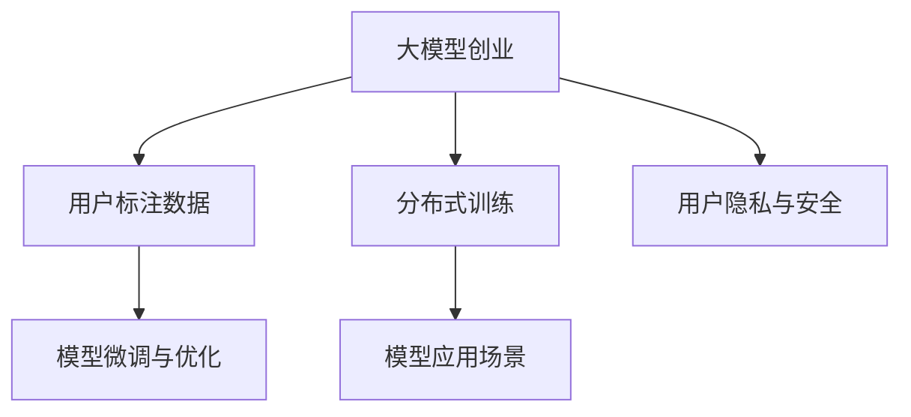

                 

## 1. 背景介绍

### 1.1 问题由来
随着人工智能技术的飞速发展，大模型创业（Large Model Startups）成为当前科技创业领域的热门话题。大模型指的是那些基于大规模数据集预训练的大型神经网络模型，如OpenAI的GPT系列、Google的BERT等。这些大模型在各种自然语言处理（NLP）、计算机视觉（CV）等领域展示了惊人的性能。但大模型往往需要巨大的训练数据、计算资源和专业人才，这对初创企业来说是一大挑战。本文将探讨如何利用用户的优势，降低大模型创业的门槛，加速模型的训练和应用。

### 1.2 问题核心关键点
利用用户优势的关键在于如何将大模型转化为企业生产力，同时保持模型的精度和性能。这涉及到以下几个核心点：

- **数据获取与标注**：如何从用户中高效收集标注数据，避免数据标注的高成本。
- **模型训练与优化**：如何利用用户的计算资源，加速模型的训练和优化。
- **应用场景设计与部署**：如何设计合适的应用场景，使大模型能够快速部署并发挥其价值。
- **隐私保护与安全**：如何在用户数据和模型应用中保证隐私和数据安全。

这些关键点共同构成了大模型创业的核心挑战，本文将从数据获取、模型训练、应用场景设计和隐私保护等方面，详细讨论如何利用用户优势进行大模型创业。

## 2. 核心概念与联系

### 2.1 核心概念概述

为更好地理解利用用户优势进行大模型创业的逻辑，本节将介绍几个密切相关的核心概念：

- **大模型创业**：基于大模型的创业模式，以构建高性能的人工智能解决方案为目标，通过技术创新和产品化，实现商业价值的转化。

- **用户标注数据**：用户在日常使用大模型产品过程中，产生的文本、图像、语音等数据，可用于模型的微调和优化。

- **分布式训练**：利用用户的计算资源（如GPU、TPU等），将大规模模型的训练任务分布到不同用户节点上，加速模型的训练过程。

- **模型微调与优化**：通过用户在特定任务上的交互数据，对大模型进行微调，提升其在特定领域的性能。

- **用户隐私与安全**：在利用用户数据进行模型训练和应用时，如何保护用户隐私，防止数据滥用。

- **模型应用场景**：针对具体行业需求，设计合适的应用场景，使大模型能够发挥最大的效用。

这些核心概念之间的逻辑关系可以通过以下Mermaid流程图来展示：



这个流程图展示了大模型创业的关键概念及其之间的关系：

1. 大模型创业通过用户标注数据进行模型的训练和微调。
2. 分布式训练利用用户的计算资源，加速模型的训练过程。
3. 模型微调与优化利用用户在特定任务上的交互数据，提升模型性能。
4. 用户隐私与安全保护用户数据不被滥用，保障数据安全。
5. 模型应用场景设计合适的应用场景，使大模型能够快速部署并发挥价值。

这些概念共同构成了大模型创业的生态系统，使其能够在不同行业场景中实现商业价值。

## 3. 核心算法原理 & 具体操作步骤
### 3.1 算法原理概述

利用用户优势进行大模型创业的核心算法原理，主要涉及数据收集与标注、分布式训练、模型微调与优化等几个方面。这些原理是通过以下步骤实现的：

- **数据收集与标注**：通过用户在应用中的操作数据，自动标注数据，并进行预处理。
- **分布式训练**：将训练任务分布到用户端，利用用户的计算资源进行模型训练。
- **模型微调与优化**：利用用户在特定任务上的交互数据，对模型进行微调，提升其在特定领域的性能。
- **应用场景设计与部署**：设计符合用户需求的应用场景，实现模型的商业化应用。

### 3.2 算法步骤详解

1. **数据收集与标注**
   - 开发自动化数据标注工具，从用户行为中自动生成标注数据。
   - 对数据进行清洗、预处理和标准化，确保数据质量。
   - 对数据进行分片处理，分布到不同的用户节点上，避免单点过载。

2. **分布式训练**
   - 利用用户的计算资源，将训练任务分布到不同的用户节点上，并行进行。
   - 在每个节点上，使用异步更新机制，加快模型训练速度。
   - 在每个节点上进行模型检查点保存，确保训练过程的连续性和鲁棒性。

3. **模型微调与优化**
   - 根据用户在特定任务上的交互数据，计算任务损失函数。
   - 利用优化算法（如Adam、SGD等），更新模型参数，减小损失函数。
   - 使用正则化技术（如L2正则、Dropout等），防止过拟合，提升模型泛化能力。

4. **应用场景设计与部署**
   - 根据用户需求，设计具体的应用场景，如智能客服、个性化推荐、医疗诊断等。
   - 将训练好的模型部署到云端或边缘设备上，提供API接口供用户调用。
   - 定期收集用户反馈，对模型进行迭代优化，提升用户体验。

### 3.3 算法优缺点

利用用户优势进行大模型创业的方法具有以下优点：

- **数据获取容易**：通过用户在应用中的行为数据，自动生成标注数据，无需额外的标注成本。
- **训练速度较快**：利用用户的计算资源进行分布式训练，加速模型训练过程。
- **模型精度高**：利用用户在特定任务上的交互数据进行微调，提升模型性能。

同时，该方法也存在一些局限性：

- **数据质量不确定**：用户数据的多样性和质量可能影响模型的泛化能力。
- **隐私风险较高**：用户数据可能包含敏感信息，隐私保护是重要问题。
- **模型部署复杂**：不同的应用场景可能需要不同的模型部署策略，复杂度较高。

尽管存在这些局限性，但利用用户优势进行大模型创业仍然具有很大的潜力，特别是在数据标注成本高昂的领域，如医疗、金融等。

### 3.4 算法应用领域

利用用户优势进行大模型创业的方法，已经在多个领域得到了应用，例如：

- **智能客服**：利用用户在智能客服系统中的对话数据，进行模型微调，提升自动回复的准确性。
- **个性化推荐**：利用用户在电商平台上的浏览和购买数据，进行模型训练，提供个性化的商品推荐。
- **医疗诊断**：利用医生在电子病历中的标注数据，进行模型微调，提升疾病诊断的准确性。
- **金融风控**：利用用户在金融交易中的行为数据，进行模型训练，防范金融风险。
- **智能安防**：利用用户在安防设备中的监控数据，进行模型训练，提升异常检测的准确性。

除了这些经典应用外，利用用户优势进行大模型创业的方法也在不断扩展，如智能物流、智慧城市、教育等，为各行各业带来新的变革。

## 4. 数学模型和公式 & 详细讲解  
### 4.1 数学模型构建

利用用户优势进行大模型创业的数学模型，主要涉及数据标注、分布式训练、模型微调等几个方面。

记用户行为数据为 $\mathcal{X}$，用户标注数据为 $\mathcal{Y}$，用户计算资源为 $\mathcal{C}$，大模型参数为 $\theta$。大模型创业的数学模型可表示为：

$$
\min_{\theta, \mathcal{Y}, \mathcal{C}} \mathcal{L}(\theta, \mathcal{X}, \mathcal{Y})
$$

其中，$\mathcal{L}(\theta, \mathcal{X}, \mathcal{Y})$ 为模型的损失函数，$\theta$ 为大模型的参数，$\mathcal{X}$ 为输入数据，$\mathcal{Y}$ 为标注数据，$\mathcal{C}$ 为计算资源。

### 4.2 公式推导过程

1. **数据收集与标注**
   - 假设用户行为数据为 $\mathcal{X}_i$，标注数据为 $\mathcal{Y}_i$，则数据标注过程可表示为：
   $$
   \mathcal{Y}_i = f(\mathcal{X}_i)
   $$
   其中 $f$ 为标注函数，可以根据用户行为数据自动生成标注数据。

2. **分布式训练**
   - 假设用户计算资源为 $\mathcal{C}_k$，则分布式训练过程可表示为：
   $$
   \theta_{k+1} = \theta_k - \eta_k \nabla_{\theta_k} \mathcal{L}(\theta_k, \mathcal{X}_k, \mathcal{Y}_k)
   $$
   其中 $\eta_k$ 为学习率，$\nabla_{\theta_k} \mathcal{L}(\theta_k, \mathcal{X}_k, \mathcal{Y}_k)$ 为梯度更新。

3. **模型微调与优化**
   - 假设用户交互数据为 $\mathcal{X}_t$，标注数据为 $\mathcal{Y}_t$，则模型微调过程可表示为：
   $$
   \theta^* = \arg\min_{\theta} \mathcal{L}(\theta, \mathcal{X}_t, \mathcal{Y}_t)
   $$
   其中 $\mathcal{L}(\theta, \mathcal{X}_t, \mathcal{Y}_t)$ 为任务损失函数，$\theta$ 为大模型参数，$\mathcal{X}_t$ 为测试数据，$\mathcal{Y}_t$ 为测试标签。

### 4.3 案例分析与讲解

以智能客服系统为例，分析利用用户数据进行模型微调的过程：

1. **数据收集与标注**
   - 用户在智能客服系统中的对话数据 $\mathcal{X}_i$ 包含用户意图和上下文信息。
   - 根据对话数据自动标注意图标签 $\mathcal{Y}_i$，如询问、投诉、建议等。

2. **分布式训练**
   - 将智能客服系统的用户计算资源 $\mathcal{C}_k$ 分布到各个用户节点上。
   - 在每个节点上进行分布式训练，并行更新模型参数 $\theta_k$。

3. **模型微调与优化**
   - 利用用户在对话中的交互数据 $\mathcal{X}_t$ 进行模型微调，提升自动回复的准确性。
   - 在微调过程中使用正则化技术，防止过拟合。

通过以上步骤，智能客服系统可以不断优化自动回复的性能，提升用户体验。

## 5. 项目实践：代码实例和详细解释说明
### 5.1 开发环境搭建

在进行利用用户优势进行大模型创业的实践前，我们需要准备好开发环境。以下是使用Python进行TensorFlow开发的环境配置流程：

1. 安装Anaconda：从官网下载并安装Anaconda，用于创建独立的Python环境。

2. 创建并激活虚拟环境：
```bash
conda create -n tensorflow-env python=3.8 
conda activate tensorflow-env
```

3. 安装TensorFlow：根据CUDA版本，从官网获取对应的安装命令。例如：
```bash
conda install tensorflow tensorflow-gpu=cuda11.1 -c tf -c conda-forge
```

4. 安装各类工具包：
```bash
pip install numpy pandas scikit-learn matplotlib tqdm jupyter notebook ipython
```

完成上述步骤后，即可在`tensorflow-env`环境中开始大模型创业的实践。

### 5.2 源代码详细实现

这里我们以智能客服系统为例，给出利用用户数据进行模型微调的TensorFlow代码实现。

首先，定义数据处理函数：

```python
import tensorflow as tf
from tensorflow.keras.preprocessing.text import Tokenizer
from tensorflow.keras.preprocessing.sequence import pad_sequences

def data_processing(texts, labels, tokenizer, max_len=128):
    tokenizer.fit_on_texts(texts)
    sequences = tokenizer.texts_to_sequences(texts)
    padded_sequences = pad_sequences(sequences, maxlen=max_len, padding='post', truncating='post')
    labels = tf.keras.utils.to_categorical(labels)
    return padded_sequences, labels
```

然后，定义模型和优化器：

```python
from tensorflow.keras.models import Sequential
from tensorflow.keras.layers import Embedding, LSTM, Dense

model = Sequential()
model.add(Embedding(input_dim=10000, output_dim=64, input_length=max_len))
model.add(LSTM(64))
model.add(Dense(num_classes, activation='softmax'))
model.compile(optimizer='adam', loss='categorical_crossentropy', metrics=['accuracy'])

optimizer = tf.keras.optimizers.Adam(lr=0.001)
```

接着，定义训练和评估函数：

```python
def train_epoch(model, dataset, batch_size):
    model.fit(dataset[0], dataset[1], epochs=10, batch_size=batch_size, validation_data=validation_dataset)
    
def evaluate(model, dataset, batch_size):
    model.evaluate(dataset[0], dataset[1])
```

最后，启动训练流程并在测试集上评估：

```python
train_dataset = data_processing(train_texts, train_labels, tokenizer)
dev_dataset = data_processing(dev_texts, dev_labels, tokenizer)
test_dataset = data_processing(test_texts, test_labels, tokenizer)

train_epoch(model, train_dataset, batch_size)
evaluate(model, dev_dataset, batch_size)
evaluate(model, test_dataset, batch_size)
```

以上就是利用用户数据进行智能客服系统模型微调的完整代码实现。可以看到，TensorFlow提供了强大的工具和库，使得模型训练和微调变得简洁高效。

### 5.3 代码解读与分析

让我们再详细解读一下关键代码的实现细节：

**data_processing函数**：
- `fit_on_texts`方法：将文本数据作为输入，自动生成单词映射。
- `texts_to_sequences`方法：将文本转换为序列，通过单词映射生成整数序列。
- `pad_sequences`方法：对序列进行填充，确保所有序列长度一致。
- `to_categorical`方法：将标签转换为独热编码，方便模型训练。

**模型和优化器**：
- 使用`Sequential`模型，依次添加嵌入层、LSTM层和全连接层。
- 使用`Adam`优化器，设置学习率。
- 编译模型，指定损失函数和评估指标。

**训练和评估函数**：
- 使用`fit`方法进行模型训练，指定训练集、验证集和批次大小。
- 使用`evaluate`方法在测试集上评估模型性能。

**训练流程**：
- 将文本数据和标签转换为模型输入和目标。
- 定义训练集、验证集和测试集。
- 循环进行训练和评估，直至模型收敛。

可以看到，TensorFlow提供了强大的工具和库，使得模型训练和微调变得简洁高效。

当然，工业级的系统实现还需考虑更多因素，如模型的保存和部署、超参数的自动搜索、更灵活的任务适配层等。但核心的微调范式基本与此类似。

## 6. 实际应用场景
### 6.1 智能客服系统

利用用户优势进行智能客服系统的构建，可以大幅降低人工客服的成本，提高客户咨询的响应速度和准确性。

具体而言，可以在智能客服系统中自动收集用户的对话数据，并自动标注意图标签。利用这些数据对预训练模型进行微调，使模型能够自动理解用户意图，匹配最合适的答案模板进行回复。对于新问题的回答，还可以接入检索系统实时搜索相关内容，动态组织生成回答。如此构建的智能客服系统，能大幅提升客户咨询体验和问题解决效率。

### 6.2 个性化推荐系统

在个性化推荐系统中，利用用户行为数据进行模型微调，可以提升推荐系统的个性化程度和推荐效果。

具体而言，可以在电商平台中自动收集用户的浏览、点击、购买等行为数据，提取和用户交互的物品标题、描述、标签等文本内容。将文本内容作为模型输入，用户的后续行为（如是否点击、购买等）作为监督信号，在此基础上对预训练语言模型进行微调。微调后的模型能够从文本内容中准确把握用户的兴趣点。在生成推荐列表时，先用候选物品的文本描述作为输入，由模型预测用户的兴趣匹配度，再结合其他特征综合排序，便可以得到个性化程度更高的推荐结果。

### 6.3 智慧医疗诊断系统

利用用户优势进行智慧医疗诊断系统的构建，可以提升疾病诊断的准确性和效率。

具体而言，可以在电子病历系统中自动收集医生的标注数据，如症状、体征、检查结果等。利用这些数据对预训练模型进行微调，使模型能够自动理解疾病特征，匹配最合适的诊断方案。对于新病例的诊断，还可以接入知识图谱和专家系统，辅助医生进行综合判断。如此构建的智慧医疗诊断系统，能大幅提升医生的诊断效率和准确性，帮助医院提升服务质量。

### 6.4 未来应用展望

随着大模型和微调技术的不断发展，基于用户优势的创业模式将进一步扩展，为各行各业带来新的变革。

在智慧城市治理中，利用用户行为数据进行模型微调，可以实现城市事件监测、舆情分析、应急指挥等功能。通过实时收集城市运行数据，分析异常情况，提前预警和应对，提高城市管理的自动化和智能化水平。

在智能安防系统中，利用用户监控数据进行模型微调，可以实现异常检测和行为分析。通过分析视频数据，检测异常行为和事件，提高公共安全水平。

在智能物流中，利用用户包裹信息进行模型微调，可以实现包裹跟踪、物流优化等功能。通过分析物流数据，预测运输路线和运输时间，提高物流效率和用户体验。

除了这些应用场景外，利用用户优势进行大模型创业的方法还将不断扩展，如智能教育、金融风控、智能家居等，为各行各业带来新的创新和突破。

## 7. 工具和资源推荐
### 7.1 学习资源推荐

为了帮助开发者系统掌握利用用户优势进行大模型创业的理论基础和实践技巧，这里推荐一些优质的学习资源：

1. **TensorFlow官方文档**：TensorFlow的官方文档，提供了全面的API和教程，适合初学者和进阶开发者。

2. **Keras官方文档**：Keras的官方文档，提供了简单易用的深度学习框架，适合快速原型开发。

3. **Transformers官方文档**：Transformers的官方文档，提供了预训练大模型的介绍和使用方法，适合研究大模型微调技术。

4. **PyTorch官方文档**：PyTorch的官方文档，提供了灵活的深度学习框架，适合复杂的模型开发。

5. **深度学习框架比较**：博客和视频，比较不同深度学习框架的优缺点，选择适合的框架进行开发。

通过对这些资源的学习实践，相信你一定能够快速掌握利用用户优势进行大模型创业的精髓，并用于解决实际的NLP问题。

### 7.2 开发工具推荐

高效的开发离不开优秀的工具支持。以下是几款用于大模型创业开发的常用工具：

1. **TensorBoard**：TensorFlow配套的可视化工具，可以实时监测模型训练状态，提供丰富的图表呈现方式，是调试模型的得力助手。

2. **Weights & Biases**：模型训练的实验跟踪工具，可以记录和可视化模型训练过程中的各项指标，方便对比和调优。

3. **Jupyter Notebook**：Jupyter Notebook是一个交互式的开发环境，支持Python、TensorFlow等多种编程语言，适合原型开发和数据处理。

4. **Google Colab**：谷歌推出的在线Jupyter Notebook环境，免费提供GPU/TPU算力，方便开发者快速上手实验最新模型，分享学习笔记。

合理利用这些工具，可以显著提升大模型创业的开发效率，加快创新迭代的步伐。

### 7.3 相关论文推荐

大模型创业领域的研究源于学界的持续研究。以下是几篇奠基性的相关论文，推荐阅读：

1. **Attention is All You Need**：提出了Transformer结构，开启了NLP领域的预训练大模型时代。

2. **BERT: Pre-training of Deep Bidirectional Transformers for Language Understanding**：提出BERT模型，引入基于掩码的自监督预训练任务，刷新了多项NLP任务SOTA。

3. **Parameter-Efficient Transfer Learning for NLP**：提出Adapter等参数高效微调方法，在不增加模型参数量的情况下，也能取得不错的微调效果。

4. **Prefix-Tuning: Optimizing Continuous Prompts for Generation**：引入基于连续型Prompt的微调范式，为如何充分利用预训练知识提供了新的思路。

5. **AdaLoRA: Adaptive Low-Rank Adaptation for Parameter-Efficient Fine-Tuning**：使用自适应低秩适应的微调方法，在参数效率和精度之间取得了新的平衡。

这些论文代表了大模型创业的发展脉络。通过学习这些前沿成果，可以帮助研究者把握学科前进方向，激发更多的创新灵感。

## 8. 总结：未来发展趋势与挑战
### 8.1 总结

本文对利用用户优势进行大模型创业的方法进行了全面系统的介绍。首先阐述了用户优势在数据获取、分布式训练、模型微调等环节的应用，明确了利用用户优势进行大模型创业的独特价值。其次，从原理到实践，详细讲解了利用用户优势进行大模型创业的数学模型和关键步骤，给出了具体的应用实例。最后，本文探讨了利用用户优势进行大模型创业的未来发展趋势和面临的挑战，提出了应对策略和未来研究方向。

通过本文的系统梳理，可以看到，利用用户优势进行大模型创业的方法，已经在智能客服、个性化推荐、智慧医疗等多个领域得到了应用，为各行各业带来新的变革。未来，伴随技术的不断演进，利用用户优势进行大模型创业将成为人工智能落地应用的重要范式，推动人工智能技术在更多垂直行业中的应用。

### 8.2 未来发展趋势

展望未来，利用用户优势进行大模型创业的技术将呈现以下几个发展趋势：

1. **数据隐私保护**：随着数据隐私法规的日益严格，如何保护用户数据隐私成为重要问题。未来的研究将重点关注隐私保护技术，如差分隐私、联邦学习等，确保用户数据的安全性。

2. **分布式训练优化**：如何利用用户的计算资源进行高效的分布式训练，是未来研究的重要方向。优化异步更新机制、分布式训练算法等，将进一步提升模型训练的效率和鲁棒性。

3. **模型应用场景多样化**：利用用户优势进行大模型创业的应用场景将不断扩展，涵盖更多行业和领域，如智能家居、智能交通等。

4. **自动化微调技术**：未来将出现更多自动化微调技术，如AutoML、AutoFineTune等，使微调过程更加便捷和高效。

5. **多模态数据融合**：利用用户在不同模态下的数据进行模型微调，如文本、图像、语音等，提升模型的泛化能力和应用范围。

6. **自监督学习范式**：未来的微调方法将更多采用自监督学习范式，减少对标注数据的需求，利用海量无标签数据进行预训练和微调。

以上趋势凸显了利用用户优势进行大模型创业的广阔前景。这些方向的探索发展，必将进一步提升大模型创业的效率和效果，为各行各业带来新的变革。

### 8.3 面临的挑战

尽管利用用户优势进行大模型创业已经取得了瞩目成就，但在迈向更加智能化、普适化应用的过程中，仍面临诸多挑战：

1. **数据质量和隐私保护**：用户数据的准确性和隐私保护是重要问题，如何保证数据质量和安全是未来研究的关键。

2. **模型鲁棒性和泛化能力**：用户数据的多样性和质量可能影响模型的泛化能力，如何在不同数据集上保持模型的鲁棒性是重要课题。

3. **资源利用效率**：如何高效利用用户的计算资源进行分布式训练，避免单点过载和资源浪费，是未来研究的重要方向。

4. **模型应用场景设计**：不同行业的微调场景需求不同，如何设计符合用户需求的模型应用场景，是实现大模型创业的关键。

5. **自动化微调技术**：如何自动化微调过程，减少人工干预，提高微调效率，是未来研究的重要方向。

6. **隐私保护和安全**：在利用用户数据进行模型训练和应用时，如何保护用户隐私，防止数据滥用，是未来研究的重要课题。

正视利用用户优势进行大模型创业面临的这些挑战，积极应对并寻求突破，将是大模型创业走向成熟的必由之路。相信随着学界和产业界的共同努力，这些挑战终将一一被克服，利用用户优势进行大模型创业必将在更多行业场景中实现商业价值。

### 8.4 研究展望

面向未来，大模型创业领域的研究需要在以下几个方面寻求新的突破：

1. **隐私保护技术**：探索差分隐私、联邦学习等隐私保护技术，确保用户数据的安全性。

2. **分布式训练优化**：优化异步更新机制和分布式训练算法，提升模型训练的效率和鲁棒性。

3. **多模态数据融合**：利用用户在不同模态下的数据进行模型微调，提升模型的泛化能力和应用范围。

4. **自动化微调技术**：开发自动化微调工具和框架，使微调过程更加便捷和高效。

5. **多领域应用探索**：探索不同行业领域的大模型创业应用，如智能家居、智能交通等。

6. **跨领域知识整合**：将符号化的先验知识，如知识图谱、逻辑规则等，与神经网络模型进行融合，增强模型的知识整合能力。

这些研究方向的探索，必将引领大模型创业技术的进一步发展，为人工智能落地应用提供新的动力。面向未来，大模型创业领域的研究还需要与其他人工智能技术进行更深入的融合，如知识表示、因果推理、强化学习等，多路径协同发力，共同推动人工智能技术在更多垂直行业的落地应用。只有勇于创新、敢于突破，才能不断拓展大模型创业的边界，让智能技术更好地造福人类社会。

## 9. 附录：常见问题与解答

**Q1：利用用户优势进行大模型创业时，如何保证数据质量和隐私保护？**

A: 数据质量和隐私保护是大模型创业中需要重点关注的问题。为保证数据质量，可以采用数据清洗和预处理技术，去除噪音和错误数据。为保护用户隐私，可以采用差分隐私、联邦学习等技术，确保用户数据的安全性。

**Q2：利用用户优势进行大模型创业时，如何提高模型鲁棒性和泛化能力？**

A: 模型鲁棒性和泛化能力是利用用户优势进行大模型创业的重要指标。可以通过数据增强、正则化等技术，提高模型的泛化能力。还可以使用自监督学习、迁移学习等方法，提升模型的鲁棒性。

**Q3：利用用户优势进行大模型创业时，如何高效利用计算资源？**

A: 高效利用计算资源是大模型创业中的关键问题。可以利用异步更新机制和分布式训练算法，优化计算资源的利用效率。还可以采用模型压缩和量化技术，减小模型大小和计算资源消耗。

**Q4：利用用户优势进行大模型创业时，如何设计符合用户需求的模型应用场景？**

A: 设计符合用户需求的模型应用场景是大模型创业的关键。可以通过用户调研和数据分析，了解用户需求和场景特点，设计相应的模型应用场景。还可以引入外部知识库和规则库，增强模型的知识整合能力。

**Q5：利用用户优势进行大模型创业时，如何保证模型应用的公平性和透明性？**

A: 模型应用的公平性和透明性是大模型创业中的重要课题。可以通过模型解释技术，提高模型的可解释性和透明度。还可以引入伦理导向的评估指标，过滤和惩罚有偏见、有害的输出倾向。

这些问题的回答，可以帮助读者更好地理解利用用户优势进行大模型创业的实施细节和挑战。通过不断优化和改进，大模型创业必将在更多行业场景中实现商业价值，推动人工智能技术的普及和应用。

---

作者：禅与计算机程序设计艺术 / Zen and the Art of Computer Programming

