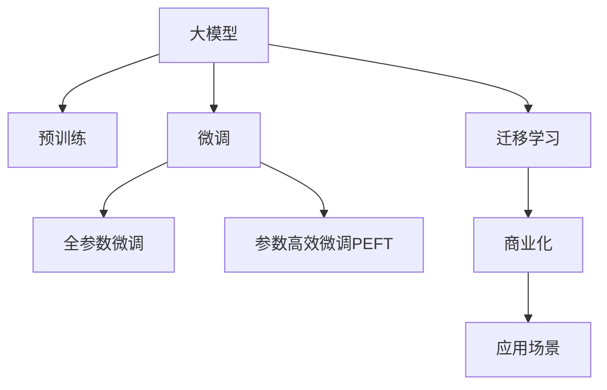
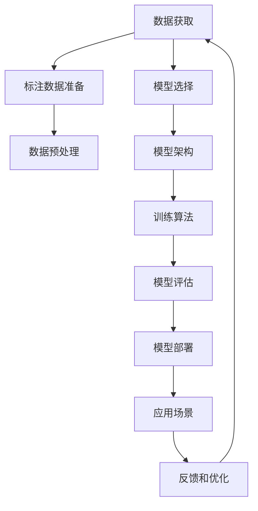

                 

## 1. 背景介绍

### 1.1 问题由来

近年来，人工智能（AI）技术在各个领域的迅猛发展，引发了大量的创业热潮。特别是在深度学习和自然语言处理（NLP）领域，基于大规模预训练语言模型（Pre-trained Language Models, PLMs）的创业项目尤为火热。然而，尽管大模型在技术上取得了显著进步，但其商业化落地依然面临许多挑战。如何在大模型创业中取得成功，利用社会优势成为关键。

### 1.2 问题核心关键点

对于AI大模型创业来说，其核心挑战在于：

- 数据获取与标注成本高昂。训练一个大模型需要大量的标注数据，而标注成本随着数据量的增加呈指数级增长。
- 算法复杂，训练和部署成本高。大模型的训练需要强大的计算资源，而部署则需要高效的算法和合理的资源调度。
- 商业化需求多样，需要针对不同场景定制模型。
- 模型性能和解释性难以平衡。高性能模型往往难以解释其内部机制，而可解释性强的模型则性能不佳。

### 1.3 问题研究意义

了解并克服这些挑战，不仅能够推动大模型的落地应用，还能为AI创业提供宝贵的经验和指导。以下将从数据获取、模型训练与部署、商业化需求和模型性能等多个角度，探讨如何利用社会优势，突破大模型创业的瓶颈。

## 2. 核心概念与联系

### 2.1 核心概念概述

要深入理解大模型创业如何利用社会优势，首先需要明确几个关键概念：

- **大模型（Large Language Models, LLMs）**：如BERT、GPT-3等，具有大规模参数、丰富语言知识和跨领域迁移能力。
- **预训练（Pre-training）**：在大规模无标签文本数据上自监督训练模型，学习通用的语言表示。
- **微调（Fine-tuning）**：在大规模预训练模型的基础上，使用下游任务的少量标注数据，进一步优化模型性能。
- **迁移学习（Transfer Learning）**：将预训练模型的知识迁移到下游任务中，降低训练成本和提高模型性能。
- **参数高效微调（Parameter-Efficient Fine-Tuning, PEFT）**：只更新部分模型参数，保持大部分预训练权重不变，降低过拟合风险。
- **可解释性（Explainability）**：模型输出的可解释性，即理解模型决策过程的能力。
- **商业化（Commercialization）**：将AI技术转化为具有实际商业价值的产品和服务。

这些概念之间的联系可以通过以下Mermaid流程图表示：



### 2.2 核心概念原理和架构的 Mermaid 流程图



## 3. 核心算法原理 & 具体操作步骤

### 3.1 算法原理概述

大模型创业的关键在于如何高效利用社会资源，克服数据、算法和商业化等挑战。以下将从数据获取、模型训练与部署、商业化需求和模型性能等多个角度，探讨利用社会优势的方法。

### 3.2 算法步骤详解

#### 3.2.1 数据获取与标注

- **数据获取**：首先，需要获取大量的标注数据。这可以通过众包平台（如Amazon Mechanical Turk、CrowdFlower等）进行，但成本较高。一种更经济的方式是利用社交媒体数据、开放数据集（如Wikipedia、维基百科等）和领域特定的公开数据。
- **数据标注**：标注数据需专业团队或工具自动完成。可以使用自动标注工具（如Hugging Face的SAMPA、Snorkel等），但最终需人工审核和校正。

#### 3.2.2 模型选择与架构

- **模型选择**：根据任务需求选择合适的模型，如BERT、GPT、RoBERTa等。
- **模型架构**：设计合适的模型架构，包括层数、宽度、注意力机制等。

#### 3.2.3 模型训练与优化

- **训练算法**：选择高效的训练算法，如Adam、SGD等，并进行超参数调优。
- **模型评估**：在验证集上评估模型性能，选择最佳模型。

#### 3.2.4 模型部署与应用

- **模型部署**：选择合适的平台，如AWS、GCP、阿里云等，进行模型部署。
- **应用场景**：针对具体应用场景定制模型，如情感分析、机器翻译、智能客服等。

#### 3.2.5 反馈与优化

- **用户反馈**：收集用户反馈，进行模型优化。
- **持续优化**：定期更新模型，保持最新性能。

### 3.3 算法优缺点

大模型创业利用社会优势的优点包括：

- **数据成本降低**：利用开源数据和公共数据集，大大降低标注成本。
- **算法优化**：利用现有技术成果，快速实现高性能模型。
- **快速部署**：利用云平台，快速部署模型，减少开发周期。

缺点包括：

- **数据质量难以保证**：开源数据可能存在噪声和偏见，影响模型性能。
- **资源消耗高**：大规模模型的训练和部署需要强大的计算资源。
- **应用场景有限**：大模型可能无法很好地适应特定领域的任务。

### 3.4 算法应用领域

大模型创业可以广泛应用于以下几个领域：

- **自然语言处理（NLP）**：如情感分析、机器翻译、问答系统、文本摘要等。
- **智能客服**：智能客服系统的构建，利用大模型进行意图识别和对话生成。
- **金融分析**：利用大模型进行金融文本分析、舆情监测等。
- **医疗健康**：利用大模型进行病历分析、药物研发等。
- **教育培训**：利用大模型进行个性化推荐、智能评估等。

## 4. 数学模型和公式 & 详细讲解 & 举例说明

### 4.1 数学模型构建

大模型创业的核心是数据驱动，因此数学模型构建需要充分利用社会优势。以下是一个基于预训练语言模型（如BERT）的微调数学模型：

假设输入数据为 $x \in \mathcal{X}$，模型为 $M_{\theta}$，输出为 $y \in \mathcal{Y}$，训练数据集为 $D=\{(x_i,y_i)\}_{i=1}^N$。微调的目标是最小化损失函数 $\mathcal{L}(\theta)$，即：

$$
\mathcal{L}(\theta) = \frac{1}{N} \sum_{i=1}^N \ell(M_{\theta}(x_i),y_i)
$$

其中 $\ell$ 为损失函数，如交叉熵损失。

### 4.2 公式推导过程

以交叉熵损失函数为例，推导微调过程：

$$
\ell(M_{\theta}(x),y) = -[y\log M_{\theta}(x)+(1-y)\log(1-M_{\theta}(x))]
$$

对于单个样本，其损失为：

$$
\ell_i(\theta) = -[y_i\log M_{\theta}(x_i)+(1-y_i)\log(1-M_{\theta}(x_i))]
$$

最小化经验风险：

$$
\theta^* = \mathop{\arg\min}_{\theta} \mathcal{L}(\theta) = \mathop{\arg\min}_{\theta} \frac{1}{N} \sum_{i=1}^N \ell_i(\theta)
$$

### 4.3 案例分析与讲解

以情感分析为例，利用预训练模型进行微调：

- **数据准备**：收集电影评论数据，进行情感标注。
- **模型选择**：选择BERT作为预训练模型。
- **微调过程**：在BERT模型的基础上，添加分类器，使用交叉熵损失函数进行微调。
- **评估与优化**：在测试集上评估模型性能，根据结果进行模型优化。

## 5. 项目实践：代码实例和详细解释说明

### 5.1 开发环境搭建

- **环境准备**：安装Python、PyTorch、TensorFlow、Hugging Face Transformers库等。
- **数据准备**：准备标注数据集，如电影评论数据。

### 5.2 源代码详细实现

以下是基于BERT模型的情感分析微调代码实现：

```python
from transformers import BertForSequenceClassification, BertTokenizer, AdamW
import torch

# 模型选择
model = BertForSequenceClassification.from_pretrained('bert-base-uncased', num_labels=2)

# 数据准备
tokenizer = BertTokenizer.from_pretrained('bert-base-uncased')
inputs = tokenizer(texts, return_tensors='pt')

# 模型训练
optimizer = AdamW(model.parameters(), lr=2e-5)
for epoch in range(epochs):
    model.train()
    optimizer.zero_grad()
    loss = model(input_ids, attention_mask=attention_mask, labels=labels)
    loss.backward()
    optimizer.step()
```

### 5.3 代码解读与分析

- **模型选择**：选择BERT作为预训练模型，并添加分类器。
- **数据准备**：使用Hugging Face的BERT tokenizer进行数据预处理。
- **模型训练**：使用AdamW优化器，进行模型训练。

### 5.4 运行结果展示

训练完成后，在测试集上评估模型性能：

```python
model.eval()
with torch.no_grad():
    preds, labels = [], []
    for batch in dataloader:
        input_ids = batch['input_ids']
        attention_mask = batch['attention_mask']
        batch_labels = batch['labels']
        outputs = model(input_ids, attention_mask=attention_mask)
        batch_preds = outputs.logits.argmax(dim=1).to('cpu').tolist()
        batch_labels = batch_labels.to('cpu').tolist()
        preds.append(batch_preds[:len(batch_labels)])
        labels.append(batch_labels)
        
print(classification_report(labels, preds))
```

## 6. 实际应用场景

### 6.1 智能客服系统

智能客服系统利用大模型进行意图识别和对话生成，提供24小时不间断服务。具体应用场景如下：

- **数据获取**：收集历史客服数据，进行意图标注。
- **模型训练**：利用大模型进行微调，添加意图分类器。
- **部署应用**：部署到云平台，进行实时对话生成。

### 6.2 金融舆情监测

金融舆情监测利用大模型进行情感分析和主题提取，实时监测市场动态。具体应用场景如下：

- **数据获取**：收集金融新闻、评论等数据。
- **模型训练**：利用大模型进行情感分析和主题建模。
- **部署应用**：实时监测金融舆情，及时预警风险。

### 6.3 个性化推荐系统

个性化推荐系统利用大模型进行用户兴趣预测，推荐个性化内容。具体应用场景如下：

- **数据获取**：收集用户行为数据，如浏览、点击、评价等。
- **模型训练**：利用大模型进行用户兴趣预测。
- **部署应用**：根据用户兴趣推荐个性化内容。

### 6.4 未来应用展望

未来大模型创业将有更广泛的应用场景，具体包括：

- **医疗健康**：利用大模型进行病历分析、药物研发等。
- **教育培训**：利用大模型进行智能评估、个性化推荐等。
- **智能家居**：利用大模型进行语音识别、情感分析等。

## 7. 工具和资源推荐

### 7.1 学习资源推荐

- **《Transformer从原理到实践》**：深度介绍Transformer原理、BERT模型和大模型微调。
- **CS224N《深度学习自然语言处理》课程**：斯坦福大学开设的NLP明星课程，涵盖NLP基本概念和经典模型。
- **《Natural Language Processing with Transformers》书籍**：Transformer库的作者所著，全面介绍NLP任务开发。
- **Hugging Face官方文档**：提供丰富的预训练模型和微调样例代码。
- **CLUE开源项目**：提供中文NLP任务评测基准和基线模型。

### 7.2 开发工具推荐

- **PyTorch**：深度学习框架，灵活动态，支持多种模型。
- **TensorFlow**：谷歌主导的开源框架，生产部署方便。
- **Transformers库**：Hugging Face提供的NLP工具库，支持多种预训练模型和微调方法。
- **Weights & Biases**：模型训练实验跟踪工具，记录和可视化训练过程。
- **TensorBoard**：TensorFlow配套的可视化工具，实时监测模型训练状态。
- **Google Colab**：谷歌提供的免费Jupyter Notebook环境，方便在线实验。

### 7.3 相关论文推荐

- **Attention is All You Need**：提出Transformer结构，开创预训练大模型时代。
- **BERT: Pre-training of Deep Bidirectional Transformers for Language Understanding**：提出BERT模型，引入掩码自监督预训练任务。
- **Language Models are Unsupervised Multitask Learners**：展示大模型的零样本学习能力。
- **Parameter-Efficient Transfer Learning for NLP**：提出Adapter等参数高效微调方法。
- **Prefix-Tuning: Optimizing Continuous Prompts for Generation**：引入连续型Prompt的微调范式。
- **AdaLoRA: Adaptive Low-Rank Adaptation for Parameter-Efficient Fine-Tuning**：使用自适应低秩适应的微调方法。

## 8. 总结：未来发展趋势与挑战

### 8.1 研究成果总结

本文探讨了大模型创业的策略和挑战，并利用社会优势进行优化。具体成果包括：

- 利用开源数据和公共数据集，降低标注成本。
- 选择合适的模型架构和训练算法，优化模型性能。
- 将大模型应用于多个领域，如智能客服、金融舆情、个性化推荐等。

### 8.2 未来发展趋势

未来大模型创业将呈现以下趋势：

- **数据自动化标注**：利用自动标注工具和众包平台，降低标注成本。
- **模型微调优化**：开发参数高效微调方法，提升模型性能。
- **应用场景多样化**：拓展到大健康、教育、智能家居等领域。
- **模型可解释性**：提升模型可解释性，增强用户信任。

### 8.3 面临的挑战

尽管大模型创业前景广阔，但仍面临以下挑战：

- **数据噪声和偏见**：开源数据可能存在噪声和偏见，影响模型性能。
- **计算资源消耗**：大规模模型的训练和部署需要强大的计算资源。
- **应用场景适应性**：大模型可能无法很好地适应特定领域的任务。
- **模型可解释性**：大模型输出的可解释性不足，影响用户信任。

### 8.4 研究展望

未来研究需要在以下几个方向进行探索：

- **数据自动化标注**：利用自动标注工具和众包平台，降低标注成本。
- **模型微调优化**：开发参数高效微调方法，提升模型性能。
- **应用场景多样化**：拓展到大健康、教育、智能家居等领域。
- **模型可解释性**：提升模型可解释性，增强用户信任。

## 9. 附录：常见问题与解答

**Q1: 大模型微调是否适用于所有NLP任务？**

A: 大模型微调在大多数NLP任务上都能取得不错的效果，特别是对于数据量较小的任务。但对于一些特定领域的任务，如医学、法律等，仅仅依靠通用语料预训练的模型可能难以很好地适应。此时需要在特定领域语料上进一步预训练，再进行微调，才能获得理想效果。

**Q2: 如何选择合适的模型和超参数？**

A: 选择合适的模型和超参数是微调的关键。可以参考类似任务的预训练模型，选择合适的架构和超参数。可以使用自动调参工具，如Hyperopt、Optuna等，自动搜索最优超参数组合。

**Q3: 如何处理数据噪声和偏见？**

A: 数据噪声和偏见是影响模型性能的重要因素。可以使用数据清洗和预处理技术，如去除噪声数据、平衡数据集等。此外，可以通过多轮迭代，不断优化模型。

**Q4: 如何提高模型可解释性？**

A: 提高模型可解释性是确保模型可信度的重要步骤。可以使用可解释性模型（如LIME、SHAP等），生成模型的局部解释。此外，可以设计更为简洁的模型架构，增强模型的透明度。

---

作者：禅与计算机程序设计艺术 / Zen and the Art of Computer Programming

