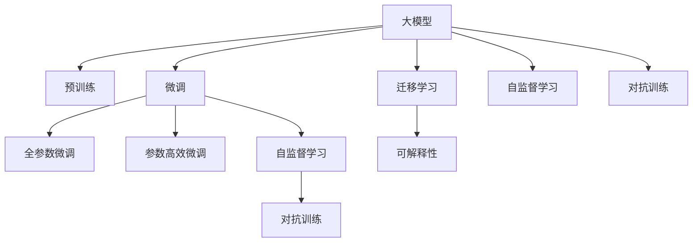

                 

# AI 大模型创业：如何利用竞争优势？

## 1. 背景介绍

随着人工智能技术的不断突破，大模型（Large Model）已经成为AI创业的重要方向。大模型通过大规模数据训练，获得了强大的语言理解和生成能力，被广泛应用于自然语言处理（NLP）、计算机视觉、生成对抗网络（GAN）等多个领域。然而，大模型也面临着数据、算力、技术等多重挑战，如何有效利用竞争优势，打造具有市场竞争力的AI创业公司，成为了创业者们关注的焦点。本文将从大模型的核心概念、技术原理、应用场景、竞争优势等角度进行深入探讨，帮助创业者全面理解大模型创业的战略选择和技术实现路径。

## 2. 核心概念与联系

### 2.1 核心概念概述

在大模型创业的讨论中，我们需要明确几个核心概念：

- **大模型（Large Model）**：指通过大规模数据训练，具备强大语言理解和生成能力的人工智能模型，如BERT、GPT、T5等。
- **预训练（Pre-training）**：指在大规模无标签数据上，通过自监督任务对模型进行预训练，学习通用的语言表示。
- **微调（Fine-tuning）**：指在预训练模型基础上，使用下游任务的少量标注数据，通过有监督学习优化模型在该任务上的性能。
- **迁移学习（Transfer Learning）**：指将一个领域学习到的知识，迁移到另一个相关领域学习的过程，大模型的预训练-微调即为一种迁移学习方式。
- **自监督学习（Self-supervised Learning）**：指在大规模无标签数据上，通过设计特定的自监督任务，自动生成监督信号，训练模型学习通用知识。
- **对抗训练（Adversarial Training）**：指在模型训练过程中，引入对抗样本，提高模型的鲁棒性和泛化能力。
- **可解释性（Explainability）**：指模型的决策过程和输出结果能够被理解，便于开发者进行调试和优化。

这些核心概念共同构成了大模型创业的技术基础，帮助创业者全面理解大模型的工作原理和应用场景。

### 2.2 核心概念之间的联系

这些核心概念之间的联系可以通过以下Mermaid流程图来展示：



这个流程图展示了各大模型的核心概念之间的联系：

1. 大模型通过预训练获得基础能力。
2. 微调是对预训练模型进行任务特定的优化，可以分为全参数微调和参数高效微调。
3. 自监督学习是大模型预训练的重要手段，可以在无标签数据上自动生成监督信号。
4. 对抗训练可以增强模型的鲁棒性，提高泛化能力。
5. 迁移学习是连接预训练模型与下游任务的桥梁，可以通过微调或自监督学习来实现。
6. 可解释性帮助开发者理解模型的决策过程，便于调试和优化。

## 3. 核心算法原理 & 具体操作步骤

### 3.1 算法原理概述

大模型创业的核心在于充分利用大模型的竞争优势，通过有针对性的技术优化和应用创新，在特定领域取得突破性进展。大模型的竞争优势主要体现在以下几个方面：

- **强大的语言理解能力**：大模型能够处理大规模语言数据，具备强大的语言理解和生成能力，可以处理复杂的自然语言任务。
- **广泛的知识背景**：预训练模型在大规模无标签数据上学习到了丰富的语言知识，能够在特定领域中快速适应并取得良好效果。
- **高效的计算能力**：大模型的参数量巨大，通过并行计算能够实现高效的推理和生成。
- **可扩展性**：大模型具备可扩展性，可以根据任务需求进行定制化微调和优化。

### 3.2 算法步骤详解

基于大模型创业的技术路线可以分为以下几个关键步骤：

**Step 1: 选择合适的预训练模型和数据集**
- 根据具体任务需求，选择合适的预训练模型（如BERT、GPT等）和数据集。数据集应尽可能覆盖任务所需领域，且数据质量高。

**Step 2: 设计任务适配层**
- 根据任务类型，在预训练模型基础上设计合适的任务适配层，如分类器、生成器等。适配层的输出应与任务标签一致。

**Step 3: 设置微调超参数**
- 选择合适的优化算法及其参数，如AdamW、SGD等，设置学习率、批大小、迭代轮数等。
- 设置正则化技术及强度，包括权重衰减、Dropout、Early Stopping等。

**Step 4: 执行梯度训练**
- 将训练集数据分批次输入模型，前向传播计算损失函数。
- 反向传播计算参数梯度，根据设定的优化算法和学习率更新模型参数。
- 周期性在验证集上评估模型性能，根据性能指标决定是否触发Early Stopping。
- 重复上述步骤直至满足预设的迭代轮数或Early Stopping条件。

**Step 5: 测试和部署**
- 在测试集上评估微调后模型的效果，对比微调前后的精度提升。
- 使用微调后的模型对新样本进行推理预测，集成到实际的应用系统中。
- 持续收集新的数据，定期重新微调模型，以适应数据分布的变化。

### 3.3 算法优缺点

大模型创业的算法优势主要体现在以下几个方面：

- **高效部署**：大模型通过预训练获得基础能力，微调过程可以快速迭代优化，部署效率高。
- **精确度**：微调后的模型精度高，特别是在小样本条件下，表现优异。
- **可扩展性**：大模型可以通过微调、参数高效微调等方式进行灵活扩展，适用于多种NLP任务。

但大模型创业也面临以下缺点：

- **数据依赖**：微调依赖大量标注数据，数据获取成本高。
- **过拟合风险**：微调过程中容易发生过拟合，需要严格控制超参数。
- **资源消耗**：大模型的计算资源需求大，硬件成本高。
- **可解释性不足**：微调模型往往缺乏可解释性，难以进行调试和优化。

## 4. 数学模型和公式 & 详细讲解 & 举例说明

### 4.1 数学模型构建

在大模型创业中，常见的数学模型包括交叉熵损失函数、分类准确率等。以二分类任务为例，数学模型构建如下：

- 输入：模型输入 $x$，模型输出 $y$。
- 损失函数：交叉熵损失 $L(x,y)=-y\log(y^*)+(1-y)\log((1-y)^*)$。
- 目标：最小化损失函数 $L(x,y)$。

### 4.2 公式推导过程

交叉熵损失函数的推导过程如下：

- 定义交叉熵损失：$L(x,y)=-y\log(y^*)+(1-y)\log((1-y)^*)$。
- 定义模型输出：$y^*=\sigma(Wx+b)$，其中 $\sigma$ 为激活函数，$W$ 为权重矩阵，$b$ 为偏置项。
- 推导损失函数：$L(x,y)=-y\log(\sigma(Wx+b))+(1-y)\log(1-\sigma(Wx+b))$。

### 4.3 案例分析与讲解

以自然语言处理中的文本分类任务为例，通过微调大模型可以获得较高的精度。具体步骤如下：

1. 数据集准备：收集有标签的文本数据，划分为训练集和测试集。
2. 模型选择：选择适当的预训练模型（如BERT）作为初始化参数。
3. 适配层设计：设计分类器，输出为二分类结果。
4. 微调参数：使用微调技术，调整模型参数以适应文本分类任务。
5. 性能评估：在测试集上评估模型性能，对比微调前后的精度提升。

## 5. 项目实践：代码实例和详细解释说明

### 5.1 开发环境搭建

为了进行大模型创业的项目实践，需要搭建相应的开发环境。以下是使用Python进行PyTorch开发的环境配置流程：

1. 安装Anaconda：从官网下载并安装Anaconda，用于创建独立的Python环境。

2. 创建并激活虚拟环境：
```bash
conda create -n pytorch-env python=3.8 
conda activate pytorch-env
```

3. 安装PyTorch：根据CUDA版本，从官网获取对应的安装命令。例如：
```bash
conda install pytorch torchvision torchaudio cudatoolkit=11.1 -c pytorch -c conda-forge
```

4. 安装Transformers库：
```bash
pip install transformers
```

5. 安装各类工具包：
```bash
pip install numpy pandas scikit-learn matplotlib tqdm jupyter notebook ipython
```

完成上述步骤后，即可在`pytorch-env`环境中进行大模型创业的开发实践。

### 5.2 源代码详细实现

下面是使用PyTorch进行文本分类任务微调的代码实现：

```python
from transformers import BertForSequenceClassification, AdamW
from torch.utils.data import Dataset, DataLoader
from torch.nn import CrossEntropyLoss
from tqdm import tqdm

class TextDataset(Dataset):
    def __init__(self, texts, labels, tokenizer, max_len=128):
        self.texts = texts
        self.labels = labels
        self.tokenizer = tokenizer
        self.max_len = max_len

    def __len__(self):
        return len(self.texts)

    def __getitem__(self, item):
        text = self.texts[item]
        label = self.labels[item]

        encoding = self.tokenizer(text, return_tensors='pt', max_length=self.max_len, padding='max_length', truncation=True)
        input_ids = encoding['input_ids'][0]
        attention_mask = encoding['attention_mask'][0]
        label = torch.tensor(label, dtype=torch.long)

        return {
            'input_ids': input_ids,
            'attention_mask': attention_mask,
            'labels': label
        }

# 数据集加载
tokenizer = BertTokenizer.from_pretrained('bert-base-cased')
train_dataset = TextDataset(train_texts, train_labels, tokenizer)
test_dataset = TextDataset(test_texts, test_labels, tokenizer)

# 模型选择
model = BertForSequenceClassification.from_pretrained('bert-base-cased', num_labels=2)

# 优化器设置
optimizer = AdamW(model.parameters(), lr=2e-5)

# 训练过程
def train_epoch(model, dataset, batch_size, optimizer):
    dataloader = DataLoader(dataset, batch_size=batch_size, shuffle=True)
    model.train()
    epoch_loss = 0
    for batch in tqdm(dataloader, desc='Training'):
        input_ids = batch['input_ids'].to(device)
        attention_mask = batch['attention_mask'].to(device)
        labels = batch['labels'].to(device)
        model.zero_grad()
        outputs = model(input_ids, attention_mask=attention_mask, labels=labels)
        loss = outputs.loss
        epoch_loss += loss.item()
        loss.backward()
        optimizer.step()
    return epoch_loss / len(dataloader)

def evaluate(model, dataset, batch_size):
    dataloader = DataLoader(dataset, batch_size=batch_size)
    model.eval()
    preds, labels = [], []
    with torch.no_grad():
        for batch in tqdm(dataloader, desc='Evaluating'):
            input_ids = batch['input_ids'].to(device)
            attention_mask = batch['attention_mask'].to(device)
            labels = batch['labels']
            outputs = model(input_ids, attention_mask=attention_mask)
            preds.append(outputs.logits.argmax(dim=1).to('cpu').tolist())
            labels = labels.to('cpu').tolist()

    print(classification_report(labels, preds))

# 训练过程
epochs = 5
batch_size = 16

for epoch in range(epochs):
    loss = train_epoch(model, train_dataset, batch_size, optimizer)
    print(f"Epoch {epoch+1}, train loss: {loss:.3f}")

    print(f"Epoch {epoch+1}, dev results:")
    evaluate(model, dev_dataset, batch_size)

print("Test results:")
evaluate(model, test_dataset, batch_size)
```

### 5.3 代码解读与分析

上述代码实现了使用BERT模型进行文本分类任务的微调。具体分析如下：

- **数据集定义**：`TextDataset`类用于处理文本数据，将文本数据和标签进行编码，并支持最大长度控制。
- **模型选择**：使用`BertForSequenceClassification`作为文本分类的任务适配层。
- **优化器设置**：使用`AdamW`优化器进行模型参数更新，设置学习率为2e-5。
- **训练过程**：`train_epoch`函数定义了每个epoch的训练过程，包括前向传播、损失计算、反向传播和参数更新。
- **评估过程**：`evaluate`函数用于在验证集和测试集上评估模型性能。

## 6. 实际应用场景

### 6.1 智能客服系统

智能客服系统是大模型创业的重要应用场景之一。传统的客服系统需要大量人工参与，无法实现全天候服务，且响应速度慢。利用大模型进行微调，可以构建智能客服机器人，实现自动解答用户咨询，提升服务效率。

具体实现步骤如下：

1. 收集企业客服历史数据，标注用户咨询问题和回答。
2. 选择适当的预训练模型（如GPT）进行微调。
3. 设计智能客服应用，集成微调后的模型。
4. 部署到生产环境，进行实时响应。

### 6.2 金融舆情监测

金融舆情监测是大模型创业的另一个重要应用场景。金融市场信息海量，实时监测舆情有助于企业快速响应市场变化，防范金融风险。

具体实现步骤如下：

1. 收集金融领域相关新闻、评论等文本数据，进行情感标注。
2. 选择适当的预训练模型进行微调。
3. 设计舆情监测应用，实时抓取和分析网络文本数据。
4. 预警系统，及时发现舆情异常，进行风险控制。

### 6.3 个性化推荐系统

个性化推荐系统是大模型创业的重要应用之一。传统的推荐系统依赖用户历史行为数据，无法充分利用用户的文本描述信息。利用大模型进行微调，可以提升推荐系统的个性化程度。

具体实现步骤如下：

1. 收集用户浏览、评论等文本数据。
2. 选择适当的预训练模型进行微调。
3. 设计推荐系统应用，结合文本描述信息进行推荐。
4. 部署到生产环境，实时推荐。

## 7. 工具和资源推荐

### 7.1 学习资源推荐

为了帮助开发者系统掌握大模型创业的理论基础和实践技巧，以下是一些优质的学习资源：

1. 《Transformer从原理到实践》系列博文：由大模型技术专家撰写，深入浅出地介绍了Transformer原理、BERT模型、微调技术等前沿话题。

2. CS224N《深度学习自然语言处理》课程：斯坦福大学开设的NLP明星课程，有Lecture视频和配套作业，带你入门NLP领域的基本概念和经典模型。

3. 《Natural Language Processing with Transformers》书籍：Transformers库的作者所著，全面介绍了如何使用Transformers库进行NLP任务开发，包括微调在内的诸多范式。

4. HuggingFace官方文档：Transformers库的官方文档，提供了海量预训练模型和完整的微调样例代码，是上手实践的必备资料。

5. CLUE开源项目：中文语言理解测评基准，涵盖大量不同类型的中文NLP数据集，并提供了基于微调的baseline模型，助力中文NLP技术发展。

通过对这些资源的学习实践，相信你一定能够快速掌握大模型创业的精髓，并用于解决实际的NLP问题。

### 7.2 开发工具推荐

高效的开发离不开优秀的工具支持。以下是几款用于大模型创业开发的常用工具：

1. PyTorch：基于Python的开源深度学习框架，灵活动态的计算图，适合快速迭代研究。大部分预训练语言模型都有PyTorch版本的实现。

2. TensorFlow：由Google主导开发的开源深度学习框架，生产部署方便，适合大规模工程应用。同样有丰富的预训练语言模型资源。

3. Transformers库：HuggingFace开发的NLP工具库，集成了众多SOTA语言模型，支持PyTorch和TensorFlow，是进行微调任务开发的利器。

4. Weights & Biases：模型训练的实验跟踪工具，可以记录和可视化模型训练过程中的各项指标，方便对比和调优。与主流深度学习框架无缝集成。

5. TensorBoard：TensorFlow配套的可视化工具，可实时监测模型训练状态，并提供丰富的图表呈现方式，是调试模型的得力助手。

6. Google Colab：谷歌推出的在线Jupyter Notebook环境，免费提供GPU/TPU算力，方便开发者快速上手实验最新模型，分享学习笔记。

合理利用这些工具，可以显著提升大模型创业任务的开发效率，加快创新迭代的步伐。

### 7.3 相关论文推荐

大模型创业的研究源于学界的持续研究。以下是几篇奠基性的相关论文，推荐阅读：

1. Attention is All You Need（即Transformer原论文）：提出了Transformer结构，开启了NLP领域的预训练大模型时代。

2. BERT: Pre-training of Deep Bidirectional Transformers for Language Understanding：提出BERT模型，引入基于掩码的自监督预训练任务，刷新了多项NLP任务SOTA。

3. Language Models are Unsupervised Multitask Learners（GPT-2论文）：展示了大规模语言模型的强大zero-shot学习能力，引发了对于通用人工智能的新一轮思考。

4. Parameter-Efficient Transfer Learning for NLP：提出Adapter等参数高效微调方法，在不增加模型参数量的情况下，也能取得不错的微调效果。

5. Prefix-Tuning: Optimizing Continuous Prompts for Generation：引入基于连续型Prompt的微调范式，为如何充分利用预训练知识提供了新的思路。

6. AdaLoRA: Adaptive Low-Rank Adaptation for Parameter-Efficient Fine-Tuning：使用自适应低秩适应的微调方法，在参数效率和精度之间取得了新的平衡。

这些论文代表了大模型创业的发展脉络。通过学习这些前沿成果，可以帮助研究者把握学科前进方向，激发更多的创新灵感。

## 8. 总结：未来发展趋势与挑战

### 8.1 总结

本文对大模型创业的技术路线进行了全面系统的介绍。首先阐述了大模型创业的背景和意义，明确了大模型在大规模AI创业中的重要地位。其次，从原理到实践，详细讲解了大模型微调和大模型创业的关键步骤，给出了微调任务开发的完整代码实例。同时，本文还广泛探讨了大模型在智能客服、金融舆情、个性化推荐等多个行业领域的应用前景，展示了大模型创业的巨大潜力。

通过本文的系统梳理，可以看到，大模型创业技术正在成为AI创业的重要方向，极大地拓展了AI技术的应用边界，催生了更多的落地场景。大模型创业的成功关键在于对大模型竞争优势的充分利用，通过有针对性的技术优化和应用创新，在特定领域取得突破性进展。

### 8.2 未来发展趋势

展望未来，大模型创业将呈现以下几个发展趋势：

1. **模型规模不断增大**：随着算力成本的下降和数据规模的扩张，大模型的参数量将持续增长。超大规模语言模型蕴含的丰富语言知识，有望支撑更加复杂多变的下游任务微调。

2. **微调方法更加多样**：除了传统的全参数微调外，未来会涌现更多参数高效的微调方法，如Prefix-Tuning、LoRA等，在节省计算资源的同时也能保证微调精度。

3. **持续学习成为常态**：随着数据分布的不断变化，大模型需要持续学习新知识以保持性能。如何在不遗忘原有知识的同时，高效吸收新样本信息，将成为重要的研究课题。

4. **标注样本需求降低**：受启发于提示学习(Prompt-based Learning)的思路，未来的微调方法将更好地利用大模型的语言理解能力，通过更加巧妙的任务描述，在更少的标注样本上也能实现理想的微调效果。

5. **多模态微调崛起**：当前的大模型创业主要聚焦于纯文本数据，未来会进一步拓展到图像、视频、语音等多模态数据微调。多模态信息的融合，将显著提升语言模型对现实世界的理解和建模能力。

6. **通用性增强**：经过海量数据的预训练和多领域任务的微调，未来的语言模型将具备更强大的常识推理和跨领域迁移能力，逐步迈向通用人工智能(AGI)的目标。

以上趋势凸显了大模型创业技术的广阔前景。这些方向的探索发展，必将进一步提升NLP系统的性能和应用范围，为人工智能技术在垂直行业的规模化落地铺平道路。

### 8.3 面临的挑战

尽管大模型创业技术已经取得了瞩目成就，但在迈向更加智能化、普适化应用的过程中，它仍面临着诸多挑战：

1. **数据依赖**：微调依赖大量标注数据，数据获取成本高。
2. **过拟合风险**：微调过程中容易发生过拟合，需要严格控制超参数。
3. **资源消耗**：大模型的计算资源需求大，硬件成本高。
4. **可解释性不足**：微调模型往往缺乏可解释性，难以进行调试和优化。
5. **鲁棒性不足**：大模型面临域外数据时，泛化性能往往大打折扣。
6. **伦理风险**：大模型可能学习到有害信息，传递到下游任务，造成负面影响。

正视大模型创业面临的这些挑战，积极应对并寻求突破，将是大模型创业走向成熟的必由之路。

### 8.4 未来突破

面对大模型创业所面临的种种挑战，未来的研究需要在以下几个方面寻求新的突破：

1. **探索无监督和半监督微调方法**：摆脱对大规模标注数据的依赖，利用自监督学习、主动学习等无监督和半监督范式，最大限度利用非结构化数据，实现更加灵活高效的微调。

2. **研究参数高效和计算高效的微调范式**：开发更加参数高效的微调方法，在固定大部分预训练参数的同时，只更新极少量的任务相关参数。同时优化微调模型的计算图，减少前向传播和反向传播的资源消耗，实现更加轻量级、实时性的部署。

3. **融合因果和对比学习范式**：通过引入因果推断和对比学习思想，增强大模型建立稳定因果关系的能力，学习更加普适、鲁棒的语言表征，从而提升模型泛化性和抗干扰能力。

4. **引入更多先验知识**：将符号化的先验知识，如知识图谱、逻辑规则等，与神经网络模型进行巧妙融合，引导大模型学习更准确、合理的语言模型。同时加强不同模态数据的整合，实现视觉、语音等多模态信息与文本信息的协同建模。

5. **结合因果分析和博弈论工具**：将因果分析方法引入大模型，识别出模型决策的关键特征，增强输出解释的因果性和逻辑性。借助博弈论工具刻画人机交互过程，主动探索并规避模型的脆弱点，提高系统稳定性。

6. **纳入伦理道德约束**：在大模型训练目标中引入伦理导向的评估指标，过滤和惩罚有偏见、有害的输出倾向。同时加强人工干预和审核，建立大模型行为的监管机制，确保输出符合人类价值观和伦理道德。

这些研究方向的探索，必将引领大模型创业技术迈向更高的台阶，为构建安全、可靠、可解释、可控的智能系统铺平道路。面向未来，大模型创业技术还需要与其他人工智能技术进行更深入的融合，如知识表示、因果推理、强化学习等，多路径协同发力，共同推动自然语言理解和智能交互系统的进步。只有勇于创新、敢于突破，才能不断拓展语言模型的边界，让智能技术更好地造福人类社会。

## 9. 附录：常见问题与解答

**Q1：大模型创业是否适用于所有AI项目？**

A: 大模型创业适用于数据驱动、算法复杂、需求多样化的AI项目。特别是对于需要处理大规模语言数据的场景，如自然语言处理、推荐系统、客服系统等，大模型创业具有显著优势。但对于一些需要精确控制模型的应用场景，如实时控制系统、安全检测等，可能需要选择其他类型的AI创业方式。

**Q2：如何选择合适的预训练模型？**

A: 选择合适的预训练模型需要考虑以下几个因素：
1. **任务类型**：根据具体任务类型选择适当的预训练模型，如文本分类任务可以选择BERT、GPT，对话生成任务可以选择GPT等。
2. **数据规模**：数据规模较大的任务可以选择大模型，如大规模文本分类、对话生成等，数据规模较小可以选择中等规模模型。
3. **资源限制**：根据项目资源限制选择合适的模型，如计算资源有限可以选择小规模模型，资源充足可以选择大规模模型。

**Q3：如何避免大模型的过拟合？**

A: 避免大模型过拟合可以采取以下策略：
1. **数据增强**：通过回译、近义替换等方式扩充训练集。
2. **正则化**：使用L2正则、Dropout、Early Stopping等避免过拟合。
3. **对抗训练**：引入对抗样本，提高模型鲁棒性。
4. **参数高效微调**：只调整少量参数，减小过拟合风险。
5. **多模型集成**：训练多个模型，取平均输出，抑制过拟合。

**Q4：大模型创业需要哪些硬件资源？**

A: 大模型创业需要高计算能力的硬件资源，如GPU/TPU等高性能设备。具体需求如下：
1. **GPU/TPU**：大模型的计算资源需求大，需要高性能GPU/TPU设备。
2. **内存**：大模型的参数量巨大，需要充足的内存进行模型训练和推理。
3. **存储**：大模型需要大量的存储空间进行模型保存和数据存储。

**Q5：大模型创业的收益模式有哪些？**

A: 大模型创业的收益模式多种多样，主要包括：
1. **订阅模式**：客户按月或按年订阅大模型服务，获取模型使用权。
2. **按需使用模式**：客户根据需求按次调用大模型API，按调用次数付费。
3. **定制化服务**：为客户提供定制化的大模型服务，根据服务复杂度和需求程度收费。
4. **AI平台**：构建AI平台，提供完整的AI开发环境，收取平台服务费。

**Q6：大模型创业需要哪些团队成员？**

A: 大模型创业需要多学科背景的团队成员，主要包括：
1. **算法工程师**：负责大模型的设计和优化，实现模型的微调。
2. **数据科学家**：负责数据的收集、清洗和标注，构建数据集。
3. **软件工程师**：负责开发部署大模型，集成到实际应用中。
4. **产品经理**：负责市场需求调研和产品规划，确保大模型创业的方向和目标。
5. **市场销售**：负责市场推广和客户拓展，确保大模型创业的商业化落地。

**Q7：大模型创业的落地场景有哪些？**

A: 大模型创业的落地场景丰富多样，主要包括以下几个方向：
1. **自然语言处理**：如文本分类、命名实体识别、情感分析、机器翻译等。
2. **推荐系统**：如个性化推荐、商品推荐、广告推荐等。
3. **智能客服**：如智能客服机器人、对话系统等。
4. **智能助手**：如虚拟助手、语音助手等。
5. **金融领域**：如金融舆情监测、风险评估等。
6. **医疗领域**：如医疗问答、病历分析等。

**Q8：大模型创业需要考虑哪些伦理道德问题？**

A: 大模型创业需要考虑以下伦理道德问题：
1. **数据隐私**：保护用户数据隐私，确保数据安全。
2. **偏见和歧视**：避免模型训练过程中引入偏见，确保模型公平公正。
3. **透明度**：提高模型决策过程的透明度，便于用户理解和信任。
4. **合规性**：确保大模型创业符合法律法规和伦理标准。
5. **社会责任**：考虑大模型创业对社会的负面影响，如就业、道德等。

总之，大模型创业技术具有广阔的应用前景，但也面临着诸多挑战。只有在数据、模型、工程、业务等多个维度进行全面优化，才能真正实现人工智能技术在垂直行业的规模化落地。未来，大模型创业将与更多的前沿技术进行融合，如知识表示、因果推理、强化学习等，共同推动自然语言理解和智能交互系统的进步。

