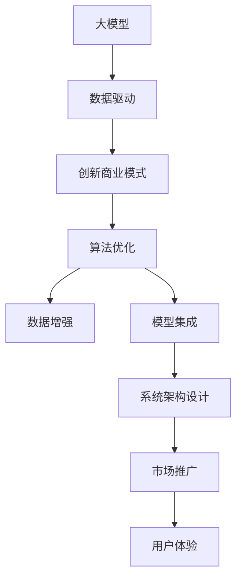

                 

# AI 大模型创业：如何利用竞争优势？

> 关键词：大模型创业, 竞争优势, AI初创企业, 数据驱动, 创新商业模式, 算法优化, 数据增强, 模型集成, 系统架构设计

## 1. 背景介绍

### 1.1 问题由来
随着人工智能(AI)技术的迅猛发展，大模型（Big Models）成为了驱动AI技术创新和产业应用的重要引擎。大模型具有泛化能力强、适应性广、数据驱动等特点，广泛应用于自然语言处理(NLP)、计算机视觉、语音识别等诸多领域，极大地推动了AI技术的落地应用。

然而，由于大模型训练和维护成本高、数据需求量大，初创AI企业往往难以独立支撑，需要依赖于大公司的技术支持和市场渠道。这使得大模型创业在技术、商业、资源等方面面临多重挑战。如何在激烈的市场竞争中，有效利用大模型的竞争优势，打造可持续发展的AI创业企业，成为当前创业者和投资者普遍关注的问题。

### 1.2 问题核心关键点
大模型创业的核心在于如何在有限的资源条件下，最大化利用大模型的竞争优势。核心关键点包括：
- 选择合适的目标市场和应用场景，寻找大模型可以发挥最大效能的领域。
- 合理配置数据、计算、人力资源，确保模型训练和应用的高效性。
- 设计创新的商业模式，降低成本，提高利润空间。
- 实现算法的优化和迭代，提升模型的性能和效果。
- 注重数据的获取和处理，保证数据的质量和多样性。
- 构建稳健的系统架构，确保模型的稳定性和可扩展性。

这些关键点相互关联，共同构成了大模型创业的基础框架。

### 1.3 问题研究意义
研究大模型创业的竞争优势，对于AI技术在各行业的应用推广、初创企业的成长发展以及整个AI行业的健康生态系统建设，具有重要意义：

1. **加速技术落地**：通过优化资源配置和算法设计，帮助AI技术更快地转化为实际生产力，加速各行业数字化转型。
2. **激发创新活力**：提供灵活多样的创业路径，鼓励更多优秀人才投入到AI技术的创新和应用中，促进整个行业的创新活力。
3. **降低市场准入门槛**：通过构建低成本、高效率的创业模式，降低初创企业的市场准入门槛，推动AI技术的普及和应用。
4. **提升行业竞争力**：帮助初创企业构建基于数据驱动、算法优化和技术创新的竞争优势，提升行业整体竞争力。
5. **构建健康生态**：通过优化资源配置、设计创新商业模式，促进大模型创业的健康发展，构建更加开放、协作、共赢的AI行业生态。

## 2. 核心概念与联系

### 2.1 核心概念概述

为更好地理解大模型创业的竞争优势，本节将介绍几个密切相关的核心概念：

- **大模型（Big Models）**：如BERT、GPT等，通过在海量数据上预训练得到的大规模、高性能的AI模型，广泛应用于自然语言处理、计算机视觉、语音识别等领域。
- **数据驱动（Data-driven）**：强调模型训练和应用过程中的数据重要性，通过大数据挖掘和算法优化提升模型的泛化能力和适应性。
- **创新商业模式（Innovative Business Models）**：通过引入云计算、订阅服务、API接口等新的商业模式，降低模型应用成本，提高市场竞争力。
- **算法优化（Algorithm Optimization）**：通过改进模型的训练方法和算法架构，提升模型的性能和效率。
- **数据增强（Data Augmentation）**：通过合成、修改、扩充训练数据集，提升模型的鲁棒性和泛化能力。
- **模型集成（Model Ensembling）**：通过多个模型的组合，利用模型的多样性提升整体性能和稳定性。
- **系统架构设计（System Architecture Design）**：构建高效、可扩展、灵活的系统架构，确保模型训练和应用的顺利进行。

这些概念之间存在紧密联系，共同构成了大模型创业的竞争优势框架。

### 2.2 核心概念原理和架构的 Mermaid 流程图



这个流程图展示了核心概念之间的逻辑关系：

1. 大模型是创业的基础，提供了强大的技术支持。
2. 数据驱动和大模型结合，通过大数据挖掘和算法优化提升模型性能。
3. 创新商业模式降低了应用成本，提升了市场竞争力。
4. 数据增强和模型集成提升了模型的鲁棒性和泛化能力。
5. 系统架构设计确保了模型的稳定性和可扩展性。
6. 最终通过市场推广和用户体验，实现商业价值。

## 3. 核心算法原理 & 具体操作步骤
### 3.1 算法原理概述

大模型创业的核心算法原理是通过优化资源配置和算法设计，最大化利用大模型的优势，以提升模型性能、降低成本、提升用户体验。

具体而言，大模型创业的关键算法包括：

- **数据驱动训练**：通过大量标注数据，对大模型进行有监督训练，提升模型的泛化能力和准确率。
- **模型剪枝和量化**：通过剪枝、量化等技术，减少模型大小和计算资源消耗，提高模型的部署效率。
- **参数共享和迁移学习**：通过共享模型参数、迁移学习等技术，在有限的资源条件下，实现模型的快速训练和优化。
- **分布式训练和计算**：通过分布式训练和计算资源，加快模型训练速度，提高模型训练效率。
- **多模态数据融合**：通过融合不同模态的数据，提升模型的感知能力和泛化能力。

### 3.2 算法步骤详解

基于大模型创业的算法步骤，通常包括以下几个关键环节：

**Step 1: 数据准备和预处理**
- 收集和清洗大量标注数据，确保数据的质量和多样性。
- 对数据进行预处理，如数据增强、噪声过滤等，提升数据泛化能力。

**Step 2: 模型选择和优化**
- 根据应用场景选择合适的预训练模型，如BERT、GPT等。
- 对模型进行剪枝、量化等优化，减小模型尺寸，提升计算效率。
- 使用迁移学习等技术，在有限的资源条件下，快速训练和优化模型。

**Step 3: 分布式训练和计算**
- 利用分布式计算资源，加快模型训练速度。
- 采用多节点、多任务并行训练，提升训练效率。

**Step 4: 模型集成和测试**
- 对多个模型进行集成，提升整体性能和稳定性。
- 在验证集上测试模型性能，调整模型参数和结构。

**Step 5: 部署和优化**
- 将模型部署到实际应用中，进行实时推理和预测。
- 根据用户反馈和实际应用效果，进行模型优化和迭代。

### 3.3 算法优缺点

大模型创业的算法具有以下优点：

1. **高泛化能力**：大模型能够从大量数据中学习到丰富的知识，具备较强的泛化能力和适应性，能够在各种场景下取得良好的表现。
2. **降低成本**：通过数据驱动和算法优化，可以显著降低模型训练和部署成本，提升效率。
3. **快速迭代**：通过分布式训练和模型集成，可以快速迭代和优化模型，提升用户体验。

同时，也存在以下缺点：

1. **数据依赖高**：大模型创业高度依赖于数据，获取高质量、大规模标注数据成本较高。
2. **资源消耗大**：大模型训练和部署需要大量的计算资源和存储空间，初创企业难以独立支撑。
3. **模型复杂度高**：大模型往往结构复杂，维护和优化难度大。
4. **风险高**：大模型创业存在技术、市场、运营等多方面的风险，需要精细化管理。

### 3.4 算法应用领域

大模型创业的算法在多个领域得到了广泛应用，如自然语言处理、计算机视觉、语音识别等。具体应用包括：

- **自然语言处理**：情感分析、机器翻译、文本生成、问答系统等。通过大模型和算法优化，提升模型在特定任务上的表现。
- **计算机视觉**：图像分类、目标检测、图像生成、视频分析等。通过多模态数据融合和算法优化，提升模型的感知能力和泛化能力。
- **语音识别**：语音转文本、语音生成、语音识别等。通过大模型和算法优化，提升模型的准确率和鲁棒性。

## 4. 数学模型和公式 & 详细讲解 & 举例说明
### 4.1 数学模型构建

在大模型创业的过程中，常用的数学模型包括：

- **多任务学习（Multi-task Learning, MTL）**：通过共享大模型参数，在不同任务之间传递知识，提升整体性能。
- **迁移学习（Transfer Learning, TL）**：将大模型的预训练知识迁移到新任务上，减少训练时间和数据需求。
- **对抗训练（Adversarial Training, AT）**：通过引入对抗样本，提升模型的鲁棒性和泛化能力。
- **模型剪枝（Model Pruning）**：通过剪枝技术，减少模型尺寸和计算资源消耗，提高模型效率。

以多任务学习为例，构建多任务学习模型的一般流程如下：

1. 收集和清洗多个相关任务的数据集。
2. 在大模型上进行预训练，学习通用知识。
3. 对每个任务进行有监督微调，调整任务特定的参数。
4. 通过共享大模型的参数，在不同任务之间传递知识。
5. 在测试集上评估模型性能，调整任务参数和共享参数权重。

### 4.2 公式推导过程

以多任务学习为例，假设大模型参数为 $\theta$，任务 $T_1$ 和 $T_2$ 的损失函数分别为 $\mathcal{L}_1(\theta)$ 和 $\mathcal{L}_2(\theta)$，则多任务学习的目标函数为：

$$
\mathcal{L}(\theta) = \alpha \mathcal{L}_1(\theta) + (1-\alpha) \mathcal{L}_2(\theta)
$$

其中 $\alpha$ 为任务 $T_1$ 的权重，表示任务 $T_1$ 对整体性能的贡献。

通过优化目标函数 $\mathcal{L}(\theta)$，可以得到多任务学习模型的参数 $\theta^*$。

### 4.3 案例分析与讲解

以自然语言处理中的情感分析任务为例，可以使用BERT模型进行多任务学习。

1. 收集和清洗大量情感标注数据和文本数据，构建训练集。
2. 在大模型上进行预训练，学习通用语言知识。
3. 对情感分析任务进行有监督微调，调整任务特定的参数。
4. 在测试集上评估模型性能，调整情感分析任务参数和通用参数权重。
5. 在实际应用中，将训练好的情感分析模型集成到系统中，实时分析用户评论情感，提升用户体验。

## 5. 项目实践：代码实例和详细解释说明
### 5.1 开发环境搭建

在进行大模型创业实践前，需要准备相应的开发环境：

1. 安装Anaconda：从官网下载并安装Anaconda，用于创建独立的Python环境。

2. 创建并激活虚拟环境：
```bash
conda create -n pytorch-env python=3.8 
conda activate pytorch-env
```

3. 安装PyTorch：根据CUDA版本，从官网获取对应的安装命令。例如：
```bash
conda install pytorch torchvision torchaudio cudatoolkit=11.1 -c pytorch -c conda-forge
```

4. 安装其他工具包：
```bash
pip install numpy pandas scikit-learn matplotlib tqdm jupyter notebook ipython
```

5. 安装Transformer库：
```bash
pip install transformers
```

完成上述步骤后，即可在`pytorch-env`环境中开始创业实践。

### 5.2 源代码详细实现

以下是使用PyTorch对BERT模型进行情感分析任务的多任务学习代码实现：

```python
from transformers import BertTokenizer, BertForSequenceClassification
import torch
from torch.utils.data import Dataset, DataLoader

# 构建数据集
class TextDataset(Dataset):
    def __init__(self, texts, labels, tokenizer):
        self.texts = texts
        self.labels = labels
        self.tokenizer = tokenizer
    
    def __len__(self):
        return len(self.texts)
    
    def __getitem__(self, idx):
        text = self.texts[idx]
        label = self.labels[idx]
        encoding = self.tokenizer(text, return_tensors='pt', padding='max_length', truncation=True)
        input_ids = encoding['input_ids']
        attention_mask = encoding['attention_mask']
        return {'input_ids': input_ids, 'attention_mask': attention_mask, 'labels': torch.tensor(label)}

# 构建模型和优化器
tokenizer = BertTokenizer.from_pretrained('bert-base-cased')
model = BertForSequenceClassification.from_pretrained('bert-base-cased', num_labels=2)

optimizer = torch.optim.Adam(model.parameters(), lr=2e-5)

# 训练和测试
train_dataset = TextDataset(train_texts, train_labels, tokenizer)
test_dataset = TextDataset(test_texts, test_labels, tokenizer)

batch_size = 32
train_loader = DataLoader(train_dataset, batch_size=batch_size, shuffle=True)
test_loader = DataLoader(test_dataset, batch_size=batch_size)

# 定义多任务损失函数
def compute_loss(model, input_ids, attention_mask, labels):
    outputs = model(input_ids, attention_mask=attention_mask, labels=labels)
    loss = outputs.loss
    return loss

# 训练过程
device = torch.device('cuda' if torch.cuda.is_available() else 'cpu')
model.to(device)

for epoch in range(epochs):
    model.train()
    for batch in train_loader:
        input_ids = batch['input_ids'].to(device)
        attention_mask = batch['attention_mask'].to(device)
        labels = batch['labels'].to(device)
        
        optimizer.zero_grad()
        loss = compute_loss(model, input_ids, attention_mask, labels)
        loss.backward()
        optimizer.step()
        
    # 测试过程
    model.eval()
    test_loss = 0
    test_corrects = 0
    for batch in test_loader:
        input_ids = batch['input_ids'].to(device)
        attention_mask = batch['attention_mask'].to(device)
        labels = batch['labels'].to(device)
        
        with torch.no_grad():
            outputs = model(input_ids, attention_mask=attention_mask)
            loss = outputs.loss
            test_loss += loss.item()
            test_corrects += (outputs.logits.argmax(dim=1) == labels).sum().item()
    
    print(f'Epoch {epoch+1}, train loss: {train_loss:.4f}, test loss: {test_loss:.4f}, test accuracy: {test_corrects/test_len:.4f}')
```

以上代码实现了使用BERT模型进行情感分析任务的多任务学习。具体步骤如下：

1. 构建数据集，将文本和标签转化为模型可以处理的输入。
2. 定义模型和优化器，使用BERT模型进行情感分析任务的微调。
3. 定义多任务损失函数，计算模型在两个任务上的损失。
4. 在训练集上进行模型训练，在测试集上进行模型评估。

### 5.3 代码解读与分析

下面对关键代码进行解读：

**TextDataset类**：
- `__init__`方法：初始化文本、标签和分词器。
- `__len__`方法：返回数据集的样本数量。
- `__getitem__`方法：对单个样本进行处理，将文本输入编码为token ids，将标签转换为模型可以处理的格式。

**训练和测试函数**：
- 使用PyTorch的DataLoader对数据集进行批次化加载，供模型训练和推理使用。
- 训练函数`compute_loss`：计算模型在输入和标签上的损失。
- 训练过程中，在每个epoch内对训练集和测试集分别进行迭代训练和评估。

**训练过程**：
- 定义总的epoch数和批大小，开始循环迭代。
- 每个epoch内，先在训练集上训练，输出每个batch的损失。
- 在测试集上评估模型性能，输出每个epoch的平均损失和准确率。

通过上述代码示例，可以看出大模型创业的实现相对简单，只需关注模型训练和优化过程，其余部分均可由现有的工具库和框架提供支持。

## 6. 实际应用场景
### 6.1 智能客服系统

智能客服系统是大模型创业的重要应用场景之一。通过大模型和算法优化，可以实现自然语言理解和自动回复，提升客户服务体验和效率。

具体而言，可以收集企业内部的客服对话记录，构建情感分析、意图识别等任务的数据集。使用BERT模型进行多任务学习，训练情感分析模型和意图识别模型。在实际应用中，将训练好的模型集成到客服系统中，实时分析用户咨询情感和意图，自动回复用户问题，提升客服服务质量。

### 6.2 金融舆情监测

金融舆情监测是大模型创业的另一重要应用场景。通过大模型和算法优化，可以实现情感分析、话题识别等任务，监控金融市场舆情，规避金融风险。

具体而言，可以收集金融领域相关的新闻、报道、评论等文本数据，构建情感分析、话题识别等任务的数据集。使用BERT模型进行多任务学习，训练情感分析模型和话题识别模型。在实际应用中，将训练好的模型集成到舆情监测系统中，实时监控金融市场舆情，分析市场情绪和舆情热点，提供预警和分析报告，帮助金融机构做出快速反应，规避风险。

### 6.3 个性化推荐系统

个性化推荐系统是大模型创业的典型应用场景。通过大模型和算法优化，可以实现基于用户行为和文本数据的推荐。

具体而言，可以收集用户浏览、点击、评论、分享等行为数据，构建推荐任务的数据集。使用BERT模型进行多任务学习，训练推荐模型。在实际应用中，将训练好的模型集成到推荐系统中，根据用户行为和文本数据生成推荐列表，提升用户满意度和转化率。

### 6.4 未来应用展望

随着大模型和算法技术的不断发展，基于大模型创业的应用场景将更加广泛，为各行业带来颠覆性变革：

1. **智慧医疗**：通过大模型和算法优化，实现医疗问答、病历分析、药物研发等任务，提升医疗服务智能化水平，辅助医生诊疗，加速新药开发进程。
2. **智能教育**：通过大模型和算法优化，实现作业批改、学情分析、知识推荐等任务，因材施教，促进教育公平，提高教学质量。
3. **智慧城市**：通过大模型和算法优化，实现城市事件监测、舆情分析、应急指挥等任务，提高城市管理的自动化和智能化水平，构建更安全、高效的未来城市。
4. **智能制造**：通过大模型和算法优化，实现设备状态监测、故障诊断、工艺优化等任务，提升制造业智能化水平，降低生产成本，提高生产效率。
5. **智能物流**：通过大模型和算法优化，实现路径规划、货物识别、智能调度等任务，提升物流效率，降低物流成本，提高服务质量。

未来，伴随大模型和算法技术的持续演进，基于大模型创业的创新应用将层出不穷，为各行业带来新的商业机遇和发展空间。

## 7. 工具和资源推荐
### 7.1 学习资源推荐

为了帮助开发者系统掌握大模型创业的理论基础和实践技巧，这里推荐一些优质的学习资源：

1. **《Transformer from Scratch》**：由AI领域专家撰写，系统介绍了Transformer模型的工作原理和应用。
2. **《Natural Language Processing with PyTorch》**：介绍使用PyTorch进行NLP任务开发的实战教程，包含多任务学习和迁移学习的具体实现。
3. **《Hands-On Machine Learning with Scikit-Learn, Keras, and TensorFlow》**：介绍了机器学习、深度学习的基本理论和常用工具，适合初学者入门。
4. **Coursera NLP课程**：斯坦福大学开设的NLP课程，涵盖了NLP的基本概念、算法和应用，是学习大模型创业的重要参考资料。
5. **Kaggle竞赛平台**：提供丰富的数据集和算法竞赛，通过实战练习，积累数据处理和模型优化的经验。

通过对这些资源的学习实践，相信你一定能够快速掌握大模型创业的理论基础和实践技巧，从而在大模型创业中取得优异成果。

### 7.2 开发工具推荐

高效的开发离不开优秀的工具支持。以下是几款用于大模型创业开发的常用工具：

1. **PyTorch**：基于Python的开源深度学习框架，灵活动态的计算图，适合快速迭代研究。
2. **TensorFlow**：由Google主导开发的开源深度学习框架，生产部署方便，适合大规模工程应用。
3. **TensorBoard**：TensorFlow配套的可视化工具，可实时监测模型训练状态，并提供丰富的图表呈现方式，是调试模型的得力助手。
4. **Jupyter Notebook**：灵活的交互式开发环境，支持多语言的代码编写和可视化展示，是进行实验和协作的常用工具。
5. **GitHub**：代码托管和协作平台，提供版本控制和代码审查功能，适合团队合作和代码管理。

合理利用这些工具，可以显著提升大模型创业的开发效率，加快创新迭代的步伐。

### 7.3 相关论文推荐

大模型创业的研究源于学界的持续探索。以下是几篇奠基性的相关论文，推荐阅读：

1. **Attention is All You Need**：提出了Transformer结构，开启了NLP领域的预训练大模型时代。
2. **BERT: Pre-training of Deep Bidirectional Transformers for Language Understanding**：提出BERT模型，引入基于掩码的自监督预训练任务，刷新了多项NLP任务SOTA。
3. **Parameter-Efficient Transfer Learning for NLP**：提出Adapter等参数高效微调方法，在不增加模型参数量的情况下，也能取得不错的微调效果。
4. **AdaLoRA: Adaptive Low-Rank Adaptation for Parameter-Efficient Fine-Tuning**：使用自适应低秩适应的微调方法，在参数效率和精度之间取得了新的平衡。
5. **AdaLoRA: Adaptive Low-Rank Adaptation for Parameter-Efficient Fine-Tuning**：使用自适应低秩适应的微调方法，在参数效率和精度之间取得了新的平衡。

这些论文代表了大模型创业的研究进展，通过学习这些前沿成果，可以帮助研究者把握学科前进方向，激发更多的创新灵感。

## 8. 总结：未来发展趋势与挑战
### 8.1 研究成果总结

本文对大模型创业的竞争优势进行了全面系统的介绍。首先阐述了大模型创业的背景和意义，明确了大模型在各行业应用的潜力。其次，从原理到实践，详细讲解了大模型创业的数学模型和关键步骤，给出了多任务学习的代码实现。同时，本文还探讨了基于大模型创业的实际应用场景，展示了多任务学习在大模型创业中的广泛应用。

通过本文的系统梳理，可以看到，大模型创业具备显著的技术优势和市场潜力，可以显著提升各行业的智能化水平，推动AI技术的产业化进程。未来，伴随大模型和算法技术的不断发展，大模型创业的市场应用将更加广泛，带来更多的商业机遇和发展空间。

### 8.2 未来发展趋势

展望未来，大模型创业将呈现以下几个发展趋势：

1. **算力成本下降**：随着AI芯片和云计算技术的发展，算力成本将逐步下降，大模型创业的门槛将进一步降低，更多创业企业将有机会进入这一领域。
2. **数据获取更加便捷**：得益于大数据技术的发展，数据获取和处理将更加便捷，数据驱动的创业模式将得到更多应用。
3. **算法优化不断进步**：随着算法研究的深入，多任务学习、迁移学习等技术的不断优化，大模型创业的性能将进一步提升。
4. **应用场景更加多样**：伴随AI技术的进步，大模型创业将在更多领域得到应用，推动各行业的数字化转型。
5. **模型集成和协同**：通过模型集成和协同，提升大模型创业的灵活性和竞争力，实现更全面、精准的解决方案。

这些趋势凸显了大模型创业的广阔前景，为各行业的智能化应用提供了新的技术路径和发展机会。

### 8.3 面临的挑战

尽管大模型创业具有显著的优势和潜力，但在发展过程中仍面临多重挑战：

1. **数据质量和多样性**：获取高质量、多样化的大规模标注数据成本较高，数据驱动的创业模式需要大量数据支持。
2. **算法复杂性**：大模型创业涉及多任务学习、迁移学习等复杂算法，模型优化和调参难度大。
3. **计算资源需求大**：大模型创业需要大量的计算资源和存储空间，初创企业难以独立支撑。
4. **市场竞争激烈**：AI领域竞争激烈，大模型创业面临众多竞争对手，需要精准定位和差异化发展。
5. **商业化挑战**：从技术开发到市场应用的转化过程复杂，需要综合考虑技术、市场、运营等多方面因素。

这些挑战需要创业者和投资者共同努力，通过技术创新和市场策略的不断优化，才能实现大模型创业的成功。

### 8.4 研究展望

面对大模型创业面临的挑战，未来的研究需要在以下几个方面寻求新的突破：

1. **优化数据获取和处理**：通过数据增强、合成数据等技术，降低数据获取成本，提高数据多样性。
2. **提升算法效率**：引入更高效的模型结构和方法，如自适应学习、元学习等，提升大模型创业的性能和效率。
3. **降低计算成本**：采用分布式训练、混合精度计算等技术，降低大模型创业的计算成本和资源消耗。
4. **探索新的商业模式**：通过云服务、订阅制等新模式，降低模型应用成本，提升用户粘性和商业价值。
5. **提升模型可解释性**：通过引入可解释性技术，增强大模型创业模型的透明性和可信度。
6. **加强安全性和隐私保护**：通过数据加密、隐私保护等技术，确保大模型创业的数据安全和隐私保护。

这些研究方向将推动大模型创业的持续创新和发展，为各行业的智能化应用提供更加稳健、高效的技术保障。

## 9. 附录：常见问题与解答

**Q1：大模型创业如何选择合适的目标市场和应用场景？**

A: 大模型创业应根据自身的技术优势和市场需求，选择具有较大应用潜力的领域。具体而言，可以关注以下几个方面：

1. **市场需求**：选择市场规模大、需求迫切的领域，如智能客服、金融舆情监测、推荐系统等。
2. **技术可行性**：评估大模型在特定任务上的性能表现，选择技术可行的应用场景。
3. **数据可用性**：考虑数据的获取和处理成本，选择数据资源丰富、标注质量高的应用场景。
4. **商业潜力**：评估应用场景的商业价值和盈利模式，选择具有较大商业潜力的领域。

通过综合考虑以上因素，可以初步确定大模型创业的目标市场和应用场景，为后续的开发和推广奠定基础。

**Q2：大模型创业如何优化数据获取和处理？**

A: 数据是大模型创业的基础，优化数据获取和处理对于提升模型性能和降低成本至关重要。以下是一些优化策略：

1. **数据增强**：通过数据增强技术，如回译、近义替换、扩充数据集，提高数据的泛化能力。
2. **合成数据**：利用生成对抗网络（GAN）等技术，生成高质量的合成数据，丰富数据集。
3. **多源数据融合**：整合多个数据源，提升数据的覆盖面和多样性，增强模型的泛化能力。
4. **数据标注**：采用半监督学习、主动学习等技术，减少对大规模标注数据的依赖。
5. **数据清洗**：对数据进行去噪、去重等预处理，提升数据质量。

通过以上策略，可以在有限的资源条件下，获取更多高质量、多样化的大规模标注数据，为大模型创业提供坚实的数据基础。

**Q3：大模型创业如何提升算法效率？**

A: 算法优化是大模型创业的关键，通过优化算法可以显著提升模型性能和效率。以下是一些优化策略：

1. **多任务学习**：通过多任务学习，共享大模型参数，减少训练时间和数据需求。
2. **迁移学习**：利用预训练模型的知识，减少新任务上的训练时间和数据需求。
3. **自适应学习**：通过自适应学习技术，动态调整模型参数，提升模型性能。
4. **元学习**：利用元学习技术，快速适应新任务，提升模型的灵活性和泛化能力。
5. **模型剪枝和量化**：通过剪枝、量化等技术，减少模型尺寸和计算资源消耗，提高模型效率。

通过以上策略，可以在有限的资源条件下，提升大模型创业的算法效率，实现更高效、更精准的模型训练和应用。

**Q4：大模型创业如何降低计算成本？**

A: 计算资源是大模型创业的重要成本之一，通过优化计算资源可以降低大模型创业的计算成本。以下是一些优化策略：

1. **分布式训练**：利用分布式计算资源，加快模型训练速度，提高训练效率。
2. **混合精度计算**：采用混合精度计算技术，减小模型计算量，降低计算成本。
3. **模型并行**：采用模型并行技术，通过多个模型的协同计算，提高模型训练效率。
4. **资源优化**：通过GPU/TPU等高性能设备，优化模型的计算资源分配。
5. **代码优化**：通过代码优化，提升模型的计算效率，减少计算资源消耗。

通过以上策略，可以在保证模型性能的前提下，降低大模型创业的计算成本，实现高效、低成本的模型训练和应用。

**Q5：大模型创业如何提升模型可解释性？**

A: 大模型创业中，模型的可解释性是至关重要的，特别是在医疗、金融等高风险应用中。以下是一些提升模型可解释性的策略：

1. **可解释性技术**：引入可解释性技术，如LIME、SHAP等，生成模型的特征解释，增强模型的透明性和可信度。
2. **知识图谱**：将知识图谱与模型结合，增强模型的推理能力和解释能力。
3. **规则引擎**：构建规则引擎，对模型输出进行逻辑推理和规则匹配，提升模型的解释能力。
4. **人工干预**：通过人工干预和审计，对模型输出进行校验和解释，确保模型输出的合理性。

通过以上策略，可以提升大模型创业模型的可解释性，增强模型的透明性和可信度，确保模型的输出符合人类价值观和伦理道德。

**Q6：大模型创业如何加强安全性和隐私保护？**

A: 大模型创业中的数据安全和隐私保护至关重要，以下是一些加强安全性和隐私保护的策略：

1. **数据加密**：对数据进行加密处理，确保数据传输和存储的安全性。
2. **隐私保护技术**：采用差分隐私、联邦学习等技术，保护用户隐私和数据安全。
3. **安全审计**：对模型和数据进行安全审计，发现并修复潜在的安全漏洞。
4. **权限管理**：通过权限管理技术，确保数据和模型的访问控制，防止未经授权的访问和使用。
5. **用户教育**：对用户进行数据安全教育和隐私保护培训，增强用户的安全意识和防范能力。

通过以上策略，可以确保大模型创业中的数据安全和隐私保护，避免数据泄露和滥用，增强用户对模型的信任和依赖。

---

作者：禅与计算机程序设计艺术 / Zen and the Art of Computer Programming

