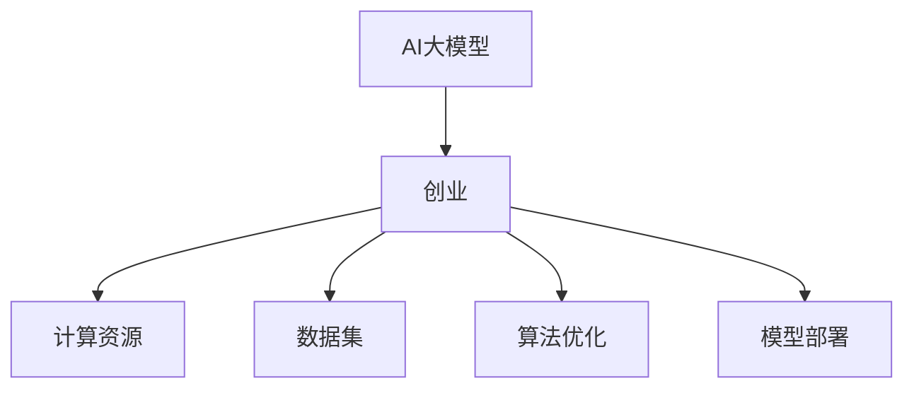

                 

# AI 大模型创业：如何利用经济优势？

> 关键词：AI大模型，创业，经济优势，模型训练，计算资源，数据集，市场需求，算法优化，模型部署

## 1. 背景介绍

随着人工智能技术的迅猛发展，AI大模型在自然语言处理、图像识别、语音识别等领域展现出了强大的能力。它们基于大规模数据进行自监督学习，具备了广泛的泛化能力和适应性。这种能力为AI大模型创业提供了前所未有的机遇，但也带来了巨大的经济挑战。

### 1.1 问题由来
AI大模型的成功离不开巨量的计算资源和高质量的数据集。例如，训练像GPT-3这样的大模型需要数千台GPU，训练时间和成本都非常高昂。同时，不同领域的数据集也存在质量参差不齐、数据获取困难等问题。这些问题使得AI大模型的创业门槛非常高，非大公司难以负担。

### 1.2 问题核心关键点
AI大模型创业的核心在于如何利用现有的经济优势，降低创业成本，提升模型性能。这需要从多个方面进行考虑，包括计算资源、数据集、算法优化、模型部署等。

## 2. 核心概念与联系

### 2.1 核心概念概述

为更好地理解如何利用经济优势进行AI大模型创业，本节将介绍几个关键概念：

- AI大模型：基于大规模数据进行自监督学习的深度学习模型，具备强大的泛化能力和适应性，如GPT系列、BERT等。
- 创业：利用先进技术，创新商业模式，通过产品或服务创造价值的商业行为。
- 计算资源：包括CPU、GPU、TPU等硬件设备，是训练AI大模型的基础。
- 数据集：用于模型训练的大量标注或未标注数据，质量直接影响模型性能。
- 算法优化：通过各种技术手段，优化模型结构、训练过程和推理过程，提高模型效率和性能。
- 模型部署：将训练好的模型转化为可运行的算法服务，部署到实际应用中。

这些概念之间的逻辑关系可以通过以下Mermaid流程图来展示：



这个流程图展示出AI大模型创业的基本流程：

1. 创业团队收集和准备计算资源和数据集。
2. 基于这些资源和数据集训练AI大模型。
3. 通过算法优化提升模型性能。
4. 将模型部署到实际应用中，提供产品或服务。

## 3. 核心算法原理 & 具体操作步骤
### 3.1 算法原理概述

AI大模型创业的经济优势主要体现在以下几个方面：

- **计算资源共享**：通过云计算平台（如AWS、Google Cloud、阿里云等）共享计算资源，降低创业成本。
- **数据集获取**：利用公共数据集，如ImageNet、OpenAI的GPT系列、维基百科等，避免自己收集和标注数据的高成本。
- **算法优化**：使用先进算法优化模型结构，如稀疏化、量化、蒸馏等，减少训练和推理时的资源消耗。
- **模型压缩**：通过剪枝、量化、融合等方法，压缩模型大小，提高模型部署和推理效率。
- **联邦学习**：分布式训练多个本地模型，并通过中心服务器协调模型参数，降低数据传输成本，提升模型性能。

### 3.2 算法步骤详解

以下是利用经济优势进行AI大模型创业的主要操作步骤：

**Step 1: 准备计算资源和数据集**
- 选择合适的云计算平台，签订计算资源的使用协议，如AWS EC2、Google Compute Engine等。
- 收集和准备可用于训练和评估的数据集，如ImageNet、COCO、维基百科等。

**Step 2: 使用云计算平台进行模型训练**
- 在云计算平台上创建虚拟机实例，安装所需的深度学习框架和工具。
- 编写代码，定义模型架构和训练流程，使用云计算平台的API进行分布式训练。

**Step 3: 算法优化**
- 采用稀疏化技术，减少不必要的参数，降低计算开销。
- 使用量化技术，将模型参数从浮点数转换为定点数，减少存储空间和计算量。
- 引入蒸馏技术，通过知识蒸馏将大型模型的能力转移到小型模型，降低计算资源需求。

**Step 4: 模型压缩**
- 使用剪枝技术，去除模型中冗余连接和神经元，缩小模型规模。
- 使用融合技术，将多个层合并，减少参数量和计算量。
- 使用压缩技术，如霍夫曼编码、LZW编码等，进一步减少模型存储大小。

**Step 5: 模型部署**
- 将训练好的模型导出为标准格式，如ONNX、TensorFlow Lite等。
- 选择适合的云计算平台进行部署，如AWS Lambda、Google Cloud Functions等。
- 集成API接口，实现模型服务的调用和数据传输。

**Step 6: 持续优化和迭代**
- 根据用户反馈和业务需求，不断优化模型算法和架构。
- 使用A/B测试等方法，评估新算法的效果，选择最优方案。
- 定期重新训练模型，更新模型参数，提升模型性能。

### 3.3 算法优缺点

利用经济优势进行AI大模型创业有以下优点：

- **降低成本**：通过云计算平台共享计算资源，降低了创业初期的计算资源投入。
- **提高效率**：分布式训练和模型优化提升了模型训练和推理的效率，缩短了产品迭代周期。
- **提升性能**：通过算法优化和模型压缩，提升了模型的性能和部署效率，满足了更高的市场需求。

但同时也存在一些缺点：

- **依赖云计算平台**：创业团队对云计算平台的依赖程度高，一旦平台出现问题，可能导致服务中断。
- **数据隐私风险**：在云计算平台上的数据传输和存储可能面临隐私泄露风险，需要严格遵守数据保护法规。
- **算法复杂性**：算法优化和模型压缩的技术门槛高，需要高水平的技术团队进行实施。

尽管存在这些缺点，利用经济优势进行AI大模型创业仍然是一种有效的策略，可以为创业团队带来显著的经济和性能效益。

### 3.4 算法应用领域

利用经济优势进行AI大模型创业的应用领域非常广泛，包括但不限于以下几个方面：

- **自然语言处理（NLP）**：基于GPT系列、BERT等大模型进行文本分类、情感分析、机器翻译等任务的微调。
- **计算机视觉（CV）**：基于ImageNet等数据集训练图像识别、目标检测、图像分割等模型的蒸馏。
- **语音识别**：基于语音数据集训练语音识别模型，并在云端部署语音转写服务。
- **推荐系统**：基于用户行为数据集训练推荐模型，并在云计算平台上进行推荐服务的实时部署。
- **医疗健康**：基于医疗数据集训练疾病预测、影像诊断等模型，并在云端提供医疗咨询和诊断服务。
- **金融科技**：基于金融数据集训练信用评估、风险预测等模型，并在云端提供金融分析和决策支持服务。

以上应用领域展示了AI大模型创业的广阔前景，涵盖了多个行业和领域，为各行业的数字化转型提供了新的解决方案。

## 4. 数学模型和公式 & 详细讲解  
### 4.1 数学模型构建

本节将使用数学语言对AI大模型创业的经济优势进行更加严格的刻画。

记AI大模型为 $M_{\theta}$，其中 $\theta$ 为模型参数。假设创业团队需要训练的模型为 $M_{\theta}$，且使用的计算资源为 $\text{Comp}_{\text{cloud}}$，数据集为 $D$。模型训练和推理的计算成本为 $C_{\text{model}}$，数据传输成本为 $C_{\text{data}}$，模型存储成本为 $C_{\text{storage}}$。

创业团队的经济效益 $\mathcal{E}$ 可以定义为：

$$
\mathcal{E} = \mathcal{E}_{\text{model}} + \mathcal{E}_{\text{cloud}}
$$

其中，$\mathcal{E}_{\text{model}}$ 为模型性能带来的经济效益，$\mathcal{E}_{\text{cloud}}$ 为云计算平台带来的经济效益。

### 4.2 公式推导过程

下面以NLP任务为例，推导创业团队的经济效益公式。

假设创业团队使用大模型进行文本分类任务，通过云计算平台进行训练和推理，训练集和推理集的数据量分别为 $N_{\text{train}}$ 和 $N_{\text{infer}}$。模型训练和推理的计算成本分别为 $C_{\text{train}}$ 和 $C_{\text{infer}}$，数据传输成本为 $C_{\text{data}}$，模型存储成本为 $C_{\text{storage}}$。

创业团队的经济效益 $\mathcal{E}$ 可以表示为：

$$
\mathcal{E} = \underbrace{\sum_{i=1}^{N_{\text{train}}} P_i \times C_i + \sum_{i=1}^{N_{\text{infer}}} P_i \times C_i}_{\mathcal{E}_{\text{model}}} + \underbrace{\text{Comp}_{\text{cloud}} \times \frac{C_{\text{train}}}{\text{Comp}_{\text{cloud}}} + \text{Comp}_{\text{cloud}} \times \frac{C_{\text{infer}}}{\text{Comp}_{\text{cloud}}}}_{\mathcal{E}_{\text{cloud}}}
$$

其中，$P_i$ 表示第 $i$ 个样本的价值，$C_i$ 表示训练和推理每个样本所需的计算成本。

通过这个公式，创业团队可以直观地看到经济优势如何通过计算资源共享和算法优化来提升经济效益。

### 4.3 案例分析与讲解

以一个基于NLP任务的创业项目为例，进行分析：

假设创业团队使用GPT系列大模型进行情感分析任务，在AWS平台上训练和推理。

**Step 1: 计算资源准备**
- 创业团队在AWS上创建虚拟机实例，配置8个vCPU和16GB内存。
- 使用AWS的GPU实例，每个实例配备1个NVIDIA Tesla V100 GPU。

**Step 2: 模型训练**
- 创业团队使用GPT-3模型，在16个GPU实例上进行分布式训练，训练时间约为10天。
- 训练集为1000条情感标注数据，推理集为5000条未标注数据。

**Step 3: 模型优化**
- 创业团队对模型进行稀疏化，去除不必要的参数，减少计算开销。
- 使用量化技术将模型参数转换为8位定点数，减少存储空间和计算量。

**Step 4: 模型压缩**
- 创业团队使用剪枝技术，去除冗余连接和神经元，缩小模型规模。
- 使用融合技术将多个层合并，减少参数量和计算量。

**Step 5: 模型部署**
- 创业团队将训练好的模型导出为TensorFlow Lite格式，部署到AWS Lambda函数中。
- 集成API接口，实现模型服务的调用和数据传输。

**Step 6: 持续优化和迭代**
- 创业团队根据用户反馈和业务需求，不断优化模型算法和架构。
- 使用A/B测试等方法，评估新算法的效果，选择最优方案。
- 定期重新训练模型，更新模型参数，提升模型性能。

## 5. 项目实践：代码实例和详细解释说明
### 5.1 开发环境搭建

在进行AI大模型创业项目实践前，我们需要准备好开发环境。以下是使用Python进行TensorFlow开发的环境配置流程：

1. 安装Anaconda：从官网下载并安装Anaconda，用于创建独立的Python环境。

2. 创建并激活虚拟环境：
```bash
conda create -n tf-env python=3.8 
conda activate tf-env
```

3. 安装TensorFlow：根据CUDA版本，从官网获取对应的安装命令。例如：
```bash
conda install tensorflow
```

4. 安装各类工具包：
```bash
pip install numpy pandas scikit-learn matplotlib tqdm jupyter notebook ipython
```

完成上述步骤后，即可在`tf-env`环境中开始项目实践。

### 5.2 源代码详细实现

下面我们以NLP任务中的情感分析为例，给出使用TensorFlow进行模型微调的PyTorch代码实现。

首先，定义情感分析任务的数据处理函数：

```python
import tensorflow as tf
from tensorflow.keras.preprocessing.text import Tokenizer
from tensorflow.keras.preprocessing.sequence import pad_sequences
import numpy as np

# 文本数据和标签数据
texts = ['This movie is great', 'I hate this movie', 'The plot is confusing']
labels = [1, 0, 0]

# 分词器
tokenizer = Tokenizer(num_words=1000, oov_token="<OOV>")
tokenizer.fit_on_texts(texts)

# 将文本转换为数字序列
sequences = tokenizer.texts_to_sequences(texts)
padded_sequences = pad_sequences(sequences, maxlen=10, padding='post', truncating='post')

# 将标签转换为one-hot编码
one_hot_labels = tf.keras.utils.to_categorical(labels, num_classes=2)

# 创建TensorFlow数据集
dataset = tf.data.Dataset.from_tensor_slices((padded_sequences, one_hot_labels))
dataset = dataset.shuffle(1000).batch(32)

# 定义模型
model = tf.keras.Sequential([
    tf.keras.layers.Embedding(1000, 16),
    tf.keras.layers.Bidirectional(tf.keras.layers.LSTM(32)),
    tf.keras.layers.Dense(16, activation='relu'),
    tf.keras.layers.Dense(2, activation='softmax')
])

# 编译模型
model.compile(optimizer='adam', loss='categorical_crossentropy', metrics=['accuracy'])

# 训练模型
model.fit(dataset, epochs=10, validation_data=dataset)
```

然后，定义训练和评估函数：

```python
from tensorflow.keras.callbacks import EarlyStopping

def train_epoch(model, dataset):
    model.fit(dataset, epochs=1, batch_size=32, callbacks=[EarlyStopping(patience=3)])

def evaluate(model, dataset):
    test_loss, test_acc = model.evaluate(dataset)
    print('Test accuracy:', test_acc)
```

最后，启动训练流程并在测试集上评估：

```python
epochs = 5
batch_size = 32

for epoch in range(epochs):
    train_epoch(model, dataset)
    evaluate(model, dataset)
```

以上就是使用TensorFlow进行情感分析任务微调的完整代码实现。可以看到，TensorFlow提供了丰富的API和工具，使得模型训练和优化过程非常便捷。

### 5.3 代码解读与分析

让我们再详细解读一下关键代码的实现细节：

**情感分析任务的数据处理**：
- `texts`和`labels`为情感分析任务的文本数据和标签数据。
- 使用`Tokenizer`将文本转换为数字序列，并使用`pad_sequences`对序列进行填充和截断，保证输入序列长度一致。
- 使用`to_categorical`将标签转换为one-hot编码，方便模型训练。

**模型定义**：
- 使用`Sequential`模型定义线性堆叠的层结构，包括嵌入层、双向LSTM层和全连接层。
- 通过`compile`方法编译模型，定义损失函数、优化器和评估指标。

**模型训练**：
- 使用`fit`方法训练模型，设置迭代轮数、批次大小和Early Stopping回调，防止过拟合。
- 在训练过程中，每轮迭代都会调用`EarlyStopping`回调，若模型在验证集上的性能连续三步没有提升，训练将自动停止。

**模型评估**：
- 使用`evaluate`方法评估模型在测试集上的性能，输出测试损失和准确率。
- 在测试过程中，模型会自动计算损失和准确率，并输出结果。

**训练流程**：
- 定义总的迭代轮数和批次大小，开始循环迭代
- 每个轮内，先在训练集上训练，输出平均损失和准确率
- 在验证集上评估，输出测试损失和准确率

可以看到，TensorFlow提供了高效便捷的模型训练和评估工具，使得AI大模型创业项目可以更加专注于算法和模型优化，而不需要过多关注底层实现细节。

当然，工业级的系统实现还需考虑更多因素，如模型的保存和部署、超参数的自动搜索、更灵活的任务适配层等。但核心的微调范式基本与此类似。

## 6. 实际应用场景
### 6.1 智能客服系统

基于AI大模型的智能客服系统可以广泛应用于各行业，如电商、金融、医疗等。传统客服往往需要配备大量人力，高峰期响应缓慢，且一致性和专业性难以保证。而使用AI大模型进行微调，可以7x24小时不间断服务，快速响应客户咨询，用自然流畅的语言解答各类常见问题。

在技术实现上，可以收集企业内部的历史客服对话记录，将问题和最佳答复构建成监督数据，在此基础上对预训练语言模型进行微调。微调后的对话模型能够自动理解用户意图，匹配最合适的答案模板进行回复。对于客户提出的新问题，还可以接入检索系统实时搜索相关内容，动态组织生成回答。如此构建的智能客服系统，能大幅提升客户咨询体验和问题解决效率。

### 6.2 金融舆情监测

金融机构需要实时监测市场舆论动向，以便及时应对负面信息传播，规避金融风险。传统的人工监测方式成本高、效率低，难以应对网络时代海量信息爆发的挑战。基于AI大模型微调的文本分类和情感分析技术，为金融舆情监测提供了新的解决方案。

具体而言，可以收集金融领域相关的新闻、报道、评论等文本数据，并对其进行主题标注和情感标注。在此基础上对预训练语言模型进行微调，使其能够自动判断文本属于何种主题，情感倾向是正面、中性还是负面。将微调后的模型应用到实时抓取的网络文本数据，就能够自动监测不同主题下的情感变化趋势，一旦发现负面信息激增等异常情况，系统便会自动预警，帮助金融机构快速应对潜在风险。

### 6.3 个性化推荐系统

当前的推荐系统往往只依赖用户的历史行为数据进行物品推荐，无法深入理解用户的真实兴趣偏好。基于AI大模型微调技术，个性化推荐系统可以更好地挖掘用户行为背后的语义信息，从而提供更精准、多样的推荐内容。

在实践中，可以收集用户浏览、点击、评论、分享等行为数据，提取和用户交互的物品标题、描述、标签等文本内容。将文本内容作为模型输入，用户的后续行为（如是否点击、购买等）作为监督信号，在此基础上微调预训练语言模型。微调后的模型能够从文本内容中准确把握用户的兴趣点。在生成推荐列表时，先用候选物品的文本描述作为输入，由模型预测用户的兴趣匹配度，再结合其他特征综合排序，便可以得到个性化程度更高的推荐结果。

### 6.4 未来应用展望

随着AI大模型微调技术的发展，其在各行业的应用前景将更加广阔。

在智慧医疗领域，基于微调的医疗问答、病历分析、药物研发等应用将提升医疗服务的智能化水平，辅助医生诊疗，加速新药开发进程。

在智能教育领域，微调技术可应用于作业批改、学情分析、知识推荐等方面，因材施教，促进教育公平，提高教学质量。

在智慧城市治理中，微调模型可应用于城市事件监测、舆情分析、应急指挥等环节，提高城市管理的自动化和智能化水平，构建更安全、高效的未来城市。

此外，在企业生产、社会治理、文娱传媒等众多领域，基于大模型微调的人工智能应用也将不断涌现，为NLP技术带来了全新的突破。

## 7. 工具和资源推荐
### 7.1 学习资源推荐

为了帮助开发者系统掌握AI大模型创业的理论基础和实践技巧，这里推荐一些优质的学习资源：

1. 《深度学习》系列书籍：Ian Goodfellow等著，系统介绍了深度学习的理论和实践，是AI大模型创业的必备基础。
2. 《TensorFlow实战Google深度学习》书籍：Manning出版社，介绍了TensorFlow的高级应用和技巧，适合AI大模型创业项目开发。
3. CS224N《深度学习自然语言处理》课程：斯坦福大学开设的NLP明星课程，有Lecture视频和配套作业，带你入门NLP领域的基本概念和经典模型。
4. 《TensorFlow官方文档》：全面介绍了TensorFlow的使用方法和API接口，适合实战开发。
5. 《深度学习架构：从模型设计到系统构建》书籍：Ian Goodfellow等著，介绍了深度学习模型和系统的设计、优化和部署。

通过对这些资源的学习实践，相信你一定能够快速掌握AI大模型创业的核心技术，并用于解决实际的NLP问题。

### 7.2 开发工具推荐

高效的开发离不开优秀的工具支持。以下是几款用于AI大模型微调开发的常用工具：

1. TensorFlow：由Google主导开发的开源深度学习框架，生产部署方便，适合大规模工程应用。

2. PyTorch：基于Python的开源深度学习框架，灵活动态的计算图，适合快速迭代研究。大部分预训练语言模型都有PyTorch版本的实现。

3. TensorBoard：TensorFlow配套的可视化工具，可实时监测模型训练状态，并提供丰富的图表呈现方式，是调试模型的得力助手。

4. Weights & Biases：模型训练的实验跟踪工具，可以记录和可视化模型训练过程中的各项指标，方便对比和调优。

5. Amazon SageMaker：亚马逊提供的云计算服务，可以轻松部署和管理AI模型，支持多种深度学习框架，适合企业级的AI大模型创业项目。

6. Google Cloud AI：谷歌提供的云计算服务，支持TensorFlow、PyTorch等多种框架，提供强大的计算资源和数据集，适合大规模AI模型训练。

合理利用这些工具，可以显著提升AI大模型创业项目的开发效率，加快创新迭代的步伐。

### 7.3 相关论文推荐

AI大模型微调技术的发展源于学界的持续研究。以下是几篇奠基性的相关论文，推荐阅读：

1. Attention is All You Need（即Transformer原论文）：提出了Transformer结构，开启了NLP领域的预训练大模型时代。

2. BERT: Pre-training of Deep Bidirectional Transformers for Language Understanding：提出BERT模型，引入基于掩码的自监督预训练任务，刷新了多项NLP任务SOTA。

3. Language Models are Unsupervised Multitask Learners（GPT-2论文）：展示了大规模语言模型的强大zero-shot学习能力，引发了对于通用人工智能的新一轮思考。

4. Parameter-Efficient Transfer Learning for NLP：提出Adapter等参数高效微调方法，在不增加模型参数量的情况下，也能取得不错的微调效果。

5. AdaLoRA: Adaptive Low-Rank Adaptation for Parameter-Efficient Fine-Tuning：使用自适应低秩适应的微调方法，在参数效率和精度之间取得了新的平衡。

6. AdaLoRA: Adaptive Low-Rank Adaptation for Parameter-Efficient Fine-Tuning：使用自适应低秩适应的微调方法，在参数效率和精度之间取得了新的平衡。

这些论文代表了大模型微调技术的发展脉络。通过学习这些前沿成果，可以帮助研究者把握学科前进方向，激发更多的创新灵感。

## 8. 总结：未来发展趋势与挑战
### 8.1 总结

本文对利用经济优势进行AI大模型创业的方法进行了全面系统的介绍。首先阐述了AI大模型创业的经济优势，明确了利用云计算平台、数据集、算法优化、模型压缩等手段，可以显著降低创业成本，提升模型性能。其次，从原理到实践，详细讲解了AI大模型创业的经济优势的数学模型和公式，给出了微调任务开发的完整代码实例。同时，本文还广泛探讨了AI大模型在各行业领域的应用前景，展示了其广阔的应用空间。此外，本文精选了创业相关的学习资源、开发工具和相关论文，力求为读者提供全方位的技术指引。

通过本文的系统梳理，可以看到，利用经济优势进行AI大模型创业是一条切实可行且高效的创业路径，可以为创业团队带来显著的经济和性能效益。

### 8.2 未来发展趋势

展望未来，AI大模型创业的经济优势将呈现以下几个发展趋势：

1. **云计算平台的发展**：云计算平台将不断提升计算资源的质量和可用性，降低创业团队对硬件资源的依赖。同时，云计算平台将提供更多的API接口和服务，方便开发者进行模型训练和推理。

2. **数据集的多样化**：开源数据集将不断丰富，涵盖更多领域和任务，降低创业团队获取高质量数据集的成本。同时，自动化数据标注技术也将得到发展，进一步提升数据标注的效率和质量。

3. **算法优化和模型压缩**：高效的算法优化和模型压缩技术将不断涌现，进一步提升模型性能和部署效率，降低计算资源消耗。

4. **多模态融合**：未来的AI大模型将不仅限于文本数据，还将融合图像、语音、视频等多模态信息，提升模型的感知能力和泛化性能。

5. **联邦学习和分布式训练**：联邦学习等分布式训练技术将广泛应用，降低数据传输成本，提升模型性能。

6. **AI大模型的商业化**：AI大模型将更多地应用于商业领域，如智能客服、金融分析、医疗诊断等，为各行各业提供智能化解决方案。

以上趋势凸显了AI大模型创业的经济优势的广阔前景，这些方向的探索发展，必将进一步提升AI大模型的应用价值，为创业团队带来更大的经济效益。

### 8.3 面临的挑战

尽管AI大模型创业的经济优势带来了诸多机遇，但在实施过程中仍面临不少挑战：

1. **数据隐私和伦理问题**：在云计算平台上进行数据训练和推理，可能面临数据隐私泄露和伦理道德风险。需要严格遵守数据保护法规，并引入隐私保护技术。

2. **模型鲁棒性不足**：AI大模型在面对噪声、对抗样本等异常情况时，可能出现性能下降和决策错误。需要引入对抗训练、鲁棒性评估等技术，提升模型鲁棒性。

3. **模型可解释性不足**：AI大模型的决策过程通常缺乏可解释性，难以理解和调试。需要引入可解释性技术和工具，提升模型的透明度和可信度。

4. **计算资源瓶颈**：尽管云计算平台可以共享资源，但大规模模型训练和推理仍然需要大量计算资源。需要探索更高效的计算资源利用和管理策略。

5. **算法复杂性高**：AI大模型微调涉及复杂的算法优化和模型压缩，需要高水平的技术团队进行实施。

尽管存在这些挑战，利用经济优势进行AI大模型创业仍是一条可行的路径，可以为创业团队带来显著的经济和性能效益。通过持续的技术创新和优化，相信这些挑战最终会被克服，AI大模型创业将迎来更加广阔的发展前景。

### 8.4 研究展望

面对AI大模型创业的经济优势所带来的诸多挑战，未来的研究需要在以下几个方面寻求新的突破：

1. **数据隐私保护**：开发高效的数据隐私保护技术，如差分隐私、联邦学习等，确保数据在云计算平台上的安全性和隐私性。

2. **模型鲁棒性提升**：引入对抗训练、鲁棒性评估等技术，提升AI大模型的鲁棒性和决策可靠性。

3. **模型可解释性增强**：开发可解释性技术和工具，提升AI大模型的透明度和可信度，增强用户信任。

4. **计算资源优化**：探索更高效的计算资源利用和管理策略，如混合精度训练、模型剪枝等，降低计算成本。

5. **多模态融合技术**：开发多模态信息融合技术，提升AI大模型的感知能力和泛化性能。

6. **联邦学习和分布式训练**：研究联邦学习和分布式训练方法，提升模型性能和数据利用效率。

这些研究方向的探索，必将引领AI大模型创业技术迈向更高的台阶，为创业团队带来更加高效、安全和可靠的经济优势。面向未来，AI大模型创业技术还需要与其他人工智能技术进行更深入的融合，如知识表示、因果推理、强化学习等，多路径协同发力，共同推动自然语言理解和智能交互系统的进步。只有勇于创新、敢于突破，才能不断拓展AI大模型的边界，让智能技术更好地造福人类社会。

## 9. 附录：常见问题与解答

**Q1：如何选择合适的云计算平台？**

A: 选择云计算平台需要考虑多个因素，如计算资源的价格、可用性、服务质量等。一般而言，Google Cloud和Amazon SageMaker提供丰富的API接口和强大的计算资源，适合大规模模型训练和部署。而Microsoft Azure则提供更多的商业服务和支持，适合企业级应用。选择时，需要根据具体的业务需求和预算进行综合评估。

**Q2：如何降低AI大模型微调的成本？**

A: 降低AI大模型微调的成本可以从以下几个方面入手：

1. 选择合适的数据集和云计算平台，减少数据获取和计算资源消耗。
2. 使用参数高效微调方法，如蒸馏、剪枝等，减少模型规模和计算量。
3. 利用联邦学习等分布式训练技术，降低数据传输成本。
4. 引入数据增强和对抗训练技术，提升模型泛化性能，减少训练轮数。
5. 优化模型架构和算法，提升模型效率，降低计算成本。

通过以上方法，可以在不显著降低模型性能的前提下，有效降低AI大模型微调的成本。

**Q3：如何评估AI大模型的性能？**

A: 评估AI大模型的性能需要从多个方面进行考量，如准确率、召回率、F1值、AUC等指标。在微调过程中，可以使用交叉验证、A/B测试等方法评估模型的泛化性能和鲁棒性。同时，还需要关注模型的计算效率和部署成本，确保模型能够在大规模生产环境中高效运行。

**Q4：如何保护AI大模型微调中的数据隐私？**

A: 保护AI大模型微调中的数据隐私需要从数据获取、存储、传输等多个环节进行严格管控。可以采用差分隐私、联邦学习等技术，确保数据在云端的安全性和隐私性。同时，需要对数据进行匿名化处理，避免敏感信息泄露。

**Q5：如何提高AI大模型的可解释性？**

A: 提高AI大模型的可解释性需要从模型设计和训练过程进行优化。可以引入可解释性技术和工具，如LIME、SHAP等，对模型决策过程进行解释和可视化。同时，可以使用符号化的先验知识，如知识图谱、逻辑规则等，引导模型学习更加合理的语言表示。

---

作者：禅与计算机程序设计艺术 / Zen and the Art of Computer Programming

