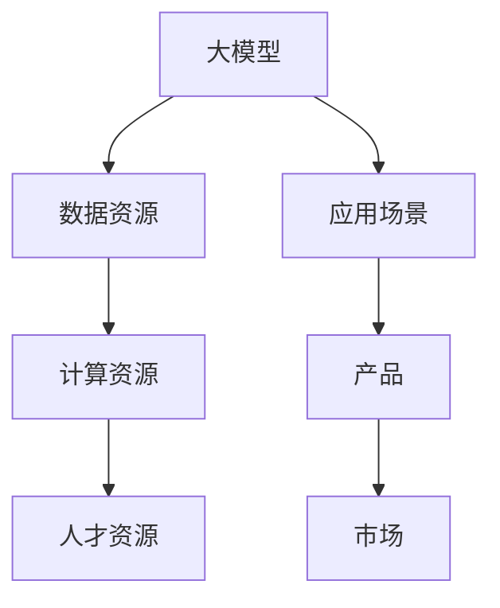

                 

## 1. 背景介绍

### 1.1 问题由来
随着人工智能技术的不断进步，大模型在商业应用中扮演着越来越重要的角色。大模型的应用，如语音识别、图像识别、自然语言处理等，正在改变着各行各业的生产方式和服务模式。与此同时，各大公司纷纷加大在人工智能领域的投入，推动AI大模型创业热潮的兴起。

AI大模型的创业面临着诸多挑战，如数据、计算资源、人才的获取和使用，以及如何将大模型应用到具体业务场景中。如何有效利用这些资源，将大模型的优势转化为公司的核心竞争力，成为创业者和投资者的主要考量。

### 1.2 问题核心关键点
针对AI大模型创业中的资源利用问题，本文将详细介绍如何有效地利用大模型所拥有的计算资源、数据资源以及人才资源，并结合实际案例分析，阐述资源优势如何转化为公司竞争优势。

## 2. 核心概念与联系

### 2.1 核心概念概述

#### 大模型
大模型指的是参数量达到数十亿甚至数百亿的神经网络模型。这些模型通常采用深度学习技术，如卷积神经网络（CNN）、循环神经网络（RNN）、Transformer等，通过大规模的数据进行训练，具备强大的学习和推理能力。大模型能够处理复杂的任务，如自然语言处理、计算机视觉、语音识别等。

#### 数据资源
数据资源是训练大模型的重要基础。数据资源的质量和规模直接影响到模型的性能和应用效果。高质量的数据能够帮助模型更好地学习，而大规模的数据则能够提高模型的泛化能力。

#### 计算资源
计算资源是训练和运行大模型的关键。大模型的训练和推理需要大量的计算资源，包括CPU、GPU、TPU等硬件设备，以及相应的软件环境，如深度学习框架（如TensorFlow、PyTorch）等。

#### 人才资源
人才资源是利用大模型进行创业的核心。具备深度学习、数据科学、工程开发等技能的人才，能够有效管理和优化资源，推动模型的开发和应用。

### 2.2 核心概念原理和架构的 Mermaid 流程图



这个流程图展示了大模型与数据资源、计算资源和人才资源之间的相互关系。大模型通过数据资源进行训练，借助计算资源进行推理，并由人才资源进行开发和管理。最终，这些资源在大模型的应用场景中发挥作用，形成产品并服务于市场。

## 3. 核心算法原理 & 具体操作步骤

### 3.1 算法原理概述

AI大模型的核心算法原理主要包括深度学习、卷积神经网络（CNN）、循环神经网络（RNN）和Transformer等。其中，Transformer模型由于其高效的并行计算能力和良好的泛化性能，在自然语言处理等领域表现优异。

### 3.2 算法步骤详解

#### 步骤一：数据收集与预处理
数据收集和预处理是大模型训练的第一步。通过数据收集和预处理，获取高质量的数据资源。

1. 数据收集：通过网络爬虫、数据采集API等手段，从公开的数据源（如ImageNet、COCO、维基百科等）或私有数据源（如公司内部数据、公开数据等）获取数据。
2. 数据预处理：对收集到的数据进行清洗、标注、分词、去重等预处理操作，确保数据的质量和可用性。

#### 步骤二：模型训练
模型训练是利用计算资源对大模型进行训练的过程。训练过程中，选择合适的训练方法、优化算法和超参数，以提高模型的性能。

1. 选择训练方法：如监督学习、无监督学习、半监督学习等。
2. 选择优化算法：如随机梯度下降（SGD）、Adam、Adagrad等。
3. 设置超参数：如学习率、批次大小、迭代轮数等。

#### 步骤三：模型评估与优化
模型评估与优化是训练后的关键步骤，通过评估和优化提高模型性能。

1. 模型评估：在验证集和测试集上进行评估，使用合适的指标（如准确率、精确率、召回率等）评估模型性能。
2. 模型优化：根据评估结果，调整超参数、增加训练数据量或使用正则化技术等，进一步优化模型性能。

#### 步骤四：模型应用与部署
模型应用与部署是将模型应用到实际业务中的过程。

1. 模型应用：将训练好的模型应用到具体的业务场景中，如自然语言处理、计算机视觉等。
2. 模型部署：将模型部署到服务器、云平台或移动设备等环境中，实现实时推理和应用。

### 3.3 算法优缺点

#### 优点
1. 数据资源丰富：大模型可以利用大规模的数据资源，提高模型的泛化能力和性能。
2. 计算资源高效：通过并行计算和分布式训练，大模型能够在较短时间内完成训练，提高模型训练效率。
3. 人才资源多样化：吸引和培养具备深度学习和工程开发能力的人才，提高公司竞争力。

#### 缺点
1. 资源占用大：大模型需要大量的计算资源和存储空间，对硬件设备要求高。
2. 模型训练时间长：大模型训练时间较长，需要投入大量时间和人力。
3. 应用场景有限：大模型的应用场景主要集中在自然语言处理、计算机视觉等少数领域，应用范围有限。

### 3.4 算法应用领域

大模型在自然语言处理、计算机视觉、语音识别等领域有着广泛的应用，如：

- 自然语言处理：文本分类、情感分析、机器翻译、问答系统等。
- 计算机视觉：图像识别、物体检测、图像生成等。
- 语音识别：语音合成、语音识别、说话人识别等。

## 4. 数学模型和公式 & 详细讲解 & 举例说明

### 4.1 数学模型构建

假设有一个大模型 $M$，采用Transformer结构，输入为 $x$，输出为 $y$。模型训练的过程可以表示为：

$$
y = M(x)
$$

其中，$M(x)$ 表示大模型的前向传播过程，$y$ 表示模型的输出。

### 4.2 公式推导过程

以自然语言处理中的文本分类任务为例，模型的训练过程可以表示为：

$$
\min_{\theta} \sum_{i=1}^N \ell(y_i, M_{\theta}(x_i))
$$

其中，$N$ 表示训练样本的数量，$\ell$ 表示损失函数，$\theta$ 表示模型参数。

### 4.3 案例分析与讲解

以ImageNet数据集上的图像分类任务为例，模型的训练过程可以表示为：

1. 数据收集：从ImageNet获取大规模图像数据集。
2. 数据预处理：对图像数据进行归一化、去噪、标注等预处理操作。
3. 模型训练：使用卷积神经网络（CNN）对图像数据进行训练，优化超参数，如学习率、批次大小等。
4. 模型评估：在验证集和测试集上评估模型性能，选择最佳模型进行应用。

## 5. 项目实践：代码实例和详细解释说明

### 5.1 开发环境搭建

1. 安装Python：Python是深度学习开发的基础，需要确保版本稳定。
2. 安装深度学习框架：如TensorFlow、PyTorch等，建议使用GPU版本的框架。
3. 安装数据处理工具：如Pandas、NumPy等，用于数据预处理和处理。
4. 安装分布式计算工具：如Horovod、PySpark等，用于分布式训练。

### 5.2 源代码详细实现

以自然语言处理中的文本分类任务为例，使用PyTorch框架进行实现：

```python
import torch
import torch.nn as nn
import torch.optim as optim

# 定义模型结构
class TransformerModel(nn.Module):
    def __init__(self, input_dim, output_dim):
        super(TransformerModel, self).__init__()
        self.encoder = nn.Transformer(input_dim, output_dim)
        self.decoder = nn.Transformer(output_dim, output_dim)

    def forward(self, x):
        x = self.encoder(x)
        x = self.decoder(x)
        return x

# 训练模型
model = TransformerModel(input_dim, output_dim)
optimizer = optim.Adam(model.parameters(), lr=0.001)
criterion = nn.CrossEntropyLoss()

for epoch in range(epochs):
    for i, (inputs, labels) in enumerate(train_loader):
        optimizer.zero_grad()
        outputs = model(inputs)
        loss = criterion(outputs, labels)
        loss.backward()
        optimizer.step()
```

### 5.3 代码解读与分析

以上代码展示了Transformer模型在文本分类任务中的训练过程。首先，定义了Transformer模型的结构，包括编码器和解码器。然后，定义了优化器和损失函数。在训练过程中，通过前向传播计算输出，计算损失，反向传播更新参数，完成一个epoch的训练。

### 5.4 运行结果展示

训练过程中，可以使用PyTorch的DataLoader将数据集分成多个批次进行训练，并在验证集和测试集上评估模型性能。

## 6. 实际应用场景

### 6.1 智能客服

智能客服是大模型在自然语言处理领域的重要应用场景。通过微调大模型，使其能够处理用户咨询、自动回答、多轮对话等任务，提高客服效率和客户满意度。

### 6.2 医疗诊断

医疗诊断是大模型在计算机视觉和自然语言处理领域的应用。通过微调大模型，使其能够分析医学影像、病历数据等，提供智能诊断和辅助决策支持，提高医疗服务的质量和效率。

### 6.3 金融风控

金融风控是大模型在自然语言处理和数据挖掘领域的应用。通过微调大模型，使其能够分析金融文本、客户行为等数据，识别欺诈风险、评估信用等级等，提高金融服务的风险控制能力。

## 7. 工具和资源推荐

### 7.1 学习资源推荐

1. Coursera深度学习课程：由斯坦福大学和斯坦福在线课程中心联合开设的深度学习课程，涵盖深度学习的基本概念和算法。
2. Udacity深度学习纳米学位课程：由Udacity开设的深度学习课程，涵盖深度学习框架、模型训练、优化算法等内容。
3. TensorFlow官方文档：TensorFlow官方提供的深度学习框架文档，包含丰富的示例和案例。
4. PyTorch官方文档：PyTorch官方提供的深度学习框架文档，涵盖深度学习模型、优化算法等内容。
5. Hugging Face Transformers库：Hugging Face推出的NLP工具库，包含多种预训练模型和微调示例。

### 7.2 开发工具推荐

1. Jupyter Notebook：一款轻量级的交互式开发环境，适合进行模型训练和评估。
2. Visual Studio Code：一款集成了Git、调试和代码补全功能的开发工具，适合进行模型开发和调试。
3. Docker：一款轻量级的容器技术，适合进行模型的分布式训练和部署。
4. Amazon SageMaker：亚马逊推出的云服务，适合进行模型的分布式训练和部署。
5. Google Cloud AI Platform：谷歌推出的云服务，适合进行模型的分布式训练和部署。

### 7.3 相关论文推荐

1. Attention is All You Need：Transformer模型的原论文，提出了Transformer结构，开启了大模型时代。
2. BERT: Pre-training of Deep Bidirectional Transformers for Language Understanding：提出了BERT模型，通过预训练和微调，提高了自然语言处理的性能。
3. ImageNet Large Scale Visual Recognition Challenge：介绍了ImageNet数据集，展示了大规模数据训练大模型的效果。
4. Microsoft COCO Dataset for Object Detection, Segmentation and Captioning：介绍了COCO数据集，展示了大规模数据训练计算机视觉模型的效果。
5. AlphaGo Zero：介绍了AlphaGo Zero算法，展示了大模型在计算机视觉和游戏领域的应用。

## 8. 总结：未来发展趋势与挑战

### 8.1 研究成果总结

AI大模型的创业面临着诸多挑战，但通过有效利用数据资源、计算资源和人才资源，大模型能够充分发挥其优势，推动业务创新和技术进步。

### 8.2 未来发展趋势

1. 数据资源的多样化：随着数据的不断积累，数据资源将更加多样化，涵盖更多领域和场景。
2. 计算资源的高效化：计算资源将进一步优化，提升大模型的训练和推理效率。
3. 人才资源的智能化：具备深度学习和工程开发能力的人才将成为稀缺资源，需要更加智能化的培养和管理。

### 8.3 面临的挑战

1. 数据资源获取：大模型需要大量的高质量数据资源，如何获取和利用这些资源成为主要挑战。
2. 计算资源消耗：大模型的训练和推理需要大量的计算资源，如何高效利用这些资源成为主要挑战。
3. 人才资源培养：大模型的应用需要具备深度学习和工程开发能力的人才，如何培养和吸引这些人才成为主要挑战。

### 8.4 研究展望

未来，AI大模型的创业将更加注重数据资源和计算资源的利用效率，同时加强人才资源的培养和管理，推动AI技术在各行各业的应用和发展。

## 9. 附录：常见问题与解答

**Q1: 如何获取高质量的数据资源？**

A: 高质量的数据资源可以通过以下方式获取：
1. 公开数据集：如ImageNet、COCO、维基百科等。
2. 数据采集API：通过网络爬虫、数据采集API等手段，从公开或私有数据源获取数据。
3. 数据共享平台：如Kaggle、UCI等，获取开源数据集。

**Q2: 如何高效利用计算资源？**

A: 高效利用计算资源可以通过以下方式：
1. 分布式计算：使用Horovod、PySpark等分布式计算工具，进行分布式训练。
2. 模型优化：使用模型压缩、稀疏化存储等方法，优化模型的存储空间和计算速度。
3. 硬件优化：使用GPU、TPU等高性能硬件设备，提高计算效率。

**Q3: 如何培养具备深度学习和工程开发能力的人才？**

A: 培养具备深度学习和工程开发能力的人才可以通过以下方式：
1. 教育培训：通过深度学习课程、在线学习平台等途径，培养具备深度学习基础知识的人才。
2. 实习招聘：通过招聘和实习等形式，吸引具备深度学习和工程开发能力的人才。
3. 项目实践：通过实际项目实践，提升人才的技能和经验。

**Q4: 大模型在具体应用中需要注意哪些问题？**

A: 大模型在具体应用中需要注意以下问题：
1. 数据质量：确保数据的准确性和可用性，避免因数据质量问题影响模型性能。
2. 计算资源：根据计算资源的限制，优化模型结构和训练参数，避免因计算资源不足影响训练效果。
3. 应用场景：根据具体应用场景，选择合适的模型和训练方法，避免因模型选择不当影响应用效果。

**Q5: 如何评估和优化大模型的性能？**

A: 评估和优化大模型的性能可以通过以下方式：
1. 模型评估：在验证集和测试集上评估模型性能，使用合适的指标（如准确率、精确率、召回率等）评估模型性能。
2. 模型优化：根据评估结果，调整超参数、增加训练数据量或使用正则化技术等，进一步优化模型性能。
3. 数据增强：通过数据增强等方法，提升模型的泛化能力和鲁棒性。

---

作者：禅与计算机程序设计艺术 / Zen and the Art of Computer Programming

