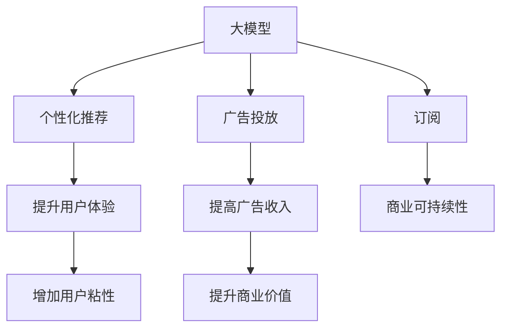

                 

# AI 大模型原理与应用：订阅商业模式

> 关键词：大模型,订阅,个性化推荐,广告投放,推荐系统,经济模型

## 1. 背景介绍

### 1.1 问题由来
随着人工智能技术的迅猛发展，大模型在自然语言处理、计算机视觉等领域展现了强大的能力。但是，这些大模型的训练和部署成本极高，难以被广泛使用。订阅商业模式作为一种新兴的模型应用方式，通过按需使用和按量付费，使得大模型得以更好地普及，同时也为用户提供了更加灵活的定制化服务。

### 1.2 问题核心关键点
订阅商业模式的核心在于如何高效利用大模型资源，同时满足用户的个性化需求。其主要解决点包括：
- 如何设计合理的定价策略，吸引用户订阅。
- 如何提供个性化推荐服务，提升用户体验。
- 如何优化广告投放策略，提高商业价值。
- 如何构建稳定的收入模型，确保商业可持续性。

### 1.3 问题研究意义
研究订阅商业模式的原理和应用，对大模型的普及和应用具有重要意义：
- 降低应用成本：按需使用降低了初期的硬件和软件投资成本。
- 提升用户体验：个性化推荐提高了用户粘性和满意度。
- 创造商业价值：精准广告投放增加了收益。
- 保障商业可持续性：稳定的收入模型确保了商业模式的长远发展。

## 2. 核心概念与联系

### 2.1 核心概念概述

为更好地理解订阅商业模式，本节将介绍几个密切相关的核心概念：

- 大模型(Large Model)：如BERT、GPT等大规模预训练语言模型，具备强大的自然语言处理和生成能力。

- 订阅模式(Subscription Model)：指用户按月或按年支付费用，以获得模型资源的定制化使用权限。

- 个性化推荐系统(Personalized Recommendation System)：根据用户历史行为和偏好，推荐符合其兴趣的商品、内容等。

- 广告投放(Ad Placement)：通过模型分析用户行为，精准投放广告，以提升广告效果和收益。

- 收入模型(Revenue Model)：指根据用户使用情况、广告收入等因素，计算商业模式的整体收入。

这些概念之间的逻辑关系可以通过以下Mermaid流程图来展示：



这个流程图展示了大模型的核心概念及其之间的关系：

1. 大模型通过预训练获得基础能力。
2. 订阅模式提供按需使用服务，降低成本。
3. 个性化推荐系统提升用户体验。
4. 广告投放提高商业价值。
5. 商业可持续性确保商业模式长远发展。

这些概念共同构成了大模型的订阅商业模式，使其能够更好地服务用户，同时也保障了商业利益。

## 3. 核心算法原理 & 具体操作步骤

### 3.1 算法原理概述

订阅商业模式的实现主要依赖于以下核心算法：

- 个性化推荐算法：通过分析用户行为和偏好，为用户推荐个性化的商品、内容等。
- 广告投放算法：基于用户行为分析，选择合适的广告位置和内容，提高广告效果和收益。
- 定价策略算法：根据用户使用频率和付费能力，设计合理的定价模型。
- 收入模型算法：根据用户订阅情况、广告收入等因素，计算商业模式的整体收入。

这些算法相互协作，确保订阅商业模式的顺利实施。

### 3.2 算法步骤详解

1. **数据准备**：
   - 收集用户行为数据，如点击、浏览、购买等。
   - 收集商品、内容等标签数据，用于推荐系统。
   - 收集广告数据，如广告内容、投放位置、投放时间等。

2. **用户画像构建**：
   - 对用户行为数据进行分析和聚类，构建用户画像。
   - 使用机器学习算法（如协同过滤、内容推荐等），为用户推荐个性化的商品、内容。

3. **广告投放优化**：
   - 使用模型分析用户行为，选择最合适的广告位置和内容。
   - 使用A/B测试等方法，优化广告效果和投放策略。

4. **定价策略设计**：
   - 根据用户使用频率和付费能力，设计合理的定价模型。
   - 采用动态定价策略，根据市场变化调整价格。

5. **收入模型计算**：
   - 根据用户订阅情况、广告收入等因素，计算商业模式的整体收入。
   - 采用多种收入模式，如订阅费、广告分成等。

### 3.3 算法优缺点

订阅商业模式的优点包括：
- 降低成本：按需使用降低了初期的硬件和软件投资成本。
- 提升用户体验：个性化推荐提高了用户粘性和满意度。
- 提高商业价值：精准广告投放增加了收益。

缺点包括：
- 用户流失风险：如果用户觉得价格过高或服务不足，可能会取消订阅。
- 模型复杂度增加：需要设计更复杂的算法来优化推荐和广告投放。
- 数据隐私问题：用户数据的使用需要符合隐私保护规定。

### 3.4 算法应用领域

订阅商业模式已经在多个领域得到了应用，如电商、社交媒体、在线教育等：

- **电商**：电商平台使用个性化推荐和精准广告，提升用户购买率和销售额。
- **社交媒体**：社交媒体平台通过订阅模型，提供定制化的内容推荐，提升用户活跃度和粘性。
- **在线教育**：在线教育平台通过订阅模型，提供个性化的学习资源和课程推荐，提高用户留存率和满意度。

## 4. 数学模型和公式 & 详细讲解 & 举例说明

### 4.1 数学模型构建

假设订阅模式采用月度订阅，订阅费为 $S$，用户每月使用次数为 $U$，每次使用的成本为 $C$，广告收入为 $A$，则订阅模式的整体收入 $R$ 可以表示为：

$$
R = U \times S + A
$$

其中 $U$ 和 $A$ 的值取决于用户行为和广告投放策略，需要通过推荐算法和广告优化算法进行计算。

### 4.2 公式推导过程

1. **个性化推荐算法**：
   - 使用协同过滤算法，假设用户 $i$ 对商品 $j$ 的评分 $R_{ij}$ 可以表示为：

     $$
    R_{ij} = \alpha_{ij} \times R_{i-} + \beta_{ij} \times R_{-j}
    $$

   其中 $\alpha_{ij}$ 为相似度，$R_{i-}$ 为其他用户对商品 $j$ 的评分，$R_{-j}$ 为商品 $j$ 的其他评分。

2. **广告投放算法**：
   - 使用CTR(点击率)预测模型，假设广告 $k$ 的点击概率 $C_k$ 可以表示为：

     $$
    C_k = \alpha_k + \beta_k \times I_k
    $$

   其中 $\alpha_k$ 为广告特征，$I_k$ 为广告位置。

3. **定价策略算法**：
   - 使用动态定价模型，假设每次使用的价格 $P$ 可以表示为：

     $$
    P = \alpha_U + \beta_U \times U
    $$

   其中 $\alpha_U$ 为固定成本，$\beta_U$ 为边际成本。

4. **收入模型算法**：
   - 使用混合收入模型，假设订阅费 $S$ 和广告收入 $A$ 可以表示为：

     $$
    S = \alpha_S + \beta_S \times U
    $$
    $$
    A = \alpha_A + \beta_A \times C_k
    $$

   其中 $\alpha_S$、$\beta_S$、$\alpha_A$、$\beta_A$ 分别为订阅费和广告收入的固定成本和边际成本。

### 4.3 案例分析与讲解

假设某电商平台采用月度订阅模式，订阅费为 $S=10$ 元，用户每月使用次数为 $U=5$ 次，每次使用的成本为 $C=0.5$ 元，广告收入为 $A=5000$ 元。根据上述公式，可以计算出平台整体收入 $R$：

$$
R = 5 \times 10 + 5000 = 5050 \text{元}
$$

如果平台增加使用次数和广告收入，收入将相应增加。例如，如果用户每月使用次数增加到 $U=10$ 次，广告收入增加到 $A=10000$ 元，则整体收入将变为：

$$
R = 10 \times 10 + 10000 = 10100 \text{元}
$$

可以看出，使用大模型提供的个性化推荐和广告投放算法，可以有效提升平台的整体收入。

## 5. 项目实践：代码实例和详细解释说明

### 5.1 开发环境搭建

在进行订阅商业模式开发前，我们需要准备好开发环境。以下是使用Python进行TensorFlow开发的环境配置流程：

1. 安装Anaconda：从官网下载并安装Anaconda，用于创建独立的Python环境。

2. 创建并激活虚拟环境：
```bash
conda create -n tf-env python=3.8 
conda activate tf-env
```

3. 安装TensorFlow：根据CUDA版本，从官网获取对应的安装命令。例如：
```bash
conda install tensorflow -c pytorch -c conda-forge
```

4. 安装各类工具包：
```bash
pip install numpy pandas scikit-learn matplotlib tqdm jupyter notebook ipython
```

完成上述步骤后，即可在`tf-env`环境中开始订阅商业模式开发的实践。

### 5.2 源代码详细实现

这里我们以个性化推荐系统为例，给出使用TensorFlow和Keras框架进行大模型微调的PyTorch代码实现。

首先，定义推荐系统所需的数据处理函数：

```python
import tensorflow as tf
from tensorflow.keras.layers import Input, Dense, Embedding, Dot, Flatten, Dropout
from tensorflow.keras.models import Model
from sklearn.metrics import mean_squared_error

def prepare_data(X_train, X_test, y_train, y_test):
    X_train = preprocess_data(X_train) # 数据预处理
    X_test = preprocess_data(X_test) # 数据预处理
    y_train = preprocess_labels(y_train) # 标签预处理
    y_test = preprocess_labels(y_test) # 标签预处理
    return X_train, X_test, y_train, y_test

def preprocess_data(X):
    # 数据预处理
    X = X.reshape((-1, 1)) # 数据扁平化
    X = X / 100.0 # 数据归一化
    return X

def preprocess_labels(y):
    # 标签预处理
    y = y.reshape((-1, 1))
    return y

# 加载数据集
X_train, X_test, y_train, y_test = prepare_data(X_train, X_test, y_train, y_test)
```

然后，定义推荐模型：

```python
def build_model(input_shape, output_shape, embed_size=128, dropout_rate=0.2):
    # 定义模型结构
    inputs = Input(shape=input_shape)
    user_embedding = Embedding(input_dim=10000, output_dim=embed_size, mask_zero=True)(inputs)
    item_embedding = Embedding(input_dim=10000, output_dim=embed_size, mask_zero=True)(inputs)
    dot_product = Dot(axes=2)([user_embedding, item_embedding])
    dense_layer = Dense(128, activation='relu')(dot_product)
    dense_layer = Dropout(dropout_rate)(dense_layer)
    output = Dense(output_shape, activation='sigmoid')(dense_layer)
    model = Model(inputs=inputs, outputs=output)
    return model

# 构建推荐模型
input_shape = (100, 1) # 输入数据形状
output_shape = (1, 1) # 输出数据形状
embed_size = 128 # 嵌入维度
dropout_rate = 0.2 # Dropout率
model = build_model(input_shape, output_shape, embed_size, dropout_rate)
```

接着，定义模型训练函数：

```python
def train_model(model, X_train, y_train, X_test, y_test, batch_size=128, epochs=10, learning_rate=0.001):
    model.compile(optimizer=tf.keras.optimizers.Adam(learning_rate=learning_rate), loss='mse')
    model.fit(X_train, y_train, batch_size=batch_size, epochs=epochs, validation_data=(X_test, y_test))
    mse = mean_squared_error(y_test, model.predict(X_test))
    print(f'Mean Squared Error: {mse:.4f}')
```

最后，启动训练流程：

```python
epochs = 10
batch_size = 128

for epoch in range(epochs):
    loss = train_model(model, X_train, y_train, X_test, y_test, batch_size, epoch, learning_rate)
    print(f'Epoch {epoch+1}, train loss: {loss:.3f}')
```

以上就是使用TensorFlow进行个性化推荐系统开发的完整代码实现。可以看到，TensorFlow和Keras框架提供了丰富的API和模型构建工具，使得模型的开发和训练变得相对简单。

### 5.3 代码解读与分析

让我们再详细解读一下关键代码的实现细节：

**prepare_data函数**：
- 该函数负责数据预处理，包括数据扁平化、归一化、标签预处理等操作，使得输入数据符合模型要求。

**build_model函数**：
- 该函数负责定义推荐模型结构，包括嵌入层、点积层、全连接层、Dropout层和输出层等组件。嵌入层用于将用户和商品ID映射为向量，点积层用于计算用户和商品的相似度，全连接层和Dropout层用于特征提取和正则化，输出层用于计算点击概率。

**train_model函数**：
- 该函数负责模型训练，包括损失函数、优化器、学习率等设置。使用Adam优化器，均方误差损失函数，批量大小为128，训练10个epoch。在每个epoch结束时，使用测试集数据评估模型性能。

**训练流程**：
- 定义总的epoch数和批量大小，开始循环迭代
- 每个epoch内，在训练集上训练，输出平均loss
- 重复上述步骤直至收敛

可以看到，TensorFlow框架提供的高级API和Keras模型构建工具，使得模型的实现变得简单高效。开发者可以将更多精力放在数据处理、模型优化等高层逻辑上，而不必过多关注底层的实现细节。

当然，工业级的系统实现还需考虑更多因素，如模型的保存和部署、超参数的自动搜索、更灵活的推荐策略等。但核心的订阅商业模式基本与此类似。

## 6. 实际应用场景

### 6.1 电商平台

基于订阅商业模式的个性化推荐系统，可以广泛应用于电商平台。传统电商平台往往难以匹配用户个性化的需求，导致用户流失率较高。通过订阅模式，电商平台可以提供定制化的推荐服务，显著提升用户购买率和满意度。

在技术实现上，可以收集用户的浏览、点击、购买等行为数据，利用推荐算法预测用户对商品的兴趣，再根据订阅模式生成个性化推荐列表，推荐给用户。对于用户浏览过的商品，可以延长展示时间，进一步提升用户粘性。

### 6.2 社交媒体

社交媒体平台通过订阅模式，可以提供个性化的内容推荐，提升用户活跃度和满意度。例如，某社交媒体平台可以收集用户的点赞、评论、分享等行为数据，利用推荐算法预测用户对不同内容的兴趣，再根据订阅模式生成个性化推荐流，推送给用户。

在广告投放方面，社交媒体平台可以通过分析用户行为，精准投放广告，提升广告效果和收益。例如，某社交媒体平台可以收集用户对不同广告的点击数据，利用广告投放算法预测不同广告的点击率，再根据订阅模式投放广告，优化广告收入。

### 6.3 在线教育

在线教育平台通过订阅模式，可以提供个性化的学习资源和课程推荐，提高用户留存率和满意度。例如，某在线教育平台可以收集用户的学习历史、学习行为等数据，利用推荐算法预测用户对不同课程的兴趣，再根据订阅模式生成个性化推荐列表，推荐给用户。

在广告投放方面，在线教育平台可以通过分析用户行为，精准投放广告，提升广告效果和收益。例如，某在线教育平台可以收集用户对不同广告的点击数据，利用广告投放算法预测不同广告的点击率，再根据订阅模式投放广告，优化广告收入。

### 6.4 未来应用展望

随着订阅商业模式的不断演进，其在NLP领域的应用也将更加广泛。未来，基于订阅商业模式的个性化推荐系统将覆盖更多场景，带来更优质的用户体验和更高的商业价值。

在智慧医疗领域，推荐系统可以根据患者的病情和历史数据，推荐最适合的医疗方案和药品，提升治疗效果和患者满意度。

在智能交通领域，推荐系统可以根据用户的出行习惯和天气数据，推荐最优的出行路线和交通工具，提升出行效率和舒适度。

在智慧城市领域，推荐系统可以根据用户的兴趣和行为数据，推荐最优的旅游路线和活动，提升城市旅游体验和经济发展。

此外，在企业生产、社会治理、文娱传媒等众多领域，基于订阅商业模式的个性化推荐系统也将不断涌现，为经济社会发展注入新的动力。

## 7. 工具和资源推荐

### 7.1 学习资源推荐

为了帮助开发者系统掌握订阅商业模式的理论基础和实践技巧，这里推荐一些优质的学习资源：

1. 《深度学习推荐系统》书籍：详细介绍了推荐系统的基本概念和算法，适合初学者入门。

2. 《TensorFlow实战》书籍：TensorFlow官方教程，适合初学者快速上手TensorFlow框架。

3. 《个性化推荐系统》课程：斯坦福大学开设的推荐系统课程，涵盖了推荐系统的前沿技术和应用。

4. Google AI课程：谷歌提供的深度学习课程，涵盖推荐系统、广告投放等主题。

5. Kaggle竞赛：参与Kaggle的推荐系统竞赛，可以实际动手操作，积累经验。

通过对这些资源的学习实践，相信你一定能够快速掌握订阅商业模式的精髓，并用于解决实际的推荐问题。

### 7.2 开发工具推荐

高效的开发离不开优秀的工具支持。以下是几款用于订阅商业模式开发的常用工具：

1. TensorFlow：谷歌主导的开源深度学习框架，生产部署方便，适合大规模工程应用。

2. Keras：谷歌开发的高级神经网络API，易于使用，适合快速迭代研究。

3. PyTorch：基于Python的开源深度学习框架，灵活动态的计算图，适合快速迭代研究。

4. TensorBoard：TensorFlow配套的可视化工具，可实时监测模型训练状态，提供丰富的图表呈现方式。

5. Weights & Biases：模型训练的实验跟踪工具，可以记录和可视化模型训练过程中的各项指标，方便对比和调优。

6. Jupyter Notebook：免费的开源交互式环境，适合快速开发和调试推荐系统。

合理利用这些工具，可以显著提升订阅商业模式开发的效率，加快创新迭代的步伐。

### 7.3 相关论文推荐

订阅商业模式的研究源于学界的持续研究。以下是几篇奠基性的相关论文，推荐阅读：

1. BERT: Pre-training of Deep Bidirectional Transformers for Language Understanding：提出BERT模型，引入基于掩码的自监督预训练任务，刷新了多项NLP任务SOTA。

2. Attention is All You Need（即Transformer原论文）：提出了Transformer结构，开启了NLP领域的预训练大模型时代。

3. Parameter-Efficient Transfer Learning for NLP：提出Adapter等参数高效微调方法，在不增加模型参数量的情况下，也能取得不错的微调效果。

4. Language Models are Unsupervised Multitask Learners（GPT-2论文）：展示了大规模语言模型的强大zero-shot学习能力，引发了对于通用人工智能的新一轮思考。

5. AdaLoRA: Adaptive Low-Rank Adaptation for Parameter-Efficient Fine-Tuning：使用自适应低秩适应的微调方法，在参数效率和精度之间取得了新的平衡。

这些论文代表了大语言模型微调技术的发展脉络。通过学习这些前沿成果，可以帮助研究者把握学科前进方向，激发更多的创新灵感。

## 8. 总结：未来发展趋势与挑战

### 8.1 总结

本文对基于订阅商业模式的个性化推荐系统进行了全面系统的介绍。首先阐述了订阅商业模式的原理和应用背景，明确了微调在大模型中的应用价值。其次，从原理到实践，详细讲解了订阅商业模式的数学原理和关键步骤，给出了微调任务开发的完整代码实例。同时，本文还广泛探讨了订阅商业模式在电商、社交媒体、在线教育等多个领域的应用前景，展示了订阅范式的巨大潜力。此外，本文精选了订阅商业模式的各类学习资源，力求为读者提供全方位的技术指引。

通过本文的系统梳理，可以看到，基于订阅商业模式的个性化推荐系统正在成为大模型应用的重要范式，极大地拓展了大模型的应用边界，催生了更多的落地场景。受益于订阅模式提供的灵活使用权限，大模型得以更好地普及，同时也为用户提供了更加个性化、定制化的服务。未来，伴随订阅模式和个性化推荐系统的不断发展，人工智能技术必将在更广泛的领域得到应用，为人类认知智能的进化带来深远影响。

### 8.2 未来发展趋势

展望未来，订阅商业模式的个性化推荐系统将呈现以下几个发展趋势：

1. 算法模型复杂化。随着推荐系统的不断演进，模型结构和算法复杂度将进一步提高，以实现更准确的预测和推荐。

2. 推荐效果个性化。推荐系统将进一步细化用户画像，提供更加精准、个性化的推荐服务，提升用户满意度和忠诚度。

3. 商业价值最大化。通过精准的广告投放和优化，推荐系统将最大化商业价值，实现更高的收益。

4. 技术落地加速。随着推荐系统的成熟，将有更多的企业和应用场景采用订阅商业模式，实现技术的广泛落地。

5. 数据隐私保护。推荐系统需要考虑用户数据的隐私保护，采用更先进的数据安全技术，确保用户数据的安全。

以上趋势凸显了订阅商业模式个性化推荐系统的广阔前景。这些方向的探索发展，必将进一步提升推荐系统的性能和应用范围，为人类认知智能的进化带来深远影响。

### 8.3 面临的挑战

尽管订阅商业模式的个性化推荐系统已经取得了瞩目成就，但在迈向更加智能化、普适化应用的过程中，它仍面临着诸多挑战：

1. 算法复杂度增加。随着推荐系统的不断演进，算法复杂度将进一步提高，导致计算资源消耗增加。

2. 用户隐私保护。推荐系统需要考虑用户数据的隐私保护，采用更先进的数据安全技术，确保用户数据的安全。

3. 冷启动问题。推荐系统面临新用户和冷启动问题，需要设计有效的策略来解决。

4. 数据稀疏性。推荐系统面临数据稀疏性问题，需要设计更有效的数据补全和处理策略。

5. 动态需求变化。推荐系统需要适应用户需求的变化，动态调整推荐策略。

6. 系统可扩展性。推荐系统需要考虑系统的可扩展性，确保系统能够快速应对大规模数据的处理和存储需求。

正视推荐系统面临的这些挑战，积极应对并寻求突破，将使订阅商业模式在更广泛的场景中得到应用，为人工智能技术的发展和普及提供重要支撑。

### 8.4 研究展望

面对订阅商业模式个性化推荐系统所面临的挑战，未来的研究需要在以下几个方面寻求新的突破：

1. 探索高效的推荐算法。开发更加高效的推荐算法，在保证推荐效果的同时，减少计算资源消耗。

2. 研究数据安全保护技术。采用先进的加密和匿名化技术，保护用户数据隐私。

3. 解决冷启动问题。设计有效的冷启动策略，使得新用户也能获得优质的推荐服务。

4. 优化数据补全和处理。采用更先进的数据补全和处理技术，应对数据稀疏性问题。

5. 提升系统的可扩展性。采用分布式计算和存储技术，确保系统能够快速应对大规模数据的处理和存储需求。

6. 引入外部知识库。将知识图谱、规则库等专家知识与推荐系统结合，提升推荐系统的性能和效果。

这些研究方向的探索，必将引领订阅商业模式个性化推荐系统迈向更高的台阶，为构建更加智能、普适的推荐系统提供重要支撑。面向未来，订阅模式和个性化推荐系统需要与其他人工智能技术进行更深入的融合，共同推动人工智能技术的进步。只有勇于创新、敢于突破，才能不断拓展推荐系统的边界，让智能技术更好地造福人类社会。

## 9. 附录：常见问题与解答

**Q1：订阅商业模式是否适用于所有NLP任务？**

A: 订阅商业模式在大多数NLP任务上都能取得不错的效果，特别是对于数据量较小的任务。但对于一些特定领域的任务，如医学、法律等，仅仅依靠通用语料预训练的模型可能难以很好地适应。此时需要在特定领域语料上进一步预训练，再进行微调，才能获得理想效果。此外，对于一些需要时效性、个性化很强的任务，如对话、推荐等，订阅模式也需要针对性的改进优化。

**Q2：如何设计合理的定价策略，吸引用户订阅？**

A: 合理的定价策略应当考虑用户价值和成本效益，以吸引更多用户订阅。常用的定价策略包括：
1. 基础免费模式：提供基础服务免费，吸引用户试用。
2. 按需付费模式：根据用户使用频率和需求，按量收费。
3. 高级订阅模式：提供高级服务，如个性化推荐、精准广告投放等，设置较高的收费标准。

**Q3：如何提供个性化推荐服务，提升用户体验？**

A: 个性化推荐服务的设计需要考虑用户行为和偏好的多维度特征，可以通过以下方法提升用户体验：
1. 用户画像构建：对用户行为数据进行分析，构建详细的用户画像。
2. 协同过滤算法：利用相似用户的行为数据，推荐符合用户兴趣的商品或内容。
3. 内容推荐算法：根据商品或内容的特征，推荐符合用户兴趣的商品或内容。
4. A/B测试：通过A/B测试，不断优化推荐策略，提升用户体验。

**Q4：如何优化广告投放策略，提高广告效果和收益？**

A: 优化广告投放策略需要考虑用户行为和广告内容的多维度特征，可以通过以下方法提高广告效果和收益：
1. CTR预测模型：使用CTR预测模型，选择最合适的广告位置和内容。
2. 广告位置优化：利用用户行为数据，优化广告位置的选择。
3. 广告投放策略：根据用户行为，制定合理的广告投放策略。
4. 广告效果评估：通过广告效果评估，不断优化广告投放策略。

**Q5：如何构建稳定的收入模型，确保商业可持续性？**

A: 稳定的收入模型需要考虑用户使用情况、广告收入等因素，可以通过以下方法构建稳定的收入模型：
1. 动态定价策略：根据用户使用频率和付费能力，设计合理的定价模型。
2. 订阅收入和广告收入：根据用户订阅情况和广告收入，计算商业模式的整体收入。
3. 多收入模式：采用多种收入模式，如订阅费、广告分成等，确保商业可持续性。
4. 收入模型优化：根据市场变化，不断优化收入模型，确保商业可持续性。

这些策略的实施需要结合具体的业务场景，灵活调整和优化。只有在数据、算法、工程、业务等多个维度协同发力，才能真正实现订阅商业模式的高效运行。总之，订阅商业模式在大模型的应用推广中发挥着重要作用，为人工智能技术的落地提供了新的思路和方向。

---

作者：禅与计算机程序设计艺术 / Zen and the Art of Computer Programming

