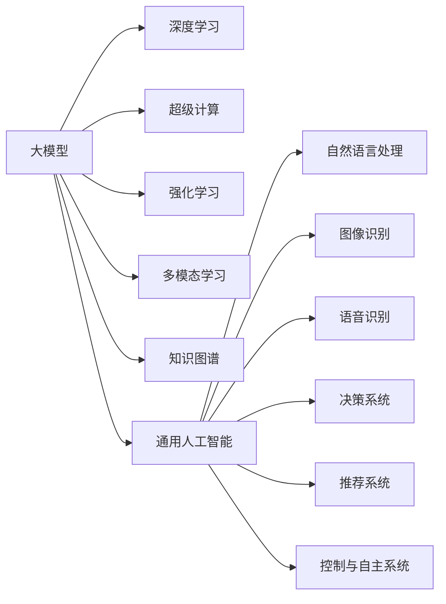

                 

# AI 大模型原理与应用：超级计算机与 AGI 通用人工智能

> 关键词：大模型,超级计算,通用人工智能,深度学习,计算机图灵奖,AGI,机器学习,强化学习,多模态学习,知识图谱

## 1. 背景介绍

### 1.1 问题由来

近年来，深度学习技术的迅猛发展，特别是大模型（Big Model）的崛起，引发了AI领域的一次革命。AI大模型不仅在图像识别、语音识别、自然语言处理等领域取得突破，还在通用人工智能（AGI）领域展现巨大潜力。

人工智能的研究和发展，正逐步从弱人工智能（Narrow AI）走向强人工智能（Strong AI），并最终迈向通用人工智能（AGI）。通用人工智能的目标是赋予计算机超越人类极限的广泛智能，让机器具备人一样的感知、推理、决策能力。

目前，通用人工智能的实现仍处于探索阶段，但围绕AGI的研究，如GPT-3、BERT、DALL-E等大模型，已经展现了其强大的潜力和广泛应用前景。

### 1.2 问题核心关键点

通用人工智能的核心在于创建具有通用性、适应性和智能性的AI系统。基于大模型的AI研究，正在不断突破这一目标。

为进一步理解和掌握大模型，我们必须清晰地认识以下几个关键问题：

1. 大模型的结构与原理是什么？
2. 大模型是如何进行超级计算的？
3. 大模型如何在通用人工智能中发挥作用？
4. 大模型的应用领域有哪些？
5. 大模型在超级计算中面临哪些挑战？

本文将对上述问题进行详细探讨，并围绕这些核心概念构建清晰的技术框架。

### 1.3 问题研究意义

通用人工智能是大模型发展的重要里程碑，通过大模型，我们可以更好地探索AGI的实现路径。此外，大模型还能应用于各行各业，提供高效的计算能力，驱动产业数字化转型，促进经济社会进步。

研究通用人工智能，有助于我们更好理解大模型的内涵和潜力，进一步提升其应用价值，推动未来AI技术的创新与发展。

## 2. 核心概念与联系

### 2.1 核心概念概述

为了更好地理解AGI和大模型，我们必须先掌握以下几个核心概念：

- **大模型（Big Model）**：指具有大规模参数的深度学习模型，如GPT、BERT、ResNet等。
- **超级计算（Supercomputing）**：指利用高性能计算机，进行大规模计算、数据处理和模型训练的过程。
- **通用人工智能（AGI）**：指具有高度通用性、适应性和智能性的AI系统，能够胜任任何领域的复杂任务。
- **深度学习（Deep Learning）**：指基于神经网络的机器学习方法，具有强大的自我学习和表达能力。
- **强化学习（Reinforcement Learning）**：指通过奖励和惩罚机制，让AI模型不断迭代优化。
- **多模态学习（Multimodal Learning）**：指同时处理多种类型数据（如图像、文本、声音）的机器学习方法。
- **知识图谱（Knowledge Graph）**：指利用图结构表示的知识，帮助机器更好地理解和推理。

这些核心概念相互关联，共同构成了大模型和通用人工智能的技术基础。

### 2.2 核心概念原理和架构的 Mermaid 流程图



上图的Mermaid流程图展示了大模型和AGI的核心概念及其关系：

1. 大模型基于深度学习技术，具有强大的表达能力和自我学习能力。
2. 通过超级计算，大模型可以高效地进行大规模数据处理和模型训练。
3. 强化学习使AI系统在复杂环境中不断优化策略，提升决策能力。
4. 多模态学习处理多种类型数据，增强AI系统的感知和理解能力。
5. 知识图谱利用图结构，辅助AI系统进行知识推理和知识表示。
6. 通用人工智能结合上述技术，形成具有通用性、适应性和智能性的AI系统。
7. 通用人工智能在自然语言处理、图像识别、语音识别、决策系统、推荐系统、控制与自主系统等多个领域得到应用。

这些核心概念和技术，共同支撑了AGI的实现，具有广泛的应用前景。

## 3. 核心算法原理 & 具体操作步骤

### 3.1 算法原理概述

大模型的核心在于其强大的计算能力和学习能力。以下是深度学习模型（如GPT）的基本原理：

**深度学习模型**：

深度学习模型是一种前馈神经网络，具有多层次的神经元，能够逐层抽取特征。其核心思想是逐层进行特征学习和抽象，最终形成高维的特征表示。

深度学习模型包含多层卷积层和全连接层，如图像识别中的卷积神经网络（CNN）和自然语言处理中的循环神经网络（RNN）。这些模型利用大量数据进行训练，学习到特征的复杂表达，进而提升模型的泛化能力和性能。

### 3.2 算法步骤详解

构建大模型并进行超级计算，通常包含以下步骤：

**Step 1: 数据预处理**

数据预处理是大模型训练的第一步。这包括数据清洗、归一化、分词、截断等操作，确保数据符合模型输入的要求。

**Step 2: 构建计算图**

构建计算图（即神经网络模型），利用深度学习框架如PyTorch、TensorFlow等实现模型的定义。计算图包含多层次的神经网络，每层包含多个神经元，用于进行特征学习和抽取。

**Step 3: 定义损失函数**

定义损失函数，用于衡量模型预测结果与真实标签之间的差异。常见的损失函数包括交叉熵损失、均方误差损失等。

**Step 4: 训练模型**

利用高性能计算平台进行模型训练，将数据输入模型，通过反向传播算法计算损失函数对参数的梯度，使用优化算法如Adam、SGD等更新参数，直至损失函数收敛。

**Step 5: 模型评估**

使用测试集评估模型的性能，计算模型在测试集上的准确率、精度等指标，确保模型具有较好的泛化能力。

**Step 6: 模型部署**

将训练好的模型部署到实际应用中，利用高性能计算平台进行推理预测，实现大规模数据的处理和计算。

### 3.3 算法优缺点

深度学习模型具有以下优点：

1. **强大的表达能力**：深度学习模型能够进行复杂的特征学习和抽象，适用于高维数据的处理。
2. **高效的并行计算**：深度学习模型利用GPU等高性能计算资源，进行高效的并行计算。
3. **自适应学习能力**：深度学习模型通过大量数据进行训练，具有较强的自我学习和泛化能力。

然而，深度学习模型也存在以下缺点：

1. **计算资源需求高**：深度学习模型参数量大，计算资源需求高，对硬件设备要求较高。
2. **训练时间长**：深度学习模型训练时间长，需要大量的数据和计算资源。
3. **模型复杂性**：深度学习模型结构复杂，调试和优化困难。

### 3.4 算法应用领域

深度学习模型已在多个领域得到广泛应用，包括：

1. **自然语言处理**：如文本分类、情感分析、机器翻译等。
2. **图像识别**：如图像分类、目标检测、图像分割等。
3. **语音识别**：如语音识别、语音合成等。
4. **推荐系统**：如电商平台推荐、音乐推荐等。
5. **医疗诊断**：如医学影像诊断、基因组学等。
6. **金融分析**：如信用评估、风险控制等。
7. **智能交通**：如自动驾驶、智能交通管理等。

这些应用领域展示了深度学习模型的强大潜力，并推动了相关产业的发展。

## 4. 数学模型和公式 & 详细讲解 & 举例说明

### 4.1 数学模型构建

假设我们使用一个深度学习模型进行图像分类，其计算图如下所示：

$$
\mathcal{G} = (N_0, N_1, \ldots, N_l) = (x, W_0, b_0, h_0, W_1, b_1, \ldots, W_l, b_l, y)
$$

其中：
- $N_0 = x$ 为输入数据。
- $N_1 = W_0x + b_0$ 为第一层计算结果。
- $N_2 = \sigma(N_1)$ 为激活函数。
- $N_3 = W_2N_2 + b_2$ 为第二层计算结果。
- $N_4 = \sigma(N_3)$ 为激活函数。
- $N_5 = W_5N_4 + b_5$ 为输出层计算结果。
- $N_6 = y$ 为真实标签。

$$
N_6 = loss(N_5, y)
$$

其中 $loss$ 为损失函数，用于衡量预测结果与真实标签之间的差异。

### 4.2 公式推导过程

在上述计算图中，我们将通过反向传播算法求得各层参数的梯度。假设 $N_1$ 为第一层计算结果， $N_2$ 为激活函数。

根据链式法则， $N_2$ 的梯度可表示为：

$$
\frac{\partial loss}{\partial N_2} = \frac{\partial loss}{\partial N_5} \cdot \frac{\partial N_5}{\partial N_4} \cdot \frac{\partial N_4}{\partial N_3} \cdot \frac{\partial N_3}{\partial N_2}
$$

其中，$\frac{\partial N_4}{\partial N_3}$ 为激活函数的梯度， $\frac{\partial N_5}{\partial N_4}$ 为输出层的梯度， $\frac{\partial loss}{\partial N_5}$ 为损失函数对输出层的梯度。

通过反向传播算法，我们求得各层参数的梯度，进而使用优化算法（如Adam、SGD等）更新参数。

### 4.3 案例分析与讲解

以图像分类为例，假设我们使用VGG16模型对CIFAR-10数据集进行训练。

首先，进行数据预处理，将图像归一化、截断等操作。

然后，构建VGG16计算图，定义损失函数为交叉熵损失函数。

接着，在计算图上进行前向传播，计算输出结果。

最后，进行反向传播，计算参数梯度，使用Adam优化算法更新模型参数。

在训练过程中，我们需要不断调整超参数，如学习率、批大小、迭代轮数等，以确保模型具有良好的泛化能力和性能。

## 5. 项目实践：代码实例和详细解释说明

### 5.1 开发环境搭建

在进行深度学习模型训练前，我们需要准备好开发环境。以下是使用Python进行PyTorch开发的环境配置流程：

1. 安装Anaconda：从官网下载并安装Anaconda，用于创建独立的Python环境。

2. 创建并激活虚拟环境：
```bash
conda create -n pytorch-env python=3.8 
conda activate pytorch-env
```

3. 安装PyTorch：根据CUDA版本，从官网获取对应的安装命令。例如：
```bash
conda install pytorch torchvision torchaudio cudatoolkit=11.1 -c pytorch -c conda-forge
```

4. 安装各类工具包：
```bash
pip install numpy pandas scikit-learn matplotlib tqdm jupyter notebook ipython
```

完成上述步骤后，即可在`pytorch-env`环境中开始深度学习模型的训练。

### 5.2 源代码详细实现

下面我们以VGG16模型进行图像分类任务为例，给出使用PyTorch进行深度学习模型训练的PyTorch代码实现。

```python
import torch
import torch.nn as nn
import torch.optim as optim
from torchvision import datasets, transforms

# 定义模型结构
class VGG16(nn.Module):
    def __init__(self):
        super(VGG16, self).__init__()
        self.features = nn.Sequential(
            nn.Conv2d(3, 64, kernel_size=3, padding=1),
            nn.ReLU(inplace=True),
            nn.MaxPool2d(2, stride=2),
            # ...（后续层的定义）
            nn.Linear(4096, 10)
        )
        self.classifier = nn.Linear(4096, 10)

    def forward(self, x):
        x = self.features(x)
        x = x.view(x.size(0), -1)
        x = self.classifier(x)
        return x

# 加载数据集
train_dataset = datasets.CIFAR10(root='./data', train=True, transform=transforms.ToTensor(), download=True)
test_dataset = datasets.CIFAR10(root='./data', train=False, transform=transforms.ToTensor(), download=True)

# 定义数据加载器
train_loader = torch.utils.data.DataLoader(train_dataset, batch_size=64, shuffle=True)
test_loader = torch.utils.data.DataLoader(test_dataset, batch_size=64, shuffle=False)

# 初始化模型
model = VGG16()

# 定义损失函数和优化器
criterion = nn.CrossEntropyLoss()
optimizer = optim.Adam(model.parameters(), lr=0.001)

# 训练模型
for epoch in range(10):
    for batch_idx, (data, target) in enumerate(train_loader):
        # 前向传播
        outputs = model(data)
        loss = criterion(outputs, target)
        optimizer.zero_grad()
        # 反向传播和优化
        loss.backward()
        optimizer.step()
        # 记录损失
        if batch_idx % 100 == 0:
            print('Train Epoch: {} [{}/{} ({:.0f}%)]\tLoss: {:.6f}'.format(
                epoch, batch_idx * len(data), len(train_loader.dataset),
                100. * batch_idx / len(train_loader), loss.item()))
```

以上代码展示了使用PyTorch进行深度学习模型训练的基本流程。首先定义模型结构，加载数据集，然后定义损失函数和优化器，最后进行模型训练。

### 5.3 代码解读与分析

在上述代码中，我们重点解读几个关键步骤：

**模型结构定义**：
```python
class VGG16(nn.Module):
    def __init__(self):
        super(VGG16, self).__init__()
        self.features = nn.Sequential(
            nn.Conv2d(3, 64, kernel_size=3, padding=1),
            nn.ReLU(inplace=True),
            nn.MaxPool2d(2, stride=2),
            # ...（后续层的定义）
            nn.Linear(4096, 10)
        )
        self.classifier = nn.Linear(4096, 10)
```

这里我们定义了一个VGG16模型，包含多个卷积层、池化层和全连接层，最终输出10个类别。

**数据集加载**：
```python
train_dataset = datasets.CIFAR10(root='./data', train=True, transform=transforms.ToTensor(), download=True)
test_dataset = datasets.CIFAR10(root='./data', train=False, transform=transforms.ToTensor(), download=True)
```

我们使用PyTorch内置的CIFAR10数据集，对图像数据进行加载、归一化和截断操作。

**模型训练**：
```python
for epoch in range(10):
    for batch_idx, (data, target) in enumerate(train_loader):
        # 前向传播
        outputs = model(data)
        loss = criterion(outputs, target)
        optimizer.zero_grad()
        # 反向传播和优化
        loss.backward()
        optimizer.step()
        # 记录损失
        if batch_idx % 100 == 0:
            print('Train Epoch: {} [{}/{} ({:.0f}%)]\tLoss: {:.6f}'.format(
                epoch, batch_idx * len(data), len(train_loader.dataset),
                100. * batch_idx / len(train_loader), loss.item()))
```

这里定义了模型的训练过程，通过前向传播计算损失函数，反向传播更新参数，并记录每次迭代的损失值。

## 6. 实际应用场景

### 6.1 智能客服系统

智能客服系统是大模型在实际应用中的典型案例。通过深度学习模型，我们可以构建一个具备高度自主学习能力的智能客服系统，实现实时、高效的用户互动。

在实际应用中，我们可以使用预训练模型如BERT进行微调，加载历史客服对话记录，微调模型以适应特定领域的问答任务。微调后的模型能够自动理解用户意图，匹配最佳答复，并动态生成回答，从而提升用户体验和服务效率。

### 6.2 金融舆情监测

金融领域对市场舆情变化高度敏感，及时监测舆情变化有助于金融机构制定应对策略。基于大模型的文本分类和情感分析技术，可以帮助金融机构实时监测市场舆情，提前预警潜在风险。

具体而言，我们可以收集金融领域的文本数据，如新闻、报道、评论等，并对其进行情感和主题分类标注。使用预训练模型如BERT进行微调，使其能够自动识别文本情感和主题，并迅速响应市场舆情变化，提供风险预警。

### 6.3 个性化推荐系统

个性化推荐系统是大模型在电商、视频、音乐等领域的常见应用。通过深度学习模型，我们可以构建具备高度个性化推荐能力的推荐系统，提升用户体验和满意度。

在推荐系统中，我们可以使用预训练模型如VGG16进行微调，加载用户历史行为数据和物品描述，微调模型以适应推荐任务。微调后的模型能够准确把握用户兴趣点，结合物品特征，生成高度个性化的推荐列表，提升用户体验和推荐效果。

### 6.4 未来应用展望

未来，大模型和通用人工智能将在更多领域得到应用，进一步推动各行各业的智能化转型。

1. **智慧医疗**：基于大模型的医疗诊断系统，可以通过图像识别、文本分析等技术，提升诊断的准确性和效率，辅助医生进行精准诊疗。
2. **智能教育**：基于大模型的智能教育系统，可以通过自然语言处理、知识图谱等技术，提供个性化学习方案，提升教育效果。
3. **智慧交通**：基于大模型的智能交通系统，可以通过图像识别、语音识别等技术，提升交通管理的智能化水平，实现安全、高效的城市交通管理。
4. **智能制造**：基于大模型的智能制造系统，可以通过图像识别、语音识别等技术，提升生产线的智能化水平，实现高效、精准的生产管理。
5. **智能安防**：基于大模型的智能安防系统，可以通过图像识别、行为分析等技术，提升公共安全的智能化水平，实现安全、高效的安防监控。

这些应用领域展示了深度学习模型和大模型的强大潜力，并推动了相关产业的发展。

## 7. 工具和资源推荐

### 7.1 学习资源推荐

为了帮助开发者系统掌握深度学习模型的原理与应用，我们推荐以下学习资源：

1. **《Deep Learning》书籍**：由深度学习之父Ian Goodfellow所著，全面介绍了深度学习的基本原理、算法和应用，是学习深度学习的基础读物。
2. **CS231n《Convolutional Neural Networks for Visual Recognition》课程**：斯坦福大学开设的深度学习课程，重点介绍图像识别中的卷积神经网络。
3. **《Python Machine Learning》书籍**：由Sebastian Raschka所著，详细介绍了使用Python进行机器学习开发的各种技术和工具。
4. **Kaggle竞赛平台**：提供了丰富的机器学习竞赛项目，通过参与竞赛，提升实战能力。
5. **PyTorch官方文档**：PyTorch作为目前最流行的深度学习框架之一，其官方文档详细介绍了各种深度学习模型的实现和应用。

通过对这些资源的系统学习，相信你一定能够全面掌握深度学习模型的原理与应用，进一步提升深度学习开发能力。

### 7.2 开发工具推荐

深度学习模型的开发离不开强大的工具支持。以下是几款用于深度学习模型开发的常用工具：

1. **PyTorch**：由Facebook开源的深度学习框架，具有灵活的动态计算图，适合快速迭代研究。
2. **TensorFlow**：由Google开源的深度学习框架，生产部署方便，适合大规模工程应用。
3. **TensorBoard**：TensorFlow配套的可视化工具，可实时监测模型训练状态，并提供丰富的图表呈现方式。
4. **Weights & Biases**：模型训练的实验跟踪工具，可以记录和可视化模型训练过程中的各项指标，方便对比和调优。
5. **Jupyter Notebook**：Python编程环境，支持代码交互和实时渲染，适合进行深度学习开发和调试。

合理利用这些工具，可以显著提升深度学习模型的开发效率，加速创新迭代的步伐。

### 7.3 相关论文推荐

深度学习模型的发展离不开学界的研究和探索。以下是几篇奠基性的相关论文，推荐阅读：

1. **ImageNet Classification with Deep Convolutional Neural Networks**：AlexNet论文，首次展示了深度学习在图像识别领域的突破。
2. **Neural Machine Translation by Jointly Learning to Align and Translate**：Seq2Seq模型论文，首次展示了深度学习在机器翻译领域的突破。
3. **Semi-Supervised Learning with Deep Generative Models**：基于生成对抗网络（GAN）的半监督学习论文，展示了深度学习在半监督学习领域的突破。
4. **AlphaGo Zero**：AlphaGo论文，展示了深度学习在强化学习领域的突破。
5. **Visual Geometry Algebra**：SOTA视觉几何代数论文，展示了深度学习在多模态学习领域的突破。

这些论文代表了大模型发展的重要里程碑，展示了深度学习模型的强大潜力和广泛应用前景。

## 8. 总结：未来发展趋势与挑战

### 8.1 总结

本文对深度学习模型和大模型的原理与应用进行了全面系统的介绍。首先阐述了大模型的结构与原理，详细讲解了深度学习模型的训练过程和实际应用。其次，从超级计算和AGI的角度，探讨了深度学习模型在大规模计算和通用人工智能中的作用。最后，介绍了深度学习模型在不同领域的应用，并展望了未来的发展趋势。

通过本文的系统梳理，可以看到，深度学习模型和大模型正在不断拓展其应用范围，成为各行各业智能化转型的重要工具。深度学习模型的强大潜力和广泛应用前景，正逐步推动各领域的发展，加速人类社会的数字化进程。

### 8.2 未来发展趋势

未来，深度学习模型和大模型将呈现以下几个发展趋势：

1. **多模态学习**：深度学习模型将更多地融合视觉、语音、文本等多种模态数据，提升综合感知和理解能力。
2. **迁移学习**：深度学习模型将更多地利用迁移学习技术，加速新任务的学习，提升模型的泛化能力。
3. **强化学习**：深度学习模型将更多地结合强化学习技术，提升智能决策和自主学习能力。
4. **联邦学习**：深度学习模型将更多地利用联邦学习技术，保护数据隐私，提升模型性能。
5. **知识图谱**：深度学习模型将更多地利用知识图谱技术，提升知识推理和知识表示能力。
6. **通用人工智能**：深度学习模型将更多地朝着AGI方向发展，提升模型的通用性、适应性和智能性。

这些趋势展示了深度学习模型和大模型的广阔前景，并推动了相关产业的发展。

### 8.3 面临的挑战

尽管深度学习模型和大模型取得了显著进展，但在实际应用中仍面临诸多挑战：

1. **计算资源需求高**：深度学习模型需要大量的计算资源和硬件设备，这对算力和存储提出了较高的要求。
2. **训练时间长**：深度学习模型训练时间长，需要大量的数据和计算资源，这对数据收集和标注提出了较高的要求。
3. **模型复杂性高**：深度学习模型结构复杂，调试和优化困难，需要专业的知识和技能。
4. **模型可解释性差**：深度学习模型往往是"黑盒"系统，难以解释其内部工作机制和决策逻辑。
5. **数据隐私和安全**：深度学习模型需要处理大量的个人数据，如何保护数据隐私和确保数据安全，成为重要的研究方向。

### 8.4 研究展望

未来，深度学习模型和大模型需要在以下几个方面进一步突破：

1. **算法优化**：优化深度学习算法，提升模型训练和推理效率，降低资源消耗。
2. **知识融合**：将符号化的先验知识与深度学习模型进行融合，提升模型的泛化能力和知识推理能力。
3. **多任务学习**：在多任务学习框架下，提升深度学习模型的适应性和迁移学习能力。
4. **对抗攻击**：研究深度学习模型对抗攻击技术，提升模型的鲁棒性和安全性。
5. **联邦学习**：研究联邦学习技术，保护数据隐私，提升模型性能。
6. **解释性增强**：研究可解释性增强技术，提升深度学习模型的可解释性和透明性。

这些研究方向展示了深度学习模型和大模型的发展方向，并推动了相关产业的发展。

## 9. 附录：常见问题与解答

**Q1：深度学习模型和大模型的区别是什么？**

A: 深度学习模型是深度学习领域的基础模型，具备强大的表达能力和自我学习能力。而大模型是基于深度学习模型的更大规模的模型，具有更丰富的语言知识和常识，能够应对更多样的任务。

**Q2：如何训练深度学习模型？**

A: 训练深度学习模型通常包含数据预处理、构建计算图、定义损失函数、训练模型、模型评估等步骤。具体实现可以参考上述代码示例。

**Q3：深度学习模型在大规模计算中面临哪些挑战？**

A: 深度学习模型在大规模计算中面临计算资源需求高、训练时间长、模型复杂性高等挑战。需要利用高性能计算平台、优化算法和并行计算等技术，克服这些挑战。

**Q4：深度学习模型在大模型中如何发挥作用？**

A: 深度学习模型在大模型中起到了核心作用，负责进行特征学习和表达，形成高维的特征表示。通过多个深度学习模型的堆叠和融合，大模型具备更强大的表达能力和自我学习能力。

**Q5：未来深度学习模型和大模型在哪些领域有应用前景？**

A: 未来，深度学习模型和大模型将在智慧医疗、智能教育、智慧交通、智能制造、智能安防等领域得到广泛应用，提升各行业的智能化水平，推动经济社会进步。

通过本文的系统梳理，可以看到，深度学习模型和大模型正在不断拓展其应用范围，成为各行各业智能化转型的重要工具。深度学习模型的强大潜力和广泛应用前景，正逐步推动各领域的发展，加速人类社会的数字化进程。未来，随着深度学习模型和大模型的持续演进，人工智能技术必将迎来更广阔的落地场景，深刻影响人类的生产生活方式。

