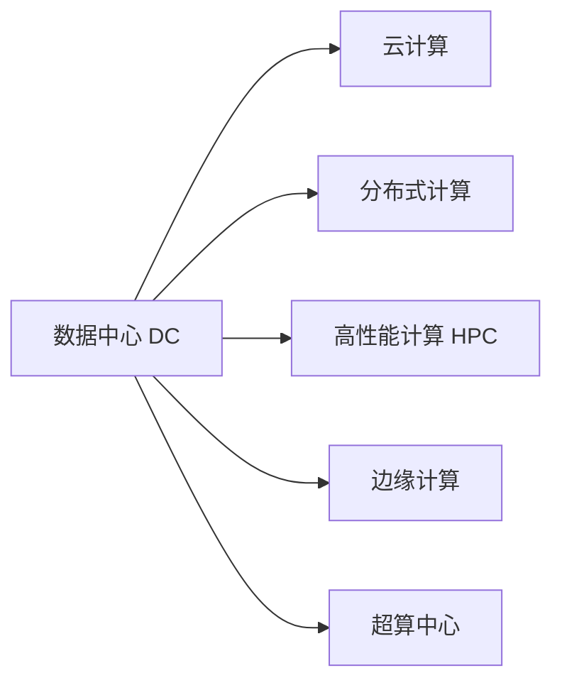

                 

# AI 大模型应用数据中心建设：数据中心产业发展

## 1. 背景介绍

### 1.1 问题由来
随着人工智能(AI)技术的飞速发展，特别是深度学习和神经网络的广泛应用，数据中心（Data Center, DC）在AI大模型的训练、推理和应用中扮演了关键角色。数据中心不仅是AI模型的运行环境，也是支撑AI产业链的硬件和软件资源中心。从基础设施、网络架构、数据存储、到计算资源，数据中心建设对于AI的落地应用至关重要。

近年来，大型AI大模型如GPT-3、BERT等不断涌现，其模型规模、参数量和使用场景的复杂性对数据中心建设提出了更高要求。这些大模型需要庞大的计算资源、高效的网络传输和优化存储，同时对能耗、安全性、可靠性和可扩展性提出了新的挑战。如何建设高效、绿色、安全的数据中心，以支撑大规模AI模型应用，成为全球技术界和产业界的共同课题。

### 1.2 问题核心关键点
数据中心建设的核心问题包括：

1. **硬件基础：**数据中心的服务器、存储和网络设备应具备高效能、低功耗、高可靠性和高扩展性，满足AI大模型的计算需求。
2. **网络架构：**数据中心应设计合理的网络拓扑和通信协议，确保高带宽、低延迟、高吞吐量的数据传输，支撑大规模并行计算。
3. **数据管理：**数据中心的存储系统应支持大规模数据的高效读写、备份和恢复，确保数据完整性和安全性。
4. **能效优化：**数据中心应实现绿色环保的能源利用，通过优化电源管理、冷却系统和设备布局，降低能源消耗和运营成本。
5. **安全防护：**数据中心应具备高级别的安全防护措施，防止数据泄露和系统攻击，确保AI模型的运行安全。

### 1.3 问题研究意义
数据中心建设对于AI大模型的应用具有重要意义：

1. **支撑模型训练：**数据中心提供了必要的硬件资源，支持大规模模型的参数训练和优化。
2. **加速模型推理：**数据中心通过分布式计算和高速网络，实现AI模型的快速推理和预测。
3. **支持应用落地：**数据中心通过提供计算资源和云服务，支持AI模型在实际应用中的部署和优化。
4. **促进产业升级：**数据中心建设推动了数据、算法、计算和应用的一体化，促进了AI技术在各行各业的普及和应用。

## 2. 核心概念与联系

### 2.1 核心概念概述

为了更好地理解数据中心建设的相关概念和技术，本节将介绍几个核心概念：

- **数据中心(Data Center, DC)：**集中管理计算、存储和网络资源的设施，提供高性能、高可用性的IT服务。数据中心是AI模型训练和推理的物理基础。
- **云计算(Cloud Computing)：**通过互联网提供计算资源、存储资源、网络资源等，按需自助、弹性扩展的服务模式，是数据中心的重要应用形式。
- **分布式计算(Distributed Computing)：**通过网络将计算任务分散到多个计算节点上并行处理，提高计算效率和处理能力。
- **高性能计算(High-Performance Computing, HPC)：**使用专用的硬件和软件，实现高吞吐率、高并行性的计算能力，适用于大规模科学计算和AI模型训练。
- **边缘计算(Edge Computing)：**在靠近数据源的网络边缘处进行数据处理和计算，减少数据传输时延，提高计算效率。
- **超算中心(Supercomputing Center)：**具备超级计算机系统的数据中心，提供强大的计算和存储能力，支持大规模科学研究和AI模型训练。

这些核心概念之间的关系可以用以下Mermaid流程图来展示：



这个流程图展示了大模型应用数据中心建设的核心概念及其关联：

1. 数据中心是硬件基础，支持云计算、分布式计算、高性能计算、边缘计算和超算中心等多种应用模式。
2. 云计算、分布式计算、高性能计算、边缘计算和超算中心等模式，都依赖于数据中心的硬件和软件资源，提供不同层次的计算和存储服务。
3. 超算中心则具备更强大的计算能力，常用于处理大规模科学计算和AI模型训练。

## 3. 核心算法原理 & 具体操作步骤

### 3.1 算法原理概述

数据中心建设的核心算法原理主要是围绕硬件基础、网络架构、数据管理、能效优化和安全防护等方面展开的。其核心思想是通过优化设计，构建高性能、高可靠性和高安全性的数据中心，满足大规模AI模型的应用需求。

### 3.2 算法步骤详解

大模型应用数据中心建设的一般步骤如下：

1. **规划设计：**根据AI模型的规模和应用场景，确定数据中心的大小、位置和设备配置。
2. **硬件选型：**选择高性能的服务器、存储和网络设备，满足模型训练和推理的计算需求。
3. **网络部署：**设计合理的网络拓扑和通信协议，实现高带宽、低延迟和高效能的数据传输。
4. **数据管理：**构建高效的数据存储和备份系统，确保数据完整性和安全性。
5. **能效优化：**采用先进的能效管理技术和设备布局，实现绿色环保的能源利用。
6. **安全防护：**实施高级别的安全防护措施，防止数据泄露和系统攻击。

### 3.3 算法优缺点

数据中心建设存在以下优点：

1. **资源集中：**集中管理计算、存储和网络资源，易于管理和维护。
2. **高可扩展性：**通过云计算和分布式计算，可以按需扩展计算资源，满足不同规模模型的需求。
3. **高安全性：**通过先进的安全防护措施，保障数据和模型的安全。

同时，也存在一些缺点：

1. **高投入：**数据中心建设和运维需要大量的硬件和软件资源，初始投入成本较高。
2. **能耗高：**数据中心的高能效管理是挑战之一，需要投入大量精力和资金。
3. **环境影响：**数据中心的建设和运维对环境有较大影响，需要符合绿色环保的要求。
4. **复杂度高：**数据中心的设计和部署涉及多方面的技术细节，对技术团队的要求较高。

### 3.4 算法应用领域

大模型应用数据中心建设的应用领域包括：

1. **科学研究：**支持大规模科学计算和仿真，推动科学研究的进展。
2. **企业应用：**提供高性能计算和存储资源，支持企业业务数据处理和AI模型训练。
3. **政府服务：**构建公共数据中心，提供云计算和数据存储服务，支撑政府数字化转型。
4. **教育医疗：**支持教育资源和医疗数据的高效管理和处理，提升教育医疗水平。
5. **金融证券：**提供高性能计算和存储资源，支持金融市场交易和风险管理。
6. **工业制造：**支持工业互联网平台的数据存储和处理，推动制造业数字化升级。

## 4. 数学模型和公式 & 详细讲解

### 4.1 数学模型构建

大模型应用数据中心建设涉及的数学模型主要是围绕硬件资源分配、网络流量优化、数据管理、能效评估和安全防护等方面展开的。这些模型可以用于指导数据中心的规划设计、资源分配和性能评估。

### 4.2 公式推导过程

以下以计算资源分配为例，进行数学模型推导：

假设数据中心有 $N$ 个服务器节点，每个节点处理能力为 $P$，总处理需求为 $T$。设每个节点的服务负载均衡因子为 $\lambda_i$，则系统的总处理能力 $C$ 可以表示为：

$$
C = \sum_{i=1}^N P\lambda_i
$$

根据负载均衡原则，每个节点的负载均衡因子 $\lambda_i$ 应满足以下约束条件：

$$
\sum_{i=1}^N \lambda_i = 1
$$

通过求解上述最优化问题，可以得到每个节点的最优处理能力分配。

### 4.3 案例分析与讲解

以谷歌的TPU（Tensor Processing Unit）为例，谷歌通过构建专门用于深度学习计算的TPU芯片，显著提升了AI模型训练的速度和效率。通过优化TPU架构和网络协议，谷歌实现了高吞吐率和高并行性的数据处理，支持了多个大规模AI模型的训练和推理。谷歌TPU的构建和优化，展示了数据中心建设在支撑AI技术发展中的重要作用。

## 5. 项目实践：代码实例和详细解释说明

### 5.1 开发环境搭建

要进行数据中心建设的实际项目开发，首先需要搭建开发环境。以下是使用Python进行Kubernetes开发的详细流程：

1. 安装Kubernetes集群：通过云服务提供商如GCP、AWS、阿里云等，搭建和管理Kubernetes集群。
2. 安装Helm包管理器：使用Helm管理Kubernetes的资源和应用。
3. 安装Prometheus和Grafana：配置监控和可视化工具，实时监测数据中心性能。
4. 安装Fluentd和Kibana：配置日志管理工具，收集和分析系统日志。
5. 安装TensorFlow或PyTorch：准备AI模型训练和推理的计算资源。

完成上述步骤后，即可在Kubernetes集群上搭建和部署AI模型应用。

### 5.2 源代码详细实现

下面以TensorFlow为例，给出使用Kubernetes部署AI模型的代码实现。

```python
import tensorflow as tf

# 定义模型
model = tf.keras.Sequential([
    tf.keras.layers.Dense(64, activation='relu', input_shape=(784,)),
    tf.keras.layers.Dense(10, activation='softmax')
])

# 编译模型
model.compile(optimizer=tf.keras.optimizers.Adam(), 
              loss=tf.keras.losses.SparseCategoricalCrossentropy(),
              metrics=[tf.keras.metrics.SparseCategoricalAccuracy()])

# 训练模型
model.fit(train_dataset, epochs=10, validation_data=val_dataset)

# 保存模型
tf.saved_model.save(model, export_dir='./model')
```

### 5.3 代码解读与分析

让我们再详细解读一下关键代码的实现细节：

- `tf.keras.Sequential`：定义了一个多层感知器模型，由两个全连接层组成。
- `model.compile`：配置模型的优化器、损失函数和评估指标。
- `model.fit`：使用训练集和验证集，训练模型并验证模型性能。
- `tf.saved_model.save`：将训练好的模型保存为SavedModel格式，供后续部署使用。

这段代码展示了使用TensorFlow在Kubernetes集群上部署和训练AI模型的过程。通过Helm工具，可以将模型代码打包为Kubernetes的Deployment和Service，实现模型的容器化和分布式部署。

### 5.4 运行结果展示

运行上述代码，可以在Kubernetes集群上部署和训练模型，验证模型的准确性和性能。部署后的模型可以使用Prometheus和Grafana等工具进行实时监控和可视化分析，确保模型的稳定性和可靠性。

## 6. 实际应用场景

### 6.1 科学研究

数据中心建设对于科学研究具有重要意义。例如，中国科学院国家超级计算机郑州中心，通过构建高性能计算集群，支持大规模科学计算和仿真，推动气象、物理、生物等领域的科研进展。

### 6.2 企业应用

数据中心建设为企业应用提供了高性能计算和存储资源。例如，阿里云的飞天操作系统，通过构建弹性计算云和分布式存储云，支持企业级应用的数据处理和存储，推动了企业的数字化转型。

### 6.3 政府服务

政府部门通过构建公共数据中心，提供云计算和数据存储服务，推动政务数据的集中管理和高效应用。例如，国家政务服务平台，通过构建统一的云平台和数据中心，实现了政务数据的高效管理和共享。

### 6.4 教育医疗

教育医疗领域通过构建高性能计算和存储资源，支持教育资源和医疗数据的高效管理和处理。例如，智慧医院项目，通过构建医疗数据中心，实现了医疗影像的快速存储和处理，提升了医疗服务的效率和质量。

### 6.5 金融证券

金融证券领域通过构建高性能计算和存储资源，支持金融市场交易和风险管理。例如，上海证券交易所的云服务平台，通过构建高性能计算集群，支持股票交易和市场分析，提高了市场效率和安全性。

### 6.6 工业制造

工业制造领域通过构建高性能计算和存储资源，支持工业互联网平台的数据存储和处理，推动制造业数字化升级。例如，西门子工业互联网平台，通过构建高性能计算集群，实现了工业数据的集中管理和高效分析。

## 7. 工具和资源推荐

### 7.1 学习资源推荐

为了帮助开发者系统掌握数据中心建设的理论基础和实践技巧，这里推荐一些优质的学习资源：

1. 《数据中心基础架构》系列书籍：系统介绍了数据中心硬件、网络、存储和软件基础架构，是学习数据中心建设的入门级读物。
2. 《高性能计算与云计算》课程：系统讲解了高性能计算和云计算的原理、技术和应用，适合进阶学习。
3. Kubernetes官方文档：提供了详细的Kubernetes集群搭建和管理指南，是实际部署的必备资料。
4. Helm官方文档：提供了Helm包管理和部署的详细指南，帮助开发者高效部署和管理应用。
5. TensorFlow官方文档：提供了TensorFlow模型训练和部署的详细指南，是实际应用的重要参考。

通过对这些资源的学习实践，相信你一定能够快速掌握数据中心建设的核心技术，并用于解决实际的AI模型应用问题。

### 7.2 开发工具推荐

高效的开发离不开优秀的工具支持。以下是几款用于数据中心建设的常用工具：

1. Kubernetes：开源容器编排系统，提供高效的应用部署、扩展和运维。
2. Helm：Kubernetes应用包管理器，帮助开发者轻松打包和管理应用。
3. TensorFlow：开源深度学习框架，支持模型训练和推理，是AI模型应用的基础工具。
4. Prometheus：开源监控系统，实时监测系统性能，提供丰富的指标和告警。
5. Grafana：开源可视化工具，将Prometheus数据可视化，帮助开发者快速发现问题。
6. Fluentd：开源日志收集工具，收集和处理系统日志，支持分布式日志管理。
7. Kibana：开源日志分析工具，提供丰富的数据可视化和分析功能，帮助开发者进行问题排查。

合理利用这些工具，可以显著提升数据中心建设和应用开发效率，加速AI技术的实际落地。

### 7.3 相关论文推荐

数据中心建设的研究涉及硬件、网络、存储和软件等多个领域，相关的论文较多。以下是几篇代表性的论文，推荐阅读：

1. GreenCirrus: Building a Sustainable Global Computing Grid with Renewable Energy
2. Underwater Communication: Techniques, Architectures, and Future Trends
3. Scalable High-Performance Storage Systems
4. Cloud Computing: Concepts, Technology, and Architecture
5. Energy-Efficient Computing in Data Centers: Architectural Solutions and Challenges

这些论文代表了大模型应用数据中心建设的发展脉络。通过学习这些前沿成果，可以帮助研究者把握学科前进方向，激发更多的创新灵感。

## 8. 总结：未来发展趋势与挑战

### 8.1 总结

本文对大模型应用数据中心建设进行了全面系统的介绍。首先阐述了数据中心建设和AI大模型应用的背景和意义，明确了数据中心在支撑AI模型训练和推理中的重要性。其次，从原理到实践，详细讲解了数据中心的规划设计、资源分配、网络优化、能效管理和安全防护等方面的关键技术。最后，通过代码实例和实际应用场景，展示了数据中心建设在AI技术落地中的应用价值。

通过本文的系统梳理，可以看到，数据中心建设是大模型应用的重要基础，其技术和方法对于AI技术的广泛应用具有深远影响。未来，数据中心建设还将面临诸多挑战，需要持续探索和优化。

### 8.2 未来发展趋势

展望未来，数据中心建设将呈现以下几个发展趋势：

1. **绿色环保：**采用高效能的设备和技术，实现绿色环保的能源利用，减少数据中心的碳足迹。
2. **边缘计算：**在靠近数据源的网络边缘处进行计算，减少数据传输时延，提升数据处理效率。
3. **高性能计算：**通过分布式计算和超算中心，提升数据中心的计算能力，支持更大规模模型的训练和推理。
4. **智能化管理：**引入AI技术，实现数据中心的自动化运维和管理，提升数据中心的运行效率和稳定性。
5. **云化和分布式化：**通过云计算和分布式计算，实现数据中心的高可用性和弹性扩展。
6. **开源化：**采用开源技术和工具，降低数据中心的开发和部署成本，推动数据中心建设的普及。

这些趋势将推动数据中心建设向更高层次发展，为AI大模型的应用提供更强大的硬件和软件支撑。

### 8.3 面临的挑战

尽管数据中心建设在大模型应用中具有重要意义，但在迈向更加智能化、普适化应用的过程中，仍面临诸多挑战：

1. **能耗高：**数据中心的运行和维护需要大量的电力，能耗管理是重要的研究方向。
2. **设备昂贵：**高性能计算和存储设备成本高昂，如何降低设备投入，提升性价比，仍需努力。
3. **网络延迟：**网络延迟是数据中心性能的重要指标，如何优化网络架构，提高数据传输效率，仍需深入研究。
4. **数据安全：**数据中心存储大量敏感数据，如何保障数据安全，防止数据泄露和系统攻击，仍需加强技术防护。
5. **环境影响：**数据中心建设和运维对环境有较大影响，如何实现绿色环保的能源利用，仍需改进。

### 8.4 研究展望

面对数据中心建设所面临的挑战，未来的研究需要在以下几个方面寻求新的突破：

1. **能效优化：**开发更高效能的设备和管理技术，实现绿色环保的能源利用。
2. **硬件创新：**推动高性能计算和存储设备的创新，降低设备成本，提升性能。
3. **网络优化：**优化网络架构和通信协议，实现高速、可靠的数据传输。
4. **数据安全：**加强数据加密和访问控制技术，防止数据泄露和系统攻击。
5. **环境友好：**推广绿色环保的建设方案，实现数据中心的可持续发展。

只有从多个维度不断优化和改进，才能构建高效、绿色、安全的数据中心，支撑大规模AI模型的应用。

## 9. 附录：常见问题与解答

**Q1：数据中心建设和维护的投入成本高，如何降低成本？**

A: 数据中心建设和维护成本高昂，但可以通过以下几个方面进行优化：

1. 采用开源技术和工具：开源技术和工具可以降低开发和部署成本，提高系统的灵活性和可扩展性。
2. 引入云计算：通过云计算，按需扩展计算资源，减少硬件投入，提升系统的弹性。
3. 使用边缘计算：在靠近数据源的网络边缘进行计算，减少数据传输时延和带宽消耗，提升数据处理效率。
4. 优化能效管理：采用高效的能效管理技术和设备布局，降低能源消耗和运营成本。
5. 采用分布式计算：通过分布式计算，实现大规模模型的并行处理，提升计算效率和资源利用率。

通过以上措施，可以在一定程度上降低数据中心建设和维护的成本，提升系统的性价比。

**Q2：如何确保数据中心的安全性？**

A: 数据中心的安全性是数据中心建设的重要课题，需要从以下几个方面进行保障：

1. 数据加密：对存储和传输的数据进行加密处理，防止数据泄露和窃听。
2. 访问控制：采用身份验证和授权机制，确保只有授权用户才能访问数据中心。
3. 安全审计：建立安全审计机制，记录和分析系统行为，及时发现和处理安全威胁。
4. 网络隔离：采用网络隔离技术，将关键数据和系统隔离，防止跨网段攻击。
5. 防火墙和入侵检测：部署防火墙和入侵检测系统，防止网络攻击和恶意行为。
6. 安全监控：部署安全监控系统，实时监测系统异常行为，及时响应安全事件。

通过以上措施，可以构建高安全性的数据中心，保障数据和系统的安全。

**Q3：数据中心如何实现绿色环保的能源利用？**

A: 实现绿色环保的能源利用，需要从以下几个方面进行改进：

1. 采用高效能设备：选择高效能的服务器、存储和网络设备，降低能源消耗。
2. 优化能效管理：采用先进的能效管理技术和设备布局，提升能源利用效率。
3. 采用可再生能源：采用太阳能、风能等可再生能源，减少化石燃料的使用。
4. 优化制冷系统：优化制冷系统设计，降低冷却能耗。
5. 采用智能管理：引入AI技术，实现能源使用的智能化管理，提升能源利用效率。

通过以上措施，可以显著降低数据中心的能耗，实现绿色环保的能源利用。

**Q4：数据中心的扩展性和可管理性如何提升？**

A: 提升数据中心的扩展性和可管理性，需要从以下几个方面进行改进：

1. 采用分布式计算：通过分布式计算，实现大规模模型的并行处理，提升计算效率和资源利用率。
2. 引入容器化技术：采用容器化技术，实现应用的快速部署和扩展。
3. 采用自动化管理工具：引入自动化管理工具，如Ansible、Puppet等，实现系统的自动化运维和管理。
4. 引入微服务架构：采用微服务架构，实现系统的模块化和松耦合，提升系统的扩展性和可维护性。
5. 引入云计算：通过云计算，按需扩展计算资源，提升系统的弹性和可管理性。

通过以上措施，可以显著提升数据中心的扩展性和可管理性，满足不同规模和复杂度模型的需求。

**Q5：数据中心的部署和运维如何实现？**

A: 数据中心的部署和运维需要从以下几个方面进行优化：

1. 采用自动化部署工具：采用自动化部署工具，如Ansible、Jenkins等，实现应用的快速部署和升级。
2. 引入持续集成和持续部署(CI/CD)：引入CI/CD，实现代码的自动构建、测试和部署，提升系统的开发效率。
3. 采用容器化技术：采用容器化技术，实现应用的快速部署和扩展。
4. 引入DevOps文化：引入DevOps文化，推动开发和运维团队的紧密合作，提升系统的稳定性和可靠性。
5. 采用监控和告警系统：采用监控和告警系统，实时监测系统状态，及时发现和处理问题。

通过以上措施，可以显著提升数据中心的部署和运维效率，确保系统的稳定性和可靠性。

---

作者：禅与计算机程序设计艺术 / Zen and the Art of Computer Programming

