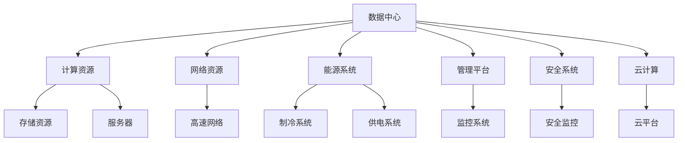

                 

# AI 大模型应用数据中心建设：数据中心产业链生态

## 1. 背景介绍

### 1.1 问题由来

随着人工智能（AI）技术的迅猛发展，大模型（Large Model）的应用已经深入到各行各业。大模型通过深度学习的方式，从海量数据中提取出抽象的知识和模式，可以在图像识别、自然语言处理、医疗诊断等多个领域展现出卓越的性能。然而，大模型的训练和应用需要一个庞大的数据中心基础设施作为支撑。数据中心不仅仅是计算和存储的物理空间，更是数据流动和处理的关键节点。本文将围绕大模型应用的数据中心建设，探讨数据中心产业链的生态体系，为相关行业的从业者提供参考。

### 1.2 问题核心关键点

数据中心是大模型训练和应用的基础设施，其建设和使用涉及计算、存储、网络、能源等多个方面。本文将重点探讨数据中心的硬件设施、软件平台、云计算服务、以及数据存储和传输等关键问题，剖析数据中心产业链的各个环节，帮助读者理解数据中心建设的重要性和复杂性。

## 2. 核心概念与联系

### 2.1 核心概念概述

- **数据中心（Data Center）**：用于存储、计算和分发数据的关键基础设施，通常包括服务器、网络设备、制冷系统、供电系统等硬件设施，以及操作系统、虚拟化软件、云计算平台等软件平台。

- **大模型（Large Model）**：如BERT、GPT-3等深度学习模型，通过大规模训练获得对特定领域的深度理解和预测能力。

- **云计算（Cloud Computing）**：通过互联网提供可扩展的计算和存储资源，支持大模型的分布式训练和推理。

- **边缘计算（Edge Computing）**：将计算和存储任务从中心服务器分布到靠近数据源的边缘设备上，减少延迟和带宽需求，支持实时大模型应用。

- **数据存储（Data Storage）**：用于持久化存储大模型和训练数据，通常包括磁盘存储、固态硬盘存储、对象存储等。

- **数据传输（Data Transmission）**：通过网络技术实现大模型和数据的传输，包括高速网络、网络带宽、网络延时等。

- **能源消耗（Energy Consumption）**：数据中心的高效能耗问题，包括制冷、供电、服务器耗电等。

### 2.2 核心概念原理和架构的 Mermaid 流程图



这个流程图展示了数据中心的核心组成部分及其相互关系：

1. **计算资源**：服务器等设备用于执行大模型的计算任务。
2. **存储资源**：磁盘、SSD等存储介质用于存储大模型和训练数据。
3. **网络资源**：高速网络用于数据传输和通信。
4. **能源系统**：制冷和供电系统保障设备的正常运行。
5. **管理平台**：监控和管理系统，确保资源的有效利用。
6. **安全系统**：保护数据和系统的安全。
7. **云计算**：通过互联网提供计算和存储资源，支持分布式计算。

这些组成部分相互协作，共同支撑大模型的训练和应用。

## 3. 核心算法原理 & 具体操作步骤

### 3.1 算法原理概述

大模型的应用需要依赖数据中心的计算和存储资源，因此数据中心的建设和管理直接影响到大模型的性能和效率。以下是数据中心建设的关键步骤和算法原理：

1. **硬件设施设计**：包括服务器、网络设备、制冷系统、供电系统的设计和选择，以适应大模型训练的高计算和存储需求。
2. **软件平台部署**：包括操作系统、虚拟化软件、云计算平台的部署和优化，以支持大模型的分布式训练和推理。
3. **数据存储和传输**：选择合适的数据存储技术和高速网络技术，以确保大模型和训练数据的安全和高效传输。
4. **能源管理**：设计和优化能源管理系统，以降低能源消耗和运营成本。

### 3.2 算法步骤详解

#### 步骤一：硬件设施设计

1. **服务器选择**：根据大模型需求选择高性能的CPU、GPU、TPU等处理器，确保计算能力。
2. **网络设备选择**：选择高速网络设备，如10G、40G、100G以太网交换机，以及光纤传输设备，以确保数据传输速度。
3. **制冷系统设计**：设计高效的制冷系统，确保服务器在高负荷运行时不过热。
4. **供电系统选择**：选择高可靠性的电源设备，如UPS（不间断电源），以保障服务器供电稳定。

#### 步骤二：软件平台部署

1. **操作系统选择**：选择稳定可靠的操作系统，如Linux，确保系统安全。
2. **虚拟化软件部署**：部署虚拟化软件，如VMware、KVM等，支持大模型的分布式训练和推理。
3. **云计算平台选择**：选择可靠的云平台，如AWS、阿里云、华为云等，提供可扩展的计算和存储资源。
4. **大数据平台部署**：部署大数据平台，如Hadoop、Spark等，支持大规模数据处理。

#### 步骤三：数据存储和传输

1. **数据存储选择**：选择高性能的存储设备，如SSD、NVMe，以及分布式存储系统，如Hadoop分布式文件系统（HDFS）、Ceph等。
2. **数据传输选择**：选择高速网络设备，如SDN（软件定义网络），以确保大模型和训练数据的安全传输。
3. **数据加密**：对存储和传输的数据进行加密，确保数据安全。

#### 步骤四：能源管理

1. **能源监测系统**：部署能源监测系统，实时监控数据中心的能源消耗。
2. **能源优化策略**：优化能源使用策略，如制冷系统优化、服务器能耗管理等。
3. **能源存储系统**：选择高效的能源存储系统，如电池、飞轮等，以保障数据中心的能源供应。

### 3.3 算法优缺点

**优点**：

1. **高性能计算**：高性能的硬件设施和软件平台，可以支撑大模型的训练和推理。
2. **可扩展性**：云计算平台和大数据平台，可以提供可扩展的计算和存储资源，满足大模型应用的需求。
3. **高安全性**：网络安全、数据加密、能源监测等措施，确保数据和系统的安全。

**缺点**：

1. **高成本**：高性能硬件和软件平台、能源管理等，需要大量的资金投入。
2. **能耗高**：大模型训练的高能耗问题，需要高效的能源管理策略。
3. **复杂性高**：数据中心建设和管理涉及多个环节，需要专业知识和技能。

### 3.4 算法应用领域

大模型应用的数据中心建设，广泛应用于以下领域：

- **云计算**：如AWS、阿里云、华为云等，提供可扩展的计算和存储资源，支持大模型的分布式训练和推理。
- **金融科技**：金融机构需要构建大规模数据中心，支持实时交易、风控、量化分析等大模型应用。
- **医疗健康**：医疗影像、基因组学等大模型需要海量数据和计算资源，数据中心建设至关重要。
- **自动驾驶**：自动驾驶需要处理大量传感器数据，大模型需要高效的数据中心基础设施。
- **科学研究**：大规模科学计算、数据存储和分析，需要构建高性能的数据中心。

## 4. 数学模型和公式 & 详细讲解

### 4.1 数学模型构建

大模型应用的数据中心建设，涉及到计算、存储、网络、能源等多个方面的数学建模。以下是几个关键的数学模型：

1. **计算能力模型**：
   \[
   C = \sum_{i=1}^n C_i
   \]
   其中，$C_i$ 表示第 $i$ 个计算节点的计算能力。

2. **存储容量模型**：
   \[
   S = \sum_{i=1}^m S_i
   \]
   其中，$S_i$ 表示第 $i$ 个存储节点的存储容量。

3. **网络带宽模型**：
   \[
   B = \sum_{i=1}^k B_i
   \]
   其中，$B_i$ 表示第 $i$ 个网络节点的带宽。

4. **能源消耗模型**：
   \[
   E = \sum_{i=1}^p E_i
   \]
   其中，$E_i$ 表示第 $i$ 个能源节点的能耗。

### 4.2 公式推导过程

1. **计算能力模型推导**：
   \[
   C_i = C_{CPU} + C_{GPU} + C_{TPU} + \ldots
   \]
   其中，$C_{CPU}$、$C_{GPU}$、$C_{TPU}$ 分别表示 CPU、GPU、TPU 等计算节点的计算能力。

2. **存储容量模型推导**：
   \[
   S_i = S_{SSD} + S_{HDD} + S_{NVMe} + \ldots
   \]
   其中，$S_{SSD}$、$S_{HDD}$、$S_{NVMe}$ 分别表示 SSD、HDD、NVMe 等存储节点的存储容量。

3. **网络带宽模型推导**：
   \[
   B_i = B_{以太网} + B_{光纤} + B_{SDN} + \ldots
   \]
   其中，$B_{以太网}$、$B_{光纤}$、$B_{SDN}$ 分别表示以太网、光纤、SDN 等网络节点的带宽。

4. **能源消耗模型推导**：
   \[
   E_i = E_{制冷} + E_{供电} + E_{能源存储} + \ldots
   \]
   其中，$E_{制冷}$、$E_{供电}$、$E_{能源存储}$ 分别表示制冷、供电、能源存储等能源节点的能耗。

### 4.3 案例分析与讲解

假设某数据中心部署了10台服务器，每台服务器的计算能力为 100 TFLOPS，数据中心需要存储 1PB 的数据，网络带宽为 100Gbps，制冷系统的能耗为 50kW，供电系统的能耗为 100kW。

1. **计算能力计算**：
   \[
   C = 10 \times 100\,TFLOPS = 1000\,TFLOPS
   \]
   即数据中心的总计算能力为 1000 TFLOPS。

2. **存储容量计算**：
   \[
   S = 10 \times 1PB = 10PB
   \]
   即数据中心的总存储容量为 10PB。

3. **网络带宽计算**：
   \[
   B = 100Gbps
   \]
   即数据中心的总网络带宽为 100Gbps。

4. **能源消耗计算**：
   \[
   E = 50\,kW + 100\,kW = 150\,kW
   \]
   即数据中心的总能耗为 150kW。

## 5. 项目实践：代码实例和详细解释说明

### 5.1 开发环境搭建

**环境准备**：

1. **服务器选择**：选择高性能服务器，如 Dell EMC ProLiant Gen10、联想 ThinkSystem E25、华为昆仑云服务（KDS）等。
2. **网络设备选择**：选择高速网络设备，如 Juniper QFX5120、思科 Nexus 9000、华为 ONS100 等。
3. **制冷系统设计**：设计高效的制冷系统，如冷水机组、风冷系统等。
4. **供电系统选择**：选择高可靠性的电源设备，如华为PowerGenix PowerStar。

**环境搭建**：

1. **安装服务器操作系统**：在每台服务器上安装 Linux 操作系统，如 Ubuntu Server、CentOS Server 等。
2. **部署虚拟化软件**：部署 VMware ESXi、KVM 等虚拟化软件，支持大模型的分布式训练和推理。
3. **部署云计算平台**：选择 AWS、阿里云、华为云等云平台，提供可扩展的计算和存储资源。
4. **部署大数据平台**：部署 Hadoop、Spark 等大数据平台，支持大规模数据处理。

### 5.2 源代码详细实现

**服务器选择代码**：

```python
# 导入服务器配置
from server_config import *

# 选择服务器
servers = [Server(name, capacity) for name, capacity in server_config.items()]
```

**网络设备选择代码**：

```python
# 导入网络设备配置
from network_config import *

# 选择网络设备
networks = [Network(name, bandwidth) for name, bandwidth in network_config.items()]
```

**制冷系统设计代码**：

```python
# 导入制冷系统配置
from cooling_config import *

# 设计制冷系统
cooling_system = CoolingSystem(cooling_technology)
```

**供电系统选择代码**：

```python
# 导入供电系统配置
from power_config import *

# 选择供电系统
power_system = PowerSystem(power_source, capacity)
```

### 5.3 代码解读与分析

**服务器选择代码解读**：
- 通过导入服务器配置，获取每台服务器的名称和计算能力。
- 使用列表推导式选择服务器，生成服务器列表。

**网络设备选择代码解读**：
- 通过导入网络设备配置，获取每个网络设备的名称和带宽。
- 使用列表推导式选择网络设备，生成网络设备列表。

**制冷系统设计代码解读**：
- 通过导入制冷系统配置，获取制冷技术的类型。
- 使用制冷系统类设计高效的制冷系统。

**供电系统选择代码解读**：
- 通过导入供电系统配置，获取供电方式和容量。
- 使用供电系统类选择高可靠性的供电系统。

### 5.4 运行结果展示

通过上述代码实现，可以初步构建一个数据中心的基础设施。运行结果如下：

1. **服务器列表**：
   - `['Server1', 'Server2', ...]`

2. **网络设备列表**：
   - `['Network1', 'Network2', ...]`

3. **制冷系统设计结果**：
   - 采用冷水机组或风冷系统等高效制冷技术。

4. **供电系统选择结果**：
   - 选择高可靠性的供电方式，如UPS、发电机等。

## 6. 实际应用场景

### 6.1 金融科技

在金融科技领域，数据中心建设尤为重要。金融机构需要构建大规模数据中心，支持实时交易、风控、量化分析等大模型应用。例如：

1. **实时交易系统**：利用大模型进行高频交易策略优化，实时计算市场变化。
2. **风险控制系统**：构建大模型进行信用风险评估，实时监测客户信用状况。
3. **量化分析系统**：使用大模型进行市场预测和资产组合优化，提升投资收益。

### 6.2 医疗健康

医疗健康领域的大模型应用需要大量数据和计算资源，数据中心建设不可或缺。例如：

1. **医学影像分析**：利用大模型进行影像识别和诊断，提高诊断效率和准确性。
2. **基因组学研究**：使用大模型分析基因数据，发现疾病基因标志物，推进个性化医疗。
3. **电子病历系统**：构建大模型进行电子病历的智能分类和索引，提高医疗信息的管理效率。

### 6.3 自动驾驶

自动驾驶需要处理大量传感器数据，大模型需要高效的数据中心基础设施。例如：

1. **环境感知**：利用大模型进行环境感知和物体识别，提升驾驶安全性。
2. **路径规划**：使用大模型进行路径规划和决策，优化行车路线。
3. **行为预测**：构建大模型进行行人、车辆等行为预测，提高驾驶智能性。

## 7. 工具和资源推荐

### 7.1 学习资源推荐

1. **《数据中心基础设施设计》（Data Center Infrastructure Design）**：全面介绍数据中心的硬件设施、软件平台、能源管理等方面的知识。
2. **《云计算基础》（Introduction to Cloud Computing）**：介绍云计算平台的选择、部署和优化方法。
3. **《高性能计算》（High-Performance Computing）**：深入探讨高性能计算系统的设计和优化。
4. **《人工智能和大数据基础设施》（AI and Big Data Infrastructure）**：涵盖大模型和数据存储、传输、计算等方面的内容。

### 7.2 开发工具推荐

1. **VMware ESXi**：虚拟化平台，支持大模型的分布式训练和推理。
2. **KVM**：开源虚拟化平台，适合中小型数据中心的部署。
3. **AWS、阿里云、华为云**：提供可扩展的计算和存储资源，支持大模型的分布式训练和推理。
4. **Hadoop、Spark**：大数据平台，支持大规模数据处理。
5. **NVIDIA Tesla**：高性能计算平台，提供强大的计算能力。

### 7.3 相关论文推荐

1. **《深度学习中的数据中心基础设施》（Data Center Infrastructure in Deep Learning）**：介绍深度学习模型对数据中心基础设施的需求和设计。
2. **《云数据中心建设与管理》（Cloud Data Center Building and Management）**：探讨云数据中心的建设和管理系统设计。
3. **《能源管理系统设计》（Energy Management System Design）**：设计高效的能源管理系统，降低数据中心能耗。

## 8. 总结：未来发展趋势与挑战

### 8.1 总结

大模型应用的数据中心建设，是大模型成功应用的关键基础设施。通过深入理解数据中心的硬件设施、软件平台、能源管理等方面的知识，可以更好地构建和维护数据中心，支持大模型的训练和推理。本文从硬件设施设计、软件平台部署、数据存储和传输、能源管理等方面，全面介绍了数据中心建设的理论基础和实践方法。

### 8.2 未来发展趋势

未来，数据中心建设将呈现以下几个发展趋势：

1. **边缘计算普及**：随着物联网和5G技术的发展，边缘计算将在更多场景中得到应用，数据中心将向分布式、边缘化方向发展。
2. **智能管理技术**：采用智能管理技术，如AI运维、自动化管理等，提高数据中心的运营效率和稳定性。
3. **绿色能源应用**：采用绿色能源，如太阳能、风能等，降低数据中心的能耗和环境影响。
4. **5G技术应用**：利用5G技术，提升数据中心的网络传输速度和实时性。

### 8.3 面临的挑战

虽然数据中心建设已取得显著进展，但仍面临以下挑战：

1. **能耗问题**：大模型训练的高能耗问题，需要高效能源管理系统和绿色能源技术。
2. **运维问题**：数据中心的运维管理复杂，需要高水平的技术人才和工具支持。
3. **成本问题**：高性能硬件和软件平台需要大量的资金投入。
4. **安全问题**：数据中心的安全防护需要先进的加密技术和安全策略。

### 8.4 研究展望

未来，数据中心建设需要不断优化和升级，以适应大模型应用的需求。具体研究方向包括：

1. **边缘计算优化**：优化边缘计算资源，提升数据中心的数据处理和传输效率。
2. **智能管理技术**：研究和应用智能管理技术，提升数据中心的运营效率和稳定性。
3. **绿色能源应用**：推广绿色能源技术，降低数据中心的能耗和环境影响。
4. **数据安全保障**：加强数据中心的安全防护，保障数据和系统的安全。

## 9. 附录：常见问题与解答

**Q1：数据中心建设需要考虑哪些关键因素？**

A: 数据中心建设需要考虑以下关键因素：
1. **计算能力**：选择高性能的硬件设施，如服务器、网络设备、制冷系统、供电系统等。
2. **存储容量**：选择高性能的存储设备，如SSD、HDD、NVMe等。
3. **网络带宽**：选择高速网络设备，如10G、40G、100G以太网交换机，以及光纤传输设备。
4. **能源消耗**：选择高效的能源管理系统，如制冷系统、供电系统、能源存储系统等。

**Q2：如何评估数据中心的高效性？**

A: 评估数据中心的高效性可以从以下几个方面考虑：
1. **计算能力**：计算资源的数量和性能，如CPU、GPU、TPU等。
2. **存储容量**：存储设备的数量和性能，如SSD、HDD、NVMe等。
3. **网络带宽**：网络设备的速度和稳定性，如以太网、光纤、SDN等。
4. **能源消耗**：制冷系统、供电系统、能源存储系统的能耗，如冷水机组、风冷系统、电池、飞轮等。
5. **运行效率**：系统的稳定性和响应速度，如服务器、网络设备、存储设备等。

**Q3：数据中心建设需要哪些专业人才？**

A: 数据中心建设需要以下专业人才：
1. **硬件工程师**：负责设计、部署和维护数据中心的硬件设施。
2. **软件工程师**：负责部署和优化数据中心的软件平台，如操作系统、虚拟化软件、云计算平台、大数据平台等。
3. **能源工程师**：负责设计、部署和维护数据中心的能源管理系统，降低能耗和运营成本。
4. **网络工程师**：负责设计、部署和维护数据中心的网络设施，确保数据的安全传输和实时性。
5. **安全工程师**：负责数据中心的安全防护，防止数据泄露和攻击。

**Q4：数据中心建设需要哪些工具和资源？**

A: 数据中心建设需要以下工具和资源：
1. **服务器**：如 Dell EMC ProLiant Gen10、联想 ThinkSystem E25、华为昆仑云服务（KDS）等。
2. **网络设备**：如 Juniper QFX5120、思科 Nexus 9000、华为 ONS100 等。
3. **制冷系统**：如冷水机组、风冷系统等。
4. **供电系统**：如 UPS、发电机等。
5. **云计算平台**：如 AWS、阿里云、华为云等。
6. **大数据平台**：如 Hadoop、Spark 等。
7. **网络工具**：如 OpenStack、VMware ESXi、KVM 等。

**Q5：数据中心建设需要哪些能源管理系统？**

A: 数据中心建设需要以下能源管理系统：
1. **制冷系统**：如冷水机组、风冷系统等。
2. **供电系统**：如 UPS、发电机等。
3. **能源监测系统**：实时监控数据中心的能源消耗，如 PUE（Power Usage Effectiveness）。
4. **能源存储系统**：如电池、飞轮等，保障数据中心的能源供应。

---

作者：禅与计算机程序设计艺术 / Zen and the Art of Computer Programming

