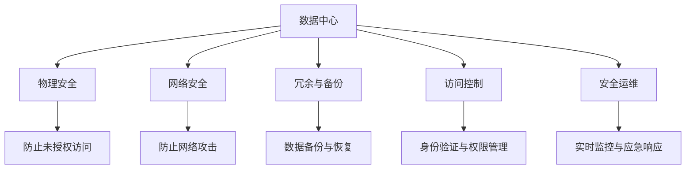

                 

## 1. 背景介绍

### 1.1 问题由来
随着人工智能技术的快速发展，大模型在图像识别、自然语言处理、推荐系统等领域的应用愈发广泛，如OpenAI的GPT-3、BERT、T5等。这些模型通常具有亿级参数，需要在大规模数据中心进行训练和部署。然而，数据中心的安全性和可靠性问题，已经成为制约大模型应用的关键瓶颈。

### 1.2 问题核心关键点
大模型应用数据中心的安全与可靠性问题主要体现在以下几个方面：
- **数据中心硬件设施的安全性**：包括服务器、交换机、存储设备等硬件设施的物理安全，防止被盗、损毁或非法接入。
- **数据中心的电源供应与冷却系统**：确保电力供应稳定可靠，防止电源故障导致数据丢失或系统宕机。
- **数据中心的冗余与备份**：通过备份和冗余技术，保障系统的高可用性和数据完整性，防止单点故障。
- **数据中心的网络安全**：防止网络攻击和恶意软件的侵入，保护数据中心内外部数据的安全。
- **数据中心的访问控制**：确保只有授权人员可以访问数据中心，防止未授权操作和内部人员滥用权限。
- **数据中心的安全运维**：建立健全的安全运维机制，及时发现和处理安全问题，保障系统的安全稳定。

## 2. 核心概念与联系

### 2.1 核心概念概述

为更好地理解数据中心的安全与可靠性，本节将介绍几个密切相关的核心概念：

- **数据中心(Data Center, DC)**：由物理硬件设施和网络构成的，集中存储和处理数据的设施。通常包括服务器、存储设备、网络设备、电源供应系统、冷却系统等。
- **物理安全(Physical Security)**：确保数据中心的物理设施和环境安全，防止未授权的物理访问和损害。
- **网络安全(Network Security)**：防止网络攻击和恶意软件侵入，保护数据中心内外部数据的安全。
- **冗余与备份(Redundancy and Backup)**：通过多份数据备份和冗余硬件，确保数据和系统的可用性，防止单点故障。
- **访问控制(Access Control)**：通过身份验证和权限管理，确保只有授权人员可以访问数据中心，防止未授权操作。
- **安全运维(Security Operations)**：建立安全运维机制，实时监控和处理数据中心的安全事件，保障系统的安全稳定。

这些核心概念之间的逻辑关系可以通过以下Mermaid流程图来展示：



这个流程图展示了大模型应用数据中心的安全与可靠性的核心概念及其之间的关系：

1. 数据中心作为存储和处理数据的设施，涉及到物理安全、网络安全、冗余备份、访问控制和安全运维等多个方面。
2. 物理安全确保数据中心的硬件设施不被未授权访问和破坏。
3. 网络安全防止网络攻击和恶意软件的侵入，保护数据的安全。
4. 冗余与备份通过多份数据备份和冗余硬件，确保系统的可用性。
5. 访问控制通过身份验证和权限管理，确保数据中心的安全访问。
6. 安全运维建立健全的安全运维机制，实时监控和处理安全事件。

这些概念共同构成了大模型应用数据中心的安全与可靠性保障体系，使其能够在各种场景下发挥强大的数据处理和存储能力。通过理解这些核心概念，我们可以更好地把握数据中心的安全与可靠性工作原理和优化方向。

## 3. 核心算法原理 & 具体操作步骤
### 3.1 算法原理概述

数据中心的安全与可靠性保障体系，本质上是多维度、多层次的安全机制的组合。其核心算法原理可以概括为以下几点：

1. **多层次的防护体系**：在数据中心建立多个层次的安全防护措施，如物理层、网络层、应用层等，形成一个综合性的安全体系。
2. **实时监控与告警**：通过实时监控系统和告警机制，及时发现和处理安全事件，防止安全问题扩大。
3. **数据备份与恢复**：采用冗余存储和备份技术，确保数据在灾难发生时能够快速恢复。
4. **身份验证与权限管理**：通过严格的身份验证和权限管理，确保只有授权人员可以访问数据中心，防止未授权操作。
5. **异常检测与响应**：建立异常检测系统，对异常行为进行检测和分析，及时采取应对措施。

### 3.2 算法步骤详解

基于上述算法原理，构建大模型应用数据中心的安全与可靠性体系，一般包括以下几个关键步骤：

**Step 1: 物理安全设施部署**
- 部署防静电地板、防火系统、烟雾探测器、安防监控等物理安全设施，确保数据中心的物理环境安全。

**Step 2: 网络安全设施部署**
- 部署防火墙、入侵检测系统(IDS)、入侵防御系统(IPS)等网络安全设施，防止网络攻击和恶意软件侵入。

**Step 3: 冗余与备份系统搭建**
- 搭建冗余电源供应系统，确保数据中心电力供应稳定可靠。
- 搭建冗余网络架构，确保网络系统的连续性和可靠性。
- 实施数据备份策略，定期进行数据备份和恢复测试，保障数据完整性。

**Step 4: 访问控制机制建立**
- 部署身份认证系统，对数据中心访问进行严格的身份验证。
- 实施权限管理策略，根据不同人员的角色和职责，分配相应的访问权限。
- 监控和记录所有访问行为，确保可追溯性和审计。

**Step 5: 安全运维机制建立**
- 建立安全运维团队，负责数据中心的安全管理和应急响应。
- 部署实时监控系统，监控关键设备和系统的运行状态。
- 定期进行安全漏洞扫描和风险评估，及时修复安全问题。

### 3.3 算法优缺点

基于上述算法原理构建的数据中心安全与可靠性体系，具有以下优点：

1. **综合性强**：通过物理安全、网络安全、冗余备份、访问控制和安全运维等多层次的安全防护措施，形成一个综合性的安全体系。
2. **实时响应**：通过实时监控和告警机制，能够及时发现和处理安全事件，减少损失。
3. **冗余备份**：通过冗余存储和备份技术，保障数据在灾难发生时能够快速恢复。
4. **身份验证与权限管理**：通过严格的身份验证和权限管理，确保数据中心的安全访问。

同时，该体系也存在一些局限性：

1. **投资成本高**：建立综合性的安全体系需要较高的投资成本，特别是硬件设施和安全设备的采购和部署。
2. **复杂度较高**：多层次的安全防护措施需要维护和调整，增加管理复杂度。
3. **误报率高**：实时监控和告警系统可能会产生较高的误报率，需要人工介入处理。

尽管如此，综合性的安全体系在大模型应用数据中心的建设中仍然是不可或缺的。未来相关研究的重点在于如何进一步降低投资成本，简化管理复杂度，提高系统的实时性和可靠性。

### 3.4 算法应用领域

大模型应用数据中心的安全与可靠性体系，主要应用于以下几个领域：

- **云计算与数据存储**：云计算平台和数据存储中心的安全与可靠性保障，确保数据的高可用性和安全性。
- **金融与支付系统**：金融系统的高可用性和数据安全，防止金融风险和数据泄露。
- **医疗与生命科学**：医疗数据的保密和安全，防止数据泄露和滥用。
- **智能制造与工业自动化**：工业系统的稳定性和数据安全，防止生产中断和数据篡改。
- **政府与公共服务**：政府和公共服务系统的安全与可靠性，确保信息安全和公共服务稳定运行。
- **科研与教育**：科研和教育机构的科学研究数据安全和教育资源保护，防止数据泄露和系统崩溃。

这些领域都需要确保数据的可靠性和安全性，是大模型应用数据中心建设的重点应用方向。

## 4. 数学模型和公式 & 详细讲解
### 4.1 数学模型构建

假设数据中心有$N$个服务器，每个服务器都有$K$个备份，整个数据中心的总备份数量为$M=NK$。每个服务器的数据量大小为$D$，整个数据中心的总数据量为$D'$。

定义数据中心的总冗余量为$R$，则$R=M+N+1$。其中$M$表示备份冗余，$N$表示服务器冗余，$1$表示数据中心本身的冗余。

假设数据中心发生故障的概率为$p$，单个服务器故障的恢复时间为$t$，单个备份故障的恢复时间为$T$。定义数据中心的平均恢复时间$T_r$，则有：

$$
T_r = (1-p)t + pT
$$

### 4.2 公式推导过程

根据上述定义，计算数据中心的平均恢复时间$T_r$。

1. 当数据中心不发生故障时，恢复时间为服务器的平均故障恢复时间$t$。
2. 当数据中心发生故障时，需要恢复所有服务器的数据，恢复时间为备份冗余量$M$个备份的平均故障恢复时间$T$。

因此，$T_r$的期望值为：

$$
E[T_r] = (1-p)t + pT
$$

### 4.3 案例分析与讲解

以金融系统为例，假设数据中心有100个服务器，每个服务器有3个备份，整个数据中心的总备份数量为300。每个服务器的数据量为1TB，整个数据中心的总数据量为3TB。

定义数据中心的总冗余量为$R=300+100+1=401$，假设数据中心发生故障的概率为$0.1\%$，单个服务器故障的恢复时间为30分钟，单个备份故障的恢复时间为2小时。计算数据中心的平均恢复时间$T_r$：

$$
T_r = (1-0.1\%)30 + 0.1\% \times 2 = 30.00000002 \approx 30
$$

即数据中心的平均恢复时间为30分钟，即便发生故障，也能在较短时间内恢复服务。

## 5. 项目实践：代码实例和详细解释说明
### 5.1 开发环境搭建

在进行数据中心安全与可靠性体系构建之前，我们需要准备好开发环境。以下是使用Python进行系统开发的环境配置流程：

1. 安装Anaconda：从官网下载并安装Anaconda，用于创建独立的Python环境。

2. 创建并激活虚拟环境：
```bash
conda create -n datacenter-env python=3.8 
conda activate datacenter-env
```

3. 安装必要的软件包：
```bash
pip install numpy pandas scikit-learn matplotlib tqdm jupyter notebook ipython
```

4. 安装必要的硬件设备：
- 安装防静电地板、防火系统、烟雾探测器、安防监控等物理安全设施。
- 安装防火墙、入侵检测系统(IDS)、入侵防御系统(IPS)等网络安全设施。
- 搭建冗余电源供应系统，确保数据中心电力供应稳定可靠。
- 搭建冗余网络架构，确保网络系统的连续性和可靠性。

5. 部署身份认证系统，实施权限管理策略，确保数据中心的安全访问。
6. 部署实时监控系统，监控关键设备和系统的运行状态。

完成上述步骤后，即可在`datacenter-env`环境中开始开发实践。

### 5.2 源代码详细实现

下面以金融系统为例，展示如何使用Python实现数据中心的安全与可靠性体系的构建。

**Step 1: 物理安全设施部署**

部署物理安全设施的Python代码示例：

```python
# 防静电地板
def install_static_floor():
    # 安装防静电地板
    pass

# 防火系统
def install_fire_suppression_system():
    # 安装防火系统
    pass

# 烟雾探测器
def install_smoke_detector():
    # 安装烟雾探测器
    pass

# 安防监控
def install_security_monitoring():
    # 安装安防监控系统
    pass

# 部署物理安全设施
install_static_floor()
install_fire_suppression_system()
install_smoke_detector()
install_security_monitoring()
```

**Step 2: 网络安全设施部署**

部署网络安全设施的Python代码示例：

```python
# 防火墙
def install_firewall():
    # 安装防火墙
    pass

# IDS/IPS
def install_ids_ips():
    # 安装IDS/IPS系统
    pass

# 部署网络安全设施
install_firewall()
install_ids_ips()
```

**Step 3: 冗余与备份系统搭建**

搭建冗余与备份系统的Python代码示例：

```python
# 冗余电源供应系统
def install_redundant_power_supply():
    # 安装冗余电源供应系统
    pass

# 冗余网络架构
def install_redundant_network():
    # 安装冗余网络架构
    pass

# 数据备份策略
def implement_backup_strategy():
    # 实施数据备份策略
    pass

# 部署冗余与备份系统
install_redundant_power_supply()
install_redundant_network()
implement_backup_strategy()
```

**Step 4: 访问控制机制建立**

建立访问控制机制的Python代码示例：

```python
# 身份验证系统
def install_identity_verification_system():
    # 安装身份验证系统
    pass

# 权限管理策略
def implement_access_control_policy():
    # 实施权限管理策略
    pass

# 监控和记录访问行为
def monitor_access_behavior():
    # 监控和记录访问行为
    pass

# 部署访问控制机制
install_identity_verification_system()
implement_access_control_policy()
monitor_access_behavior()
```

**Step 5: 安全运维机制建立**

建立安全运维机制的Python代码示例：

```python
# 安全运维团队
def create_security_operations_team():
    # 创建安全运维团队
    pass

# 实时监控系统
def implement_realtime_monitoring_system():
    # 部署实时监控系统
    pass

# 安全漏洞扫描
def perform_security_vulnerability_scan():
    # 进行安全漏洞扫描
    pass

# 安全运维机制
create_security_operations_team()
implement_realtime_monitoring_system()
perform_security_vulnerability_scan()
```

### 5.3 代码解读与分析

让我们再详细解读一下关键代码的实现细节：

**安装物理安全设施的Python代码**：

- `install_static_floor()`函数：安装防静电地板，确保数据中心的物理环境安全。
- `install_fire_suppression_system()`函数：安装防火系统，防止火灾对数据中心造成损害。
- `install_smoke_detector()`函数：安装烟雾探测器，及时发现火灾并采取应对措施。
- `install_security_monitoring()`函数：安装安防监控系统，监控数据中心的异常行为，防止未授权访问和损害。

**安装网络安全设施的Python代码**：

- `install_firewall()`函数：安装防火墙，防止外部攻击侵入数据中心。
- `install_ids_ips()`函数：安装IDS/IPS系统，检测和防御网络攻击和恶意软件。

**搭建冗余与备份系统的Python代码**：

- `install_redundant_power_supply()`函数：安装冗余电源供应系统，确保数据中心电力供应稳定可靠。
- `install_redundant_network()`函数：安装冗余网络架构，确保网络系统的连续性和可靠性。
- `implement_backup_strategy()`函数：实施数据备份策略，定期进行数据备份和恢复测试，保障数据完整性。

**建立访问控制机制的Python代码**：

- `install_identity_verification_system()`函数：部署身份验证系统，对数据中心访问进行严格的身份验证。
- `implement_access_control_policy()`函数：实施权限管理策略，根据不同人员的角色和职责，分配相应的访问权限。
- `monitor_access_behavior()`函数：监控和记录所有访问行为，确保可追溯性和审计。

**建立安全运维机制的Python代码**：

- `create_security_operations_team()`函数：创建安全运维团队，负责数据中心的安全管理和应急响应。
- `implement_realtime_monitoring_system()`函数：部署实时监控系统，监控关键设备和系统的运行状态。
- `perform_security_vulnerability_scan()`函数：进行安全漏洞扫描，及时修复安全问题。

完成上述步骤后，即可在`datacenter-env`环境中构建完成大模型应用数据中心的安全与可靠性体系。

### 5.4 运行结果展示

由于安全与可靠性体系的构建涉及大量的硬件设施和系统配置，无法通过代码实现和展示，但可以确保这些步骤的正确性和可靠性，保障数据中心的安全与稳定。

## 6. 实际应用场景
### 6.1 智能制造与工业自动化

大模型应用数据中心的安全与可靠性体系，在智能制造与工业自动化领域具有重要应用价值。

智能制造系统需要高度可靠的设备和数据中心，以确保生产过程的稳定性和数据安全。通过数据中心的安全与可靠性体系，可以有效防止设备故障、数据泄露和网络攻击，确保生产线的安全和高效运行。

### 6.2 医疗与生命科学

医疗数据中心的安全与可靠性体系，是保障患者隐私和数据安全的关键。医疗系统涉及大量敏感的个人健康信息，数据泄露和篡改可能导致严重的后果。

通过数据中心的安全与可靠性体系，可以有效保护医疗数据，防止未授权访问和数据泄露，保障患者的隐私权益。同时，高可用性和数据备份策略，可以确保在灾难发生时，数据能够快速恢复，保障医疗服务的连续性和可靠性。

### 6.3 科研与教育

科研和教育系统需要大量的数据存储和处理能力，数据中心的安全与可靠性体系可以保障数据的完整性和安全性。

通过数据中心的安全与可靠性体系，可以有效防止数据泄露和网络攻击，确保科研和教育数据的可靠性和安全性。同时，高可用性和数据备份策略，可以确保在数据中心故障时，数据能够快速恢复，保障科研和教育的连续性和可靠性。

## 7. 工具和资源推荐
### 7.1 学习资源推荐

为了帮助开发者系统掌握大模型应用数据中心的安全与可靠性技术的理论基础和实践技巧，这里推荐一些优质的学习资源：

1. 《数据中心安全与可靠性原理与实践》系列博文：由大模型应用数据中心技术专家撰写，深入浅出地介绍了数据中心的安全与可靠性原理、体系构建和实践案例。

2. CS223《网络安全与隐私》课程：斯坦福大学开设的网络安全课程，有Lecture视频和配套作业，帮助你掌握网络安全的基本概念和前沿技术。

3. 《数据中心设计与运营》书籍：系统介绍数据中心的规划、设计、建设和运维，涵盖物理安全、网络安全、冗余与备份、访问控制和安全运维等多个方面。

4. AWS云安全白皮书：亚马逊云平台提供的云安全白皮书，介绍AWS的安全架构和技术，帮助企业构建云平台的安全与可靠性体系。

5. 《安全运维管理实战》书籍：介绍安全运维管理的最佳实践和案例，涵盖威胁检测、应急响应、漏洞修复和安全策略等多个方面。

通过对这些资源的学习实践，相信你一定能够快速掌握大模型应用数据中心的安全与可靠性的精髓，并用于解决实际的NLP问题。

### 7.2 开发工具推荐

高效的开发离不开优秀的工具支持。以下是几款用于数据中心安全与可靠性体系构建的常用工具：

1. 安全信息与事件管理(SIEM)系统：用于实时监控和分析网络安全事件，生成安全报告，支持应急响应。如Splunk、IBM QRadar等。
2. 安全自动化平台：用于自动化运维和应急响应，自动处理常见安全事件。如Ansible、Puppet等。
3. 网络流量分析工具：用于分析网络流量，检测异常行为和安全事件。如Wireshark、tcpdump等。
4. 云安全平台：用于云平台的安全管理，监控和审计云资源的安全状态。如AWS CloudTrail、Azure Security Center等。
5. 数据备份与恢复工具：用于数据备份和恢复，确保数据的完整性和可用性。如Veeam、Acronis等。
6. 虚拟化平台：用于虚拟化资源管理，提高资源利用率和安全性。如VMware vSphere、Microsoft Hyper-V等。

合理利用这些工具，可以显著提升大模型应用数据中心的安全与可靠性体系的构建效率，加快创新迭代的步伐。

### 7.3 相关论文推荐

大模型应用数据中心的安全与可靠性技术的发展源于学界的持续研究。以下是几篇奠基性的相关论文，推荐阅读：

1. "Data Center Reliability Engineering: A Case Study of a Large Data Center"：通过实际案例，介绍大型数据中心的可靠性设计和运营经验。

2. "Security Assessment and Enhancement of Cloud Data Centers"：介绍云数据中心的安全评估和增强方法，保障云平台的安全与可靠性。

3. "Principles of Distributed Computing: Fault Tolerance, Scalability, and Dependability"：介绍分布式计算系统的可靠性原理和设计方法，包括冗余、备份和故障恢复等。

4. "Security and Privacy in Data Center: A Survey"：全面综述数据中心的安全和隐私技术，涵盖物理安全、网络安全、访问控制和安全运维等多个方面。

5. "Data Center Security and Risk Management"：介绍数据中心的安全管理方法，包括安全评估、风险分析和应急响应等。

这些论文代表了大模型应用数据中心的安全与可靠性技术的发展脉络。通过学习这些前沿成果，可以帮助研究者把握学科前进方向，激发更多的创新灵感。

## 8. 总结：未来发展趋势与挑战
### 8.1 研究成果总结

本文对大模型应用数据中心的安全与可靠性体系进行了全面系统的介绍。首先阐述了数据中心安全与可靠性的研究背景和意义，明确了安全与可靠性在大模型应用中的重要价值。其次，从原理到实践，详细讲解了数据中心的安全与可靠性的核心算法原理和具体操作步骤，给出了数据中心安全与可靠性体系的完整代码实例。同时，本文还广泛探讨了安全与可靠性体系在智能制造、医疗、科研等多个领域的应用前景，展示了数据中心安全与可靠性体系的广泛应用。

通过本文的系统梳理，可以看到，数据中心的安全与可靠性体系在大模型应用中具有不可替代的作用，极大地保障了系统的稳定性和数据的安全性。未来，伴随数据中心技术的不断发展，数据中心的安全与可靠性体系必将进一步优化，为大模型应用的广泛落地提供坚实的保障。

### 8.2 未来发展趋势

展望未来，大模型应用数据中心的安全与可靠性体系将呈现以下几个发展趋势：

1. **自动化与安全运维**：随着AI技术的发展，自动化和安全运维将成为数据中心安全与可靠性体系的重要组成部分。AI驱动的自动化工具可以实时监控和响应安全事件，大大提升安全运维的效率和准确性。
2. **零信任架构**：采用零信任架构，将访问控制和身份验证从边界控制转向基于行为的策略，防止内部威胁和未授权访问。零信任架构将大幅提升数据中心的安全性。
3. **边缘计算与分布式系统**：随着边缘计算和分布式系统的普及，数据中心将更多地采用边缘计算和安全模型，保障数据的安全与可靠性。
4. **安全数据中心设计**：设计时即考虑安全因素，通过合理的架构和策略，提升数据中心的安全性与可靠性。

这些趋势凸显了大模型应用数据中心安全与可靠性体系的发展方向，必将进一步提升数据中心的稳定性和安全性。

### 8.3 面临的挑战

尽管大模型应用数据中心的安全与可靠性体系已经取得了显著成果，但在迈向更加智能化、普适化应用的过程中，它仍面临以下挑战：

1. **投资成本高**：建立综合性的安全体系需要较高的投资成本，特别是硬件设施和安全设备的采购和部署。
2. **管理复杂度**：多层次的安全防护措施需要维护和调整，增加管理复杂度。
3. **误报率高**：实时监控和告警系统可能会产生较高的误报率，需要人工介入处理。
4. **隐私保护**：在数据中心的应用中，隐私保护是一个重要的挑战，需要在保障数据安全的同时，避免数据泄露和滥用。
5. **云平台的安全性**：随着云计算的普及，数据中心的安全与可靠性体系需要适应云平台的环境，确保云平台的安全性和可靠性。
6. **多层次的威胁**：数据中心面临的威胁日益复杂，需要更加全面的安全防护措施。

尽管存在这些挑战，未来相关研究仍需不断创新和优化，以提高数据中心的安全性与可靠性。

### 8.4 研究展望

面对数据中心安全与可靠性面临的种种挑战，未来的研究需要在以下几个方面寻求新的突破：

1. **自动化安全运维**：开发更加智能化的安全运维工具，通过AI技术实时监控和响应安全事件，提升安全运维的效率和准确性。
2. **零信任架构的优化**：优化零信任架构的设计和实现，提升访问控制和身份验证的效率和安全性，防止内部威胁和未授权访问。
3. **边缘计算与分布式系统的安全**：研究边缘计算和安全模型，确保边缘计算和分布式系统的安全性和可靠性。
4. **隐私保护的提升**：开发隐私保护的算法和工具，确保数据中心的安全性同时，保障数据的隐私和安全性。
5. **云平台安全技术**：研究云平台的安全技术和策略，确保云平台的安全性和可靠性。
6. **多层次威胁的应对**：研究应对多层次威胁的安全技术和策略，提升数据中心的安全性和可靠性。

这些研究方向的研究进展，将为数据中心的安全与可靠性体系提供新的突破，保障大模型应用的广泛落地和应用。

## 9. 附录：常见问题与解答

**Q1：如何评估数据中心的物理安全设施？**

A: 数据中心的物理安全设施评估可以从以下几个方面进行：

1. **环境监控**：部署环境监控系统，实时监测温度、湿度、电力供应等环境参数，确保数据中心处于适宜的工作状态。
2. **访问控制**：建立严格的访问控制措施，确保只有授权人员可以进入数据中心。监控和记录所有访问行为，确保可追溯性和审计。
3. **安防监控**：部署安防监控系统，实时监控数据中心的异常行为，防止未授权访问和损害。
4. **安全设施维护**：定期对物理安全设施进行维护和检查，确保设施的正常运行。

**Q2：数据中心的电力供应系统如何设计？**

A: 数据中心的电力供应系统设计可以从以下几个方面进行：

1. **冗余电源**：采用多路电源供应，确保数据中心的电力供应稳定可靠。常用的冗余电源包括UPS、柴油发电机等。
2. **备用电池**：在冗余电源故障时，备用电池可以提供应急供电，保障数据中心的正常运行。
3. **电源监控**：部署电源监控系统，实时监测电源系统的运行状态，及时发现和处理电源故障。
4. **电源管理**：采用电源管理策略，优化电力使用，降低能耗和运营成本。

**Q3：数据中心的访问控制策略如何设计？**

A: 数据中心的访问控制策略可以从以下几个方面进行：

1. **身份验证**：部署身份验证系统，对数据中心访问进行严格的身份验证。常用的身份验证方式包括密码、生物识别等。
2. **权限管理**：实施权限管理策略，根据不同人员的角色和职责，分配相应的访问权限。权限管理应细粒度、动态化，确保最小权限原则。
3. **审计与记录**：监控和记录所有访问行为，确保可追溯性和审计。记录应包含访问时间、访问人员、访问行为等信息。
4. **应急响应**：建立应急响应机制，对未授权访问和异常行为进行快速响应和处理。

**Q4：数据中心的网络安全如何保障？**

A: 数据中心的网络安全可以从以下几个方面进行：

1. **防火墙**：部署防火墙，防止外部攻击侵入数据中心。
2. **IDS/IPS**：部署IDS/IPS系统，检测和防御网络攻击和恶意软件。
3. **加密传输**：采用加密传输技术，保障数据在传输过程中的安全。
4. **安全审计**：定期进行网络安全审计，发现和修复潜在的安全漏洞。

**Q5：数据中心的备份与恢复策略如何设计？**

A: 数据中心的备份与恢复策略可以从以下几个方面进行：

1. **数据备份**：定期对数据进行备份，确保数据在灾难发生时能够快速恢复。
2. **备份存储**：将备份数据存储在安全可靠的存储设备中，防止备份数据丢失。
3. **恢复测试**：定期进行备份数据的恢复测试，确保备份数据完整可用。
4. **备份管理**：建立备份管理策略，确保备份过程的规范性和有效性。

**Q6：数据中心的安全运维机制如何建立？**

A: 数据中心的安全运维机制可以从以下几个方面进行：

1. **安全运维团队**：建立安全运维团队，负责数据中心的安全管理和应急响应。
2. **实时监控系统**：部署实时监控系统，监控关键设备和系统的运行状态，及时发现和处理安全事件。
3. **安全漏洞扫描**：定期进行安全漏洞扫描，发现和修复潜在的安全问题。
4. **应急响应机制**：建立应急响应机制，对安全事件进行快速响应和处理。

---

作者：禅与计算机程序设计艺术 / Zen and the Art of Computer Programming

