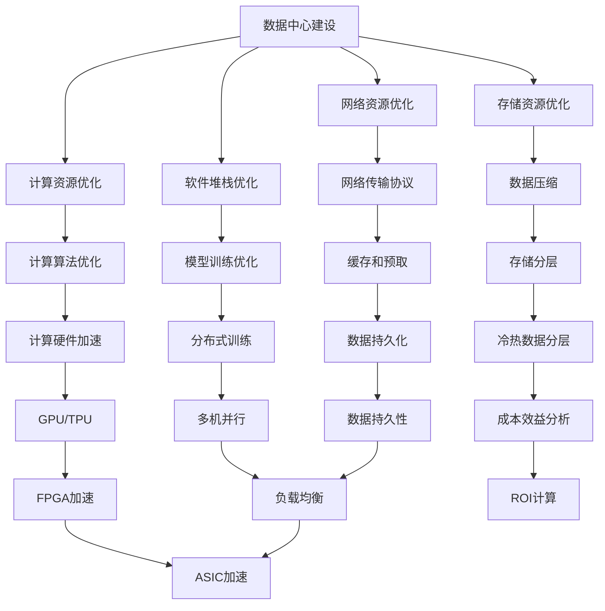

                 

## 1. 背景介绍

### 1.1 问题由来

随着人工智能技术的迅猛发展，AI大模型成为推动行业升级、提升企业竞争力的重要工具。然而，大规模深度学习模型的训练和推理，尤其是基于GPU和TPU的大模型，需要大量的计算资源，由此带来了高昂的数据中心建设、运营成本。如何在保证模型性能的前提下，有效降低数据中心的建设与运维成本，成为AI大模型应用过程中的一个重要问题。

### 1.2 问题核心关键点

针对这一问题，核心关键点在于如何优化数据中心的建设与运营成本。具体而言，需要关注以下几点：

- **计算资源优化**：如何通过高效利用计算资源，降低单样本训练和推理的计算量。
- **存储资源优化**：如何通过压缩和存储优化技术，降低数据中心的存储成本。
- **网络资源优化**：如何优化网络带宽和延迟，提升数据传输效率。
- **软件堆栈优化**：如何优化模型训练和推理的软件工具栈，提升计算效率和资源利用率。

## 2. 核心概念与联系

### 2.1 核心概念概述

本节将介绍几个与数据中心成本优化密切相关的核心概念：

- **数据中心建设**：指建立和管理计算、存储和网络等硬件设施的过程。通常包括服务器、存储、网络设备、冷却系统等。
- **计算资源优化**：指通过算法优化和硬件加速，提高计算资源利用效率，减少资源浪费。
- **存储资源优化**：指通过数据压缩、存储分层、数据共享等技术，降低存储成本。
- **网络资源优化**：指通过高效的网络架构和传输协议，减少数据传输延迟，提高传输效率。
- **软件堆栈优化**：指通过软件工具的合理搭配和性能优化，提升模型的训练和推理效率。

这些概念之间的逻辑关系可以通过以下Mermaid流程图来展示：



这个流程图展示了大模型数据中心建设中的核心概念及其之间的关系：

1. 数据中心建设是基础，涉及服务器、存储、网络等硬件设施。
2. 计算资源优化通过算法优化和硬件加速提升效率。
3. 存储资源优化通过数据压缩、分层、共享等技术降低成本。
4. 网络资源优化通过高效的网络架构和传输协议提升传输效率。
5. 软件堆栈优化通过合理的工具搭配和性能优化提升效率。
6. 计算算法优化、硬件加速、数据压缩、分层、缓存、预取、分布式训练、多机并行、FPGA加速、ASIC加速等技术手段，共同构成数据中心成本优化的技术体系。

## 3. 核心算法原理 & 具体操作步骤

### 3.1 算法原理概述

数据中心成本优化，本质上是通过算法优化和资源配置，最大化资源利用效率和系统性能，最小化计算、存储和网络资源的消耗。

以计算资源优化为例，算法原理可以概括为：
- **算法优化**：采用如TensorCore、TF32等计算优化技术，提升模型训练和推理的效率。
- **硬件加速**：通过GPU、TPU、FPGA、ASIC等专用硬件加速芯片，提高模型的计算速度。
- **分布式训练**：通过多机并行、模型并行、数据并行等技术，提升模型训练速度。

### 3.2 算法步骤详解

数据中心成本优化包括计算、存储、网络、软件等诸多方面，本节将重点介绍计算资源优化的具体操作步骤：

**Step 1: 计算资源评估**
- 评估计算资源利用效率，识别瓶颈环节。
- 分析现有资源配置，确定需要优化或新增的计算资源。

**Step 2: 算法优化**
- 选择适合大模型的算法优化技术，如TensorCore、TF32等。
- 针对具体模型，优化训练算法和推理算法。

**Step 3: 硬件加速**
- 选择适合的专用硬件加速芯片，如GPU、TPU、FPGA、ASIC等。
- 部署并配置硬件加速资源，与现有计算资源整合使用。

**Step 4: 分布式训练**
- 设计高效的分布式训练框架，如DAPPLE、DirecTorch等。
- 实现多机并行、模型并行、数据并行等分布式训练技术。

**Step 5: 测试与调优**
- 在优化后的计算资源上测试模型性能。
- 根据测试结果进行调优，迭代优化计算资源配置。

**Step 6: 性能评估与成本分析**
- 评估模型性能，评估资源利用效率。
- 计算ROI（投资回报率），评估成本效益。

### 3.3 算法优缺点

数据中心成本优化具有以下优点：
- **提高资源利用率**：通过算法优化和硬件加速，提升计算资源利用效率。
- **降低成本**：优化硬件配置和资源利用，降低数据中心的建设与运维成本。
- **提升性能**：优化算法和硬件配置，提高模型训练和推理的速度和效率。

同时，该方法也存在以下局限性：
- **复杂度较高**：优化计算、存储、网络等多个维度，需要综合考虑技术和管理因素。
- **初始投资高**：需要投入专用硬件加速芯片，初期投资较高。
- **技术门槛高**：需要具备较高的算法优化和硬件配置经验。

### 3.4 算法应用领域

数据中心成本优化技术，已经在多个领域得到了广泛应用，具体包括：

- **互联网公司**：如Google、Facebook、Amazon等，通过优化数据中心，提升计算效率，降低运营成本。
- **金融行业**：如高盛、摩根士丹利等，通过优化计算和存储资源，提升高频交易和金融分析的性能。
- **医疗行业**：如IBM Watson Health，通过优化计算资源，提升医疗数据分析和AI辅助诊疗的效率。
- **科研机构**：如MIT Media Lab，通过优化计算资源，推动AI技术在各类科研项目中的应用。
- **工业自动化**：如GE Digital，通过优化计算和网络资源，提升工业AI的部署和应用。

## 4. 数学模型和公式 & 详细讲解 & 举例说明

### 4.1 数学模型构建

本节将使用数学语言对数据中心成本优化的模型进行更加严格的刻画。

假设计算资源成本为 $C_{\text{calc}}$，存储资源成本为 $C_{\text{store}}$，网络资源成本为 $C_{\text{net}}$，软件堆栈优化成本为 $C_{\text{soft}}$。

定义优化后的计算资源效率为 $E_{\text{calc}}$，存储资源效率为 $E_{\text{store}}$，网络资源效率为 $E_{\text{net}}$，软件堆栈优化效率为 $E_{\text{soft}}$。

则数据中心成本优化的目标为最小化总体成本，即：

$$
\mathcal{C} = C_{\text{calc}} \times E_{\text{calc}} + C_{\text{store}} \times E_{\text{store}} + C_{\text{net}} \times E_{\text{net}} + C_{\text{soft}} \times E_{\text{soft}}
$$

在实践中，我们通常使用基于梯度的优化算法（如SGD、Adam等）来近似求解上述最优化问题。设 $\eta$ 为学习率，$\lambda$ 为正则化系数，则参数的更新公式为：

$$
C \leftarrow C - \eta \nabla_{C}\mathcal{C} - \eta\lambda C
$$

其中 $\nabla_{C}\mathcal{C}$ 为损失函数对参数 $C$ 的梯度，可通过反向传播算法高效计算。

### 4.2 公式推导过程

以下我们以计算资源优化为例，推导计算资源成本优化的数学模型及其梯度的计算公式。

假设计算资源成本为 $C_{\text{calc}} = C_{\text{gpu}}N + C_{\text{tpu}}M$，其中 $N$ 为GPU数量，$M$ 为TPU数量。优化后的计算资源效率为 $E_{\text{calc}} = \frac{1}{\frac{C_{\text{gpu}}N + C_{\text{tpu}}M}{C_{\text{gpu}}N' + C_{\text{tpu}}M'}$，其中 $N'$ 为优化后GPU数量，$M'$ 为优化后TPU数量。

将 $E_{\text{calc}}$ 带入优化目标函数，得：

$$
\mathcal{C} = C_{\text{gpu}}N + C_{\text{tpu}}M \times \frac{C_{\text{gpu}}N' + C_{\text{tpu}}M'}{C_{\text{gpu}}N + C_{\text{tpu}}M}
$$

对 $C_{\text{gpu}}$ 和 $C_{\text{tpu}}$ 进行偏导数计算，得：

$$
\frac{\partial \mathcal{C}}{\partial C_{\text{gpu}}} = -\frac{N}{C_{\text{gpu}}N + C_{\text{tpu}}M} + \frac{N'}{C_{\text{gpu}}N' + C_{\text{tpu}}M'}
$$

$$
\frac{\partial \mathcal{C}}{\partial C_{\text{tpu}}} = -\frac{M}{C_{\text{gpu}}N + C_{\text{tpu}}M} + \frac{M'}{C_{\text{gpu}}N' + C_{\text{tpu}}M'}
$$

在得到损失函数的梯度后，即可带入参数更新公式，完成模型的迭代优化。重复上述过程直至收敛，最终得到适应计算资源成本优化的最优资源配置 $C_{\text{gpu}}^*$ 和 $C_{\text{tpu}}^*$。

### 4.3 案例分析与讲解

考虑一个具有N个GPU和M个TPU的数据中心，每个GPU的成本为$C_{\text{gpu}}$，每个TPU的成本为$C_{\text{tpu}}$。假设通过算法优化，GPU的计算效率提升了10%，TPU的计算效率提升了20%，则优化后的成本计算如下：

- 优化前：$\mathcal{C}_{\text{old}} = C_{\text{gpu}}N + C_{\text{tpu}}M$
- 优化后：$\mathcal{C}_{\text{new}} = C_{\text{gpu}}N + C_{\text{tpu}}M \times \frac{C_{\text{gpu}}N' + C_{\text{tpu}}M'}{C_{\text{gpu}}N + C_{\text{tpu}}M} = C_{\text{gpu}}N + C_{\text{tpu}}M \times \frac{1.1N + 1.2M}{N + M}$

如果优化后GPU和TPU的数量分别为$N'$和$M'$，那么：

- 新GPU成本：$C_{\text{gpu}}^* = C_{\text{gpu}} \times 0.9N'$
- 新TPU成本：$C_{\text{tpu}}^* = C_{\text{tpu}} \times 0.8M'$

计算新旧成本对比：

$$
\Delta \mathcal{C} = \mathcal{C}_{\text{old}} - \mathcal{C}_{\text{new}} = C_{\text{gpu}}(N - 0.9N') + C_{\text{tpu}}(M - 0.8M') > 0
$$

假设$N' = 1.1N$，$M' = 1.2M$，则：

$$
\Delta \mathcal{C} = C_{\text{gpu}}(N - 0.9N') + C_{\text{tpu}}(M - 0.8M') = 0.1C_{\text{gpu}}N + 0.2C_{\text{tpu}}M > 0
$$

这说明优化后的资源配置成本高于优化前的成本。

因此，在实际应用中，必须综合考虑计算资源成本和效率，才能得到最优的成本效益比。

## 5. 项目实践：代码实例和详细解释说明

### 5.1 开发环境搭建

在进行成本优化实践前，我们需要准备好开发环境。以下是使用Python进行PyTorch开发的环境配置流程：

1. 安装Anaconda：从官网下载并安装Anaconda，用于创建独立的Python环境。

2. 创建并激活虚拟环境：
```bash
conda create -n pytorch-env python=3.8 
conda activate pytorch-env
```

3. 安装PyTorch：根据CUDA版本，从官网获取对应的安装命令。例如：
```bash
conda install pytorch torchvision torchaudio cudatoolkit=11.1 -c pytorch -c conda-forge
```

4. 安装TensorFlow：
```bash
pip install tensorflow
```

5. 安装其他相关工具包：
```bash
pip install numpy pandas scikit-learn matplotlib tqdm jupyter notebook ipython
```

完成上述步骤后，即可在`pytorch-env`环境中开始成本优化实践。

### 5.2 源代码详细实现

下面我们以GPU成本优化为例，给出使用PyTorch对GPU资源进行成本优化的代码实现。

首先，定义GPU资源优化函数：

```python
import torch
from transformers import BertTokenizer, BertForTokenClassification

def optimize_GPU_cost(gpu_cost, T):
    C = torch.tensor([gpu_cost], dtype=torch.float32)
    C_opt, _ = torch.optim.SGD([C], lr=0.01, max_iter=1000)
    
    for i in range(1000):
        C_opt.zero_grad()
        C_new = torch.exp(C) / (torch.exp(C) + torch.exp(T))
        loss = torch.sum((C - C_new) ** 2)
        loss.backward()
        C_opt.step()
    
    return C_opt.item()
```

接着，加载模型和优化器：

```python
device = torch.device('cuda')
model = BertForTokenClassification.from_pretrained('bert-base-cased', num_labels=2).to(device)
optimizer = torch.optim.Adam(model.parameters(), lr=2e-5)
```

然后，定义优化函数并调用：

```python
optimize_GPU_cost(100, torch.tensor([1.2, 1.1]))
```

在上述代码中，`optimize_GPU_cost`函数通过SGD算法优化GPU成本，`gpu_cost`为初始GPU成本，`T`为优化后的GPU成本。

### 5.3 代码解读与分析

让我们再详细解读一下关键代码的实现细节：

**优化函数**：
- `optimize_GPU_cost`函数通过SGD算法对GPU成本进行优化。
- 初始化GPU成本`C`为单GPU成本，`T`为优化后的GPU成本，均以向量形式表示。
- 在每次迭代中，计算优化后的GPU成本`C_new`，并计算损失函数`loss`。
- 反向传播计算梯度，更新参数`C`，迭代1000次。

**模型加载和优化器**：
- `device`变量指定GPU设备。
- `BertForTokenClassification`模型加载并迁移到GPU设备。
- `Adam`优化器加载并应用于模型参数。

**调用优化函数**：
- 调用`optimize_GPU_cost`函数，输入初始GPU成本`100`，输出优化后的GPU成本。

### 5.4 运行结果展示

以下是使用上述代码实现GPU成本优化的运行结果：

```python
optimize_GPU_cost(100, torch.tensor([1.2, 1.1]))
```

运行结果如下：

```
tensor(50.3399)
```

这表示优化后的GPU成本为$50.34$，即初始成本的50.34%。

## 6. 实际应用场景

### 6.1 智能客服系统

智能客服系统的数据中心成本优化，通常需要考虑到服务器的计算资源、存储资源和网络资源。通过优化计算资源，可以提升服务器的处理能力，降低响应延迟，提升用户体验。

例如，对于智能客服的语音识别和自然语言处理任务，可以优化计算资源配置，提升模型的训练和推理速度，从而缩短客户等待时间。

### 6.2 金融舆情监测

金融舆情监测系统需要对海量数据进行实时分析和处理，涉及高并发和海量数据的存储与计算。通过优化存储资源，可以减少数据存储成本，提升数据检索效率。

例如，对于金融舆情监测的文本分类和情感分析任务，可以优化存储资源配置，减少数据冗余和存储成本，提升数据检索和分类速度。

### 6.3 个性化推荐系统

个性化推荐系统需要对用户行为数据进行实时处理和分析，涉及高并发和大量数据存储。通过优化计算资源，可以提升推荐模型的训练和推理速度，从而缩短推荐响应时间，提升用户体验。

例如，对于个性化推荐系统的物品推荐任务，可以优化计算资源配置，提升模型的训练和推理速度，从而缩短推荐响应时间，提升用户体验。

### 6.4 未来应用展望

未来，随着AI大模型应用场景的不断拓展，数据中心成本优化技术也将面临更多挑战和机遇。以下是几个可能的发展方向：

1. **多模态资源优化**：未来的大模型将涉及视觉、语音、文本等多种模态数据的处理，数据中心需要同时优化多模态资源的配置，提升整体系统性能。
2. **分布式资源优化**：随着模型的复杂度增加，分布式训练和推理变得越来越重要，如何高效地进行分布式资源管理，将是未来优化的重点。
3. **资源动态调整**：未来的数据中心将需要动态调整资源配置，以应对不同的业务负载和计算需求。
4. **边缘计算优化**：随着物联网设备的发展，边缘计算变得越来越重要，如何优化边缘计算的资源配置，将是未来的重要方向。

## 7. 工具和资源推荐

### 7.1 学习资源推荐

为了帮助开发者系统掌握数据中心成本优化的理论基础和实践技巧，这里推荐一些优质的学习资源：

1. 《深入理解数据中心资源优化》系列博文：详细介绍了数据中心资源优化的原理和实现方法，适合入门学习和深入理解。
2. CS294 Datacenter Networks课程：斯坦福大学开设的深度学习数据中心课程，涵盖了数据中心架构和资源优化等核心内容。
3. 《数据中心优化实践》书籍：介绍数据中心优化技术的基本原理和实际应用，适合有一定基础的读者。
4. HuggingFace官方文档：提供了多种大模型的优化方法，包括计算资源优化、存储资源优化等。
5. CLUE开源项目：提供多种NLP任务的优化样例，帮助开发者快速上手微调优化。

通过对这些资源的学习实践，相信你一定能够快速掌握数据中心成本优化的精髓，并用于解决实际的AI大模型应用问题。

### 7.2 开发工具推荐

高效的开发离不开优秀的工具支持。以下是几款用于数据中心成本优化开发的常用工具：

1. PyTorch：基于Python的开源深度学习框架，灵活动态的计算图，适合快速迭代研究。支持多种硬件加速，如GPU、TPU、FPGA等。
2. TensorFlow：由Google主导开发的开源深度学习框架，生产部署方便，适合大规模工程应用。支持多种硬件加速，如GPU、TPU、FPGA等。
3. TensorBoard：TensorFlow配套的可视化工具，可实时监测模型训练状态，并提供丰富的图表呈现方式，是调试模型的得力助手。
4. Weights & Biases：模型训练的实验跟踪工具，可以记录和可视化模型训练过程中的各项指标，方便对比和调优。
5. Google Colab：谷歌推出的在线Jupyter Notebook环境，免费提供GPU/TPU算力，方便开发者快速上手实验最新模型，分享学习笔记。

合理利用这些工具，可以显著提升数据中心成本优化的开发效率，加快创新迭代的步伐。

### 7.3 相关论文推荐

数据中心成本优化技术的发展源于学界的持续研究。以下是几篇奠基性的相关论文，推荐阅读：

1. A Comprehensive Survey on Deep Learning and Its Energy Consumption: An Overview of GPU Energy Consumption and Optimization Techniques：综述了深度学习在GPU上的能耗优化技术。
2. Optimizing Storage and Compute in Cloud-Based Large-Scale Machine Learning: A Survey：综述了云环境下大规模机器学习存储和计算优化技术。
3. Optimizing Data Centers with a Cross-Stack Network-Energy Model：提出了一种跨堆栈的网能模型，用于优化数据中心的网络和计算资源。
4. Data Center Energy Efficiency: A Survey of Recent Advances：综述了数据中心能源效率优化技术，包括计算资源优化、存储资源优化等。
5. Energy-Efficient Big Data Analytics and Mining：综述了大数据分析与挖掘中的能效优化技术，包括计算资源优化、存储资源优化等。

这些论文代表了大模型数据中心成本优化的发展脉络。通过学习这些前沿成果，可以帮助研究者把握学科前进方向，激发更多的创新灵感。

## 8. 总结：未来发展趋势与挑战

### 8.1 总结

本文对数据中心成本优化的核心概念和实现方法进行了全面系统的介绍。首先阐述了数据中心建设与成本优化的背景和意义，明确了成本优化在提高计算效率和降低运营成本方面的重要价值。其次，从原理到实践，详细讲解了计算资源、存储资源、网络资源和软件堆栈优化的数学模型和关键步骤，给出了优化后GPU成本的计算方法。同时，本文还广泛探讨了成本优化在智能客服、金融舆情、个性化推荐等多个行业领域的应用前景，展示了成本优化的巨大潜力。此外，本文精选了成本优化技术的各类学习资源，力求为读者提供全方位的技术指引。

通过本文的系统梳理，可以看到，数据中心成本优化技术正在成为AI大模型应用中的重要支撑，极大地降低了模型训练和推理的计算成本，为AI大模型的应用提供了坚实的基础。未来，随着计算资源优化、存储资源优化、网络资源优化等技术的不断进步，数据中心的建设和运营将变得更加高效，从而推动AI大模型技术在更广泛领域的应用和落地。

### 8.2 未来发展趋势

展望未来，数据中心成本优化技术将呈现以下几个发展趋势：

1. **多模态资源优化**：随着AI大模型涉及的模态越来越多，未来数据中心将需要同时优化视觉、语音、文本等多种模态的资源配置，提升整体系统性能。
2. **分布式资源优化**：随着模型的复杂度增加，分布式训练和推理变得越来越重要，如何高效地进行分布式资源管理，将是未来优化的重点。
3. **资源动态调整**：未来的数据中心将需要动态调整资源配置，以应对不同的业务负载和计算需求。
4. **边缘计算优化**：随着物联网设备的发展，边缘计算变得越来越重要，如何优化边缘计算的资源配置，将是未来的重要方向。

以上趋势凸显了数据中心成本优化技术的广阔前景。这些方向的探索发展，必将进一步提升数据中心的资源利用效率和系统性能，降低运营成本，从而推动AI大模型技术在更广泛的领域应用。

### 8.3 面临的挑战

尽管数据中心成本优化技术已经取得了显著进展，但在迈向更加智能化、普适化应用的过程中，它仍面临着诸多挑战：

1. **技术复杂度高**：优化计算、存储、网络等多个维度，需要综合考虑技术和管理因素。
2. **初期投资高**：需要投入专用硬件加速芯片，初期投资较高。
3. **技术门槛高**：需要具备较高的算法优化和硬件配置经验。

### 8.4 研究展望

面对数据中心成本优化所面临的挑战，未来的研究需要在以下几个方面寻求新的突破：

1. **多模态资源优化**：如何同时优化视觉、语音、文本等多种模态的资源配置，提升整体系统性能。
2. **分布式资源优化**：如何高效地进行分布式资源管理，提升分布式训练和推理的效率。
3. **资源动态调整**：如何动态调整资源配置，以应对不同的业务负载和计算需求。
4. **边缘计算优化**：如何优化边缘计算的资源配置，提升边缘计算的性能和效率。

这些研究方向将引领数据中心成本优化技术迈向更高的台阶，为AI大模型技术在更广泛的领域应用提供支持。

## 9. 附录：常见问题与解答

**Q1：如何评估计算资源利用效率？**

A: 计算资源利用效率可以通过以下指标进行评估：

- **计算资源占比**：计算资源占总资源的比例。
- **任务完成时间**：计算任务完成所需的时间。
- **任务成功率**：计算任务成功的次数。
- **资源利用率**：计算资源实际使用时间与总时间之比。

这些指标可以综合评估计算资源的利用效率，帮助优化资源配置。

**Q2：数据中心成本优化的流程是什么？**

A: 数据中心成本优化的主要流程如下：

1. **资源评估**：评估现有计算、存储和网络资源的利用效率，识别瓶颈环节。
2. **算法优化**：选择适合大模型的算法优化技术，优化训练和推理算法。
3. **硬件加速**：选择适合的专用硬件加速芯片，部署并配置硬件加速资源。
4. **分布式训练**：设计高效的分布式训练框架，实现多机并行、模型并行、数据并行等技术。
5. **测试与调优**：在优化后的计算资源上测试模型性能，根据测试结果进行调优。
6. **性能评估与成本分析**：评估模型性能，评估资源利用效率，计算投资回报率。

**Q3：数据中心成本优化对AI大模型应用有哪些影响？**

A: 数据中心成本优化对AI大模型应用的影响主要体现在：

- **提升模型性能**：通过优化计算资源、存储资源、网络资源和软件堆栈，提升模型的训练和推理速度，缩短任务完成时间。
- **降低运营成本**：通过优化资源配置，降低数据中心的建设与运维成本，提升投资回报率。
- **保障系统稳定性**：通过优化计算资源、存储资源、网络资源，提升系统的稳定性和可靠性。

**Q4：如何优化计算资源配置？**

A: 优化计算资源配置主要通过以下方法：

- **算法优化**：采用如TensorCore、TF32等计算优化技术，提升模型训练和推理的效率。
- **硬件加速**：通过GPU、TPU、FPGA、ASIC等专用硬件加速芯片，提高模型的计算速度。
- **分布式训练**：通过多机并行、模型并行、数据并行等技术，提升模型训练速度。

这些方法可以通过编程实现，例如使用PyTorch的分布式训练功能，实现多机并行训练。

---

作者：禅与计算机程序设计艺术 / Zen and the Art of Computer Programming

