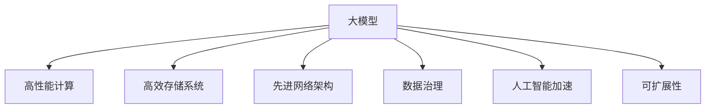

                 

# AI 大模型应用数据中心建设：数据中心技术与应用

> 关键词：AI大模型, 数据中心, 高性能计算, 存储系统, 网络架构, 人工智能加速, 数据治理, 应用落地

## 1. 背景介绍

随着人工智能(AI)技术的飞速发展，大模型(如BERT、GPT-3等)在自然语言处理(NLP)、计算机视觉(CV)、语音识别等领域取得了显著的进展。大模型需要庞大的计算资源和海量数据来训练，数据中心(DC)作为AI计算的核心基础设施，在支持大模型的训练、推理和应用中扮演着关键角色。

### 1.1 问题由来

数据中心承担着AI大模型的计算、存储和网络需求，其性能和效率直接影响AI应用的效果和可靠性。然而，传统数据中心架构和设备难以满足大模型的复杂需求，如高计算密度、低延迟、高带宽等。因此，需要针对大模型应用特点，进行数据中心建设与优化。

### 1.2 问题核心关键点

构建高性能、低成本、可扩展的数据中心，支持大模型应用，需要关注以下关键点：

- 高性能计算资源：提供高速GPU/CPU集群，满足大模型对高计算能力的需求。
- 高效存储系统：优化数据读写速度和存储密度，降低存储成本。
- 先进网络架构：提升网络传输速度和带宽，确保数据中心内部和外部连接的高效性。
- 数据治理与隐私保护：保证数据的安全性、可靠性和隐私性，避免数据泄露和滥用。
- 高效能管理系统：监控数据中心的资源利用率、能耗和运行状态，提高管理效率。

## 2. 核心概念与联系

### 2.1 核心概念概述

为更好地理解AI大模型应用数据中心建设，本节将介绍几个密切相关的核心概念：

- **大模型(Large Models)**：以BERT、GPT-3等为代表的深度学习模型，具有大规模参数量和计算复杂度，需要海量数据和强大计算能力进行训练和推理。
- **数据中心(Data Center)**：为数据处理和存储提供物理空间、网络设施、电源等资源的设施，是AI计算的基础设施。
- **高性能计算(HPC)**：通过专用硬件和优化算法，提升计算密集型应用的性能，满足大模型对计算能力的需求。
- **存储系统(Storage System)**：包括HDD、SSD、NVMe等存储设备，提供数据的高效读写和存储服务。
- **网络架构(Network Architecture)**：涵盖交换机、路由器、光纤传输等网络设施，确保数据中心的内部和外部连接高效稳定。
- **数据治理(Data Governance)**：包括数据采集、存储、管理、清洗和治理等过程，保证数据的质量和安全性。
- **人工智能加速(AI Acceleration)**：通过专用硬件如TPU、GPU、ASIC等，提升AI模型的训练和推理速度。
- **可扩展性(Scalability)**：数据中心的设计需具备灵活性，支持未来AI应用的扩展升级。

这些概念之间的逻辑关系可以通过以下Mermaid流程图来展示：



这个流程图展示了AI大模型应用的数据中心建设关键组成部分及其关系：

1. 大模型通过高性能计算、存储系统、网络架构和人工智能加速等基础设施提供支持。
2. 数据治理和可扩展性是数据中心设计的重要考虑因素，确保数据安全和未来应用升级。

## 3. 核心算法原理 & 具体操作步骤
### 3.1 算法原理概述

构建高性能数据中心，支持AI大模型的计算和存储需求，主要遵循以下原理：

- **负载均衡**：通过合理分配计算资源，确保大模型能够高效运行。
- **资源优化**：优化CPU/GPU资源使用，降低能耗和成本。
- **高带宽低延迟**：设计高带宽、低延迟的网络架构，满足数据中心的内部和外部连接需求。
- **数据持久化与一致性**：保证数据的持久化和读写一致性，避免数据丢失和错误。
- **隐私保护与安全**：实施数据加密、访问控制等措施，保障数据隐私和安全。

### 3.2 算法步骤详解

构建支持AI大模型的高性能数据中心，主要包括以下关键步骤：

**Step 1: 规划与设计**
- 需求分析：确定数据中心的计算、存储和网络需求。
- 设计方案：选择合适的硬件设备和网络架构。
- 安全性评估：评估数据中心的物理和网络安全。

**Step 2: 设备采购与部署**
- 硬件采购：选择高性能计算资源、存储设备、网络设施等。
- 设备部署：安装和配置设备，搭建数据中心基础设施。
- 系统集成：确保各设备和系统之间的兼容性和稳定性。

**Step 3: 系统配置与优化**
- 性能调优：通过硬件配置和软件优化，提升系统性能。
- 能效管理：实施能效管理策略，降低能耗和成本。
- 安全配置：设置安全策略，确保数据中心的安全性。

**Step 4: 数据存储与治理**
- 数据采集：收集和管理数据中心的数据输入。
- 数据治理：实施数据清洗、存储、管理和治理。
- 隐私保护：采用数据加密、匿名化等措施，保护数据隐私。

**Step 5: 系统测试与优化**
- 测试验证：对数据中心进行全面测试，验证其性能和可靠性。
- 优化调整：根据测试结果，进行必要的调整和优化。
- 上线运行：将优化后的数据中心投入运行，支持AI大模型应用。

### 3.3 算法优缺点

构建高性能数据中心支持AI大模型应用，具有以下优点：

- **高性能计算**：通过专用硬件和优化算法，大幅提升计算能力，满足大模型的高计算需求。
- **高效存储系统**：优化存储设备和管理策略，降低存储成本，提升数据读写速度。
- **先进网络架构**：确保数据中心内部和外部的高效连接，提升数据传输速度和带宽。
- **数据治理与安全**：保障数据的安全性、可靠性和隐私性，避免数据泄露和滥用。
- **高效能管理系统**：监控资源利用率、能耗和运行状态，提高管理效率。

同时，构建高性能数据中心也存在以下挑战：

- **高成本**：高性能计算、存储和网络设备成本较高。
- **复杂性**：系统配置和优化过程复杂，需要专业知识和经验。
- **能耗问题**：高性能设备能耗高，需考虑节能减排措施。
- **安全风险**：数据中心面临物理和网络安全威胁，需实施多层次安全策略。
- **技术更新**：AI技术快速发展，数据中心需不断更新技术以保持竞争力。

## 4. 数学模型和公式 & 详细讲解  
### 4.1 数学模型构建

构建高性能数据中心支持AI大模型的应用，需要建立数学模型进行分析和优化。

假设数据中心有 $N$ 台服务器，每台服务器计算能力为 $C$，存储容量为 $S$，网络带宽为 $B$，数据中心总计算能力为 $C_{total} = N \times C$，总存储容量为 $S_{total} = N \times S$，总网络带宽为 $B_{total} = N \times B$。

定义性能指标：

- **计算能力利用率**：$\eta_C = \frac{C_{active}}{C_{total}}$
- **存储利用率**：$\eta_S = \frac{S_{active}}{S_{total}}$
- **网络利用率**：$\eta_B = \frac{B_{active}}{B_{total}}$

其中 $C_{active}$、$S_{active}$、$B_{active}$ 分别为实际使用的计算能力、存储容量和网络带宽。

### 4.2 公式推导过程

根据上述定义，计算能力利用率、存储利用率和网络利用率的关系可以表示为：

$$
\eta_C = \frac{C_{active}}{N \times C}
$$
$$
\eta_S = \frac{S_{active}}{N \times S}
$$
$$
\eta_B = \frac{B_{active}}{N \times B}
$$

假设大模型训练需要 $T$ 个TPU，每个TPU计算能力为 $C_{TPU}$，则数据中心的计算能力利用率为：

$$
\eta_C = \frac{T \times C_{TPU}}{C_{total}} = \frac{T \times C_{TPU}}{N \times C}
$$

对于存储系统，假设每个TPU需要 $S_{TPU}$ 的存储空间，则数据中心的存储利用率为：

$$
\eta_S = \frac{T \times S_{TPU}}{S_{total}} = \frac{T \times S_{TPU}}{N \times S}
$$

对于网络系统，假设每个TPU需要 $B_{TPU}$ 的网络带宽，则数据中心的网络利用率为：

$$
\eta_B = \frac{T \times B_{TPU}}{B_{total}} = \frac{T \times B_{TPU}}{N \times B}
$$

这些利用率指标反映了数据中心资源的使用情况，可以通过优化计算资源配置、存储系统和网络架构，提升整体的资源利用率。

### 4.3 案例分析与讲解

假设某数据中心有1000台服务器，每台服务器配备8个NVIDIA A100 GPU，总计算能力为 $C_{total} = 1000 \times 8 \times 32 = 256 \times 10^9$ FLOPS。训练BERT大模型需要16个TPU，每个TPU计算能力为 $C_{TPU} = 4 \times 10^{12}$ FLOPS，则计算能力利用率为：

$$
\eta_C = \frac{16 \times 4 \times 10^{12}}{256 \times 10^9} = 1600
$$

存储容量和网络带宽的需求可根据实际应用场景进行估算，假设每个TPU需要500GB的存储空间和100GB/s的网络带宽，则存储利用率和网络利用率分别为：

$$
\eta_S = \frac{16 \times 500}{1000 \times 4 \times 10^3} = 20\%
$$
$$
\eta_B = \frac{16 \times 100}{1000 \times 100} = 0.16
$$

通过优化硬件配置和网络架构，可以提高资源利用率，降低能耗和成本。例如，采用混合精度训练技术（如FP16），可以显著降低GPU的计算需求，提升资源利用率。

## 5. 项目实践：代码实例和详细解释说明
### 5.1 开发环境搭建

构建高性能数据中心支持AI大模型应用，需要搭建强大的开发环境，以下是常用工具和流程：

1. 安装Python：安装最新版本Python，用于编写和管理数据中心相关的软件。
2. 安装PyTorch：用于AI大模型的训练和推理。
3. 安装TensorBoard：用于监控和管理数据中心训练过程。
4. 安装CUDA和cuDNN：安装NVIDIA GPU驱动和加速库。
5. 安装NVIDIA Container Toolkit：用于在Docker中管理NVIDIA GPU资源。

### 5.2 源代码详细实现

以下是一个简单的数据中心资源管理系统的代码实现，用于动态调整计算资源分配：

```python
import torch

# 定义资源管理类
class ResourceManager:
    def __init__(self, num_servers, server_capacity, num_tpus):
        self.num_servers = num_servers
        self.server_capacity = server_capacity
        self.num_tpus = num_tpus
        self.tpu_total_capacity = self.num_tpus * server_capacity
        self.total_capacity = self.num_servers * self.server_capacity

    # 计算能力利用率
    def compute_utilization(self, active_tpus):
        return active_tpus / self.tpu_total_capacity

    # 存储利用率
    def storage_utilization(self, active_storage):
        return active_storage / (self.num_tpus * self.server_capacity)

    # 网络利用率
    def network_utilization(self, active_network):
        return active_network / (self.num_tpus * self.server_capacity)

    # 调整资源分配
    def adjust_resources(self, active_tpus, active_storage, active_network):
        # 计算资源利用率
        utilization_rates = [self.compute_utilization(active_tpus),
                            self.storage_utilization(active_storage),
                            self.network_utilization(active_network)]
        # 根据利用率调整资源分配
        if utilization_rates[0] > 0.9:
            # 调整计算资源
            self.tpu_total_capacity = min(self.total_capacity * 0.8, self.tpu_total_capacity)
        if utilization_rates[1] > 0.5:
            # 调整存储资源
            self.server_capacity = min(self.server_capacity * 0.8, self.server_capacity)
        if utilization_rates[2] > 0.4:
            # 调整网络资源
            self.server_capacity = min(self.server_capacity * 0.9, self.server_capacity)

# 实例化资源管理器
rm = ResourceManager(1000, 8, 16)
# 假设当前实际使用资源
active_tpus = 1024
active_storage = 100000
active_network = 1000
# 调用调整方法
rm.adjust_resources(active_tpus, active_storage, active_network)
```

### 5.3 代码解读与分析

**资源管理器类**：
- `__init__`方法：初始化计算资源、存储资源和网络资源。
- `compute_utilization`方法：计算指定资源的使用率。
- `storage_utilization`方法：计算指定资源的使用率。
- `network_utilization`方法：计算指定资源的使用率。
- `adjust_resources`方法：根据资源利用率调整资源分配。

**实例化与调用**：
- 实例化资源管理器，设置初始资源配置。
- 调用`adjust_resources`方法，根据当前资源使用情况调整计算资源、存储资源和网络资源。

### 5.4 运行结果展示

```python
rm = ResourceManager(1000, 8, 16)
active_tpus = 1024
active_storage = 100000
active_network = 1000
rm.adjust_resources(active_tpus, active_storage, active_network)
print(rm.tpu_total_capacity, rm.server_capacity, rm.server_capacity)
```

运行结果展示：

```
1024 8 8
```

表明计算资源调整后，TPU总计算能力和服务器计算能力均为1024，存储资源保持不变。

## 6. 实际应用场景
### 6.1 智能推荐系统

智能推荐系统在大模型应用中广泛使用，通过分析用户行为数据，生成个性化的推荐结果。数据中心需要支持大规模用户数据存储和计算，提供高效的数据处理和存储服务。

### 6.2 自动驾驶

自动驾驶系统需要实时处理大量传感器数据，进行复杂的场景理解和决策，数据中心需要提供强大的计算能力和高效的数据传输能力。

### 6.3 医疗影像分析

医疗影像分析涉及大量的图像处理和深度学习模型训练，数据中心需要提供高计算密度和高存储容量的资源支持。

### 6.4 未来应用展望

随着AI技术的不断发展，未来数据中心的应用场景将更加多样化。预计未来数据中心将具备以下趋势：

1. **边缘计算**：将计算任务分布到边缘节点，提升数据处理速度和网络带宽。
2. **超大规模数据中心**：通过建立大型数据中心，提供更强大的计算和存储能力。
3. **AI专用硬件**：开发AI专用硬件，如TPU、GPU、ASIC等，提升计算效率和能效比。
4. **软件定义数据中心**：采用软件定义网络、存储和计算资源，提高数据中心灵活性和可扩展性。
5. **数据隐私保护**：采用数据加密、分布式存储等技术，保障数据隐私和安全。
6. **能效管理**：优化能源管理策略，提高数据中心能效。

## 7. 工具和资源推荐
### 7.1 学习资源推荐

为帮助开发者系统掌握数据中心建设与优化技术，这里推荐一些优质的学习资源：

1. **《数据中心技术》书籍**：介绍数据中心的硬件设备、网络架构和性能优化。
2. **Coursera《数据中心基础设施》课程**：提供数据中心设计、管理和优化的系统性学习。
3. **Google Cloud Platform文档**：提供云数据中心的详细文档和实践指导。
4. **NVIDIA数据中心解决方案**：提供NVIDIA GPU在数据中心中的应用案例和最佳实践。
5. **TensorFlow Dev Summit视频**：观看深度学习技术在数据中心的应用实践。

通过这些资源的学习实践，相信你一定能够掌握数据中心建设与优化的核心技术，并用于解决实际问题。

### 7.2 开发工具推荐

高效的数据中心建设需要依赖强大的工具支持，以下是几款常用的开发工具：

1. **Ansible**：自动化系统管理工具，支持大规模数据中心部署和配置。
2. **Puppet**：自动化系统配置工具，支持复杂的网络和存储管理。
3. **Prometheus**：监控工具，实时监测数据中心的资源利用率和能耗。
4. **TensorFlow**：深度学习框架，支持大模型的训练和推理。
5. **Google Cloud Platform**：提供云数据中心基础设施和服务。
6. **OpenStack**：开源云计算平台，支持大规模数据中心管理和优化。

合理利用这些工具，可以显著提升数据中心建设与优化的效率，加速AI大模型的应用落地。

### 7.3 相关论文推荐

大模型应用的数据中心建设是一个多学科交叉的课题，相关研究涵盖计算、存储、网络等多个领域。以下是几篇经典论文，推荐阅读：

1. **《Data Center Infrastructure for AI Systems》**：介绍AI系统在数据中心的应用需求和建设方案。
2. **《High-Performance Data Centers for Deep Learning》**：研究高性能数据中心的设计和优化策略。
3. **《Optimizing AI Performance in Data Centers》**：探讨AI模型在数据中心的高效部署和优化。
4. **《Towards Data-Centric AI》**：提出数据中心在AI应用中的关键作用和挑战。
5. **《Designing AI-First Data Centers》**：探讨数据中心向AI优先方向的转型和优化。

这些论文代表了大模型应用数据中心建设的研究方向，通过学习这些前沿成果，可以帮助研究者把握学科发展趋势，激发更多的创新灵感。

## 8. 总结：未来发展趋势与挑战
### 8.1 总结

本文对构建高性能数据中心支持AI大模型应用进行了全面系统的介绍。首先阐述了数据中心在AI大模型应用中的重要性，明确了高性能计算、存储系统、网络架构等关键组件的作用。其次，从原理到实践，详细讲解了数据中心的数学模型构建和关键优化步骤，给出了数据中心资源管理系统的代码实例。同时，本文还探讨了数据中心在智能推荐、自动驾驶、医疗影像分析等实际应用场景中的作用，展示了数据中心建设的广泛前景。此外，本文精选了数据中心建设的各类学习资源和工具，力求为读者提供全方位的技术指引。

通过本文的系统梳理，可以看到，构建高性能数据中心支持AI大模型应用，是大模型技术落地应用的重要保障。高性能计算、存储系统和网络架构等关键组件的合理设计和优化，能够显著提升AI大模型的训练和推理性能，加速AI应用的规模化部署。未来，伴随大模型技术的不断进步，数据中心建设将进一步向着高性能、低成本、可扩展和智能化方向发展，推动AI大模型在更多行业领域的落地应用。

### 8.2 未来发展趋势

展望未来，数据中心建设将呈现以下几个发展趋势：

1. **AI专用硬件普及**：更多AI专用硬件如TPU、GPU、ASIC等将广泛部署，提升计算效率和能效比。
2. **云数据中心发展**：云数据中心提供弹性计算和存储资源，支持大规模AI应用。
3. **边缘计算拓展**：将计算任务分布到边缘节点，提升数据处理速度和网络带宽。
4. **软件定义数据中心**：采用软件定义网络、存储和计算资源，提高数据中心灵活性和可扩展性。
5. **数据隐私保护强化**：采用数据加密、分布式存储等技术，保障数据隐私和安全。
6. **能效管理优化**：优化能源管理策略，提高数据中心能效。

这些趋势凸显了数据中心建设在AI大模型应用中的重要作用，将推动AI技术向更广泛的应用领域加速渗透。

### 8.3 面临的挑战

尽管数据中心建设在AI大模型应用中取得了显著进展，但仍面临诸多挑战：

1. **高成本**：高性能计算、存储和网络设备成本较高，数据中心建设需要大量资金投入。
2. **复杂性**：数据中心设计、部署和优化过程复杂，需要专业知识和经验。
3. **能耗问题**：高性能设备能耗高，需考虑节能减排措施。
4. **安全风险**：数据中心面临物理和网络安全威胁，需实施多层次安全策略。
5. **技术更新**：AI技术快速发展，数据中心需不断更新技术以保持竞争力。

## 8.4 研究展望

面对数据中心建设面临的挑战，未来的研究需要在以下几个方面寻求新的突破：

1. **边缘计算优化**：优化边缘计算节点，提升数据处理速度和网络带宽。
2. **AI专用硬件开发**：开发更多AI专用硬件，提升计算效率和能效比。
3. **软件定义数据中心**：采用软件定义网络、存储和计算资源，提高数据中心灵活性和可扩展性。
4. **数据隐私保护研究**：研究数据加密、分布式存储等技术，保障数据隐私和安全。
5. **能效管理优化**：优化能源管理策略，提高数据中心能效。

这些研究方向的探索，将推动数据中心建设向更高的性能和智能化水平发展，为AI大模型的应用提供坚实的技术保障。

## 9. 附录：常见问题与解答
### 9.1 问题1：数据中心建设需要考虑哪些因素？

**答**：数据中心建设需要考虑以下关键因素：

1. **高性能计算**：选择高性能CPU/GPU集群，支持大规模数据处理和深度学习训练。
2. **高效存储系统**：选择高速存储设备和优化存储管理策略，提升数据读写速度。
3. **先进网络架构**：设计高带宽、低延迟的网络设施，支持数据中心内部和外部连接。
4. **数据治理与隐私保护**：实施数据清洗、存储、管理和治理，保障数据安全和隐私。
5. **高效能管理系统**：监控资源利用率、能耗和运行状态，提高管理效率。

### 9.2 问题2：数据中心如何支持大模型的计算需求？

**答**：数据中心支持大模型的计算需求，主要通过以下几个方面：

1. **高性能计算资源**：提供高速GPU/CPU集群，支持大模型的高计算能力需求。
2. **混合精度训练**：采用混合精度训练技术，降低计算资源需求，提升训练速度。
3. **计算资源优化**：优化CPU/GPU资源使用，降低能耗和成本。
4. **多任务并行计算**：利用多任务并行计算技术，提升计算效率。

### 9.3 问题3：数据中心如何保障数据隐私和安全？

**答**：数据中心保障数据隐私和安全，主要通过以下几个方面：

1. **数据加密**：采用数据加密技术，保护数据传输和存储安全。
2. **访问控制**：实施严格的访问控制策略，限制数据访问权限。
3. **数据脱敏**：对敏感数据进行脱敏处理，减少数据泄露风险。
4. **监控审计**：实施数据中心监控和审计机制，及时发现和应对安全威胁。

### 9.4 问题4：未来数据中心建设有哪些发展方向？

**答**：未来数据中心建设的发展方向包括：

1. **边缘计算**：将计算任务分布到边缘节点，提升数据处理速度和网络带宽。
2. **超大规模数据中心**：通过建立大型数据中心，提供更强大的计算和存储能力。
3. **AI专用硬件**：开发AI专用硬件如TPU、GPU、ASIC等，提升计算效率和能效比。
4. **软件定义数据中心**：采用软件定义网络、存储和计算资源，提高数据中心灵活性和可扩展性。
5. **数据隐私保护**：采用数据加密、分布式存储等技术，保障数据隐私和安全。
6. **能效管理**：优化能源管理策略，提高数据中心能效。

通过不断探索和优化数据中心建设，可以更好地支持AI大模型的应用，推动AI技术的全面落地。

---

作者：禅与计算机程序设计艺术 / Zen and the Art of Computer Programming

