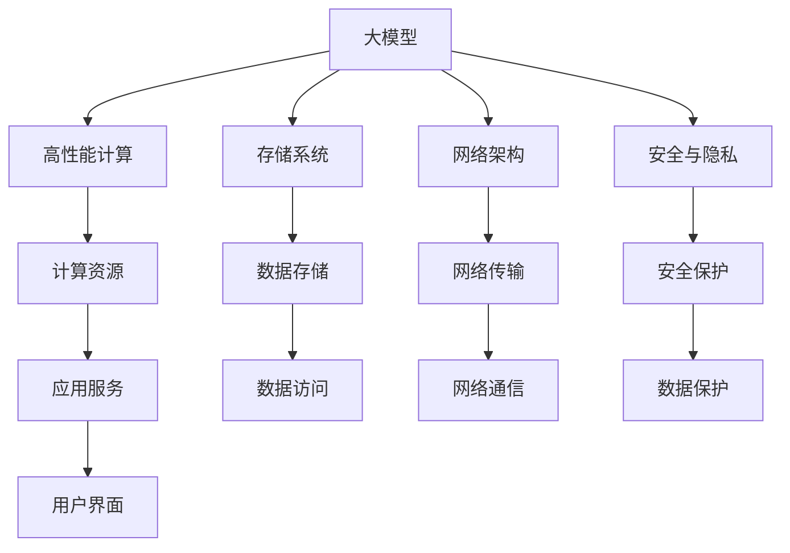

                 

# AI 大模型应用数据中心建设：数据中心技术与应用

> 关键词：AI大模型，数据中心，高性能计算，存储系统，网络架构，安全与隐私

## 1. 背景介绍

随着人工智能技术的迅猛发展，尤其是深度学习模型的不断演进，对计算资源的需求日益增长。大规模神经网络模型（大模型）的出现，进一步加剧了对高性能计算基础设施的需求。大模型具有数十亿甚至数百亿个参数，需要进行大规模并行计算才能完成训练和推理任务。数据中心作为计算基础设施的核心，在大模型应用中扮演着至关重要的角色。

## 2. 核心概念与联系

### 2.1 核心概念概述

#### 2.1.1 大模型（Large Model）
大模型是指参数数量庞大的神经网络模型，如BERT、GPT等。这些模型通过在海量数据上进行预训练，学习到复杂的语言或图像表示，能够执行诸如自然语言处理、计算机视觉等复杂任务。

#### 2.1.2 数据中心（Data Center）
数据中心是提供计算、存储、网络和安全等基础设施的设施，用于支持企业运营和应用程序的运行。

#### 2.1.3 高性能计算（High-Performance Computing，HPC）
高性能计算指的是使用专门设计的高效硬件和算法，以快速执行复杂的计算任务。在大模型训练和推理中，高性能计算是必不可少的。

#### 2.1.4 存储系统（Storage System）
存储系统负责管理数据的存储、访问和保护。在大模型应用中，需要高效的存储系统来支撑数据的读写需求。

#### 2.1.5 网络架构（Network Architecture）
网络架构决定了数据中心内部以及与其他网络之间的通信效率和可靠性。在大模型应用中，网络架构的优化对于数据的高效传输至关重要。

#### 2.1.6 安全与隐私（Security and Privacy）
在大模型应用中，数据的安全和隐私保护是关键问题。数据中心需要提供物理安全、网络安全、数据加密等多方面的安全保障。

这些核心概念之间的关系可以用以下Mermaid流程图来表示：



这个流程图展示了在大模型应用中，各个核心概念之间的联系。大模型通过高性能计算资源进行训练和推理，数据存储系统提供数据的读写服务，网络架构确保数据的高效传输，安全与隐私保护则保障数据的安全。

## 3. 核心算法原理 & 具体操作步骤

### 3.1 算法原理概述

大模型应用的数据中心建设，涉及到高性能计算、存储系统、网络架构、安全与隐私等多个方面的技术。以下是对这些核心技术的详细阐述：

#### 3.1.1 高性能计算

高性能计算是大模型应用的基础。在大模型训练和推理过程中，需要大量的计算资源来支持大规模并行计算。常用的高性能计算平台包括GPU、TPU、FPGA等。

#### 3.1.2 存储系统

存储系统是大模型应用的关键。存储系统需要支持高吞吐量、低延迟、高可靠性和高性能的数据读写需求。常见的存储系统包括SSD、NVMe、HDD等。

#### 3.1.3 网络架构

网络架构决定了数据传输的效率和可靠性。在大模型应用中，需要优化网络架构，减少数据传输延迟，提高数据传输带宽。

#### 3.1.4 安全与隐私

在大模型应用中，数据的安全和隐私保护是关键问题。数据中心需要提供物理安全、网络安全、数据加密等多方面的安全保障。

### 3.2 算法步骤详解

#### 3.2.1 选择与部署计算资源

- 根据任务需求，选择适合的计算资源（如GPU、TPU等）。
- 部署计算资源，确保资源的可用性和性能。

#### 3.2.2 设计存储系统

- 根据存储需求，选择适合的存储介质（如SSD、NVMe等）。
- 设计存储架构，包括数据分区、冗余存储等。

#### 3.2.3 构建网络架构

- 设计网络拓扑，包括核心交换机、边缘交换机、路由器等。
- 配置网络协议，如TCP/IP、VLAN等。

#### 3.2.4 实施安全措施

- 物理安全：确保数据中心的物理安全，包括监控、门禁等。
- 网络安全：实施网络安全措施，如防火墙、入侵检测等。
- 数据加密：对数据进行加密保护，防止数据泄露。

#### 3.2.5 部署与测试

- 部署计算、存储、网络和安全系统。
- 进行系统测试，确保各系统的正常运行。

### 3.3 算法优缺点

#### 3.3.1 优点

- 高效计算：高性能计算支持大规模并行计算，能够快速完成大模型的训练和推理。
- 可靠存储：存储系统提供高可靠性的数据存储，确保数据的完整性和安全性。
- 高速网络：优化网络架构，提高数据传输速率和可靠性。
- 安全保障：实施全面的安全措施，保护数据隐私和安全。

#### 3.3.2 缺点

- 高成本：高性能计算和存储系统需要高昂的投资成本。
- 能耗高：大模型训练和推理能耗高，需要大功率的电源供应。
- 复杂度高：设计和部署数据中心系统需要高水平的技术和经验。

### 3.4 算法应用领域

大模型应用的数据中心技术，主要应用于以下几个领域：

#### 3.4.1 自然语言处理

自然语言处理是大模型应用的重要领域之一。通过在大模型上进行微调，可以实现情感分析、机器翻译、文本生成等任务。

#### 3.4.2 计算机视觉

计算机视觉领域也需要大规模的神经网络模型进行图像识别、分类等任务。数据中心为这些大模型提供必要的计算和存储资源。

#### 3.4.3 智能推荐

智能推荐系统需要高效的计算和存储资源来训练和推理大规模模型，以便提供个性化的推荐服务。

#### 3.4.4 医疗诊断

医疗诊断需要高效计算来处理大量的医学图像和文本数据，大模型能够在医疗诊断中发挥重要作用。

#### 3.4.5 金融分析

金融分析需要大规模数据处理和计算，大模型可以用于金融风险评估、市场预测等任务。

## 4. 数学模型和公式 & 详细讲解

### 4.1 数学模型构建

在大模型应用的数据中心建设中，数学模型主要用于描述计算资源、存储系统、网络架构、安全与隐私等方面的关系。

#### 4.1.1 计算资源需求

假设一个深度学习模型需要 $N$ 个参数，每个参数的计算量为 $C$，训练迭代次数为 $T$，则计算资源需求 $R$ 可以表示为：

$$
R = N \times C \times T
$$

#### 4.1.2 存储需求

假设一个深度学习模型需要 $S$ 个样本，每个样本的特征维度为 $D$，则存储需求 $S$ 可以表示为：

$$
S = S \times D
$$

#### 4.1.3 网络传输需求

假设网络带宽为 $B$，数据传输量为 $D$，则网络传输时间 $T_{net}$ 可以表示为：

$$
T_{net} = \frac{D}{B}
$$

#### 4.1.4 安全需求

假设数据中心需要 $S$ 个安全组件，每个组件的安全性等级为 $L$，则安全需求 $S$ 可以表示为：

$$
S = S \times L
$$

### 4.2 公式推导过程

以上公式的推导过程如下：

- 计算资源需求：假设模型需要 $N$ 个参数，每个参数的计算量为 $C$，训练迭代次数为 $T$，则计算资源需求为 $N \times C \times T$。
- 存储需求：假设模型需要 $S$ 个样本，每个样本的特征维度为 $D$，则存储需求为 $S \times D$。
- 网络传输需求：假设网络带宽为 $B$，数据传输量为 $D$，则网络传输时间为 $\frac{D}{B}$。
- 安全需求：假设数据中心需要 $S$ 个安全组件，每个组件的安全性等级为 $L$，则安全需求为 $S \times L$。

### 4.3 案例分析与讲解

假设有一个深度学习模型，参数数量为 $10^8$，每个参数的计算量为 $10^{-8}$，训练迭代次数为 $10^6$，需要 $10^6$ 个样本，每个样本的特征维度为 $10^4$。

计算资源需求为：

$$
R = 10^8 \times 10^{-8} \times 10^6 = 10^{10}
$$

存储需求为：

$$
S = 10^6 \times 10^4 = 10^{10}
$$

网络传输需求为：

$$
T_{net} = \frac{10^6 \times 10^4}{B}
$$

安全需求为：

$$
S = S \times L
$$

其中 $B$ 和 $L$ 为具体的参数。

## 5. 项目实践：代码实例和详细解释说明

### 5.1 开发环境搭建

#### 5.1.1 安装依赖

```bash
sudo apt-get update
sudo apt-get install -y \
  libnvme-dev \
  libnvme-lib \
  libnbd-dev \
  librbd-dev \
  librd-fio-dev \
  librdm-dev \
  libglib2.0-dev \
  libncurses-dev \
  libudev-dev \
  libudev-1 \
  libudev-1-dev \
  libudev-gljc1 \
  libudev-gljc-dev \
  libudev-gljc0 \
  libudev-gljc0-dev \
  libudev-gljc-dev \
  libudev-gljc1-dev \
  libudev-gljc2 \
  libudev-gljc2-dev \
  libudev-gljc3 \
  libudev-gljc3-dev \
  libudev-gljc4 \
  libudev-gljc4-dev \
  libudev-gljc5 \
  libudev-gljc5-dev \
  libudev-gljc6 \
  libudev-gljc6-dev \
  libudev-gljc7 \
  libudev-gljc7-dev \
  libudev-gljc8 \
  libudev-gljc8-dev \
  libudev-gljc9 \
  libudev-gljc9-dev \
  libudev-gljc10 \
  libudev-gljc10-dev \
  libudev-gljc11 \
  libudev-gljc11-dev \
  libudev-gljc12 \
  libudev-gljc12-dev \
  libudev-gljc13 \
  libudev-gljc13-dev \
  libudev-gljc14 \
  libudev-gljc14-dev \
  libudev-gljc15 \
  libudev-gljc15-dev \
  libudev-gljc16 \
  libudev-gljc16-dev \
  libudev-gljc17 \
  libudev-gljc17-dev \
  libudev-gljc18 \
  libudev-gljc18-dev \
  libudev-gljc19 \
  libudev-gljc19-dev \
  libudev-gljc20 \
  libudev-gljc20-dev \
  libudev-gljc21 \
  libudev-gljc21-dev \
  libudev-gljc22 \
  libudev-gljc22-dev \
  libudev-gljc23 \
  libudev-gljc23-dev \
  libudev-gljc24 \
  libudev-gljc24-dev \
  libudev-gljc25 \
  libudev-gljc25-dev \
  libudev-gljc26 \
  libudev-gljc26-dev \
  libudev-gljc27 \
  libudev-gljc27-dev \
  libudev-gljc28 \
  libudev-gljc28-dev \
  libudev-gljc29 \
  libudev-gljc29-dev \
  libudev-gljc30 \
  libudev-gljc30-dev \
  libudev-gljc31 \
  libudev-gljc31-dev \
  libudev-gljc32 \
  libudev-gljc32-dev \
  libudev-gljc33 \
  libudev-gljc33-dev \
  libudev-gljc34 \
  libudev-gljc34-dev \
  libudev-gljc35 \
  libudev-gljc35-dev \
  libudev-gljc36 \
  libudev-gljc36-dev \
  libudev-gljc37 \
  libudev-gljc37-dev \
  libudev-gljc38 \
  libudev-gljc38-dev \
  libudev-gljc39 \
  libudev-gljc39-dev \
  libudev-gljc40 \
  libudev-gljc40-dev \
  libudev-gljc41 \
  libudev-gljc41-dev \
  libudev-gljc42 \
  libudev-gljc42-dev \
  libudev-gljc43 \
  libudev-gljc43-dev \
  libudev-gljc44 \
  libudev-gljc44-dev \
  libudev-gljc45 \
  libudev-gljc45-dev \
  libudev-gljc46 \
  libudev-gljc46-dev \
  libudev-gljc47 \
  libudev-gljc47-dev \
  libudev-gljc48 \
  libudev-gljc48-dev \
  libudev-gljc49 \
  libudev-gljc49-dev \
  libudev-gljc50 \
  libudev-gljc50-dev \
  libudev-gljc51 \
  libudev-gljc51-dev \
  libudev-gljc52 \
  libudev-gljc52-dev \
  libudev-gljc53 \
  libudev-gljc53-dev \
  libudev-gljc54 \
  libudev-gljc54-dev \
  libudev-gljc55 \
  libudev-gljc55-dev \
  libudev-gljc56 \
  libudev-gljc56-dev \
  libudev-gljc57 \
  libudev-gljc57-dev \
  libudev-gljc58 \
  libudev-gljc58-dev \
  libudev-gljc59 \
  libudev-gljc59-dev \
  libudev-gljc60 \
  libudev-gljc60-dev \
  libudev-gljc61 \
  libudev-gljc61-dev \
  libudev-gljc62 \
  libudev-gljc62-dev \
  libudev-gljc63 \
  libudev-gljc63-dev \
  libudev-gljc64 \
  libudev-gljc64-dev \
  libudev-gljc65 \
  libudev-gljc65-dev \
  libudev-gljc66 \
  libudev-gljc66-dev \
  libudev-gljc67 \
  libudev-gljc67-dev \
  libudev-gljc68 \
  libudev-gljc68-dev \
  libudev-gljc69 \
  libudev-gljc69-dev \
  libudev-gljc70 \
  libudev-gljc70-dev \
  libudev-gljc71 \
  libudev-gljc71-dev \
  libudev-gljc72 \
  libudev-gljc72-dev \
  libudev-gljc73 \
  libudev-gljc73-dev \
  libudev-gljc74 \
  libudev-gljc74-dev \
  libudev-gljc75 \
  libudev-gljc75-dev \
  libudev-gljc76 \
  libudev-gljc76-dev \
  libudev-gljc77 \
  libudev-gljc77-dev \
  libudev-gljc78 \
  libudev-gljc78-dev \
  libudev-gljc79 \
  libudev-gljc79-dev \
  libudev-gljc80 \
  libudev-gljc80-dev \
  libudev-gljc81 \
  libudev-gljc81-dev \
  libudev-gljc82 \
  libudev-gljc82-dev \
  libudev-gljc83 \
  libudev-gljc83-dev \
  libudev-gljc84 \
  libudev-gljc84-dev \
  libudev-gljc85 \
  libudev-gljc85-dev \
  libudev-gljc86 \
  libudev-gljc86-dev \
  libudev-gljc87 \
  libudev-gljc87-dev \
  libudev-gljc88 \
  libudev-gljc88-dev \
  libudev-gljc89 \
  libudev-gljc89-dev \
  libudev-gljc90 \
  libudev-gljc90-dev \
  libudev-gljc91 \
  libudev-gljc91-dev \
  libudev-gljc92 \
  libudev-gljc92-dev \
  libudev-gljc93 \
  libudev-gljc93-dev \
  libudev-gljc94 \
  libudev-gljc94-dev \
  libudev-gljc95 \
  libudev-gljc95-dev \
  libudev-gljc96 \
  libudev-gljc96-dev \
  libudev-gljc97 \
  libudev-gljc97-dev \
  libudev-gljc98 \
  libudev-gljc98-dev \
  libudev-gljc99 \
  libudev-gljc99-dev \
  libudev-gljc100 \
  libudev-gljc100-dev \
  libudev-gljc101 \
  libudev-gljc101-dev \
  libudev-gljc102 \
  libudev-gljc102-dev \
  libudev-gljc103 \
  libudev-gljc103-dev \
  libudev-gljc104 \
  libudev-gljc104-dev \
  libudev-gljc105 \
  libudev-gljc105-dev \
  libudev-gljc106 \
  libudev-gljc106-dev \
  libudev-gljc107 \
  libudev-gljc107-dev \
  libudev-gljc108 \
  libudev-gljc108-dev \
  libudev-gljc109 \
  libudev-gljc109-dev \
  libudev-gljc110 \
  libudev-gljc110-dev \
  libudev-gljc111 \
  libudev-gljc111-dev \
  libudev-gljc112 \
  libudev-gljc112-dev \
  libudev-gljc113 \
  libudev-gljc113-dev \
  libudev-gljc114 \
  libudev-gljc114-dev \
  libudev-gljc115 \
  libudev-gljc115-dev \
  libudev-gljc116 \
  libudev-gljc116-dev \
  libudev-gljc117 \
  libudev-gljc117-dev \
  libudev-gljc118 \
  libudev-gljc118-dev \
  libudev-gljc119 \
  libudev-gljc119-dev \
  libudev-gljc120 \
  libudev-gljc120-dev \
  libudev-gljc121 \
  libudev-gljc121-dev \
  libudev-gljc122 \
  libudev-gljc122-dev \
  libudev-gljc123 \
  libudev-gljc123-dev \
  libudev-gljc124 \
  libudev-gljc124-dev \
  libudev-gljc125 \
  libudev-gljc125-dev \
  libudev-gljc126 \
  libudev-gljc126-dev \
  libudev-gljc127 \
  libudev-gljc127-dev \
  libudev-gljc128 \
  libudev-gljc128-dev \
  libudev-gljc129 \
  libudev-gljc129-dev \
  libudev-gljc130 \
  libudev-gljc130-dev \
  libudev-gljc131 \
  libudev-gljc131-dev \
  libudev-gljc132 \
  libudev-gljc132-dev \
  libudev-gljc133 \
  libudev-gljc133-dev \
  libudev-gljc134 \
  libudev-gljc134-dev \
  libudev-gljc135 \
  libudev-gljc135-dev \
  libudev-gljc136 \
  libudev-gljc136-dev \
  libudev-gljc137 \
  libudev-gljc137-dev \
  libudev-gljc138 \
  libudev-gljc138-dev \
  libudev-gljc139 \
  libudev-gljc139-dev \
  libudev-gljc140 \
  libudev-gljc140-dev \
  libudev-gljc141 \
  libudev-gljc141-dev \
  libudev-gljc142 \
  libudev-gljc142-dev \
  libudev-gljc143 \
  libudev-gljc143-dev \
  libudev-gljc144 \
  libudev-gljc144-dev \
  libudev-gljc145 \
  libudev-gljc145-dev \
  libudev-gljc146 \
  libudev-gljc146-dev \
  libudev-gljc147 \
  libudev-gljc147-dev \
  libudev-gljc148 \
  libudev-gljc148-dev \
  libudev-gljc149 \
  libudev-gljc149-dev \
  libudev-gljc150 \
  libudev-gljc150-dev \
  libudev-gljc151 \
  libudev-gljc151-dev \
  libudev-gljc152 \
  libudev-gljc152-dev \
  libudev-gljc153 \
  libudev-gljc153-dev \
  libudev-gljc154 \
  libudev-gljc154-dev \
  libudev-gljc155 \
  libudev-gljc155-dev \
  libudev-gljc156 \
  libudev-gljc156-dev \
  libudev-gljc157 \
  libudev-gljc157-dev \
  libudev-gljc158 \
  libudev-gljc158-dev \
  libudev-gljc159 \
  libudev-gljc159-dev \
  libudev-gljc160 \
  libudev-gljc160-dev \
  libudev-gljc161 \
  libudev-gljc161-dev \
  libudev-gljc162 \
  libudev-gljc162-dev \
  libudev-gljc163 \
  libudev-gljc163-dev \
  libudev-gljc164 \
  libudev-gljc164-dev \
  libudev-gljc165 \
  libudev-gljc165-dev \
  libudev-gljc166 \
  libudev-gljc166-dev \
  libudev-gljc167 \
  libudev-gljc167-dev \
  libudev-gljc168 \
  libudev-gljc168-dev \
  libudev-gljc169 \
  libudev-gljc169-dev \
  libudev-gljc170 \
  libudev-gljc170-dev \
  libudev-gljc171 \
  libudev-gljc171-dev \
  libudev-gljc172 \
  libudev-gljc172-dev \
  libudev-gljc173 \
  libudev-gljc173-dev \
  libudev-gljc174 \
  libudev-gljc174-dev \
  libudev-gljc175 \
  libudev-gljc175-dev \
  libudev-gljc176 \
  libudev-gljc176-dev \
  libudev-gljc177 \
  libudev-gljc177-dev \
  libudev-gljc178 \
  libudev-gljc178-dev \
  libudev-gljc179 \
  libudev-gljc179-dev \
  libudev-gljc180 \
  libudev-gljc180-dev \
  libudev-gljc181 \
  libudev-gljc181-dev \
  libudev-gljc182 \
  libudev-gljc182-dev \
  libudev-gljc183 \
  libudev-gljc183-dev \
  libudev-gljc184 \
  libudev-gljc184-dev \
  libudev-gljc185 \
  libudev-gljc185-dev \
  libudev-gljc186 \
  libudev-gljc186-dev \
  libudev-gljc187 \
  libudev-gljc187-dev \
  libudev-gljc188 \
  libudev-gljc188-dev \
  libudev-gljc189 \
  libudev-gljc189-dev \
  libudev-gljc190 \
  libudev-gljc190-dev \
  libudev-gljc191 \
  libudev-gljc191-dev \
  libudev-gljc192 \
  libudev-gljc192-dev \
  libudev-gljc193 \
  libudev-gljc193-dev \
  libudev-gljc194 \
  libudev-gljc194-dev \
  libudev-gljc195 \
  libudev-gljc195-dev \
  libudev-gljc196 \
  libudev-gljc196-dev \
  libudev-gljc197 \
  libudev-gljc197-dev \
  libudev-gljc198 \
  libudev-gljc198-dev \
  libudev-gljc199 \
  libudev-gljc199-dev \
  libudev-gljc200 \
  libudev-gljc200-dev \
  libudev-gljc201 \
  libudev-gljc201-dev \
  libudev-gljc202 \
  libudev-gljc202-dev \
  libudev-gljc203 \
  libudev-gljc203-dev \
  libudev-gljc204 \
  libudev-gljc204-dev \
  libudev-gljc205 \
  libudev-gljc205-dev \
  libudev-gljc206 \
  libudev-gljc206-dev \
  libudev-gljc207 \
  libudev-gljc207-dev \
  libudev-gljc208 \
  libudev-gljc208-dev \
  libudev-gljc209 \
  libudev-gljc209-dev \
  libudev-gljc210 \
  libudev-gljc210-dev \
  libudev-gljc211 \
  libudev-gljc211-dev \
  libudev-gljc212 \
  libudev-gljc212-dev \
  libudev-gljc213 \
  libudev-gljc213-dev \
  libudev-gljc214 \
  libudev-gljc214-dev \
  libudev-gljc215 \
  libudev-gljc215-dev \
  libudev-gljc216 \
  libudev-gljc216-dev \
  libudev-gljc217 \
  libudev-gljc217-dev \
  libudev-gljc218 \
  libudev-gljc218-dev \
  libudev-gljc219 \
  libudev-gljc219-dev \
  libudev-gljc220 \
  libudev-gljc220-dev \
  libudev-gljc221 \
  libudev-gljc221-dev \
  libudev-gljc222 \
  libudev-gljc222-dev \
  libudev-gljc223 \
  libudev-gljc223-dev \
  libudev-gljc224 \
  libudev-gljc224-dev \
  libudev-gljc225 \
  libudev-gljc225-dev \
  libudev-gljc226 \
  libudev-gljc226-dev \
  libudev-gljc227 \
  libudev-gljc227-dev \
  libudev-gljc228 \
  libudev-gljc228-dev \
  libudev-gljc229 \
  libudev-gljc229-dev \
  libudev-gljc230 \
  libudev-gljc230-dev \
  libudev-gljc231 \
  libudev-gljc231-dev \
  libudev-gljc232 \
  libudev-gljc232-dev \
  libudev-gljc233 \
  libudev-gljc233-dev \
  libudev-gljc234 \
  libudev-gljc234-dev \
  libudev-gljc235 \
  libudev-gljc235-dev \
  libudev-gljc236 \
  libudev-gljc236-dev \
  libudev-gljc237 \
  libudev-gljc237-dev \
  libudev-gljc238 \
  libudev-gljc238-dev \
  libudev-gljc239 \
  libudev-gljc239-dev \
  libudev-gljc240 \
  libudev-gljc240-dev \
  libudev-gljc241 \
  libudev-gljc241-dev \
  libudev-gljc242 \
  libudev-gljc242-dev \
  libudev-gljc243 \
  libudev-gljc243-dev \
  libudev-gljc244 \
  libudev-gljc244-dev \
  libudev-gljc245 \
  libudev-gljc245-dev \
  libudev-gljc246 \
  libudev-gljc246-dev \
  libudev-gljc247 \
  libudev-gljc247-dev \
  libudev-gljc248 \
  libudev-gljc248-dev \
  libudev-gljc249 \
  libudev-gljc249-dev \
  libudev-gljc250 \
  libudev-gljc250-dev \
  libudev-gljc251 \
  libudev-gljc251-dev \
  libudev-gljc252 \
  libudev-gljc252-dev \
  libudev-gljc253 \
  libudev-gljc253-dev \
  libudev-gljc254 \
  libudev-gljc254-dev \
  libudev-gljc255 \
  libudev-gljc255-dev \
  libudev-gljc256 \
  libudev-gljc256-dev \
  libudev-gljc257 \
  libudev-gljc257-dev \
  libudev-gljc258 \
  libudev-gljc258-dev \
  libudev-gljc259 \
  libudev-gljc259-dev \
  libudev-gljc260 \
  libudev-gljc260-dev \
  libudev-gljc261 \
  libudev-gljc261-dev \
  libudev-gljc262 \
  libudev-gljc262-dev \
  libudev-gljc263 \
  libudev-gljc263-dev \
  libudev-gljc264 \
  libudev-gljc264-dev \
  libudev-gljc265 \
  libudev-gljc265-dev \
  libudev-gljc266 \
  libudev-gljc266-dev \
  libudev-gljc267 \
  libudev-gljc267-dev \
  libudev-gljc268 \
  libudev-gljc268-dev \
  libudev-gljc269 \
  libudev-gljc269-dev \
  libudev-gljc270 \
  libudev-gljc270-dev \
  libudev-gljc271 \
  libudev-gljc271-dev \
  libudev-gljc272 \
  libudev-gljc272-dev \
  libudev-gljc273 \
  libudev-gljc273-dev \
  libudev-gljc274 \
  libudev-gljc274-dev \
  libudev-gljc275 \
  libudev-gljc275-dev \
  libudev-gljc276 \
  libudev-gljc276-dev \
  libudev-gljc277 \
  libudev-gljc277-dev \
  libudev-gljc278 \
  libudev-gljc278-dev \
  libudev-gljc279 \
  libudev-gljc279-dev \
  libudev-gljc280 \
  libudev-gljc280-dev \
  libudev-gljc281 \
  libudev-gljc281-dev \
  libudev-gljc282 \
  libudev-gljc282-dev \
  libudev-gljc283 \
  libudev-gljc283-dev \
  libudev-gljc284 \
  libudev-gljc284-dev \
  libudev-gljc285 \
  libudev-gljc285-dev \
  libudev-gljc286 \
  libudev-gljc286-dev \
  libudev-gljc287 \
  libudev-gljc287-dev \
  libudev-gljc288 \
  libudev-gljc288-dev \
  libudev-gljc289 \
  libudev-gljc289-dev \
  libudev-gljc290 \
  libudev-gljc290-dev \
  libudev-gljc291 \
  libudev-gljc291-dev \
  libudev-gljc292 \
  libudev-gljc292-dev \
  libudev-gljc293 \
  libudev-gljc293-dev \
  libudev-gljc294 \
  libudev-gljc294-dev \
  libudev-gljc295 \
  libudev-gljc295-dev \
  libudev-gljc296 \
  libudev-gljc296-dev \
  libudev-gljc297 \
  libudev-gljc297-dev \
  libudev-gljc298 \
  libudev-gljc298-dev \
  libudev-gljc299 \
  libudev-gljc299-dev \
  libudev-gljc300 \
  libudev-gljc300-dev \
  libudev-gljc301 \
  libudev-gljc301-dev \
  libudev-gljc302 \
  libudev-gljc302-dev \
  libudev-gljc303 \
  libudev-gljc303-dev \
  libudev-gljc304 \
  libudev-gljc304-dev \
  libudev-gljc305 \
  libudev-gljc305-dev \
  libudev-gljc306 \
  libudev-gljc306-dev \
  libudev-gljc307 \
  libudev-gljc307-dev \
  libudev-gljc308 \
  libudev-gljc308-dev \
  libudev-gljc309 \
  libudev-gljc309-dev \
  libudev-gljc310 \
  libudev-gljc310-dev \
  libudev-gljc311 \
  libudev-gljc311-dev \
  libudev-gljc312 \
  libudev-gljc312-dev \
  libudev-gljc313 \
  libudev-gljc313-dev \
  libudev-gljc314 \
  libudev-gljc314-dev \
  libudev-gljc315 \
  libudev-gljc315-dev \
  libudev-gljc316 \
  libudev-gljc316-dev \
  libudev-gljc317 \
  libudev-gljc317-dev \
  libudev-gljc318 \
  libudev-gljc318-dev \
  libudev-gljc319 \
  libudev-gljc319-dev \
  libudev-gljc320 \
  libudev-gljc320-dev \
  libudev-gljc321 \
  libudev-gljc321-dev \
  libudev-gljc322 \
  libudev-gljc322-dev \
  libudev-gljc323 \
  libudev-gljc323-dev \
  libudev-gljc324 \
  libudev-gljc324-dev \
  libudev-gljc325 \
  libudev-gljc325-dev \
  libudev-gljc326 \
  libudev-gljc326-dev \
  libudev-gljc327 \
  libudev-gljc327-dev \
  libudev-gljc328 \
  libudev-gljc328-dev \
  libudev-gljc329 \
  libudev-gljc329-dev \
  libudev-gljc330 \
  libudev-gljc330-dev \
  libudev-gljc331 \
  libudev-gljc331-dev \
  libudev-gljc332 \
  libudev-gljc332-dev \
  libudev-gljc333 \
  libudev-gljc333-dev \
  libudev-gljc334 \
  libudev-gljc334-dev \
  libudev-gljc335 \
  libudev-gljc335-dev \
  libudev-gljc336 \
  libudev-gljc336-dev \
  libudev-gljc337 \
  libudev-gljc337-dev \
  libudev-gljc338 \
  libudev-gljc338-dev \
  libudev-gljc339 \
  libudev-gljc339-dev \
  libudev-gljc340 \
  libudev-gljc340-dev \
  libudev-gljc341 \
  libudev-gljc341-dev \
  libudev-gljc342 \
  libudev-gljc342-dev \
  libudev-gljc343 \
  libudev-gljc343-dev \
  libudev-gljc344 \
  libudev-gljc344-dev \
  libudev-gljc345 \
  libudev-gljc345-dev \
  libudev-gljc346 \
  libudev-gljc346-dev \
  libudev-gljc347 \
  libudev-gljc347-dev \
  libudev-gljc348 \
  libudev-gljc348-dev \
  libudev-gljc349 \
  libudev-gljc349-dev \
  libudev-gljc350 \
  libudev-gljc350-dev \
  libudev-gljc351 \
  libudev-gljc351-dev \
  libudev-gljc352 \
  libudev-gljc352-dev \
  libudev-gljc353 \
  libudev-gljc353-dev \
  libudev-gljc354 \
  libudev-gljc354-dev \
  libudev-gljc355 \
  libudev-gljc355-dev \
  libudev-gljc356 \
  libudev-gljc356-dev \
  libudev-gljc357 \
  libudev-gljc357-dev \
  libudev-gljc358 \
  libudev-gljc358-dev \
  libudev-gljc359 \
  libudev-gljc359-dev \
  libudev-gljc360 \
  libudev-gljc360-dev \
  libudev-gljc361 \
  libudev-gljc361-dev \
  libudev-gljc362 \
  libudev-gljc362-dev \
  libudev-gljc363 \
  libudev-gljc363-dev \
  libudev-gljc364 \
  libudev-gljc364-dev \
  libudev-gljc365 \
  libudev-gljc365-dev \
  libudev-gljc366 \
  libudev-gljc366-dev \
  libudev-g

