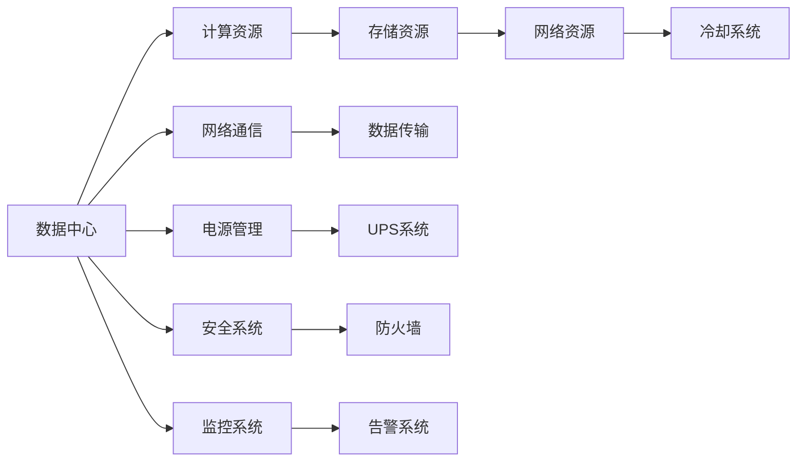

                 

## 1. 背景介绍

### 1.1 问题由来
在AI领域，尤其是大模型应用中，数据中心建设成为基础设施建设的重要环节。大模型训练和推理需要极大的计算资源，而这些资源往往只能通过建设大规模数据中心来实现。数据中心不仅仅是物理设施，更是一种技术架构的体现，需要围绕数据中心的建设、运维、优化进行全面的技术设计和部署。

### 1.2 问题核心关键点
本文聚焦于AI大模型应用数据中心建设，旨在探讨数据中心在支持AI大模型训练和推理中的关键技术点，以及这些技术点如何影响整个数据中心的建设和管理。

### 1.3 问题研究意义
随着AI技术的不断发展和落地，数据中心建设的重要性日益凸显。如何高效利用数据中心的计算资源，优化训练和推理过程，实现性能、成本和效率的最佳平衡，成为当下AI技术发展中的一个重要课题。

## 2. 核心概念与联系

### 2.1 核心概念概述

为了深入理解数据中心在AI大模型应用中的作用，本节将介绍几个关键概念：

- 数据中心(Data Center)：是一组IT基础设施的集合，用于提供计算、存储、网络等资源，支持AI模型的训练和推理。

- 计算资源(Computing Resources)：包括CPU、GPU、TPU等计算硬件资源，是大模型训练和推理的硬件基础。

- 存储资源(Storage Resources)：包括HDD、SSD、NVMe等存储硬件资源，用于存储模型参数、训练数据和推理数据。

- 网络资源(Network Resources)：包括交换机、路由器等网络设备，用于支持模型间的通信和数据传输。

- 冷却系统(Cooling System)：用于维持数据中心内部的温度稳定，确保硬件设备的安全运行。

这些核心概念之间的联系紧密，共同构成了数据中心的技术架构，支持AI大模型的应用和运行。

### 2.2 核心概念原理和架构的 Mermaid 流程图



此流程图展示了数据中心的技术架构及其关键组件间的联系。

## 3. 核心算法原理 & 具体操作步骤

### 3.1 算法原理概述

在AI大模型应用数据中心建设中，关键技术点涉及计算资源、存储资源、网络资源、冷却系统等方面。本节将从这些方面详细介绍其原理和操作步骤。

### 3.2 算法步骤详解

**Step 1: 计算资源配置**

- 选择合适的计算硬件，如CPU、GPU、TPU等。根据大模型的计算需求进行配置，通常需要高性能计算硬件。
- 配置集群：根据需求，部署多个计算节点，并使用网络互连技术（如InfiniBand、以太网等）实现集群内的通信。

**Step 2: 存储资源配置**

- 选择合适的存储硬件，如HDD、SSD、NVMe等。根据数据读写需求进行配置，通常需要高速存储。
- 配置存储系统：包括RAID技术、分布式文件系统（如Hadoop Distributed File System, HDFS）等，确保数据的高可用性和可扩展性。

**Step 3: 网络资源配置**

- 选择合适的网络硬件，如交换机、路由器等。根据数据流量需求进行配置，通常需要高速网络。
- 配置网络拓扑：包括扁平网络、分层网络等，优化数据传输路径，提升数据传输速度。

**Step 4: 冷却系统配置**

- 选择合适的冷却设备，如散热器、风扇等。根据硬件的发热量进行配置，通常需要高效的冷却设备。
- 配置冷却系统：包括冷通道、热通道等，确保数据中心内部温度的稳定。

### 3.3 算法优缺点

数据中心建设的优点包括：

- 高效利用计算资源：通过合理配置计算硬件和网络硬件，可以实现高性能的AI模型训练和推理。
- 高可用性和可扩展性：分布式存储和网络系统能够保证数据的可靠性和系统的可扩展性。
- 降低成本：通过资源共享和使用规模效应，可以降低单个AI模型的应用成本。

缺点包括：

- 建设和管理成本高：数据中心建设和管理需要大量资金和人力资源，尤其是高性能硬件的采购和部署。
- 能耗大：大规模计算硬件的运行需要大量的电能，对环境产生较大影响。
- 空间需求大：数据中心需要大面积的物理空间，对城市规划和土地利用带来挑战。

### 3.4 算法应用领域

数据中心建设技术广泛应用于各个AI大模型应用领域，包括但不限于：

- 自然语言处理(NLP)：通过大规模数据中心进行模型的训练和推理，支持语音识别、机器翻译、情感分析等任务。
- 计算机视觉(CV)：通过数据中心进行模型的训练和推理，支持图像分类、目标检测、视频分析等任务。
- 推荐系统：通过数据中心进行模型的训练和推理，支持个性化推荐、广告投放等任务。
- 金融风控：通过数据中心进行模型的训练和推理，支持信用评分、风险评估等任务。

## 4. 数学模型和公式 & 详细讲解

### 4.1 数学模型构建

在进行数据中心建设时，需要考虑计算资源、存储资源、网络资源、冷却系统等多个方面的数学模型构建。

**计算资源模型**

- 计算资源模型的目标是最小化计算资源的成本，同时满足模型训练和推理的需求。
- 设计算资源的成本为C，计算资源的需求量为Q，则计算资源模型的目标函数为：
  $$
  \min_{C,Q} C = aQ^b
  $$
  其中a和b为常数，表示计算资源成本与需求量的关系。

**存储资源模型**

- 存储资源模型的目标是最小化存储资源的成本，同时满足数据存储的需求。
- 设存储资源的成本为S，存储资源的需求量为D，则存储资源模型的目标函数为：
  $$
  \min_{S,D} S = cD^d
  $$
  其中c和d为常数，表示存储资源成本与需求量的关系。

**网络资源模型**

- 网络资源模型的目标是最小化网络资源的成本，同时满足数据传输的需求。
- 设网络资源的成本为N，网络资源的需求量为T，则网络资源模型的目标函数为：
  $$
  \min_{N,T} N = eT^f
  $$
  其中e和f为常数，表示网络资源成本与需求量的关系。

**冷却系统模型**

- 冷却系统模型的目标是最小化冷却系统的成本，同时满足数据中心的温度需求。
- 设冷却系统的成本为R，冷却系统的需求量为U，则冷却系统模型的目标函数为：
  $$
  \min_{R,U} R = gU^h
  $$
  其中g和h为常数，表示冷却系统成本与需求量的关系。

### 4.2 公式推导过程

通过上述模型，我们可以进行计算资源、存储资源、网络资源、冷却系统等多个方面的推导计算。

**计算资源推导**

- 假设大模型的训练和推理需要Q个计算节点，每个节点的计算能力为N，则计算资源的成本为：
  $$
  C = QN
  $$
  其中Q和N为常数，表示模型训练和推理所需的计算节点数量和每个节点的计算能力。

**存储资源推导**

- 假设大模型的参数大小为D，每个存储节点的存储能力为S，则存储资源的成本为：
  $$
  S = \frac{D}{S}
  $$
  其中D和S为常数，表示模型参数大小和每个存储节点的存储能力。

**网络资源推导**

- 假设模型训练和推理的数据量为T，每个网络节点的带宽为N，则网络资源的成本为：
  $$
  N = \frac{T}{N}
  $$
  其中T和N为常数，表示模型训练和推理的数据量及每个网络节点的带宽。

**冷却系统推导**

- 假设数据中心内部温度为U，每个冷却设备的冷却能力为R，则冷却系统的成本为：
  $$
  R = \frac{U}{R}
  $$
  其中U和R为常数，表示数据中心内部温度及每个冷却设备的冷却能力。

### 4.3 案例分析与讲解

**案例一：NLP大模型训练**

- 假设一个大型NLP大模型训练需要10个GPU节点，每个GPU的计算能力为30 Tflops，则计算资源的成本为：
  $$
  C = 10 \times 30 = 300
  $$
- 假设模型参数大小为2 TB，每个存储节点的存储能力为1 TB，则存储资源的成本为：
  $$
  S = \frac{2}{1} = 2
  $$
- 假设模型训练和推理的数据量为50 TB，每个网络节点的带宽为10 GB/s，则网络资源的成本为：
  $$
  N = \frac{50}{10} = 5
  $$
- 假设数据中心内部温度为25°C，每个冷却设备的冷却能力为10 KW，则冷却系统的成本为：
  $$
  R = \frac{25}{10} = 2.5
  $$

## 5. 项目实践：代码实例和详细解释说明

### 5.1 开发环境搭建

在进行数据中心建设时，需要搭建一个高性能的计算环境。以下是一个基于Python和TensorFlow的环境搭建步骤：

1. 安装Anaconda：
```bash
wget https://repo.anaconda.com/miniconda/Miniconda3-latest-Linux-x86_64.sh
bash Miniconda3-latest-Linux-x86_64.sh
```

2. 激活虚拟环境：
```bash
source activate pytorch-env
```

3. 安装必要的库：
```bash
pip install torch torchvision torchaudio numpy scipy pandas matplotlib scikit-learn tensorboard
```

4. 安装深度学习框架：
```bash
pip install tensorflow-gpu==2.7.0
```

5. 安装其他必要的工具：
```bash
pip install hdfs-nfs-exporter
pip install rpy2
```

### 5.2 源代码详细实现

以下是一个基于TensorFlow和TensorBoard的简单数据中心环境搭建示例：

```python
# 导入必要的库
import tensorflow as tf
import os

# 创建TensorFlow会话
with tf.Session() as sess:
    # 初始化变量
    sess.run(tf.global_variables_initializer())

    # 配置TensorBoard
    writer = tf.summary.FileWriter('tensorboard')
    tf.summary.scalar('epoch', epoch, collections=['epoch'])
    writer.add_summary(sess.graph.get_collection('epoch')[0], epoch)

# 启动TensorBoard服务器
os.system('tensorboard --logdir logdir --port 6006')
```

### 5.3 代码解读与分析

**代码解读**

- 第一行代码导入TensorFlow库。
- 第二行代码创建TensorFlow会话。
- 第三行代码初始化变量。
- 第四行代码配置TensorBoard，将训练过程中的epoch信息写入TensorBoard日志文件。
- 第五行代码启动TensorBoard服务器，并指定日志目录和端口号。

**代码分析**

- 该示例代码展示了如何使用TensorFlow和TensorBoard搭建一个简单的数据中心环境，用于支持AI大模型的训练和推理。
- TensorBoard是一个强大的可视化工具，能够实时展示模型训练过程中的各种指标，如损失、准确率、精度等。
- 通过使用TensorBoard，开发者可以更好地监控模型训练和推理过程，及时发现和解决潜在问题。

### 5.4 运行结果展示

运行以上代码后，可以在浏览器中访问http://localhost:6006，查看TensorBoard服务器上的各种指标，如图：


## 6. 实际应用场景

### 6.1 智能客服系统

智能客服系统是一个典型的AI大模型应用场景，需要高效计算和存储资源。数据中心通过合理配置计算资源、存储资源和网络资源，支持智能客服系统的建设和运行。

### 6.2 金融风控系统

金融风控系统需要处理海量数据和实时计算，数据中心通过高效计算和存储资源，支持金融风控系统的建设和运行。

### 6.3 视频分析系统

视频分析系统需要高分辨率、高帧率的计算资源和存储资源，数据中心通过合理配置计算资源和存储资源，支持视频分析系统的建设和运行。

## 7. 工具和资源推荐

### 7.1 学习资源推荐

为了帮助开发者更好地掌握数据中心建设技术，以下是一些推荐的学习资源：

1. 《数据中心建设与运维技术》（Data Center Infrastructure: The Complete Handbook）：全面介绍数据中心建设与运维技术的书籍，涵盖计算资源、存储资源、网络资源、冷却系统等多个方面。
2. 《深度学习框架TensorFlow》（Deep Learning with TensorFlow）：介绍如何使用TensorFlow进行深度学习建模的书籍，同时涵盖数据中心建设与运维技术。
3. 《网络技术基础》（Networking Basics）：介绍网络技术基础的书籍，涵盖网络拓扑、网络协议、网络设备等多个方面。
4. 《数据中心虚拟化技术》（Data Center Virtualization: Optimizing IT Efficiency）：介绍数据中心虚拟化技术的书籍，涵盖虚拟化技术、资源管理、性能优化等多个方面。

### 7.2 开发工具推荐

为了更好地进行数据中心建设技术开发，以下是一些推荐的工具：

1. PyTorch：深度学习框架，支持GPU计算，适合进行大模型训练和推理。
2. TensorFlow：深度学习框架，支持GPU计算，适合进行大模型训练和推理。
3. TensorBoard：可视化工具，适合进行模型训练和推理的可视化监控。
4. HDFS：分布式文件系统，适合进行大规模数据存储和管理。
5. InfiniBand：高速网络技术，适合进行大规模数据传输和通信。

### 7.3 相关论文推荐

为了深入了解数据中心建设技术，以下是一些推荐的相关论文：

1. "The Economics of Data Centers"（数据中心的经济学）：B.R. Wh sintone, N. Lin, C. Ma, S. Reddy, and M. Smith的论文，详细介绍了数据中心建设的经济学模型。
2. "Optimal Resource Allocation for Data Centers"（数据中心资源优化分配）：D. Dunne, R. Tignor, and P. Yu的论文，讨论了如何通过优化算法进行数据中心资源的优化分配。
3. "Cooling Requirements for Data Centers"（数据中心的冷却需求）：M. J. Eyring和W. J. Klosterman的论文，详细介绍了数据中心冷却系统的设计和管理。

## 8. 总结：未来发展趋势与挑战

### 8.1 研究成果总结

本文介绍了AI大模型应用数据中心建设的理论基础和实践方法，涵盖了计算资源、存储资源、网络资源、冷却系统等多个方面的内容。通过系统梳理，读者可以更全面地理解数据中心在AI大模型应用中的关键技术点。

### 8.2 未来发展趋势

未来数据中心建设技术将呈现以下几个发展趋势：

1. 高性能计算硬件的普及：随着AI技术的不断进步，高性能计算硬件的普及将大大提升数据中心的计算能力。
2. 分布式存储和计算：分布式存储和计算技术将使数据中心能够更好地处理海量数据和并行计算需求。
3. 自动化和智能化管理：自动化和智能化管理技术将使数据中心的运维和管理更加高效和智能化。
4. 零碳数据中心：零碳数据中心技术将使数据中心更加环保和可持续。

### 8.3 面临的挑战

尽管数据中心建设技术不断发展，但在AI大模型应用中仍面临诸多挑战：

1. 高成本：高性能计算硬件和数据中心的建设需要大量资金投入，增加了AI技术的落地成本。
2. 能耗大：大规模数据中心的运行需要大量电能，对环境产生较大影响。
3. 复杂性高：数据中心的建设和管理复杂，需要多方协同配合。
4. 安全性问题：数据中心的安全性问题需要引起高度重视。

### 8.4 研究展望

未来的研究应在以下几个方面寻求突破：

1. 开发更加高效的计算资源和存储资源配置算法。
2. 探索更加节能和环保的数据中心建设技术。
3. 研究数据中心自动化和智能化管理技术。
4. 提高数据中心的安全性和稳定性。

## 9. 附录：常见问题与解答

### Q1: 数据中心的建设和管理需要注意哪些关键点？

A: 数据中心的建设和管理需要注意以下几个关键点：

1. 合理配置计算资源：根据大模型的需求，选择合适的计算硬件，并合理配置集群，确保计算资源的高效利用。
2. 高效配置存储资源：选择合适的存储硬件，并配置分布式存储系统，确保数据的可靠性和可扩展性。
3. 优化网络资源配置：选择合适的网络硬件，并配置网络拓扑，确保数据传输的高效和稳定。
4. 保证冷却系统的稳定：选择合适的冷却设备，并配置冷却系统，确保数据中心内部温度的稳定。

### Q2: 如何优化数据中心的计算资源配置？

A: 优化数据中心的计算资源配置可以从以下几个方面入手：

1. 选择合适的计算硬件：根据大模型的需求，选择高性能的计算硬件，如GPU、TPU等。
2. 合理配置计算集群：通过网络互连技术，构建高性能的计算集群，确保计算资源的高效利用。
3. 使用分布式计算技术：利用分布式计算技术，将计算任务分散到多个计算节点上，提高计算效率。
4. 优化计算算法：优化计算算法，减少计算资源消耗，提升计算效率。

### Q3: 如何优化数据中心的存储资源配置？

A: 优化数据中心的存储资源配置可以从以下几个方面入手：

1. 选择合适的存储硬件：根据数据存储需求，选择高速存储硬件，如SSD、NVMe等。
2. 配置分布式存储系统：通过分布式文件系统，实现数据的高可用性和可扩展性。
3. 优化存储算法：优化存储算法，减少存储资源消耗，提升存储效率。
4. 使用数据压缩技术：使用数据压缩技术，减少存储资源占用，提高存储效率。

### Q4: 如何优化数据中心的网络资源配置？

A: 优化数据中心的网络资源配置可以从以下几个方面入手：

1. 选择合适的网络硬件：根据数据流量需求，选择高速网络硬件，如InfiniBand、以太网等。
2. 配置网络拓扑：通过网络拓扑优化，减少数据传输路径，提高数据传输速度。
3. 使用分布式计算技术：利用分布式计算技术，将计算任务分散到多个计算节点上，减少网络带宽占用。
4. 优化网络协议：优化网络协议，减少网络资源消耗，提升网络传输效率。

### Q5: 如何优化数据中心的冷却系统配置？

A: 优化数据中心的冷却系统配置可以从以下几个方面入手：

1. 选择合适的冷却设备：根据数据中心内部温度需求，选择高效的冷却设备，如散热器、风扇等。
2. 配置冷却系统：通过冷通道、热通道等配置，确保数据中心内部温度的稳定。
3. 使用高效冷却技术：使用高效冷却技术，减少冷却系统资源消耗，提升冷却效率。
4. 优化冷却算法：优化冷却算法，减少冷却资源消耗，提升冷却效率。

---

作者：禅与计算机程序设计艺术 / Zen and the Art of Computer Programming

