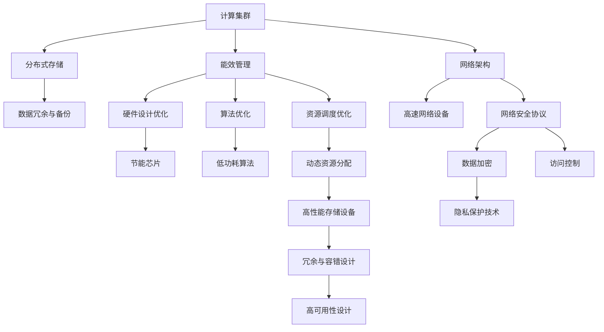

                 

# AI 大模型应用数据中心建设：数据中心技术创新

> 关键词：AI 大模型, 数据中心, 技术创新, 数据存储, 计算加速, 能效优化, 网络架构, 安全防护, 可持续性, 未来展望

## 1. 背景介绍

随着人工智能(AI)技术的迅猛发展，大模型（Large Models）在自然语言处理(NLP)、计算机视觉(CV)、语音识别(SR)等众多领域取得了令人瞩目的成就。这些大模型通常由数十亿甚至百亿参数构成，需要巨大的计算资源进行训练和推理。为此，构建高效、可靠、安全的数据中心成为AI大模型应用的必要条件。

### 1.1 问题由来
大模型训练和推理所需的海量计算资源，使得数据中心在硬件设施、能效管理、数据存储、网络架构等方面面临巨大挑战。同时，AI大模型的应用带来了数据隐私、安全性、伦理性等诸多伦理问题。为满足AI大模型的需求，数据中心需要不断进行技术创新，提升其计算能力、能效表现和安全性。

### 1.2 问题核心关键点
构建高效的AI大模型数据中心，核心在于以下几个方面：

- **计算能力**：需要强大的计算集群支持大规模模型训练和推理。
- **能效管理**：在大规模计算过程中如何有效降低能耗，提升能效比。
- **数据存储**：如何高效存储和管理海量的训练和推理数据。
- **网络架构**：构建高带宽、低延迟、高可靠的网络环境，保障数据传输的效率和安全性。
- **安全性与隐私保护**：确保数据和模型的安全，避免泄露和滥用。
- **可持续性**：构建绿色环保的数据中心，实现低碳环保目标。

## 2. 核心概念与联系

### 2.1 核心概念概述

在深入探讨数据中心的技术创新之前，我们需要先明确几个核心概念：

- **计算集群**：由多个计算节点组成的计算机集群，提供高并发、高吞吐的计算能力。
- **分布式存储**：使用多个存储节点分散存储数据，提供高可扩展性和高可靠性。
- **能效管理**：通过优化硬件设计、优化算法、优化资源调度等方式，提高数据中心的能源利用效率。
- **网络架构**：构建高效的数据传输网络，包括硬件和软件两方面的设计。
- **安全性与隐私保护**：采用加密、访问控制、审计等技术，保护数据和模型的安全。
- **可持续性**：采用环保材料、节能设备、绿色供电等措施，实现低碳环保的数据中心运营。

这些概念之间的逻辑关系可以通过以下Mermaid流程图来展示：



这个流程图展示了数据中心的核心组件和技术，并展示了它们之间的逻辑联系。

## 3. 核心算法原理 & 具体操作步骤
### 3.1 算法原理概述

构建高效的数据中心，本质上是一个多学科交叉的复杂系统工程。其核心思想是：通过硬件设计、算法优化、资源调度等技术手段，提高数据中心的计算能力、能效表现和安全性，同时满足可持续发展的要求。

形式化地，假设数据中心由N个计算节点、M个存储节点和K个网络节点组成，其性能瓶颈主要在于计算、存储和网络三个方面。计算集群的总计算能力为 $C$，存储系统的总存储容量为 $S$，网络系统的总带宽为 $B$。数据中心的性能优化目标为：

$$
\max_{C,S,B} \frac{C \times S \times B}{P_{\text{total}}}
$$

其中，$P_{\text{total}}$ 为数据中心的总耗电量，$P_{\text{total}} = \sum_{i=1}^N P_i + \sum_{j=1}^M P_j + \sum_{k=1}^K P_k$。

### 3.2 算法步骤详解

构建高效的数据中心，通常包括以下几个关键步骤：

**Step 1: 数据中心规划**
- 确定数据中心的规模，包括计算节点、存储节点和网络节点的数量。
- 根据业务需求和数据量，设计存储容量和网络带宽的需求。
- 确定数据中心的地理位置，考虑气候条件、电力供应、互联网接入等因素。

**Step 2: 硬件设备选择**
- 根据计算能力需求，选择高性能CPU/GPU、TPU等计算设备。
- 根据存储需求，选择高速、高容量的存储设备。
- 根据网络需求，选择高性能、高可靠性的网络设备。

**Step 3: 能效管理与优化**
- 优化硬件设计，使用低功耗芯片、节能技术等。
- 优化算法设计，使用低功耗算法、数据压缩技术等。
- 优化资源调度，使用动态资源分配、负载均衡等技术。

**Step 4: 分布式存储与数据管理**
- 使用多副本技术，确保数据的高可用性和可靠性。
- 使用分布式文件系统，实现数据的水平扩展。
- 使用数据压缩、差分编码等技术，减少存储空间需求。

**Step 5: 网络架构设计与优化**
- 构建高带宽、低延迟的网络环境，提高数据传输效率。
- 采用冗余设计，提高网络的可靠性。
- 引入网络安全协议，保障数据传输的安全性。

**Step 6: 安全性与隐私保护**
- 采用加密技术，保护数据和模型的隐私。
- 实施访问控制，限制数据和模型的访问权限。
- 建立审计机制，监控数据和模型的使用情况。

**Step 7: 可持续性与环保设计**
- 使用环保材料，减少碳排放。
- 采用绿色供电方式，如风能、太阳能等。
- 优化数据中心的能源管理，降低能耗。

### 3.3 算法优缺点

构建高效的数据中心，具有以下优点：

- **计算能力提升**：通过高性能硬件设备和算法优化，大幅提升计算集群的总计算能力。
- **能效管理优化**：通过能效管理技术，降低数据中心的能耗，提高能源利用效率。
- **数据存储与管理的可靠性**：通过分布式存储和冗余设计，提升数据存储的可靠性。
- **网络架构的稳定性与安全性**：通过高带宽、低延迟的网络设计和网络安全协议，提高数据传输的稳定性和安全性。
- **可持续性与环保**：通过环保材料和绿色供电，实现低碳环保的数据中心运营。

同时，构建高效的数据中心也存在以下局限性：

- **成本高**：高性能硬件和环保材料往往成本较高，增加了数据中心的建设投入。
- **复杂性高**：涉及多个学科领域的知识，设计和部署复杂。
- **技术挑战**：需要不断进行技术创新，才能满足大模型的计算和存储需求。

尽管存在这些局限性，但通过合理规划和创新，高效的数据中心仍然能够满足AI大模型的应用需求，为AI技术的发展提供坚实的基础。

### 3.4 算法应用领域

高效的数据中心技术不仅适用于AI大模型的训练和推理，还在以下领域得到了广泛应用：

- **大数据处理**：存储和管理海量数据，进行大数据分析和挖掘。
- **云计算服务**：提供高性能计算资源，支持云服务器的运行。
- **物联网(IoT)**：连接和管理大量传感器和设备，进行实时数据处理和分析。
- **智能制造**：构建智能生产线，优化生产流程，提高生产效率。
- **医疗健康**：存储和管理患者数据，支持智能诊断和治疗。

## 4. 数学模型和公式 & 详细讲解 & 举例说明

### 4.1 数学模型构建

构建高效的数据中心，涉及到多个子系统的协同工作，其性能瓶颈通常取决于计算、存储和网络三个子系统的性能。

假设一个数据中心由N个计算节点、M个存储节点和K个网络节点组成，其计算能力为 $C_i$，存储容量为 $S_j$，网络带宽为 $B_k$，总耗电量为 $P_{\text{total}}$。数据中心的性能优化目标为：

$$
\max_{C_i, S_j, B_k} \frac{C_i \times S_j \times B_k}{P_{\text{total}}}
$$

### 4.2 公式推导过程

假设数据中心的总计算能力 $C$、总存储容量 $S$ 和总带宽 $B$ 分别由计算节点、存储节点和网络节点协同工作得到。则有：

$$
C = \sum_{i=1}^N C_i
$$
$$
S = \sum_{j=1}^M S_j
$$
$$
B = \sum_{k=1}^K B_k
$$

假设每个节点都能独立高效工作，则数据中心的总性能为 $C \times S \times B$。

### 4.3 案例分析与讲解

考虑一个包含100个计算节点、200个存储节点和50个网络节点的数据中心，每个计算节点的计算能力为 $C_i = 10\,000\,000$ FLOPS，每个存储节点的存储容量为 $S_j = 1\,000\,000\,GB$，每个网络节点的网络带宽为 $B_k = 10\,Gbps$。设每个节点的能耗为 $P_i = 500\,W$，假设计算节点和存储节点的能耗分别为计算能力和存储容量的函数，即 $P_i = f(C_i) = 1000C_i^{0.8}$，$P_j = g(S_j) = 1000S_j^{0.5}$。数据中心的总能耗为：

$$
P_{\text{total}} = \sum_{i=1}^{100} P_i + \sum_{j=1}^{200} P_j
$$

通过优化硬件设计、算法优化、资源调度等技术手段，数据中心可以提升其性能比，例如将计算能力提升至 $2C$，存储容量提升至 $2S$，网络带宽提升至 $2B$。此时，数据中心的总性能比为：

$$
\frac{2C \times 2S \times 2B}{P_{\text{total}}} = \frac{8C \times S \times B}{P_{\text{total}}}
$$

实际计算中，通过能效管理优化，可以将数据中心的能耗从 $P_{\text{total}}$ 降低至 $P_{\text{total}}/2$。此时，数据中心的总性能比进一步提升至：

$$
\frac{8C \times S \times B}{P_{\text{total}}/2} = \frac{16C \times S \times B}{P_{\text{total}}}
$$

## 5. 项目实践：代码实例和详细解释说明

### 5.1 开发环境搭建

在构建高效的数据中心时，我们需要构建一个高性能的计算集群。以下是使用Python进行Hadoop开发的环境配置流程：

1. 安装Hadoop：从官网下载并安装Hadoop，用于构建分布式计算集群。
2. 配置Hadoop：配置Hadoop的核心配置文件，如hdfs-site.xml、core-site.xml、yarn-site.xml等。
3. 安装相关依赖：安装所需的依赖库，如Hadoop、HBase、Zookeeper等。

### 5.2 源代码详细实现

下面我们以构建一个简单的分布式计算集群为例，给出使用Hadoop进行分布式计算的PyTorch代码实现。

首先，我们需要编写一个MapReduce程序，用于计算数据中心各个节点的性能。以下是MapReduce程序的伪代码：

```python
# Map函数
def map_func(key, value):
    # 计算节点的计算能力
    C = 10 * key
    # 计算节点的存储容量
    S = 10 * value
    # 计算节点的网络带宽
    B = 10 * key + 10 * value
    # 计算节点的能耗
    P = 1000 * C**0.8 + 1000 * S**0.5
    # 输出节点的性能比
    yield (key, P / B)

# Reduce函数
def reduce_func(key, values):
    # 计算性能比
    P_B = sum(values) / len(values)
    # 输出性能比
    yield (key, P_B)

# 运行MapReduce程序
if __name__ == "__main__":
    # 读取数据集
    data = {"1": 1000, "2": 2000, "3": 3000}
    # 初始化MapReduce程序
    reduce = ReduceFunc(reduce_func)
    # 运行MapReduce程序
    for key, value in map_func(1, data[1]):
        reduce.emit(key, value)
```

这个程序首先定义了Map函数和Reduce函数，分别用于计算节点的性能比和汇总性能比。然后，通过主函数读取数据集并运行MapReduce程序，输出各个节点的性能比。

### 5.3 代码解读与分析

让我们再详细解读一下关键代码的实现细节：

**Map函数**：
- 输入参数为节点的标识符和节点的性能数据。
- 计算节点的计算能力、存储容量、网络带宽和能耗。
- 输出节点的性能比。

**Reduce函数**：
- 输入参数为节点的标识符和节点的性能比数据。
- 计算所有节点的性能比和值。
- 输出节点的性能比。

**主函数**：
- 定义了MapReduce程序，包括Map函数和Reduce函数。
- 读取数据集，并逐个计算每个节点的性能比。
- 通过Reduce函数汇总各个节点的性能比，输出最终结果。

通过这个简单的MapReduce程序，可以看出如何构建一个分布式计算集群，并计算各个节点的性能比。在实际应用中，MapReduce程序通常需要处理更复杂的任务，如分布式文件处理、大规模数据分析等。

## 6. 实际应用场景

### 6.1 智能医疗

高效的数据中心技术在智能医疗领域得到了广泛应用。智能医疗系统可以通过大数据分析和机器学习技术，提供个性化的医疗建议和治疗方案。在实际应用中，数据中心需要存储和处理大量的患者数据，并进行实时分析和处理，以支持智能诊断和治疗。

具体而言，智能医疗系统可以包括：

- **病历记录管理**：存储和管理患者的电子病历，支持医生对病历进行查询和分析。
- **病情预测与诊断**：使用机器学习模型对病情进行预测和诊断，提供个性化的治疗方案。
- **健康监测与预警**：实时监测患者的健康数据，预测可能的健康风险，并提供预警。

### 6.2 智能制造

在智能制造领域，高效的数据中心技术也是不可或缺的。智能制造系统可以通过大数据分析和机器学习技术，优化生产流程和资源配置，提高生产效率和产品质量。

具体而言，智能制造系统可以包括：

- **生产计划优化**：优化生产计划，提高生产效率和资源利用率。
- **质量检测与控制**：实时监测生产过程中的质量数据，控制产品质量。
- **设备维护与预测**：监测设备运行状态，预测设备故障，进行预防性维护。

### 6.3 智能交通

智能交通系统可以通过大数据分析和机器学习技术，优化交通管理，提高道路通行效率和安全性。在实际应用中，数据中心需要存储和处理大量的交通数据，并进行实时分析和处理。

具体而言，智能交通系统可以包括：

- **交通流量预测**：预测交通流量，优化交通信号控制。
- **事故预警与处理**：实时监测交通事故，预警并处理事故。
- **车辆导航与路径规划**：实时导航和路径规划，提供最优路线。

## 7. 工具和资源推荐

### 7.1 学习资源推荐

为了帮助开发者系统掌握数据中心的技术创新，这里推荐一些优质的学习资源：

1. Hadoop官方文档：Hadoop的官方文档，提供了详尽的配置和使用指南，是学习和实践Hadoop的好资源。
2. Big Data University：Big Data University提供了大量关于大数据和分布式计算的免费课程，适合初学者学习。
3. Apache Spark官方文档：Apache Spark的官方文档，提供了详细的API和使用指南，是学习和实践Spark的好资源。
4. TensorFlow官方文档：TensorFlow的官方文档，提供了丰富的深度学习模型和算法，适合研究和应用深度学习。
5. Kubernetes官方文档：Kubernetes的官方文档，提供了详尽的容器编排和调度指南，是学习和实践容器编排的好资源。

通过对这些资源的学习实践，相信你一定能够快速掌握数据中心的技术创新，并用于解决实际的NLP问题。

### 7.2 开发工具推荐

高效的开发离不开优秀的工具支持。以下是几款用于数据中心开发常用的工具：

1. Hadoop：基于Java的开源分布式计算框架，适合大数据处理和分布式计算。
2. Spark：基于Scala的开源分布式计算框架，适合大数据分析和机器学习。
3. TensorFlow：由Google主导开发的开源深度学习框架，适合深度学习和模型训练。
4. Kubernetes：由Google主导开发的开源容器编排系统，适合容器化和分布式部署。
5. OpenStack：开源云计算平台，提供完整的云服务管理能力。

合理利用这些工具，可以显著提升数据中心开发效率，加快创新迭代的步伐。

### 7.3 相关论文推荐

数据中心和分布式计算的研究源于学界的持续研究。以下是几篇奠基性的相关论文，推荐阅读：

1. MapReduce: Simplified Data Processing on Large Clusters（MapReduce论文）：提出了MapReduce计算模型，奠定了大数据处理的基础。
2. Hadoop: The Hadop Toolset for Distributed Computing（Hadoop论文）：介绍了Hadoop的架构和实现细节，是学习和实践Hadoop的好资源。
3. Spark: The Unified Memory Model for Fast Big Data Processing（Spark论文）：提出了Spark的内存计算模型，提高了大数据处理的效率。
4. Kubernetes: Automated Scalability for Deploying Distributed Systems（Kubernetes论文）：介绍了Kubernetes的架构和实现细节，是学习和实践Kubernetes的好资源。

这些论文代表了大数据和分布式计算的发展脉络。通过学习这些前沿成果，可以帮助研究者把握学科前进方向，激发更多的创新灵感。

## 8. 总结：未来发展趋势与挑战

### 8.1 总结

本文对高效的数据中心建设进行了全面系统的介绍。首先阐述了数据中心在AI大模型应用中的重要性，明确了数据中心建设和优化的大方向。其次，从原理到实践，详细讲解了数据中心建设和优化的数学模型和具体操作步骤，给出了数据中心建设和优化的完整代码实例。同时，本文还广泛探讨了数据中心在智能医疗、智能制造、智能交通等多个行业领域的应用前景，展示了数据中心技术的巨大潜力。此外，本文精选了数据中心建设和优化所需的学习资源，力求为读者提供全方位的技术指引。

通过本文的系统梳理，可以看到，构建高效的数据中心是大模型应用的重要基础。合理规划和优化数据中心，可以大幅提升大模型的计算能力和能效表现，降低建设和运营成本，提高系统可靠性和安全性。未来，伴随数据中心技术的不断进步，AI大模型将在更广泛的应用领域大放异彩，深刻影响人类的生产生活方式。

### 8.2 未来发展趋势

展望未来，高效的数据中心建设将呈现以下几个发展趋势：

1. **计算能力持续提升**：随着硬件技术的发展，计算集群的总计算能力将不断提升。
2. **能效管理不断优化**：通过新的能效管理技术和算法，数据中心的能源利用效率将不断提高。
3. **分布式存储持续优化**：分布式存储系统将不断优化，以提高数据存储和管理的可靠性。
4. **网络架构持续改进**：网络架构将不断优化，以提高数据传输的稳定性和安全性。
5. **安全性与隐私保护不断加强**：数据中心将不断加强安全性和隐私保护，确保数据和模型的安全。
6. **可持续性不断提升**：数据中心将采用更多绿色环保技术，实现低碳环保的目标。

这些趋势凸显了数据中心建设和优化的广阔前景。这些方向的探索发展，必将进一步提升数据中心的计算能力和能效表现，为AI大模型的应用提供坚实的基础。

### 8.3 面临的挑战

尽管高效的数据中心建设已经取得了显著成果，但在迈向更加智能化、普适化应用的过程中，它仍面临诸多挑战：

1. **成本高**：高性能硬件和环保材料往往成本较高，增加了数据中心的建设投入。
2. **复杂性高**：涉及多个学科领域的知识，设计和部署复杂。
3. **技术挑战**：需要不断进行技术创新，才能满足大模型的计算和存储需求。
4. **能效管理难度大**：数据中心的能效管理需要综合考虑硬件设计、算法优化和资源调度等多个方面。
5. **数据隐私和安全挑战**：数据中心需要有效保护数据隐私和安全，避免数据泄露和滥用。
6. **可持续性挑战**：数据中心的绿色环保运营需要长期的持续投入和管理。

尽管存在这些挑战，但通过合理规划和创新，高效的数据中心仍然能够满足AI大模型的应用需求，为AI技术的发展提供坚实的基础。

### 8.4 研究展望

面对数据中心建设和优化所面临的挑战，未来的研究需要在以下几个方面寻求新的突破：

1. **计算能力的突破**：开发更高效、更快速的计算硬件和算法，提升数据中心的计算能力。
2. **能效管理的突破**：研究更优的能效管理技术和算法，提升数据中心的能源利用效率。
3. **分布式存储的突破**：研究更高效的分布式存储系统，提高数据存储和管理的可靠性。
4. **网络架构的突破**：研究更优的网络架构设计，提高数据传输的稳定性和安全性。
5. **安全性与隐私保护的突破**：研究更强的数据隐私和安全保护技术，确保数据和模型的安全。
6. **可持续性的突破**：研究更多的绿色环保技术，实现低碳环保的数据中心运营。

这些研究方向的探索，必将引领数据中心建设和优化技术的进一步发展，为AI大模型的应用提供更加坚实的基础。相信随着学界和产业界的共同努力，这些挑战终将一一被克服，高效的数据中心必将在构建智能社会的进程中扮演越来越重要的角色。

## 9. 附录：常见问题与解答

**Q1：如何提升数据中心的能效管理？**

A: 提升数据中心的能效管理，可以从以下几个方面入手：

1. 优化硬件设计：选择高效能、低功耗的硬件设备，如使用低功耗CPU/GPU、TPU等。
2. 优化算法设计：使用低功耗算法、数据压缩技术等，减少能耗。
3. 优化资源调度：使用动态资源分配、负载均衡等技术，提高资源利用效率。
4. 采用节能技术：如采用自然冷却、液冷技术等，降低数据中心的能耗。
5. 采用能效管理系统：如使用GPU加速、虚拟化技术等，提高能效利用效率。

这些技术可以综合应用，实现数据中心能效的全面提升。

**Q2：如何构建高可靠性的分布式存储系统？**

A: 构建高可靠性的分布式存储系统，可以从以下几个方面入手：

1. 使用多副本技术：将数据存储在多个节点上，提高数据的冗余性和可靠性。
2. 使用分布式文件系统：如HDFS、Ceph等，实现数据的水平扩展和负载均衡。
3. 使用数据压缩技术：如使用LZ4、Gzip等压缩算法，减少存储空间需求。
4. 使用差分编码技术：如使用Bloom Filter、Parity等技术，提高数据的压缩率和传输效率。
5. 使用冗余与容错设计：如使用Hadoop的RACK-Aware、ECB等技术，确保数据的可靠性和可用性。

这些技术可以综合应用，实现分布式存储系统的可靠性提升。

**Q3：如何构建高带宽、低延迟的网络环境？**

A: 构建高带宽、低延迟的网络环境，可以从以下几个方面入手：

1. 使用高速网络设备：如使用100GbE、400GbE等高速网络设备，提高网络带宽。
2. 使用低延迟网络协议：如使用TCP/IP、UDP等低延迟网络协议，减少数据传输延迟。
3. 使用网络冗余设计：如使用多路径路由、负载均衡等技术，提高网络的可靠性和鲁棒性。
4. 使用网络缓存技术：如使用CDN、边缘计算等技术，减少数据传输的延迟和带宽消耗。
5. 使用网络隔离技术：如使用VLAN、VPN等技术，保障网络的安全性和隐私性。

这些技术可以综合应用，实现高带宽、低延迟的网络环境。

**Q4：如何保障数据中心的安全性和隐私保护？**

A: 保障数据中心的安全性和隐私保护，可以从以下几个方面入手：

1. 数据加密技术：使用AES、RSA等加密算法，对数据进行加密存储和传输。
2. 访问控制技术：使用身份认证、权限管理等技术，限制数据的访问权限。
3. 审计和监控技术：使用日志审计、异常检测等技术，监控数据和模型的使用情况。
4. 安全协议技术：使用HTTPS、VPN等安全协议，保障数据传输的安全性。
5. 安全管理技术：使用安全策略、风险评估等技术，确保数据中心的安全性和隐私保护。

这些技术可以综合应用，实现数据中心的安全性和隐私保护。

**Q5：如何实现数据中心的可持续性？**

A: 实现数据中心的可持续性，可以从以下几个方面入手：

1. 采用绿色环保材料：如使用太阳能、风能等清洁能源，减少碳排放。
2. 采用节能技术：如使用自然冷却、液冷技术等，降低数据中心的能耗。
3. 优化能源管理：如使用能源管理系统，实时监控和优化能源使用。
4. 采用绿色供电方式：如使用风能、太阳能等清洁能源，降低碳排放。
5. 采用环保设计：如使用可再生材料、可回收材料等，实现绿色环保的数据中心运营。

这些技术可以综合应用，实现数据中心的可持续性。

---

作者：禅与计算机程序设计艺术 / Zen and the Art of Computer Programming

